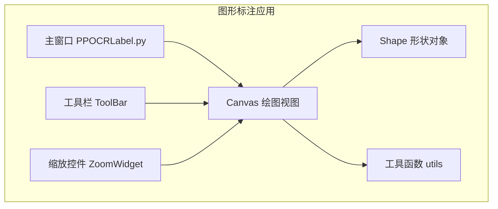
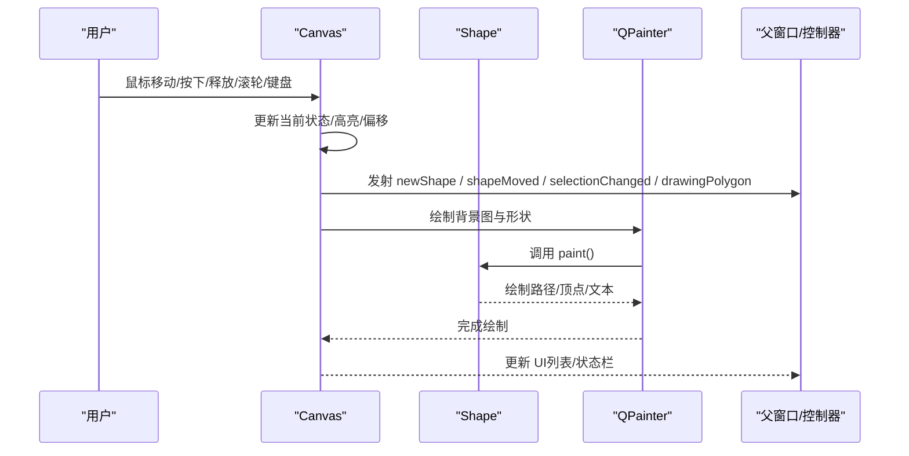
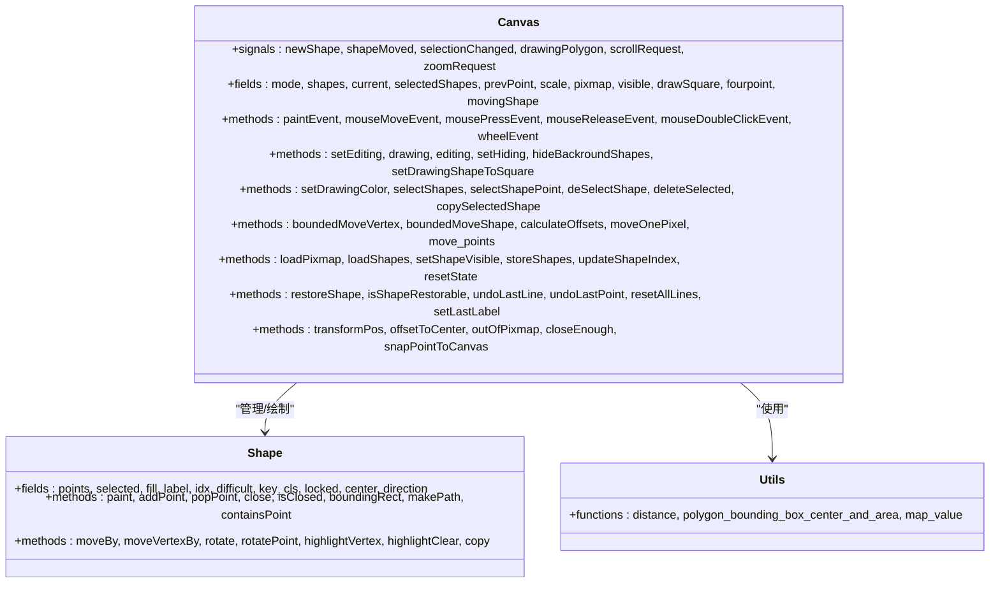

# Canvas 类 API

<cite>
**本文引用的文件**
- [libs/canvas.py](file://libs/canvas.py)
- [libs/shape.py](file://libs/shape.py)
- [libs/utils.py](file://libs/utils.py)
- [libs/constants.py](file://libs/constants.py)
- [libs/zoomWidget.py](file://libs/zoomWidget.py)
- [libs/toolBar.py](file://libs/toolBar.py)
</cite>

## 目录
1. [简介](#简介)
2. [项目结构](#项目结构)
3. [核心组件](#核心组件)
4. [架构总览](#架构总览)
5. [详细组件分析](#详细组件分析)
6. [依赖关系分析](#依赖关系分析)
7. [性能考量](#性能考量)
8. [故障排查指南](#故障排查指南)
9. [结论](#结论)
10. [附录](#附录)

## 简介
本文件为 Canvas 类的完整 API 参考文档，覆盖图形绘制视图的所有公共接口。内容包括：
- 绘图方法：createShape、createSquare、createPolygon 的参数与用法
- 鼠标事件处理：mouseMoveEvent、mousePressEvent、mouseReleaseEvent、mouseDoubleClickEvent
- 键盘快捷键响应：keyPressEvent 中的按键行为
- 缩放与平移：wheelEvent、pan 模式、scrollRequest 信号
- 信号系统：newShape、shapeMoved、selectionChanged、drawingPolygon、scrollRequest、zoomRequest
- 渲染流程：paintEvent、resizeEvent（继承自 QWidget）
- 坐标转换与几何计算：transformPos、offsetToCenter、outOfPixmap、closeEnough、snapPointToCanvas
- 辅助方法：setDrawingColor、setEditing、drawing、editing、setHiding、hideBackroundShapes、selectShapes、selectShapePoint、deSelectShape、deleteSelected、copySelectedShape、restoreShape、undoLastLine、undoLastPoint、resetAllLines、setLastLabel、loadPixmap、loadShapes、setShapeVisible、storeShapes、updateShapeIndex、setDrawingShapeToSquare、setLastLabel、resetState、currentCursor、overrideCursor、restoreCursor、isShapeRestorable

## 项目结构
Canvas 类位于图形标注系统的绘图视图层，负责：
- 接收用户输入（鼠标、键盘）
- 维护形状集合与当前绘制状态
- 触发信号以通知上层更新列表与状态
- 使用 QPainter 进行渲染，支持缩放与平移

图表来源
- [libs/canvas.py](file://libs/canvas.py#L32-L969)
- [libs/shape.py](file://libs/shape.py#L35-L285)
- [libs/utils.py](file://libs/utils.py#L104-L105)
- [libs/zoomWidget.py](file://libs/zoomWidget.py#L19-L35)
- [libs/toolBar.py](file://libs/toolBar.py#L18-L48)

章节来源
- [libs/canvas.py](file://libs/canvas.py#L32-L969)

## 核心组件
- Canvas：继承自 QWidget，提供绘图、交互、渲染与状态管理
- Shape：封装单个标注形状的几何、绘制与高亮逻辑
- 工具函数：distance、polygon_bounding_box_center_and_area、map_value 等
- 控件：ZoomWidget（缩放）、ToolBar（工具栏）

章节来源
- [libs/canvas.py](file://libs/canvas.py#L32-L969)
- [libs/shape.py](file://libs/shape.py#L35-L285)
- [libs/utils.py](file://libs/utils.py#L104-L105)
- [libs/zoomWidget.py](file://libs/zoomWidget.py#L19-L35)
- [libs/toolBar.py](file://libs/toolBar.py#L18-L48)

## 架构总览
Canvas 通过信号与槽与上层交互，内部维护 shapes 列表与当前绘制状态，使用 QPainter 在缩放与平移变换后绘制。

图表来源
- [libs/canvas.py](file://libs/canvas.py#L129-L325)
- [libs/canvas.py](file://libs/canvas.py#L571-L660)
- [libs/shape.py](file://libs/shape.py#L142-L211)

## 详细组件分析

### Canvas 类公共接口

#### 1. 构造与初始化
- __init__(...)：初始化模式、形状集合、当前绘制线、光标、菜单、焦点策略、缩放与平移状态等
- 关键字段：mode、shapes、current、selectedShapes、prevPoint、scale、pixmap、visible、drawSquare、fourpoint、movingShape、lockedShapes 等

章节来源
- [libs/canvas.py](file://libs/canvas.py#L48-L90)

#### 2. 绘图与渲染
- paintEvent(event)：核心渲染入口
  - 设置抗锯齿与高质量渲染
  - 应用缩放与平移变换
  - 绘制背景图与各形状
  - 绘制当前绘制线与矩形预览
  - 绘制填充的四点绘制预览
  - 绘制垂直/水平参考线
  - 根据 pixmap 尺寸动态设置字体大小
- resizeEvent：继承自 QWidget，Canvas 通过 minimumSizeHint/sizeHint 提供尺寸建议
- minimumSizeHint()/sizeHint()：返回基于 pixmap 与 scale 的最小尺寸

章节来源
- [libs/canvas.py](file://libs/canvas.py#L571-L714)

#### 3. 鼠标事件处理
- mouseMoveEvent(ev)：更新坐标显示、绘制模式下的线段与吸附、右键拖拽复制、左键拖拽顶点或整体、无按钮时的悬停高亮与平移滚动
- mousePressEvent(ev)：左键开始/结束绘制、编辑模式下选择形状；右键多选
- mouseReleaseEvent(ev)：右键菜单取消、左键释放后的移动结束、pan 结束
- mouseDoubleClickEvent(ev)：双击闭合四点绘制（非四点模式下弹回一步）

章节来源
- [libs/canvas.py](file://libs/canvas.py#L129-L398)

#### 4. 键盘快捷键响应
- keyPressEvent(ev)：Esc 取消当前绘制；Return 闭合形状；方向键移动选中形状；Z/X/C/V/B 顶点选择；X 旋转（正负）；撤销/重做备份
- 支持 Ctrl+方向键进行像素级移动
- 支持 Ctrl+Z（撤销）与 Ctrl+Shift+Z（重做）等组合键

章节来源
- [libs/canvas.py](file://libs/canvas.py#L737-L809)

#### 5. 缩放与平移
- wheelEvent(ev)：按住 Ctrl 时发射 zoomRequest（滚轮增量），否则发射 scrollRequest（水平/垂直）
- pan 模式：无按钮时拖拽触发 scrollRequest 并更新
- 缩放控制：通过外部控件（如 ZoomWidget）与 zoomRequest 信号联动

章节来源
- [libs/canvas.py](file://libs/canvas.py#L715-L736)
- [libs/zoomWidget.py](file://libs/zoomWidget.py#L19-L35)

#### 6. 形状管理与绘制
- setEditing(value=True)/drawing()/editing()：切换编辑/绘制模式
- setHiding(enable=True)/hideBackroundShapes(value)：隐藏背景形状
- setDrawingShapeToSquare(status)：启用/禁用方形绘制
- setDrawingColor(qColor)：设置绘制颜色
- 四点绘制：fourpoint=true 时逐点添加，双击完成
- 方形绘制：drawSquare=true 时两点确定矩形
- handleDrawing(pos)：四点模式下的逐点绘制逻辑
- finalise()：完成当前绘制并追加到 shapes

章节来源
- [libs/canvas.py](file://libs/canvas.py#L113-L120)
- [libs/canvas.py](file://libs/canvas.py#L343-L350)
- [libs/canvas.py](file://libs/canvas.py#L943-L944)
- [libs/canvas.py](file://libs/canvas.py#L91-L93)
- [libs/canvas.py](file://libs/canvas.py#L170-L179)
- [libs/canvas.py](file://libs/canvas.py#L351-L384)
- [libs/canvas.py](file://libs/canvas.py#L682-L698)

#### 7. 选择与操作
- selectShapes(shapes)/selectShapePoint(point, multiple_selection_mode)：选择形状与顶点
- deSelectShape()：取消选择
- deleteSelected()：删除选中形状
- copySelectedShape()：复制选中形状并移动
- endMove(copy=False)：结束移动（复制或就地移动）
- boundedMoveVertex(pos)/boundedMoveShape(shapes, pos)：边界约束移动
- calculateOffsets(shape, point)：计算偏移用于整体移动
- moveOnePixel(direction)/move_points(p)：像素级移动与顶点移动
- rotateOutOfBound(angle)/rotate 正负旋转：围绕中心旋转并检查越界

章节来源
- [libs/canvas.py](file://libs/canvas.py#L399-L424)
- [libs/canvas.py](file://libs/canvas.py#L406-L424)
- [libs/canvas.py](file://libs/canvas.py#L523-L543)
- [libs/canvas.py](file://libs/canvas.py#L553-L558)
- [libs/canvas.py](file://libs/canvas.py#L326-L341)
- [libs/canvas.py](file://libs/canvas.py#L447-L494)
- [libs/canvas.py](file://libs/canvas.py#L495-L521)
- [libs/canvas.py](file://libs/canvas.py#L425-L431)
- [libs/canvas.py](file://libs/canvas.py#L818-L854)
- [libs/canvas.py](file://libs/canvas.py#L810-L817)
- [libs/canvas.py](file://libs/canvas.py#L818-L809)

#### 8. 数据加载与状态恢复
- loadPixmap(pixmap)：加载背景图并清空 shapes
- loadShapes(shapes, replace=True)：加载形状集合
- setShapeVisible(shape, value)：控制形状可见性
- storeShapes()/updateShapeIndex()：备份与索引更新
- resetState()：重置状态与光标
- restoreShape()/isShapeRestorable：撤销/重做
- undoLastLine()/undoLastPoint()/resetAllLines()：撤销绘制步骤

章节来源
- [libs/canvas.py](file://libs/canvas.py#L899-L916)
- [libs/canvas.py](file://libs/canvas.py#L917-L920)
- [libs/canvas.py](file://libs/canvas.py#L545-L552)
- [libs/canvas.py](file://libs/canvas.py#L965-L969)
- [libs/canvas.py](file://libs/canvas.py#L937-L942)
- [libs/canvas.py](file://libs/canvas.py#L946-L958)
- [libs/canvas.py](file://libs/canvas.py#L871-L898)

#### 9. 公共绘图方法
- createShape：在编辑模式下创建新形状（由上层调用）
- createSquare：启用方形绘制模式并创建矩形
- createPolygon：四点绘制模式并创建多边形

注意：上述三个方法在 Canvas 类中未直接定义，但通过 setEditing、setDrawingShapeToSquare、fourpoint 等状态配合实现。具体调用通常由上层窗口控制器触发。

章节来源
- [libs/canvas.py](file://libs/canvas.py#L113-L120)
- [libs/canvas.py](file://libs/canvas.py#L943-L944)
- [libs/canvas.py](file://libs/canvas.py#L170-L179)

#### 10. 信号系统
- newShape：新增形状时发射
- shapeMoved：形状移动/旋转/顶点移动时发射
- selectionChanged：选择变化时发射（参数为选中形状列表）
- drawingPolygon：开始/结束绘制时发射（布尔值）
- scrollRequest：平移请求（方向与增量）
- zoomRequest：缩放请求（滚轮增量）

章节来源
- [libs/canvas.py](file://libs/canvas.py#L33-L39)
- [libs/canvas.py](file://libs/canvas.py#L217-L218)
- [libs/canvas.py](file://libs/canvas.py#L730-L731)

#### 11. 坐标转换与几何计算
- transformPos(point)：从控件坐标系转换到绘制坐标系
- offsetToCenter()：计算居中偏移
- outOfPixmap(p)：判断点是否超出 pixmap
- closeEnough(p1, p2)：距离阈值判断
- snapPointToCanvas(x, y)：将点限制在画布边界内
- distance(p)：向量模长（工具函数）

章节来源
- [libs/canvas.py](file://libs/canvas.py#L665-L680)
- [libs/canvas.py](file://libs/canvas.py#L669-L676)
- [libs/canvas.py](file://libs/canvas.py#L678-L680)
- [libs/canvas.py](file://libs/canvas.py#L699-L703)
- [libs/canvas.py](file://libs/canvas.py#L433-L445)
- [libs/utils.py](file://libs/utils.py#L104-L105)

#### 12. 辅助方法与工具
- setLastLabel(text, line_color=None, fill_color=None, key_cls=None)：为最后一个形状设置标签与颜色
- currentCursor()/overrideCursor(cursor)/restoreCursor()：光标管理
- setDrawingColor(qColor)：设置绘制颜色
- setEditing(value)/drawing()/editing()：模式切换
- setHiding(enable)/hideBackroundShapes(value)：隐藏背景形状
- selectShapes(shapes)/selectShapePoint(point, multiple_selection_mode)/deSelectShape()：选择与取消选择
- deleteSelected()/copySelectedShape()：删除与复制
- storeShapes()/updateShapeIndex()：备份与索引
- resetState()：重置状态
- setDrawingShapeToSquare(status)：方形绘制开关
- loadPixmap(pixmap)/loadShapes(shapes, replace=True)/setShapeVisible(shape, value)：加载与可见性
- restoreShape()/isShapeRestorable：撤销/重做
- undoLastLine()/undoLastPoint()/resetAllLines()：撤销绘制步骤

章节来源
- [libs/canvas.py](file://libs/canvas.py#L855-L869)
- [libs/canvas.py](file://libs/canvas.py#L921-L936)
- [libs/canvas.py](file://libs/canvas.py#L91-L93)
- [libs/canvas.py](file://libs/canvas.py#L113-L120)
- [libs/canvas.py](file://libs/canvas.py#L343-L350)
- [libs/canvas.py](file://libs/canvas.py#L399-L424)
- [libs/canvas.py](file://libs/canvas.py#L523-L543)
- [libs/canvas.py](file://libs/canvas.py#L545-L552)
- [libs/canvas.py](file://libs/canvas.py#L937-L942)
- [libs/canvas.py](file://libs/canvas.py#L943-L944)
- [libs/canvas.py](file://libs/canvas.py#L899-L920)
- [libs/canvas.py](file://libs/canvas.py#L946-L958)
- [libs/canvas.py](file://libs/canvas.py#L871-L898)

### Shape 类（与 Canvas 协作）
- 绘制：paint(painter)，绘制路径、顶点、文本标签与索引
- 几何：addPoint、popPoint、close、isClosed、boundingRect、makePath、containsPoint
- 移动：moveBy、moveVertexBy、rotate、rotatePoint
- 高亮：highlightVertex、highlightClear
- 复制：copy

章节来源
- [libs/shape.py](file://libs/shape.py#L142-L211)
- [libs/shape.py](file://libs/shape.py#L122-L141)
- [libs/shape.py](file://libs/shape.py#L236-L247)
- [libs/shape.py](file://libs/shape.py#L248-L253)
- [libs/shape.py](file://libs/shape.py#L91-L104)
- [libs/shape.py](file://libs/shape.py#L261-L275)

### 工具函数与常量
- distance(p)：向量模长
- polygon_bounding_box_center_and_area(points)：多边形包围盒中心与面积
- map_value(x, in_min, in_max, out_min, out_max)：数值映射
- SETTING_DRAW_SQUARE：配置项键名（方形绘制）

章节来源
- [libs/utils.py](file://libs/utils.py#L104-L105)
- [libs/utils.py](file://libs/utils.py#L373-L403)
- [libs/utils.py](file://libs/utils.py#L406-L412)
- [libs/constants.py](file://libs/constants.py#L30)

## 依赖关系分析

图表来源
- [libs/canvas.py](file://libs/canvas.py#L32-L969)
- [libs/shape.py](file://libs/shape.py#L35-L285)
- [libs/utils.py](file://libs/utils.py#L104-L105)

## 性能考量
- 抗锯齿与高质量渲染：paintEvent 中启用抗锯齿与高质量渲染，提升视觉效果但增加 CPU/GPU 开销
- 缩放与平移：通过 scale 与 translate 实现，避免重绘整图
- 边界检查：outOfPixmap 与 boundedMove* 避免无效绘制与越界
- 备份策略：最多保留最近 10 次 shapesBackups，平衡内存占用与撤销能力
- 字体自适应：根据 pixmap 尺寸动态设置字体大小，保证标签可读性

[本节为通用指导，无需特定文件来源]

## 故障排查指南
- 绘制无法开始：确认处于绘制模式且未超出 pixmap 边界
- 选择异常：检查 isVisible 与 setHiding，确保背景形状未被隐藏
- 移动越界：boundedMove* 会阻止越界，必要时检查 outOfPixmap 与 calculateOffsets
- 撤销/重做无效：确认 shapesBackups 是否存在，isShapeRestorable 返回值
- 缩放/平移无响应：确认 zoomRequest/scrollRequest 是否被正确连接到父窗口

章节来源
- [libs/canvas.py](file://libs/canvas.py#L343-L350)
- [libs/canvas.py](file://libs/canvas.py#L495-L521)
- [libs/canvas.py](file://libs/canvas.py#L946-L958)
- [libs/canvas.py](file://libs/canvas.py#L959-L963)

## 结论
Canvas 类提供了完整的图形标注视图能力，涵盖绘制、编辑、选择、移动、缩放、平移与渲染。通过清晰的信号机制与状态管理，能够与上层控制器高效协作，满足 OCR 标注场景的复杂需求。

[本节为总结，无需特定文件来源]

## 附录

### 常用方法速查
- 绘图与模式：setEditing、setDrawingShapeToSquare、setDrawingColor、fourpoint、drawSquare
- 选择与操作：selectShapes、selectShapePoint、deSelectShape、deleteSelected、copySelectedShape、boundedMoveVertex、boundedMoveShape
- 撤销与恢复：undoLastLine、undoLastPoint、resetAllLines、restoreShape、isShapeRestorable
- 加载与状态：loadPixmap、loadShapes、setShapeVisible、storeShapes、updateShapeIndex、resetState
- 坐标与几何：transformPos、offsetToCenter、outOfPixmap、closeEnough、snapPointToCanvas、distance
- 渲染与尺寸：paintEvent、minimumSizeHint、sizeHint

章节来源
- [libs/canvas.py](file://libs/canvas.py#L91-L93)
- [libs/canvas.py](file://libs/canvas.py#L113-L120)
- [libs/canvas.py](file://libs/canvas.py#L343-L350)
- [libs/canvas.py](file://libs/canvas.py#L399-L424)
- [libs/canvas.py](file://libs/canvas.py#L523-L543)
- [libs/canvas.py](file://libs/canvas.py#L553-L558)
- [libs/canvas.py](file://libs/canvas.py#L871-L898)
- [libs/canvas.py](file://libs/canvas.py#L946-L958)
- [libs/canvas.py](file://libs/canvas.py#L899-L920)
- [libs/canvas.py](file://libs/canvas.py#L545-L552)
- [libs/canvas.py](file://libs/canvas.py#L965-L969)
- [libs/canvas.py](file://libs/canvas.py#L665-L680)
- [libs/utils.py](file://libs/utils.py#L104-L105)