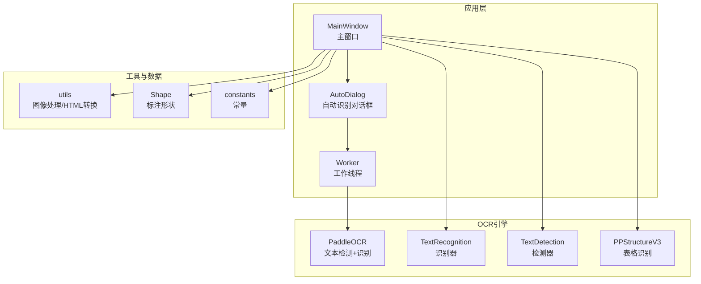
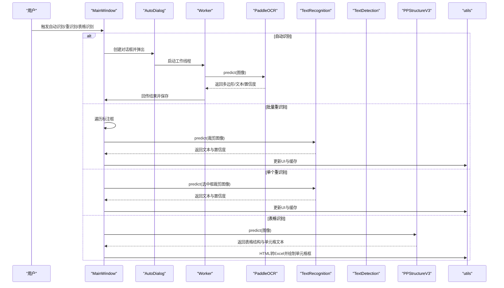
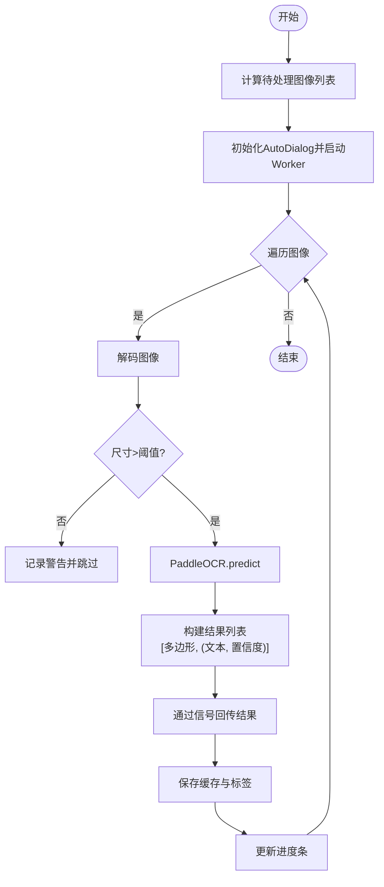
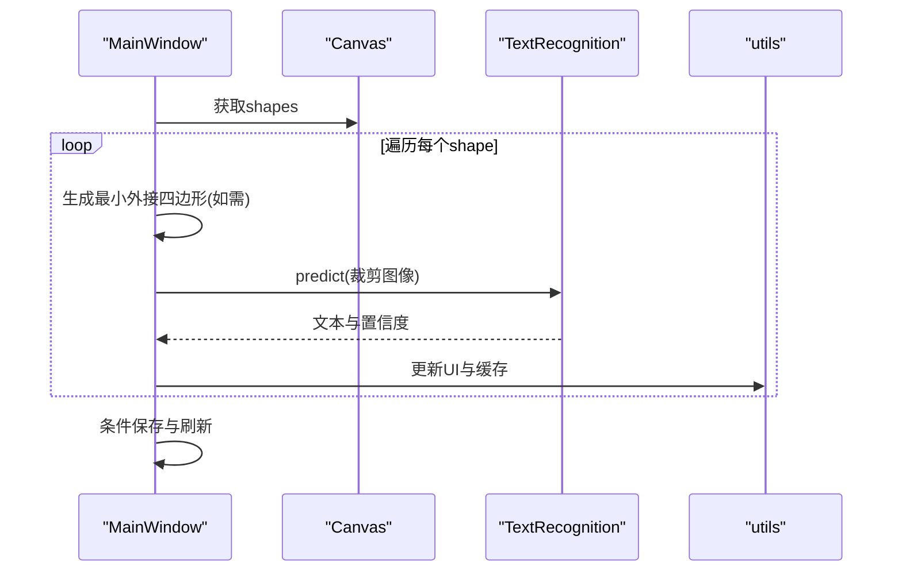
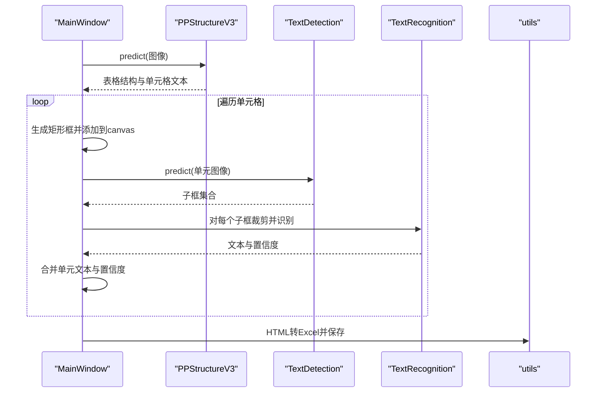
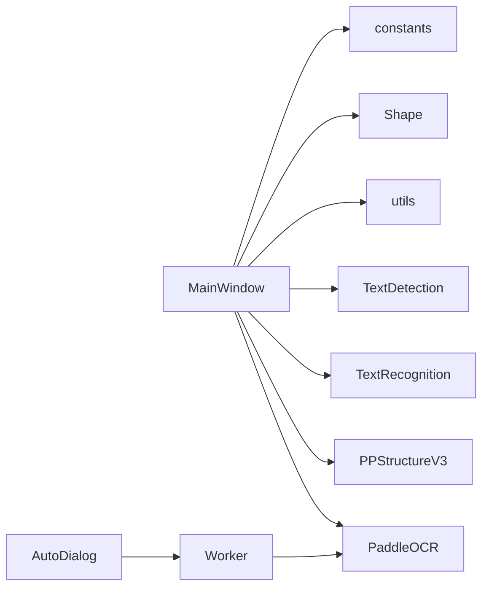

# OCR识别 API

<cite>
**本文引用的文件**
- [PPOCRLabel.py](file://PPOCRLabel.py)
- [libs/utils.py](file://libs/utils.py)
- [libs/autoDialog.py](file://libs/autoDialog.py)
- [libs/shape.py](file://libs/shape.py)
- [libs/constants.py](file://libs/constants.py)
- [README.md](file://README.md)
</cite>

## 目录
1. [简介](#简介)
2. [项目结构](#项目结构)
3. [核心组件](#核心组件)
4. [架构总览](#架构总览)
5. [详细组件分析](#详细组件分析)
6. [依赖关系分析](#依赖关系分析)
7. [性能考虑](#性能考虑)
8. [故障排除指南](#故障排除指南)
9. [结论](#结论)
10. [附录](#附录)

## 简介
本文件面向使用者与开发者，系统性梳理 PPOCRLabel 中的 OCR 识别相关 API，涵盖：
- 自动识别 autoRecognition
- 批量重识别 reRecognition
- 单个重识别 singleRerecognition
- 表格识别 TableRecognition
- PaddleOCR 集成方式与模型配置参数
- 识别精度控制与后处理逻辑
- 错误恢复机制
- 性能优化建议与故障排除

## 项目结构
该项目基于 PyQt5 构建图形界面，集成了 PaddleOCR 的文本检测与识别能力，并扩展了表格识别与导出功能。关键模块如下：
- 主窗口与识别流程：PPOCRLabel.py
- 工具函数与图像处理：libs/utils.py
- 自动识别对话框与线程：libs/autoDialog.py
- 图像标注形状对象：libs/shape.py
- 常量定义：libs/constants.py
- 使用说明与模型配置：README.md

图表来源
- [PPOCRLabel.py](file://PPOCRLabel.py#L143-L250)
- [libs/autoDialog.py](file://libs/autoDialog.py#L22-L101)
- [libs/utils.py](file://libs/utils.py#L1-L413)
- [libs/shape.py](file://libs/shape.py#L35-L285)
- [libs/constants.py](file://libs/constants.py#L1-L33)

章节来源
- [PPOCRLabel.py](file://PPOCRLabel.py#L143-L250)
- [README.md](file://README.md#L1-L356)

## 核心组件
- PaddleOCR 集成
  - 文本检测与识别：PaddleOCR 实例化时设置设备、语言、模型名称等参数；同时提供独立的 TextRecognition 和 TextDetection 实例用于表格单元内细粒度识别。
  - 表格识别：PPStructureV3 实例化时启用表格识别，禁用公式、图表等其他能力。
- 自动识别
  - 通过 AutoDialog 弹窗与 Worker 线程执行批量识别，逐图预测并将结果写入缓存与标签文件。
- 批量重识别
  - 对当前图像所有标注框进行重识别，覆盖原有识别结果。
- 单个重识别
  - 对选中的标注框进行重识别，支持四边形与矩形框。
- 表格识别
  - 调用 PPStructureV3 进行表格结构识别，生成 Excel 并在界面绘制单元格框。
- 数据结构与后处理
  - 识别结果以多边形坐标与文本、置信度组成；表格识别结果包含单元格文本与 HTML 结构，转换为 Excel 导出。

章节来源
- [PPOCRLabel.py](file://PPOCRLabel.py#L194-L232)
- [libs/autoDialog.py](file://libs/autoDialog.py#L22-L101)
- [PPOCRLabel.py](file://PPOCRLabel.py#L2923-L3040)
- [PPOCRLabel.py](file://PPOCRLabel.py#L3078-L3268)
- [libs/utils.py](file://libs/utils.py#L256-L271)

## 架构总览
下图展示 OCR 识别在主窗口中的调用链路与数据流。

图表来源
- [PPOCRLabel.py](file://PPOCRLabel.py#L2923-L3040)
- [PPOCRLabel.py](file://PPOCRLabel.py#L3078-L3268)
- [libs/autoDialog.py](file://libs/autoDialog.py#L22-L101)
- [libs/utils.py](file://libs/utils.py#L256-L271)

## 详细组件分析

### 自动识别 autoRecognition
- 功能概述
  - 在指定范围内对未标记完成的图像执行自动识别，仅对状态为“未完成”的图像进行处理。
  - 通过 AutoDialog 展示进度条与识别结果预览，Worker 线程异步执行预测与保存。
- 关键流程
  - 计算待处理图像列表（排除已标记完成的图像）
  - 初始化 AutoDialog 并启动 Worker 线程
  - Worker 逐图解码、过滤小尺寸图像、调用 PaddleOCR.predict 获取多边形、文本、置信度
  - 将结果序列化为字符串并回传到主线程，更新缓存与标签文件
- 数据结构
  - Worker 返回结果为列表，元素为 [多边形坐标, (文本, 置信度)]
- 错误处理
  - 小图像尺寸过滤与警告日志
  - 无法识别时记录警告并跳过该图
- 性能要点
  - 使用 QThread 与信号槽避免阻塞 UI
  - 逐图进度计算与剩余时间估算

图表来源
- [PPOCRLabel.py](file://PPOCRLabel.py#L2923-L2954)
- [libs/autoDialog.py](file://libs/autoDialog.py#L22-L101)

章节来源
- [PPOCRLabel.py](file://PPOCRLabel.py#L2923-L2954)
- [libs/autoDialog.py](file://libs/autoDialog.py#L22-L101)

### 批量重识别 reRecognition
- 功能概述
  - 对当前图像中所有标注框执行重识别，覆盖原有识别结果。
  - 支持矩形与四边形框；对四边形框先生成最小外接四边形再裁剪。
- 关键流程
  - 遍历 canvas.shapes
  - 提取框坐标，必要时生成最小外接四边形
  - 裁剪图像并调用 TextRecognition.predict
  - 合并结果，更新 UI 与缓存
- 数据结构
  - 识别结果为 [(文本, 置信度), ...]，表格单元内识别结果按行合并并取平均置信度
- 错误处理
  - 索引异常时记录警告
  - 无标注框时提示“请先绘制框”
- 性能要点
  - 仅在有变化时触发保存与刷新，避免重复写入

图表来源
- [PPOCRLabel.py](file://PPOCRLabel.py#L2957-L3040)
- [libs/utils.py](file://libs/utils.py#L142-L191)

章节来源
- [PPOCRLabel.py](file://PPOCRLabel.py#L2957-L3040)
- [libs/utils.py](file://libs/utils.py#L142-L191)

### 单个重识别 singleRerecognition
- 功能概述
  - 对选中的标注框执行重识别，支持矩形与四边形框。
- 关键流程
  - 遍历 selectedShapes
  - 裁剪并识别，更新对应 shape 的 label 与缓存
- 错误处理
  - 无选中框时提示
  - 识别失败时记录警告

章节来源
- [PPOCRLabel.py](file://PPOCRLabel.py#L3041-L3077)

### 表格识别 TableRecognition
- 功能概述
  - 调用 PPStructureV3 对整图进行表格结构识别，生成 Excel 并在界面绘制单元格框。
- 关键流程
  - 解码图像并调用 table_ocr.predict
  - 遍历识别结果，将每个单元格转换为矩形框并添加到 canvas
  - 将 HTML 结构写入 Excel 文件
  - 单元内细粒度识别：对单元图像先做文本检测，再对每个子框裁剪并识别，按行合并文本并取平均置信度
- 数据结构
  - 表格识别返回包含 table_res_list 的字典，单元格文本与 HTML 结构
- 错误处理
  - 无法识别表格时提示并生成空 Excel
  - 无法识别单元框时提示并返回

图表来源
- [PPOCRLabel.py](file://PPOCRLabel.py#L3078-L3268)
- [libs/utils.py](file://libs/utils.py#L256-L271)

章节来源
- [PPOCRLabel.py](file://PPOCRLabel.py#L3078-L3268)
- [libs/utils.py](file://libs/utils.py#L256-L271)

### PaddleOCR 集成与模型配置
- 设备与语言
  - 自动检测 CUDA 可用性，优先使用 GPU；否则使用 CPU
  - 支持中英文与多语言检测，默认使用轻量级模型
- 模型参数
  - 文本检测模型：PP-OCRv5_mobile_det
  - 文本识别模型：PP-OCRv5_mobile_rec
  - 分类模型：可选（line orientation）
- 自定义模型
  - 支持通过 det_model_dir、rec_model_dir、cls_model_dir 指定自定义模型路径
  - 支持通过 choose 模式切换语言（中英、法、德、韩、日）

章节来源
- [PPOCRLabel.py](file://PPOCRLabel.py#L194-L232)
- [PPOCRLabel.py](file://PPOCRLabel.py#L3390-L3429)
- [README.md](file://README.md#L252-L279)

### 识别结果数据结构与后处理
- 通用识别结果
  - 多边形坐标（numpy 数组转 list 以便序列化）
  - 文本与置信度
- 表格识别结果
  - HTML 结构 tokens 与 cells
  - 单元格文本拼接与合并单元格属性
- 后处理
  - 图像旋转矫正与透视变换
  - HTML 转 Excel 并修复属性格式

章节来源
- [libs/autoDialog.py](file://libs/autoDialog.py#L48-L91)
- [libs/utils.py](file://libs/utils.py#L142-L191)
- [libs/utils.py](file://libs/utils.py#L256-L271)

## 依赖关系分析
- 组件耦合
  - MainWindow 依赖 PaddleOCR、PPStructureV3、TextRecognition、TextDetection
  - AutoDialog 与 Worker 通过信号槽与 MainWindow 交互
  - utils 提供图像处理与 HTML 转换工具
- 外部依赖
  - PaddleOCR、OpenCV、PyQt5、openpyxl
- 潜在循环依赖
  - 无明显循环导入；模块职责清晰

图表来源
- [PPOCRLabel.py](file://PPOCRLabel.py#L143-L250)
- [libs/autoDialog.py](file://libs/autoDialog.py#L22-L101)
- [libs/utils.py](file://libs/utils.py#L1-L413)
- [libs/shape.py](file://libs/shape.py#L35-L285)
- [libs/constants.py](file://libs/constants.py#L1-L33)

章节来源
- [PPOCRLabel.py](file://PPOCRLabel.py#L143-L250)
- [libs/autoDialog.py](file://libs/autoDialog.py#L22-L101)

## 性能考虑
- 设备选择
  - 优先使用 GPU；若无 CUDA，自动降级到 CPU
- 模型选择
  - 使用轻量级移动端模型以提升速度
- 图像预处理
  - 小于阈值的图像跳过识别，减少无效计算
- 线程与 UI
  - 使用 QThread 与信号槽异步处理，避免阻塞 UI
- 批处理策略
  - 自动识别按批次执行，显示剩余时间估计，便于用户感知进度

[本节为通用性能建议，无需特定文件引用]

## 故障排除指南
- 无法加载资源
  - 现象：提示缺失字符串 ID
  - 处理：重新编译资源文件
- OpenCV 版本问题
  - 现象：Linux 下 objc 错误或 xcb 插件加载失败
  - 处理：安装指定版本的 OpenCV 或 headless 版本
- Windows 表格识别缺少模块
  - 现象：缺少 win32com
  - 处理：安装 premailer 与 pywin32
- OpenCV 常见错误
  - 现象：cv2 无 INTER_NEAREST
  - 处理：卸载并重装指定版本的 headless opencv

章节来源
- [README.md](file://README.md#L322-L351)

## 结论
本项目提供了完善的 OCR 识别 API，覆盖自动识别、批量重识别、单个重识别与表格识别四大场景。通过 PaddleOCR 的轻量模型与多语言支持，结合 PyQt5 的交互体验，满足从半自动化标注到表格结构提取的多样化需求。建议在生产环境中优先使用 GPU 推理、合理选择模型与图像预处理策略，并利用异步线程保障 UI 流畅。

[本节为总结性内容，无需特定文件引用]

## 附录

### API 方法一览
- autoRecognition
  - 触发范围：当前索引到指定数量的图像
  - 输入：图像列表（排除已完成标记）
  - 输出：识别结果写入缓存与标签文件
- reRecognition
  - 触发范围：当前图像所有标注框
  - 输入：canvas.shapes
  - 输出：覆盖识别结果并刷新 UI
- singleRerecognition
  - 触发范围：选中的标注框
  - 输入：selectedShapes
  - 输出：更新对应框的识别结果
- TableRecognition
  - 触发范围：当前图像
  - 输入：整图
  - 输出：绘制单元格框并导出 Excel

章节来源
- [PPOCRLabel.py](file://PPOCRLabel.py#L2923-L3040)
- [PPOCRLabel.py](file://PPOCRLabel.py#L3078-L3268)