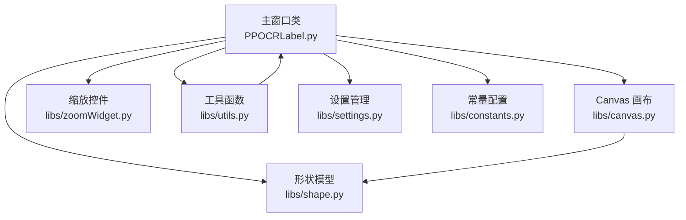
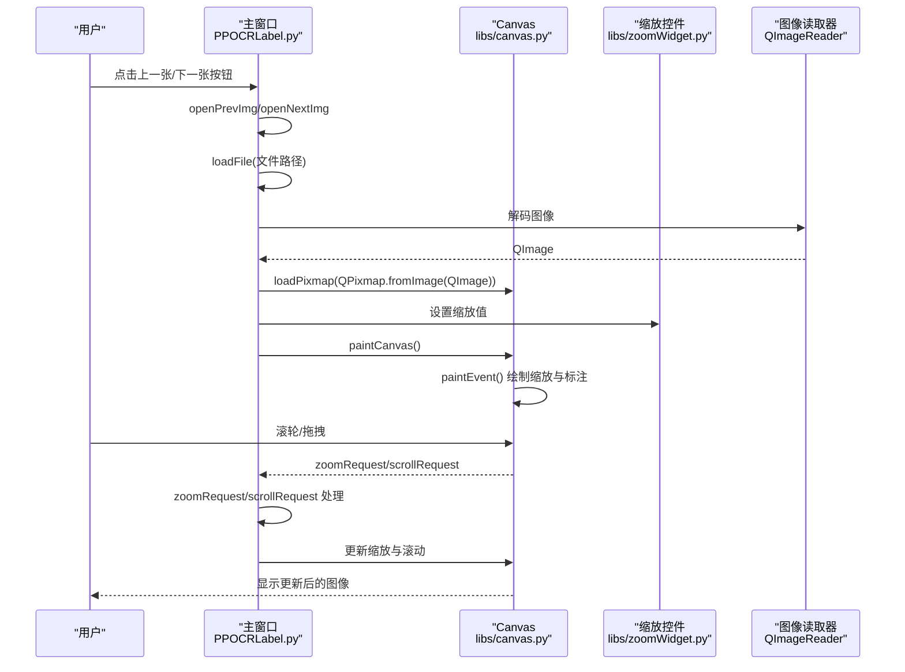
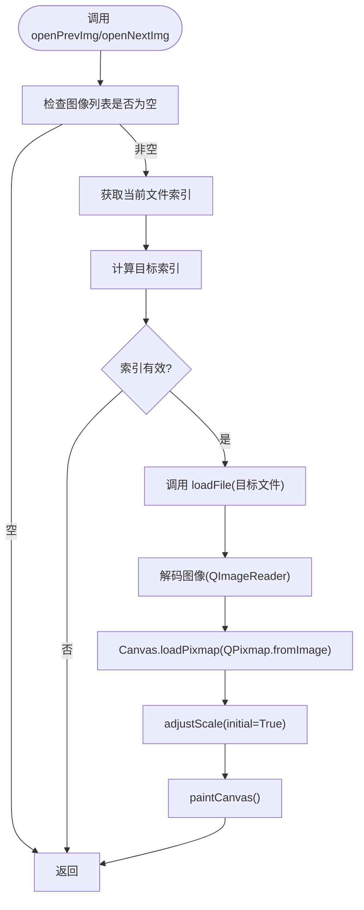
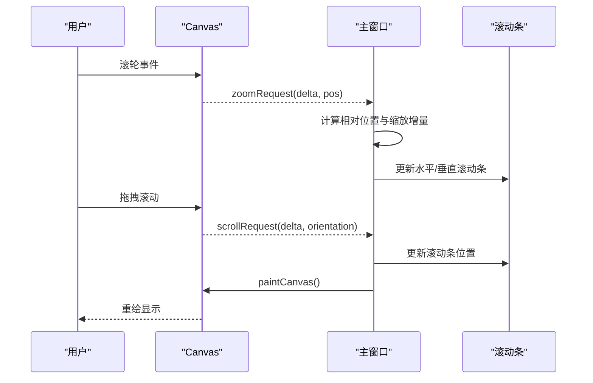
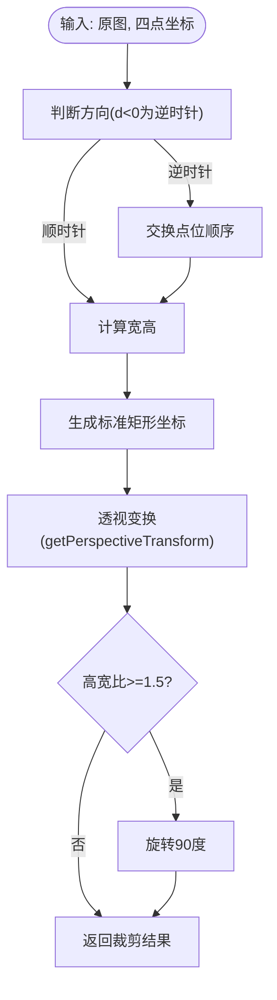
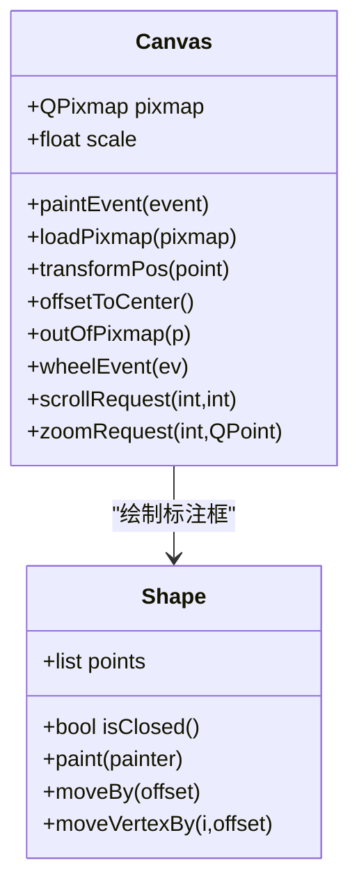
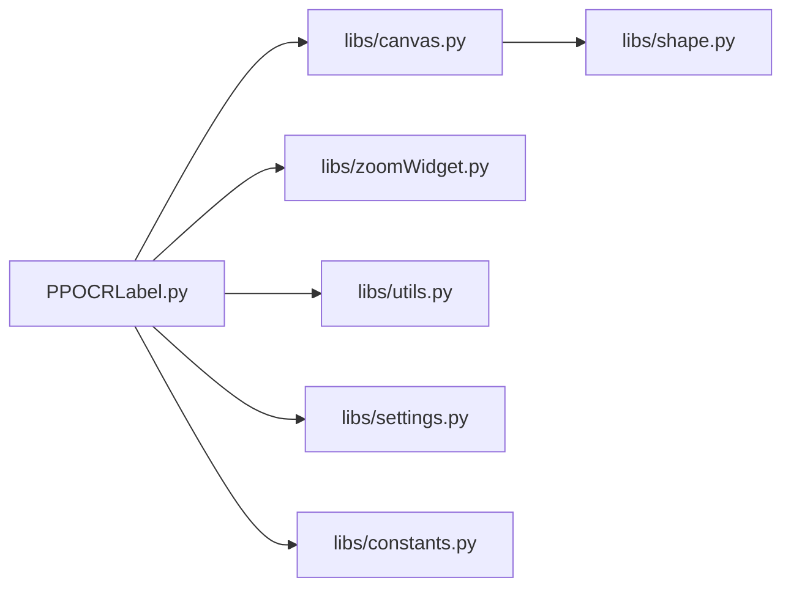

# 图像处理 API

<cite>
**本文档引用的文件**
- [PPOCRLabel.py](file://PPOCRLabel.py)
- [canvas.py](file://libs/canvas.py)
- [zoomWidget.py](file://libs/zoomWidget.py)
- [utils.py](file://libs/utils.py)
- [shape.py](file://libs/shape.py)
- [constants.py](file://libs/constants.py)
- [settings.py](file://libs/settings.py)
- [README.md](file://README.md)
</cite>

## 目录
1. [简介](#简介)
2. [项目结构](#项目结构)
3. [核心组件](#核心组件)
4. [架构总览](#架构总览)
5. [详细组件分析](#详细组件分析)
6. [依赖关系分析](#依赖关系分析)
7. [性能考虑](#性能考虑)
8. [故障排除指南](#故障排除指南)
9. [结论](#结论)

## 简介
本文件面向图像处理相关方法的详细API文档，聚焦于图像加载与导航（openPrevImg、openNextImg、loadFile）、图像缩放与旋转、裁剪功能、图像格式支持、内存管理与性能优化策略，以及图像显示相关的Canvas操作、缩放控件、滚动条处理。同时提供最佳实践与常见问题解决方案，帮助开发者快速理解并高效使用本项目的图像处理能力。

## 项目结构
本项目采用模块化设计，图像处理相关逻辑主要集中在主窗口类、Canvas画布、缩放控件、工具函数与形状模型等模块中：
- 主窗口类负责图像加载、导航、缩放控制、滚动条联动、动作绑定与状态管理
- Canvas负责图像绘制、缩放变换、鼠标交互、形状渲染与滚动请求
- 缩放控件提供数值输入与范围约束
- 工具函数提供图像旋转裁剪、坐标变换等实用方法
- 形状模型定义标注框的几何与渲染行为

图表来源
- [PPOCRLabel.py](file://PPOCRLabel.py#L499-L531)
- [canvas.py](file://libs/canvas.py#L32-L120)
- [zoomWidget.py](file://libs/zoomWidget.py#L19-L35)
- [utils.py](file://libs/utils.py#L142-L191)
- [shape.py](file://libs/shape.py#L35-L120)
- [settings.py](file://libs/settings.py#L21-L62)
- [constants.py](file://libs/constants.py#L13-L33)

章节来源
- [PPOCRLabel.py](file://PPOCRLabel.py#L499-L531)
- [README.md](file://README.md#L1-L356)

## 核心组件
- 图像加载与导航
  - openPrevImg：加载当前图像列表的上一张图像
  - openNextImg：加载当前图像列表的下一张图像
  - loadFile：加载指定文件，更新Canvas、状态栏与最近文件列表
- 图像缩放与旋转
  - zoomRequest：基于滚轮事件计算缩放比例与滚动位置，保持指针相对位置不变
  - setZoom/addZoom：设置/增加缩放百分比
  - adjustScale/scaleFitWindow/scaleFitWidth：根据窗口尺寸与图像宽高比自适应缩放
  - paintCanvas：将缩放值应用到Canvas并触发重绘
- 图像裁剪与旋转
  - get_rotate_crop_image：基于四点坐标进行透视变换与旋转矫正
- Canvas显示与交互
  - loadPixmap：接收QImage并转换为QPixmap用于绘制
  - paintEvent：执行缩放、平移与标注绘制
  - scrollRequest：响应Canvas滚动请求，联动主窗口滚动条
- 缩放控件与滚动条
  - ZoomWidget：数值输入控件，范围1%-500%，与Canvas缩放联动
  - scrollBars：主窗口水平/垂直滚动条，与Canvas滚动请求联动
- 图像格式支持与内存管理
  - 支持格式：通过QImageReader.supportedImageFormats()动态发现
  - 内存管理：图像解码后以QImage/QPixmap形式持有，避免重复解码；Canvas仅缓存当前图像的QPixmap

章节来源
- [PPOCRLabel.py](file://PPOCRLabel.py#L2035-L2324)
- [PPOCRLabel.py](file://PPOCRLabel.py#L2542-L2582)
- [PPOCRLabel.py](file://PPOCRLabel.py#L2109-L2190)
- [canvas.py](file://libs/canvas.py#L571-L660)
- [canvas.py](file://libs/canvas.py#L715-L735)
- [zoomWidget.py](file://libs/zoomWidget.py#L19-L35)
- [utils.py](file://libs/utils.py#L142-L191)

## 架构总览
图像处理流程从用户操作开始，经过主窗口解析与状态更新，最终由Canvas完成绘制与交互。缩放与滚动通过信号槽机制在主窗口与Canvas之间传递。

图表来源
- [PPOCRLabel.py](file://PPOCRLabel.py#L2542-L2582)
- [PPOCRLabel.py](file://PPOCRLabel.py#L2109-L2190)
- [PPOCRLabel.py](file://PPOCRLabel.py#L2035-L2324)
- [canvas.py](file://libs/canvas.py#L571-L660)
- [zoomWidget.py](file://libs/zoomWidget.py#L19-L35)

## 详细组件分析

### 图像加载与导航 API
- openPrevImg
  - 功能：定位当前文件索引，加载上一张图像并调用loadFile
  - 关键点：边界检查、mImgList索引计算、mImgList5更新
  - 触发链路：按钮点击 -> openPrevImg -> loadFile -> Canvas.loadPixmap -> paintCanvas
- openNextImg
  - 功能：定位当前文件索引，加载下一张图像并调用loadFile
  - 关键点：边界检查、索引越界保护、mImgList5更新
  - 触发链路：按钮点击 -> openNextImg -> loadFile -> Canvas.loadPixmap -> paintCanvas
- loadFile
  - 功能：加载指定文件，更新Canvas、状态栏、最近文件列表，触发自适应缩放与重绘
  - 关键点：脏状态检查、错误处理、最近文件保存、标签显示同步
  - 输出：Canvas.pixmap更新，缩放控件与滚动条联动

图表来源
- [PPOCRLabel.py](file://PPOCRLabel.py#L2542-L2582)
- [PPOCRLabel.py](file://PPOCRLabel.py#L2109-L2190)
- [PPOCRLabel.py](file://PPOCRLabel.py#L2306-L2324)

章节来源
- [PPOCRLabel.py](file://PPOCRLabel.py#L2542-L2582)
- [PPOCRLabel.py](file://PPOCRLabel.py#L2109-L2190)

### 图像缩放与滚动 API
- zoomRequest
  - 功能：根据滚轮事件delta与指针位置，计算缩放比例与滚动偏移，保持指针相对位置不变
  - 关键点：获取水平/垂直滚动条最大值，计算指针相对位置，限制0-1范围，更新滚动条
- setZoom/addZoom
  - 功能：设置/增加缩放百分比，联动Canvas缩放与滚动
- adjustScale/scaleFitWindow/scaleFitWidth
  - 功能：根据窗口与图像宽高比计算缩放值，确保无滚动条或按宽度适配
- paintCanvas
  - 功能：将缩放控件值转换为Canvas.scale，触发Canvas重绘
- scrollRequest
  - 功能：Canvas滚动请求信号，主窗口根据delta更新滚动条位置

图表来源
- [PPOCRLabel.py](file://PPOCRLabel.py#L2035-L2324)
- [canvas.py](file://libs/canvas.py#L715-L735)

章节来源
- [PPOCRLabel.py](file://PPOCRLabel.py#L2035-L2324)
- [canvas.py](file://libs/canvas.py#L715-L735)

### 图像裁剪与旋转 API
- get_rotate_crop_image
  - 功能：基于四点坐标进行透视变换，生成标准矩形区域，并根据长宽比判断是否旋转90度
  - 关键点：逆时针/顺时针方向判断、透视矩阵计算、插值与边界处理
  - 返回：裁剪后的图像数组，异常时记录日志

图表来源
- [utils.py](file://libs/utils.py#L142-L191)

章节来源
- [utils.py](file://libs/utils.py#L142-L191)

### Canvas 显示与交互 API
- loadPixmap
  - 功能：接收QImage并转换为QPixmap，设置Canvas.pixmap，触发重绘
- paintEvent
  - 功能：应用scale与offsetToCenter，绘制QPixmap与标注框，启用抗锯齿与平滑变换
- transformPos/offsetToCenter/outOfPixmap
  - 功能：坐标变换、中心偏移计算、边界检测
- wheelEvent
  - 功能：滚轮事件分发，Ctrl+滚轮触发zoomRequest，否则触发scrollRequest

图表来源
- [canvas.py](file://libs/canvas.py#L571-L660)
- [canvas.py](file://libs/canvas.py#L665-L680)
- [canvas.py](file://libs/canvas.py#L715-L735)
- [shape.py](file://libs/shape.py#L142-L211)

章节来源
- [canvas.py](file://libs/canvas.py#L571-L660)
- [canvas.py](file://libs/canvas.py#L665-L680)
- [canvas.py](file://libs/canvas.py#L715-L735)
- [shape.py](file://libs/shape.py#L142-L211)

### 缩放控件与滚动条 API
- ZoomWidget
  - 功能：数值输入控件，范围1%-500%，后缀“%”，居中对齐
  - 联动：主窗口zoomWidget.valueChanged连接到paintCanvas
- 滚动条
  - 功能：主窗口scrollBars维护水平/垂直滚动条，Canvas.scrollRequest触发更新
  - 行为：与Canvas缩放与滚动联动，保持指针相对位置

章节来源
- [zoomWidget.py](file://libs/zoomWidget.py#L19-L35)
- [PPOCRLabel.py](file://PPOCRLabel.py#L522-L527)

## 依赖关系分析
- 主窗口与Canvas
  - 主窗口持有Canvas实例，通过信号槽连接zoomRequest/scrollRequest
  - Canvas通过paintEvent绘制，主窗口通过paintCanvas统一应用缩放
- 主窗口与工具函数
  - 主窗口调用get_rotate_crop_image进行裁剪与旋转
  - 主窗口调用scanAllImages扫描支持的图像格式
- Canvas与形状模型
  - Canvas内部维护Shape列表，逐个绘制与高亮
- 缩放控件与设置
  - ZoomWidget值变化驱动Canvas重绘
  - Settings持久化用户偏好（如绘图正方形模式）

图表来源
- [PPOCRLabel.py](file://PPOCRLabel.py#L499-L531)
- [canvas.py](file://libs/canvas.py#L32-L120)
- [zoomWidget.py](file://libs/zoomWidget.py#L19-L35)
- [utils.py](file://libs/utils.py#L142-L191)
- [shape.py](file://libs/shape.py#L35-L120)
- [settings.py](file://libs/settings.py#L21-L62)
- [constants.py](file://libs/constants.py#L13-L33)

章节来源
- [PPOCRLabel.py](file://PPOCRLabel.py#L499-L531)
- [canvas.py](file://libs/canvas.py#L32-L120)
- [zoomWidget.py](file://libs/zoomWidget.py#L19-L35)
- [utils.py](file://libs/utils.py#L142-L191)
- [shape.py](file://libs/shape.py#L35-L120)
- [settings.py](file://libs/settings.py#L21-L62)
- [constants.py](file://libs/constants.py#L13-L33)

## 性能考虑
- 图像解码与缓存
  - 使用QImageReader动态发现支持格式，避免硬编码
  - 加载后以QPixmap缓存，减少重复解码成本
- 绘制优化
  - Canvas启用抗锯齿与平滑像素变换，提升视觉质量
  - 仅在必要时重绘（paintCanvas），避免频繁全量刷新
- 缩放与滚动
  - zoomRequest基于指针相对位置计算滚动增量，避免闪烁
  - adjustScale按窗口与图像宽高比计算最优缩放，减少滚动条出现
- 内存管理
  - Canvas仅持有当前图像的QPixmap，避免多图同时驻留内存
  - 通过脏状态检查与最近文件管理，减少无效操作

[本节为通用性能指导，无需特定文件引用]

## 故障排除指南
- 图像无法显示
  - 检查文件路径是否存在，loadFile中存在错误分支会记录状态消息
  - 确认图像格式受支持（通过QImageReader.supportedImageFormats）
- 缩放异常或滚动条不工作
  - 确认zoomWidget与Canvas的信号连接正常
  - 检查zoomRequest中滚动条最大值与相对位置计算
- 滚轮缩放无效
  - 确认Ctrl键与滚轮组合触发zoomRequest，否则触发scrollRequest
- 图像旋转导致标注错位
  - 旋转前清理标注框或遵循警告提示
- 保存与状态管理
  - 未保存变更时的提示与自动保存策略
  - 保存后文件状态更新与图标切换

章节来源
- [PPOCRLabel.py](file://PPOCRLabel.py#L2109-L2190)
- [PPOCRLabel.py](file://PPOCRLabel.py#L2035-L2324)
- [PPOCRLabel.py](file://PPOCRLabel.py#L1418-L1448)

## 结论
本项目的图像处理API围绕主窗口、Canvas与缩放控件构建，实现了从图像加载、导航、缩放到裁剪与旋转的完整链路。通过信号槽机制实现解耦，Canvas负责高质量绘制与交互，主窗口负责状态管理与UI联动。工具函数提供图像旋转裁剪等关键算法，设置模块保障用户偏好持久化。遵循本文档的最佳实践与故障排除建议，可获得稳定高效的图像标注体验。