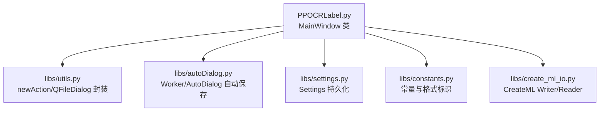
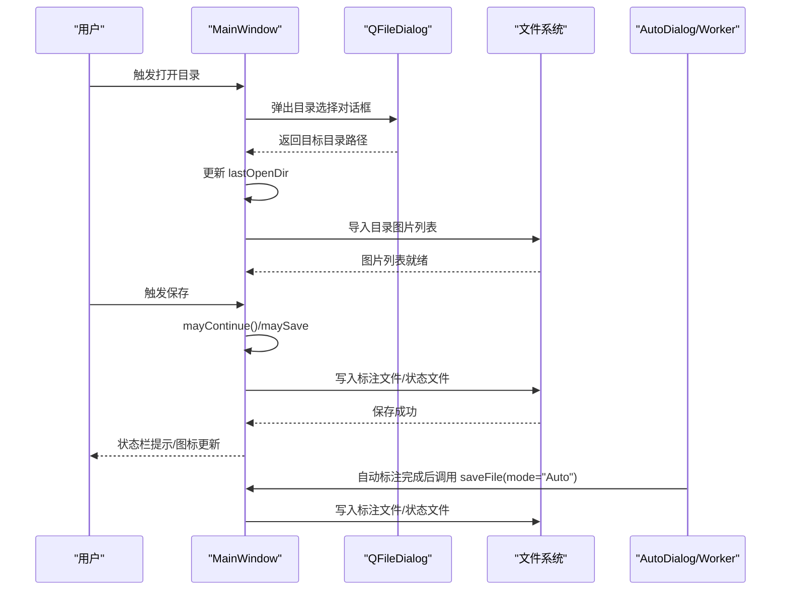
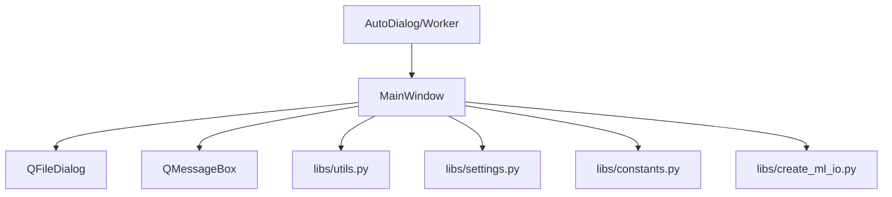

# 文件操作 API

<cite>
**本文引用的文件**
- [PPOCRLabel.py](file://PPOCRLabel.py)
- [autoDialog.py](file://libs/autoDialog.py)
- [utils.py](file://libs/utils.py)
- [settings.py](file://libs/settings.py)
- [constants.py](file://libs/constants.py)
- [create_ml_io.py](file://libs/create_ml_io.py)
</cite>

## 目录
1. [简介](#简介)
2. [项目结构](#项目结构)
3. [核心组件](#核心组件)
4. [架构总览](#架构总览)
5. [详细组件分析](#详细组件分析)
6. [依赖关系分析](#依赖关系分析)
7. [性能考虑](#性能考虑)
8. [故障排查指南](#故障排查指南)
9. [结论](#结论)
10. [附录](#附录)

## 简介
本文件聚焦于文件操作相关方法的详细API文档，覆盖以下能力：
- 目录选择与打开：openDirDialog、openDatasetDirDialog
- 文件保存：saveFile、saveFileDlg（内部通过saveFile实现）
- 关闭文件：closeFile
- 文件对话框使用方式、文件格式支持、路径处理逻辑
- 文件加载流程、保存策略、文件验证机制
- 实际使用示例与错误处理说明

本API围绕MainWindow类展开，结合libs子模块提供的工具、常量与IO组件，形成完整的文件读写与对话框交互体系。

## 项目结构
与文件操作直接相关的代码分布如下：
- 主窗口与文件操作入口：PPOCRLabel.py（MainWindow类）
- 自动标注线程与自动保存触发：libs/autoDialog.py
- 工具函数与对话框封装：libs/utils.py
- 设置持久化：libs/settings.py
- 常量定义（含编码、格式标识）：libs/constants.py
- CreateML格式读写辅助：libs/create_ml_io.py

图表来源
- [PPOCRLabel.py](file://PPOCRLabel.py#L553-L573)
- [autoDialog.py](file://libs/autoDialog.py#L140-L193)
- [utils.py](file://libs/utils.py#L51-L83)
- [settings.py](file://libs/settings.py#L21-L62)
- [constants.py](file://libs/constants.py#L13-L33)
- [create_ml_io.py](file://libs/create_ml_io.py#L27-L108)

章节来源
- [PPOCRLabel.py](file://PPOCRLabel.py#L553-L573)
- [utils.py](file://libs/utils.py#L51-L83)
- [settings.py](file://libs/settings.py#L21-L62)
- [constants.py](file://libs/constants.py#L13-L33)
- [create_ml_io.py](file://libs/create_ml_io.py#L27-L108)

## 核心组件
- openDirDialog：打开目录对话框，选择图片所在目录，并导入该目录下的图片列表，更新界面状态。
- openDatasetDirDialog：打开最近一次打开的目录（平台相关），便于快速查看标注结果。
- saveFile：保存当前图片的标注结果；根据模式（手动/自动）决定是否触发自动保存策略。
- closeFile：关闭当前文件，清理状态并禁用相关动作。
- saveFileDlg：内部通过saveFile实现保存逻辑，不对外暴露独立签名。

章节来源
- [PPOCRLabel.py](file://PPOCRLabel.py#L2388-L2410)
- [PPOCRLabel.py](file://PPOCRLabel.py#L2411-L2426)
- [PPOCRLabel.py](file://PPOCRLabel.py#L2587-L2648)
- [PPOCRLabel.py](file://PPOCRLabel.py#L2649-L2657)

## 架构总览
文件操作的典型调用链如下：
- 用户触发菜单/快捷键 → MainWindow对应方法
- 目录对话框：QFileDialog → 更新lastOpenDir → 导入图片列表
- 保存流程：校验脏状态 → 生成标注内容 → 写入文件 → 更新UI状态
- 自动保存：自动标注线程在每张图识别后调用saveFile(mode="Auto")

图表来源
- [PPOCRLabel.py](file://PPOCRLabel.py#L2388-L2410)
- [PPOCRLabel.py](file://PPOCRLabel.py#L2587-L2648)
- [autoDialog.py](file://libs/autoDialog.py#L140-L193)

## 详细组件分析

### openDirDialog
- 方法签名与用途
  - openDirDialog(self, _value=False, dirpath=None, silent=False)
  - 作用：弹出目录选择对话框，选择图片所在目录；silent为True时静默使用上次目录，不弹窗。
- 参数说明
  - _value：占位参数，用于连接槽位
  - dirpath：默认打开目录的显式路径
  - silent：是否静默打开（不弹窗）
- 返回值
  - 无显式返回；内部更新lastOpenDir并导入图片列表
- 路径处理逻辑
  - 默认目录优先使用上次打开目录（lastOpenDir），否则回退到当前文件所在目录
  - 非静默模式弹出QFileDialog目录选择器，设置仅显示目录且不解析符号链接
  - 成功选择后更新lastOpenDir并调用导入函数
- 错误处理
  - 若用户取消对话框，不执行任何导入
  - 若目录不存在或不可访问，导入阶段可能失败，需结合导入函数行为处理

章节来源
- [PPOCRLabel.py](file://PPOCRLabel.py#L2388-L2410)

### openDatasetDirDialog
- 方法签名与用途
  - openDatasetDirDialog(self)
  - 作用：打开最近一次打开的目录（平台相关），便于查看标注结果
- 参数说明
  - 无
- 返回值
  - 无
- 平台差异
  - Windows：使用系统文件打开
  - 其他系统：使用系统open命令
- 错误处理
  - 若lastOpenDir不存在或不可访问，给出提示并保持静默

章节来源
- [PPOCRLabel.py](file://PPOCRLabel.py#L2411-L2426)

### saveFile
- 方法签名与用途
  - saveFile(self, _value=False, mode="Manual")
  - 作用：保存当前图片的标注结果；mode控制保存策略
- 参数说明
  - _value：占位参数
  - mode：保存模式，"Manual"或"Auto"
- 返回值
  - 无显式返回；内部根据保存结果更新UI状态
- 保存策略
  - Manual模式：
    - 读取当前图片，计算锁定框的像素坐标
    - 合并识别结果，调用saveLabels写入标注文件
    - 更新文件状态字典、图标、自动保存计数
    - 可能触发自动保存策略（如达到阈值）
  - Auto模式：
    - 直接调用saveLabels写入标注文件
    - 清理脏状态并更新状态栏
- 文件写入细节
  - 标注文件：基于当前图片路径推导Label.txt位置
  - 状态文件：fileState.txt记录文件完成状态
  - 自动保存：按设定阈值周期性写入状态与PPLabel
- 错误处理
  - 若未选择文件或路径无效，不执行保存
  - 保存过程中出现异常，由上层捕获并提示

章节来源
- [PPOCRLabel.py](file://PPOCRLabel.py#L2587-L2648)

### closeFile
- 方法签名与用途
  - closeFile(self, _value=False)
  - 作用：关闭当前文件，重置状态并禁用相关动作
- 参数说明
  - _value：占位参数
- 返回值
  - 无
- 行为
  - 调用mayContinue以处理未保存变更
  - 重置内部状态、清理脏标记、禁用绘图与保存相关按钮

章节来源
- [PPOCRLabel.py](file://PPOCRLabel.py#L2649-L2657)

### saveFileDlg（内部实现）
- 说明：该方法为保存流程的内部实现入口，通常通过saveFile统一调度，不对外暴露独立签名
- 行为：与saveFile一致，但具体调用场景可能不同（例如自动标注线程）

章节来源
- [PPOCRLabel.py](file://PPOCRLabel.py#L2587-L2648)

## 依赖关系分析
- MainWindow对对话框与工具的依赖
  - 使用QFileDialog进行目录选择
  - 使用QMessageBox进行提示与确认
  - 使用utils.newAction/newIcon等工具函数构建菜单项
- 自动保存链路
  - AutoDialog/Worker在线程中逐图识别后，通过主线程调用saveFile(mode="Auto")
- 设置与常量
  - Settings负责窗口尺寸、颜色、最近打开目录等持久化
  - constants提供编码、格式标识等常量

图表来源
- [PPOCRLabel.py](file://PPOCRLabel.py#L553-L573)
- [autoDialog.py](file://libs/autoDialog.py#L140-L193)
- [utils.py](file://libs/utils.py#L51-L83)
- [settings.py](file://libs/settings.py#L21-L62)
- [constants.py](file://libs/constants.py#L13-L33)
- [create_ml_io.py](file://libs/create_ml_io.py#L27-L108)

章节来源
- [PPOCRLabel.py](file://PPOCRLabel.py#L553-L573)
- [autoDialog.py](file://libs/autoDialog.py#L140-L193)
- [utils.py](file://libs/utils.py#L51-L83)
- [settings.py](file://libs/settings.py#L21-L62)
- [constants.py](file://libs/constants.py#L13-L33)
- [create_ml_io.py](file://libs/create_ml_io.py#L27-L108)

## 性能考虑
- 自动标注线程
  - Worker在子线程中进行OCR预测与结果拼接，完成后通过信号触发主线程保存，避免阻塞UI
  - 进度条与剩余时间估算基于平均耗时，提升用户体验
- 图像读取
  - 保存前通过numpy解码读取图像尺寸，确保后续坐标换算准确
- 自动保存阈值
  - 达到设定阈值时批量写入状态与PPLabel，减少频繁I/O

章节来源
- [autoDialog.py](file://libs/autoDialog.py#L140-L193)
- [PPOCRLabel.py](file://PPOCRLabel.py#L2587-L2648)

## 故障排查指南
- 无法打开目录
  - 检查lastOpenDir是否存在；若不存在，回退到当前文件所在目录
  - 确认QFileDialog权限与路径有效性
- 保存失败或未生效
  - 确认当前文件有效（filePath非空）
  - 检查saveLabels写入流程是否成功；关注状态文件与标注文件路径
- 自动保存未触发
  - 确认自动保存阈值与fileStatedict计数逻辑
  - 检查自动标注线程是否正常结束信号
- 删除图片后列表未刷新
  - 确认isDelete标志与importDirImages调用
  - 检查平台删除命令是否执行成功

章节来源
- [PPOCRLabel.py](file://PPOCRLabel.py#L2388-L2410)
- [PPOCRLabel.py](file://PPOCRLabel.py#L2587-L2648)
- [PPOCRLabel.py](file://PPOCRLabel.py#L2658-L2699)
- [autoDialog.py](file://libs/autoDialog.py#L140-L193)

## 结论
本文档梳理了文件操作相关API的签名、参数、返回值与行为要点，明确了目录对话框、保存策略与自动保存机制。结合工具模块与常量定义，可安全地在不同平台与场景下进行文件读写与状态管理。建议在集成时遵循：
- 明确保存模式（Manual/Auto）
- 正确处理脏状态与用户确认
- 注意平台差异与路径有效性
- 利用自动保存阈值优化I/O

## 附录

### API 定义与调用示例（路径引用）
- 打开目录
  - 菜单/快捷键绑定：参见 [PPOCRLabel.py](file://PPOCRLabel.py#L553-L564)
  - 方法实现：参见 [PPOCRLabel.py](file://PPOCRLabel.py#L2388-L2410)
- 打开数据集目录
  - 方法实现：参见 [PPOCRLabel.py](file://PPOCRLabel.py#L2411-L2426)
- 保存文件
  - 菜单/快捷键绑定：参见 [PPOCRLabel.py](file://PPOCRLabel.py#L566-L573)
  - 方法实现：参见 [PPOCRLabel.py](file://PPOCRLabel.py#L2587-L2648)
- 关闭文件
  - 方法实现：参见 [PPOCRLabel.py](file://PPOCRLabel.py#L2649-L2657)
- 自动保存触发
  - 线程调用：参见 [autoDialog.py](file://libs/autoDialog.py#L140-L193)

### 文件格式与编码
- 编码
  - 默认UTF-8，参见 [constants.py](file://libs/constants.py#L32-L33)
- 标注文件
  - 基于Label.txt与fileState.txt，参见 [PPOCRLabel.py](file://PPOCRLabel.py#L2471-L2471)、[PPOCRLabel.py](file://PPOCRLabel.py#L3434-L3454)
- CreateML导出
  - Writer/Reader实现，参见 [create_ml_io.py](file://libs/create_ml_io.py#L27-L108)