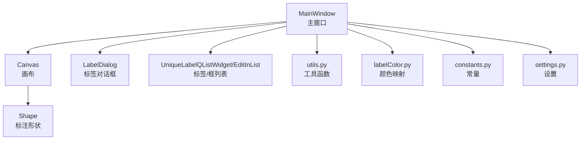
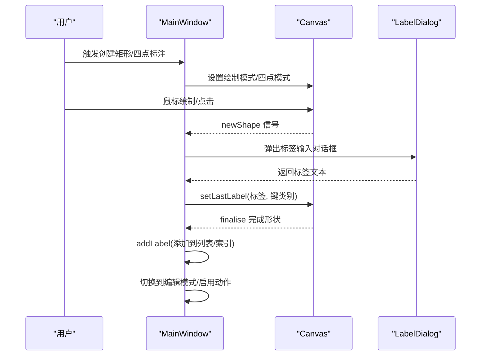
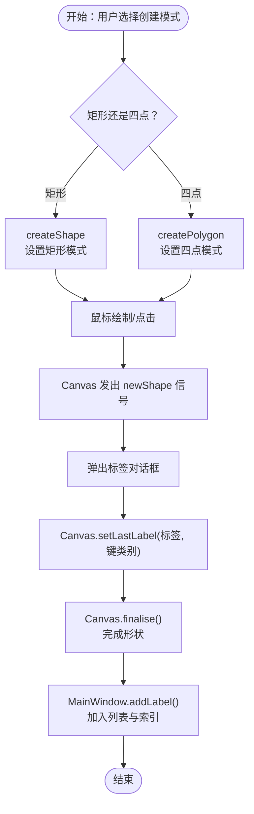
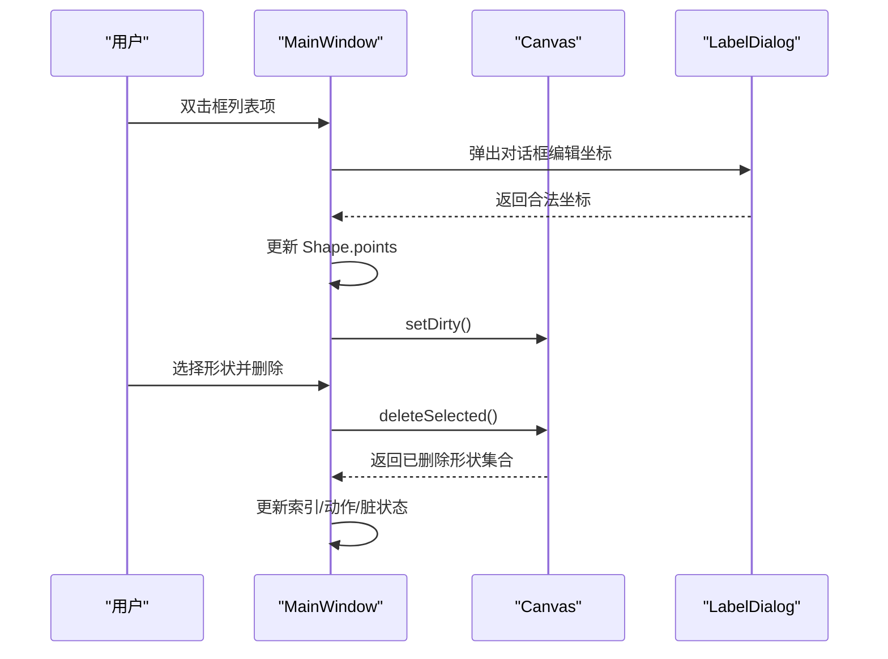
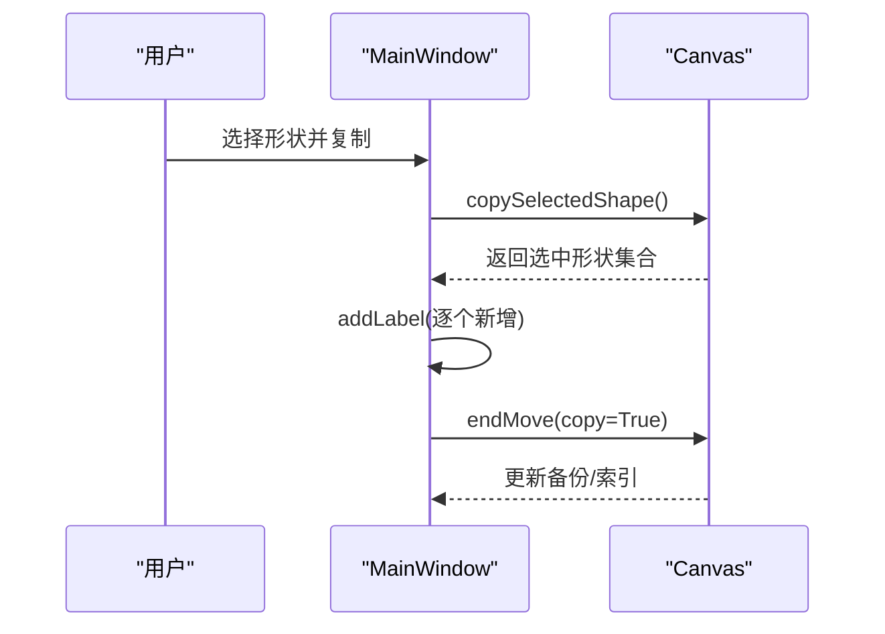
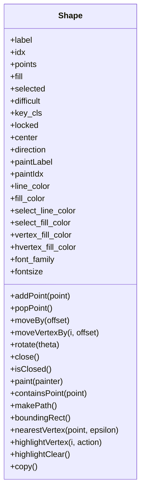
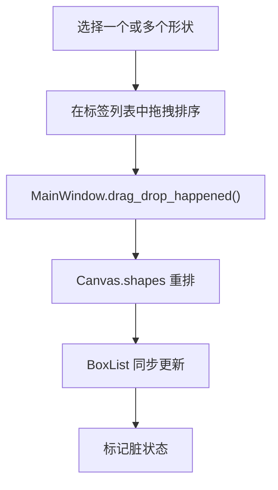
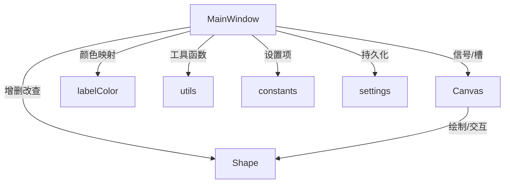

# 标注管理 API

<cite>
**本文引用的文件**
- [PPOCRLabel.py](file://PPOCRLabel.py)
- [canvas.py](file://libs/canvas.py)
- [shape.py](file://libs/shape.py)
- [labelDialog.py](file://libs/labelDialog.py)
- [labelColor.py](file://libs/labelColor.py)
- [utils.py](file://libs/utils.py)
- [constants.py](file://libs/constants.py)
- [settings.py](file://libs/settings.py)
- [unique_label_qlist_widget.py](file://libs/unique_label_qlist_widget.py)
- [editinlist.py](file://libs/editinlist.py)
</cite>

## 目录
1. [简介](#简介)
2. [项目结构](#项目结构)
3. [核心组件](#核心组件)
4. [架构总览](#架构总览)
5. [详细组件分析](#详细组件分析)
6. [依赖关系分析](#依赖关系分析)
7. [性能考量](#性能考量)
8. [故障排查指南](#故障排查指南)
9. [结论](#结论)
10. [附录](#附录)

## 简介
本文件聚焦于标注管理相关 API 的系统化文档，围绕以下目标展开：
- 记录 createShape、newShape、deleteSelectedShape、copySelectedShape、togglePolygons 等标注操作方法
- 说明标注框的创建、编辑、删除、复制流程
- 梳理标注数据结构、标签管理、颜色配置、锁定机制
- 覆盖批量标注操作、拖拽排序、选择模式
- 提供标注工作流程的最佳实践与效率提升技巧

## 项目结构
标注管理涉及主窗口逻辑、画布渲染、形状对象与对话框交互等模块。核心关系如下：
- 主窗口负责动作绑定、UI 列表联动、标签与框列表更新、批量操作触发
- 画布负责绘制、交互、选择、复制、删除、索引更新与撤销备份
- 形状对象承载标注几何、颜色、可见性、文本显示等属性
- 对话框用于标签输入与历史补全
- 工具模块提供颜色映射、距离计算、快捷键信息等支撑

图表来源
- [PPOCRLabel.py](file://PPOCRLabel.py#L1380-L1470)
- [canvas.py](file://libs/canvas.py#L1-L120)
- [shape.py](file://libs/shape.py#L1-L120)
- [labelDialog.py](file://libs/labelDialog.py#L1-L119)
- [labelColor.py](file://libs/labelColor.py#L1-L89)
- [utils.py](file://libs/utils.py#L1-L120)
- [constants.py](file://libs/constants.py#L1-L33)
- [settings.py](file://libs/settings.py#L1-L62)

章节来源
- [PPOCRLabel.py](file://PPOCRLabel.py#L1380-L1470)
- [canvas.py](file://libs/canvas.py#L1-L120)
- [shape.py](file://libs/shape.py#L1-L120)

## 核心组件
- MainWindow（主窗口）
  - 负责动作注册、事件回调、UI 列表同步、批量操作入口
  - 关键方法：createShape、createPolygon、newShape、copySelectedShape、togglePolygons、drag_drop_happened、resortBoxPosition 等
- Canvas（画布）
  - 负责绘制、交互、选择、复制、删除、撤销备份、形状索引更新
  - 关键方法：selectShapes、deSelectShape、copySelectedShape、deleteSelected、storeShapes、finalise、paintEvent 等
- Shape（形状）
  - 表示单个标注框，包含点集、颜色、选中态、填充、文本显示、旋转、边界盒等
  - 关键字段：points、label、idx、selected、fill、difficult、locked、center、direction、paintLabel、paintIdx 等
- LabelDialog（标签对话框）
  - 输入/编辑标签，支持历史补全
- 工具与配置
  - labelColor 提供标签到颜色的映射
  - utils 提供距离计算、颜色生成、快捷键信息等
  - constants 定义设置项键名
  - settings 提供持久化存储

章节来源
- [PPOCRLabel.py](file://PPOCRLabel.py#L1380-L2020)
- [canvas.py](file://libs/canvas.py#L300-L760)
- [shape.py](file://libs/shape.py#L1-L285)
- [labelDialog.py](file://libs/labelDialog.py#L1-L119)
- [labelColor.py](file://libs/labelColor.py#L1-L89)
- [utils.py](file://libs/utils.py#L100-L140)
- [constants.py](file://libs/constants.py#L1-L33)
- [settings.py](file://libs/settings.py#L1-L62)

## 架构总览
下面以序列图展示标注创建与确认的关键流程。

图表来源
- [PPOCRLabel.py](file://PPOCRLabel.py#L1380-L1470)
- [PPOCRLabel.py](file://PPOCRLabel.py#L1946-L2000)
- [canvas.py](file://libs/canvas.py#L682-L704)

章节来源
- [PPOCRLabel.py](file://PPOCRLabel.py#L1380-L2000)
- [canvas.py](file://libs/canvas.py#L682-L704)

## 详细组件分析

### 标注创建 API：createShape 与 createPolygon
- createShape
  - 功能：切换到矩形创建模式，禁用相关按钮，设置四点标志为否
  - 触发：用户点击“新建矩形框”或快捷键
  - 后续：鼠标绘制结束后由 newShape 弹出标签对话框并完成形状落盘
- createPolygon
  - 功能：切换到四点创建模式，启用“撤销最后点”等动作
  - 触发：用户点击“新建四点框”或快捷键
  - 后续：通过鼠标点击四次，双击完成；最终由 finalise 落盘

图表来源
- [PPOCRLabel.py](file://PPOCRLabel.py#L1380-L1470)
- [PPOCRLabel.py](file://PPOCRLabel.py#L1946-L2000)
- [canvas.py](file://libs/canvas.py#L682-L704)

章节来源
- [PPOCRLabel.py](file://PPOCRLabel.py#L1380-L1470)
- [PPOCRLabel.py](file://PPOCRLabel.py#L1946-L2000)
- [canvas.py](file://libs/canvas.py#L682-L704)

### 标注确认与新形状回调：newShape
- newShape
  - 在 Canvas.newShape 信号触发时调用
  - 弹出标签对话框，获取标签文本
  - 调用 Canvas.setLastLabel 设置当前形状的标签与键类别
  - 将形状加入列表与索引，并根据模式切换动作状态
  - 可选触发自动重识别

章节来源
- [PPOCRLabel.py](file://PPOCRLabel.py#L1946-L2000)
- [labelDialog.py](file://libs/labelDialog.py#L83-L119)
- [canvas.py](file://libs/canvas.py#L682-L704)

### 标注编辑与删除：editBox、boxItemChanged、deleteSelectedShape
- editBox
  - 双击框列表项时弹出对话框，允许用户以四点坐标格式编辑
  - 校验坐标合法性与图像边界
  - 更新 Shape.points 并标记脏状态
- boxItemChanged
  - 当框列表项内容变化时，解析文本为点集并更新 Shape.points
  - 同步可见性与脏状态
- deleteSelectedShape
  - 通过 Canvas.deleteSelected 删除选中形状
  - 更新索引、动作可用性与脏状态

图表来源
- [PPOCRLabel.py](file://PPOCRLabel.py#L1521-L1560)
- [PPOCRLabel.py](file://PPOCRLabel.py#L1506-L1520)
- [canvas.py](file://libs/canvas.py#L531-L544)

章节来源
- [PPOCRLabel.py](file://PPOCRLabel.py#L1506-L1560)
- [canvas.py](file://libs/canvas.py#L531-L544)

### 标注复制：copySelectedShape
- copySelectedShape（主窗口）
  - 调用 Canvas.copySelectedShape 复制选中形状
  - 将副本加入列表与索引，保持索引连续
- Canvas.copySelectedShape
  - 复制选中形状集合
  - 偏移后执行 endMove(copy=True)，写入新形状并持久化备份

图表来源
- [PPOCRLabel.py](file://PPOCRLabel.py#L1840-L1846)
- [canvas.py](file://libs/canvas.py#L553-L571)
- [canvas.py](file://libs/canvas.py#L326-L342)

章节来源
- [PPOCRLabel.py](file://PPOCRLabel.py#L1840-L1846)
- [canvas.py](file://libs/canvas.py#L553-L571)
- [canvas.py](file://libs/canvas.py#L326-L342)

### 标注显示控制：togglePolygons
- togglePolygons
  - 控制所有形状的可见性（显示/隐藏）
  - 与 Canvas.setShapeVisible 协作实现

章节来源
- [PPOCRLabel.py](file://PPOCRLabel.py#L2105-L2109)
- [canvas.py](file://libs/canvas.py#L1-L120)

### 标注数据结构与颜色配置
- Shape 数据结构
  - 字段：label、idx、points、fill、selected、difficult、key_cls、locked、center、direction、paintLabel、paintIdx、line_color、fill_color、select_line_color、select_fill_color、vertex_fill_color、hvertex_fill_color、font_family、fontsize 等
  - 方法：addPoint、popPoint、moveBy、moveVertexBy、rotate、close、isClosed、paint、containsPoint、makePath、boundingRect、nearestVertex、highlightVertex、highlightClear、copy 等
- 颜色配置
  - 默认颜色：DEFAULT_LINE_COLOR、DEFAULT_FILL_COLOR、DEFAULT_SELECT_LINE_COLOR、DEFAULT_SELECT_FILL_COLOR、DEFAULT_VERTEX_FILL_COLOR、DEFAULT_HVERTEX_FILL_COLOR、DEFAULT_LOCK_COLOR
  - 标签到颜色映射：label_colormap 提供基于标签的配色方案
  - 主窗口按标签/键类别动态更新形状颜色

图表来源
- [shape.py](file://libs/shape.py#L1-L285)
- [labelColor.py](file://libs/labelColor.py#L47-L89)
- [PPOCRLabel.py](file://PPOCRLabel.py#L1999-L2021)

章节来源
- [shape.py](file://libs/shape.py#L1-L285)
- [labelColor.py](file://libs/labelColor.py#L47-L89)
- [PPOCRLabel.py](file://PPOCRLabel.py#L1999-L2021)

### 标注锁定机制
- 锁定形状
  - 主窗口维护 lockedShapes，加载时将锁定框转换为固定颜色并显示
  - 保存时过滤锁定颜色的形状，避免误导出
- 锁定框显示与切换
  - 加载标签时根据是否在同一图像内决定显示文案
  - 与 togglePolygons 协同控制可见性

章节来源
- [PPOCRLabel.py](file://PPOCRLabel.py#L2235-L2280)
- [canvas.py](file://libs/canvas.py#L1-L120)

### 批量标注操作与拖拽排序
- 批量标注
  - 通过 createShape/createPolygon 进入创建模式，循环绘制多个标注
  - 结合自动重识别选项，可在创建后自动重识别
- 拖拽排序
  - 标签列表支持拖拽排序，触发 drag_drop_happened
  - 同步更新 Canvas.shapes 顺序、BoxList 与索引
  - 支持键盘方向键逐像素移动选中形状

图表来源
- [PPOCRLabel.py](file://PPOCRLabel.py#L1915-L1945)
- [canvas.py](file://libs/canvas.py#L508-L522)

章节来源
- [PPOCRLabel.py](file://PPOCRLabel.py#L1915-L1945)
- [canvas.py](file://libs/canvas.py#L508-L522)

### 选择模式与键盘操作
- 选择模式
  - 单选/多选：按住 Ctrl 进行多选
  - 通过标签/索引/框列表项选择形状，联动 Canvas.selectShapes/deSelectShape
- 键盘操作
  - 方向键：逐像素移动选中形状
  - Z/X/C/V/B：高亮/取消高亮四个顶点
  - ESC：取消当前绘制
  - Enter：完成绘制
  - Backspace/Delete：删除选中形状
  - Ctrl+C：复制选中形状
  - Ctrl+H/A：隐藏/显示所有标注框

章节来源
- [canvas.py](file://libs/canvas.py#L737-L800)
- [PPOCRLabel.py](file://PPOCRLabel.py#L1607-L1659)
- [utils.py](file://libs/utils.py#L312-L369)

## 依赖关系分析
- 组件耦合
  - MainWindow 与 Canvas 通过信号/槽紧密耦合（newShape、selectionChanged、shapeMoved、drawingPolygon）
  - MainWindow 与 Shape 通过 addLabel/remLabels/loadLabels 等方法间接交互
  - Canvas 与 Shape 通过 points、selected、moveBy、moveVertexBy 等方法直接交互
- 外部依赖
  - PyQt5 图形界面框架
  - OpenCV/Pillow 用于图像处理与颜色空间转换
  - PaddleOCR 用于自动识别与模型推理（非标注核心，但影响批量标注）

图表来源
- [PPOCRLabel.py](file://PPOCRLabel.py#L1380-L2000)
- [canvas.py](file://libs/canvas.py#L1-L120)
- [shape.py](file://libs/shape.py#L1-L120)
- [labelColor.py](file://libs/labelColor.py#L1-L89)
- [utils.py](file://libs/utils.py#L1-L120)
- [constants.py](file://libs/constants.py#L1-L33)
- [settings.py](file://libs/settings.py#L1-L62)

章节来源
- [PPOCRLabel.py](file://PPOCRLabel.py#L1380-L2000)
- [canvas.py](file://libs/canvas.py#L1-L120)
- [shape.py](file://libs/shape.py#L1-L120)

## 性能考量
- 绘制与刷新
  - Canvas.paintEvent 中仅绘制可见形状与当前绘制线，避免不必要的重绘
  - 自适应字体大小随图像尺寸变化，减少大图时文字拥挤
- 选择与移动
  - moveBy/close 在移动时批量更新，减少多次重绘
  - boundedMoveShape/boundedMoveVertex 限制越界与抖动
- 备份与撤销
  - storeShapes 限制备份数量上限，避免内存膨胀
- 批量操作
  - 拖拽排序一次性重排 shapes 与列表，随后统一更新索引
  - 自动重识别可按需开启，避免频繁模型调用

[本节为通用指导，无需列出具体文件来源]

## 故障排查指南
- 坐标越界
  - 现象：编辑框坐标超出图像范围
  - 处理：editBox 中进行边界校验，弹窗警告并拒绝更新
- 解析错误
  - 现象：框列表文本格式不正确导致解析失败
  - 处理：捕获异常并提示用户修正格式
- 撤销/重做
  - 现象：撤销后形状未恢复
  - 处理：确保 Canvas.shapesBackups 正确更新与清理
- 锁定框显示异常
  - 现象：锁定框颜色或文案不符合预期
  - 处理：检查 lockedShapes 与 isInTheSameImage 标志，确认加载逻辑

章节来源
- [PPOCRLabel.py](file://PPOCRLabel.py#L1521-L1560)
- [canvas.py](file://libs/canvas.py#L545-L552)

## 结论
本文从系统架构、核心组件、数据结构、交互流程与性能优化等维度梳理了标注管理 API，覆盖创建、编辑、删除、复制、显示控制、批量操作与拖拽排序等关键能力。结合颜色配置与锁定机制，可满足复杂场景下的标注需求。建议在实际使用中遵循最佳实践，以提升标注效率与一致性。

[本节为总结性内容，无需列出具体文件来源]

## 附录

### API 一览与最佳实践
- 创建标注
  - 使用 createShape/createPolygon 进入创建模式，配合 newShape 完成确认
  - 快捷键：W（矩形）、Q/Home（四点）
- 编辑标注
  - 双击框列表项 editBox 修改坐标；双击标签列表项 editLabel 修改标签
  - 支持键盘方向键逐像素微调
- 删除标注
  - 选中后按 Backspace/Delete 或右键菜单删除
- 复制标注
  - 选中后按 Ctrl+C，或在菜单中选择复制，偏移后粘贴
- 显示控制
  - Ctrl+H/A 分别隐藏/显示所有标注框
- 批量操作
  - 打开自动重识别选项，创建后自动重识别
  - 拖拽标签列表进行排序，同步更新索引与框列表
- 锁定机制
  - 锁定框以固定颜色显示，保存时过滤锁定颜色的形状
- 最佳实践
  - 先创建再编辑，尽量使用四点模式保证任意四边形精度
  - 合理使用锁定框保护关键区域
  - 开启自动重识别提高整体效率
  - 使用拖拽排序保持阅读顺序一致

章节来源
- [PPOCRLabel.py](file://PPOCRLabel.py#L1380-L2000)
- [canvas.py](file://libs/canvas.py#L508-L800)
- [shape.py](file://libs/shape.py#L1-L285)
- [labelDialog.py](file://libs/labelDialog.py#L1-L119)
- [utils.py](file://libs/utils.py#L312-L369)