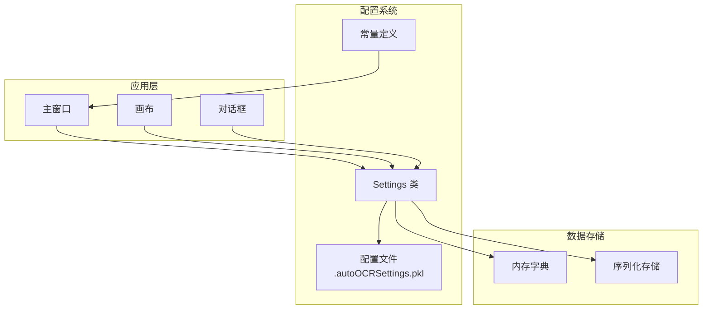
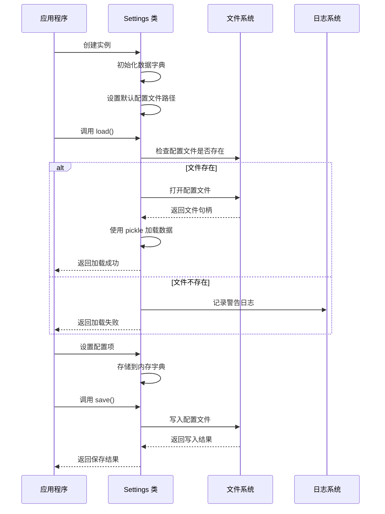
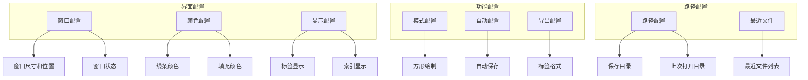
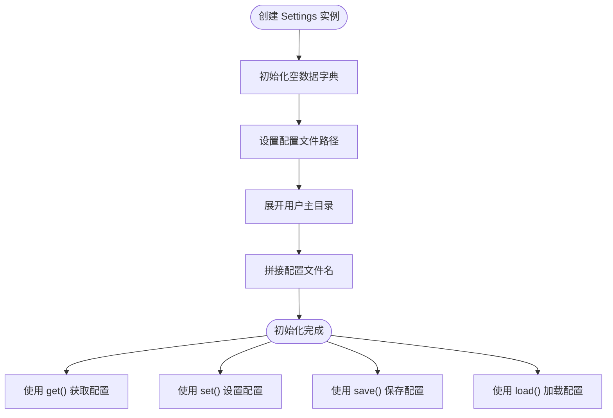
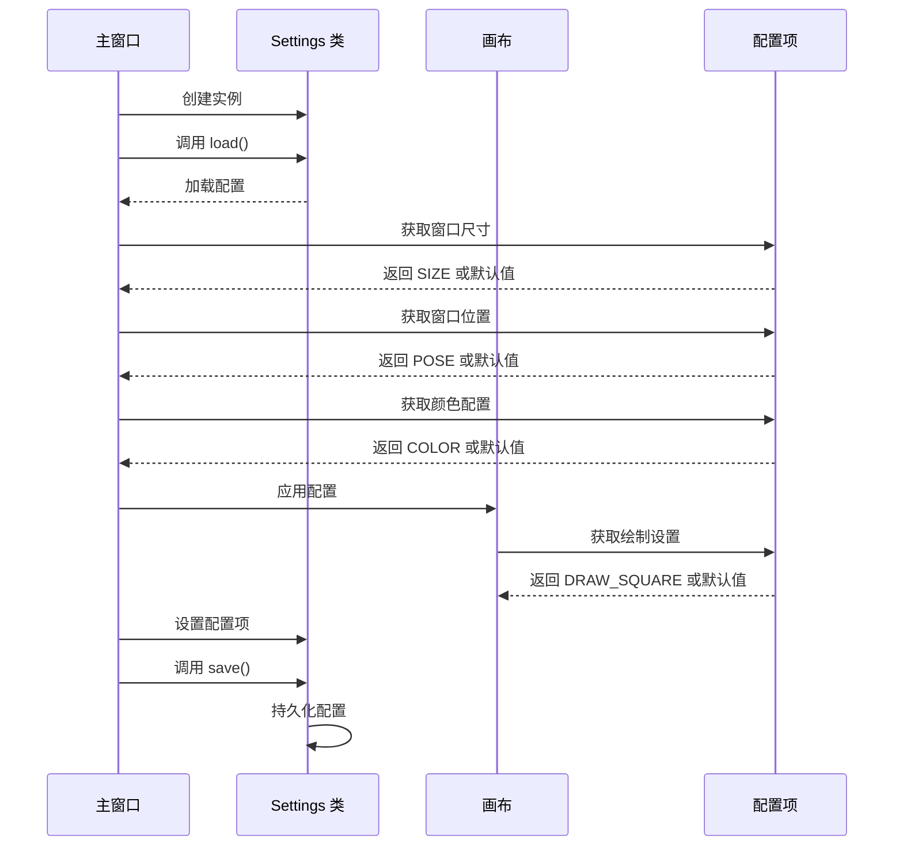
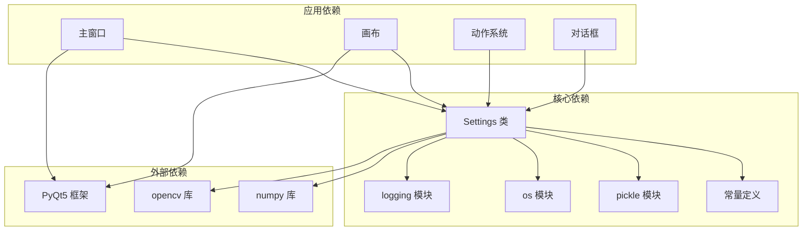
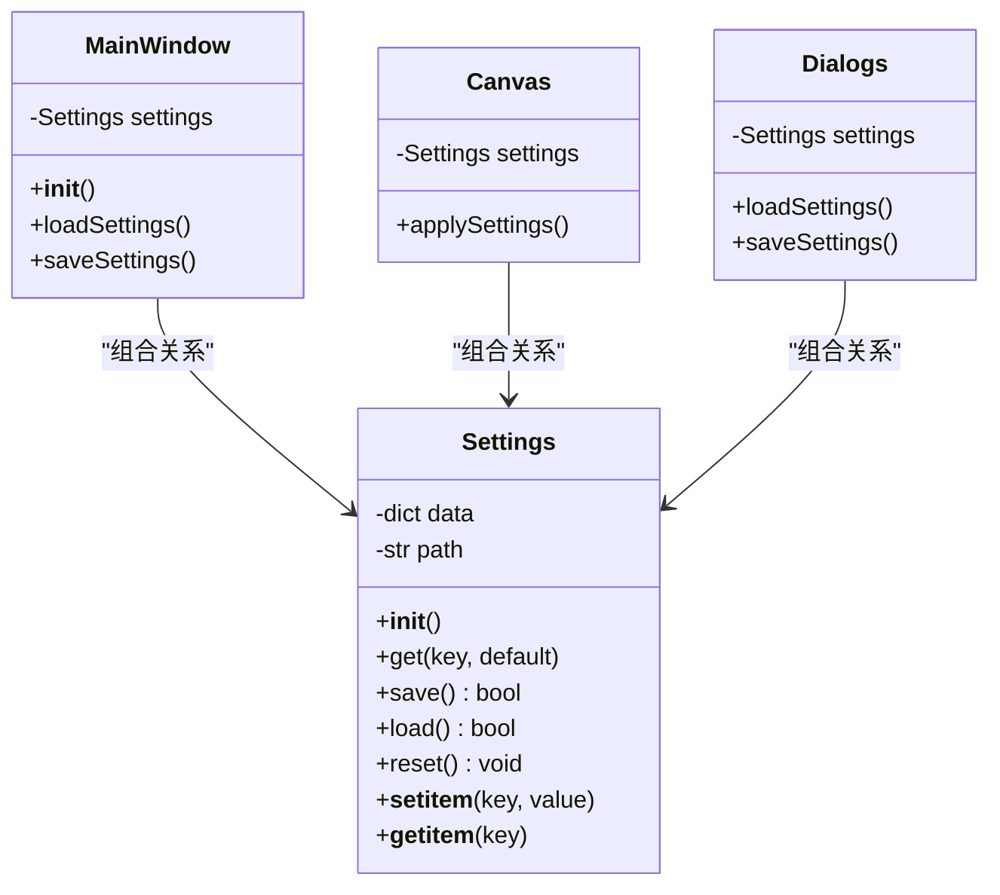

# Settings 类 API

<cite>
**本文档引用的文件**
- [libs/settings.py](file://libs/settings.py)
- [libs/constants.py](file://libs/constants.py)
- [PPOCRLabel.py](file://PPOCRLabel.py)
</cite>

## 目录
1. [简介](#简介)
2. [项目结构](#项目结构)
3. [核心组件](#核心组件)
4. [架构概览](#架构概览)
5. [详细组件分析](#详细组件分析)
6. [依赖关系分析](#依赖关系分析)
7. [性能考虑](#性能考虑)
8. [故障排除指南](#故障排除指南)
9. [结论](#结论)

## 简介
Settings 类是 PPOCRLabel 应用程序的配置管理系统，负责管理用户偏好设置、窗口状态、颜色配置等所有应用程序配置信息。该类提供了简单而强大的键值存储机制，支持配置文件的持久化存储和加载。

## 项目结构
Settings 类位于应用程序的核心配置模块中，与常量定义和主窗口逻辑紧密集成：



**图表来源**
- [libs/settings.py](file://libs/settings.py#L21-L62)
- [libs/constants.py](file://libs/constants.py#L13-L32)
- [PPOCRLabel.py](file://PPOCRLabel.py#L146-L170)

## 核心组件

### Settings 类概述
Settings 类是一个轻量级的配置管理器，提供以下核心功能：
- 键值对配置存储
- 配置文件的自动加载和保存
- 默认值处理机制
- 配置重置功能

### 主要特性
- **持久化存储**：使用 pickle 序列化技术保存配置到本地文件
- **灵活访问**：支持字典式和方法式两种访问方式
- **错误处理**：优雅处理配置文件加载失败的情况
- **跨平台兼容**：自动适配不同操作系统的用户目录

**章节来源**
- [libs/settings.py](file://libs/settings.py#L21-L62)

## 架构概览

### 配置管理流程
Settings 类在整个应用程序中的工作流程如下：



**图表来源**
- [libs/settings.py](file://libs/settings.py#L39-L54)

### 配置项分类
应用程序使用多种类型的配置项来管理不同的功能：



**图表来源**
- [libs/constants.py](file://libs/constants.py#L13-L32)

## 详细组件分析

### 构造函数和初始化
Settings 类的构造函数负责初始化配置管理器的基本结构：



**图表来源**
- [libs/settings.py](file://libs/settings.py#L22-L26)

#### 关键初始化步骤
1. **数据容器创建**：创建空的字典用于存储配置项
2. **路径设置**：在用户主目录下创建配置文件
3. **默认文件名**：使用 `.autoOCRSettings.pkl` 作为配置文件名

**章节来源**
- [libs/settings.py](file://libs/settings.py#L22-L26)

### 配置项管理方法

#### get 方法详解
get 方法提供了安全的配置项访问机制：

```mermaid
flowchart TD
GetCall[调用 get(key, default)] --> CheckKey{"检查键是否存在"}
CheckKey --> |存在| ReturnVal["返回存储的值"]
CheckKey --> |不存在| ReturnDefault["返回默认值"]
ReturnVal --> End([结束])
ReturnDefault --> End
style GetCall fill:#e1f5fe
style End fill:#e8f5e8
```

**图表来源**
- [libs/settings.py](file://libs/settings.py#L34-L37)

#### set 方法详解
set 方法提供了灵活的配置项设置机制：

```mermaid
flowchart TD
SetCall[调用 set(key, value)] --> StoreData["存储到数据字典"]
StoreData --> UpdateMemory["更新内存映射"]
UpdateMemory --> End([结束])
style SetCall fill:#fff3e0
style End fill:#e8f5e8
```

**图表来源**
- [libs/settings.py](file://libs/settings.py#L28-L29)

**章节来源**
- [libs/settings.py](file://libs/settings.py#L28-L37)

### 文件读写机制

#### save 方法实现
save 方法负责将内存中的配置持久化到磁盘：

```mermaid
flowchart TD
SaveCall[调用 save()] --> CheckPath{"检查文件路径"}
CheckPath --> |有路径| OpenFile["打开文件进行写入"]
CheckPath --> |无路径| ReturnFalse["返回 False"]
OpenFile --> SerializeData["使用 pickle 序列化数据"]
SerializeData --> WriteFile["写入文件"]
WriteFile --> CloseFile["关闭文件"]
CloseFile --> ReturnTrue["返回 True"]
ReturnFalse --> End([结束])
ReturnTrue --> End
style SaveCall fill:#ffebee
style End fill:#e8f5e8
```

**图表来源**
- [libs/settings.py](file://libs/settings.py#L39-L44)

#### load 方法实现
load 方法负责从磁盘加载配置到内存：

```mermaid
flowchart TD
LoadCall[调用 load()] --> TryBlock["进入 try 块"]
TryBlock --> CheckExists{"检查文件是否存在"}
CheckExists --> |存在| OpenFile["打开文件进行读取"]
CheckExists --> |不存在| ReturnFalse["返回 False"]
OpenFile --> DeserializeData["使用 pickle 反序列化数据"]
DeserializeData --> LoadSuccess["加载成功"]
LoadSuccess --> ReturnTrue["返回 True"]
OpenFile --> CatchBlock["捕获异常"]
CatchBlock --> LogWarning["记录警告日志"]
LogWarning --> ReturnFalse
ReturnFalse --> End([结束])
ReturnTrue --> End
style LoadCall fill:#fff3e0
style End fill:#e8f5e8
```

**图表来源**
- [libs/settings.py](file://libs/settings.py#L46-L54)

**章节来源**
- [libs/settings.py](file://libs/settings.py#L39-L54)

### 配置文件格式

#### 序列化格式
Settings 类使用 Python 的 pickle 模块进行配置数据的序列化：

- **序列化协议**：使用最高协议版本确保最佳兼容性
- **数据结构**：纯 Python 字典对象
- **文件扩展名**：`.pkl`（Python pickle）
- **编码方式**：二进制格式，无需文本编码

#### 文件位置
配置文件默认存储在用户的主目录下：
- **Windows**：`C:\Users\<username>\.autoOCRSettings.pkl`
- **Linux**：`/home/<username>/.autoOCRSettings.pkl`
- **macOS**：`/Users/<username>/.autoOCRSettings.pkl`

**章节来源**
- [libs/settings.py](file://libs/settings.py#L24-L26)
- [libs/settings.py](file://libs/settings.py#L41-L42)

### 配置项定义和使用

#### 标准配置项
应用程序定义了丰富的配置项常量，涵盖各种功能需求：

| 配置项 | 类型 | 描述 | 默认值 |
|--------|------|------|--------|
| `SETTING_FILENAME` | 字符串 | 当前文件路径 | 无 |
| `SETTING_RECENT_FILES` | 列表 | 最近打开的文件列表 | 空列表 |
| `SETTING_WIN_SIZE` | 尺寸 | 窗口尺寸 | `(1200, 800)` |
| `SETTING_WIN_POSE` | 坐标 | 窗口位置 | 屏幕中心 |
| `SETTING_WIN_STATE` | 状态 | 窗口状态 | 正常状态 |
| `SETTING_LINE_COLOR` | 颜色 | 线条颜色 | `DEFAULT_LINE_COLOR` |
| `SETTING_FILL_COLOR` | 颜色 | 填充颜色 | `DEFAULT_FILL_COLOR` |
| `SETTING_DRAW_SQUARE` | 布尔值 | 方形绘制模式 | `False` |
| `SETTING_PAINT_LABEL` | 布尔值 | 显示标签 | `False` |
| `SETTING_PAINT_INDEX` | 布尔值 | 显示索引 | `False` |
| `SETTING_SAVE_DIR` | 字符串 | 保存目录 | `None` |
| `SETTING_LAST_OPEN_DIR` | 字符串 | 上次打开目录 | `None` |

**章节来源**
- [libs/constants.py](file://libs/constants.py#L13-L32)

#### 配置项使用示例
Settings 类在应用程序中的典型使用模式：



**图表来源**
- [PPOCRLabel.py](file://PPOCRLabel.py#L1194-L1216)
- [PPOCRLabel.py](file://PPOCRLabel.py#L2356-L2359)

**章节来源**
- [PPOCRLabel.py](file://PPOCRLabel.py#L1194-L1216)
- [PPOCRLabel.py](file://PPOCRLabel.py#L2356-L2359)

### 高级特性

#### 配置重置功能
Settings 类提供了完整的配置重置机制：

```mermaid
flowchart TD
ResetCall[调用 reset()] --> CheckFile{"检查配置文件"}
CheckFile --> |存在| RemoveFile["删除配置文件"]
CheckFile --> |不存在| SkipRemove["跳过删除"]
RemoveFile --> LogInfo["记录日志信息"]
SkipRemove --> ClearData["清空内存数据"]
LogInfo --> ClearData
ClearData --> SetNullPath["设置路径为空"]
SetNullPath --> End([重置完成])
style ResetCall fill:#fce4ec
style End fill:#e8f5e8
```

**图表来源**
- [libs/settings.py](file://libs/settings.py#L56-L61)

#### 错误处理机制
Settings 类实现了完善的错误处理策略：

- **加载失败**：记录警告日志并返回失败状态
- **文件不存在**：优雅地处理缺失的配置文件
- **序列化异常**：捕获并处理 pickle 操作中的异常
- **路径无效**：处理无效或不可访问的配置文件路径

**章节来源**
- [libs/settings.py](file://libs/settings.py#L52-L54)
- [libs/settings.py](file://libs/settings.py#L56-L61)

## 依赖关系分析

### 组件间依赖
Settings 类与应用程序其他组件的依赖关系：



**图表来源**
- [libs/settings.py](file://libs/settings.py#L14-L18)
- [libs/constants.py](file://libs/constants.py#L1-L32)

### 使用模式分析
Settings 类在应用程序中的使用模式体现了良好的设计原则：

#### 单例模式应用
虽然没有显式的单例实现，但 Settings 类在每个主要组件中都以独立实例的形式使用，实现了类似单例的效果：



**图表来源**
- [libs/settings.py](file://libs/settings.py#L21-L62)
- [PPOCRLabel.py](file://PPOCRLabel.py#L146-L170)

**章节来源**
- [libs/settings.py](file://libs/settings.py#L21-L62)
- [PPOCRLabel.py](file://PPOCRLabel.py#L146-L170)

## 性能考虑

### 内存使用优化
- **延迟加载**：配置文件仅在需要时加载到内存
- **增量更新**：只保存修改过的配置项
- **内存清理**：重置时释放所有配置数据

### I/O 性能
- **批量操作**：建议在一次会话中批量设置多个配置项后再保存
- **异步处理**：对于大量配置项的处理可以考虑异步执行
- **缓存策略**：频繁访问的配置项可以在内存中缓存

### 序列化性能
- **协议选择**：使用最高 pickle 协议确保最佳性能
- **数据压缩**：对于大型配置数据可以考虑压缩存储
- **增量序列化**：只序列化发生变化的数据部分

## 故障排除指南

### 常见问题及解决方案

#### 配置文件加载失败
**症状**：应用程序启动时配置丢失或恢复默认值
**原因**：配置文件损坏或权限不足
**解决方案**：
1. 检查配置文件是否存在且可读
2. 验证文件权限设置
3. 尝试手动删除损坏的配置文件
4. 重新启动应用程序以生成新的配置文件

#### 配置保存失败
**症状**：设置更改后重启后丢失
**原因**：磁盘空间不足或写入权限问题
**解决方案**：
1. 检查磁盘空间是否充足
2. 验证用户目录的写入权限
3. 确认磁盘没有被占用
4. 以管理员权限运行应用程序

#### 配置重置问题
**症状**：调用 reset() 后配置仍然存在
**原因**：多实例导致的配置不一致
**解决方案**：
1. 确保所有组件使用相同的 Settings 实例
2. 在重置后重新初始化所有组件
3. 验证配置文件是否已被正确删除

**章节来源**
- [libs/settings.py](file://libs/settings.py#L52-L54)
- [libs/settings.py](file://libs/settings.py#L56-L61)

### 调试技巧
- **启用详细日志**：通过设置日志级别查看配置操作详情
- **监控文件变化**：观察配置文件的创建和修改时间
- **验证数据完整性**：检查 pickle 文件的完整性
- **测试边界条件**：验证极端情况下的行为表现

## 结论
Settings 类为 PPOCRLabel 应用程序提供了强大而灵活的配置管理能力。其简洁的设计、完善的错误处理机制和高效的性能表现使其成为应用程序配置系统的核心组件。

通过合理的配置项组织、清晰的 API 设计和健壮的持久化机制，Settings 类成功地满足了应用程序对用户偏好设置、窗口状态管理和功能配置的各种需求。同时，其开放的架构也为未来的功能扩展和配置项增加提供了良好的基础。

对于开发者而言，理解 Settings 类的工作原理和最佳实践有助于更好地利用其功能，为用户提供更好的使用体验。