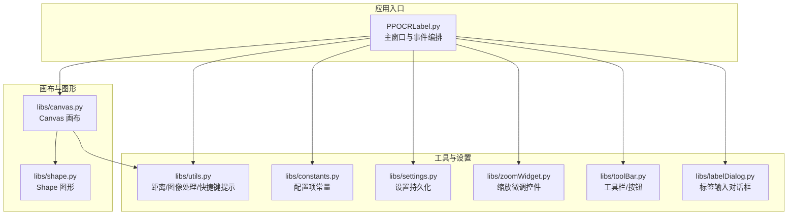
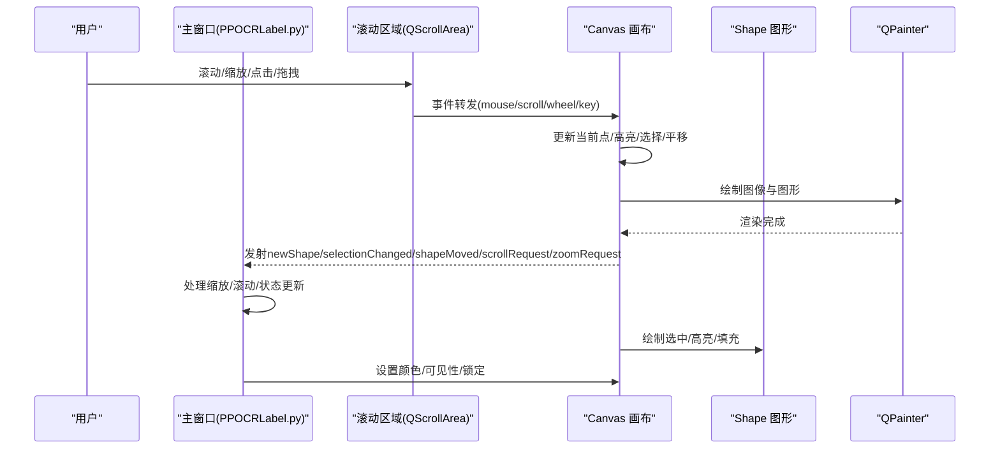
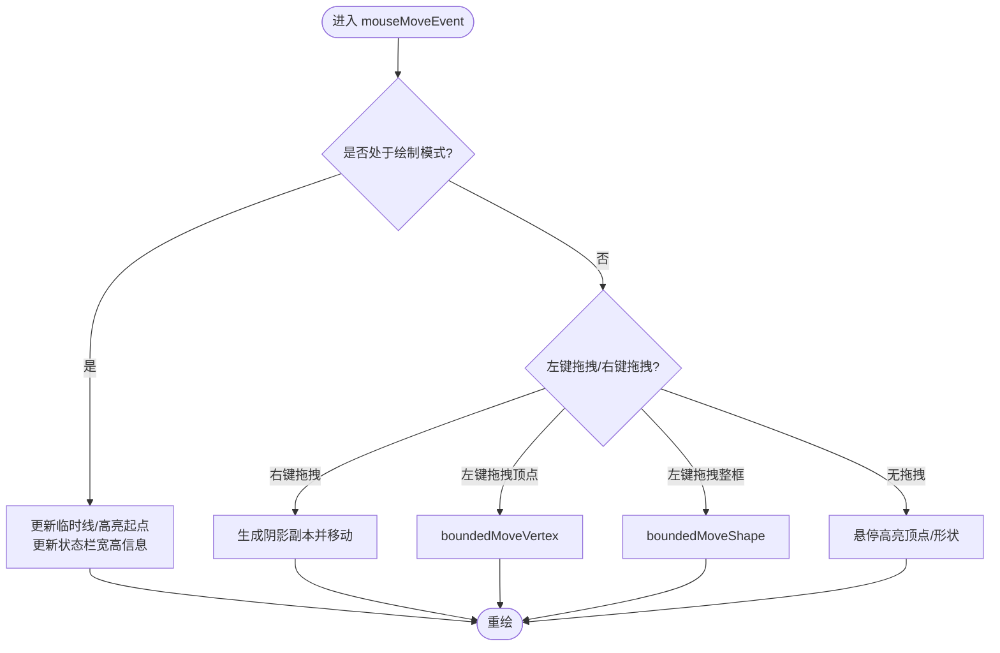
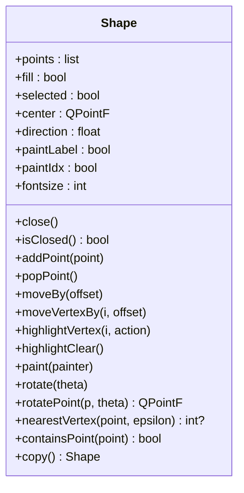
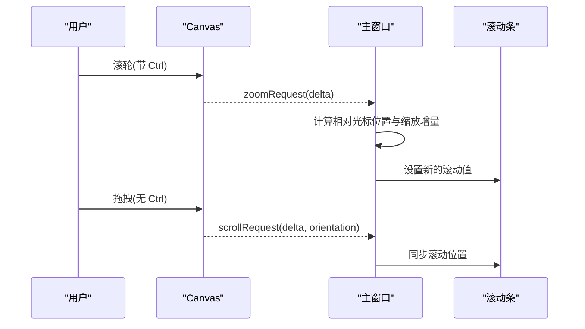
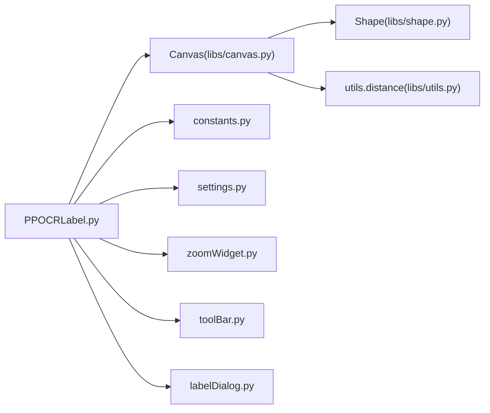

# 画布渲染系统

<cite>
**本文引用的文件**
- [libs/canvas.py](file://libs/canvas.py)
- [libs/shape.py](file://libs/shape.py)
- [libs/utils.py](file://libs/utils.py)
- [libs/constants.py](file://libs/constants.py)
- [libs/settings.py](file://libs/settings.py)
- [libs/zoomWidget.py](file://libs/zoomWidget.py)
- [libs/toolBar.py](file://libs/toolBar.py)
- [libs/labelDialog.py](file://libs/labelDialog.py)
- [PPOCRLabel.py](file://PPOCRLabel.py)
</cite>

## 目录
1. [引言](#引言)
2. [项目结构](#项目结构)
3. [核心组件](#核心组件)
4. [架构总览](#架构总览)
5. [详细组件分析](#详细组件分析)
6. [依赖关系分析](#依赖关系分析)
7. [性能考虑](#性能考虑)
8. [故障排查指南](#故障排查指南)
9. [结论](#结论)
10. [附录](#附录)

## 引言
本文件面向希望深入理解并使用画布渲染系统的开发者与使用者，围绕 Canvas 类展开全面解析。内容涵盖图像显示、标注框绘制、交互处理、缩放/平移/旋转机制、多点绘制与形状选择、事件与键盘快捷键响应，并提供性能优化与内存管理的最佳实践。文档同时给出基于仓库源码的可视化图示与分层讲解，帮助不同背景的读者快速掌握系统设计与实现。

## 项目结构
该系统以 PyQt5 为基础，采用模块化组织方式：
- libs 子模块：封装画布、图形、工具函数、设置、UI 控件等通用能力
- 应用入口：PPOCRLabel.py 负责主窗口、菜单、工具栏、滚动区域与画布的集成

图表来源
- [PPOCRLabel.py](file://PPOCRLabel.py#L514-L531)
- [libs/canvas.py](file://libs/canvas.py#L32-L120)
- [libs/shape.py](file://libs/shape.py#L35-L120)
- [libs/utils.py](file://libs/utils.py#L104-L111)
- [libs/constants.py](file://libs/constants.py#L13-L33)
- [libs/settings.py](file://libs/settings.py#L21-L62)
- [libs/zoomWidget.py](file://libs/zoomWidget.py#L19-L35)
- [libs/toolBar.py](file://libs/toolBar.py#L18-L48)
- [libs/labelDialog.py](file://libs/labelDialog.py#L30-L119)

章节来源
- [PPOCRLabel.py](file://PPOCRLabel.py#L514-L531)
- [libs/canvas.py](file://libs/canvas.py#L32-L120)

## 核心组件
- Canvas 画布：负责图像加载、绘制、交互、缩放/平移、形状管理、事件转发与信号发射
- Shape 图形：定义标注框的几何、绘制、高亮、旋转、边界计算与文本绘制
- 工具与常量：提供距离计算、图像裁剪、快捷键提示、设置持久化、UI 控件等支撑能力
- 主窗口集成：将画布嵌入滚动区域，连接缩放/滚动/选择等事件，驱动整体流程

章节来源
- [libs/canvas.py](file://libs/canvas.py#L32-L120)
- [libs/shape.py](file://libs/shape.py#L35-L120)
- [libs/utils.py](file://libs/utils.py#L104-L111)
- [libs/constants.py](file://libs/constants.py#L13-L33)
- [libs/settings.py](file://libs/settings.py#L21-L62)
- [libs/zoomWidget.py](file://libs/zoomWidget.py#L19-L35)
- [libs/toolBar.py](file://libs/toolBar.py#L18-L48)
- [libs/labelDialog.py](file://libs/labelDialog.py#L30-L119)
- [PPOCRLabel.py](file://PPOCRLabel.py#L514-L531)

## 架构总览
Canvas 作为核心渲染与交互单元，通过信号与主窗口协作，实现从鼠标键盘到图形对象的完整链路。

图表来源
- [libs/canvas.py](file://libs/canvas.py#L129-L253)
- [libs/canvas.py](file://libs/canvas.py#L571-L661)
- [libs/canvas.py](file://libs/canvas.py#L715-L736)
- [libs/canvas.py](file://libs/canvas.py#L737-L800)
- [PPOCRLabel.py](file://PPOCRLabel.py#L514-L531)
- [PPOCRLabel.py](file://PPOCRLabel.py#L2035-L2092)

## 详细组件分析

### Canvas 类：图像显示、标注绘制与交互
- 状态与数据
  - 模式：创建/编辑模式切换，控制绘制行为与交互策略
  - 形状集合：当前绘制中的临时形状、已保存的形状、选中形状、阴影副本用于拖拽预览
  - 缩放与偏移：scale、offsetToCenter、transformPos 实现平滑缩放与坐标转换
  - 颜色与样式：绘制线/填充色、高亮顶点/形状、背景遮罩
- 事件处理
  - 鼠标移动：更新高亮、拖拽顶点/整框、平移视图
  - 鼠标按下/释放：开始/结束绘制、右键菜单、移动结束落盘
  - 双击：完成多点绘制（四点模式）
  - 滚轮：缩放（配合 Ctrl）或滚动
  - 键盘：Esc 取消绘制、回车完成、方向键移动、Z/X/C/V/B 移动顶点、X 旋转
- 绘制管线
  - 先绘制图像，再绘制各形状；支持填充绘制、矩形预览、十字线辅助
  - 适配字体大小随图像尺寸自适应
- 交互与选择
  - 单选/多选：按住 Ctrl 进行多选
  - 顶点高亮与吸附：临近阈值 epsilon，靠近起点时吸附
  - 边界约束：移动时限制在图像范围内
- 历史与撤销
  - 记录最近若干次 shapes 快照，支持撤销修改

图表来源
- [libs/canvas.py](file://libs/canvas.py#L129-L253)
- [libs/canvas.py](file://libs/canvas.py#L447-L521)
- [libs/canvas.py](file://libs/canvas.py#L571-L661)

章节来源
- [libs/canvas.py](file://libs/canvas.py#L32-L120)
- [libs/canvas.py](file://libs/canvas.py#L129-L253)
- [libs/canvas.py](file://libs/canvas.py#L254-L326)
- [libs/canvas.py](file://libs/canvas.py#L351-L384)
- [libs/canvas.py](file://libs/canvas.py#L447-L521)
- [libs/canvas.py](file://libs/canvas.py#L545-L570)
- [libs/canvas.py](file://libs/canvas.py#L571-L661)
- [libs/canvas.py](file://libs/canvas.py#L665-L704)
- [libs/canvas.py](file://libs/canvas.py#L715-L736)
- [libs/canvas.py](file://libs/canvas.py#L737-L800)

### Shape 类：几何、绘制与旋转
- 几何与状态
  - points：顶点列表；closed/_closed：闭合状态；center/direction：旋转中心与方向
  - highlightVertex/highlightClear：顶点高亮与清除
  - paintLabel/paintIdx/fontsize：标签与索引绘制
- 绘制
  - 使用 QPainterPath 绘制折线路径与顶点圆/方块
  - 支持填充与描边颜色区分；根据 scale 动态调整顶点尺寸
- 旋转
  - 以中心点为基准，逐点进行旋转变换，维护方向角
- 选择与命中
  - nearestVertex/containsPoint：基于路径的命中测试
- 复制与拷贝
  - copy：深拷贝当前形状，保留属性

图表来源
- [libs/shape.py](file://libs/shape.py#L35-L120)
- [libs/shape.py](file://libs/shape.py#L142-L211)
- [libs/shape.py](file://libs/shape.py#L212-L285)

章节来源
- [libs/shape.py](file://libs/shape.py#L35-L120)
- [libs/shape.py](file://libs/shape.py#L142-L211)
- [libs/shape.py](file://libs/shape.py#L212-L285)

### 画布缩放、平移与旋转机制
- 缩放
  - Canvas 内部通过 scale 与 offsetToCenter 实现平移中心对齐
  - 主窗口接收 zoomRequest 信号，结合滚轮增量与光标相对位置，计算新缩放并同步滚动条
- 平移
  - Canvas 在鼠标拖拽时通过 scrollRequest 信号向主窗口传递水平/垂直增量
  - 主窗口根据当前滚动条最大值差与光标位置比例，设置新的滚动值
- 旋转
  - Canvas 提供键盘快捷键触发选中形状旋转，内部调用 Shape.rotate

图表来源
- [libs/canvas.py](file://libs/canvas.py#L715-L736)
- [libs/canvas.py](file://libs/canvas.py#L214-L219)
- [PPOCRLabel.py](file://PPOCRLabel.py#L2035-L2092)

章节来源
- [libs/canvas.py](file://libs/canvas.py#L569-L661)
- [libs/canvas.py](file://libs/canvas.py#L715-L736)
- [PPOCRLabel.py](file://PPOCRLabel.py#L2035-L2092)

### 多点绘制与形状选择
- 四点绘制与矩形绘制
  - 四点模式：逐点添加，双击完成；支持填充预览
  - 矩形模式：两点确定矩形，支持正方形约束
- 选择与多选
  - 单击选择；按住 Ctrl 多选；右键拖拽复制整框
- 顶点编辑
  - 高亮顶点，支持吸附到起点；支持正方形约束下的对称移动

章节来源
- [libs/canvas.py](file://libs/canvas.py#L141-L187)
- [libs/canvas.py](file://libs/canvas.py#L254-L326)
- [libs/canvas.py](file://libs/canvas.py#L351-L384)
- [libs/canvas.py](file://libs/canvas.py#L447-L521)
- [libs/canvas.py](file://libs/canvas.py#L611-L642)

### 事件处理、鼠标交互与键盘快捷键
- 鼠标
  - 左键：绘制/选择/拖拽
  - 右键：多选/菜单/拖拽复制
  - 中键/滚轮：缩放/滚动
- 键盘
  - Esc：取消当前绘制
  - Enter：完成多点绘制
  - 方向键：单像素移动选中框
  - Z/X/C/V/B：高亮并移动对应顶点
  - X：旋转选中框
  - 其他快捷键由工具函数提供说明

章节来源
- [libs/canvas.py](file://libs/canvas.py#L737-L800)
- [libs/utils.py](file://libs/utils.py#L312-L371)

### 画布事件与主窗口集成
- 画布初始化与滚动区域
  - 将 Canvas 放入 QScrollArea，启用自适应
  - 连接 zoomRequest/scrollRequest/newShape/selectionChanged/shapeMoved 等信号
- 缩放与滚动
  - 主窗口根据 zoomRequest 计算缩放与滚动条目标值
- 图像加载与渲染
  - 主窗口加载 QImage，转换为 QPixmap 并交给 Canvas 渲染

章节来源
- [PPOCRLabel.py](file://PPOCRLabel.py#L514-L531)
- [PPOCRLabel.py](file://PPOCRLabel.py#L2035-L2092)
- [PPOCRLabel.py](file://PPOCRLabel.py#L2154-L2187)

## 依赖关系分析
- Canvas 依赖 Shape 进行绘制与几何操作
- Canvas 依赖 utils.distance 进行距离与吸附判断
- 主窗口依赖 Canvas 的信号进行缩放/滚动/状态更新
- 设置与常量影响默认颜色、绘制模式与 UI 行为

图表来源
- [libs/canvas.py](file://libs/canvas.py#L14-L22)
- [libs/shape.py](file://libs/shape.py#L18-L21)
- [libs/utils.py](file://libs/utils.py#L104-L106)
- [PPOCRLabel.py](file://PPOCRLabel.py#L514-L531)
- [libs/constants.py](file://libs/constants.py#L13-L33)
- [libs/settings.py](file://libs/settings.py#L21-L62)
- [libs/zoomWidget.py](file://libs/zoomWidget.py#L19-L35)
- [libs/toolBar.py](file://libs/toolBar.py#L18-L48)
- [libs/labelDialog.py](file://libs/labelDialog.py#L30-L119)

章节来源
- [libs/canvas.py](file://libs/canvas.py#L14-L22)
- [libs/shape.py](file://libs/shape.py#L18-L21)
- [libs/utils.py](file://libs/utils.py#L104-L106)
- [PPOCRLabel.py](file://PPOCRLabel.py#L514-L531)

## 性能考虑
- 绘制优化
  - 启用抗锯齿与高质量渲染提示，提升视觉质量
  - 仅在必要时重绘（如移动/拖拽/选择变化），避免全量刷新
- 缩放与平移
  - 使用平移中心与缩放矩阵，减少逐像素变换成本
  - 滚轮缩放时按光标相对位置插值滚动，避免频繁布局
- 交互约束
  - boundedMoveVertex/boundedMoveShape 限制越界，减少无效绘制
- 内存管理
  - shapesBackups 仅保留最近若干份快照，防止无限增长
  - 顶点高亮与字体大小随图像尺寸动态调整，避免冗余资源
- I/O 与图像
  - 图像解码与转换在主窗口执行，避免在绘制循环中重复 I/O

章节来源
- [libs/canvas.py](file://libs/canvas.py#L571-L661)
- [libs/canvas.py](file://libs/canvas.py#L545-L570)
- [libs/canvas.py](file://libs/canvas.py#L665-L704)
- [PPOCRLabel.py](file://PPOCRLabel.py#L2154-L2187)

## 故障排查指南
- 无法缩放/平移
  - 检查是否正确连接 zoomRequest/scrollRequest 信号与槽
  - 确认主窗口 zoomRequest 实现中光标位置与滚动条最大值计算
- 绘制越界
  - 使用 outOfPixmap/outOfPixmap 辅助判断；移动时使用 boundedMoveShape/boundedMoveVertex
- 顶点吸附不生效
  - 检查 epsilon 阈值与 nearestVertex 判定
- 旋转异常
  - 确认选中形状存在且 center/direction 初始化正常
- 快捷键无效
  - 确认 Canvas 的 keyPressEvent 分支与焦点状态

章节来源
- [libs/canvas.py](file://libs/canvas.py#L678-L681)
- [libs/canvas.py](file://libs/canvas.py#L495-L521)
- [libs/canvas.py](file://libs/canvas.py#L737-L800)
- [libs/shape.py](file://libs/shape.py#L91-L116)

## 结论
Canvas 画布通过清晰的状态机与事件分发，实现了高效稳定的图像标注体验。其与 Shape 的职责分离、与主窗口的信号驱动、以及对缩放/平移/旋转的精细控制，共同构成了可扩展、易维护的渲染系统。遵循本文提供的最佳实践，可在保证交互流畅的同时，有效控制内存与性能开销。

## 附录

### 如何使用 Canvas 组件（步骤指引）
- 创建画布并加入滚动区域
  - 参考路径：[PPOCRLabel.py](file://PPOCRLabel.py#L514-L531)
- 设置颜色与绘制模式
  - 参考路径：[PPOCRLabel.py](file://PPOCRLabel.py#L1210-L1220)
- 处理缩放与滚动
  - 参考路径：[PPOCRLabel.py](file://PPOCRLabel.py#L2035-L2092)
- 加载图像并渲染
  - 参考路径：[PPOCRLabel.py](file://PPOCRLabel.py#L2154-L2187)
- 事件与快捷键
  - 参考路径：[libs/canvas.py](file://libs/canvas.py#L737-L800)、[libs/utils.py](file://libs/utils.py#L312-L371)

### 关键 API 与信号清单
- Canvas 信号
  - zoomRequest(int)
  - scrollRequest(int, Qt.Orientation)
  - newShape()
  - selectionChanged(list)
  - shapeMoved()
  - drawingPolygon(bool)
- Canvas 方法（节选）
  - setDrawingColor(qcolor)
  - setEditing(value)
  - setHiding(enable)
  - hideBackroundShapes(value)
  - selectShapePoint(point, multiple)
  - boundedMoveShape(shapes, pos)
  - boundedMoveVertex(pos)
  - finalise()
  - paintEvent(event)
  - wheelEvent(ev)
  - keyPressEvent(ev)

章节来源
- [libs/canvas.py](file://libs/canvas.py#L32-L40)
- [libs/canvas.py](file://libs/canvas.py#L91-L120)
- [libs/canvas.py](file://libs/canvas.py#L399-L424)
- [libs/canvas.py](file://libs/canvas.py#L495-L521)
- [libs/canvas.py](file://libs/canvas.py#L545-L570)
- [libs/canvas.py](file://libs/canvas.py#L682-L698)
- [libs/canvas.py](file://libs/canvas.py#L571-L661)
- [libs/canvas.py](file://libs/canvas.py#L715-L736)
- [libs/canvas.py](file://libs/canvas.py#L737-L800)