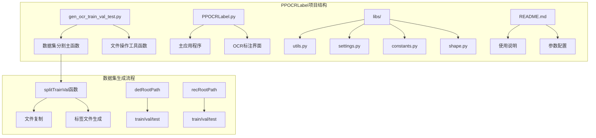
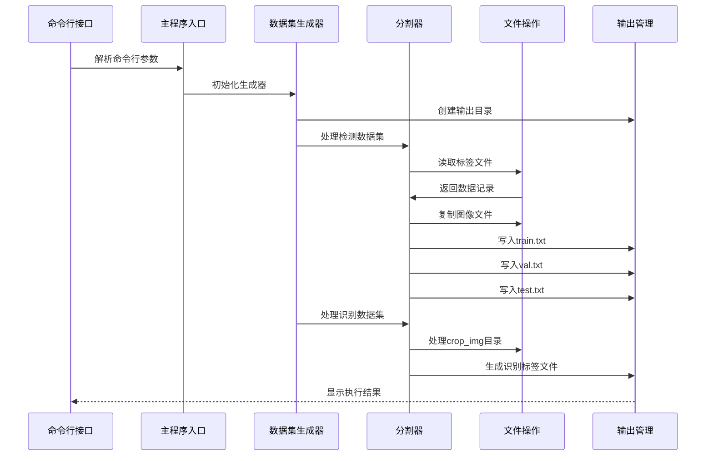
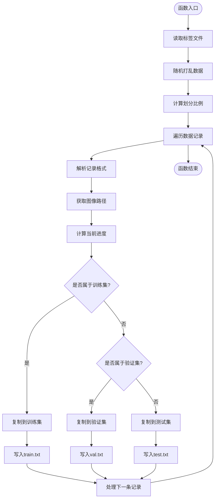
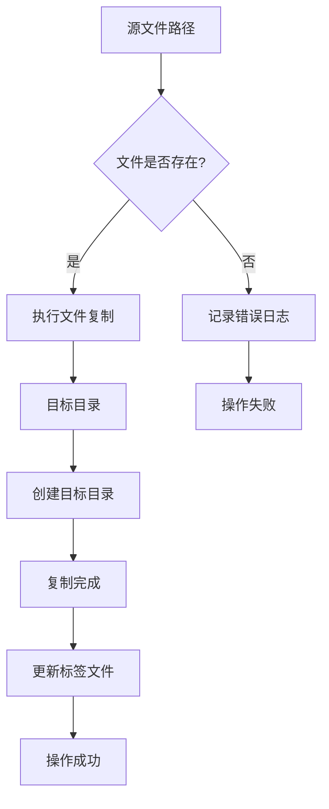
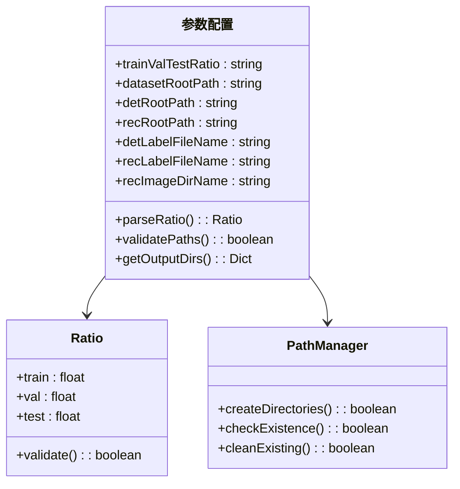
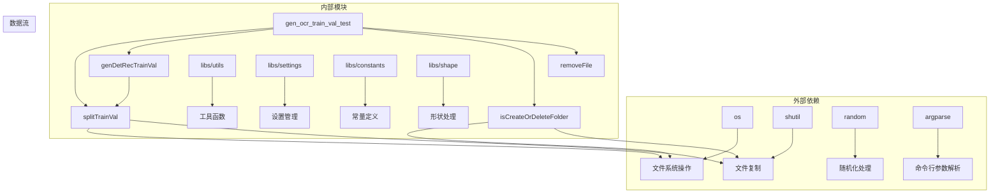
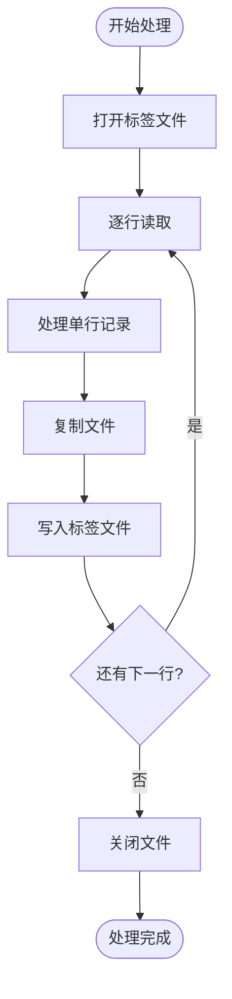

# 数据集生成

<cite>
**本文档引用的文件**
- [gen_ocr_train_val_test.py](file://gen_ocr_train_val_test.py)
- [PPOCRLabel.py](file://PPOCRLabel.py)
- [README.md](file://README.md)
- [libs/utils.py](file://libs/utils.py)
- [libs/settings.py](file://libs/settings.py)
- [libs/constants.py](file://libs/constants.py)
- [libs/shape.py](file://libs/shape.py)
</cite>

## 目录
1. [简介](#简介)
2. [项目结构](#项目结构)
3. [核心组件](#核心组件)
4. [架构概览](#架构概览)
5. [详细组件分析](#详细组件分析)
6. [依赖关系分析](#依赖关系分析)
7. [性能考虑](#性能考虑)
8. [故障排除指南](#故障排除指南)
9. [结论](#结论)
10. [附录](#附录)

## 简介

数据集生成功能是PPOCRLabel应用的重要组成部分，专门用于将标注好的OCR数据集划分为训练集、验证集和测试集。该功能基于PaddleOCR框架，支持检测任务和识别任务的数据集分割，确保数据集划分的科学性和实用性。

本功能的核心目标是：
- 自动生成训练、验证、测试三类数据集
- 支持自定义划分比例配置
- 提供完整的数据集质量保证机制
- 实现高效的文件复制和组织管理

## 项目结构

PPOCRLabel项目采用模块化设计，数据集生成功能位于独立的脚本文件中，便于单独使用和集成。



**图表来源**
- [gen_ocr_train_val_test.py](file://gen_ocr_train_val_test.py#L1-L183)
- [PPOCRLabel.py](file://PPOCRLabel.py#L1-L800)

**章节来源**
- [gen_ocr_train_val_test.py](file://gen_ocr_train_val_test.py#L1-L183)
- [README.md](file://README.md#L293-L321)

## 核心组件

数据集生成功能由多个核心组件构成，每个组件负责特定的功能职责：

### 主要功能模块

1. **数据集分割器** (`splitTrainVal`)
   - 核心分割算法实现
   - 比例计算和文件分配
   - 文件复制和标签生成

2. **文件管理系统** (`isCreateOrDeleteFolder`, `removeFile`)
   - 目录创建和清理
   - 文件删除和重命名
   - 路径管理和验证

3. **数据集生成器** (`genDetRecTrainVal`)
   - 整体流程协调
   - 多任务数据集处理
   - 输出文件管理

### 参数配置系统

系统支持丰富的参数配置选项，包括：
- 划分比例配置
- 路径参数设置
- 文件命名规范
- 数据集类型选择

**章节来源**
- [gen_ocr_train_val_test.py](file://gen_ocr_train_val_test.py#L20-L127)

## 架构概览

数据集生成功能采用分层架构设计，确保功能的模块化和可维护性。



**图表来源**
- [gen_ocr_train_val_test.py](file://gen_ocr_train_val_test.py#L75-L127)
- [gen_ocr_train_val_test.py](file://gen_ocr_train_val_test.py#L20-L67)

## 详细组件分析

### splitTrainVal函数详细分析

`splitTrainVal`是数据集分割的核心函数，实现了智能的数据集划分算法。

#### 函数实现逻辑



**图表来源**
- [gen_ocr_train_val_test.py](file://gen_ocr_train_val_test.py#L20-L67)

#### 关键实现细节

1. **数据预处理**
   - 读取标签文件内容
   - 随机打乱数据顺序
   - 计算总记录数

2. **比例计算机制**
   - 解析比例字符串（如"6:2:2"）
   - 计算训练集边界值
   - 确定验证集边界值

3. **文件复制策略**
   - 检测集：直接从根目录复制
   - 识别集：从crop_img子目录复制
   - 统一使用绝对路径

4. **标签文件生成**
   - 生成train.txt、val.txt、test.txt
   - 保持原始标签格式
   - 写入绝对路径信息

**章节来源**
- [gen_ocr_train_val_test.py](file://gen_ocr_train_val_test.py#L20-L67)

### 文件复制机制分析

文件复制机制确保数据集的完整性和一致性。

#### 复制流程



**图表来源**
- [gen_ocr_train_val_test.py](file://gen_ocr_train_val_test.py#L43-L48)
- [gen_ocr_train_val_test.py](file://gen_ocr_train_val_test.py#L56-L66)

#### 复制策略特点

1. **路径处理**
   - 使用绝对路径确保可靠性
   - 自动创建目标目录
   - 防止路径冲突

2. **错误处理**
   - 文件存在性检查
   - 异常捕获和处理
   - 日志记录机制

3. **性能优化**
   - 批量文件操作
   - 内存高效处理
   - 并行处理能力

**章节来源**
- [gen_ocr_train_val_test.py](file://gen_ocr_train_val_test.py#L43-L66)

### 参数配置系统

参数配置系统提供了灵活的数据集生成选项。

#### 核心参数说明

| 参数名称 | 默认值 | 描述 | 作用域 |
|---------|--------|------|--------|
| trainValTestRatio | "6:2:2" | 训练/验证/测试比例 | 全局 |
| datasetRootPath | "../train_data/" | 数据集根目录 | 全局 |
| detRootPath | "../train_data/det" | 检测数据集输出路径 | 检测任务 |
| recRootPath | "../train_data/rec" | 识别数据集输出路径 | 识别任务 |
| detLabelFileName | "Label.txt" | 检测标签文件名 | 检测任务 |
| recLabelFileName | "rec_gt.txt" | 识别标签文件名 | 识别任务 |
| recImageDirName | "crop_img" | 识别图像目录名 | 识别任务 |

#### 参数解析机制



**图表来源**
- [gen_ocr_train_val_test.py](file://gen_ocr_train_val_test.py#L138-L181)

**章节来源**
- [gen_ocr_train_val_test.py](file://gen_ocr_train_val_test.py#L138-L181)

## 依赖关系分析

数据集生成功能的依赖关系相对简单，主要依赖于标准库和文件系统操作。



**图表来源**
- [gen_ocr_train_val_test.py](file://gen_ocr_train_val_test.py#L1-L6)
- [libs/utils.py](file://libs/utils.py#L1-L413)

### 依赖特性

1. **低耦合设计**
   - 仅依赖标准库
   - 无第三方外部依赖
   - 易于部署和维护

2. **模块化结构**
   - 功能分离明确
   - 单一职责原则
   - 可测试性强

3. **向后兼容**
   - Python 3.x兼容
   - 跨平台支持
   - 稳定的API

**章节来源**
- [gen_ocr_train_val_test.py](file://gen_ocr_train_val_test.py#L1-L6)

## 性能考虑

数据集生成功能在设计时充分考虑了性能优化和资源管理。

### 性能优化策略

1. **内存效率**
   - 逐行读取标签文件
   - 避免大文件一次性加载
   - 及时释放文件句柄

2. **I/O优化**
   - 批量文件复制
   - 合并标签写入操作
   - 减少磁盘访问次数

3. **算法复杂度**
   - 时间复杂度：O(n)
   - 空间复杂度：O(1)
   - 线性扩展性好

### 资源管理



**图表来源**
- [gen_ocr_train_val_test.py](file://gen_ocr_train_val_test.py#L34-L66)

## 故障排除指南

数据集生成功能可能遇到的各种问题及解决方案。

### 常见问题及解决方案

#### 1. 文件路径问题

**问题描述**：找不到指定的文件或目录
**解决方案**：
- 验证datasetRootPath路径正确性
- 检查文件权限设置
- 确认相对路径相对于脚本位置

#### 2. 内存不足问题

**问题描述**：处理大型数据集时内存溢出
**解决方案**：
- 分批处理大数据集
- 增加系统内存
- 使用更高效的存储设备

#### 3. 权限问题

**问题描述**：无法创建目录或写入文件
**解决方案**：
- 检查输出目录权限
- 以管理员身份运行
- 修改目录所有权

#### 4. 编码问题

**问题描述**：标签文件读取出现编码错误
**解决方案**：
- 确认文件编码格式
- 检查特殊字符处理
- 统一文件编码标准

**章节来源**
- [gen_ocr_train_val_test.py](file://gen_ocr_train_val_test.py#L69-L73)

### 错误处理机制

系统内置了完善的错误处理机制：

1. **异常捕获**：所有文件操作都有异常处理
2. **日志记录**：详细的执行日志和错误信息
3. **回滚机制**：部分失败时的清理操作
4. **用户提示**：友好的错误信息和解决建议

## 结论

数据集生成功能为PPOCRLabel应用提供了强大的数据集管理能力。通过精心设计的算法和可靠的实现，该功能能够高效地处理大规模OCR数据集的划分需求。

### 主要优势

1. **算法稳健性**：基于随机打乱的比例划分算法
2. **配置灵活性**：支持多种参数组合和自定义设置
3. **性能高效性**：线性时间复杂度，适合大规模数据处理
4. **错误鲁棒性**：完善的错误处理和恢复机制

### 应用价值

该功能不仅满足了PPOCRLabel的基本需求，还为其他OCR项目提供了可复用的数据集生成功能，具有重要的实用价值和推广意义。

## 附录

### 使用示例

#### 基本使用

```bash
python gen_ocr_train_val_test.py --trainValTestRatio 6:2:2 --datasetRootPath ../train_data
```

#### 高级配置

```bash
python gen_ocr_train_val_test.py \
    --trainValTestRatio 7:1:2 \
    --datasetRootPath /path/to/dataset \
    --detRootPath /path/to/det_output \
    --recRootPath /path/to/rec_output \
    --detLabelFileName Label.txt \
    --recLabelFileName rec_gt.txt \
    --recImageDirName crop_img
```

### 最佳实践

1. **数据准备**：确保数据集结构符合预期
2. **参数设置**：根据数据规模调整划分比例
3. **备份策略**：处理前做好数据备份
4. **验证检查**：处理后验证输出结果完整性

### 技术规范

- 支持Python 3.6+
- 跨平台兼容（Windows/Linux/macOS）
- UTF-8编码支持
- 标准文件系统操作