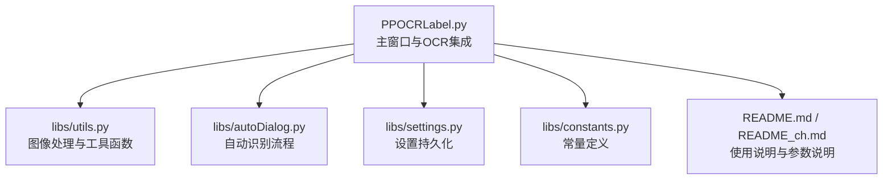
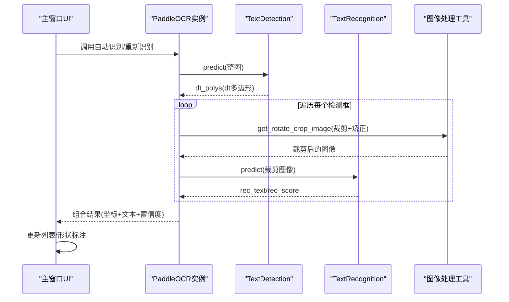
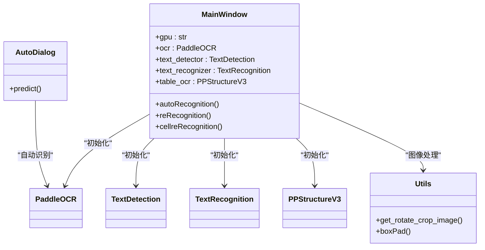
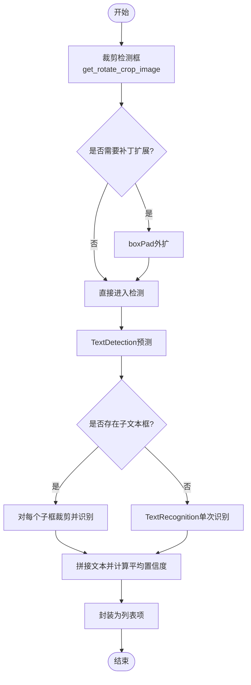
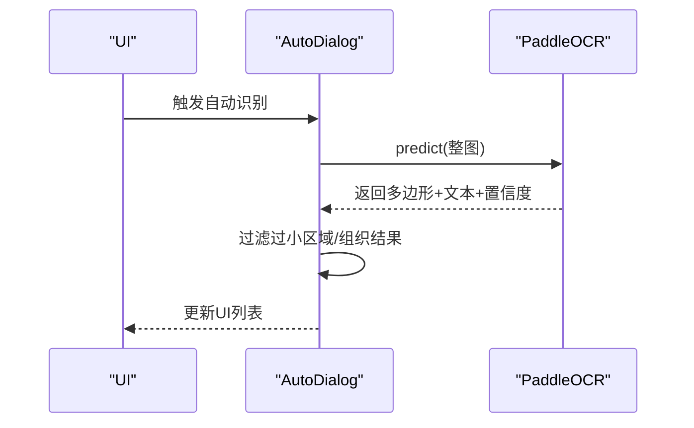
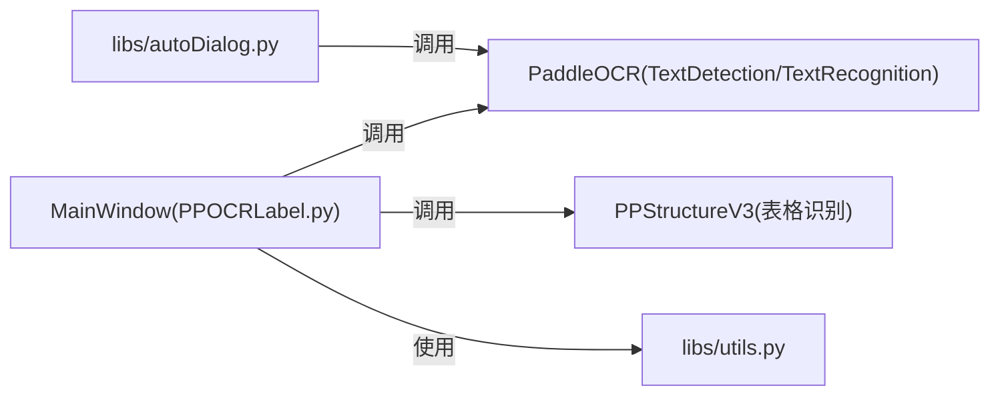

# OCR模型集成

<cite>
**本文引用的文件**
- [PPOCRLabel.py](file://PPOCRLabel.py)
- [libs/utils.py](file://libs/utils.py)
- [libs/settings.py](file://libs/settings.py)
- [libs/constants.py](file://libs/constants.py)
- [libs/autoDialog.py](file://libs/autoDialog.py)
- [README.md](file://README.md)
- [README_ch.md](file://README_ch.md)
</cite>

## 目录
1. [简介](#简介)
2. [项目结构](#项目结构)
3. [核心组件](#核心组件)
4. [架构总览](#架构总览)
5. [详细组件分析](#详细组件分析)
6. [依赖关系分析](#依赖关系分析)
7. [性能考量](#性能考量)
8. [故障排查指南](#故障排查指南)
9. [结论](#结论)
10. [附录](#附录)

## 简介
本文件面向希望在应用中集成PaddleOCR能力的开发者，系统性阐述在PPOCRLabel项目中的OCR模型集成方式，涵盖TextDetection与TextRecognition两类模型的初始化、配置与调用；说明设备选择（CPU/GPU）、模型路径配置、图像预处理与后处理流程、结果解析与展示、性能优化与内存管理策略，以及常见错误处理与排障要点。文档以仓库现有实现为依据，提供可追溯的“章节来源”与“图表来源”。

## 项目结构
- 应用入口与主窗口逻辑集中在主程序文件中，负责OCR实例化、UI事件绑定、自动/手动识别流程调度。
- 工具模块提供图像裁剪、旋转、补丁填充、标签序列化等通用能力。
- 设置与常量模块提供配置持久化与键值约定。
- 自动对话框模块封装自动识别流程与结果组织。

图表来源
- [PPOCRLabel.py](file://PPOCRLabel.py#L170-L260)
- [libs/utils.py](file://libs/utils.py#L142-L192)
- [libs/autoDialog.py](file://libs/autoDialog.py#L48-L75)
- [libs/settings.py](file://libs/settings.py#L1-L62)
- [libs/constants.py](file://libs/constants.py#L1-L33)
- [README.md](file://README.md#L254-L279)

章节来源
- [PPOCRLabel.py](file://PPOCRLabel.py#L170-L260)
- [README.md](file://README.md#L254-L279)

## 核心组件
- OCR实例化与设备选择
  - 主窗口构造时根据平台能力与参数选择设备（GPU/CPU），并初始化PaddleOCR、TextDetection、TextRecognition与表格识别PPStructureV3实例。
  - 设备选择逻辑基于PaddlePaddle的CUDA可用性判断，支持通过命令行参数启用GPU。
- 文本检测与识别
  - 使用TextDetection进行文本区域检测，返回多边形框；随后对每个候选区域进行裁剪与透视矫正，再交由TextRecognition进行识别。
- 图像预处理与后处理
  - 预处理：对检测框进行补丁扩展与旋转矫正，确保识别输入图像质量。
  - 后处理：将识别结果与检测框坐标组合，形成最终标注条目；表格场景下先做单元格内文本检测与识别，再聚合为单元格文本。
- 结果解析与展示
  - 将OCR输出映射为UI列表项，支持手动编辑与重新识别；支持KIE模式下的关键字类别标注。
- 性能与内存
  - 通过设备选择与模型名称控制推理负载；自动识别时对过小图像进行跳过以避免无效计算；缓存机制用于减少重复识别成本。

章节来源
- [PPOCRLabel.py](file://PPOCRLabel.py#L170-L260)
- [PPOCRLabel.py](file://PPOCRLabel.py#L3043-L3071)
- [PPOCRLabel.py](file://PPOCRLabel.py#L3223-L3281)
- [libs/utils.py](file://libs/utils.py#L142-L192)
- [libs/autoDialog.py](file://libs/autoDialog.py#L48-L75)

## 架构总览
下图展示了OCR推理在应用中的端到端流程：从图像加载到UI标注，贯穿检测、识别、结果解析与展示。

图表来源
- [PPOCRLabel.py](file://PPOCRLabel.py#L3043-L3071)
- [PPOCRLabel.py](file://PPOCRLabel.py#L3223-L3281)
- [libs/utils.py](file://libs/utils.py#L142-L192)

章节来源
- [PPOCRLabel.py](file://PPOCRLabel.py#L3043-L3071)
- [PPOCRLabel.py](file://PPOCRLabel.py#L3223-L3281)
- [libs/utils.py](file://libs/utils.py#L142-L192)

## 详细组件分析

### 文本检测与识别组件
- 初始化与参数
  - 设备选择：根据平台是否支持CUDA决定使用GPU还是CPU。
  - 模型名称：默认使用移动端轻量模型，支持通过参数指定自定义模型目录。
  - 语言与功能开关：支持多语言、方向校正、去畸变等可选功能。
- 调用流程
  - 整图自动识别：对整图进行检测，遍历多边形框，逐块裁剪并识别，最后汇总。
  - 单框/单元格重新识别：对选中形状或表格单元格进行检测与识别，支持补丁扩展提升鲁棒性。
- 结果组织
  - 输出包含多边形坐标、识别文本与置信度；表格场景下按行优先聚合单元格文本。

图表来源
- [PPOCRLabel.py](file://PPOCRLabel.py#L170-L260)
- [PPOCRLabel.py](file://PPOCRLabel.py#L3043-L3071)
- [PPOCRLabel.py](file://PPOCRLabel.py#L3223-L3281)
- [libs/utils.py](file://libs/utils.py#L142-L192)
- [libs/autoDialog.py](file://libs/autoDialog.py#L48-L75)

章节来源
- [PPOCRLabel.py](file://PPOCRLabel.py#L170-L260)
- [PPOCRLabel.py](file://PPOCRLabel.py#L3043-L3071)
- [PPOCRLabel.py](file://PPOCRLabel.py#L3223-L3281)
- [libs/autoDialog.py](file://libs/autoDialog.py#L48-L75)

### 图像预处理与后处理流程
- 预处理
  - 检测框裁剪：使用透视变换与边界框计算，得到规整的识别图像。
  - 补丁扩展：在单元格识别场景中对检测框进行外扩，提升识别稳定性。
- 后处理
  - 文本拼接：按行优先顺序拼接单元格内多个文本块，计算平均置信度。
  - 结果封装：将坐标、文本、置信度与可选的关键字类别组合为列表项。

图表来源
- [libs/utils.py](file://libs/utils.py#L142-L192)
- [PPOCRLabel.py](file://PPOCRLabel.py#L3223-L3281)

章节来源
- [libs/utils.py](file://libs/utils.py#L142-L192)
- [PPOCRLabel.py](file://PPOCRLabel.py#L3223-L3281)

### 自动识别流程
- 触发条件：用户点击“自动识别”按钮或启用自动重新识别选项。
- 流程要点：对整图进行检测，过滤过小区域，逐块识别并组织结果；支持将结果写入缓存与标注文件。

图表来源
- [libs/autoDialog.py](file://libs/autoDialog.py#L48-L75)
- [PPOCRLabel.py](file://PPOCRLabel.py#L1781-L1839)

章节来源
- [libs/autoDialog.py](file://libs/autoDialog.py#L48-L75)
- [PPOCRLabel.py](file://PPOCRLabel.py#L1781-L1839)

## 依赖关系分析
- 组件耦合
  - 主窗口与OCR实例强耦合，负责生命周期管理与调用调度。
  - 图像处理工具与主窗口弱耦合，通过函数调用复用。
  - 自动对话框与OCR实例弱耦合，仅在自动识别场景中交互。
- 外部依赖
  - PaddleOCR库：提供检测与识别能力。
  - OpenCV/Numpy：图像读取、裁剪与几何变换。
  - PyQt5：GUI与事件驱动。

图表来源
- [PPOCRLabel.py](file://PPOCRLabel.py#L170-L260)
- [libs/autoDialog.py](file://libs/autoDialog.py#L48-L75)
- [libs/utils.py](file://libs/utils.py#L142-L192)

章节来源
- [PPOCRLabel.py](file://PPOCRLabel.py#L170-L260)
- [libs/autoDialog.py](file://libs/autoDialog.py#L48-L75)
- [libs/utils.py](file://libs/utils.py#L142-L192)

## 性能考量
- 设备选择
  - 优先使用GPU（若平台支持CUDA），否则回退到CPU，降低延迟并提升吞吐。
- 模型选择
  - 默认使用移动端轻量模型，兼顾速度与精度；支持通过参数指定自定义模型目录以适配特定场景。
- 输入尺寸控制
  - 对过小图像（宽高阈值）跳过识别，避免无效计算与内存浪费。
- 缓存与增量更新
  - 使用缓存文件存储中间结果，减少重复识别；在重新识别时仅更新受影响区域。
- UI渲染与批处理
  - 在批处理场景中，尽量减少UI刷新频率，避免频繁重绘导致卡顿。

章节来源
- [PPOCRLabel.py](file://PPOCRLabel.py#L170-L260)
- [libs/autoDialog.py](file://libs/autoDialog.py#L48-L75)

## 故障排查指南
- GPU不可用或CUDA相关错误
  - 确认PaddlePaddle安装与CUDA版本匹配；必要时切换到CPU模式。
- OpenCV版本不兼容
  - 遵循文档建议安装特定版本的OpenCV，避免平台插件或API缺失问题。
- 资源编译与字符串ID
  - 若出现资源相关错误，按说明重新编译资源文件。
- 模型路径与权限
  - 确保模型目录存在且具备读取权限；自定义模型路径需与模型名称对应。
- 中文文件名限制
  - 文档明确指出不支持中文文件名的图片进行自动标注，需将文件名改为ASCII字符。

章节来源
- [README.md](file://README.md#L322-L351)
- [README_ch.md](file://README_ch.md#L298-L334)

## 结论
本项目在主窗口集中管理OCR实例，结合工具模块完成图像预处理与后处理，形成从检测到识别再到UI展示的闭环流程。通过设备选择、模型参数与输入尺寸控制，能够在不同硬件条件下取得较好的性能表现；同时借助缓存与批处理策略，进一步优化用户体验。遇到常见问题时，可依据文档中的排障指引快速定位并解决问题。

## 附录
- 参数与配置要点
  - 设备选择：通过命令行参数启用GPU；若平台不支持则自动回退CPU。
  - 模型路径：支持分别指定检测与识别模型目录；表格识别模型目录亦可独立配置。
  - 语言与功能：支持多语言切换与方向校正、去畸变等功能开关。
- 常用调用路径参考
  - 文本检测：参见 [PPOCRLabel.py](file://PPOCRLabel.py#L3043-L3071)
  - 文本识别（单框/单元格）：参见 [PPOCRLabel.py](file://PPOCRLabel.py#L3223-L3281)
  - 自动识别流程：参见 [libs/autoDialog.py](file://libs/autoDialog.py#L48-L75)
  - 图像预处理工具：参见 [libs/utils.py](file://libs/utils.py#L142-L192)