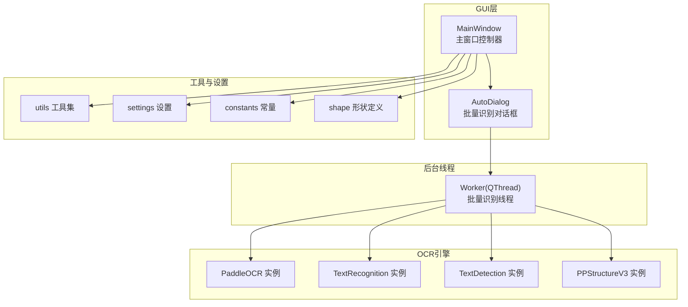
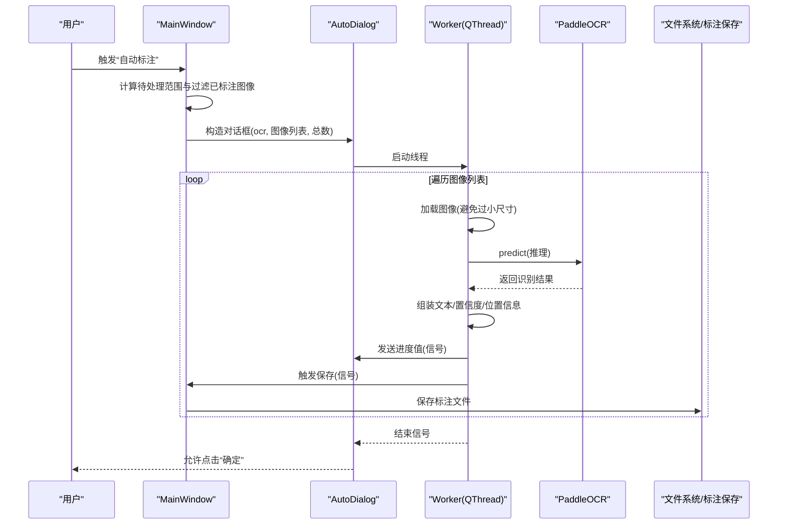
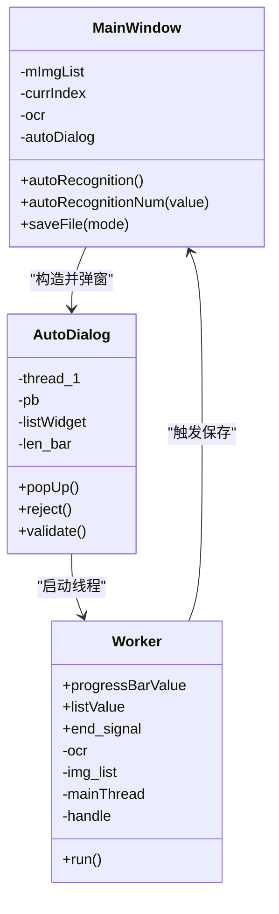
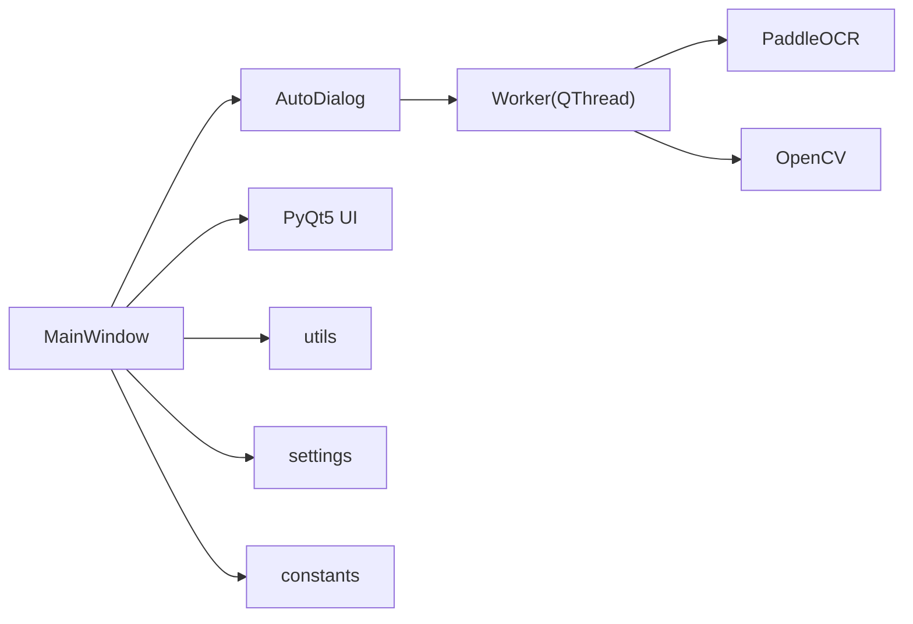

# 批量处理机制

<cite>
**本文引用的文件**
- [libs/autoDialog.py](file://libs/autoDialog.py)
- [PPOCRLabel.py](file://PPOCRLabel.py)
- [libs/utils.py](file://libs/utils.py)
- [libs/settings.py](file://libs/settings.py)
- [libs/constants.py](file://libs/constants.py)
- [libs/shape.py](file://libs/shape.py)
- [README.md](file://README.md)
</cite>

## 目录
1. [简介](#简介)
2. [项目结构](#项目结构)
3. [核心组件](#核心组件)
4. [架构总览](#架构总览)
5. [详细组件分析](#详细组件分析)
6. [依赖关系分析](#依赖关系分析)
7. [性能考虑](#性能考虑)
8. [故障排查指南](#故障排查指南)
9. [结论](#结论)
10. [附录](#附录)

## 简介
本文件系统性阐述 PPOCRLabel 中的批量处理机制，重点围绕 AutoDialog 对话框的设计与实现，涵盖：
- 批量识别参数配置（如识别数量、过滤已标注图像）
- 进度显示与剩余时间估算
- 取消操作与线程安全退出
- 从选择图像到生成标注文件的完整工作流
- 性能优化策略、并发控制与内存管理
- 使用示例与最佳实践

## 项目结构
该模块位于应用的 GUI 层与 OCR 引擎之间，通过 AutoDialog 调用 Worker 线程执行批量识别，并将结果回传主线程以保存标注文件。

图表来源
- [PPOCRLabel.py](file://PPOCRLabel.py#L143-L275)
- [libs/autoDialog.py](file://libs/autoDialog.py#L103-L146)
- [libs/utils.py](file://libs/utils.py#L1-L413)
- [libs/settings.py](file://libs/settings.py#L21-L62)
- [libs/constants.py](file://libs/constants.py#L13-L33)
- [libs/shape.py](file://libs/shape.py#L35-L285)

章节来源
- [PPOCRLabel.py](file://PPOCRLabel.py#L143-L275)
- [libs/autoDialog.py](file://libs/autoDialog.py#L103-L146)

## 核心组件
- AutoDialog：弹出式对话框，承载进度条、列表与按钮，协调主线程与 Worker 线程交互。
- Worker(QThread)：后台线程，负责逐图加载、OCR 推理、结果拼接与触发主线程保存。
- MainWindow：主窗口控制器，负责组织图像列表、调用批量识别、保存标注文件。
- 工具与设置：提供图标、动作、自然排序、颜色映射、设置持久化等支撑能力。

章节来源
- [libs/autoDialog.py](file://libs/autoDialog.py#L22-L101)
- [PPOCRLabel.py](file://PPOCRLabel.py#L2923-L2955)
- [libs/utils.py](file://libs/utils.py#L33-L82)
- [libs/settings.py](file://libs/settings.py#L21-L62)

## 架构总览
批量识别的端到端流程如下：

图表来源
- [PPOCRLabel.py](file://PPOCRLabel.py#L2923-L2955)
- [libs/autoDialog.py](file://libs/autoDialog.py#L37-L101)
- [PPOCRLabel.py](file://PPOCRLabel.py#L2587-L2648)

## 详细组件分析

### AutoDialog 对话框设计与实现
- 界面元素
  - 进度条：显示已完成数量，范围由构造时传入总数决定。
  - 列表控件：滚动显示每张图的识别摘要，便于快速核验。
  - 按钮：OK（启用于结束）、Cancel（禁用取消）。
- 交互逻辑
  - 进度更新：接收 Worker 的进度信号，同时计算剩余时间并更新窗口标题。
  - 列表更新：接收 Worker 的文本摘要信号，自动滚动到底部。
  - 结束条件：收到结束信号后启用 OK，禁用 Cancel。
  - 取消：点击取消或关闭事件时，向 Worker 发送退出指令并等待线程结束。
- 参数配置
  - 图像列表：仅包含未标注的图像（基于文件状态字典过滤）。
  - 总数：用于进度条范围与剩余时间估算。

章节来源
- [libs/autoDialog.py](file://libs/autoDialog.py#L103-L196)

### Worker 线程处理逻辑
- 线程启动与生命周期
  - 在构造时绑定 OCR 实例、图像列表、主线程引用与模型类型。
  - run 方法内按序遍历图像，遇到退出标志立即停止。
- 图像处理
  - 尺寸检查：仅当高宽均大于阈值才进行识别。
  - OCR 推理：调用 predict 获取多边形、文本与置信度。
  - 结果组装：将多边形坐标、文本与置信度序列化为字符串，供 UI 显示；同时构建内部结构供保存。
- 进度与回调
  - 每处理完一张图，发送进度值与摘要文本；最后发送结束信号。
  - 将结果与当前图像路径写入主线程共享字段，触发主线程保存。

章节来源
- [libs/autoDialog.py](file://libs/autoDialog.py#L22-L101)

### MainWindow 批量识别入口
- 参数与范围
  - 当前索引与自动识别数量，计算起止索引，截取图像列表。
  - 过滤已标注图像：基于文件状态字典，仅保留未标注的图像。
- 对话框与后续
  - 构造 AutoDialog 并弹窗，结束后刷新当前图像、保存缓存标注并初始化键列表。

章节来源
- [PPOCRLabel.py](file://PPOCRLabel.py#L2915-L2955)

### 标注保存与文件输出
- 保存接口
  - saveFile(mode="Manual"/"Auto")：根据模式分别处理锁定框与普通框，最终调用内部保存逻辑。
- 自动保存策略
  - 达到一定数量的标注后，自动保存文件状态与识别结果。
- 文件格式
  - 检测标注文件与识别标注文件，分别对应检测模型与识别模型的训练数据。

章节来源
- [PPOCRLabel.py](file://PPOCRLabel.py#L2587-L2648)

### 类关系图

图表来源
- [PPOCRLabel.py](file://PPOCRLabel.py#L2923-L2955)
- [libs/autoDialog.py](file://libs/autoDialog.py#L103-L196)

## 依赖关系分析
- 模块耦合
  - MainWindow 与 AutoDialog 通过构造参数传递 OCR 实例与图像列表，弱耦合。
  - AutoDialog 与 Worker 通过信号槽连接，解耦 UI 与后台任务。
  - Worker 与 OCR 引擎直接交互，但通过主线程保存实现与 UI 的解耦。
- 外部依赖
  - PaddleOCR：文本检测、识别、表格结构识别。
  - OpenCV：图像解码与裁剪。
  - PyQt5：UI 与线程通信。

图表来源
- [PPOCRLabel.py](file://PPOCRLabel.py#L83-L85)
- [libs/autoDialog.py](file://libs/autoDialog.py#L6-L8)
- [libs/utils.py](file://libs/utils.py#L20-L24)

章节来源
- [PPOCRLabel.py](file://PPOCRLabel.py#L83-L85)
- [libs/autoDialog.py](file://libs/autoDialog.py#L6-L8)

## 性能考虑
- 并发控制
  - 单线程批处理：Worker 串行处理图像，避免 GPU/CPU 资源争用与上下文切换开销。
  - 线程栈大小：显式设置线程栈大小，降低异常风险。
- I/O 与内存
  - 图像解码：使用二进制方式读取，避免路径编码问题；仅在满足尺寸阈值时进行推理。
  - 结果缓存：Worker 内部暂存识别结果，减少重复计算；主线程保存时统一落盘。
- 进度与 UI 响应
  - 采用信号槽异步更新进度与列表，避免阻塞主线程 UI。
  - 剩余时间估算：基于平均耗时，动态更新窗口标题，提升用户体验。
- 批量策略
  - 仅处理未标注图像，避免重复工作。
  - 自动保存：达到阈值后自动保存，降低长时间运行的丢失风险。

章节来源
- [libs/autoDialog.py](file://libs/autoDialog.py#L35-L36)
- [libs/autoDialog.py](file://libs/autoDialog.py#L44-L65)
- [PPOCRLabel.py](file://PPOCRLabel.py#L2915-L2955)
- [PPOCRLabel.py](file://PPOCRLabel.py#L2632-L2634)

## 故障排查指南
- 无法识别或识别结果为空
  - 检查图像尺寸是否小于阈值，必要时提高阈值或人工裁剪。
  - 确认 OCR 模型加载成功且设备可用。
- 进度卡住或 UI 无响应
  - 确保信号槽连接正常，避免在主线程执行耗时操作。
  - 检查线程是否正确退出（取消时需等待线程完成）。
- 保存失败或标注缺失
  - 确认保存接口被调用（手动/自动模式），并检查文件写入权限。
  - 核对标注文件格式与路径，确保未被外部修改。

章节来源
- [libs/autoDialog.py](file://libs/autoDialog.py#L172-L178)
- [PPOCRLabel.py](file://PPOCRLabel.py#L2587-L2648)

## 结论
该批量处理机制通过 AutoDialog 与 Worker 的清晰分工，实现了从图像选择、OCR 推理、进度反馈到标注保存的完整闭环。其单线程串行策略兼顾稳定性与资源可控，结合自动保存与剩余时间估算提升了大规模数据标注的效率与体验。建议在实际使用中合理设置识别数量、关注图像质量与模型性能，以获得更佳的批处理效果。

## 附录

### 使用示例与最佳实践
- 快速开始
  - 打开图像目录，选择“自动标注”，设置需要处理的图像数量，点击“确定”开始。
- 最佳实践
  - 优先保证图像质量与分辨率，避免过小图像导致识别失败。
  - 分批处理：根据硬件性能设置合理的批量大小，避免一次性处理过多图像。
  - 定期保存：利用自动保存阈值，减少长时间运行的风险。
  - 取消策略：若发现错误批次，及时点击取消并等待线程退出，再重新开始。

章节来源
- [README.md](file://README.md#L147-L174)
- [PPOCRLabel.py](file://PPOCRLabel.py#L2915-L2955)