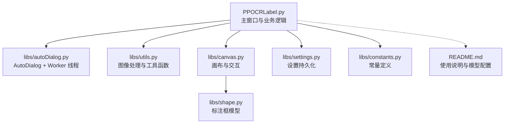
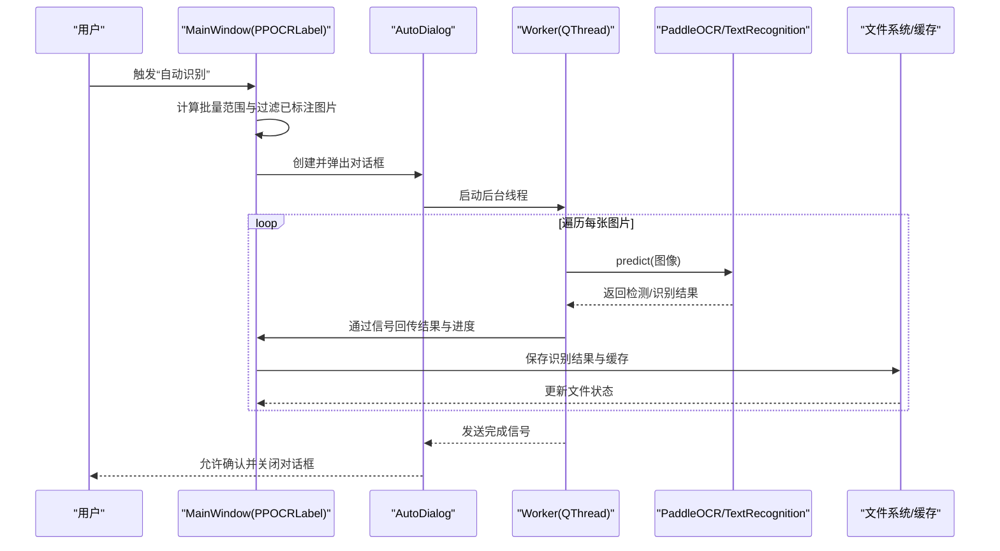
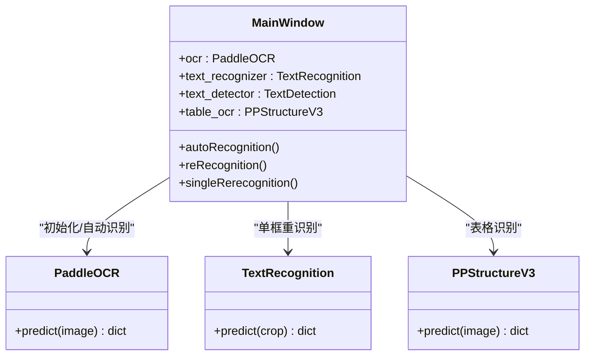
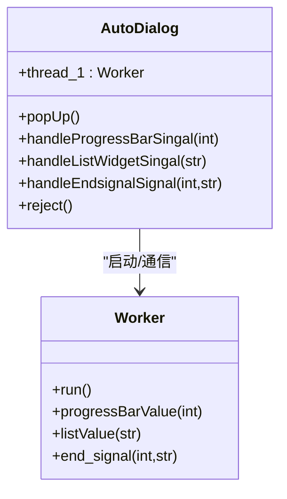
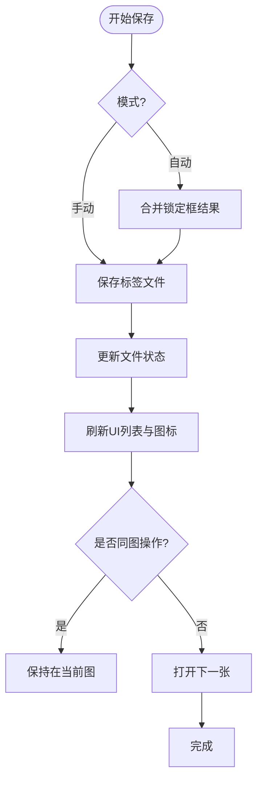
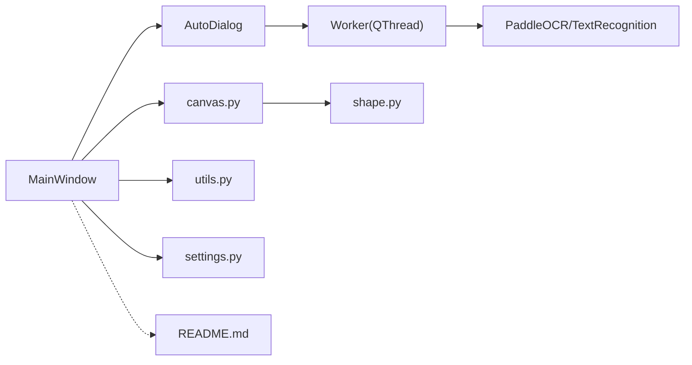

# 智能自动识别

<cite>
**本文引用的文件**
- [PPOCRLabel.py](file://PPOCRLabel.py)
- [autoDialog.py](file://libs/autoDialog.py)
- [utils.py](file://libs/utils.py)
- [canvas.py](file://libs/canvas.py)
- [shape.py](file://libs/shape.py)
- [settings.py](file://libs/settings.py)
- [constants.py](file://libs/constants.py)
- [README.md](file://README.md)
</cite>

## 目录
1. [简介](#简介)
2. [项目结构](#项目结构)
3. [核心组件](#核心组件)
4. [架构总览](#架构总览)
5. [详细组件分析](#详细组件分析)
6. [依赖关系分析](#依赖关系分析)
7. [性能考量](#性能考量)
8. [故障排查指南](#故障排查指南)
9. [结论](#结论)
10. [附录](#附录)

## 简介
本文件面向希望掌握 PaddleOCR 集成与智能自动识别功能的开发者与使用者，系统性阐述以下内容：
- PaddleOCR 文本检测与识别模型的调用机制
- AutoDialog 对话框的实现与批处理线程工作流
- 批量识别功能的实现原理与控制逻辑
- 自动识别从图像加载到标注框生成的完整流程
- 识别参数配置、结果处理、错误处理与重试机制
- 实际使用示例与最佳实践
- 与手动标注的协作模式与数据同步机制

## 项目结构
该项目采用 PyQt5 图形界面与 PaddleOCR 推理引擎结合的桌面标注工具，核心模块如下：
- 主程序入口与主窗口逻辑：PPOCRLabel.py
- 自动识别对话框与后台线程：libs/autoDialog.py
- 工具函数与图像处理：libs/utils.py
- 画布与标注框渲染：libs/canvas.py、libs/shape.py
- 设置与常量：libs/settings.py、libs/constants.py
- 使用说明与模型配置：README.md

图表来源
- [PPOCRLabel.py](file://PPOCRLabel.py#L143-L250)
- [autoDialog.py](file://libs/autoDialog.py#L103-L146)
- [utils.py](file://libs/utils.py#L1-L120)
- [canvas.py](file://libs/canvas.py#L32-L120)
- [shape.py](file://libs/shape.py#L35-L120)
- [settings.py](file://libs/settings.py#L21-L62)
- [constants.py](file://libs/constants.py#L13-L33)
- [README.md](file://README.md#L147-L224)

章节来源
- [PPOCRLabel.py](file://PPOCRLabel.py#L143-L250)
- [README.md](file://README.md#L147-L224)

## 核心组件
- PaddleOCR 初始化与模型实例化
  - 在主窗口初始化时，根据语言与设备选择加载 PaddleOCR、TextRecognition、TextDetection 与 PPStructureV3（表格识别）等模型。
  - 支持通过参数指定检测/识别/分类模型目录，以及设备类型（CPU/GPU）。
- 自动识别对话框与线程
  - AutoDialog 弹窗负责展示进度条、实时日志与结束状态；Worker 线程执行批量推理与结果写入。
- 结果存储与标注同步
  - 将识别结果写入缓存与标签文件，更新文件状态与 UI 列表，支持与手动标注协同。

章节来源
- [PPOCRLabel.py](file://PPOCRLabel.py#L194-L232)
- [autoDialog.py](file://libs/autoDialog.py#L103-L146)
- [utils.py](file://libs/utils.py#L142-L191)

## 架构总览
自动识别的整体流程如下：
- 用户选择起始索引与批量数量
- 过滤已标注的图片，仅对未标注图片执行自动识别
- 启动 AutoDialog 与 Worker 线程
- Worker 逐图加载、推理、封装结果并通过信号回传到主线程
- 主线程保存识别结果并刷新 UI

图表来源
- [PPOCRLabel.py](file://PPOCRLabel.py#L2923-L2950)
- [autoDialog.py](file://libs/autoDialog.py#L142-L146)
- [autoDialog.py](file://libs/autoDialog.py#L37-L96)

章节来源
- [PPOCRLabel.py](file://PPOCRLabel.py#L2923-L2950)
- [autoDialog.py](file://libs/autoDialog.py#L103-L146)

## 详细组件分析

### 组件一：PaddleOCR 模型集成与调用
- 模型初始化
  - 通过 PaddleOCR 参数控制是否启用文档方向分类、文本行方向、文档去扭曲等选项；默认使用移动端检测与识别模型，支持 CPU/GPU 设备。
  - 提供独立的 TextRecognition 与 TextDetection 实例用于单框重识别场景。
  - 表格识别使用 PPStructureV3，开启表格识别能力。
- 推理调用
  - 自动识别：Worker 线程对每张图调用 predict，解析 rec_polys/rec_texts/rec_scores 并转换为可序列化格式。
  - 单框重识别：对选中框裁剪后调用 TextRecognition.predict 获取文本与置信度。
- 错误处理
  - 当图片尺寸过小或无法识别时记录警告日志；当裁剪失败时提示用户手动调整框。

图表来源
- [PPOCRLabel.py](file://PPOCRLabel.py#L194-L232)
- [PPOCRLabel.py](file://PPOCRLabel.py#L2957-L3076)
- [PPOCRLabel.py](file://PPOCRLabel.py#L3078-L3122)

章节来源
- [PPOCRLabel.py](file://PPOCRLabel.py#L194-L232)
- [PPOCRLabel.py](file://PPOCRLabel.py#L2957-L3076)

### 组件二：AutoDialog 对话框与 Worker 线程
- AutoDialog
  - 展示进度条与实时识别日志；计算剩余时间并动态更新标题；提供“确定/取消”按钮，取消时终止线程。
- Worker(QThread)
  - 逐图加载图像，过滤过小图片；调用 OCR.predict 获取多边形、文本与置信度；将结果通过信号发送给主线程；主线程保存结果并刷新 UI。
  - 处理异常并记录错误日志。

图表来源
- [autoDialog.py](file://libs/autoDialog.py#L103-L146)
- [autoDialog.py](file://libs/autoDialog.py#L22-L100)

章节来源
- [autoDialog.py](file://libs/autoDialog.py#L103-L146)
- [autoDialog.py](file://libs/autoDialog.py#L22-L100)

### 组件三：结果处理与保存
- 保存策略
  - 自动模式：保存识别结果到缓存与标签文件，更新文件状态；达到一定数量后自动写入文件状态与标签。
  - 手动模式：用户点击“保存”后，将当前图片状态标记为已确认，更新 UI 并自动跳转下一张。
- 数据结构
  - 识别结果以 [多边形坐标, (文本, 置信度)] 的形式存储；锁定框（锁住的标注）单独维护列表以便后续合并保存。
- UI 同步
  - 识别结果写入后，刷新标签列表、索引列表与检测框列表，确保与画布中的标注框一致。

图表来源
- [PPOCRLabel.py](file://PPOCRLabel.py#L2605-L2648)
- [PPOCRLabel.py](file://PPOCRLabel.py#L2631-L2638)

章节来源
- [PPOCRLabel.py](file://PPOCRLabel.py#L2605-L2648)

### 组件四：图像处理与工具函数
- 图像旋转裁剪
  - 基于标注框坐标进行透视变换与旋转校正，保证识别区域为标准矩形。
- 边界框扩展
  - 对标注框进行像素级扩展，便于识别更完整的文本区域。
- 坐标中心与面积计算
  - 用于辅助排序与可视化。

章节来源
- [utils.py](file://libs/utils.py#L142-L191)
- [utils.py](file://libs/utils.py#L193-L205)
- [utils.py](file://libs/utils.py#L373-L403)

### 组件五：画布与标注框
- 画布交互
  - 支持矩形与四点标注模式，鼠标拖拽绘制、右键移动、键盘快捷键微调顶点。
- 标注框模型
  - 支持高亮、选中、旋转、移动与复制粘贴等操作；支持锁定框功能，用于固定某些框的识别结果。

章节来源
- [canvas.py](file://libs/canvas.py#L129-L221)
- [canvas.py](file://libs/canvas.py#L351-L384)
- [shape.py](file://libs/shape.py#L35-L120)

## 依赖关系分析
- 主窗口依赖
  - PaddleOCR 模型实例与工具函数；与 AutoDialog 对话框配合实现批处理。
- AutoDialog 依赖
  - Worker 线程与 PyQt 信号槽；与主窗口共享识别结果与文件路径。
- 工具函数依赖
  - OpenCV 与 NumPy；与图像处理与几何变换相关。
- 画布与标注框
  - 与主窗口事件联动，驱动 UI 刷新与保存流程。

图表来源
- [PPOCRLabel.py](file://PPOCRLabel.py#L2923-L2950)
- [autoDialog.py](file://libs/autoDialog.py#L142-L146)
- [canvas.py](file://libs/canvas.py#L32-L120)
- [shape.py](file://libs/shape.py#L35-L120)
- [utils.py](file://libs/utils.py#L1-L120)
- [settings.py](file://libs/settings.py#L21-L62)
- [README.md](file://README.md#L147-L224)

章节来源
- [PPOCRLabel.py](file://PPOCRLabel.py#L2923-L2950)
- [autoDialog.py](file://libs/autoDialog.py#L142-L146)

## 性能考量
- 线程与异步
  - 使用 QThread 与信号槽避免阻塞 UI；建议在 GPU 可用时优先使用 GPU 加速。
- 图像尺寸与预处理
  - 对过小图片进行跳过处理，减少无效推理；必要时对框进行扩展以提升识别质量。
- 批处理策略
  - 控制批量大小与进度显示，合理安排任务队列，避免内存峰值过高。
- 缓存与增量保存
  - 采用缓存与自动保存策略，降低频繁 IO 压力。

## 故障排查指南
- 无法识别或识别结果为空
  - 检查图片尺寸是否过小；确认裁剪区域有效；尝试手动调整标注框。
- 模型加载失败或版本不匹配
  - 按照 README 中的依赖与安装说明进行修复；必要时重新编译资源文件。
- 线程异常或卡死
  - 查看日志输出，确认 Worker 是否正常退出；检查信号槽连接与异常捕获。
- 表格识别无输出
  - 确认表格识别模型可用且输入图像包含表格；若无表格则返回空结果属预期。

章节来源
- [autoDialog.py](file://libs/autoDialog.py#L98-L100)
- [README.md](file://README.md#L322-L350)

## 结论
本项目通过 PyQt5 与 PaddleOCR 的深度集成，实现了从图像加载、自动识别、结果保存到 UI 同步的完整闭环。AutoDialog 与 Worker 的分离设计保证了 UI 流畅与推理效率；与手动标注的协作模式使得半自动化标注成为可能。通过合理的参数配置与错误处理机制，可在不同场景下获得稳定可靠的识别效果。

## 附录

### 使用示例与最佳实践
- 启动与基础使用
  - 参考 README 的安装与运行步骤，选择语言与模式启动应用。
- 自动识别参数配置
  - 语言与设备：在主窗口初始化时设置语言与设备类型；默认使用移动端模型。
  - 模型目录：可通过参数指定检测/识别/分类模型目录，满足自定义部署需求。
- 批量识别流程
  - 选择起始索引与批量数量；系统自动过滤已标注图片；弹出 AutoDialog 进行批处理。
- 与手动标注协作
  - 对未覆盖的区域进行手动标注；使用“重新识别”对当前图片所有框进行重识别；锁定框功能可用于固定重要识别结果。
- 数据导出
  - 导出标签文件与识别训练数据，支持自动与手动两种导出模式。

章节来源
- [README.md](file://README.md#L147-L224)
- [PPOCRLabel.py](file://PPOCRLabel.py#L194-L232)
- [PPOCRLabel.py](file://PPOCRLabel.py#L2923-L2950)