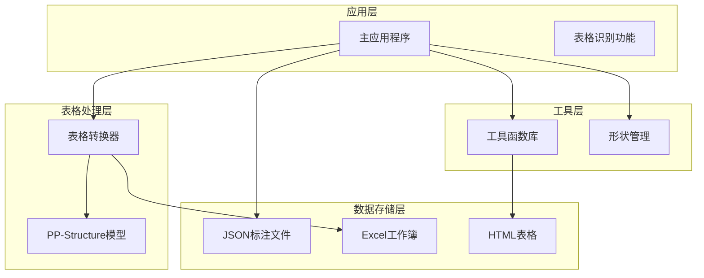
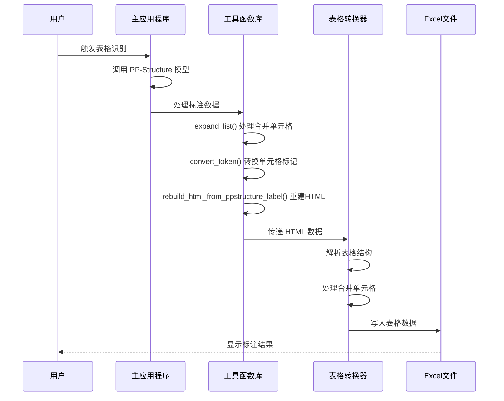
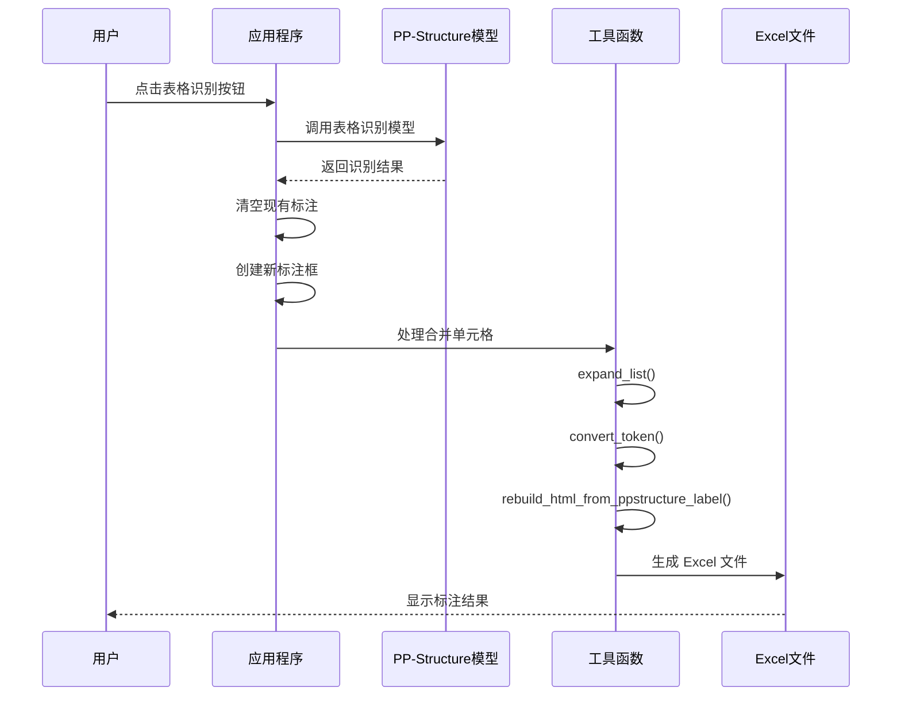
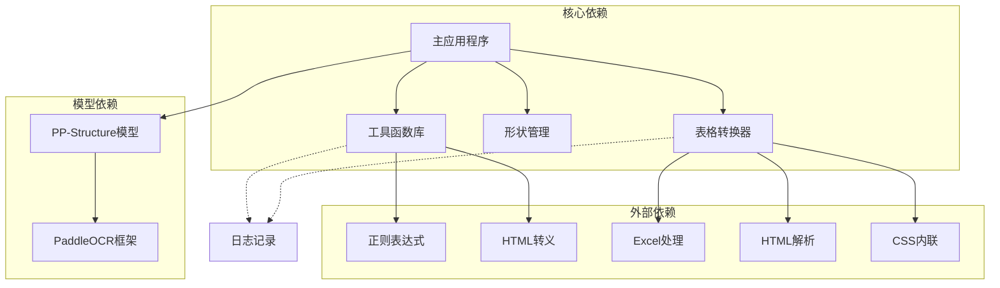
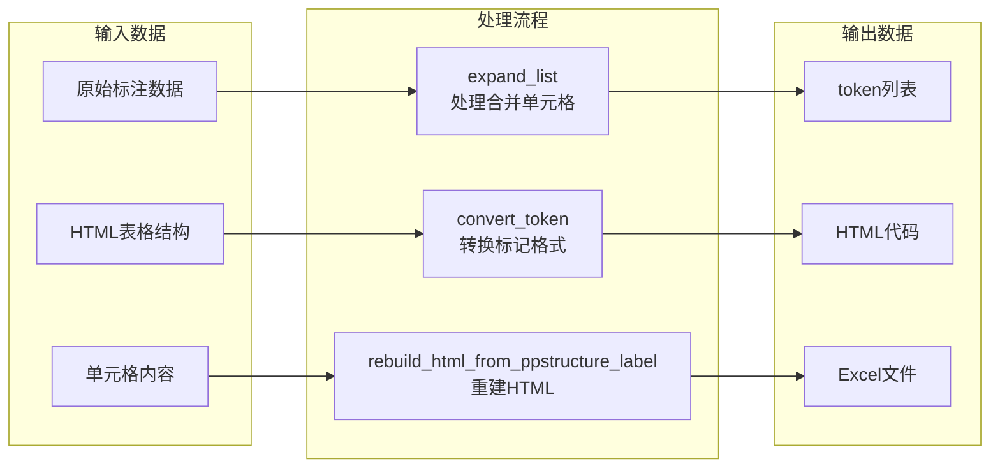

# HTML 表格转换工具

<cite>
**本文档引用的文件**
- [libs/utils.py](file://libs/utils.py)
- [PPOCRLabel.py](file://PPOCRLabel.py)
- [tablepyxl/tablepyxl.py](file://tablepyxl/tablepyxl.py)
- [libs/shape.py](file://libs/shape.py)
- [README.md](file://README.md)
</cite>

## 目录
1. [简介](#简介)
2. [项目结构](#项目结构)
3. [核心组件](#核心组件)
4. [架构概览](#架构概览)
5. [详细组件分析](#详细组件分析)
6. [依赖关系分析](#依赖关系分析)
7. [性能考虑](#性能考虑)
8. [故障排除指南](#故障排除指南)
9. [结论](#结论)

## 简介

HTML 表格转换工具是 PPOCRLabel 应用程序中的一个重要功能模块，专门用于处理表格结构的标注和转换。该工具基于 PaddleOCR 的 PP-Structure 模型，能够自动识别表格结构并将标注结果转换为 HTML 格式，支持单元格合并、属性标注等功能。

该工具的核心价值在于：
- **自动化表格识别**：通过 PP-Structure 模型自动识别表格结构
- **灵活的标注格式**：支持多种表格标注格式的转换
- **精确的单元格处理**：正确处理合并单元格和复杂表格结构
- **标准化输出**：生成符合标准的 HTML 表格代码

## 项目结构

该项目采用模块化的组织方式，主要包含以下核心模块：



**图表来源**
- [PPOCRLabel.py](file://PPOCRLabel.py#L143-L3853)
- [libs/utils.py](file://libs/utils.py#L1-L413)
- [tablepyxl/tablepyxl.py](file://tablepyxl/tablepyxl.py#L1-L136)

**章节来源**
- [PPOCRLabel.py](file://PPOCRLabel.py#L1-L100)
- [README.md](file://README.md#L1-L50)

## 核心组件

### 工具函数库 (libs/utils.py)

工具函数库提供了表格处理的核心功能，包含三个关键函数：

1. **expand_list()** - 处理单元格合并
2. **convert_token()** - 转换单元格标记
3. **rebuild_html_from_ppstructure_label()** - 从 PP-Structure 标注重建 HTML

### 表格转换器 (tablepyxl/tablepyxl.py)

表格转换器负责将 HTML 表格转换为 Excel 工作簿，支持：
- 合并单元格处理
- 表格样式应用
- 单元格内容写入

### 主应用程序 (PPOCRLabel.py)

主应用程序集成了完整的表格标注流程，包括：
- 表格识别功能
- 标注结果导出
- Excel 文件生成

**章节来源**
- [libs/utils.py](file://libs/utils.py#L208-L271)
- [tablepyxl/tablepyxl.py](file://tablepyxl/tablepyxl.py#L1-L136)
- [PPOCRLabel.py](file://PPOCRLabel.py#L3077-L3220)

## 架构概览

HTML 表格转换工具采用分层架构设计，确保各组件职责清晰、耦合度低：



**图表来源**
- [PPOCRLabel.py](file://PPOCRLabel.py#L3077-L3220)
- [libs/utils.py](file://libs/utils.py#L208-L271)
- [tablepyxl/tablepyxl.py](file://tablepyxl/tablepyxl.py#L78-L136)

## 详细组件分析

### expand_list 函数分析

expand_list 函数负责处理表格中的单元格合并，其核心逻辑如下：

```mermaid
flowchart TD
Start([函数入口]) --> GetRange[获取合并范围<br/>sr, er, sc, ec]
GetRange --> FillBlanks[填充空白区域<br/>html_list[i][j] = None]
FillBlanks --> CheckColspan{检查列跨度}
CheckColspan --> |大于1| AddColspan[添加 colspan 属性<br/>colspan=(ec-sc+1)]
CheckColspan --> |等于1| CheckRowspan{检查行跨度}
CheckRowspan --> |大于1| AddRowspan[添加 rowspan 属性<br/>rowspan=(er-sr+1)]
CheckRowspan --> |等于1| SkipAttrs[跳过属性添加]
AddColspan --> Finalize[设置起始单元格为空字符串]
AddRowspan --> Finalize
SkipAttrs --> Finalize
Finalize --> End([函数返回])
```

**图表来源**
- [libs/utils.py](file://libs/utils.py#L208-L223)

**实现特点**：
- 使用四元组 (sr, er, sc, ec) 表示合并单元格的边界
- 将合并区域内的所有单元格设置为 None，避免重复渲染
- 动态计算 colspan 和 rowspan 值
- 仅在必要时添加属性，提高效率

**章节来源**
- [libs/utils.py](file://libs/utils.py#L208-L223)

### convert_token 函数分析

convert_token 函数负责将原始 HTML 列表转换为标准的 HTML 标记格式：

```mermaid
flowchart TD
Start([函数入口]) --> InitToken[初始化 token 列表<br/>["<tbody>"]]
InitToken --> IterateRows[遍历每一行]
IterateRows --> AddTr[添加 <tr> 标签]
AddTr --> IterateCols[遍历每一列]
IterateCols --> CheckNone{单元格为 None?}
CheckNone --> |是| Continue[跳过空单元格]
CheckNone --> |否| CheckTd{单元格为 "td"?}
CheckTd --> |是| AddTd[添加标准 <td></td> 标签]
CheckTd --> |否| ParseAttrs[解析属性<br/>colspan 和 rowspan]
ParseAttrs --> AddTdTag[添加 <td 开始标签]
AddTdTag --> CheckColspan{存在 colspan?}
CheckColspan --> |是| AddColspan[添加 colspan 属性]
CheckColspan --> |否| CheckRowspan{存在 rowspan?}
CheckRowspan --> |是| AddRowspan[添加 rowspan 属性]
CheckRowspan --> |否| SkipAttrs[跳过属性]
AddColspan --> CloseTd[关闭 td 标签]
AddRowspan --> CloseTd
SkipAttrs --> CloseTd
CloseTd --> AddEndTd[添加 </td> 结束标签]
AddTd --> AddEndTd
AddEndTd --> NextCol[处理下一列]
NextCol --> EndTr[添加 </tr> 标签]
EndTr --> NextRow[处理下一行]
NextRow --> AddTbody[添加 </tbody> 标签]
AddTbody --> Return[返回 token 列表]
Continue --> NextCol
```

**图表来源**
- [libs/utils.py](file://libs/utils.py#L226-L253)

**实现特点**：
- 使用正则表达式解析 colspan 和 rowspan 属性
- 支持动态属性添加，提高灵活性
- 维护正确的 HTML 标签嵌套结构
- 返回可直接使用的 token 列表

**章节来源**
- [libs/utils.py](file://libs/utils.py#L226-L253)

### rebuild_html_from_ppstructure_label 函数分析

rebuild_html_from_ppstructure_label 函数负责从 PP-Structure 标注格式重建完整的 HTML 代码：

```mermaid
flowchart TD
Start([函数入口]) --> ExtractTokens[提取结构标记<br/>label_info["html"]["structure"]["tokens"]]
ExtractTokens --> FindInsertPos[查找插入位置<br/>"<td>" 和 ">" 标签]
FindInsertPos --> ReverseIter[反向迭代<br/>to_insert[::-1]]
ReverseIter --> ProcessCells[处理每个单元格<br/>label_info["html"]["cells"][::-1]]
ProcessCells --> CheckTokens{单元格有 tokens?}
CheckTokens --> |是| EscapeTokens[转义特殊字符<br/>escape(token) if len(token)==1]
CheckTokens --> |否| SkipCell[跳过空单元格]
EscapeTokens --> JoinCell[连接单元格内容<br/>"".join(cell)]
JoinCell --> InsertContent[在指定位置插入内容<br/>html_code.insert(i+1, cell)]
InsertContent --> NextCell[处理下一个单元格]
SkipCell --> NextCell
NextCell --> JoinHtml[连接所有标记<br/>"".join(html_code)]
JoinHtml --> FixAttrs[修复属性格式<br/>re.sub(r'(colspan|rowspan)="(\\d+)"', r"\\1=\\2", html_code)]
FixAttrs --> WrapHtml[包装 HTML 结构<br/>"<html><body><table>{}</table></body></html>"]
WrapHtml --> Return[返回完整 HTML]
```

**图表来源**
- [libs/utils.py](file://libs/utils.py#L256-L271)

**实现特点**：
- 使用反向迭代确保插入位置的正确性
- 对单字符 token 进行 HTML 转义处理
- 自动修复属性格式问题
- 提供完整的 HTML 包装结构

**章节来源**
- [libs/utils.py](file://libs/utils.py#L256-L271)

### 表格识别流程分析

主应用程序中的表格识别功能实现了完整的标注流程：



**图表来源**
- [PPOCRLabel.py](file://PPOCRLabel.py#L3077-L3220)

**实现特点**：
- 支持单表格识别（每张图片只处理一个表格）
- 自动清理旧的标注数据
- 集成多种处理步骤
- 自动生成 Excel 文件

**章节来源**
- [PPOCRLabel.py](file://PPOCRLabel.py#L3077-L3220)

## 依赖关系分析

### 组件间依赖关系



**图表来源**
- [PPOCRLabel.py](file://PPOCRLabel.py#L84-L232)
- [libs/utils.py](file://libs/utils.py#L13-L26)
- [tablepyxl/tablepyxl.py](file://tablepyxl/tablepyxl.py#L5-L10)

### 数据流分析



**图表来源**
- [libs/utils.py](file://libs/utils.py#L208-L271)

**章节来源**
- [libs/utils.py](file://libs/utils.py#L1-L413)
- [tablepyxl/tablepyxl.py](file://tablepyxl/tablepyxl.py#L1-L136)

## 性能考虑

### 时间复杂度分析

1. **expand_list 函数**：O((er-sr+1) × (ec-sc+1))，主要用于填充合并区域
2. **convert_token 函数**：O(rows × cols)，遍历整个表格矩阵
3. **rebuild_html_from_ppstructure_label 函数**：O(n)，n 为标记数量
4. **表格识别流程**：O(n²)，主要由 Excel 合并单元格处理决定

### 内存优化策略

1. **延迟加载**：仅在需要时解析 HTML 结构
2. **增量处理**：逐行处理表格数据，减少内存占用
3. **资源管理**：及时释放临时变量和中间结果
4. **缓存机制**：复用已处理的数据结构

### 错误处理机制

1. **异常捕获**：所有外部依赖操作都包含异常处理
2. **回退机制**：当某个功能失败时，系统自动选择备选方案
3. **日志记录**：详细记录错误信息便于调试
4. **用户提示**：友好的错误消息帮助用户解决问题

**章节来源**
- [libs/utils.py](file://libs/utils.py#L189-L191)
- [tablepyxl/tablepyxl.py](file://tablepyxl/tablepyxl.py#L113-L120)

## 故障排除指南

### 常见问题及解决方案

#### 1. Excel 文件无法打开

**问题描述**：在非 Windows 系统上无法自动打开 Excel 文件

**解决方案**：
- 确保系统已安装 Excel 或兼容软件
- 检查文件权限设置
- 手动打开生成的 .xlsx 文件

#### 2. 合并单元格处理错误

**问题描述**：合并单元格在转换过程中出现位置错误

**解决方案**：
- 检查 Excel 中的合并单元格定义
- 确认单元格索引从 1 开始而非 0
- 验证表格结构的完整性

#### 3. HTML 转换失败

**问题描述**：HTML 标记转换过程中出现格式错误

**解决方案**：
- 检查输入数据的格式规范
- 验证正则表达式的匹配结果
- 确认 HTML 转义处理的正确性

#### 4. 性能问题

**问题描述**：大表格处理速度缓慢

**解决方案**：
- 优化表格大小或分页处理
- 调整批处理参数
- 考虑使用更高效的算法

### 调试技巧

1. **启用详细日志**：查看详细的错误信息和处理过程
2. **分步验证**：逐步检查每个处理步骤的结果
3. **单元测试**：为关键函数编写测试用例
4. **性能分析**：使用性能分析工具识别瓶颈

**章节来源**
- [PPOCRLabel.py](file://PPOCRLabel.py#L3193-L3218)
- [libs/utils.py](file://libs/utils.py#L189-L191)

## 结论

HTML 表格转换工具是一个功能完整、设计合理的表格标注处理系统。它成功地解决了以下关键问题：

1. **自动化处理**：通过 PP-Structure 模型实现表格结构的自动识别
2. **灵活转换**：支持多种表格格式之间的转换
3. **精确处理**：正确处理复杂的合并单元格场景
4. **用户友好**：提供直观的操作界面和清晰的反馈

该工具的主要优势包括：
- **模块化设计**：各组件职责明确，易于维护和扩展
- **错误处理**：完善的异常处理机制确保系统稳定性
- **性能优化**：针对大表格进行了专门的性能优化
- **兼容性强**：支持多种操作系统和文件格式

未来可以考虑的改进方向：
- 支持多表格识别
- 增强表格结构的智能分析能力
- 优化大表格的处理性能
- 扩展更多的输出格式支持