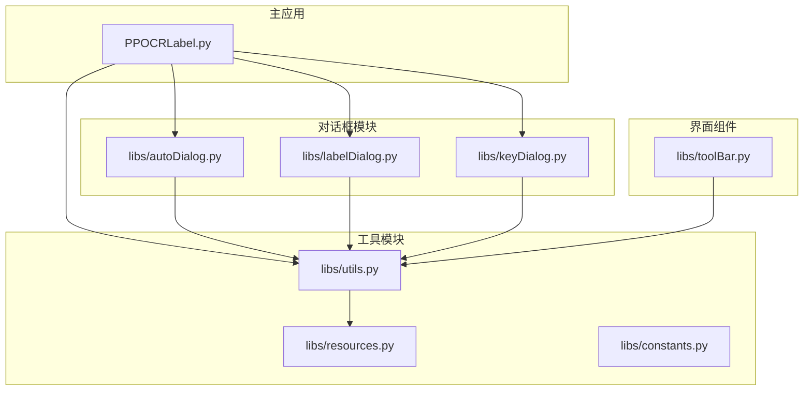
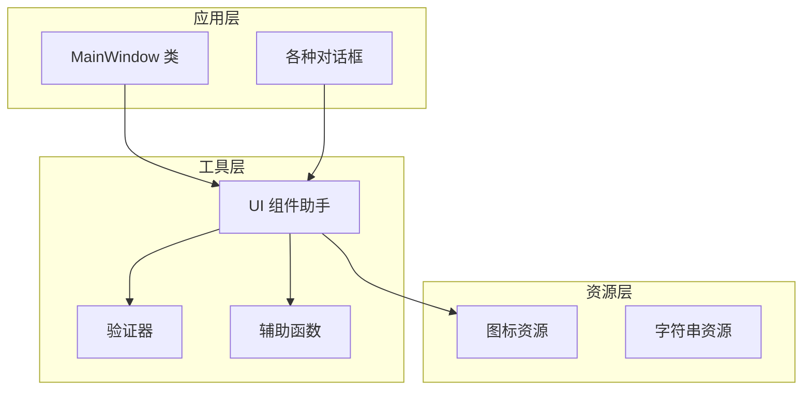
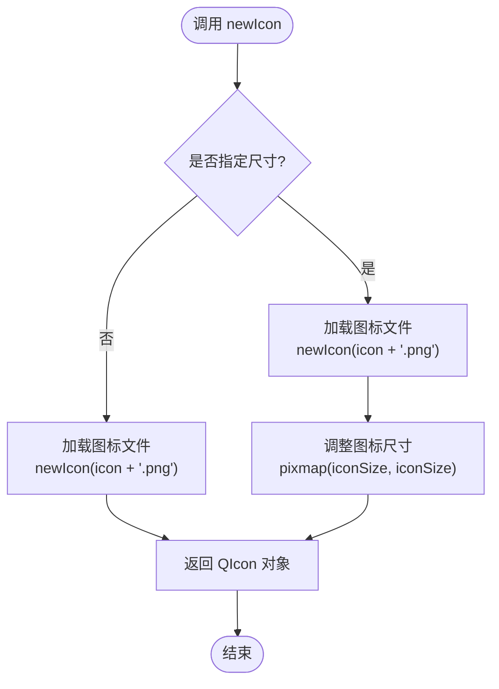
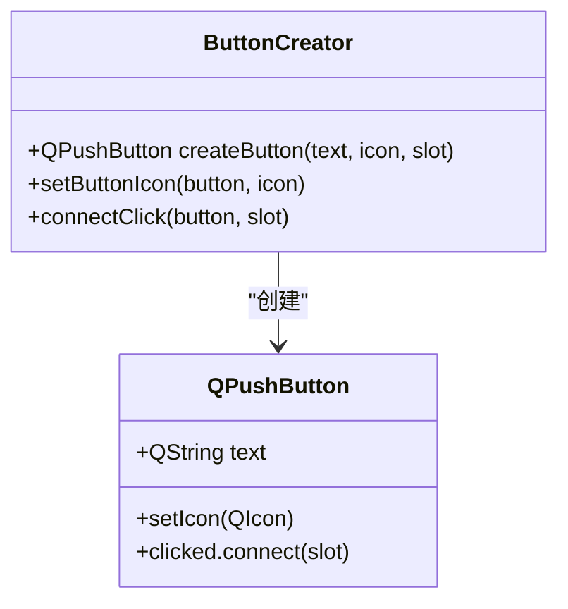
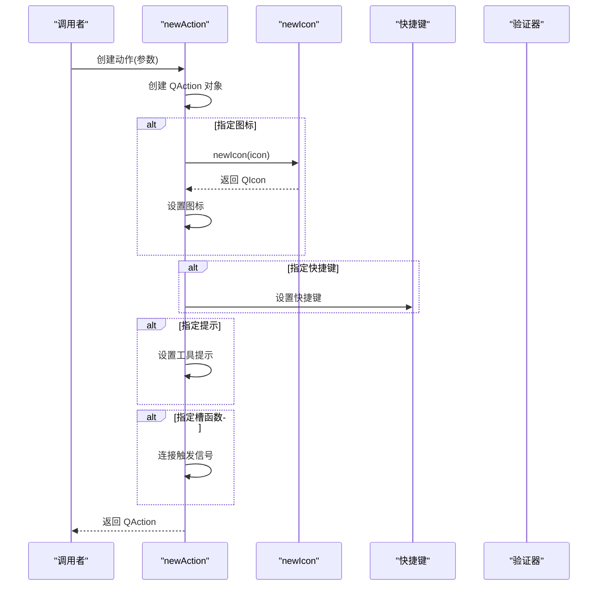
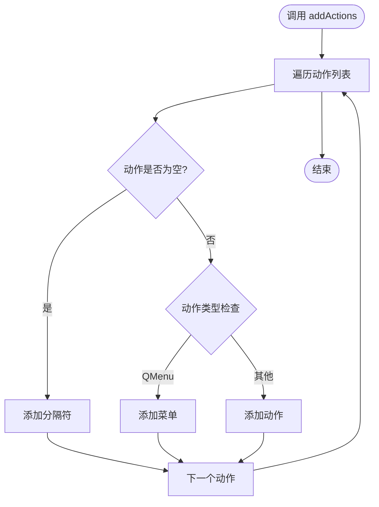
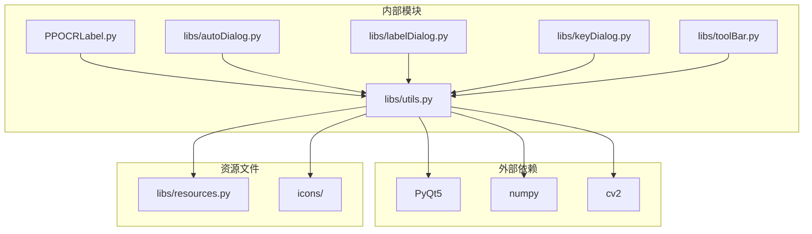

# UI 组件助手

<cite>
**本文档引用的文件**
- [libs/utils.py](file://libs/utils.py)
- [PPOCRLabel.py](file://PPOCRLabel.py)
- [libs/resources.py](file://libs/resources.py)
- [libs/toolBar.py](file://libs/toolBar.py)
- [libs/autoDialog.py](file://libs/autoDialog.py)
- [libs/labelDialog.py](file://libs/labelDialog.py)
- [libs/keyDialog.py](file://libs/keyDialog.py)
- [libs/constants.py](file://libs/constants.py)
</cite>

## 目录
1. [简介](#简介)
2. [项目结构](#项目结构)
3. [核心组件](#核心组件)
4. [架构概览](#架构概览)
5. [详细组件分析](#详细组件分析)
6. [依赖关系分析](#依赖关系分析)
7. [性能考虑](#性能考虑)
8. [故障排除指南](#故障排除指南)
9. [结论](#结论)

## 简介

UI 组件助手是 PPOCRLabel 项目中用于简化 PyQt5 GUI 组件创建和管理的核心工具模块。该模块提供了三个关键函数：`newIcon`、`newButton` 和 `newAction`，它们大大简化了图标加载、按钮配置、动作绑定和快捷键设置等常见 GUI 开发任务。

PPOCRLabel 是一个基于 PyQt5 的 OCR 文本标注工具，主要用于文档图像的文本检测和识别标注工作。UI 组件助手模块在整个应用中发挥着重要作用，为开发者提供了统一的 GUI 组件创建接口。

## 项目结构

该项目采用模块化设计，主要结构如下：

**图表来源**
- [PPOCRLabel.py](file://PPOCRLabel.py#L101-L118)
- [libs/utils.py](file://libs/utils.py#L1-L413)
- [libs/resources.py](file://libs/resources.py#L1-L800)

**章节来源**
- [PPOCRLabel.py](file://PPOCRLabel.py#L1-L136)
- [libs/utils.py](file://libs/utils.py#L1-L413)

## 核心组件

UI 组件助手模块包含以下三个核心函数：

### newIcon 函数
负责从资源文件系统中加载和创建图标对象，支持自定义图标尺寸。

### newButton 函数  
创建 QPushButton 对象，支持图标设置和点击事件处理。

### newAction 函数
创建 QAction 对象，支持图标、快捷键、提示信息、检查状态等多种配置选项。

这些函数通过统一的接口简化了 PyQt5 GUI 组件的创建过程，减少了重复代码，提高了开发效率。

**章节来源**
- [libs/utils.py](file://libs/utils.py#L33-L82)

## 架构概览

UI 组件助手在整个 PPOCRLabel 应用中的架构位置如下：

**图表来源**
- [PPOCRLabel.py](file://PPOCRLabel.py#L101-L118)
- [libs/utils.py](file://libs/utils.py#L1-L413)

## 详细组件分析

### newIcon 函数分析

newIcon 函数是 UI 组件助手的基础函数，负责图标资源的管理和创建。

**图表来源**
- [libs/utils.py](file://libs/utils.py#L33-L39)

#### 实现特点
- **资源路径管理**：通过 `__iconpath__` 变量统一管理图标文件路径
- **尺寸适配**：支持动态调整图标显示尺寸
- **错误处理**：自动处理图标文件不存在的情况

#### 使用场景
在 PPOCRLabel 中，newIcon 被广泛用于：
- 工具栏按钮图标
- 对话框按钮图标  
- 列表项图标
- 窗口图标

**章节来源**
- [libs/utils.py](file://libs/utils.py#L28-L39)

### newButton 函数分析

newButton 函数简化了按钮组件的创建过程。

**图表来源**
- [libs/utils.py](file://libs/utils.py#L42-L48)

#### 功能特性
- **文本设置**：支持按钮显示文本
- **图标集成**：自动调用 newIcon 加载图标
- **事件绑定**：支持点击事件处理器
- **链式调用**：返回完整的 QPushButton 对象

**章节来源**
- [libs/utils.py](file://libs/utils.py#L42-L48)

### newAction 函数分析

newAction 函数是最复杂的 UI 组件创建函数，提供了丰富的配置选项。

**图表来源**
- [libs/utils.py](file://libs/utils.py#L51-L82)

#### 配置选项
- **父对象**：指定动作的父容器
- **文本**：动作显示名称
- **槽函数**：触发时执行的回调函数
- **快捷键**：支持单个或多个快捷键
- **图标**：支持自定义图标和图标尺寸
- **提示信息**：工具提示和状态栏提示
- **检查状态**：是否支持复选框样式
- **启用状态**：初始启用/禁用状态

**章节来源**
- [libs/utils.py](file://libs/utils.py#L51-L82)

### addActions 函数分析

addActions 函数用于批量添加动作到菜单或工具栏。

**图表来源**
- [libs/utils.py](file://libs/utils.py#L85-L92)

**章节来源**
- [libs/utils.py](file://libs/utils.py#L85-L92)

## 依赖关系分析

UI 组件助手模块与其他模块的依赖关系如下：

**图表来源**
- [libs/utils.py](file://libs/utils.py#L20-L26)
- [PPOCRLabel.py](file://PPOCRLabel.py#L101-L118)

### 关键依赖关系

1. **PyQt5 依赖**：所有 GUI 组件的基础
2. **资源系统依赖**：图标和字符串资源管理
3. **应用层依赖**：主窗口和各种对话框的集成

**章节来源**
- [libs/utils.py](file://libs/utils.py#L20-L26)
- [PPOCRLabel.py](file://PPOCRLabel.py#L101-L118)

## 性能考虑

UI 组件助手模块在性能方面有以下优化策略：

### 图标缓存机制
- 图标资源通过 QIcon 对象缓存，避免重复加载
- 支持不同尺寸的图标预生成和缓存

### 内存管理
- 合理的资源释放时机
- 避免内存泄漏的连接断开

### 批量操作优化
- addActions 函数支持批量添加，减少多次更新开销

## 故障排除指南

### 常见问题及解决方案

#### 图标加载失败
**问题**：图标无法正确显示
**原因**：图标文件路径错误或文件损坏
**解决方案**：
1. 检查 `__iconpath__` 变量指向的路径
2. 验证图标文件是否存在且格式正确
3. 确认文件权限设置

#### 快捷键冲突
**问题**：快捷键不生效
**原因**：快捷键与系统或其他组件冲突
**解决方案**：
1. 检查快捷键组合的唯一性
2. 避免与系统默认快捷键冲突
3. 在应用启动时注册快捷键

#### 内存泄漏
**问题**：长时间运行后内存占用增加
**原因**：信号槽连接未正确断开
**解决方案**：
1. 确保在组件销毁时断开所有连接
2. 使用弱引用避免循环引用
3. 定期清理临时对象

**章节来源**
- [libs/utils.py](file://libs/utils.py#L28-L31)

## 结论

UI 组件助手模块通过提供简洁统一的 API，显著简化了 PPOCRLabel 应用中 GUI 组件的创建和管理过程。其设计体现了以下优势：

1. **代码复用**：避免重复的 GUI 组件创建代码
2. **一致性**：确保所有组件遵循相同的配置规范
3. **可维护性**：集中化的组件管理便于维护和升级
4. **扩展性**：易于添加新的组件类型和配置选项

该模块的成功实施为整个 PPOCRLabel 项目提供了坚实的 GUI 基础，使得开发者能够专注于业务逻辑的实现，而无需过多关注底层的 GUI 细节。