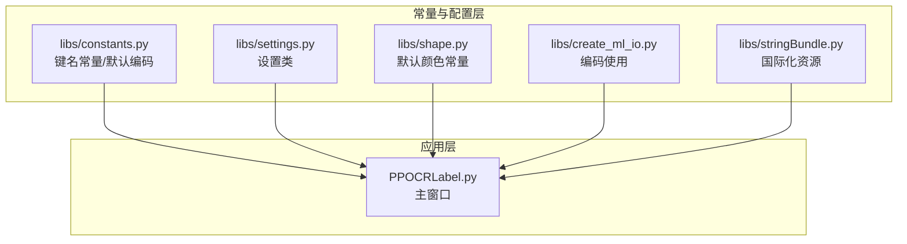
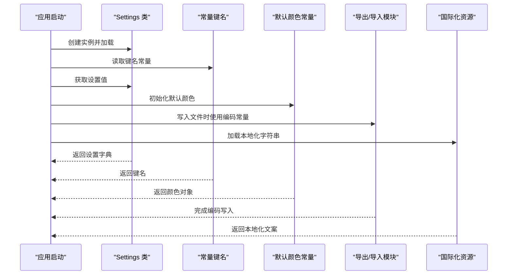
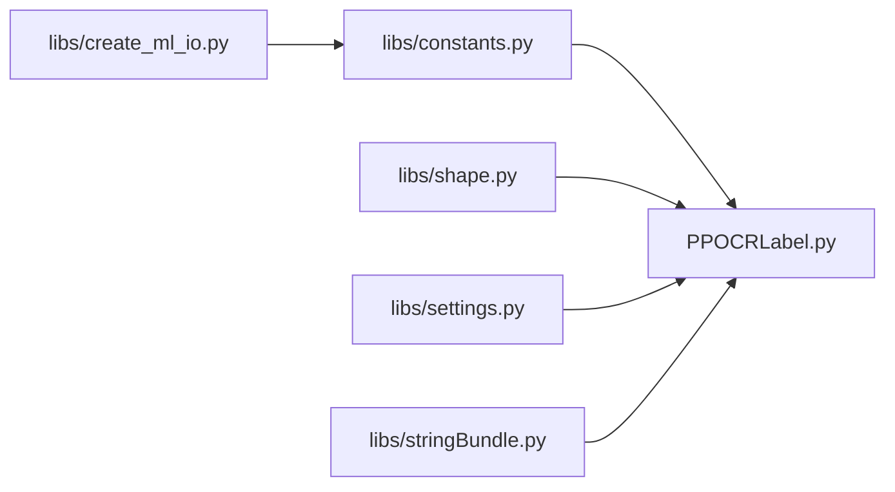

# 常量和配置

<cite>
**本文档引用的文件**
- [libs/constants.py](file://libs/constants.py)
- [libs/settings.py](file://libs/settings.py)
- [libs/shape.py](file://libs/shape.py)
- [libs/create_ml_io.py](file://libs/create_ml_io.py)
- [libs/stringBundle.py](file://libs/stringBundle.py)
- [PPOCRLabel.py](file://PPOCRLabel.py)
</cite>

## 目录
1. [简介](#简介)
2. [项目结构](#项目结构)
3. [核心组件](#核心组件)
4. [架构总览](#架构总览)
5. [详细组件分析](#详细组件分析)
6. [依赖关系分析](#依赖关系分析)
7. [性能考虑](#性能考虑)
8. [故障排除指南](#故障排除指南)
9. [结论](#结论)

## 简介
本文件系统化梳理 PPOCRLabel 应用中的常量与配置机制，重点覆盖以下方面：
- constants.py 中定义的键名常量（用于设置持久化、界面状态、格式标识等）
- 默认颜色与行为常量（用于图形绘制与交互）
- 设置存储与加载机制（Settings 类）
- 配置项在主窗口中的使用方式
- 编码与国际化字符串资源
- 自定义配置的最佳实践与注意事项

## 项目结构
围绕常量与配置的关键文件组织如下：
- libs/constants.py：集中定义键名常量与默认编码
- libs/settings.py：封装设置的序列化与持久化
- libs/shape.py：定义默认颜色与绘制相关常量
- libs/create_ml_io.py：使用默认编码进行文件写入
- libs/stringBundle.py：国际化字符串资源加载
- PPOCRLabel.py：主窗口中对常量与设置的实际应用

图表来源
- [libs/constants.py](file://libs/constants.py#L13-L33)
- [libs/settings.py](file://libs/settings.py#L21-L62)
- [libs/shape.py](file://libs/shape.py#L25-L31)
- [libs/create_ml_io.py](file://libs/create_ml_io.py#L18-L24)
- [libs/stringBundle.py](file://libs/stringBundle.py#L28-L89)
- [PPOCRLabel.py](file://PPOCRLabel.py#L86-L100)

章节来源
- [libs/constants.py](file://libs/constants.py#L13-L33)
- [libs/settings.py](file://libs/settings.py#L21-L62)
- [libs/shape.py](file://libs/shape.py#L25-L31)
- [libs/create_ml_io.py](file://libs/create_ml_io.py#L18-L24)
- [libs/stringBundle.py](file://libs/stringBundle.py#L28-L89)
- [PPOCRLabel.py](file://PPOCRLabel.py#L86-L100)

## 核心组件
本节概述常量与配置的核心组成及职责：
- 键名常量：统一设置项的键名，避免魔法字符串，便于维护与重构
- 默认颜色常量：统一图形绘制的颜色策略，确保一致的视觉体验
- 设置类：提供设置的读取、保存、重置能力，支持持久化到本地文件
- 编码常量：统一文本编码，保证跨平台与多语言环境下的正确性
- 国际化字符串：通过资源文件提供多语言文案

章节来源
- [libs/constants.py](file://libs/constants.py#L13-L33)
- [libs/settings.py](file://libs/settings.py#L21-L62)
- [libs/shape.py](file://libs/shape.py#L25-L31)
- [libs/create_ml_io.py](file://libs/create_ml_io.py#L18-L24)
- [libs/stringBundle.py](file://libs/stringBundle.py#L28-L89)

## 架构总览
常量与配置在应用中的交互流程如下：
- 主窗口启动时加载 Settings 并读取持久化设置
- 使用 constants.py 中的键名常量访问或更新设置
- 使用 shape.py 中的默认颜色常量初始化图形绘制
- 导出/导入模块使用 DEFAULT_ENCODING 统一编码
- 字符串资源通过 StringBundle 提供本地化文案

图表来源
- [PPOCRLabel.py](file://PPOCRLabel.py#L167-L169)
- [libs/constants.py](file://libs/constants.py#L13-L33)
- [libs/settings.py](file://libs/settings.py#L46-L54)
- [libs/shape.py](file://libs/shape.py#L25-L31)
- [libs/create_ml_io.py](file://libs/create_ml_io.py#L18-L24)
- [libs/stringBundle.py](file://libs/stringBundle.py#L42-L54)

## 详细组件分析

### 常量键名与用途
constants.py 定义了大量键名常量，涵盖以下类别：
- 窗口状态与几何信息：窗口尺寸、位置、几何、状态
- 用户偏好与行为：线条颜色、填充颜色、自动保存、单类模式、绘制正方形、标签显示选项等
- 文件与路径：最近打开目录、保存目录、文件名
- 格式标识：PascalVOC、YOLO 等标注格式
- 默认编码：统一文本编码

这些键名在主窗口中被广泛使用，例如：
- 读取/设置绘制正方形开关
- 控制标签与索引显示
- 选择保存目录与最近文件列表
- 设置窗口大小与位置

章节来源
- [libs/constants.py](file://libs/constants.py#L13-L33)
- [PPOCRLabel.py](file://PPOCRLabel.py#L516-L518)
- [PPOCRLabel.py](file://PPOCRLabel.py#L1082-L1119)

### 默认颜色常量与使用场景
shape.py 定义了默认颜色常量，用于图形绘制：
- 线条颜色、填充颜色、选中状态颜色、顶点颜色、锁定颜色
- 这些常量在主窗口中被读取并作为默认值传入颜色对话框或直接用于绘制

使用场景举例：
- 初始化颜色选择器的默认颜色
- 为新创建的形状设置默认颜色
- 锁定/解锁状态的颜色区分

章节来源
- [libs/shape.py](file://libs/shape.py#L25-L31)
- [PPOCRLabel.py](file://PPOCRLabel.py#L1211-L1214)
- [PPOCRLabel.py](file://PPOCRLabel.py#L2749-L2784)

### 设置类与持久化机制
Settings 类负责设置的读取、保存与重置：
- 数据存储于内存字典，支持 get、__getitem__、__setitem__ 访问
- 通过 pickle 将数据序列化到用户主目录下的设置文件
- 提供异常处理与日志记录，保证稳定性

在主窗口中的典型用法：
- 启动时加载设置
- 从设置中读取布尔/字符串/整数等配置项
- 在用户操作后更新设置并保存

章节来源
- [libs/settings.py](file://libs/settings.py#L21-L62)
- [PPOCRLabel.py](file://PPOCRLabel.py#L167-L169)
- [PPOCRLabel.py](file://PPOCRLabel.py#L1082-L1119)

### 编码常量与文件处理
create_ml_io.py 使用 DEFAULT_ENCODING 进行 JSON 文件的读写，确保：
- 跨平台一致性
- 多语言字符的正确编码与解码
- 与 constants.py 的解耦，避免硬编码

章节来源
- [libs/constants.py](file://libs/constants.py#L32-L33)
- [libs/create_ml_io.py](file://libs/create_ml_io.py#L18-L24)
- [libs/create_ml_io.py](file://libs/create_ml_io.py#L48-L85)

### 国际化字符串资源
stringBundle.py 提供多语言字符串资源加载：
- 支持基于区域的回退链（如 zh-CN → zh）
- 从资源文件读取键值对，提供 getString 接口
- 主窗口通过 StringBundle 获取本地化文案

章节来源
- [libs/stringBundle.py](file://libs/stringBundle.py#L28-L89)
- [PPOCRLabel.py](file://PPOCRLabel.py#L177-L184)

### 常量使用示例与最佳实践
- 引用方式：在需要的地方导入 constants.py 中的键名常量，避免魔法字符串
- 默认值策略：在读取设置时提供合理的默认值，确保首次运行也能正常工作
- 颜色管理：优先使用 shape.py 中的默认颜色常量，保持界面一致性
- 编码规范：统一使用 DEFAULT_ENCODING，避免不同模块间编码不一致
- 国际化：所有用户可见文本通过 StringBundle 获取，便于扩展新语言

章节来源
- [PPOCRLabel.py](file://PPOCRLabel.py#L86-L100)
- [libs/constants.py](file://libs/constants.py#L13-L33)
- [libs/shape.py](file://libs/shape.py#L25-L31)
- [libs/create_ml_io.py](file://libs/create_ml_io.py#L18-L24)
- [libs/stringBundle.py](file://libs/stringBundle.py#L42-L54)

## 依赖关系分析
常量与配置之间的依赖关系如下：
- PPOCRLabel.py 依赖 constants.py 的键名常量与 DEFAULT_ENCODING
- PPOCRLabel.py 依赖 shape.py 的默认颜色常量
- create_ml_io.py 依赖 constants.py 的 DEFAULT_ENCODING
- 主窗口通过 Settings 类读取/保存配置
- 字符串资源通过 StringBundle 提供本地化支持

图表来源
- [libs/constants.py](file://libs/constants.py#L13-L33)
- [libs/settings.py](file://libs/settings.py#L21-L62)
- [libs/shape.py](file://libs/shape.py#L25-L31)
- [libs/create_ml_io.py](file://libs/create_ml_io.py#L18-L24)
- [libs/stringBundle.py](file://libs/stringBundle.py#L28-L89)
- [PPOCRLabel.py](file://PPOCRLabel.py#L86-L100)

## 性能考虑
- 设置读写：Settings 使用 pickle 序列化，I/O 成本较低；建议在应用退出时保存，避免频繁写入
- 字符串加载：StringBundle 一次性加载资源文件，后续通过键访问，开销很小
- 颜色常量：仅在初始化阶段使用，对性能影响可忽略
- 编码处理：DEFAULT_ENCODING 仅在文件读写时使用，避免重复计算

## 故障排除指南
- 设置加载失败：检查设置文件是否存在与权限是否正确，查看日志输出
- 颜色显示异常：确认 shape.py 中默认颜色常量未被意外覆盖
- 编码错误：确保 create_ml_io.py 使用 DEFAULT_ENCODING，避免混合编码导致乱码
- 国际化文案缺失：检查资源文件路径与键名是否匹配，确认 StringBundle 的回退链

章节来源
- [libs/settings.py](file://libs/settings.py#L46-L54)
- [libs/create_ml_io.py](file://libs/create_ml_io.py#L18-L24)
- [libs/stringBundle.py](file://libs/stringBundle.py#L73-L89)

## 结论
PPOCRLabel 的常量与配置体系通过集中化的键名常量、默认颜色常量、设置类与编码常量，实现了：
- 明确的配置边界与清晰的职责划分
- 可维护的键名管理与稳定的默认行为
- 跨平台与多语言的兼容性保障
- 良好的扩展性与可定制性

遵循本文档的命名规范、取值范围与修改注意事项，可在不破坏现有逻辑的前提下安全地进行自定义配置与功能扩展。