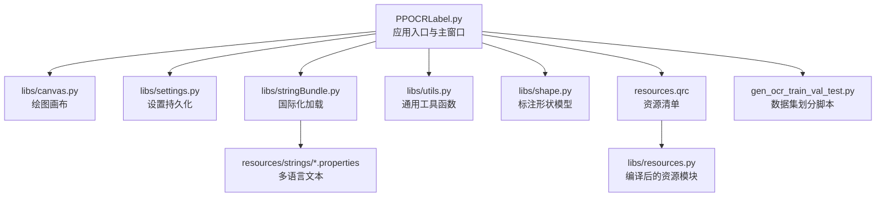
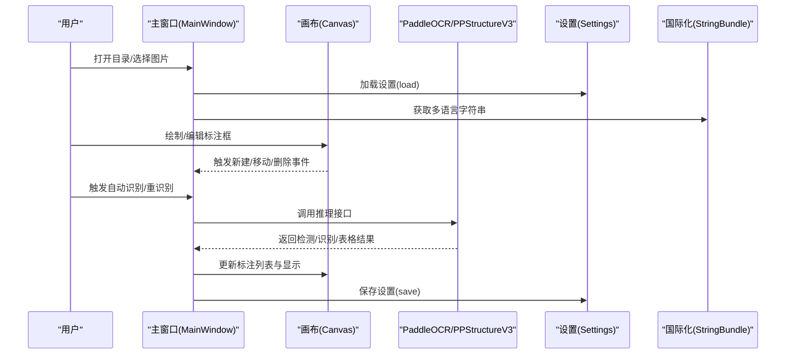
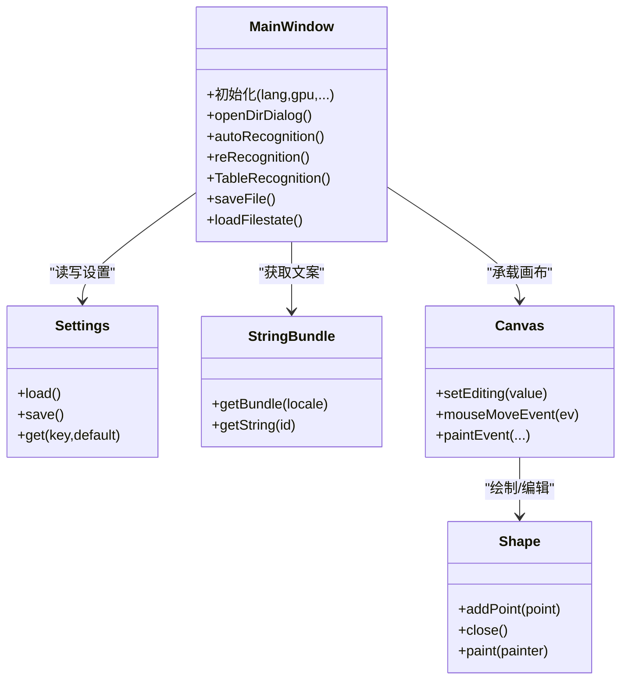
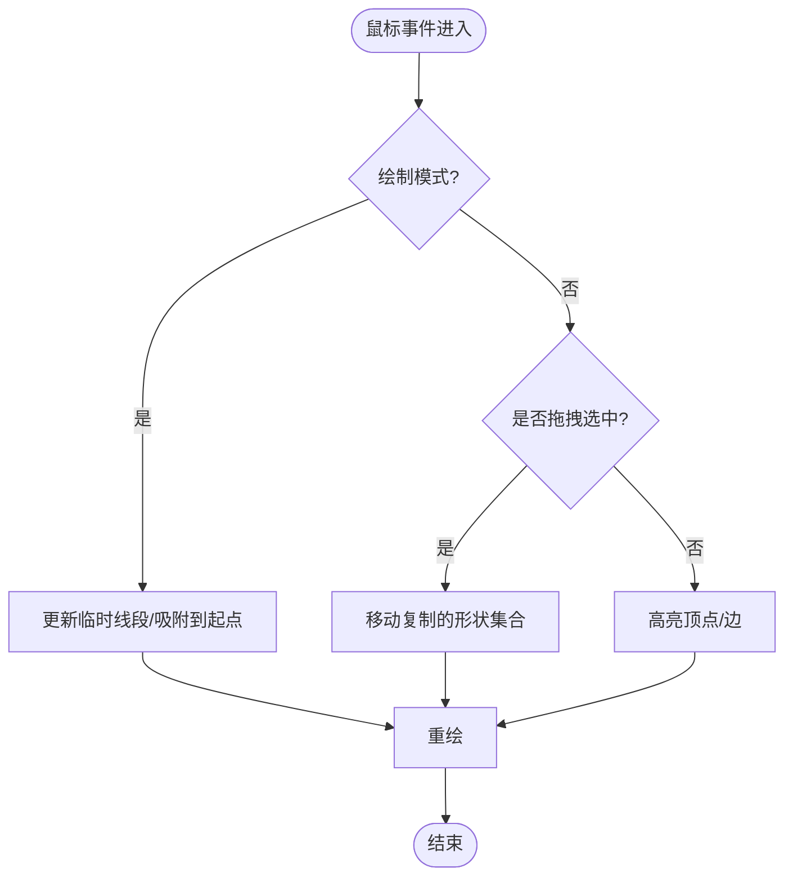
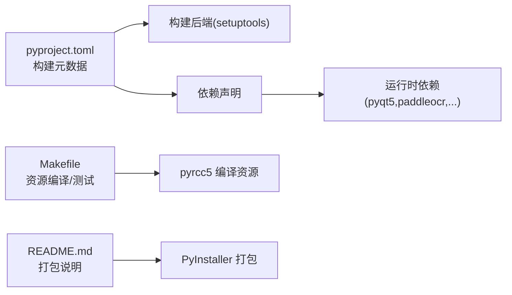

# 开发指南

<cite>
**本文引用的文件**
- [PPOCRLabel.py](file://PPOCRLabel.py)
- [README.md](file://README.md)
- [pyproject.toml](file://pyproject.toml)
- [setup.cfg](file://setup.cfg)
- [Makefile](file://Makefile)
- [.pre-commit-config.yaml](file://.pre-commit-config.yaml)
- [libs/__init__.py](file://libs/__init__.py)
- [libs/canvas.py](file://libs/canvas.py)
- [libs/settings.py](file://libs/settings.py)
- [libs/stringBundle.py](file://libs/stringBundle.py)
- [libs/utils.py](file://libs/utils.py)
- [libs/shape.py](file://libs/shape.py)
- [resources.qrc](file://resources.qrc)
- [resources/strings/strings-en.properties](file://resources/strings/strings-en.properties)
- [resources/strings/strings-zh-CN.properties](file://resources/strings/strings-zh-CN.properties)
- [gen_ocr_train_val_test.py](file://gen_ocr_train_val_test.py)
</cite>

## 目录
1. [简介](#简介)
2. [项目结构](#项目结构)
3. [核心组件](#核心组件)
4. [架构总览](#架构总览)
5. [详细组件分析](#详细组件分析)
6. [依赖分析](#依赖分析)
7. [性能考虑](#性能考虑)
8. [故障排查指南](#故障排查指南)
9. [结论](#结论)
10. [附录](#附录)

## 简介
本开发指南面向希望参与 PPOCRLabel 二次开发与维护的新老开发者，覆盖从环境搭建、依赖管理、构建与打包到国际化、资源管理、测试策略、调试技巧、性能优化与常见问题处理的全流程。文档同时给出贡献流程与代码审查要点，帮助团队高效协作。

## 项目结构
PPOCRLabel 是基于 PyQt5 的半自动化 OCR 标注工具，内置 PaddleOCR 模型以支持自动检测与重识别。项目采用“功能模块化 + 资源清单”的组织方式：核心逻辑集中在主程序入口，UI 交互由多个子模块协同完成；资源通过资源清单统一编译为 Python 模块供运行时使用；国际化字符串集中于 properties 文件并通过 StringBundle 加载。

图表来源
- [PPOCRLabel.py](file://PPOCRLabel.py#L1-L120)
- [libs/canvas.py](file://libs/canvas.py#L1-L120)
- [libs/settings.py](file://libs/settings.py#L1-L62)
- [libs/stringBundle.py](file://libs/stringBundle.py#L1-L89)
- [libs/utils.py](file://libs/utils.py#L1-L120)
- [libs/shape.py](file://libs/shape.py#L1-L120)
- [resources.qrc](file://resources.qrc#L1-L42)
- [resources/strings/strings-en.properties](file://resources/strings/strings-en.properties#L1-L122)
- [gen_ocr_train_val_test.py](file://gen_ocr_train_val_test.py#L1-L183)

章节来源
- [PPOCRLabel.py](file://PPOCRLabel.py#L1-L200)
- [resources.qrc](file://resources.qrc#L1-L42)

## 核心组件
- 主窗口与控制流：负责初始化模型、加载设置、构建 UI、响应用户操作与触发 OCR 推理。
- 绘图画布：封装鼠标事件、绘制状态、选中高亮、拖拽移动等交互细节。
- 设置系统：以 pickle 序列化保存用户偏好（窗口尺寸、最近打开目录、自动导出等）。
- 国际化：通过 StringBundle 动态加载多语言字符串，支持回退链路。
- 工具与模型：提供图标、快捷键格式化、颜色生成、图像裁剪与透视变换等工具方法，并集成 PaddleOCR 文本检测/识别/表格识别能力。
- 资源与打包：资源清单统一编译为 Python 模块，Makefile 提供资源编译与测试任务，pyproject.toml 定义构建元数据与依赖。

章节来源
- [PPOCRLabel.py](file://PPOCRLabel.py#L140-L320)
- [libs/canvas.py](file://libs/canvas.py#L1-L120)
- [libs/settings.py](file://libs/settings.py#L1-L62)
- [libs/stringBundle.py](file://libs/stringBundle.py#L1-L89)
- [libs/utils.py](file://libs/utils.py#L1-L120)
- [libs/shape.py](file://libs/shape.py#L1-L120)

## 架构总览
下图展示从用户交互到 OCR 推理与结果呈现的整体流程，以及资源与设置在其中的支撑作用。

图表来源
- [PPOCRLabel.py](file://PPOCRLabel.py#L140-L320)
- [libs/canvas.py](file://libs/canvas.py#L120-L220)
- [libs/settings.py](file://libs/settings.py#L39-L62)
- [libs/stringBundle.py](file://libs/stringBundle.py#L42-L89)

## 详细组件分析

### 主窗口类（MainWindow）
- 职责：初始化模型参数、构建 UI、管理文件列表与缩略图、绑定动作与快捷键、协调 OCR 推理与界面更新。
- 关键点：
  - 设备选择（CPU/GPU），语言与模型参数注入。
  - 多模式支持：常规文本、表格、KIE（关键词抽取）。
  - 自动保存与批量操作、拖拽排序、顶点微调等增强体验。
- 依赖关系：依赖 settings、stringBundle、canvas、shape、utils 等模块。

图表来源
- [PPOCRLabel.py](file://PPOCRLabel.py#L140-L320)
- [libs/settings.py](file://libs/settings.py#L1-L62)
- [libs/stringBundle.py](file://libs/stringBundle.py#L1-L89)
- [libs/canvas.py](file://libs/canvas.py#L1-L120)
- [libs/shape.py](file://libs/shape.py#L1-L120)

章节来源
- [PPOCRLabel.py](file://PPOCRLabel.py#L140-L520)

### 画布组件（Canvas）
- 职责：处理鼠标事件、绘制临时线段、高亮选中、支持方形/四点绘制、平移缩放信号转发。
- 关键点：
  - 绘制状态机（CREATE/EDIT）、当前形状与选中集合。
  - 顶点吸附、边界裁剪、坐标提示栏联动。
- 与主窗口：通过信号与槽连接，驱动主窗口更新列表与状态。

图表来源
- [libs/canvas.py](file://libs/canvas.py#L120-L220)

章节来源
- [libs/canvas.py](file://libs/canvas.py#L120-L220)

### 设置系统（Settings）
- 职责：以 pickle 文件持久化用户偏好，提供默认值与重置能力。
- 关键点：路径定位、异常容错、日志告警。

章节来源
- [libs/settings.py](file://libs/settings.py#L1-L62)

### 国际化（StringBundle）
- 职责：按区域回退链加载 properties 文本，提供统一字符串访问。
- 关键点：资源别名映射、编码与回退策略。

章节来源
- [libs/stringBundle.py](file://libs/stringBundle.py#L1-L89)
- [resources/strings/strings-en.properties](file://resources/strings/strings-en.properties#L1-L122)
- [resources/strings/strings-zh-CN.properties](file://resources/strings/strings-zh-CN.properties#L1-L20)

### 工具与模型（utils/shape）
- 工具函数：图标加载、动作构造、自然排序、颜色生成、图像旋转裁剪、坐标变换。
- 形状模型：标注点集、闭合状态、高亮绘制、字体渲染、编号绘制。

章节来源
- [libs/utils.py](file://libs/utils.py#L1-L200)
- [libs/shape.py](file://libs/shape.py#L1-L200)

### 数据集划分脚本（gen_ocr_train_val_test.py）
- 职责：按比例拆分检测/识别数据集，生成训练/验证/测试集合与对应标签文件。
- 关键点：随机打乱、相对路径转绝对路径、跨目录遍历。

章节来源
- [gen_ocr_train_val_test.py](file://gen_ocr_train_val_test.py#L1-L183)

## 依赖分析
- 构建与打包
  - 构建后端：pyproject.toml 使用 setuptools/build_meta。
  - 元数据：版本动态生成、GUI 入口、包数据包含。
  - 打包：Makefile 提供资源编译与测试命令；README 提供本地安装与 PyInstaller 打包步骤。
- 运行时依赖
  - PyQt5、PaddleOCR、openpyxl、tqdm、premailer、pandas、requests 等。
- 版本与平台
  - Python ≥ 3.9；Linux 可能需要特定 opencv 版本或 headless 包；Windows 可能遇到 shapely 安装问题。

图表来源
- [pyproject.toml](file://pyproject.toml#L1-L48)
- [Makefile](file://Makefile#L1-L36)
- [README.md](file://README.md#L120-L160)

章节来源
- [pyproject.toml](file://pyproject.toml#L1-L48)
- [Makefile](file://Makefile#L1-L36)
- [README.md](file://README.md#L120-L160)

## 性能考虑
- GPU/CPU 选择：根据设备能力自动切换，避免不必要的 CPU 推理。
- 图像预处理：在裁剪与透视变换前进行几何校验，减少无效计算。
- UI 响应：将耗时推理放在后台线程或异步队列，避免阻塞主线程。
- 资源编译：使用资源清单统一编译，减少运行时 IO。
- 批量操作：批量复制/粘贴/删除时合并状态变更，降低重绘次数。

## 故障排查指南
- 资源缺失/字符串 ID 缺失
  - 现象：启动时报错提示缺少字符串 ID 或资源模块。
  - 处理：重新编译资源清单为 Python 模块。
  - 参考：README 中资源编译与错误修复说明。
- Linux 平台启动异常
  - 现象：Qt 平台插件 xcb 加载失败或 opencv 版本过高。
  - 处理：安装 headless 版本或指定兼容版本；设置 Wayland 平台变量。
- Windows 平台依赖问题
  - 现象：安装 shapely 失败或缺少 win32com。
  - 处理：下载匹配的 whl；安装所需模块。
- 表格识别相关
  - 现象：缺少预处理或 COM 支持导致异常。
  - 处理：安装预处理与 win32com 依赖。

章节来源
- [README.md](file://README.md#L320-L356)

## 结论
本指南提供了从环境搭建到打包部署、从国际化与资源管理到调试与性能优化的完整开发路径。建议在提交前执行资源编译与静态检查，并遵循既有模块职责边界，确保新增功能与现有架构无缝衔接。

## 附录

### 开发环境搭建与依赖管理
- Python 版本：满足 pyproject.toml 中的最低版本要求。
- 依赖安装：优先使用官方镜像源；Linux 建议使用 headless opencv；Windows 遇到第三方库问题可参考 README 的解决方案。
- 本地安装：支持可编辑安装以便二次开发。

章节来源
- [pyproject.toml](file://pyproject.toml#L1-L48)
- [README.md](file://README.md#L55-L120)

### 构建工具配置与打包流程
- 资源编译：使用 pyrcc5 将资源清单编译为 Python 模块。
- 测试：Makefile 提供 Python 3 单元测试入口。
- 本地打包：README 提供本地安装与 PyInstaller 打包示例。

章节来源
- [Makefile](file://Makefile#L1-L36)
- [README.md](file://README.md#L120-L160)

### 国际化与资源管理
- 字符串资源：通过 StringBundle 按区域回退链加载 properties 文件。
- 图标与资源：资源清单统一管理，编译后作为模块导入。
- 多语言：支持英文与中文，默认语言可通过启动参数切换。

章节来源
- [libs/stringBundle.py](file://libs/stringBundle.py#L1-L89)
- [resources.qrc](file://resources.qrc#L1-L42)
- [resources/strings/strings-en.properties](file://resources/strings/strings-en.properties#L1-L122)
- [resources/strings/strings-zh-CN.properties](file://resources/strings/strings-zh-CN.properties#L1-L20)

### 测试策略
- 单元测试：Makefile 提供 Python 3 的测试入口。
- 集成测试：建议围绕主窗口交互、画布绘制、设置读写与 OCR 推理的关键路径编写用例。
- 质量门禁：.pre-commit-config.yaml 配置了格式化与静态检查钩子，提交前请先运行。

章节来源
- [Makefile](file://Makefile#L1-L36)
- [.pre-commit-config.yaml](file://.pre-commit-config.yaml#L1-L51)

### 调试技巧
- 日志：各模块使用统一日志器，便于定位问题。
- 断点与单步：结合单元测试与最小可复现场景逐步缩小范围。
- 资源与设置：若出现 UI 文案异常或设置不生效，优先检查资源编译与设置文件路径。

章节来源
- [libs/stringBundle.py](file://libs/stringBundle.py#L1-L20)
- [libs/settings.py](file://libs/settings.py#L1-L62)

### 性能优化建议
- 合理使用 GPU：仅在具备 CUDA 的环境中启用 GPU 推理。
- 减少重绘：批量更新 UI 时合并状态变更。
- 图像处理：在推理前进行必要的预处理与尺寸控制，避免重复计算。

章节来源
- [PPOCRLabel.py](file://PPOCRLabel.py#L190-L240)
- [libs/utils.py](file://libs/utils.py#L140-L200)

### 常见开发问题与解决方案
- 资源未编译：执行资源编译命令后重启应用。
- 平台兼容性：按 README 的平台适配建议安装依赖。
- 依赖冲突：清理并重新安装指定版本的依赖包。

章节来源
- [README.md](file://README.md#L320-L356)

### 贡献流程与代码审查标准
- 分支策略：建议基于主分支创建特性分支，提交前保持与上游同步。
- 提交流程：提交前运行资源编译与静态检查；编写清晰的提交信息与变更说明。
- 代码审查：关注模块职责单一、接口稳定性、错误处理与日志记录；确保新增功能有配套测试。

章节来源
- [.pre-commit-config.yaml](file://.pre-commit-config.yaml#L1-L51)
- [libs/__init__.py](file://libs/__init__.py#L1-L3)