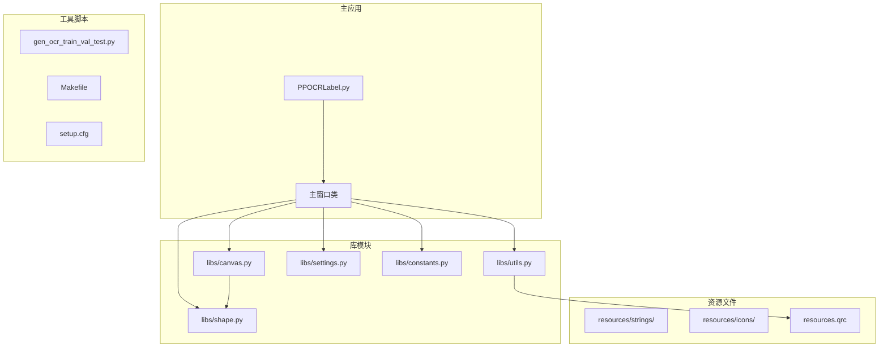
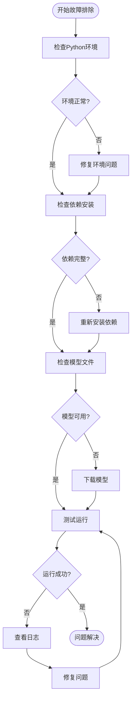

# 开发环境搭建

<cite>
**本文档引用的文件**
- [PPOCRLabel.py](file://PPOCRLabel.py)
- [README.md](file://README.md)
- [pyproject.toml](file://pyproject.toml)
- [setup.cfg](file://setup.cfg)
- [Makefile](file://Makefile)
- [gen_ocr_train_val_test.py](file://gen_ocr_train_val_test.py)
- [libs/constants.py](file://libs/constants.py)
- [libs/utils.py](file://libs/utils.py)
- [libs/settings.py](file://libs/settings.py)
- [libs/canvas.py](file://libs/canvas.py)
- [libs/shape.py](file://libs/shape.py)
</cite>

## 目录
1. [简介](#简介)
2. [项目结构](#项目结构)
3. [Python版本要求](#python版本要求)
4. [虚拟环境创建](#虚拟环境创建)
5. [核心依赖安装](#核心依赖安装)
6. [操作系统特定安装步骤](#操作系统特定安装步骤)
7. [开发工具推荐](#开发工具推荐)
8. [环境变量设置](#环境变量设置)
9. [常见问题排查](#常见问题排查)
10. [性能考虑](#性能考虑)
11. [故障排除指南](#故障排除指南)
12. [结论](#结论)

## 简介

PPOCRLabel 是一个基于 Python3 和 PyQt5 的半自动化图形标注工具，专门用于 OCR（光学字符识别）领域。该工具内置了 PaddleOCR 模型，能够自动检测和重新识别数据，支持矩形框、表格、不规则文本和关键信息标注模式。标注结果可以直接用于 PP-OCR 检测和识别模型的训练。

## 项目结构

PPOCRLabel 项目采用模块化的组织方式，主要包含以下结构：



**图表来源**
- [PPOCRLabel.py](file://PPOCRLabel.py#L143-L275)
- [libs/utils.py](file://libs/utils.py#L1-L50)
- [libs/canvas.py](file://libs/canvas.py#L32-L90)

**章节来源**
- [PPOCRLabel.py](file://PPOCRLabel.py#L1-L100)
- [pyproject.toml](file://pyproject.toml#L1-L48)

## Python版本要求

### 最低版本要求

根据项目配置，PPOCRLabel 要求 Python 版本必须满足以下条件：

- **最低版本**: Python 3.9+
- **兼容性**: 完全支持 Python 3.9 及以上版本
- **开发建议**: 推荐使用 Python 3.9.0 或更高版本

### 版本检查方法

```bash
# 检查Python版本
python --version
# 或
python3 --version

# 验证版本满足要求
python -c "import sys; print(sys.version_info >= (3, 9))"
```

**章节来源**
- [pyproject.toml](file://pyproject.toml#L17-L17)

## 虚拟环境创建

### 使用 venv 创建虚拟环境

```bash
# 在项目根目录创建虚拟环境
python -m venv venv

# 激活虚拟环境
# Windows:
venv\Scripts\activate
# Linux/macOS:
source venv/bin/activate

# 验证激活状态
which python
```

### 使用 conda 创建虚拟环境

```bash
# 创建conda环境
conda create -n ppocrlabel python=3.9

# 激活环境
conda activate ppocrlabel

# 验证Python版本
python --version
```

### 虚拟环境最佳实践

1. **环境隔离**: 每个项目使用独立的虚拟环境
2. **版本锁定**: 在 requirements.txt 中锁定依赖版本
3. **环境备份**: 定期导出环境配置

**章节来源**
- [pyproject.toml](file://pyproject.toml#L1-L48)

## 核心依赖安装

### 主要依赖包

根据项目配置，PPOCRLabel 的核心依赖包括：

| 依赖包 | 版本要求 | 用途 |
|--------|----------|------|
| PyQt5 | 最新版本 | GUI界面框架 |
| paddleocr | >=3.0.2 | OCR识别引擎 |
| openpyxl | 最新版本 | Excel文件处理 |
| tqdm | 最新版本 | 进度条显示 |
| premailer | 最新版本 | HTML样式内联 |
| pandas | 最新版本 | 数据处理 |
| requests | 最新版本 | HTTP请求 |

### 安装命令

```bash
# 方式1: 使用pip安装
pip install pyqt5 paddleocr>=3.0.2 openpyxl tqdm premailer pandas requests

# 方式2: 从requirements.txt安装
pip install -r requirements.txt

# 方式3: 开发模式安装
pip install -e .
```

### OpenCV 配置

由于项目使用 OpenCV 进行图像处理，需要特别注意版本兼容性：

```bash
# 安装OpenCV（推荐）
pip install opencv-python

# 或者使用headless版本（无GUI）
pip install opencv-contrib-python-headless==4.2.0.32
```

**章节来源**
- [pyproject.toml](file://pyproject.toml#L8-L16)
- [PPOCRLabel.py](file://PPOCRLabel.py#L26-L29)

## 操作系统特定安装步骤

### Windows 系统

#### 基础安装

```bash
# 1. 安装Python 3.9+
# 从python.org下载并安装

# 2. 创建虚拟环境
python -m venv venv
venv\Scripts\activate

# 3. 升级pip
python -m pip install --upgrade pip

# 4. 安装依赖
pip install pyqt5 paddleocr>=3.0.2 openpyxl tqdm premailer pandas requests

# 5. 安装OpenCV
pip install opencv-python

# 6. 测试安装
python -c "import cv2; import paddle; print('安装成功')"
```

#### 常见问题解决

```bash
# 如果遇到Shapely安装问题
pip install https://download.lfd.uci.edu/pythonlibs/w5k5j5z5/Shapely-2.0.1-cp39-cp39-win_amd64.whl

# 如果遇到Qt平台插件问题
pip install PyQt5==5.15.10
```

### Linux 系统

#### Ubuntu/Debian

```bash
# 1. 更新系统包管理器
sudo apt update

# 2. 安装系统依赖
sudo apt install python3.9 python3.9-dev python3.9-venv python3-pip build-essential

# 3. 创建虚拟环境
python3.9 -m venv venv
source venv/bin/activate

# 4. 升级pip
pip install --upgrade pip

# 5. 安装依赖
pip install pyqt5 paddleocr>=3.0.2 openpyxl tqdm premailer pandas requests

# 6. 设置Wayland环境变量
export QT_QPA_PLATFORM=wayland
```

#### CentOS/RHEL/Fedora

```bash
# 1. 安装Python 3.9
sudo dnf install python3.9 python3.9-devel python3.9-venv

# 2. 创建虚拟环境
python3.9 -m venv venv
source venv/bin/activate

# 3. 安装依赖
pip install pyqt5 paddleocr>=3.0.2 openpyxl tqdm premailer pandas requests

# 4. 处理Qt插件问题
sudo dnf install qt5-qtbase-gui
```

### macOS 系统

#### Homebrew安装

```bash
# 1. 安装Xcode命令行工具
xcode-select --install

# 2. 安装Python 3.9
brew install python@3.9

# 3. 创建虚拟环境
python3.9 -m venv venv
source venv/bin/activate

# 4. 安装依赖
pip install pyqt5 paddleocr>=3.0.2 openpyxl tqdm premailer pandas requests

# 5. 安装OpenCV（特殊版本）
pip install opencv-contrib-python-headless==4.2.0.32
```

**章节来源**
- [README.md](file://README.md#L73-L109)

## 开发工具推荐

### IDE推荐

#### VS Code

```json
{
    "python.defaultInterpreterPath": "./venv/bin/python",
    "python.linting.enabled": true,
    "python.linting.pylintEnabled": false,
    "python.linting.flake8Enabled": true,
    "python.formatting.provider": "black",
    "editor.formatOnSave": true,
    "editor.codeActionsOnSave": {
        "source.organizeImports": true
    },
    "extensions.ignoreRecommendations": false,
    "extensions.autoUpdate": true
}
```

#### PyCharm

- **专业版**: 提供完整的调试和分析功能
- **社区版**: 免费，适合基本开发需求
- **配置要点**: 
  - Python解释器指向虚拟环境
  - 启用代码检查和格式化
  - 配置Git集成

### 调试器配置

#### VS Code调试配置

```json
{
    "version": "0.2.0",
    "configurations": [
        {
            "name": "Python: Current File",
            "type": "python",
            "request": "launch",
            "program": "${file}",
            "console": "integratedTerminal",
            "justMyCode": true,
            "env": {
                "PYTHONPATH": "${workspaceFolder}"
            }
        }
    ]
}
```

### 代码格式化工具

#### Black配置

```toml
[tool.black]
line-length = 88
target-version = ['py39']
include = '\.pyi?$'
extend-exclude = '''
/(
  # directories
  \.eggs
  | \.git
  | \.venv
  | _build
  | buck-out
  | build
  | dist
  # files
  | .*\.egg-info
)/
'''
```

#### Flake8配置

```ini
[flake8]
max-line-length = 88
max-complexity = 10
exclude = .venv,.git,__pycache__
```

## 环境变量设置

### 必需环境变量

| 变量名 | 默认值 | 用途 |
|--------|--------|------|
| QT_QPA_PLATFORM | 无 | Qt平台插件选择 |
| PYTHONPATH | 项目根目录 | Python模块搜索路径 |
| PADDLE_OCR_HOME | 用户主目录 | PaddleOCR模型缓存目录 |

### 设置方法

#### Windows PowerShell

```powershell
# 永久设置环境变量
[Environment]::SetEnvironmentVariable("QT_QPA_PLATFORM", "wayland", "User")
$env:PYTHONPATH = "$env:PYTHONPATH;C:\path\to\ppocrlabel"

# 临时设置
$env:QT_QPA_PLATFORM="wayland"
```

#### Linux/macOS

```bash
# 在~/.bashrc或~/.zshrc中添加
export QT_QPA_PLATFORM=wayland
export PYTHONPATH="${PYTHONPATH}:/path/to/ppocrlabel"

# 生效
source ~/.bashrc
```

### 资源文件配置

```bash
# 重新生成资源文件
pyrcc5 -o libs/resources.py resources.qrc

# 验证资源文件
python -c "from libs import resources; print('资源文件加载成功')"
```

**章节来源**
- [Makefile](file://Makefile#L23-L24)
- [README.md](file://README.md#L138-L141)

## 常见问题排查

### 依赖冲突问题

#### 问题症状
```bash
# 安装时出现版本冲突
ERROR: Cannot install -r requirements.txt
```

#### 解决方案

```bash
# 1. 清理pip缓存
pip cache purge

# 2. 强制重新安装
pip install --force-reinstall --no-cache-dir pyqt5

# 3. 使用兼容性安装
pip install --upgrade --force-reinstall pyqt5==5.15.10
```

### 编译错误问题

#### Windows编译错误

```bash
# 如果遇到编译错误
pip install --upgrade setuptools wheel

# 安装Microsoft Visual C++ Build Tools
# 或使用预编译wheel
pip install --only-binary=all pyqt5
```

#### Linux编译错误

```bash
# Ubuntu/Debian
sudo apt install build-essential libgl1-mesa-dev libglib2.0-dev

# CentOS/RHEL
sudo yum groupinstall "Development Tools"
sudo yum install mesa-libGL-devel glib2-devel
```

### OpenCV兼容性问题

#### 版本冲突

```bash
# 检查当前OpenCV版本
pip show opencv-python

# 卸载冲突版本
pip uninstall opencv-python opencv-contrib-python opencv-python-headless

# 安装正确版本
pip install opencv-python==4.2.0.32
```

#### macOS特定问题

```bash
# 如果遇到objc相关错误
pip uninstall opencv-python
pip install opencv-contrib-python-headless==4.2.0.32
```

### PyQt5平台插件问题

```bash
# 检查可用的Qt平台插件
python -m PyQt5.pyqt5_qmake -platforms

# 设置正确的平台插件
export QT_DEBUG_PLUGINS=1
```

**章节来源**
- [README.md](file://README.md#L326-L350)

## 性能考虑

### 内存优化

```python
# 在PPOCRLabel.py中优化内存使用
class MainWindow(QMainWindow):
    def __init__(self, *args, **kwargs):
        super().__init__(*args, **kwargs)
        # 启用垃圾回收
        import gc
        gc.enable()
        
        # 设置适当的缓存大小
        self.cache_size = 100
        
        # 使用生成器处理大文件
        self.process_large_files = True
```

### GPU加速配置

```python
# 检测GPU可用性
import paddle
if paddle.is_compiled_with_cuda():
    device = "gpu"
    print("GPU加速已启用")
else:
    device = "cpu"
    print("使用CPU进行推理")

# 配置PaddleOCR设备
ocr = PaddleOCR(device=device)
```

### 并行处理

```python
# 使用多线程处理多个图像
from concurrent.futures import ThreadPoolExecutor
import threading

class ParallelProcessor:
    def __init__(self, max_workers=4):
        self.executor = ThreadPoolExecutor(max_workers=max_workers)
        self.lock = threading.Lock()
    
    def process_batch(self, images):
        futures = []
        for image in images:
            future = self.executor.submit(self.process_single, image)
            futures.append(future)
        
        results = []
        for future in futures:
            results.append(future.result())
        
        return results
```

## 故障排除指南

### 完整的故障排除流程



**图表来源**
- [PPOCRLabel.py](file://PPOCRLabel.py#L133-L136)
- [libs/settings.py](file://libs/settings.py#L46-L54)

### 日志配置

```python
# 在PPOCRLabel.py中配置日志
import logging

# 配置日志级别
logging.basicConfig(
    level=logging.INFO,
    format='%(asctime)s - %(name)s - %(levelname)s - %(message)s',
    handlers=[
        logging.FileHandler('ppocrlabel.log'),
        logging.StreamHandler()
    ]
)

logger = logging.getLogger("PPOCRLabel")
```

### 性能监控

```python
# 添加性能监控
import time
import psutil

class PerformanceMonitor:
    def __init__(self):
        self.start_time = time.time()
        self.start_memory = psutil.Process().memory_info().rss
    
    def log_performance(self, operation):
        current_time = time.time()
        current_memory = psutil.Process().memory_info().rss
        
        logger.info(f"{operation}: "
                   f"耗时: {current_time - self.start_time:.2f}s, "
                   f"内存: {(current_memory - self.start_memory)/1024/1024:.2f}MB")
```

**章节来源**
- [libs/utils.py](file://libs/utils.py#L26-L26)
- [libs/settings.py](file://libs/settings.py#L14-L18)

## 结论

PPOCRLabel 的开发环境搭建相对简单，但需要注意几个关键点：

1. **Python版本**: 必须使用 Python 3.9+ 版本
2. **依赖管理**: 使用虚拟环境隔离依赖，避免版本冲突
3. **平台兼容**: 不同操作系统有特定的安装要求和注意事项
4. **OpenCV版本**: 需要特别注意版本兼容性问题
5. **资源文件**: 正确生成和配置资源文件

按照本文档的步骤，您应该能够成功搭建 PPOCRLabel 的开发环境。如果遇到任何问题，请参考故障排除指南或查看项目文档中的相关说明。