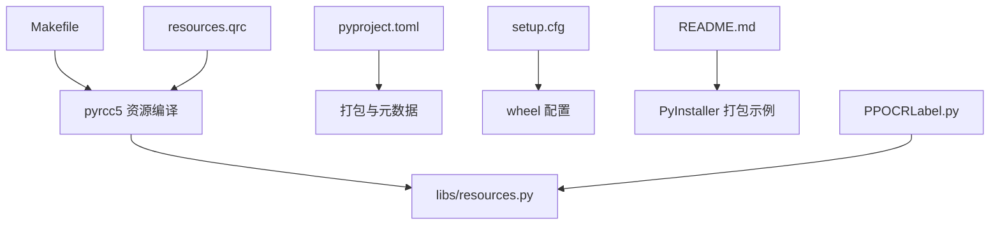
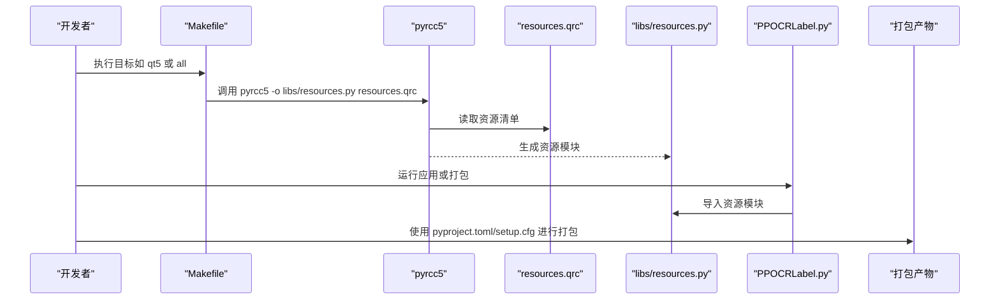
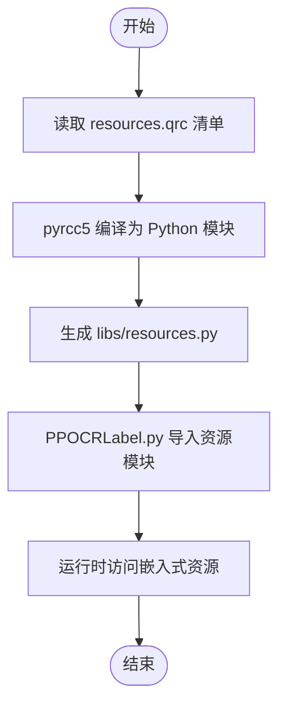
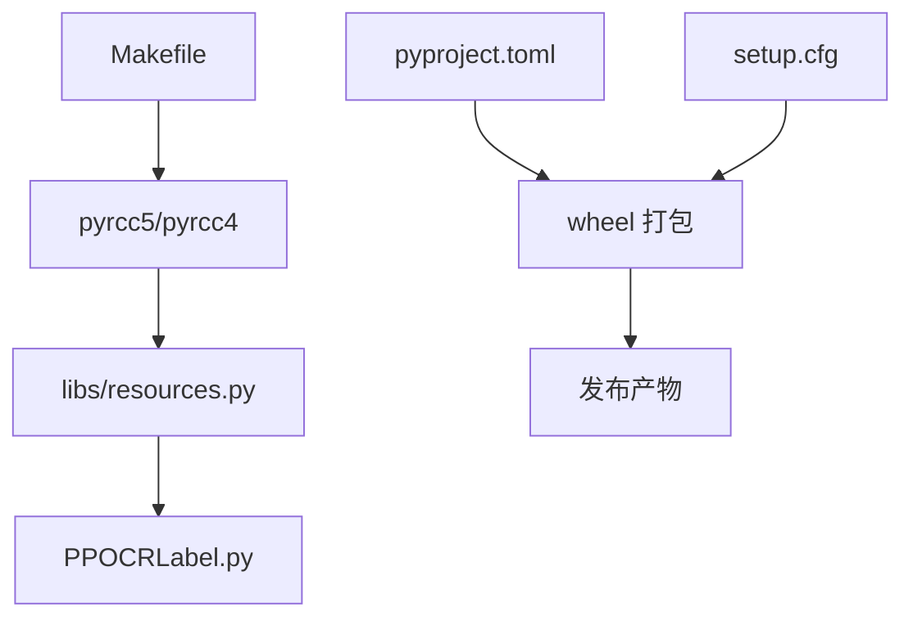

# 构建系统

<cite>
**本文引用的文件**
- [Makefile](file://Makefile)
- [resources.qrc](file://resources.qrc)
- [libs/resources.py](file://libs/resources.py)
- [pyproject.toml](file://pyproject.toml)
- [setup.cfg](file://setup.cfg)
- [PPOCRLabel.py](file://PPOCRLabel.py)
- [README.md](file://README.md)
</cite>

## 目录
1. [简介](#简介)
2. [项目结构](#项目结构)
3. [核心组件](#核心组件)
4. [架构总览](#架构总览)
5. [详细组件分析](#详细组件分析)
6. [依赖分析](#依赖分析)
7. [性能考虑](#性能考虑)
8. [故障排查指南](#故障排查指南)
9. [结论](#结论)
10. [附录](#附录)

## 简介
本文件面向 PPOCRLabel 的构建系统，围绕 Makefile 目标、Qt 资源编译（pyrcc5）、打包与分发配置（pyproject.toml、setup.cfg）以及可选的 PyInstaller 打包流程进行系统化说明。文档同时提供本地构建、测试构建与发布构建的流程建议，并总结构建优化技巧与常见问题诊断方法。

## 项目结构
PPOCRLabel 的构建相关文件集中在根目录与 libs 子目录中：
- Makefile：定义构建、测试、清理与上传等目标
- resources.qrc：Qt 资源清单，声明图标与字符串资源
- libs/resources.py：由 pyrcc5 编译生成的资源模块，供应用运行时加载资源
- pyproject.toml：PEP 621 动态元数据与打包后端配置
- setup.cfg：wheel 打包与版本管理工具配置
- README.md：包含 PyInstaller 打包示例与资源重生成命令

图表来源
- [Makefile](file://Makefile#L1-L36)
- [resources.qrc](file://resources.qrc#L1-L42)
- [libs/resources.py](file://libs/resources.py#L1-L120)
- [pyproject.toml](file://pyproject.toml#L1-L48)
- [setup.cfg](file://setup.cfg#L1-L9)
- [README.md](file://README.md#L120-L150)
- [PPOCRLabel.py](file://PPOCRLabel.py#L1-L120)

章节来源
- [Makefile](file://Makefile#L1-L36)
- [resources.qrc](file://resources.qrc#L1-L42)
- [libs/resources.py](file://libs/resources.py#L1-L120)
- [pyproject.toml](file://pyproject.toml#L1-L48)
- [setup.cfg](file://setup.cfg#L1-L9)
- [README.md](file://README.md#L120-L150)
- [PPOCRLabel.py](file://PPOCRLabel.py#L1-L120)

## 核心组件
- Makefile 目标
  - all：默认目标，依赖 qt5 与 test
  - test/testpy3：使用 Python3 运行单元测试发现器
  - qt4/5 及其 Python 版本子目标：调用 pyrcc4/pyrcc5 将资源清单编译为 Python 模块
  - clean：清理缓存、构建产物与临时文件
  - pip_upload：通过 Python3 的上传命令上传包
  - long_description：查看长描述（基于 restview）
- Qt 资源系统
  - resources.qrc 声明图标与字符串资源路径
  - pyrcc5 生成 libs/resources.py，应用在运行时导入该模块以访问资源
- 打包配置
  - pyproject.toml：定义动态版本、依赖、入口点、GUI 入口脚本与 package-data
  - setup.cfg：启用 universal wheel 与版本号管理工具 bumpversion 的文件映射
- PyInstaller 打包（可选）
  - README 提供了资源重生成与 PyInstaller 打包命令示例

章节来源
- [Makefile](file://Makefile#L1-L36)
- [resources.qrc](file://resources.qrc#L1-L42)
- [libs/resources.py](file://libs/resources.py#L1-L120)
- [pyproject.toml](file://pyproject.toml#L1-L48)
- [setup.cfg](file://setup.cfg#L1-L9)
- [README.md](file://README.md#L120-L150)

## 架构总览
下图展示从资源清单到应用运行时资源访问的整体流程，以及 Makefile 目标与打包配置之间的关系。

图表来源
- [Makefile](file://Makefile#L1-L36)
- [resources.qrc](file://resources.qrc#L1-L42)
- [libs/resources.py](file://libs/resources.py#L1-L120)
- [PPOCRLabel.py](file://PPOCRLabel.py#L1-L120)
- [pyproject.toml](file://pyproject.toml#L1-L48)
- [setup.cfg](file://setup.cfg#L1-L9)

## 详细组件分析

### Makefile 目标详解
- all
  - 作用：构建 Qt 资源与运行测试
  - 依赖：qt5、test
- test 与 testpy3
  - 作用：使用 Python3 的 unittest 发现器扫描 tests 目录执行测试
- qt4/5 与 Python 版本子目标
  - qt5py3：调用 pyrcc5 将 resources.qrc 编译为 libs/resources.py
  - qt4py2/qt4py3：调用 pyrcc4（兼容旧版 Qt4），生成相同模块
- clean
  - 作用：清理用户设置文件、Python 编译产物、dist、egg-info、缓存与构建目录
- pip_upload
  - 作用：通过 Python3 的上传命令上传包（需配合上传凭证）
- long_description
  - 作用：查看长描述（依赖 restview 工具）

章节来源
- [Makefile](file://Makefile#L1-L36)

### Qt 资源编译流程（pyrcc5）
- 资源清单（resources.qrc）
  - 声明图标与字符串资源路径，包含帮助、应用图标、标注工具图标、格式导出图标及多语言字符串文件
- 资源模块（libs/resources.py）
  - 由 pyrcc5 生成，包含资源数据与初始化/清理函数
  - 应用在运行时导入该模块以访问嵌入式资源
- 编译触发
  - Makefile 的 qt5py3 目标直接调用 pyrcc5
  - README 提供手动编译示例

图表来源
- [resources.qrc](file://resources.qrc#L1-L42)
- [libs/resources.py](file://libs/resources.py#L1-L120)
- [PPOCRLabel.py](file://PPOCRLabel.py#L1-L120)
- [Makefile](file://Makefile#L1-L36)
- [README.md](file://README.md#L130-L145)

章节来源
- [resources.qrc](file://resources.qrc#L1-L42)
- [libs/resources.py](file://libs/resources.py#L1-L120)
- [PPOCRLabel.py](file://PPOCRLabel.py#L1-L120)
- [Makefile](file://Makefile#L1-L36)
- [README.md](file://README.md#L130-L145)

### 打包配置（pyproject.toml 与 setup.cfg）
- pyproject.toml
  - 动态版本：通过 setuptools_scm 获取版本
  - 依赖：PyQt5、PaddleOCR、openpyxl、pandas、requests 等
  - 入口脚本：GUI 入口指向 PPOCRLabel.PPOCRLabel:main
  - 包数据：包含 libs、resources/strings、resources/icons 下的静态资源
- setup.cfg
  - bumpversion：启用提交与打标签
  - bdist_wheel：生成通用 wheel（universal）

章节来源
- [pyproject.toml](file://pyproject.toml#L1-L48)
- [setup.cfg](file://setup.cfg#L1-L9)

### PyInstaller 打包流程（可选）
- 资源重生成：先执行 pyrcc5 生成 libs/resources.py
- 打包命令：使用 PyInstaller 收集第三方库与项目路径，生成单文件可执行程序
- 平台差异：README 提供 Windows/Linux/macOS 的启动参数与注意事项

章节来源
- [README.md](file://README.md#L120-L150)

## 依赖分析
- 组件耦合
  - Makefile 依赖 pyrcc5/4 工具与 Python3 环境
  - 应用运行时依赖 libs/resources.py 提供的资源
  - 打包阶段依赖 pyproject.toml 与 setup.cfg 的配置
- 外部依赖
  - Qt 资源编译工具（pyrcc5/pyrcc4）
  - Python 打包工具链（setuptools、wheel、setuptools_scm）
  - 可选：PyInstaller（用于生成独立可执行文件）

图表来源
- [Makefile](file://Makefile#L1-L36)
- [libs/resources.py](file://libs/resources.py#L1-L120)
- [pyproject.toml](file://pyproject.toml#L1-L48)
- [setup.cfg](file://setup.cfg#L1-L9)
- [PPOCRLabel.py](file://PPOCRLabel.py#L1-L120)

章节来源
- [Makefile](file://Makefile#L1-L36)
- [pyproject.toml](file://pyproject.toml#L1-L48)
- [setup.cfg](file://setup.cfg#L1-L9)
- [libs/resources.py](file://libs/resources.py#L1-L120)
- [PPOCRLabel.py](file://PPOCRLabel.py#L1-L120)

## 性能考虑
- 资源编译
  - 使用 pyrcc5 生成二进制资源模块，减少磁盘 I/O 与路径查找开销
  - 在大型资源集上，优先选择 pyrcc5（Qt5）以获得更好的兼容性与性能
- 打包体积
  - PyInstaller 打包会包含大量依赖，建议仅收集必要模块，避免过度收集导致体积膨胀
- 构建缓存
  - clean 目标可清理构建中间产物，避免重复编译带来的冗余

## 故障排查指南
- 资源编译失败
  - 确认已安装 pyrcc5（Qt5）或 pyrcc4（Qt4），并在 Makefile 中选择对应目标
  - 若手动编译，请参考 README 的资源重生成命令
- 应用无法加载资源
  - 确认 libs/resources.py 已生成且未被清理
  - 检查应用导入语句是否正确引用资源模块
- 测试执行异常
  - 使用 testpy3 目标确保使用 Python3 的 unittest 发现器
- 打包产物缺失
  - 确认 pyproject.toml 与 setup.cfg 配置正确，wheel 生成成功
- PyInstaller 打包问题
  - 按 README 步骤先重生成资源，再执行打包命令
  - 注意平台差异与依赖收集参数

章节来源
- [Makefile](file://Makefile#L1-L36)
- [README.md](file://README.md#L120-L150)
- [PPOCRLabel.py](file://PPOCRLabel.py#L1-L120)

## 结论
PPOCRLabel 的构建系统以 Makefile 为核心，结合 Qt 资源编译与 Python 打包配置，形成从资源生成到打包发布的完整链路。通过规范的资源清单与打包配置，可实现跨平台的一致性与可维护性；若需要独立可执行文件，可按 README 提供的 PyInstaller 示例完成打包。

## 附录

### 不同构建场景的流程建议
- 本地开发构建
  - 修改 resources.qrc 后，执行 qt5py3 目标重新生成 libs/resources.py
  - 使用 testpy3 目标运行测试
- 测试构建（CI/CD）
  - 使用 Python3 运行测试发现器，确保测试环境一致
  - 生成 wheel 并验证安装
- 发布构建
  - 确保版本信息与元数据正确（pyproject.toml 动态版本）
  - 生成 universal wheel（setup.cfg）
  - 如需分发可执行文件，参考 README 的 PyInstaller 流程

章节来源
- [Makefile](file://Makefile#L1-L36)
- [pyproject.toml](file://pyproject.toml#L1-L48)
- [setup.cfg](file://setup.cfg#L1-L9)
- [README.md](file://README.md#L120-L150)