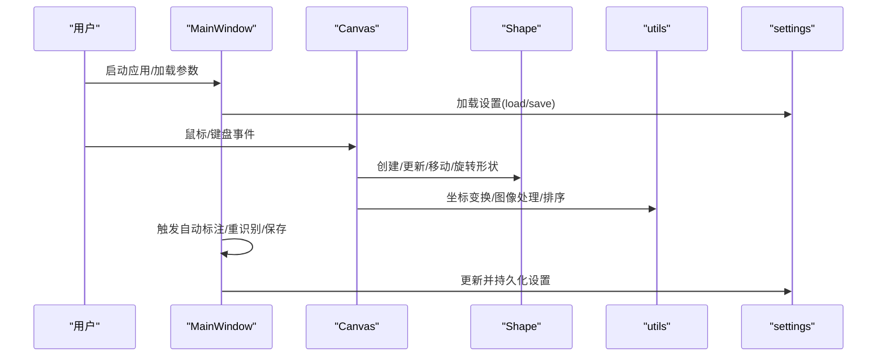
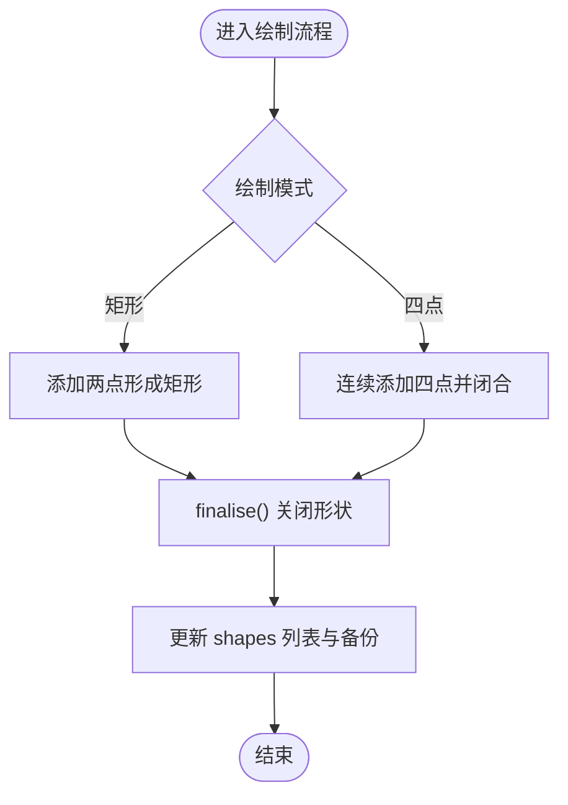
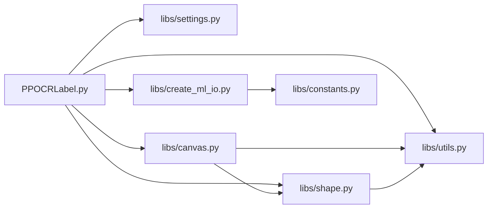

# 测试策略

<cite>
**本文引用的文件**
- [PPOCRLabel.py](file://PPOCRLabel.py)
- [README.md](file://README.md)
- [gen_ocr_train_val_test.py](file://gen_ocr_train_val_test.py)
- [libs/__init__.py](file://libs/__init__.py)
- [libs/utils.py](file://libs/utils.py)
- [libs/settings.py](file://libs/settings.py)
- [libs/canvas.py](file://libs/canvas.py)
- [libs/shape.py](file://libs/shape.py)
- [libs/constants.py](file://libs/constants.py)
- [libs/create_ml_io.py](file://libs/create_ml_io.py)
- [libs/labelColor.py](file://libs/labelColor.py)
- [libs/stringBundle.py](file://libs/stringBundle.py)
- [libs/editinlist.py](file://libs/editinlist.py)
- [libs/autoDialog.py](file://libs/autoDialog.py)
- [libs/labelDialog.py](file://libs/labelDialog.py)
- [libs/colorDialog.py](file://libs/colorDialog.py)
- [libs/keyDialog.py](file://libs/keyDialog.py)
- [libs/unique_label_qlist_widget.py](file://libs/unique_label_qlist_widget.py)
- [libs/hashableQListWidgetItem.py](file://libs/hashableQListWidgetItem.py)
- [libs/toolBar.py](file://libs/toolBar.py)
- [libs/zoomWidget.py](file://libs/zoomWidget.py)
- [libs/resources.py](file://libs/resources.py)
- [tablepyxl/tablepyxl.py](file://tablepyxl/tablepyxl.py)
- [tablepyxl/style.py](file://tablepyxl/style.py)
- [Makefile](file://Makefile)
- [setup.cfg](file://setup.cfg)
</cite>

## 目录
1. [引言](#引言)
2. [项目结构](#项目结构)
3. [核心组件](#核心组件)
4. [架构总览](#架构总览)
5. [详细组件分析](#详细组件分析)
6. [依赖分析](#依赖分析)
7. [性能考虑](#性能考虑)
8. [故障排查指南](#故障排查指南)
9. [结论](#结论)
10. [附录](#附录)

## 引言
本文件面向 PPOCRLabel 的测试策略设计，目标是建立一套系统化的单元测试与集成测试方案，覆盖以下关键方面：
- 单元测试组织与执行方式，含 Python 2/3 兼容性测试要点
- 测试用例设计原则与覆盖范围要求
- 测试数据准备与模拟环境配置
- 编写与运行测试的最佳实践（断言策略、测试隔离、性能测试）
- 持续集成配置建议与自动化测试流程

本测试策略以仓库现有代码为基础，结合功能模块划分与依赖关系，提出可落地的测试实施路径。

## 项目结构
PPOCRLabel 是基于 PyQt5 的图形标注工具，核心入口为应用主程序文件，配套大量 GUI 组件与工具函数模块。整体结构如下图所示：

```mermaid
graph TB
A["PPOCRLabel.py<br/>应用主程序"] --> B["libs/<br/>GUI与工具模块集合"]
B --> B1["canvas.py<br/>绘图画布"]
B --> B2["shape.py<br/>形状对象"]
B --> B3["utils.py<br/>通用工具函数"]
B --> B4["settings.py<br/>设置持久化"]
B --> B5["constants.py<br/>常量定义"]
B --> B6["create_ml_io.py<br/>CreateML导入导出"]
B --> B7["labelColor.py<br/>颜色映射"]
B --> B8["stringBundle.py<br/>国际化字符串"]
B --> B9["editinlist.py<br/>列表编辑"]
B --> B10["autoDialog.py<br/>自动标注对话框"]
B --> B11["labelDialog.py<br/>标签输入对话框"]
B --> B12["colorDialog.py<br/>颜色选择对话框"]
B --> B13["keyDialog.py<br/>关键词输入对话框"]
B --> B14["unique_label_qlist_widget.py<br/>唯一标签列表"]
B --> B15["hashableQListWidgetItem.py<br/>可哈希列表项"]
B --> B16["toolBar.py<br/>工具栏"]
B --> B17["zoomWidget.py<br/>缩放控件"]
B --> B18["resources.py<br/>资源打包"]
A --> C["tablepyxl/<br/>表格导出工具"]
C --> C1["tablepyxl.py"]
C --> C2["style.py"]
A --> D["gen_ocr_train_val_test.py<br/>数据集划分脚本"]
A --> E["Makefile<br/>构建与辅助任务"]
A --> F["setup.cfg<br/>版本与打包配置"]
```

图表来源
- [PPOCRLabel.py](file://PPOCRLabel.py#L1-L120)
- [libs/canvas.py](file://libs/canvas.py#L1-L120)
- [libs/shape.py](file://libs/shape.py#L1-L120)
- [libs/utils.py](file://libs/utils.py#L1-L120)
- [libs/settings.py](file://libs/settings.py#L1-L62)
- [libs/constants.py](file://libs/constants.py#L1-L33)
- [libs/create_ml_io.py](file://libs/create_ml_io.py#L1-L80)
- [libs/labelColor.py](file://libs/labelColor.py#L1-L40)
- [libs/stringBundle.py](file://libs/stringBundle.py#L1-L40)
- [libs/editinlist.py](file://libs/editinlist.py#L1-L60)
- [libs/autoDialog.py](file://libs/autoDialog.py#L1-L60)
- [libs/labelDialog.py](file://libs/labelDialog.py#L1-L60)
- [libs/colorDialog.py](file://libs/colorDialog.py#L1-L60)
- [libs/keyDialog.py](file://libs/keyDialog.py#L1-L60)
- [libs/unique_label_qlist_widget.py](file://libs/unique_label_qlist_widget.py#L1-L60)
- [libs/hashableQListWidgetItem.py](file://libs/hashableQListWidgetItem.py#L1-L60)
- [libs/toolBar.py](file://libs/toolBar.py#L1-L60)
- [libs/zoomWidget.py](file://libs/zoomWidget.py#L1-L60)
- [libs/resources.py](file://libs/resources.py#L1-L40)
- [tablepyxl/tablepyxl.py](file://tablepyxl/tablepyxl.py#L1-L60)
- [tablepyxl/style.py](file://tablepyxl/style.py#L1-L60)
- [gen_ocr_train_val_test.py](file://gen_ocr_train_val_test.py#L1-L60)
- [Makefile](file://Makefile#L1-L60)
- [setup.cfg](file://setup.cfg#L1-L9)

章节来源
- [PPOCRLabel.py](file://PPOCRLabel.py#L1-L200)
- [README.md](file://README.md#L1-L120)

## 核心组件
围绕测试目标，建议优先覆盖以下核心模块与职责边界：
- 应用主窗口与交互逻辑：负责加载模型、处理用户操作、管理界面状态与数据流
- 图形绘制与几何计算：Canvas 与 Shape 负责标注绘制、拖拽、旋转、顶点高亮等
- 工具函数与兼容层：utils 提供图像处理、排序、坐标变换、跨版本兼容判断等
- 设置与持久化：settings 负责用户设置的读取与保存
- 导入导出与格式转换：create_ml_io 负责 CreateML 格式导入导出
- 数据集划分脚本：gen_ocr_train_val_test.py 负责训练/验证/测试集划分

章节来源
- [PPOCRLabel.py](file://PPOCRLabel.py#L140-L320)
- [libs/canvas.py](file://libs/canvas.py#L1-L200)
- [libs/shape.py](file://libs/shape.py#L1-L120)
- [libs/utils.py](file://libs/utils.py#L120-L220)
- [libs/settings.py](file://libs/settings.py#L1-L62)
- [libs/create_ml_io.py](file://libs/create_ml_io.py#L1-L80)
- [gen_ocr_train_val_test.py](file://gen_ocr_train_val_test.py#L1-L80)

## 架构总览
从测试视角，PPOCRLabel 的控制流主要由用户事件驱动，典型流程如下：

图表来源
- [PPOCRLabel.py](file://PPOCRLabel.py#L140-L320)
- [libs/canvas.py](file://libs/canvas.py#L120-L260)
- [libs/shape.py](file://libs/shape.py#L90-L160)
- [libs/utils.py](file://libs/utils.py#L140-L220)
- [libs/settings.py](file://libs/settings.py#L30-L62)

## 详细组件分析

### 应用主窗口（MainWindow）测试要点
- 初始化与参数校验：语言、GPU/CPU、模型参数、默认路径等
- 界面状态管理：文件列表、标签列表、缩放、滚动、选择状态同步
- 业务流程：自动标注、重识别、保存、删除、导出
- 国际化与字符串资源：语言切换与提示文本一致性
- 模型调用：检测/识别/表格识别的调用链与异常处理

建议断言策略
- 行为断言：按钮启用/禁用状态、界面元素可见性、列表项数量变化
- 数据断言：Label.txt/rec_gt.txt 文件生成与内容格式
- 状态断言：设置文件存在且可加载、缓存文件存在

章节来源
- [PPOCRLabel.py](file://PPOCRLabel.py#L140-L320)
- [README.md](file://README.md#L140-L220)

### 绘图画布（Canvas）与形状（Shape）测试要点
- 绘制流程：矩形/四点绘制、闭合判定、顶点高亮与移动
- 拖拽与平移：多选、批量移动、越界裁剪
- 旋转与缩放：顶点独立移动、整体旋转、方向角更新
- 事件响应：鼠标按下/移动/释放、键盘快捷键、滚轮缩放
- 性能与边界：大图缩放、高频重绘、内存占用

建议断言策略
- 几何断言：顶点坐标、包围盒面积与中心点、旋转角度
- 事件断言：信号发射次数与顺序、状态变化
- 边界断言：越界裁剪、空列表/无效输入处理

图表来源
- [libs/canvas.py](file://libs/canvas.py#L250-L380)
- [libs/shape.py](file://libs/shape.py#L100-L160)

章节来源
- [libs/canvas.py](file://libs/canvas.py#L1-L200)
- [libs/shape.py](file://libs/shape.py#L1-L120)

### 工具函数（utils）与兼容性测试要点
- 跨版本兼容：have_qstring()、字符串/正则表达式处理
- 排序与自然序：natural_sort() 对混合字母数字的排序
- 图像处理：get_rotate_crop_image()、boxPad()、polygon_bounding_box_center_and_area()
- 映射与转换：map_value()、HTML/表格结构重建
- 日志与错误：异常捕获与日志输出

建议断言策略
- 输入输出断言：非法输入返回合理默认值或抛出异常
- 数值断言：边界值、零除保护、数值范围映射
- 文本断言：正则匹配、转义与编码一致性

章节来源
- [libs/utils.py](file://libs/utils.py#L120-L220)
- [libs/utils.py](file://libs/utils.py#L220-L320)
- [libs/utils.py](file://libs/utils.py#L320-L413)

### 设置与持久化（settings）测试要点
- 文件读写：pickle 序列化/反序列化、路径存在性
- 默认值与回退：缺失键返回默认值、异常时记录警告
- 幂等性：重复保存/加载不改变结果

建议断言策略
- 文件断言：pkl 文件存在且可读
- 结果断言：读取与写入一致、默认值正确

章节来源
- [libs/settings.py](file://libs/settings.py#L1-L62)

### 导入导出与格式转换（create_ml_io）测试要点
- CreateML 导出：合并已有 JSON、坐标计算、标签写入
- CreateML 导入：按文件名匹配、坐标还原、形状列表生成
- 编码与路径：UTF-8 编码、相对/绝对路径处理

建议断言策略
- 结构断言：JSON 字段完整性、annotations 数组存在
- 坐标断言：中心点与宽高换算一致性

章节来源
- [libs/create_ml_io.py](file://libs/create_ml_io.py#L1-L147)

### 数据集划分脚本（gen_ocr_train_val_test）测试要点
- 参数解析与默认值：比例、根路径、标签文件名、裁剪图像目录
- 分割逻辑：随机打乱、区间划分、拷贝图像与写入 txt
- 目录清理与重建：删除旧子集、创建新目录

建议断言策略
- 输出断言：train/val/test 三类目录存在、txt 文件按比例生成
- 内容断言：图像数量与标签行数一致、相对路径正确

章节来源
- [gen_ocr_train_val_test.py](file://gen_ocr_train_val_test.py#L1-L183)

## 依赖分析
模块间耦合关系与测试关注点：
- PPOCRLabel.py 作为入口，依赖 libs 下各模块；测试时应通过最小依赖注入或 Mock 替换外部服务
- Canvas/Shape 依赖 utils 的几何与图像处理函数；测试时可对 utils 进行参数化与边界测试
- settings 与文件系统耦合；测试时使用临时目录与隔离文件
- create_ml_io 与文件系统耦合；测试时使用临时 JSON 与路径

图表来源
- [PPOCRLabel.py](file://PPOCRLabel.py#L80-L140)
- [libs/canvas.py](file://libs/canvas.py#L1-L120)
- [libs/shape.py](file://libs/shape.py#L1-L120)
- [libs/utils.py](file://libs/utils.py#L1-L120)
- [libs/settings.py](file://libs/settings.py#L1-L62)
- [libs/create_ml_io.py](file://libs/create_ml_io.py#L1-L80)
- [libs/constants.py](file://libs/constants.py#L1-L33)

## 性能考虑
- 绘制性能：Canvas 在高频重绘场景下需避免不必要的 repaint；测试可用帧率/重绘次数指标评估
- 图像处理：get_rotate_crop_image、boxPad 等函数在大批量图像上可能成为瓶颈；建议参数化测试不同尺寸与类型
- 文件 I/O：settings 与 create_ml_io 的读写应避免频繁小块写入；测试可统计写入次数与耗时
- 模型推理：自动标注/重识别涉及外部模型调用，建议通过 Mock 控制推理时间与稳定性

## 故障排查指南
常见问题与定位建议：
- 资源编译错误：Missing string id 或资源打包失败，需重新生成资源文件
- OpenCV 版本不兼容：出现特定属性缺失或平台插件加载失败，需按 README 指南降级或更换版本
- 平台相关问题：Linux/macOS 的 Qt 平台插件与 Wayland/XCB 相关错误，按 README 步骤修复
- 设置加载失败：pkl 文件损坏或权限不足，检查日志与文件权限

章节来源
- [README.md](file://README.md#L320-L356)

## 结论
本测试策略以模块职责与控制流为核心，建议采用分层测试方法：
- 单元测试：覆盖 Canvas/Shape/utils/settings/create_ml_io 等核心模块的边界与行为
- 集成测试：覆盖 MainWindow 的关键工作流（自动标注、重识别、导出）
- 兼容性测试：重点验证 Python 2/3 兼容路径与第三方依赖版本
- 性能测试：针对高频绘制与图像处理函数进行基准测试
- CI 集成：在拉取请求与主分支上分别执行单元测试与关键集成测试，确保回归安全

## 附录

### 测试用例设计原则与覆盖范围
- 原则
  - 最小依赖：尽量使用 Mock/Stub 隔离外部依赖
  - 可重现：固定随机种子、使用临时目录与文件
  - 可维护：参数化测试、断言明确、错误信息清晰
- 覆盖范围
  - Canvas/Shape：绘制、拖拽、旋转、越界、信号发射
  - utils：自然序排序、图像处理、坐标变换、映射函数
  - settings：文件读写、默认值、异常处理
  - create_ml_io：导出合并、导入匹配、坐标还原
  - gen_ocr_train_val_test：参数解析、比例分割、目录管理

### Python 2/3 兼容性测试要点
- 字符串与正则：have_qstring() 用于判断 QString 包装；测试需覆盖 py2/py3 不同路径
- 编码与路径：UTF-8 编码、pathlib 使用、字符串/字节处理差异
- 正则与转义：HTML 转义与正则匹配的一致性

章节来源
- [libs/utils.py](file://libs/utils.py#L120-L160)

### 测试数据准备与模拟环境配置
- 测试数据
  - 小尺寸图像样本、不同纵横比与噪声
  - 多边形顶点坐标集合、旋转与缩放场景
  - CreateML JSON 示例、不同标签与注释
- 模拟环境
  - 临时目录与文件：隔离真实用户目录
  - Mock 外部服务：PaddleOCR 推理、文件系统
  - 虚拟显示：在无 GUI 环境下运行单元测试

### 断言策略与测试隔离
- 断言策略
  - 行为断言：按钮状态、列表项数量、信号发射次数
  - 结构断言：JSON 字段、文件行数、坐标范围
  - 性能断言：耗时阈值、重绘次数上限
- 测试隔离
  - 使用 setUp/tearDown 清理临时文件
  - 使用 pytest.mark.parametrize 参数化测试
  - 使用 monkeypatch 替换全局变量与路径

### 性能测试建议
- 绘制性能：测量 Canvas.repaint 调用频率与帧率
- 图像处理：对不同尺寸图像测量 get_rotate_crop_image 的耗时
- I/O 性能：批量写入 create_ml_io 的耗时与磁盘占用

### 持续集成配置建议
- 触发策略
  - PR 触发：运行单元测试与关键集成测试
  - 主分支：运行全量测试与兼容性矩阵（Python 3.8–3.11）
- 测试矩阵
  - Python 版本：3.8/3.9/3.10/3.11
  - 平台：Windows/Linux/macOS
  - 依赖版本：OpenCV、PyQt5、PaddleOCR
- 报告与缓存
  - 上传测试报告与覆盖率
  - 缓存依赖与虚拟显示服务