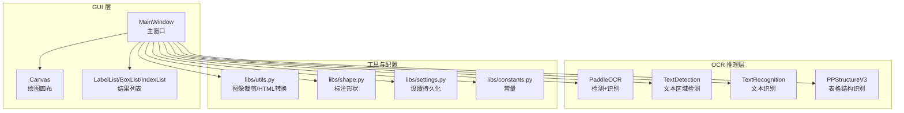
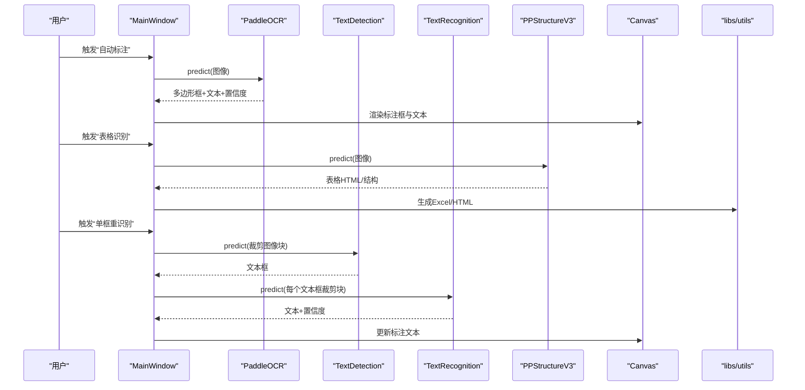
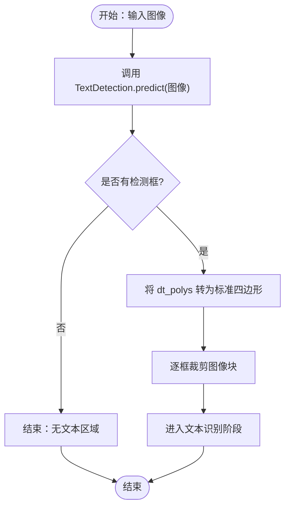
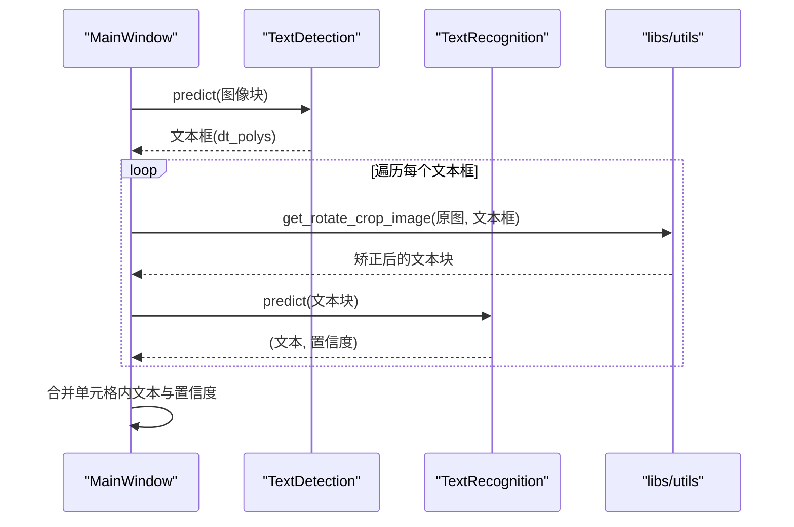
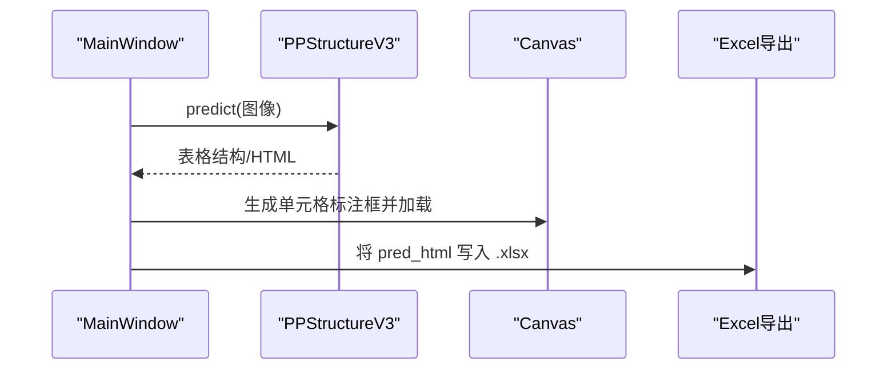
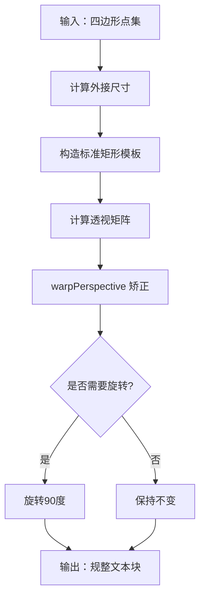
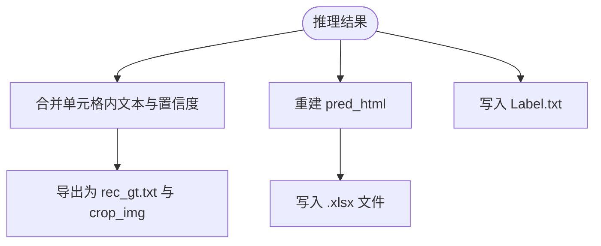
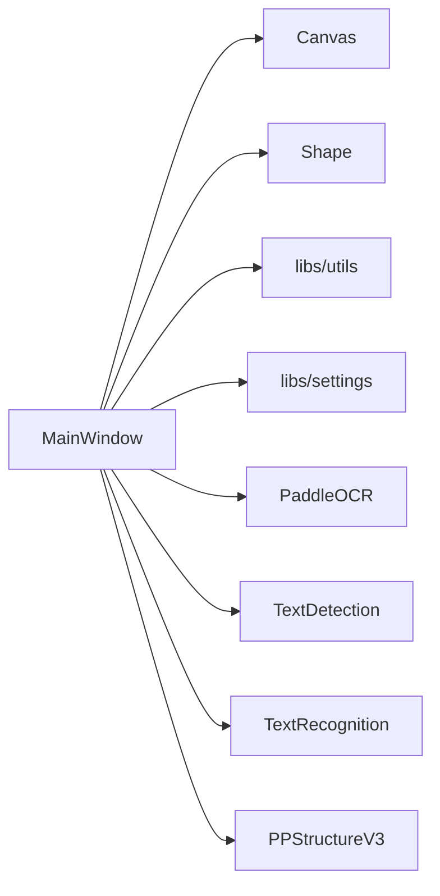

# OCR 推理流程

<cite>
**本文引用的文件**
- [PPOCRLabel.py](file://PPOCRLabel.py)
- [README.md](file://README.md)
- [libs/utils.py](file://libs/utils.py)
- [libs/canvas.py](file://libs/canvas.py)
- [libs/shape.py](file://libs/shape.py)
- [libs/settings.py](file://libs/settings.py)
- [libs/constants.py](file://libs/constants.py)
- [libs/autoDialog.py](file://libs/autoDialog.py)
- [libs/editinlist.py](file://libs/editinlist.py)
- [libs/labelDialog.py](file://libs/labelDialog.py)
- [gen_ocr_train_val_test.py](file://gen_ocr_train_val_test.py)
</cite>

## 目录
1. [简介](#简介)
2. [项目结构](#项目结构)
3. [核心组件](#核心组件)
4. [架构总览](#架构总览)
5. [详细组件分析](#详细组件分析)
6. [依赖关系分析](#依赖关系分析)
7. [性能考量](#性能考量)
8. [故障排查指南](#故障排查指南)
9. [结论](#结论)
10. [附录](#附录)

## 简介
本文件面向 PaddleOCR 在 PPOCRLabel 应用中的推理流程，系统性阐述从图像输入到文本输出的完整链路，覆盖图像预处理、模型推理（文本区域检测、文本识别、表格结构识别）以及结果后处理；同时给出性能监控、批量处理与并发推理的实现方案建议，并解释推理结果的数据结构与格式转换（坐标系统、置信度评估、文本编码处理等）。

## 项目结构
该应用以 PyQt5 为 GUI 基础，围绕 PaddleOCR 的 PaddleOCR、TextDetection、TextRecognition、PPStructureV3 组件构建半自动化标注工具。核心入口为 MainWindow 类，负责初始化 OCR 模型、加载图像、管理标注画布与 UI 控件，并在用户操作时触发推理与结果渲染。

图示来源
- [PPOCRLabel.py](file://PPOCRLabel.py#L143-L237)
- [libs/utils.py](file://libs/utils.py#L142-L191)
- [libs/shape.py](file://libs/shape.py#L35-L120)
- [libs/settings.py](file://libs/settings.py#L21-L62)
- [libs/constants.py](file://libs/constants.py#L13-L33)

章节来源
- [PPOCRLabel.py](file://PPOCRLabel.py#L143-L237)
- [README.md](file://README.md#L147-L206)

## 核心组件
- 主窗口与模型初始化
  - 初始化设备（CPU/GPU）、语言、模型名称与目录参数，创建 PaddleOCR、TextDetection、TextRecognition、PPStructureV3 实例。
  - 支持动态切换语言与模型参数。
- 图像与标注画布
  - Canvas 负责交互式绘制四边形标注框，Shape 描述标注几何与属性。
- 推理与结果处理
  - 文本检测：返回多边形框集合。
  - 文本识别：对裁剪后的文本区域进行识别，输出文本与置信度。
  - 表格结构识别：输出表格 HTML 结构与单元格文本，支持导出 Excel。
- 工具函数
  - 图像裁剪与透视矫正、HTML 生成与转换、自然排序、坐标映射等。

章节来源
- [PPOCRLabel.py](file://PPOCRLabel.py#L194-L237)
- [libs/shape.py](file://libs/shape.py#L35-L120)
- [libs/utils.py](file://libs/utils.py#L142-L191)
- [README.md](file://README.md#L227-L279)

## 架构总览
下图展示从用户操作到推理与渲染的端到端流程，涵盖自动标注、单框重识别、表格识别与结果导出。

图示来源
- [PPOCRLabel.py](file://PPOCRLabel.py#L2923-L3040)
- [PPOCRLabel.py](file://PPOCRLabel.py#L3078-L3268)
- [libs/utils.py](file://libs/utils.py#L142-L191)

## 详细组件分析

### 文本区域检测（TextDetection）
- 输入：整张图像或候选文本区域图像。
- 输出：多边形框集合（dt_polys）、对应文本框坐标。
- 关键实现要点
  - 使用 TextDetection 模型预测文本区域边界框。
  - 对于表格单元格内部的多行文本，按从上到下的顺序逆序处理，保证阅读顺序正确。
  - 将检测框转换为标准四边形坐标，用于后续裁剪与识别。

图示来源
- [PPOCRLabel.py](file://PPOCRLabel.py#L3247-L3268)

章节来源
- [PPOCRLabel.py](file://PPOCRLabel.py#L3247-L3268)

### 文本识别（TextRecognition）
- 输入：由检测模块裁剪得到的文本图像块（四边形矫正后）。
- 输出：识别文本与置信度（rec_text、rec_score）。
- 关键实现要点
  - 对每个文本框裁剪块执行识别。
  - 多行单元格内文本按从上到下顺序拼接，并计算平均置信度。
  - 单框重识别支持对选中框进行即时更新。

图示来源
- [PPOCRLabel.py](file://PPOCRLabel.py#L3247-L3268)
- [libs/utils.py](file://libs/utils.py#L142-L191)

章节来源
- [PPOCRLabel.py](file://PPOCRLabel.py#L3041-L3071)
- [libs/utils.py](file://libs/utils.py#L142-L191)

### 表格结构识别（PPStructureV3）
- 输入：整张图像。
- 输出：表格 HTML 结构、单元格文本、表格区域坐标。
- 关键实现要点
  - 调用 PPStructureV3.predict 获取表格识别结果。
  - 将每个单元格转换为矩形标注框，写入 Canvas 并同步到结果列表。
  - 将 pred_html 导出为 Excel 文件，便于人工核对与修正。

图示来源
- [PPOCRLabel.py](file://PPOCRLabel.py#L3078-L3176)

章节来源
- [PPOCRLabel.py](file://PPOCRLabel.py#L3078-L3176)

### 图像预处理与坐标系统
- 坐标系统
  - 图像坐标系为像素坐标（x/y），Canvas 中 Shape.points 以 QPointF 存储。
  - 保存标注时支持相对比例（width/height）与绝对坐标混合存储，便于跨分辨率复用。
- 图像裁剪与透视矫正
  - 使用透视变换将任意四边形矫正为矩形，适配识别模型输入要求。
  - 自动旋转以保证长宽比合理，提升识别稳定性。

图示来源
- [libs/utils.py](file://libs/utils.py#L142-L191)

章节来源
- [libs/utils.py](file://libs/utils.py#L142-L191)
- [libs/shape.py](file://libs/shape.py#L35-L120)

### 结果后处理与数据结构
- 数据结构
  - 检测结果：包含多边形框（points）、类别、难度标记等。
  - 识别结果：包含文本内容（transcription/rec_text）、置信度（score/rec_score）。
  - 表格结果：包含 HTML 结构、单元格文本、表格区域坐标。
- 格式转换
  - 将 PP-Structure 的 HTML 转换为 Excel 文件，支持合并单元格属性（colspan/rowspan）。
  - 将标注写入 Label.txt、rec_gt.txt，供下游训练使用。

图示来源
- [PPOCRLabel.py](file://PPOCRLabel.py#L3500-L3552)
- [libs/utils.py](file://libs/utils.py#L226-L271)

章节来源
- [PPOCRLabel.py](file://PPOCRLabel.py#L3500-L3552)
- [libs/utils.py](file://libs/utils.py#L226-L271)

### 性能监控、批量处理与并发推理
- 性能监控
  - 在关键推理步骤记录耗时（如表格识别开始/结束时间戳），并在 UI 中显示或写入日志。
  - 对小尺寸图像进行跳过提示，避免无效推理。
- 批量处理
  - 自动标注支持批量处理 N 张未确认图像，按用户设定数量滑动窗口推进。
  - 提供“重新排序坐标框位置”功能，按从上到下、从左到右排序，提升表格识别一致性。
- 并发推理
  - 当前实现为串行推理（逐框识别）。若需并发，可在识别阶段引入线程池或异步队列，注意：
    - 保证图像解码与裁剪的线程安全；
    - 控制 GPU 显存占用，避免 OOM；
    - 合理设置队列长度与回压策略，确保 UI 流畅。

章节来源
- [PPOCRLabel.py](file://PPOCRLabel.py#L2923-L2950)
- [PPOCRLabel.py](file://PPOCRLabel.py#L3719-L3761)
- [libs/autoDialog.py](file://libs/autoDialog.py#L48-L75)

## 依赖关系分析
- 组件耦合
  - MainWindow 依赖 Canvas、Shape、utils、settings 等模块；对 OCR 模型的调用集中在推理相关方法中。
  - 表格识别与文本识别分别依赖各自模型实例，但共享图像裁剪与坐标转换工具。
- 外部依赖
  - PaddleOCR（PaddleOCR、TextDetection、TextRecognition、PPStructureV3）
  - OpenCV（图像解码、透视变换、编码）
  - PyQt5（UI 事件与绘图）

图示来源
- [PPOCRLabel.py](file://PPOCRLabel.py#L143-L237)
- [libs/canvas.py](file://libs/canvas.py#L32-L120)
- [libs/shape.py](file://libs/shape.py#L35-L120)
- [libs/utils.py](file://libs/utils.py#L142-L191)
- [libs/settings.py](file://libs/settings.py#L21-L62)

章节来源
- [PPOCRLabel.py](file://PPOCRLabel.py#L143-L237)
- [libs/canvas.py](file://libs/canvas.py#L32-L120)
- [libs/shape.py](file://libs/shape.py#L35-L120)
- [libs/utils.py](file://libs/utils.py#L142-L191)
- [libs/settings.py](file://libs/settings.py#L21-L62)

## 性能考量
- 模型选择与设备
  - 默认使用移动端轻量模型，兼顾速度与精度；GPU 可显著加速推理。
- 图像预处理
  - 透视矫正与旋转可能增加额外计算；建议仅对非矩形文本进行矫正。
- 批量与并发
  - 批量处理时控制并发度，避免显存峰值过高；必要时分批提交任务。
- I/O 与缓存
  - 识别结果缓存与增量保存可减少重复工作；导出训练数据时注意磁盘空间与写入性能。

## 故障排查指南
- 图像解码异常
  - 使用 numpy 从文件路径解码，避免路径编码问题导致的解码失败。
- OpenCV 版本兼容
  - 不同平台与版本存在 API 差异，遇到错误请检查 OpenCV 版本与依赖。
- 表格识别为空
  - 若识别为空，弹窗提示并生成空 Excel 文件，可手动标注后导出。
- 识别结果不一致
  - 单框重识别会覆盖当前标注；若结果未变化，界面会提示保持一致。

章节来源
- [PPOCRLabel.py](file://PPOCRLabel.py#L3511-L3552)
- [libs/autoDialog.py](file://libs/autoDialog.py#L48-L75)
- [README.md](file://README.md#L322-L351)

## 结论
本应用以清晰的模块划分实现了完整的 OCR 推理闭环：从图像输入、多模型协同推理到结果可视化与导出。通过规范的数据结构与格式转换，既满足人工标注需求，也为后续训练提供了高质量标注数据。建议在高并发场景下引入异步与资源控制机制，在保证性能的同时维持 UI 流畅与稳定性。

## 附录
- 数据集划分脚本
  - 提供检测与识别数据集的训练/验证/测试划分，便于模型训练与评估。

章节来源
- [gen_ocr_train_val_test.py](file://gen_ocr_train_val_test.py#L1-L183)