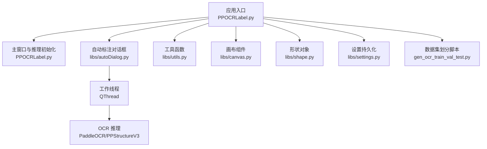
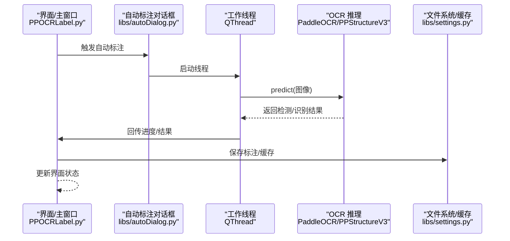
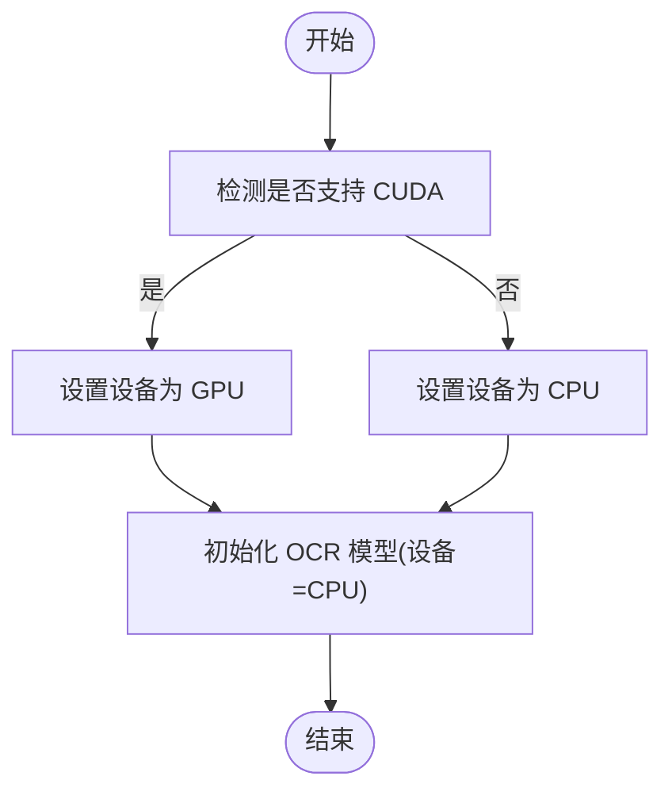
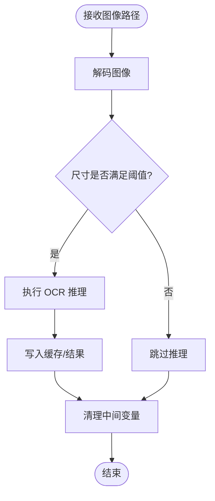
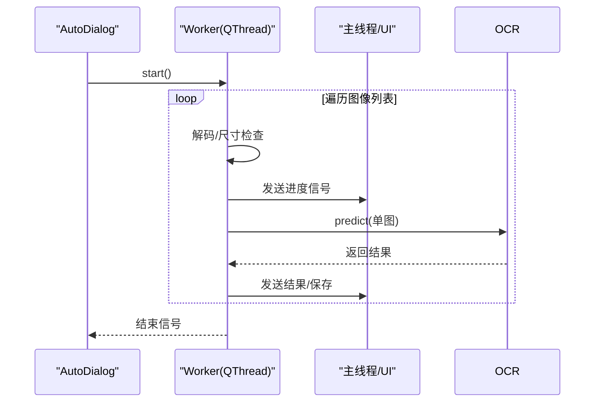
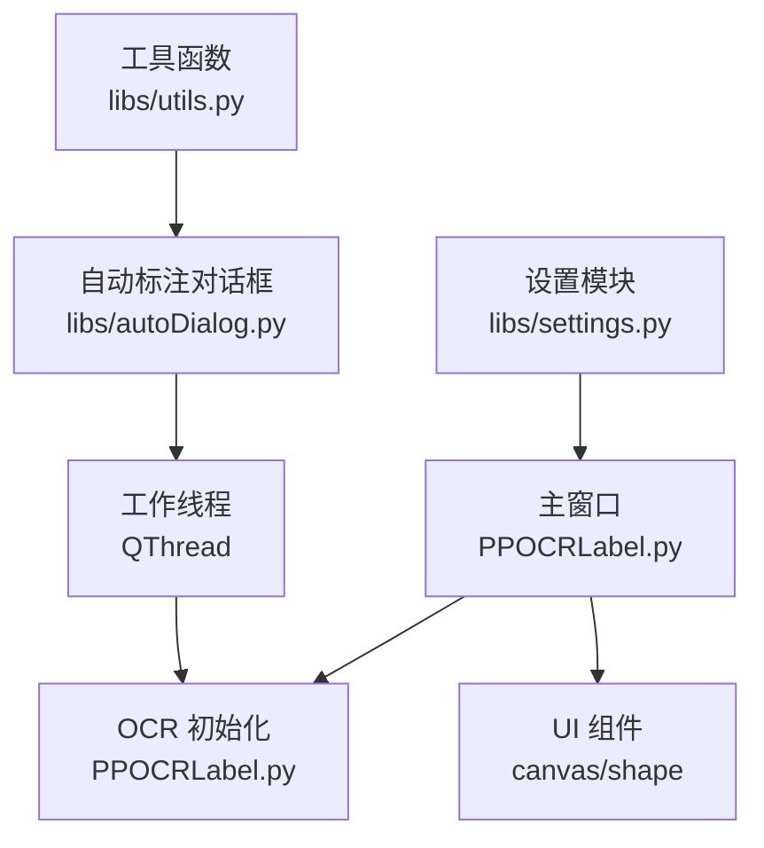

# 模型性能优化

<cite>
**本文引用的文件**
- [PPOCRLabel.py](file://PPOCRLabel.py)
- [README.md](file://README.md)
- [README_ch.md](file://README_ch.md)
- [libs/utils.py](file://libs/utils.py)
- [libs/autoDialog.py](file://libs/autoDialog.py)
- [libs/canvas.py](file://libs/canvas.py)
- [libs/settings.py](file://libs/settings.py)
- [libs/shape.py](file://libs/shape.py)
- [gen_ocr_train_val_test.py](file://gen_ocr_train_val_test.py)
</cite>

## 目录
1. [引言](#引言)
2. [项目结构](#项目结构)
3. [核心组件](#核心组件)
4. [架构总览](#架构总览)
5. [详细组件分析](#详细组件分析)
6. [依赖关系分析](#依赖关系分析)
7. [性能考量](#性能考量)
8. [故障排查指南](#故障排查指南)
9. [结论](#结论)
10. [附录](#附录)

## 引言
本文件聚焦于 PPOCRLabel 在 OCR 推理场景下的性能优化实践，围绕 GPU/CPU 切换、内存管理、并发推理、模型量化与混合精度、批处理优化、性能监控与瓶颈分析、大图像处理、多线程推理与资源调度等主题展开。文档以仓库现有实现为依据，结合可视化图示与实操建议，帮助读者在真实场景中落地优化策略。

## 项目结构
- 应用入口与主窗口逻辑集中在应用层，负责初始化 OCR 模型、设备选择与推理触发。
- 工具模块提供图像处理、UI 组件与设置持久化等支撑能力。
- 自动标注对话框采用独立工作线程执行推理，避免阻塞主线程。
- 数据集划分脚本用于训练/验证/测试集拆分，便于评估模型性能。

图表来源
- [PPOCRLabel.py](file://PPOCRLabel.py#L174-L233)
- [libs/autoDialog.py](file://libs/autoDialog.py#L22-L101)
- [libs/utils.py](file://libs/utils.py#L142-L191)
- [libs/canvas.py](file://libs/canvas.py#L32-L120)
- [libs/shape.py](file://libs/shape.py#L35-L120)
- [libs/settings.py](file://libs/settings.py#L21-L62)
- [gen_ocr_train_val_test.py](file://gen_ocr_train_val_test.py#L1-L183)

章节来源
- [PPOCRLabel.py](file://PPOCRLabel.py#L174-L233)
- [libs/autoDialog.py](file://libs/autoDialog.py#L22-L101)
- [libs/utils.py](file://libs/utils.py#L142-L191)
- [libs/canvas.py](file://libs/canvas.py#L32-L120)
- [libs/shape.py](file://libs/shape.py#L35-L120)
- [libs/settings.py](file://libs/settings.py#L21-L62)
- [gen_ocr_train_val_test.py](file://gen_ocr_train_val_test.py#L1-L183)

## 核心组件
- 设备选择与模型初始化：根据环境判断 GPU/CPU，并设置 OCR 检测/识别/表格识别子模型的设备。
- 并发推理：自动标注对话框通过独立线程执行推理，避免 UI 卡顿。
- 图像预处理：提供透视变换裁剪、边界框扩展等图像处理工具。
- UI 与标注：画布与形状对象负责标注绘制、编辑与渲染。
- 设置与缓存：设置持久化与缓存文件管理，保障运行稳定性。
- 数据集划分：按比例拆分训练/验证/测试集，支撑性能评估。

章节来源
- [PPOCRLabel.py](file://PPOCRLabel.py#L174-L233)
- [libs/autoDialog.py](file://libs/autoDialog.py#L22-L101)
- [libs/utils.py](file://libs/utils.py#L142-L191)
- [libs/canvas.py](file://libs/canvas.py#L32-L120)
- [libs/shape.py](file://libs/shape.py#L35-L120)
- [libs/settings.py](file://libs/settings.py#L21-L62)
- [gen_ocr_train_val_test.py](file://gen_ocr_train_val_test.py#L1-L183)

## 架构总览
下图展示从 UI 触发到推理与结果落盘的整体流程，以及 GPU/CPU 切换与并发执行的关键节点。

图表来源
- [PPOCRLabel.py](file://PPOCRLabel.py#L174-L233)
- [libs/autoDialog.py](file://libs/autoDialog.py#L103-L196)
- [libs/settings.py](file://libs/settings.py#L21-L62)

## 详细组件分析

### GPU/CPU 切换机制
- 设备选择：主窗口构造时根据运行环境判断是否启用 GPU，并将设备参数传递给 OCR 子模块。
- 模型实例化：检测、识别与表格识别分别以相同设备初始化，确保一致的计算资源使用。
- 推理入口：自动标注线程调用 OCR 推理接口，底层由 PaddleOCR 根据设备选择 CUDA 或 CPU 执行。

图表来源
- [PPOCRLabel.py](file://PPOCRLabel.py#L172-L203)

章节来源
- [PPOCRLabel.py](file://PPOCRLabel.py#L172-L203)

### 内存管理
- 图像解码：自动标注线程使用 OpenCV 解码图像，避免重复加载与跨线程共享大对象。
- 尺寸过滤：仅对满足最小尺寸阈值的图像执行推理，减少无效计算与内存占用。
- 缓存与持久化：设置模块负责序列化/反序列化配置，避免频繁 IO；缓存文件用于中间结果存储。
- 图像处理：透视变换与裁剪在本地完成，及时释放中间数组，降低峰值内存。

图表来源
- [libs/autoDialog.py](file://libs/autoDialog.py#L37-L96)
- [libs/utils.py](file://libs/utils.py#L142-L191)
- [libs/settings.py](file://libs/settings.py#L21-L62)

章节来源
- [libs/autoDialog.py](file://libs/autoDialog.py#L37-L96)
- [libs/utils.py](file://libs/utils.py#L142-L191)
- [libs/settings.py](file://libs/settings.py#L21-L62)

### 并发推理与资源调度
- 线程模型：自动标注对话框创建独立工作线程，通过信号槽与主线程通信，避免阻塞 UI。
- 进度估算：基于已耗时间与已完成数量估算剩余时间，提升用户体验。
- 资源调度：线程内循环遍历图像列表，逐张推理并保存，避免一次性加载全部图像导致内存压力。

图表来源
- [libs/autoDialog.py](file://libs/autoDialog.py#L103-L196)

章节来源
- [libs/autoDialog.py](file://libs/autoDialog.py#L103-L196)

### 模型量化、混合精度与批处理优化
- 量化与混合精度：仓库未显式启用量化或混合精度参数。若需启用，可在 OCR 初始化参数中增加相应选项（如后端支持），并在推理前进行校准或动态缩放。
- 批处理：当前自动标注线程逐张推理，未见显式的批处理聚合。可在保证内存与延迟的前提下，按分辨率/设备能力适度合并小批次，减少调用开销。

章节来源
- [PPOCRLabel.py](file://PPOCRLabel.py#L194-L203)
- [README.md](file://README.md#L228-L254)
- [README_ch.md](file://README_ch.md#L228-L254)

### 大图像处理与多线程推理
- 大图策略：仓库未提供专门的大图分块/滑窗推理实现。建议在图像过大时，先进行降采样或分块推理，再合并结果。
- 多线程：自动标注对话框已采用多线程，建议结合 CPU 核数与 GPU 显存上限合理设置并发度，避免资源争用。

章节来源
- [libs/autoDialog.py](file://libs/autoDialog.py#L103-L196)

### 性能监控指标与瓶颈分析
- 指标建议：平均单图耗时、吞吐量（张数/秒）、GPU/CPU 利用率、显存峰值、I/O 延迟。
- 瓶颈定位：通过自动标注进度条与剩余时间估算，结合日志记录推理阶段耗时，定位解码、预处理、推理与保存环节的热点。
- 优化策略：针对瓶颈环节分别引入缓存、批处理、异步 I/O、更优的图像预处理算子等。

章节来源
- [libs/autoDialog.py](file://libs/autoDialog.py#L148-L166)
- [libs/utils.py](file://libs/utils.py#L142-L191)

### 实际应用场景与优化案例
- 场景一：大批量标注（图像尺寸适中）。优化要点：启用 GPU、使用超轻量模型、多线程并发、进度可视化。
- 场景二：超大图像或高分辨率图像。优化要点：分块/降采样、缓存中间结果、限制并发度。
- 场景三：资源受限环境（CPU-only）。优化要点：禁用不必要的后处理、减少 UI 渲染开销、使用更小的模型。

章节来源
- [PPOCRLabel.py](file://PPOCRLabel.py#L172-L203)
- [README.md](file://README.md#L228-L254)
- [README_ch.md](file://README_ch.md#L228-L254)

## 依赖关系分析
- 主窗口依赖 OCR 初始化参数与设备选择，进而影响所有推理子模块。
- 自动标注对话框依赖工作线程与 UI 信号槽，实现非阻塞推理。
- 工具模块提供图像处理与 UI 组件，支撑标注与预处理。
- 设置模块提供配置持久化，保障运行一致性。

图表来源
- [PPOCRLabel.py](file://PPOCRLabel.py#L174-L233)
- [libs/autoDialog.py](file://libs/autoDialog.py#L22-L101)
- [libs/utils.py](file://libs/utils.py#L142-L191)
- [libs/settings.py](file://libs/settings.py#L21-L62)

章节来源
- [PPOCRLabel.py](file://PPOCRLabel.py#L174-L233)
- [libs/autoDialog.py](file://libs/autoDialog.py#L22-L101)
- [libs/utils.py](file://libs/utils.py#L142-L191)
- [libs/settings.py](file://libs/settings.py#L21-L62)

## 性能考量
- 设备选择：优先使用 GPU，若无可用 GPU 则回退 CPU。
- 模型选择：使用超轻量模型以平衡精度与速度。
- 并发度：根据 CPU/GPU 资源与内存上限设置线程数，避免过度竞争。
- I/O 优化：批量写入结果、减少频繁磁盘访问。
- 预处理：尽量使用向量化算子，避免 Python 循环。

## 故障排查指南
- GPU/CPU 识别异常：确认设备参数传递正确，检查 PaddleOCR 后端可用性。
- 图像解码失败：检查文件路径与编码，确保 OpenCV 版本兼容。
- 进度显示异常：核对信号槽连接与时间估算逻辑。
- 设置加载失败：检查持久化文件是否存在与权限。

章节来源
- [PPOCRLabel.py](file://PPOCRLabel.py#L172-L203)
- [libs/autoDialog.py](file://libs/autoDialog.py#L148-L166)
- [libs/settings.py](file://libs/settings.py#L46-L54)

## 结论
本项目通过 GPU/CPU 自动切换、多线程并发推理与基础图像处理工具，为 OCR 标注提供了高效稳定的运行框架。结合批处理、量化/混合精度与大图像分块策略，可在不同硬件条件下进一步提升吞吐与稳定性。建议在实际部署中持续监控关键指标，针对瓶颈环节迭代优化。

## 附录
- 数据集划分：提供检测与识别数据集的训练/验证/测试拆分脚本，便于评估模型性能与稳定性。

章节来源
- [gen_ocr_train_val_test.py](file://gen_ocr_train_val_test.py#L1-L183)