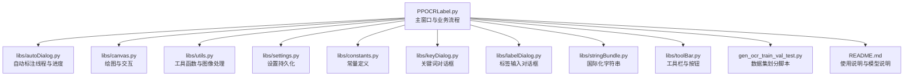
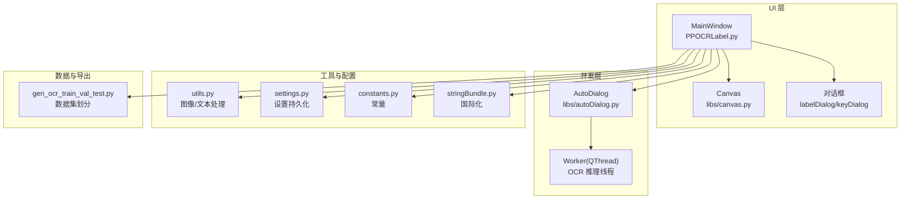
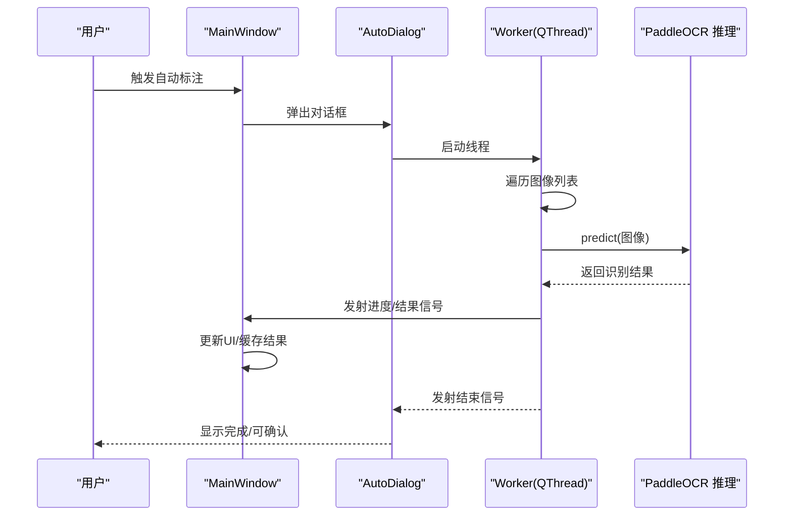
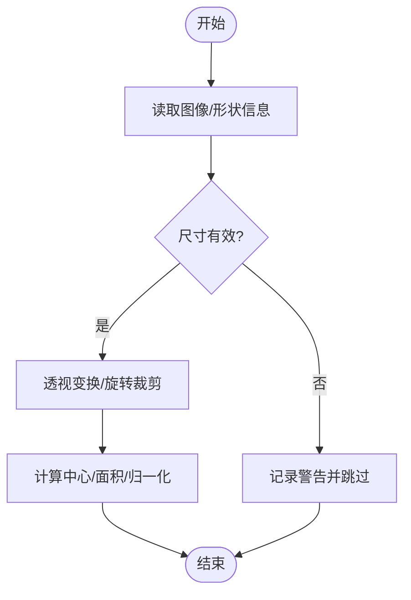
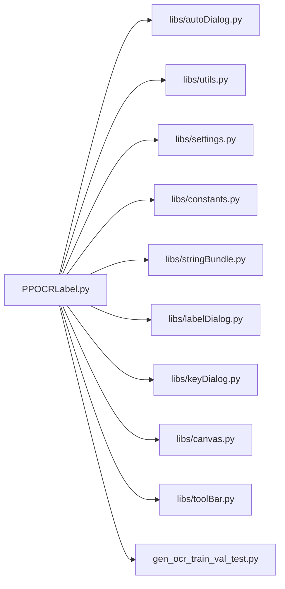

# 外部服务集成

<cite>
**本文引用的文件**
- [PPOCRLabel.py](file://PPOCRLabel.py)
- [libs/autoDialog.py](file://libs/autoDialog.py)
- [libs/utils.py](file://libs/utils.py)
- [libs/settings.py](file://libs/settings.py)
- [libs/constants.py](file://libs/constants.py)
- [libs/canvas.py](file://libs/canvas.py)
- [libs/keyDialog.py](file://libs/keyDialog.py)
- [libs/labelDialog.py](file://libs/labelDialog.py)
- [libs/stringBundle.py](file://libs/stringBundle.py)
- [libs/toolBar.py](file://libs/toolBar.py)
- [gen_ocr_train_val_test.py](file://gen_ocr_train_val_test.py)
- [README.md](file://README.md)
</cite>

## 目录
1. [简介](#简介)
2. [项目结构](#项目结构)
3. [核心组件](#核心组件)
4. [架构总览](#架构总览)
5. [详细组件分析](#详细组件分析)
6. [依赖分析](#依赖分析)
7. [性能考虑](#性能考虑)
8. [故障排查指南](#故障排查指南)
9. [结论](#结论)
10. [附录](#附录)

## 简介
本文件聚焦于该 PaddleOCR 图形标注工具在“外部服务集成”方面的设计与实现现状，围绕以下目标展开：
- 解释如何集成第三方 OCR 服务、云存储服务与在线 API
- 说明 HTTP 客户端的实现方式（请求构建、响应处理、错误重试）
- 提供服务认证与授权方案（API 密钥管理、OAuth 流程、会话管理）
- 解释异步处理与并发调用策略（线程池、超时控制、资源清理）
- 包含网络异常处理、断线重连与数据同步的实现思路

经分析，该项目以本地模型推理为主，未发现直接的第三方 OCR 服务、云存储或在线 API 的 HTTP 集成代码；但其 UI 与并发框架具备良好的扩展性，可作为接入外部服务的基础设施。

## 项目结构
项目采用模块化组织，主程序负责界面与流程编排，libs 子目录提供通用 UI 组件、工具函数与配置管理，gen 脚本用于数据集划分与导出。

图表来源
- [PPOCRLabel.py](file://PPOCRLabel.py#L200-L260)
- [libs/autoDialog.py](file://libs/autoDialog.py#L1-L120)
- [libs/canvas.py](file://libs/canvas.py#L1-L120)
- [libs/utils.py](file://libs/utils.py#L1-L120)
- [libs/settings.py](file://libs/settings.py#L1-L62)
- [libs/constants.py](file://libs/constants.py#L1-L33)
- [libs/keyDialog.py](file://libs/keyDialog.py#L1-L120)
- [libs/labelDialog.py](file://libs/labelDialog.py#L1-L80)
- [libs/stringBundle.py](file://libs/stringBundle.py#L1-L80)
- [libs/toolBar.py](file://libs/toolBar.py#L1-L48)
- [gen_ocr_train_val_test.py](file://gen_ocr_train_val_test.py#L1-L80)
- [README.md](file://README.md#L1-L120)

章节来源
- [PPOCRLabel.py](file://PPOCRLabel.py#L200-L260)
- [README.md](file://README.md#L1-L120)

## 核心组件
- 主窗口与模型加载：初始化 PaddleOCR 及子模型（检测、识别、表格结构），并加载 UI 字符串与设置。
- 自动标注线程：基于 PyQt 线程模型执行批量 OCR 推理，通过信号槽更新进度与结果。
- 工具与图像处理：提供旋转裁剪、自然排序、HTML 转换等辅助能力。
- 设置与常量：统一管理窗口状态、保存目录、编码等常量。
- 国际化与 UI 对话框：提供多语言字符串与标签/关键词输入对话框。
- 数据集导出与划分：生成训练/验证/测试集与识别数据。

章节来源
- [PPOCRLabel.py](file://PPOCRLabel.py#L200-L260)
- [libs/autoDialog.py](file://libs/autoDialog.py#L1-L120)
- [libs/utils.py](file://libs/utils.py#L1-L120)
- [libs/settings.py](file://libs/settings.py#L1-L62)
- [libs/constants.py](file://libs/constants.py#L1-L33)
- [libs/keyDialog.py](file://libs/keyDialog.py#L1-L120)
- [libs/labelDialog.py](file://libs/labelDialog.py#L1-L80)
- [libs/stringBundle.py](file://libs/stringBundle.py#L1-L80)
- [gen_ocr_train_val_test.py](file://gen_ocr_train_val_test.py#L1-L80)

## 架构总览
系统采用“本地模型推理 + GUI 并发”的架构。主线程负责 UI 响应与事件循环，工作线程执行耗时的 OCR 推理与结果回传，避免阻塞界面。

图表来源
- [PPOCRLabel.py](file://PPOCRLabel.py#L200-L260)
- [libs/autoDialog.py](file://libs/autoDialog.py#L1-L120)
- [libs/canvas.py](file://libs/canvas.py#L1-L120)
- [libs/utils.py](file://libs/utils.py#L1-L120)
- [libs/settings.py](file://libs/settings.py#L1-L62)
- [libs/constants.py](file://libs/constants.py#L1-L33)
- [libs/stringBundle.py](file://libs/stringBundle.py#L1-L80)
- [gen_ocr_train_val_test.py](file://gen_ocr_train_val_test.py#L1-L80)

## 详细组件分析

### 自动标注线程与并发模型
- Worker 线程负责逐图推理，通过信号向主线程回传进度与结果，并最终触发保存动作。
- AutoDialog 控制线程生命周期，提供进度条与取消逻辑。
- 主线程通过信号槽与 UI 同步，避免阻塞。

图表来源
- [libs/autoDialog.py](file://libs/autoDialog.py#L1-L120)
- [libs/autoDialog.py](file://libs/autoDialog.py#L120-L196)
- [PPOCRLabel.py](file://PPOCRLabel.py#L200-L260)

章节来源
- [libs/autoDialog.py](file://libs/autoDialog.py#L1-L120)
- [libs/autoDialog.py](file://libs/autoDialog.py#L120-L196)

### 图像处理与几何变换
- 提供旋转裁剪、边界盒中心与面积计算、映射缩放等工具，支撑标注与识别前处理。
- 错误捕获与日志记录，保证处理链路稳定性。

图表来源
- [libs/utils.py](file://libs/utils.py#L120-L220)

章节来源
- [libs/utils.py](file://libs/utils.py#L120-L220)

### 设置与常量管理
- Settings 使用 pickle 持久化窗口状态、最近文件、自动保存等配置。
- Constants 定义窗口尺寸、颜色、标签格式等常量，便于全局一致。

章节来源
- [libs/settings.py](file://libs/settings.py#L1-L62)
- [libs/constants.py](file://libs/constants.py#L1-L33)

### 国际化与对话框
- StringBundle 支持多语言字符串加载与回退策略。
- LabelDialog 与 KeyDialog 提供标签与关键词输入，配合补全与校验。

章节来源
- [libs/stringBundle.py](file://libs/stringBundle.py#L1-L80)
- [libs/labelDialog.py](file://libs/labelDialog.py#L1-L119)
- [libs/keyDialog.py](file://libs/keyDialog.py#L1-L120)

### 数据导出与划分
- gen_ocr_train_val_test.py 将标注数据按比例拆分为训练/验证/测试集，并输出对应索引文件与裁剪图像。

章节来源
- [gen_ocr_train_val_test.py](file://gen_ocr_train_val_test.py#L1-L183)
- [README.md](file://README.md#L200-L356)

## 依赖分析
- 主程序依赖 libs 中的工具与 UI 组件，形成清晰的分层。
- 自动标注线程与 UI 通过信号槽解耦，降低耦合度。
- 设置与常量集中管理，提升一致性与可维护性。

图表来源
- [PPOCRLabel.py](file://PPOCRLabel.py#L200-L260)
- [libs/autoDialog.py](file://libs/autoDialog.py#L1-L120)
- [libs/utils.py](file://libs/utils.py#L1-L120)
- [libs/settings.py](file://libs/settings.py#L1-L62)
- [libs/constants.py](file://libs/constants.py#L1-L33)
- [libs/stringBundle.py](file://libs/stringBundle.py#L1-L80)
- [libs/labelDialog.py](file://libs/labelDialog.py#L1-L119)
- [libs/keyDialog.py](file://libs/keyDialog.py#L1-L120)
- [libs/canvas.py](file://libs/canvas.py#L1-L120)
- [libs/toolBar.py](file://libs/toolBar.py#L1-L48)
- [gen_ocr_train_val_test.py](file://gen_ocr_train_val_test.py#L1-L80)

章节来源
- [PPOCRLabel.py](file://PPOCRLabel.py#L200-L260)

## 性能考虑
- 线程模型：使用 QThread 执行推理，避免阻塞 UI；建议在高并发场景下限制同时运行的线程数，防止 GPU/CPU 资源争抢。
- 超时与取消：AutoDialog 提供取消按钮，Worker 在收到取消信号后尽快退出，主线程负责清理资源。
- 缓存与增量：利用 Settings 与中间结果缓存，减少重复计算；仅对变更图像执行推理。
- I/O 优化：批量写入导出文件，避免频繁磁盘操作；合理设置缓冲区大小。

## 故障排查指南
- 日志与告警：工具函数与自动标注线程均使用日志记录错误与警告，便于定位问题。
- 线程安全：确保通过信号槽与主线程通信，避免跨线程直接访问 UI。
- 资源清理：取消时调用线程退出与等待，确保资源释放；必要时在 closeEvent 中统一回收。

章节来源
- [libs/autoDialog.py](file://libs/autoDialog.py#L120-L196)
- [libs/utils.py](file://libs/utils.py#L1-L120)

## 结论
- 当前代码以本地模型为核心，未直接集成第三方 OCR 服务、云存储或在线 API 的 HTTP 客户端。
- UI 与并发框架具备良好扩展性，可作为接入外部服务的基础设施。
- 若需引入外部服务，建议复用现有线程模型与信号槽机制，结合统一的配置与日志体系，确保稳定与可观测性。

## 附录

### 外部服务集成实施建议（概念性）
- HTTP 客户端
  - 请求构建：封装请求头、查询参数与请求体，支持多格式（JSON、表单、二进制）。
  - 响应处理：解析状态码与响应体，区分成功/失败与业务错误。
  - 错误重试：指数退避与抖动，区分可重试错误（网络超时、5xx）与不可重试错误（4xx）。
- 认证与授权
  - API 密钥：密钥存储于受保护的配置文件或环境变量；请求时注入 Authorization 头。
  - OAuth：在独立对话框中引导用户授权，回调后换取令牌并持久化；定期刷新。
  - 会话管理：基于令牌与刷新令牌的轮转，超时自动登出并提示重新登录。
- 异步与并发
  - 线程池：限制最大并发数，队列化请求，避免雪崩。
  - 超时控制：为每个请求设置连接与读取超时，超时后触发重试或降级。
  - 资源清理：异常与取消路径统一清理连接、文件句柄与临时缓存。
- 网络异常与断线重连
  - 断线检测：心跳与超时结合；失败计数超过阈值进入退避重连。
  - 数据同步：离线期间本地缓存请求与结果，联网后按序重放并去重。

[本节为概念性指导，不直接分析具体源码文件]