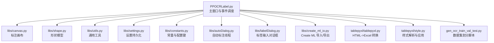
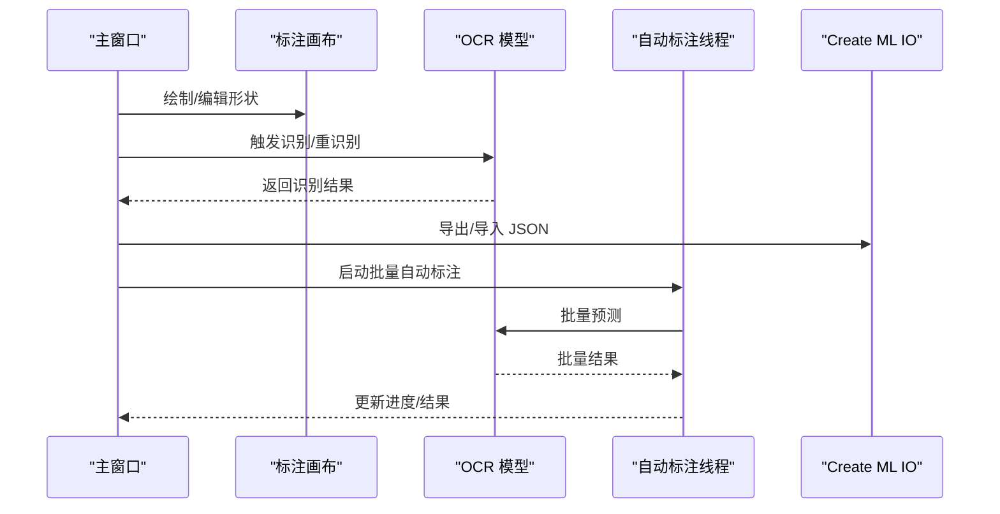
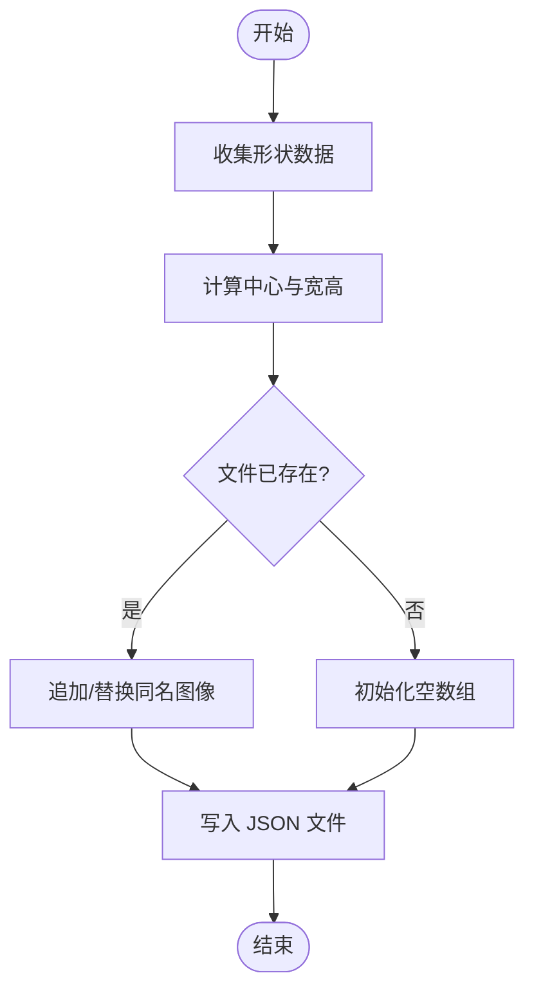
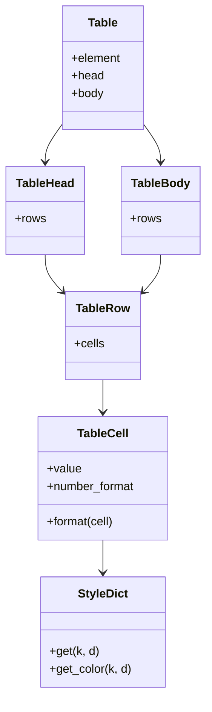
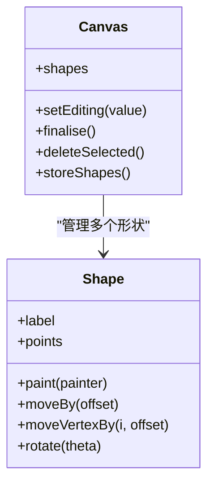
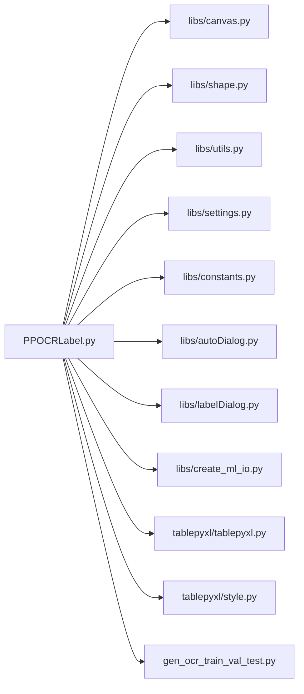

# 扩展和集成

<cite>
**本文引用的文件**
- [PPOCRLabel.py](file://PPOCRLabel.py)
- [libs/create_ml_io.py](file://libs/create_ml_io.py)
- [libs/canvas.py](file://libs/canvas.py)
- [libs/shape.py](file://libs/shape.py)
- [libs/utils.py](file://libs/utils.py)
- [libs/settings.py](file://libs/settings.py)
- [libs/constants.py](file://libs/constants.py)
- [libs/autoDialog.py](file://libs/autoDialog.py)
- [libs/labelDialog.py](file://libs/labelDialog.py)
- [tablepyxl/tablepyxl.py](file://tablepyxl/tablepyxl.py)
- [tablepyxl/style.py](file://tablepyxl/style.py)
- [gen_ocr_train_val_test.py](file://gen_ocr_train_val_test.py)
- [README.md](file://README.md)
</cite>

## 目录
1. [简介](#简介)
2. [项目结构](#项目结构)
3. [核心组件](#核心组件)
4. [架构总览](#架构总览)
5. [详细组件分析](#详细组件分析)
6. [依赖关系分析](#依赖关系分析)
7. [性能考量](#性能考量)
8. [故障排查指南](#故障排查指南)
9. [结论](#结论)
10. [附录](#附录)

## 简介
本文件面向希望在 PPOCRLabel 上进行扩展与集成的开发者，系统阐述其插件化架构、扩展点设计与最佳实践，覆盖以下主题：
- 插件系统与扩展点：如何在不破坏主流程的前提下接入新的 OCR 模型、数据格式与第三方服务
- Create ML 格式导入/导出：实现机制与数据映射
- 表格样式处理与 Excel 导出：HTML 到 Excel 的转换与样式保留
- 自定义标注模式与数据格式支持：如何新增标注类型与导出格式
- 外部工具集成：如何与外部 OCR/表格编辑器协作
- 开发指南：API 设计原则、兼容性与扩展性建议

## 项目结构
PPOCRLabel 采用模块化组织，核心入口为图形界面主程序，围绕标注画布、形状模型、工具函数、设置与常量等模块协同工作；表格相关能力通过独立的 tablepyxl 包实现。

图表来源
- [PPOCRLabel.py](file://PPOCRLabel.py#L143-L3853)
- [libs/canvas.py](file://libs/canvas.py#L32-L969)
- [libs/shape.py](file://libs/shape.py#L35-L285)
- [libs/utils.py](file://libs/utils.py#L1-L413)
- [libs/settings.py](file://libs/settings.py#L21-L62)
- [libs/constants.py](file://libs/constants.py#L1-L33)
- [libs/autoDialog.py](file://libs/autoDialog.py#L22-L196)
- [libs/labelDialog.py](file://libs/labelDialog.py#L30-L119)
- [libs/create_ml_io.py](file://libs/create_ml_io.py#L27-L147)
- [tablepyxl/tablepyxl.py](file://tablepyxl/tablepyxl.py#L15-L136)
- [tablepyxl/style.py](file://tablepyxl/style.py#L182-L350)
- [gen_ocr_train_val_test.py](file://gen_ocr_train_val_test.py#L75-L183)

章节来源
- [PPOCRLabel.py](file://PPOCRLabel.py#L143-L3853)
- [README.md](file://README.md#L1-L356)

## 核心组件
- 主窗口与事件调度：负责菜单、工具栏、动作绑定、模型初始化与交互逻辑
- 标注画布与形状模型：提供绘制、编辑、选择、拖拽、缩放等交互能力
- 工具函数与设置：提供通用工具、序列化/反序列化、设置持久化
- Create ML IO：提供 JSON 格式的导入/导出能力
- 表格样式处理：将 HTML 表格转换为 Excel 并保留样式
- 数据集划分脚本：辅助训练/验证/测试集划分

章节来源
- [PPOCRLabel.py](file://PPOCRLabel.py#L143-L3853)
- [libs/canvas.py](file://libs/canvas.py#L32-L969)
- [libs/shape.py](file://libs/shape.py#L35-L285)
- [libs/utils.py](file://libs/utils.py#L1-L413)
- [libs/settings.py](file://libs/settings.py#L21-L62)
- [libs/create_ml_io.py](file://libs/create_ml_io.py#L27-L147)
- [tablepyxl/tablepyxl.py](file://tablepyxl/tablepyxl.py#L15-L136)
- [tablepyxl/style.py](file://tablepyxl/style.py#L182-L350)
- [gen_ocr_train_val_test.py](file://gen_ocr_train_val_test.py#L75-L183)

## 架构总览
PPOCRLabel 的扩展点主要体现在以下方面：
- OCR 模型接入：通过 PaddleOCR/PPStructureV3 实例化与替换，支持不同语言与任务
- 导出格式扩展：通过统一的标注数据结构与格式枚举，新增导出器
- 表格样式处理：通过 tablepyxl 将 HTML 表格结构与样式转换为 Excel
- 自动标注线程：Worker 线程与主线程解耦，便于扩展其他 OCR/服务
- 设置与常量：集中管理配置键与默认值，保证扩展的一致性

图表来源
- [PPOCRLabel.py](file://PPOCRLabel.py#L1782-L1817)
- [libs/autoDialog.py](file://libs/autoDialog.py#L37-L101)
- [libs/create_ml_io.py](file://libs/create_ml_io.py#L48-L85)

## 详细组件分析

### 插件系统与扩展点设计
- OCR 模型扩展
  - 支持通过参数替换检测/识别/分类模型目录与名称，实现多语言与自定义模型接入
  - 可在主窗口初始化阶段替换 PaddleOCR/PPStructureV3 实例，满足不同业务需求
- 自动标注线程扩展
  - Worker 线程与主线程通过信号/槽通信，便于接入其他 OCR/服务
  - 可扩展为多模型/多服务并行策略
- 导出格式扩展
  - 通过统一的标注数据结构与格式枚举，新增导出器无需改动主流程
  - Create ML 导入/导出提供 JSON 格式模板，便于对接第三方平台

章节来源
- [PPOCRLabel.py](file://PPOCRLabel.py#L3391-L3423)
- [libs/autoDialog.py](file://libs/autoDialog.py#L22-L101)
- [libs/constants.py](file://libs/constants.py#L28-L32)

### Create ML 格式导入/导出实现机制
- 导出流程
  - 从标注画布收集形状，计算边界框中心与宽高，写入 JSON 数组
  - 若目标文件已存在则合并同名图像的标注
- 导入流程
  - 读取 JSON 文件，匹配当前图像名，解析标注并生成矩形框
- 数据映射
  - 形状 points 映射为 Create ML 的坐标系（中心点+宽高）
  - 标签 label 与坐标信息一一对应

图表来源
- [libs/create_ml_io.py](file://libs/create_ml_io.py#L48-L85)

章节来源
- [libs/create_ml_io.py](file://libs/create_ml_io.py#L27-L147)

### 表格样式处理与 Excel 导出
- HTML 表格解析
  - 使用 lxml 解析 HTML，移除注释，提取 table/thead/tbody/tr/td/th
- 样式解析与应用
  - 将 CSS 样式字符串解析为字典，映射到 openpyxl 样式对象
  - 支持字体、对齐、填充、边框、数值格式等
- 单元格合并与列宽
  - 根据 colspan/rowspan 合并单元格
  - 动态计算列宽，避免内容截断
- Excel 写入
  - 将每个 table 写入一个新 sheet，sheet 名来自 table 的 name 属性

图表来源
- [tablepyxl/style.py](file://tablepyxl/style.py#L220-L350)
- [tablepyxl/tablepyxl.py](file://tablepyxl/tablepyxl.py#L15-L136)

章节来源
- [tablepyxl/style.py](file://tablepyxl/style.py#L182-L350)
- [tablepyxl/tablepyxl.py](file://tablepyxl/tablepyxl.py#L78-L136)

### 标注画布与形状模型
- 画布交互
  - 提供绘制、编辑、选择、拖拽、缩放、撤销/重做等能力
  - 通过信号与主窗口联动，驱动保存/识别/导出等操作
- 形状模型
  - 支持矩形、多边形、锁定状态、标签显示、索引显示等
  - 提供旋转、移动、顶点编辑等几何操作

图表来源
- [libs/canvas.py](file://libs/canvas.py#L32-L969)
- [libs/shape.py](file://libs/shape.py#L35-L285)

章节来源
- [libs/canvas.py](file://libs/canvas.py#L32-L969)
- [libs/shape.py](file://libs/shape.py#L35-L285)

### 自动标注与外部服务集成
- 自动标注线程
  - Worker 线程异步执行 OCR 预测，主线程通过信号更新 UI
  - 支持进度条、剩余时间估算、取消中断
- 外部服务集成
  - 可替换 Worker 中的 OCR 调用为外部服务请求
  - 保持与现有 UI/数据流一致的接口契约

章节来源
- [libs/autoDialog.py](file://libs/autoDialog.py#L22-L196)

### 设置与常量
- 设置持久化
  - 使用 pickle 序列化存储用户偏好与窗口状态
- 常量与格式枚举
  - 统一管理配置键、默认编码、格式类型等

章节来源
- [libs/settings.py](file://libs/settings.py#L21-L62)
- [libs/constants.py](file://libs/constants.py#L1-L33)

### 数据集划分与导出
- 数据集划分脚本
  - 支持检测/识别数据集的训练/验证/测试集划分
  - 依据比例随机打乱并写入对应 txt 文件
- 导出结果
  - 支持自动/手动导出标注与识别结果，生成 Label.txt/rec_gt.txt 与裁剪图像

章节来源
- [gen_ocr_train_val_test.py](file://gen_ocr_train_val_test.py#L75-L183)
- [README.md](file://README.md#L281-L321)

## 依赖关系分析
- 主窗口依赖画布、形状、工具、设置、常量、对话框、Create ML IO、表格处理与数据集脚本
- 画布依赖形状模型与工具函数
- 自动标注线程依赖 OCR 模型与工具函数
- 表格处理依赖 lxml、openpyxl、premailer

图表来源
- [PPOCRLabel.py](file://PPOCRLabel.py#L143-L3853)
- [libs/canvas.py](file://libs/canvas.py#L32-L969)
- [libs/shape.py](file://libs/shape.py#L35-L285)
- [libs/utils.py](file://libs/utils.py#L1-L413)
- [libs/settings.py](file://libs/settings.py#L21-L62)
- [libs/constants.py](file://libs/constants.py#L1-L33)
- [libs/autoDialog.py](file://libs/autoDialog.py#L22-L196)
- [libs/labelDialog.py](file://libs/labelDialog.py#L30-L119)
- [libs/create_ml_io.py](file://libs/create_ml_io.py#L27-L147)
- [tablepyxl/tablepyxl.py](file://tablepyxl/tablepyxl.py#L15-L136)
- [tablepyxl/style.py](file://tablepyxl/style.py#L182-L350)
- [gen_ocr_train_val_test.py](file://gen_ocr_train_val_test.py#L75-L183)

## 性能考量
- 线程与异步
  - 自动标注使用独立线程，避免阻塞 UI
  - 进度条与剩余时间估算提升用户体验
- 图像处理
  - 对小尺寸图像跳过识别，减少无效计算
  - 透视变换与裁剪采用高效算法
- 样式与渲染
  - 样式缓存与命名样式复用，降低 openpyxl 写入成本
  - 列宽动态计算，避免重复测量

[本节为通用指导，无需特定文件引用]

## 故障排查指南
- 资源编译错误
  - 缺少资源文件时需重新编译资源
- OpenCV 版本问题
  - Linux 下遇到 xcb 插件或 objc 错误时，按说明调整版本
- Windows 表格识别依赖缺失
  - 缺少 win32com 时安装所需模块
- 模型版本不一致
  - 优先级问题导致异常时，确保依赖包版本一致

章节来源
- [README.md](file://README.md#L322-L351)

## 结论
PPOCRLabel 在架构层面提供了清晰的扩展点与集成路径：
- 通过替换 OCR 实例与参数化配置，轻松接入新模型与多语言
- 通过统一的数据结构与格式枚举，可便捷扩展新的导出格式
- 通过线程与信号/槽机制，可无缝集成外部服务
- 通过 tablepyxl，可将 HTML 表格结构与样式转换为 Excel，满足复杂标注场景
遵循本文档的开发指南与最佳实践，可在不破坏主流程的前提下安全扩展功能。

[本节为总结，无需特定文件引用]

## 附录

### 开发指南：扩展新 OCR 模型
- 替换主窗口中的 PaddleOCR/PPStructureV3 实例，传入自定义模型路径与参数
- 如需切换语言，更新语言映射与模型初始化逻辑
- 保持与现有 UI/数据流一致的接口契约

章节来源
- [PPOCRLabel.py](file://PPOCRLabel.py#L3391-L3423)
- [README.md](file://README.md#L252-L279)

### 开发指南：新增数据格式支持
- 定义新的导出器类，遵循统一的数据结构
- 在常量中注册新的格式枚举
- 在主窗口中增加菜单项与调用逻辑

章节来源
- [libs/constants.py](file://libs/constants.py#L28-L32)
- [PPOCRLabel.py](file://PPOCRLabel.py#L1782-L1817)

### 开发指南：集成第三方服务
- 在 Worker 线程中替换 OCR 调用为外部服务请求
- 保持返回数据结构与现有流程一致
- 通过信号/槽与 UI 交互，支持进度与取消

章节来源
- [libs/autoDialog.py](file://libs/autoDialog.py#L22-L101)

### 开发指南：表格样式处理集成
- 使用 tablepyxl 的 HTML 解析与样式应用能力
- 通过 style.py 的样式字典与 openpyxl 样式映射
- 注意合并单元格与列宽计算的细节

章节来源
- [tablepyxl/style.py](file://tablepyxl/style.py#L182-L350)
- [tablepyxl/tablepyxl.py](file://tablepyxl/tablepyxl.py#L78-L136)