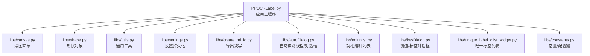
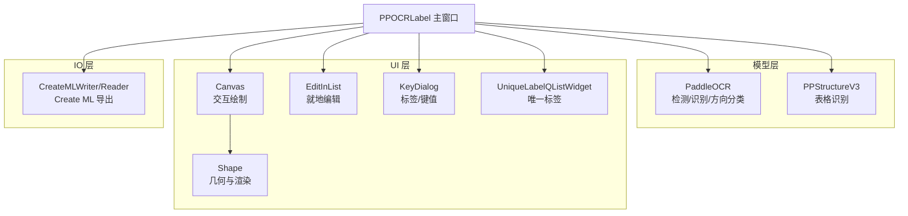
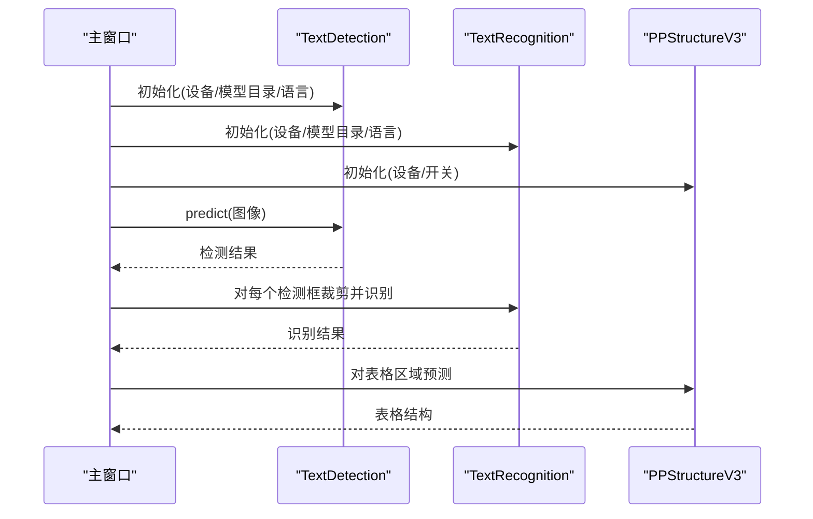
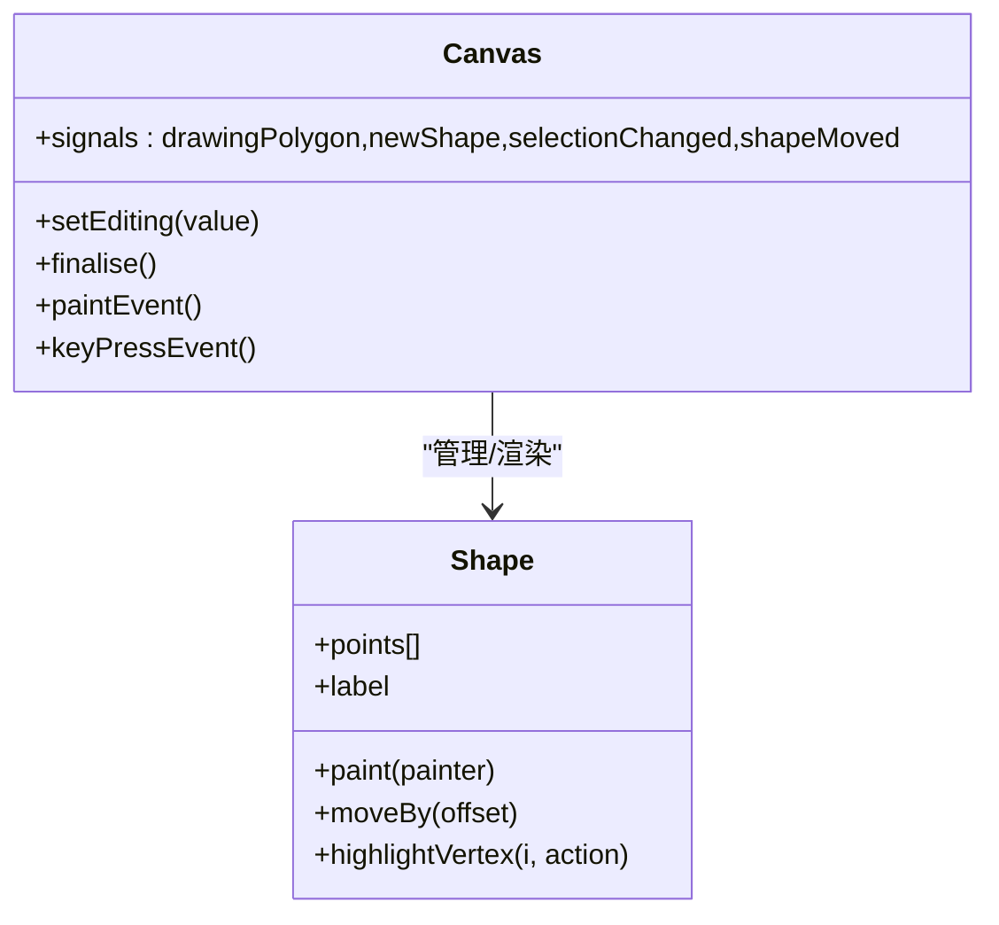
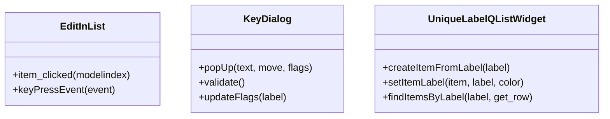
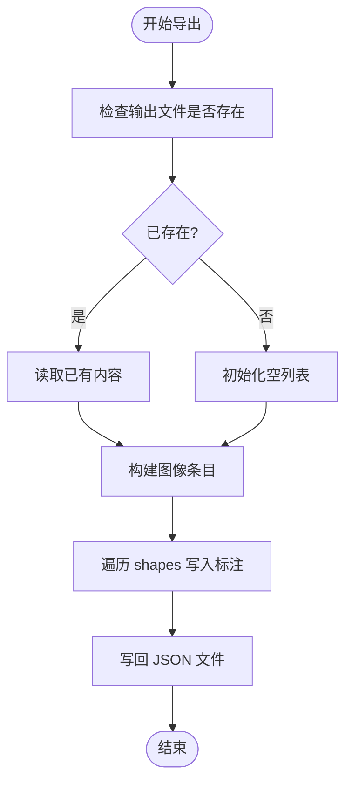
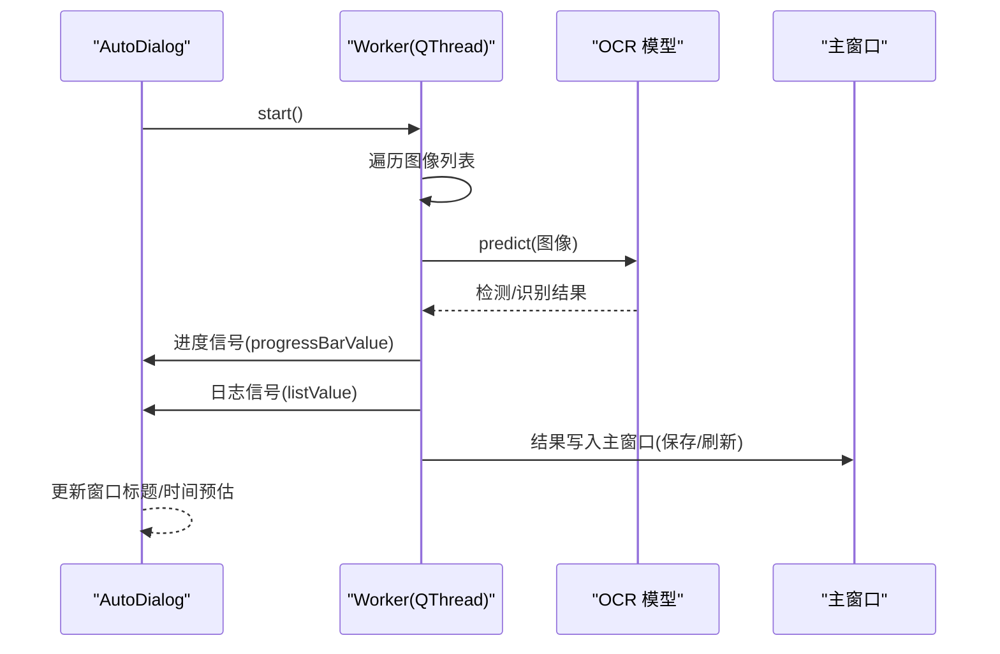
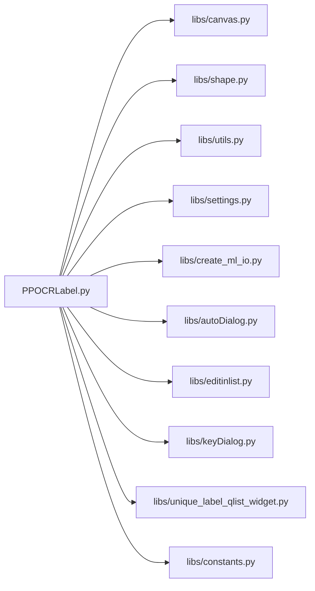

# 扩展点设计

<cite>
**本文引用的文件**
- [PPOCRLabel.py](file://PPOCRLabel.py)
- [libs/__init__.py](file://libs/__init__.py)
- [libs/canvas.py](file://libs/canvas.py)
- [libs/shape.py](file://libs/shape.py)
- [libs/utils.py](file://libs/utils.py)
- [libs/settings.py](file://libs/settings.py)
- [libs/create_ml_io.py](file://libs/create_ml_io.py)
- [libs/autoDialog.py](file://libs/autoDialog.py)
- [libs/editinlist.py](file://libs/editinlist.py)
- [libs/keyDialog.py](file://libs/keyDialog.py)
- [libs/unique_label_qlist_widget.py](file://libs/unique_label_qlist_widget.py)
- [libs/constants.py](file://libs/constants.py)
</cite>

## 目录
1. [引言](#引言)
2. [项目结构](#项目结构)
3. [核心组件](#核心组件)
4. [架构总览](#架构总览)
5. [详细组件分析](#详细组件分析)
6. [依赖关系分析](#依赖关系分析)
7. [性能考虑](#性能考虑)
8. [故障排查指南](#故障排查指南)
9. [结论](#结论)
10. [附录](#附录)

## 引言
本文件系统性梳理 PPOCRLabel 的扩展点设计，聚焦于以下扩展维度：
- OCR 模型扩展点：文本检测、识别、表格结构识别等子任务的模型接入与替换。
- UI 组件扩展点：绘图画布、对话框、列表控件等界面元素的扩展与定制。
- 数据导出扩展点：标签格式导出（如 Create ML）与识别结果导出的扩展机制。

文档同时总结扩展点的设计原则（向后兼容、接口稳定性）、最佳实践与常见陷阱，帮助开发者正确理解并扩展该工具。

## 项目结构
PPOCRLabel 采用“应用主程序 + 可插拔 UI 与 IO 模块”的组织方式：
- 应用主程序负责生命周期管理、动作装配、事件分发与模型集成。
- libs 子模块提供 UI 控件、通用工具、设置持久化、导出读写等可复用能力。
- tablepyxl 等第三方库用于表格结构解析（与导出流程协同）。

图表来源
- [PPOCRLabel.py](file://PPOCRLabel.py#L140-L240)
- [libs/canvas.py](file://libs/canvas.py#L32-L120)
- [libs/shape.py](file://libs/shape.py#L35-L120)
- [libs/utils.py](file://libs/utils.py#L33-L120)
- [libs/settings.py](file://libs/settings.py#L21-L62)
- [libs/create_ml_io.py](file://libs/create_ml_io.py#L27-L110)
- [libs/autoDialog.py](file://libs/autoDialog.py#L103-L196)
- [libs/editinlist.py](file://libs/editinlist.py#L7-L34)
- [libs/keyDialog.py](file://libs/keyDialog.py#L27-L120)
- [libs/unique_label_qlist_widget.py](file://libs/unique_label_qlist_widget.py#L14-L49)
- [libs/constants.py](file://libs/constants.py#L13-L33)

章节来源
- [PPOCRLabel.py](file://PPOCRLabel.py#L140-L240)
- [libs/__init__.py](file://libs/__init__.py#L1-L3)

## 核心组件
- 主窗口与模型集成：主窗口在初始化时装配 OCR 检测器、识别器、表格识别器，并通过参数控制设备与语言等。
- 画布与形状：Canvas 负责交互绘制、拖拽、缩放与信号发射；Shape 描述标注框几何与渲染。
- 工具与常量：utils 提供图标、动作、校验、图像处理等通用能力；constants 定义设置键与导出格式常量。
- 设置持久化：Settings 封装本地设置的序列化与加载。
- 导出读写：CreateMLWriter/Reader 实现 Create ML 格式的读取与写入。
- 自动识别：AutoDialog 与 Worker 使用线程异步执行 OCR 并更新 UI。
- UI 列表与对话框：EditInList 支持就地编辑；KeyDialog 提供标签选择与键值输入；UniqueLabelQListWidget 提供唯一标签列表与颜色标记。

章节来源
- [PPOCRLabel.py](file://PPOCRLabel.py#L140-L240)
- [libs/canvas.py](file://libs/canvas.py#L32-L120)
- [libs/shape.py](file://libs/shape.py#L35-L120)
- [libs/utils.py](file://libs/utils.py#L33-L120)
- [libs/settings.py](file://libs/settings.py#L21-L62)
- [libs/create_ml_io.py](file://libs/create_ml_io.py#L27-L110)
- [libs/autoDialog.py](file://libs/autoDialog.py#L103-L196)
- [libs/editinlist.py](file://libs/editinlist.py#L7-L34)
- [libs/keyDialog.py](file://libs/keyDialog.py#L27-L120)
- [libs/unique_label_qlist_widget.py](file://libs/unique_label_qlist_widget.py#L14-L49)
- [libs/constants.py](file://libs/constants.py#L13-L33)

## 架构总览
PPOCRLabel 的扩展点主要体现在三层：
- 模型层：通过构造函数注入不同模型实例，支持替换检测/识别/表格识别模型。
- UI 层：以类继承与组合的方式扩展控件行为（如列表、对话框、画布）。
- IO 层：以 Writer/Reader 接口抽象导出格式，便于新增格式。

图表来源
- [PPOCRLabel.py](file://PPOCRLabel.py#L190-L240)
- [libs/canvas.py](file://libs/canvas.py#L32-L120)
- [libs/shape.py](file://libs/shape.py#L35-L120)
- [libs/create_ml_io.py](file://libs/create_ml_io.py#L27-L110)

## 详细组件分析

### OCR 模型扩展点
- 扩展位置
  - 文本检测器：在主窗口初始化时创建检测器实例，可通过参数指定模型名称与目录。
  - 文本识别器：独立创建识别器实例，支持指定模型目录与设备。
  - 表格识别器：创建表格结构识别器，启用表格识别开关。
- 接口规范
  - 模型构造参数：设备（CPU/GPU）、语言、模型名称/目录等。
  - 预测接口：统一调用 predict 返回结构化结果（含多边形、文本、置信度等）。
- 扩展方式
  - 替换模型：在主窗口初始化处传入新的模型名称/目录参数。
  - 新增子任务：如新增公式识别、图表识别等，按现有模式创建对应识别器并在主窗口中装配。
- 设计原则
  - 向后兼容：保持 predict 输出字段稳定，避免破坏既有 UI 逻辑。
  - 接口稳定性：统一返回结构，便于 UI 与导出模块解耦。

图表来源
- [PPOCRLabel.py](file://PPOCRLabel.py#L190-L240)

章节来源
- [PPOCRLabel.py](file://PPOCRLabel.py#L190-L240)

### UI 组件扩展点

#### 画布与形状扩展
- Canvas 扩展点
  - 信号扩展：drawingPolygon/newShape/selectionChanged/shapeMoved 等信号用于驱动 UI 更新。
  - 绘制模式：支持矩形与四点绘制，可通过属性切换。
  - 交互扩展：重写鼠标/键盘事件以支持自定义操作（如旋转、吸附）。
- Shape 扩展点
  - 几何与渲染：支持顶点高亮、填充、标签绘制、索引绘制等。
  - 扩展字段：可增加业务相关字段（如 key_cls、difficult 等）并参与渲染。
- 设计原则
  - 低耦合：Canvas 仅依赖 Shape 接口，便于替换渲染策略。
  - 可测试：将渲染与几何分离，便于单元测试。

图表来源
- [libs/canvas.py](file://libs/canvas.py#L32-L120)
- [libs/shape.py](file://libs/shape.py#L35-L120)

章节来源
- [libs/canvas.py](file://libs/canvas.py#L32-L120)
- [libs/shape.py](file://libs/shape.py#L35-L120)

#### 列表与对话框扩展
- EditInList 扩展点
  - 就地编辑：通过 persistent editor 实现就地修改，适合快速编辑识别结果。
  - 扩展行为：可重写 item_clicked 以支持更多编辑策略。
- KeyDialog 扩展点
  - 标签选择与键值输入：支持补全、旗标（flags）动态更新。
  - 扩展行为：可增加自定义匹配规则或新增对话框布局。
- UniqueLabelQListWidget 扩展点
  - 唯一标签与颜色：通过 UserRole 存储标签，支持彩色标记与查找。
  - 扩展行为：可增加排序策略或自定义渲染。

图表来源
- [libs/editinlist.py](file://libs/editinlist.py#L7-L34)
- [libs/keyDialog.py](file://libs/keyDialog.py#L27-L120)
- [libs/unique_label_qlist_widget.py](file://libs/unique_label_qlist_widget.py#L14-L49)

章节来源
- [libs/editinlist.py](file://libs/editinlist.py#L7-L34)
- [libs/keyDialog.py](file://libs/keyDialog.py#L27-L120)
- [libs/unique_label_qlist_widget.py](file://libs/unique_label_qlist_widget.py#L14-L49)

### 数据导出扩展点
- Create ML Writer/Reader
  - Writer：将标注转换为 Create ML JSON 结构，支持追加与去重。
  - Reader：从 Create ML JSON 解析标注，生成 Shape 列表。
- 扩展方式
  - 新增导出格式：仿照 CreateMLWriter/Reader 的接口签名，实现新的 Writer 类。
  - 扩展字段：在 Writer 中扩展输出字段（如置信度、类别权重等）。
- 设计原则
  - 接口稳定：统一 write/get_shapes 等方法名，便于 UI 与动作绑定。
  - 兼容编码：统一默认编码常量，避免跨平台差异。

图表来源
- [libs/create_ml_io.py](file://libs/create_ml_io.py#L48-L110)

章节来源
- [libs/create_ml_io.py](file://libs/create_ml_io.py#L27-L110)
- [libs/constants.py](file://libs/constants.py#L28-L33)

### 自动识别扩展点
- Worker 与 AutoDialog
  - Worker：在独立线程中批量执行 OCR，通过信号与主线程通信。
  - AutoDialog：进度条、日志列表与取消逻辑。
- 扩展方式
  - 替换模型：在 Worker 构造中注入新模型实例。
  - 扩展结果处理：在主线程接收 listValue 信号时，扩展 UI 更新逻辑。
- 设计原则
  - 线程安全：仅通过信号传递必要数据，避免共享可变状态。
  - 取消机制：提供 handle 标志位与退出循环，确保及时停止。

图表来源
- [libs/autoDialog.py](file://libs/autoDialog.py#L103-L196)

章节来源
- [libs/autoDialog.py](file://libs/autoDialog.py#L103-L196)

## 依赖关系分析
- 主窗口对各模块的依赖集中在初始化阶段，通过参数注入模型与 UI 控件。
- UI 控件之间通过信号/槽连接，形成松耦合的数据流。
- 导出模块与 UI 通过动作与对话框间接耦合，便于替换。

图表来源
- [PPOCRLabel.py](file://PPOCRLabel.py#L140-L240)
- [libs/canvas.py](file://libs/canvas.py#L32-L120)
- [libs/shape.py](file://libs/shape.py#L35-L120)
- [libs/utils.py](file://libs/utils.py#L33-L120)
- [libs/settings.py](file://libs/settings.py#L21-L62)
- [libs/create_ml_io.py](file://libs/create_ml_io.py#L27-L110)
- [libs/autoDialog.py](file://libs/autoDialog.py#L103-L196)
- [libs/editinlist.py](file://libs/editinlist.py#L7-L34)
- [libs/keyDialog.py](file://libs/keyDialog.py#L27-L120)
- [libs/unique_label_qlist_widget.py](file://libs/unique_label_qlist_widget.py#L14-L49)
- [libs/constants.py](file://libs/constants.py#L13-L33)

章节来源
- [PPOCRLabel.py](file://PPOCRLabel.py#L140-L240)

## 性能考虑
- 模型推理
  - GPU 加速：优先使用 GPU，减少 CPU 占用。
  - 图像尺寸：过滤过小图像，避免无效计算。
- UI 渲染
  - Canvas 缩放与偏移：合理设置 scale 与 offset，避免过度重绘。
  - Shape 渲染：仅绘制可见 Shape，减少无关绘制。
- 导出与识别
  - 批量识别：Worker 分批处理，避免主线程阻塞。
  - JSON 写入：增量写入与去重，降低磁盘压力。

## 故障排查指南
- 模型初始化失败
  - 现象：启动时报错或无法识别。
  - 排查：确认模型目录与名称参数是否正确；检查设备可用性。
- UI 无响应
  - 现象：点击无反应或卡顿。
  - 排查：检查信号槽连接是否正确；避免在 UI 线程执行耗时操作。
- 导出异常
  - 现象：导出文件损坏或重复。
  - 排查：核对 Create ML Writer 的写入逻辑；检查文件存在与编码。
- 自动识别中断
  - 现象：进度条不动或提前结束。
  - 排查：确认 Worker 的 handle 标志位与线程退出流程。

章节来源
- [libs/autoDialog.py](file://libs/autoDialog.py#L172-L196)
- [libs/create_ml_io.py](file://libs/create_ml_io.py#L48-L110)
- [libs/canvas.py](file://libs/canvas.py#L737-L800)

## 结论
PPOCRLabel 的扩展点设计遵循“参数注入 + 信号驱动 + 接口抽象”的原则，既保证了向后兼容与接口稳定性，又为 OCR 模型、UI 组件与数据导出提供了清晰的扩展入口。开发者可在不破坏现有功能的前提下，通过继承与接口实现快速扩展新能力。

## 附录
- 版本信息：模块版本号由 libs/__init__.py 提供，便于追踪兼容性。
- 常量与设置键：统一定义在 constants.py 与 settings.py 中，确保全局一致性。

章节来源
- [libs/__init__.py](file://libs/__init__.py#L1-L3)
- [libs/constants.py](file://libs/constants.py#L13-L33)
- [libs/settings.py](file://libs/settings.py#L21-L62)