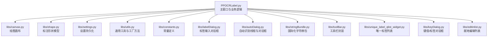
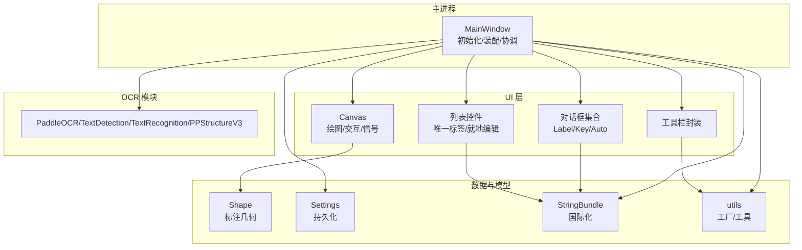
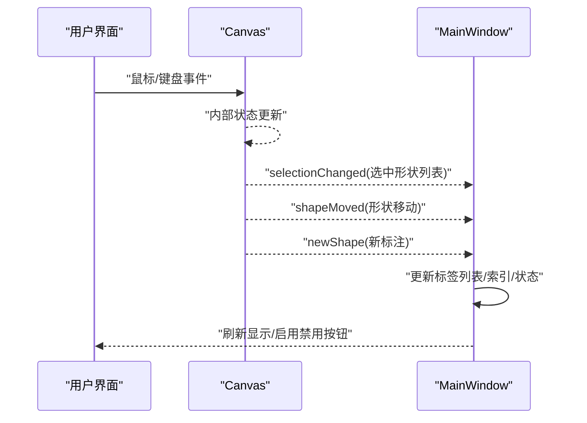
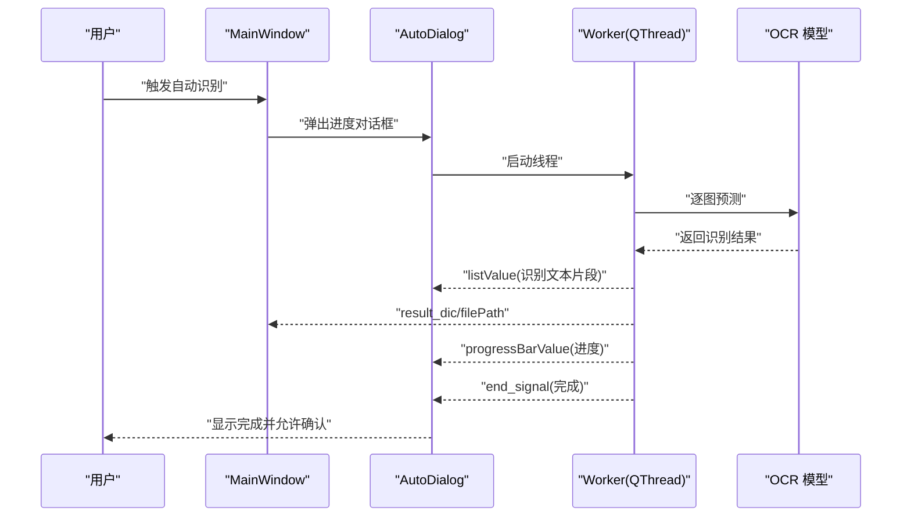
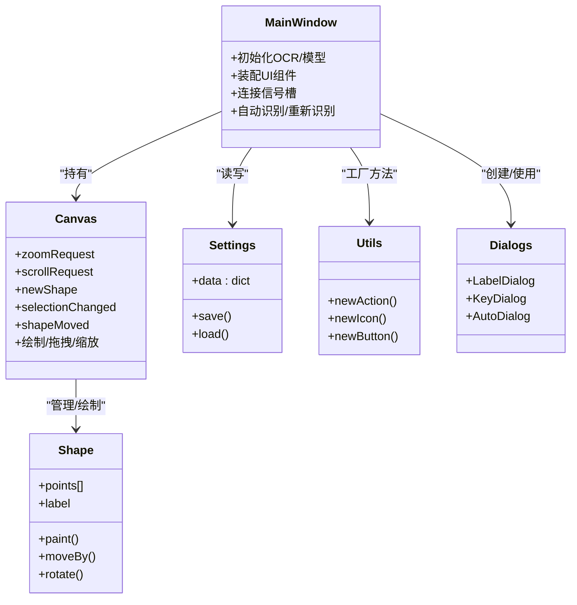
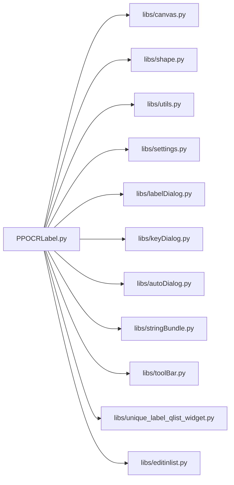

# 插件开发模式

<cite>
**本文引用的文件**
- [PPOCRLabel.py](file://PPOCRLabel.py)
- [canvas.py](file://libs/canvas.py)
- [shape.py](file://libs/shape.py)
- [settings.py](file://libs/settings.py)
- [utils.py](file://libs/utils.py)
- [constants.py](file://libs/constants.py)
- [labelDialog.py](file://libs/labelDialog.py)
- [autoDialog.py](file://libs/autoDialog.py)
- [stringBundle.py](file://libs/stringBundle.py)
- [toolBar.py](file://libs/toolBar.py)
- [unique_label_qlist_widget.py](file://libs/unique_label_qlist_widget.py)
- [keyDialog.py](file://libs/keyDialog.py)
- [editinlist.py](file://libs/editinlist.py)
</cite>

## 目录
1. [引言](#引言)
2. [项目结构](#项目结构)
3. [核心组件](#核心组件)
4. [架构总览](#架构总览)
5. [详细组件分析](#详细组件分析)
6. [依赖关系分析](#依赖关系分析)
7. [性能考量](#性能考量)
8. [故障排查指南](#故障排查指南)
9. [结论](#结论)
10. [附录](#附录)

## 引言
本文件面向希望基于 PPOCRLabel 开发“插件”的工程师，系统梳理项目中已有的设计模式与事件通信机制，并给出插件开发的实践指南。重点覆盖以下主题：
- 工厂模式：用于创建不同类型的标注工具与对话框
- 观察者模式：通过 PyQt 信号槽实现组件间松耦合通信
- 策略模式：在 OCR 模型选择与识别流程中的策略化扩展
- 插件开发示例：如何实现符合项目规范的插件模块
- 信号槽与事件驱动：如何以事件驱动方式实现插件间解耦交互
- 设计模式选择指南与性能优化建议

## 项目结构
PPOCRLabel 采用“主窗口 + 多个功能模块”的分层组织方式，核心入口为主窗口类，功能模块分布在 libs 子目录中，分别负责画布渲染、形状管理、设置持久化、工具函数、对话框、国际化字符串等。

图表来源
- [PPOCRLabel.py](file://PPOCRLabel.py#L140-L260)
- [canvas.py](file://libs/canvas.py#L32-L60)
- [shape.py](file://libs/shape.py#L35-L90)
- [settings.py](file://libs/settings.py#L21-L62)
- [utils.py](file://libs/utils.py#L33-L83)
- [constants.py](file://libs/constants.py#L13-L33)
- [labelDialog.py](file://libs/labelDialog.py#L30-L90)
- [autoDialog.py](file://libs/autoDialog.py#L103-L170)
- [stringBundle.py](file://libs/stringBundle.py#L29-L89)
- [toolBar.py](file://libs/toolBar.py#L18-L48)
- [unique_label_qlist_widget.py](file://libs/unique_label_qlist_widget.py#L7-L49)
- [keyDialog.py](file://libs/keyDialog.py#L27-L108)
- [editinlist.py](file://libs/editinlist.py#L7-L34)

章节来源
- [PPOCRLabel.py](file://PPOCRLabel.py#L140-L260)
- [canvas.py](file://libs/canvas.py#L32-L60)
- [shape.py](file://libs/shape.py#L35-L90)
- [settings.py](file://libs/settings.py#L21-L62)
- [utils.py](file://libs/utils.py#L33-L83)
- [constants.py](file://libs/constants.py#L13-L33)
- [labelDialog.py](file://libs/labelDialog.py#L30-L90)
- [autoDialog.py](file://libs/autoDialog.py#L103-L170)
- [stringBundle.py](file://libs/stringBundle.py#L29-L89)
- [toolBar.py](file://libs/toolBar.py#L18-L48)
- [unique_label_qlist_widget.py](file://libs/unique_label_qlist_widget.py#L7-L49)
- [keyDialog.py](file://libs/keyDialog.py#L27-L108)
- [editinlist.py](file://libs/editinlist.py#L7-L34)

## 核心组件
- 主窗口 MainWindow：负责加载 OCR 模型、构建 UI 组件、绑定信号槽、协调各模块协作；提供自动识别、重新识别、表格识别等入口。
- 画布 Canvas：承载标注图形绘制、拖拽、缩放、滚动等交互，通过信号向外广播状态变化。
- 形状 Shape：抽象标注框的几何与渲染，支持旋转、高亮、文本绘制等。
- 设置 Settings：提供键值存储与持久化，支持跨会话恢复界面状态。
- 工具与工厂 utils：提供 newAction/newIcon/newButton 等工厂方法，统一创建 UI 动作与图标。
- 对话框模块：LabelDialog、KeyDialog、AutoDialog 等，封装输入与交互流程。
- 国际化 StringBundle：按区域回退加载字符串资源，支撑多语言。
- 列表控件：UniqueLabelQListWidget、EditInList 提供唯一标签与就地编辑能力。

章节来源
- [PPOCRLabel.py](file://PPOCRLabel.py#L140-L260)
- [canvas.py](file://libs/canvas.py#L32-L60)
- [shape.py](file://libs/shape.py#L35-L90)
- [settings.py](file://libs/settings.py#L21-L62)
- [utils.py](file://libs/utils.py#L33-L83)
- [labelDialog.py](file://libs/labelDialog.py#L30-L90)
- [autoDialog.py](file://libs/autoDialog.py#L103-L170)
- [stringBundle.py](file://libs/stringBundle.py#L29-L89)
- [unique_label_qlist_widget.py](file://libs/unique_label_qlist_widget.py#L7-L49)
- [keyDialog.py](file://libs/keyDialog.py#L27-L108)
- [editinlist.py](file://libs/editinlist.py#L7-L34)

## 架构总览
PPOCRLabel 采用“主窗口协调 + 画布渲染 + 多模块协作”的架构。主窗口集中初始化 OCR 模型与 UI 控件，Canvas 负责图形交互并通过信号向外通知；其他模块如对话框、设置、工具函数等以工厂与工具形式被主窗口装配。

图表来源
- [PPOCRLabel.py](file://PPOCRLabel.py#L140-L260)
- [canvas.py](file://libs/canvas.py#L32-L60)
- [shape.py](file://libs/shape.py#L35-L90)
- [settings.py](file://libs/settings.py#L21-L62)
- [utils.py](file://libs/utils.py#L33-L83)
- [stringBundle.py](file://libs/stringBundle.py#L29-L89)
- [toolBar.py](file://libs/toolBar.py#L18-L48)

## 详细组件分析

### 设计模式与实现要点

- 工厂模式
  - 作用：统一创建 UI 动作、按钮、图标，减少重复样板代码，提升一致性与可维护性。
  - 实现位置：utils.newAction/newIcon/newButton 等工厂方法。
  - 典型用法：主窗口中大量使用 newAction 创建菜单项与工具按钮，统一设置图标、快捷键、提示信息。
  - 参考路径
    - [工厂方法 newAction](file://libs/utils.py#L51-L83)
    - [工厂方法 newIcon](file://libs/utils.py#L33-L40)
    - [工厂方法 newButton](file://libs/utils.py#L42-L49)
    - [主窗口动作装配示例](file://PPOCRLabel.py#L550-L760)

- 观察者模式（信号槽）
  - 作用：通过 PyQt 信号槽实现组件间松耦合通信，避免直接调用引发紧耦合。
  - 实现位置：Canvas 定义了 zoomRequest、scrollRequest、newShape、selectionChanged、shapeMoved 等信号；主窗口连接这些信号以更新 UI 或触发识别。
  - 典型用法：主窗口连接 Canvas 的 selectionChanged、shapeMoved 等信号，实现标签列表与画布选择同步。
  - 参考路径
    - [Canvas 信号定义](file://libs/canvas.py#L32-L40)
    - [主窗口连接信号示例](file://PPOCRLabel.py#L520-L540)

- 策略模式（OCR 算法选择）
  - 作用：通过参数化与对象替换实现不同 OCR 策略（检测/识别/表格）的切换与组合。
  - 实现位置：主窗口根据语言与设备参数初始化 PaddleOCR、TextDetection、TextRecognition、PPStructureV3 等实例；支持动态切换语言与模型。
  - 典型用法：语言切换时重建 OCR 实例，确保识别策略随语言变化而更新。
  - 参考路径
    - [OCR 初始化与预测](file://PPOCRLabel.py#L212-L232)
    - [语言切换重建 OCR](file://PPOCRLabel.py#L3391-L3423)

- 插件化扩展点
  - 当前项目未提供显式的“插件注册/发现”接口，但可通过以下方式实现插件式扩展：
    - 在主窗口中新增自定义 Dock 或工具按钮，连接到自定义对话框或处理逻辑；
    - 将新功能封装为独立模块（如新的对话框或工具类），复用 utils 的工厂方法与工具函数；
    - 通过信号槽与现有 Canvas/Settings/Dialogs 协同工作，保持低耦合。

章节来源
- [utils.py](file://libs/utils.py#L33-L83)
- [PPOCRLabel.py](file://PPOCRLabel.py#L520-L540)
- [PPOCRLabel.py](file://PPOCRLabel.py#L212-L232)
- [PPOCRLabel.py](file://PPOCRLabel.py#L3391-L3423)
- [canvas.py](file://libs/canvas.py#L32-L40)

### 信号槽机制与事件驱动

图表来源
- [canvas.py](file://libs/canvas.py#L32-L40)
- [PPOCRLabel.py](file://PPOCRLabel.py#L520-L540)

章节来源
- [canvas.py](file://libs/canvas.py#L32-L40)
- [PPOCRLabel.py](file://PPOCRLabel.py#L520-L540)

### 自动识别流程（线程与信号）

图表来源
- [autoDialog.py](file://libs/autoDialog.py#L22-L101)
- [autoDialog.py](file://libs/autoDialog.py#L140-L170)
- [PPOCRLabel.py](file://PPOCRLabel.py#L212-L232)

章节来源
- [autoDialog.py](file://libs/autoDialog.py#L22-L101)
- [autoDialog.py](file://libs/autoDialog.py#L140-L170)
- [PPOCRLabel.py](file://PPOCRLabel.py#L212-L232)

### 类关系图（核心类）

图表来源
- [PPOCRLabel.py](file://PPOCRLabel.py#L140-L260)
- [canvas.py](file://libs/canvas.py#L32-L60)
- [shape.py](file://libs/shape.py#L35-L90)
- [settings.py](file://libs/settings.py#L21-L62)
- [utils.py](file://libs/utils.py#L33-L83)
- [labelDialog.py](file://libs/labelDialog.py#L30-L90)
- [keyDialog.py](file://libs/keyDialog.py#L27-L108)
- [autoDialog.py](file://libs/autoDialog.py#L103-L170)

## 依赖关系分析

图表来源
- [PPOCRLabel.py](file://PPOCRLabel.py#L80-L140)
- [canvas.py](file://libs/canvas.py#L32-L60)
- [shape.py](file://libs/shape.py#L35-L90)
- [utils.py](file://libs/utils.py#L33-L83)
- [settings.py](file://libs/settings.py#L21-L62)
- [labelDialog.py](file://libs/labelDialog.py#L30-L90)
- [keyDialog.py](file://libs/keyDialog.py#L27-L108)
- [autoDialog.py](file://libs/autoDialog.py#L103-L170)
- [stringBundle.py](file://libs/stringBundle.py#L29-L89)
- [toolBar.py](file://libs/toolBar.py#L18-L48)
- [unique_label_qlist_widget.py](file://libs/unique_label_qlist_widget.py#L7-L49)
- [editinlist.py](file://libs/editinlist.py#L7-L34)

章节来源
- [PPOCRLabel.py](file://PPOCRLabel.py#L80-L140)
- [canvas.py](file://libs/canvas.py#L32-L60)
- [shape.py](file://libs/shape.py#L35-L90)
- [utils.py](file://libs/utils.py#L33-L83)
- [settings.py](file://libs/settings.py#L21-L62)
- [labelDialog.py](file://libs/labelDialog.py#L30-L90)
- [keyDialog.py](file://libs/keyDialog.py#L27-L108)
- [autoDialog.py](file://libs/autoDialog.py#L103-L170)
- [stringBundle.py](file://libs/stringBundle.py#L29-L89)
- [toolBar.py](file://libs/toolBar.py#L18-L48)
- [unique_label_qlist_widget.py](file://libs/unique_label_qlist_widget.py#L7-L49)
- [editinlist.py](file://libs/editinlist.py#L7-L34)

## 性能考量
- 图像预处理与模型推理
  - 使用 GPU 加速与合适的模型名称（如移动端模型）平衡速度与精度。
  - 参考路径：[OCR 初始化与设备选择](file://PPOCRLabel.py#L170-L232)
- 线程与 UI 刷新
  - 自动识别使用独立线程，避免阻塞主线程；仅在必要时通过信号传递少量数据，减少主线程压力。
  - 参考路径：[Worker.run 与信号发射](file://libs/autoDialog.py#L37-L101)
- 画布渲染
  - Canvas 在 paintEvent 中按需绘制，避免不必要的重绘；合理设置字体大小与高亮绘制。
  - 参考路径：[Canvas.paintEvent](file://libs/canvas.py#L571-L661)
- 列表与编辑
  - 唯一标签列表与就地编辑列表在频繁更新时注意批量操作与滚动同步，避免闪烁。
  - 参考路径：[EditInList 就地编辑](file://libs/editinlist.py#L7-L34)

章节来源
- [PPOCRLabel.py](file://PPOCRLabel.py#L170-L232)
- [autoDialog.py](file://libs/autoDialog.py#L37-L101)
- [canvas.py](file://libs/canvas.py#L571-L661)
- [editinlist.py](file://libs/editinlist.py#L7-L34)

## 故障排查指南
- OCR 初始化失败
  - 现象：启动即报错或无法识别。
  - 排查：检查模型路径与设备可用性；确认 GPU/CPU 选择与环境变量。
  - 参考路径：[OCR 初始化与预测](file://PPOCRLabel.py#L212-L237)
- 自动识别无响应或卡死
  - 现象：进度条不动或对话框无法关闭。
  - 排查：查看 Worker 线程日志；确认图像尺寸与格式；必要时中断线程。
  - 参考路径：[AutoDialog 与 Worker](file://libs/autoDialog.py#L103-L170)
- 画布交互异常
  - 现象：无法拖拽、选择或缩放。
  - 排查：检查 Canvas 的信号是否正确连接；确认鼠标事件与键盘事件处理。
  - 参考路径：[Canvas 鼠标/键盘事件](file://libs/canvas.py#L129-L213)
- 设置加载失败
  - 现象：设置未生效或丢失。
  - 排查：确认设置文件路径与权限；尝试重置设置。
  - 参考路径：[Settings.load/save/reset](file://libs/settings.py#L21-L62)
- 国际化字符串缺失
  - 现象：界面文字未翻译或报错。
  - 排查：检查资源文件路径与编码；确认回退链路。
  - 参考路径：[StringBundle 回退与加载](file://libs/stringBundle.py#L29-L89)

章节来源
- [PPOCRLabel.py](file://PPOCRLabel.py#L212-L237)
- [autoDialog.py](file://libs/autoDialog.py#L103-L170)
- [canvas.py](file://libs/canvas.py#L129-L213)
- [settings.py](file://libs/settings.py#L21-L62)
- [stringBundle.py](file://libs/stringBundle.py#L29-L89)

## 结论
PPOCRLabel 已具备良好的事件驱动与模块化基础：Canvas 的信号、主窗口的装配与连接、utils 的工厂方法与工具函数，共同构成了插件式扩展的良好骨架。结合工厂模式、观察者模式与策略模式，开发者可以以较低成本实现新功能模块，并通过信号槽与现有组件解耦协作。建议在新增插件时遵循：
- 使用工厂方法统一创建 UI 组件
- 通过信号槽与现有 Canvas/Dialogs 协作
- 将策略（如 OCR 模型）参数化，便于切换
- 注意线程与 UI 刷新的分离，避免阻塞

## 附录

### 插件开发示例（步骤指南）
- 新建模块
  - 在 libs 下新增模块文件，封装插件功能（如对话框、工具类、处理逻辑）。
  - 使用 utils 的工厂方法创建动作与图标，保证风格一致。
  - 参考路径：[工厂方法 newAction/newIcon/newButton](file://libs/utils.py#L33-L83)
- 注入 UI
  - 在主窗口中创建工具按钮或停靠面板，连接到插件模块。
  - 参考路径：[主窗口动作装配示例](file://PPOCRLabel.py#L550-L760)
- 事件集成
  - 通过 Canvas 的 selectionChanged/shapeMoved/newShape 等信号接入插件逻辑。
  - 参考路径：[Canvas 信号定义](file://libs/canvas.py#L32-L40)
- 数据与状态
  - 使用 Settings 进行必要的持久化；使用 StringBundle 支持多语言。
  - 参考路径：[Settings](file://libs/settings.py#L21-L62)、[StringBundle](file://libs/stringBundle.py#L29-L89)
- 线程与性能
  - 若涉及耗时任务，使用 QThread 并通过信号与主线程通信。
  - 参考路径：[AutoDialog 与 Worker](file://libs/autoDialog.py#L22-L101)

章节来源
- [utils.py](file://libs/utils.py#L33-L83)
- [PPOCRLabel.py](file://PPOCRLabel.py#L550-L760)
- [canvas.py](file://libs/canvas.py#L32-L40)
- [settings.py](file://libs/settings.py#L21-L62)
- [stringBundle.py](file://libs/stringBundle.py#L29-L89)
- [autoDialog.py](file://libs/autoDialog.py#L22-L101)