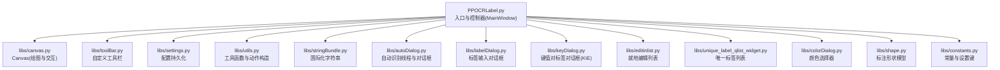
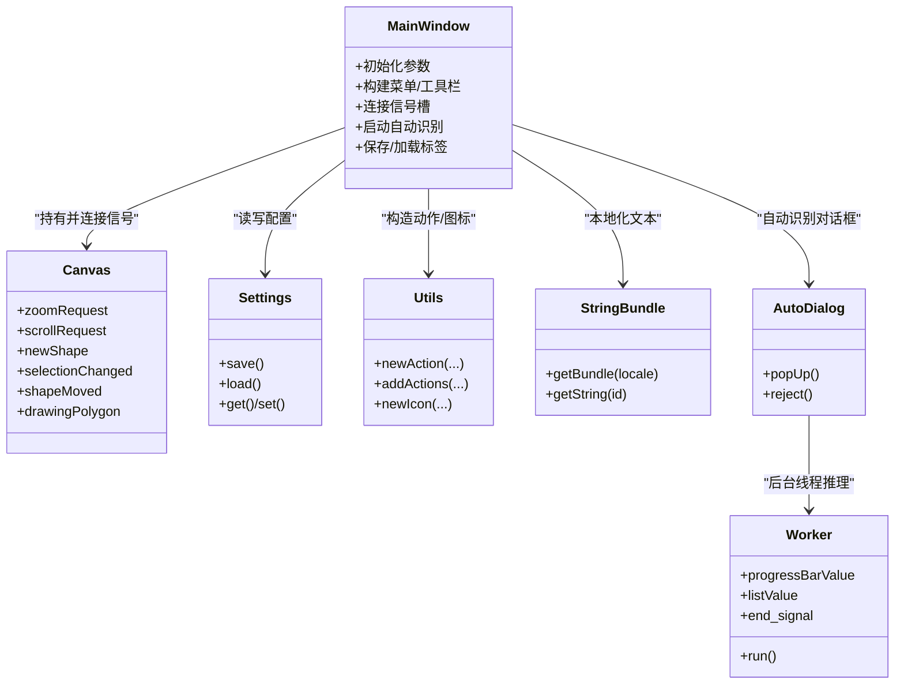
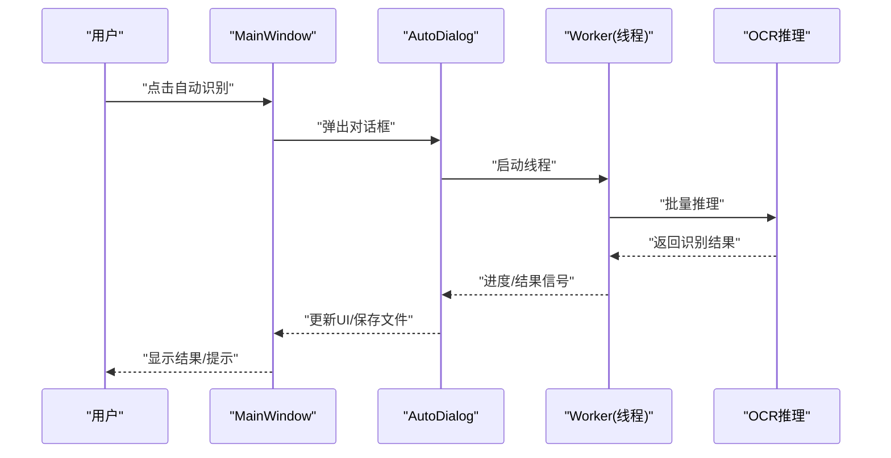
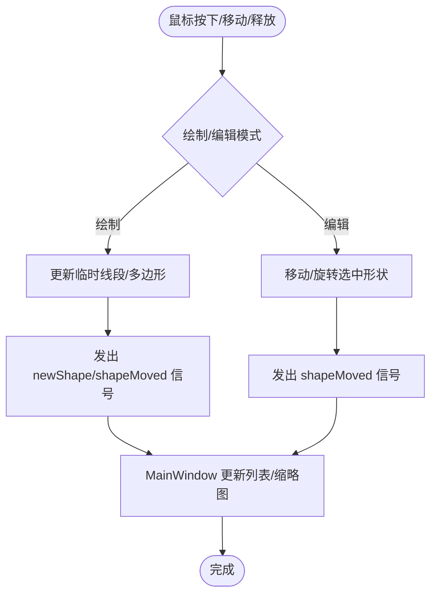
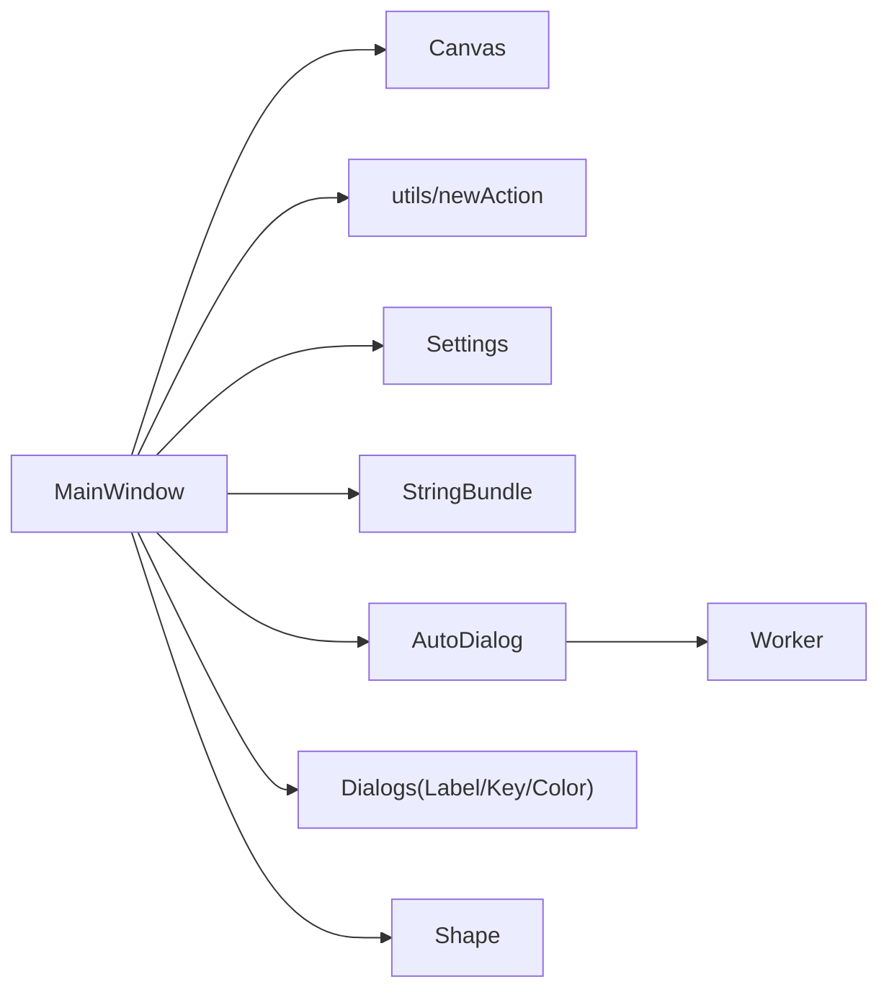

# 插件架构设计

<cite>
**本文引用的文件**
- [PPOCRLabel.py](file://PPOCRLabel.py)
- [libs/settings.py](file://libs/settings.py)
- [libs/toolBar.py](file://libs/toolBar.py)
- [libs/canvas.py](file://libs/canvas.py)
- [libs/utils.py](file://libs/utils.py)
- [libs/shape.py](file://libs/shape.py)
- [libs/constants.py](file://libs/constants.py)
- [libs/stringBundle.py](file://libs/stringBundle.py)
- [libs/autoDialog.py](file://libs/autoDialog.py)
- [libs/labelDialog.py](file://libs/labelDialog.py)
- [libs/editinlist.py](file://libs/editinlist.py)
- [libs/keyDialog.py](file://libs/keyDialog.py)
- [libs/unique_label_qlist_widget.py](file://libs/unique_label_qlist_widget.py)
- [libs/colorDialog.py](file://libs/colorDialog.py)
</cite>

## 目录
1. [引言](#引言)
2. [项目结构](#项目结构)
3. [核心组件](#核心组件)
4. [架构总览](#架构总览)
5. [详细组件分析](#详细组件分析)
6. [依赖分析](#依赖分析)
7. [性能考虑](#性能考虑)
8. [故障排查指南](#故障排查指南)
9. [结论](#结论)
10. [附录](#附录)

## 引言
本文件面向希望在 PPOCRLabel 中扩展新功能的开发者，系统化阐述其插件式扩展点与可插拔架构设计。重点围绕以下目标展开：
- 基于现有 MVC 架构（视图层由 MainWindow 及其子控件构成；业务逻辑集中在 MainWindow；Canvas 作为绘图与交互中枢）扩展新功能模块。
- 解释 MainWindow 作为控制器的核心扩展机制：如何添加工具栏按钮、菜单项与快捷键。
- 总结插件开发常用设计模式：工厂模式、观察者模式、策略模式的应用场景与落地方式。
- 说明信号槽机制如何实现组件间松耦合扩展，并给出可插拔 OCR 模型集成接口的设计建议。
- 提供插件生命周期管理、配置管理与错误处理的最佳实践。

## 项目结构
PPOCRLabel 采用 PyQt5 GUI + PaddleOCR 推理的桌面应用。核心入口为 MainWindow，负责组织菜单、工具栏、画布、列表面板等 UI 组件，并通过信号槽与 Canvas 等组件解耦协作。libs 子包提供通用工具、对话框、设置与资源管理等基础能力。

图表来源
- [PPOCRLabel.py](file://PPOCRLabel.py#L143-L300)
- [libs/canvas.py](file://libs/canvas.py#L32-L120)
- [libs/toolBar.py](file://libs/toolBar.py#L18-L48)
- [libs/settings.py](file://libs/settings.py#L21-L62)
- [libs/utils.py](file://libs/utils.py#L51-L83)
- [libs/stringBundle.py](file://libs/stringBundle.py#L29-L89)
- [libs/autoDialog.py](file://libs/autoDialog.py#L103-L196)
- [libs/labelDialog.py](file://libs/labelDialog.py#L30-L119)
- [libs/keyDialog.py](file://libs/keyDialog.py#L27-L209)
- [libs/editinlist.py](file://libs/editinlist.py#L7-L34)
- [libs/unique_label_qlist_widget.py](file://libs/unique_label_qlist_widget.py#L7-L49)
- [libs/colorDialog.py](file://libs/colorDialog.py#L17-L42)
- [libs/shape.py](file://libs/shape.py#L35-L120)
- [libs/constants.py](file://libs/constants.py#L13-L33)

章节来源
- [PPOCRLabel.py](file://PPOCRLabel.py#L143-L300)

## 核心组件
- MainWindow（控制器）
  - 负责组装 UI、管理状态、协调 OCR 推理与自动标注流程、维护设置与语言资源。
  - 关键职责：构建菜单/工具栏动作、连接信号槽、驱动 Canvas 与对话框、加载/保存标签。
- Canvas（视图/交互中枢）
  - 绘制 Shape、响应鼠标/键盘事件、发出缩放/滚动/选中/移动等信号。
  - 与 MainWindow 通过信号槽解耦，便于扩展新的交互行为。
- 工具与对话框（libs.*）
  - 动作构造、图标、国际化、颜色选择、自动识别线程、就地编辑列表、标签对话框等。
- 设置与常量（libs.settings、libs.constants）
  - 应用配置持久化与键值约定，支撑插件配置与生命周期管理。

章节来源
- [PPOCRLabel.py](file://PPOCRLabel.py#L143-L300)
- [libs/canvas.py](file://libs/canvas.py#L32-L120)
- [libs/settings.py](file://libs/settings.py#L21-L62)
- [libs/constants.py](file://libs/constants.py#L13-L33)

## 架构总览
PPOCRLabel 采用“控制器集中 + 视图解耦”的 MVC 变体：
- 控制器：MainWindow 负责装配 UI、绑定事件、协调业务流程。
- 视图：Canvas、列表、对话框等各自独立，通过信号槽与控制器通信。
- 数据：Shape 作为标注数据模型，贯穿交互与保存流程。

图表来源
- [PPOCRLabel.py](file://PPOCRLabel.py#L549-L800)
- [libs/canvas.py](file://libs/canvas.py#L32-L40)
- [libs/settings.py](file://libs/settings.py#L21-L62)
- [libs/utils.py](file://libs/utils.py#L51-L83)
- [libs/stringBundle.py](file://libs/stringBundle.py#L29-L89)
- [libs/autoDialog.py](file://libs/autoDialog.py#L103-L196)

## 详细组件分析

### MainWindow 控制器扩展点
- 添加工具栏按钮
  - 使用工具栏基类与按钮尺寸规范，确保统一风格与布局。
  - 参考路径：[libs/toolBar.py](file://libs/toolBar.py#L18-L48)
- 添加菜单项与快捷键
  - 使用动作构造函数统一创建 QAction，支持图标、提示、快捷键与触发回调。
  - 参考路径：[libs/utils.py](file://libs/utils.py#L51-L83)
  - 示例动作创建与快捷键绑定：[PPOCRLabel.py](file://PPOCRLabel.py#L549-L800)
- 连接信号槽
  - Canvas 的 zoomRequest、scrollRequest、newShape、selectionChanged、shapeMoved 等信号用于驱动 UI 更新与状态同步。
  - 参考路径：[libs/canvas.py](file://libs/canvas.py#L32-L40)
  - 典型连接示例：[PPOCRLabel.py](file://PPOCRLabel.py#L515-L541)
- 启动自动识别流程
  - 通过 AutoDialog 与 Worker 线程实现后台推理与进度反馈。
  - 参考路径：[libs/autoDialog.py](file://libs/autoDialog.py#L103-L196)

图表来源
- [libs/autoDialog.py](file://libs/autoDialog.py#L103-L196)
- [PPOCRLabel.py](file://PPOCRLabel.py#L549-L800)

章节来源
- [libs/toolBar.py](file://libs/toolBar.py#L18-L48)
- [libs/utils.py](file://libs/utils.py#L51-L83)
- [libs/autoDialog.py](file://libs/autoDialog.py#L103-L196)
- [PPOCRLabel.py](file://PPOCRLabel.py#L515-L800)

### Canvas 交互与信号槽
- 信号定义
  - 缩放请求、滚动请求、新形状、选择变化、形状移动、绘制多边形状态等。
- 事件处理
  - 鼠标/键盘事件驱动绘制、移动、旋转与高亮，最终通过信号通知控制器更新 UI。
- 与控制器的耦合
  - 通过信号槽与 MainWindow 解耦，便于扩展新的交互策略（如手势识别、多模态标注）。

图表来源
- [libs/canvas.py](file://libs/canvas.py#L129-L326)
- [libs/canvas.py](file://libs/canvas.py#L326-L800)

章节来源
- [libs/canvas.py](file://libs/canvas.py#L32-L120)
- [libs/canvas.py](file://libs/canvas.py#L129-L326)
- [libs/canvas.py](file://libs/canvas.py#L326-L800)

### OCR 模型集成接口设计
- 当前集成
  - MainWindow 初始化多个 OCR 组件（整体识别、检测、识别、表格结构识别），并通过参数控制设备与模型名称。
  - 参考路径：[PPOCRLabel.py](file://PPOCRLabel.py#L194-L233)
- 可插拔接口建议
  - 抽象出统一的 OCR 推理接口（如 predict_batch、predict_single），以策略模式按需切换不同实现（PaddleOCR、第三方 SDK、离线引擎）。
  - 在 Settings 中新增模型配置键，支持动态切换与热更新。
  - 对自动识别流程（AutoDialog/Worker）进行抽象，允许注入不同的 OCR 实现与后处理策略。

章节来源
- [PPOCRLabel.py](file://PPOCRLabel.py#L194-L233)
- [libs/autoDialog.py](file://libs/autoDialog.py#L22-L101)
- [libs/settings.py](file://libs/settings.py#L21-L62)
- [libs/constants.py](file://libs/constants.py#L13-L33)

### 设计模式应用
- 工厂模式
  - 动作工厂：通过统一的 newAction/newButton 构造 UI 元素，保证一致的图标、快捷键与提示文案。
  - 国际化工厂：StringBundle 提供多语言字符串加载与回退链。
  - 参考路径：[libs/utils.py](file://libs/utils.py#L51-L83)、[libs/stringBundle.py](file://libs/stringBundle.py#L29-L89)
- 观察者模式
  - Canvas 通过信号（pyqtSignal）向 MainWindow 发布状态变化，实现跨组件的松耦合通知。
  - 参考路径：[libs/canvas.py](file://libs/canvas.py#L32-L40)
- 策略模式
  - 将 OCR 推理封装为可替换策略，配合配置键与工厂方法实现动态切换。
  - 参考路径：[PPOCRLabel.py](file://PPOCRLabel.py#L194-L233)、[libs/autoDialog.py](file://libs/autoDialog.py#L22-L101)

章节来源
- [libs/utils.py](file://libs/utils.py#L51-L83)
- [libs/stringBundle.py](file://libs/stringBundle.py#L29-L89)
- [libs/canvas.py](file://libs/canvas.py#L32-L40)
- [PPOCRLabel.py](file://PPOCRLabel.py#L194-L233)
- [libs/autoDialog.py](file://libs/autoDialog.py#L22-L101)

### 插件生命周期与配置管理
- 生命周期
  - 初始化：加载设置、语言包、OCR 模型实例。
  - 运行期：监听 Canvas 信号，更新 UI 与数据结构。
  - 退出：保存设置与未保存的标签。
- 配置管理
  - 使用 Settings 类持久化键值对配置，结合 constants 中的键名常量，避免魔法字符串。
  - 参考路径：[libs/settings.py](file://libs/settings.py#L21-L62)、[libs/constants.py](file://libs/constants.py#L13-L33)
- 错误处理
  - 对线程异常、IO 失败、模型加载失败等情况记录日志并提示用户。
  - 参考路径：[libs/autoDialog.py](file://libs/autoDialog.py#L96-L101)

章节来源
- [libs/settings.py](file://libs/settings.py#L21-L62)
- [libs/constants.py](file://libs/constants.py#L13-L33)
- [libs/autoDialog.py](file://libs/autoDialog.py#L96-L101)

## 依赖分析
- 组件内聚与耦合
  - MainWindow 与 Canvas 通过信号槽耦合，保持 UI 与业务逻辑分离。
  - libs.* 提供高内聚的通用能力，降低 MainWindow 的复杂度。
- 外部依赖
  - PyQt5 用于 GUI；PaddleOCR 用于推理；OpenCV/numpy 用于图像处理。
- 循环依赖
  - 代码结构清晰，未见循环导入迹象；若新增插件模块，应避免相互 import。

图表来源
- [PPOCRLabel.py](file://PPOCRLabel.py#L549-L800)
- [libs/canvas.py](file://libs/canvas.py#L32-L120)
- [libs/utils.py](file://libs/utils.py#L51-L83)
- [libs/settings.py](file://libs/settings.py#L21-L62)
- [libs/stringBundle.py](file://libs/stringBundle.py#L29-L89)
- [libs/autoDialog.py](file://libs/autoDialog.py#L103-L196)
- [libs/labelDialog.py](file://libs/labelDialog.py#L30-L119)
- [libs/keyDialog.py](file://libs/keyDialog.py#L27-L209)
- [libs/colorDialog.py](file://libs/colorDialog.py#L17-L42)
- [libs/shape.py](file://libs/shape.py#L35-L120)

章节来源
- [PPOCRLabel.py](file://PPOCRLabel.py#L549-L800)
- [libs/canvas.py](file://libs/canvas.py#L32-L120)
- [libs/utils.py](file://libs/utils.py#L51-L83)
- [libs/autoDialog.py](file://libs/autoDialog.py#L103-L196)

## 性能考虑
- 图像处理与推理
  - 合理设置设备（CPU/GPU）与模型大小，避免过小图像导致无效识别。
  - 自动识别时批量处理与进度反馈，减少主线程阻塞。
- UI 响应
  - Canvas 绘制与更新尽量轻量化，避免频繁重绘。
  - 列表与缩略图滚动与同步使用信号槽，避免不必要的刷新。
- 线程与并发
  - 使用 QThread 与信号槽进行后台推理，主线程仅负责 UI 与状态同步。

[本节为通用指导，无需列出具体文件来源]

## 故障排查指南
- 自动识别无输出
  - 检查图像尺寸是否过小；确认 OCR 模型已正确初始化；查看线程异常日志。
  - 参考路径：[libs/autoDialog.py](file://libs/autoDialog.py#L38-L101)
- 快捷键无效
  - 确认动作已正确注册到菜单/工具栏；检查快捷键冲突。
  - 参考路径：[libs/utils.py](file://libs/utils.py#L51-L83)、[PPOCRLabel.py](file://PPOCRLabel.py#L549-L800)
- 颜色/字体显示异常
  - 检查颜色选择器默认值与主题设置；确认字体大小随图像缩放自适应。
  - 参考路径：[libs/colorDialog.py](file://libs/colorDialog.py#L17-L42)、[libs/canvas.py](file://libs/canvas.py#L654-L661)
- 配置丢失或加载失败
  - 查看设置文件路径与权限；必要时重置设置。
  - 参考路径：[libs/settings.py](file://libs/settings.py#L21-L62)

章节来源
- [libs/autoDialog.py](file://libs/autoDialog.py#L38-L101)
- [libs/utils.py](file://libs/utils.py#L51-L83)
- [libs/colorDialog.py](file://libs/colorDialog.py#L17-L42)
- [libs/canvas.py](file://libs/canvas.py#L654-L661)
- [libs/settings.py](file://libs/settings.py#L21-L62)

## 结论
PPOCRLabel 的插件式扩展以 MainWindow 为中心控制器，借助 Canvas 的信号槽机制与 libs.* 的通用能力，实现了良好的模块化与可扩展性。通过工厂模式统一动作与资源、观察者模式实现松耦合通信、策略模式抽象 OCR 推理，开发者可在不破坏核心架构的前提下快速集成新功能与新模型。建议在新增插件时遵循配置键命名规范、线程安全与错误处理最佳实践，确保系统的稳定性与可维护性。

[本节为总结，无需列出具体文件来源]

## 附录
- 新增工具栏按钮步骤
  - 使用工具栏基类与按钮尺寸规范：[libs/toolBar.py](file://libs/toolBar.py#L18-L48)
  - 创建动作并绑定回调：[libs/utils.py](file://libs/utils.py#L51-L83)、[PPOCRLabel.py](file://PPOCRLabel.py#L549-L800)
- 新增菜单项与快捷键步骤
  - 通过 newAction 构造动作，设置图标、提示与快捷键：[libs/utils.py](file://libs/utils.py#L51-L83)
  - 将动作加入菜单/工具栏：[PPOCRLabel.py](file://PPOCRLabel.py#L549-L800)
- 新增 OCR 模型接入步骤
  - 定义统一推理接口与配置键：[libs/constants.py](file://libs/constants.py#L13-L33)
  - 在 MainWindow 初始化并注入策略：[PPOCRLabel.py](file://PPOCRLabel.py#L194-L233)
  - 后台线程执行推理与进度反馈：[libs/autoDialog.py](file://libs/autoDialog.py#L22-L101)

章节来源
- [libs/toolBar.py](file://libs/toolBar.py#L18-L48)
- [libs/utils.py](file://libs/utils.py#L51-L83)
- [libs/constants.py](file://libs/constants.py#L13-L33)
- [PPOCRLabel.py](file://PPOCRLabel.py#L194-L233)
- [libs/autoDialog.py](file://libs/autoDialog.py#L22-L101)