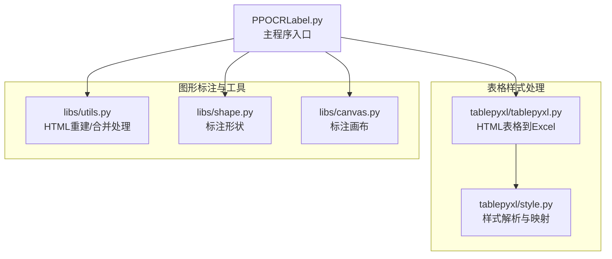
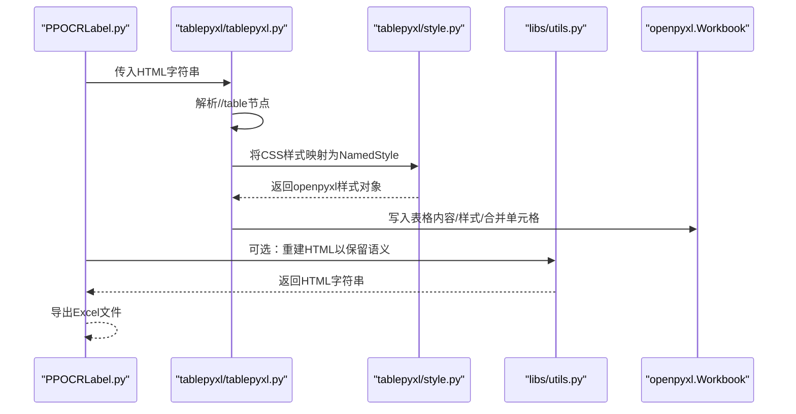
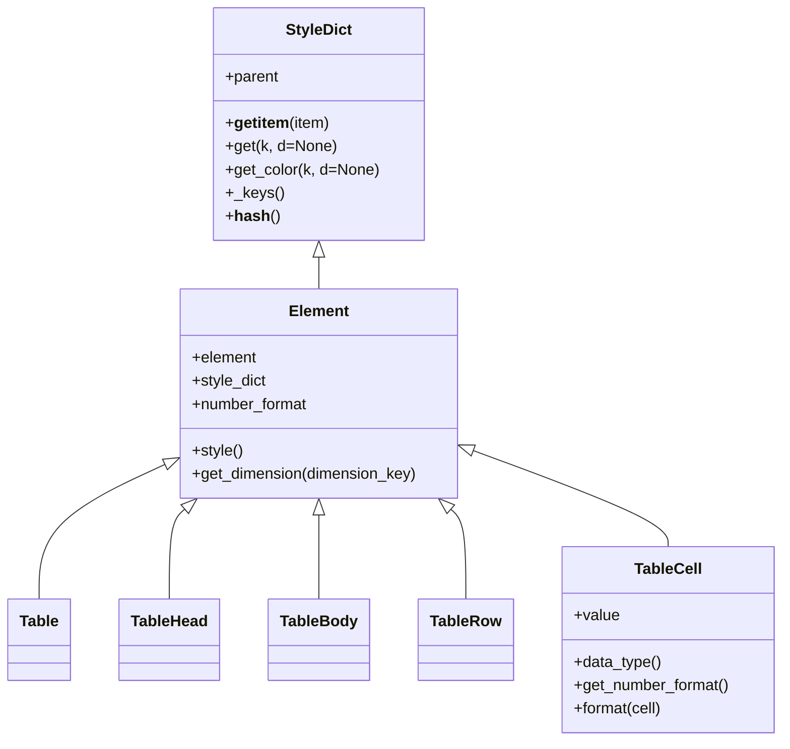
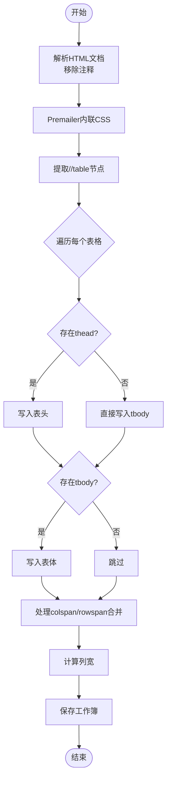
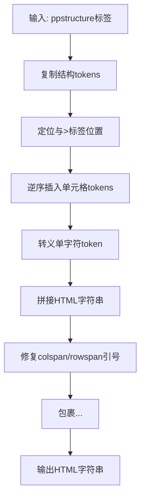
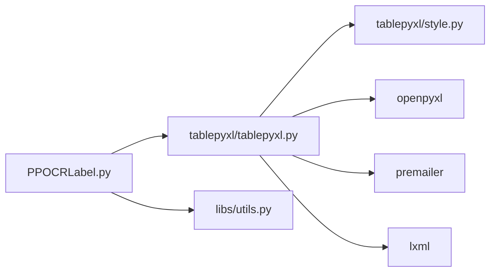

# 表格样式处理

<cite>
**本文引用的文件列表**
- [tablepyxl/style.py](file://tablepyxl/style.py)
- [tablepyxl/tablepyxl.py](file://tablepyxl/tablepyxl.py)
- [libs/utils.py](file://libs/utils.py)
- [libs/shape.py](file://libs/shape.py)
- [libs/canvas.py](file://libs/canvas.py)
- [PPOCRLabel.py](file://PPOCRLabel.py)
</cite>

## 目录
1. [简介](#简介)
2. [项目结构](#项目结构)
3. [核心组件](#核心组件)
4. [架构总览](#架构总览)
5. [详细组件分析](#详细组件分析)
6. [依赖关系分析](#依赖关系分析)
7. [性能考量](#性能考量)
8. [故障排查指南](#故障排查指南)
9. [结论](#结论)
10. [附录](#附录)

## 简介
本文件面向需要在PaddleOCR应用中实现表格样式处理的开发者，系统性阐述表格结构识别与样式处理的实现机制，涵盖：
- 单元格边界检测与行列合并处理
- 样式信息提取与CSS到Excel样式的映射
- 如何扩展支持新的表格样式（边框、背景色、字体格式、对齐方式）
- 自定义表格样式的开发指南（样式解析、渲染引擎集成、输出格式转换）
- 表格数据结构的标准化处理（坐标转换、层级关系维护、语义信息保留）
- 表格识别精度优化、样式恢复与批量处理的实现方案

## 项目结构
该应用围绕“表格样式处理”模块（tablepyxl）与“图形标注界面”（libs）协同工作：
- tablepyxl：负责HTML表格解析、CSS样式解析与openpyxl样式映射、单元格合并与列宽计算、Excel写入
- libs：提供图形标注能力（Shape、Canvas）、工具函数（HTML重建、合并单元格处理等）
- PPOCRLabel：主程序入口，集成OCR与表格识别结果，调用tablepyxl将HTML表格导出为Excel

图表来源
- [tablepyxl/style.py](file://tablepyxl/style.py#L1-L350)
- [tablepyxl/tablepyxl.py](file://tablepyxl/tablepyxl.py#L1-L136)
- [libs/utils.py](file://libs/utils.py#L1-L413)
- [libs/shape.py](file://libs/shape.py#L1-L285)
- [libs/canvas.py](file://libs/canvas.py#L1-L200)
- [PPOCRLabel.py](file://PPOCRLabel.py#L1-L200)

章节来源
- [tablepyxl/style.py](file://tablepyxl/style.py#L1-L350)
- [tablepyxl/tablepyxl.py](file://tablepyxl/tablepyxl.py#L1-L136)
- [libs/utils.py](file://libs/utils.py#L1-L413)
- [libs/shape.py](file://libs/shape.py#L1-L285)
- [libs/canvas.py](file://libs/canvas.py#L1-L200)
- [PPOCRLabel.py](file://PPOCRLabel.py#L1-L200)

## 核心组件
- 样式解析与映射（style.py）
  - 将CSS字符串解析为字典，支持级联样式（父元素继承）
  - 将CSS映射为openpyxl的Font/Alignment/Fill/Border/NamedStyle
  - 支持颜色规范化、尺寸单位解析、数字格式推断
- HTML表格到Excel（tablepyxl.py）
  - 解析HTML文档中的表格，内联CSS样式
  - 写入Excel工作簿，处理合并单元格、列宽、数据类型
- HTML重建与合并处理（libs/utils.py）
  - 从ppstructure标签重建HTML表格
  - 处理合并单元格占位与colspan/rowspan属性生成
- 图形标注与交互（libs/shape.py、libs/canvas.py）
  - 提供标注形状与画布交互，支撑表格区域标注与坐标管理
- 主程序集成（PPOCRLabel.py）
  - 调用OCR/表格识别，将HTML表格导出为Excel

章节来源
- [tablepyxl/style.py](file://tablepyxl/style.py#L36-L126)
- [tablepyxl/tablepyxl.py](file://tablepyxl/tablepyxl.py#L15-L136)
- [libs/utils.py](file://libs/utils.py#L208-L271)
- [libs/shape.py](file://libs/shape.py#L35-L285)
- [libs/canvas.py](file://libs/canvas.py#L32-L200)
- [PPOCRLabel.py](file://PPOCRLabel.py#L1-L200)

## 架构总览
整体流程：主程序接收表格识别结果（HTML），通过tablepyxl将其解析为表格对象树，再映射为openpyxl样式并写入Excel；同时，libs提供HTML重建与合并处理能力，确保语义信息与布局一致。

图表来源
- [tablepyxl/tablepyxl.py](file://tablepyxl/tablepyxl.py#L15-L136)
- [tablepyxl/style.py](file://tablepyxl/style.py#L58-L126)
- [libs/utils.py](file://libs/utils.py#L256-L271)

章节来源
- [tablepyxl/tablepyxl.py](file://tablepyxl/tablepyxl.py#L87-L136)
- [tablepyxl/style.py](file://tablepyxl/style.py#L58-L126)
- [libs/utils.py](file://libs/utils.py#L256-L271)

## 详细组件分析

### 组件A：样式解析与映射（style.py）
- 核心职责
  - CSS字符串解析为字典
  - 级联样式（StyleDict）支持父子继承
  - 映射为openpyxl样式：Font、Alignment、PatternFill、Border、NamedStyle
  - 数字格式推断（货币、整数、百分比、日期、数值）
  - 颜色规范化（去除#、兼容3位简写）
- 关键类与方法
  - style_string_to_dict：解析CSS字符串
  - get_side/get_side：提取边框样式与颜色
  - style_dict_to_named_style：构建NamedStyle
  - StyleDict：支持父级样式查找
  - Element/Table/TableRow/TableCell：HTML表格树结构
  - TableCell.data_type/get_number_format/format：数据类型与格式设置
- 数据流与复杂度
  - CSS解析线性时间O(n)，样式映射O(1)缓存命中
  - 元素树遍历按节点数线性增长
- 错误处理与边界
  - 缺失openpyxl时发出警告
  - 颜色值缺失或非法时回退默认值
  - 数字格式推断失败时回退通用格式

图表来源
- [tablepyxl/style.py](file://tablepyxl/style.py#L128-L218)
- [tablepyxl/style.py](file://tablepyxl/style.py#L220-L350)

章节来源
- [tablepyxl/style.py](file://tablepyxl/style.py#L36-L126)
- [tablepyxl/style.py](file://tablepyxl/style.py#L128-L218)
- [tablepyxl/style.py](file://tablepyxl/style.py#L220-L350)

### 组件B：HTML表格到Excel（tablepyxl.py）
- 核心职责
  - 解析HTML文档，移除注释，提取//table节点
  - 使用Premailer内联CSS
  - 将表格对象树写入Excel工作簿，处理合并单元格、列宽、数据类型
- 关键流程
  - document_to_workbook：内联CSS、解析表格、创建工作簿
  - write_rows：逐行写入单元格，处理colspan/rowspan合并
  - table_to_sheet/insert_table：组织表头与表体
- 合并单元格与列宽策略
  - 合并：根据rowspan/colspan调用openpyxl合并接口
  - 列宽：基于单元格内容长度与min/max宽度约束动态设置

图表来源
- [tablepyxl/tablepyxl.py](file://tablepyxl/tablepyxl.py#L15-L136)

章节来源
- [tablepyxl/tablepyxl.py](file://tablepyxl/tablepyxl.py#L15-L136)

### 组件C：HTML重建与合并处理（libs/utils.py）
- 核心职责
  - rebuild_html_from_ppstructure_label：从ppstructure标签重建HTML表格，插入单元格文本
  - expand_list/convert_token：处理合并单元格占位与colspan/rowspan属性生成
- 作用
  - 保证导出HTML与标注数据一致
  - 便于后续通过tablepyxl进行Excel导出

图表来源
- [libs/utils.py](file://libs/utils.py#L256-L271)

章节来源
- [libs/utils.py](file://libs/utils.py#L208-L271)

### 组件D：图形标注与交互（libs/shape.py、libs/canvas.py）
- 核心职责
  - Shape：多边形标注形状，支持旋转、缩放、高亮、绘制
  - Canvas：标注画布，鼠标事件处理、多选、拖拽、绘制模式切换
- 与表格样式处理的关系
  - 用于表格区域标注与坐标管理，为后续HTML重建与导出提供几何基础

章节来源
- [libs/shape.py](file://libs/shape.py#L35-L285)
- [libs/canvas.py](file://libs/canvas.py#L32-L200)

### 组件E：主程序集成（PPOCRLabel.py）
- 核心职责
  - 调用OCR/表格识别，生成HTML表格
  - 调用tablepyxl.document_to_xl将HTML导出为Excel
  - 记录错误日志，避免导出失败影响主流程

章节来源
- [PPOCRLabel.py](file://PPOCRLabel.py#L3139-L3176)

## 依赖关系分析
- 模块耦合
  - tablepyxl依赖openpyxl、premailer、lxml
  - libs/utils与HTML重建逻辑强相关
  - PPOCRLabel作为门面，协调识别结果与导出
- 外部依赖
  - openpyxl：Excel读写与样式应用
  - premailer：CSS内联
  - lxml：HTML解析
- 潜在循环依赖
  - 当前无直接循环依赖，但需注意style.py与tablepyxl.py的相互引用

图表来源
- [tablepyxl/tablepyxl.py](file://tablepyxl/tablepyxl.py#L6-L96)
- [tablepyxl/style.py](file://tablepyxl/style.py#L4-L23)
- [PPOCRLabel.py](file://PPOCRLabel.py#L3139-L3176)

章节来源
- [tablepyxl/tablepyxl.py](file://tablepyxl/tablepyxl.py#L6-L96)
- [tablepyxl/style.py](file://tablepyxl/style.py#L4-L23)
- [PPOCRLabel.py](file://PPOCRLabel.py#L3139-L3176)

## 性能考量
- 样式映射缓存
  - known_styles缓存已生成的NamedStyle，避免重复创建，提升写入性能
- 列宽计算
  - 基于内容长度与min/max约束动态计算，避免过度重绘
- 合并单元格
  - 仅在rowspan/colspan>1时执行合并，减少无效操作
- CSS内联
  - 使用premailer一次性内联，避免多次解析

章节来源
- [tablepyxl/style.py](file://tablepyxl/style.py#L58-L126)
- [tablepyxl/tablepyxl.py](file://tablepyxl/tablepyxl.py#L26-L75)

## 故障排查指南
- 缺少openpyxl或premailer
  - 现象：导出失败或样式丢失
  - 处理：安装对应依赖，或检查异常捕获与日志
- CSS颜色格式问题
  - 现象：颜色显示异常
  - 处理：确保颜色值以#开头且为6位（3位会被规范化）
- 合并单元格冲突
  - 现象：单元格覆盖或列宽异常
  - 处理：检查colspan/rowspan是否正确，确保写入顺序与合并范围一致
- HTML重建不一致
  - 现象：导出表格与标注不一致
  - 处理：核对expand_list/convert_token逻辑，确保占位与属性生成正确

章节来源
- [tablepyxl/style.py](file://tablepyxl/style.py#L18-L23)
- [libs/utils.py](file://libs/utils.py#L208-L271)
- [tablepyxl/tablepyxl.py](file://tablepyxl/tablepyxl.py#L26-L75)

## 结论
本项目通过“HTML表格解析 + CSS样式映射 + openpyxl写入”的架构，实现了表格样式处理的端到端流程。核心优势在于：
- 样式解析与缓存机制保证了高性能
- 合并单元格与列宽策略提升了布局准确性
- HTML重建与合并处理保障了语义一致性
建议在实际工程中结合业务场景扩展更多CSS属性与数字格式，持续优化识别与导出的稳定性与一致性。

## 附录

### 扩展新表格样式的开发指南
- 新增CSS属性支持
  - 在style_string_to_dict解析处增加新属性键名
  - 在style_dict_to_named_style中映射到openpyxl对应属性
  - 若涉及颜色，使用get_color统一规范化
- 新增数字格式
  - 在TableCell.get_number_format中添加条件分支
  - 使用openpyxl内置格式常量或自定义格式字符串
- 新增对齐/边框/填充类型
  - 对齐：Alignment.horizontal/vertical/wrap_text
  - 边框：Border.left/right/top/bottom/diagonal/outline
  - 填充：PatternFill.fill_type/start_color/end_color
- 渲染引擎集成
  - 保持Element/TableCell结构不变，仅扩展映射逻辑
  - 确保format方法在写入前被调用
- 输出格式转换
  - 保持Excel写入流程不变，新增格式映射即可

章节来源
- [tablepyxl/style.py](file://tablepyxl/style.py#L36-L126)
- [tablepyxl/style.py](file://tablepyxl/style.py#L328-L350)

### 表格数据结构标准化处理
- 坐标转换
  - 使用Canvas/Shape提供的几何工具进行旋转、平移与边界计算
- 层级关系维护
  - 通过Element/StyleDict的父子关系实现样式级联
- 语义信息保留
  - 使用libs/utils的HTML重建函数，确保colspan/rowspan与单元格文本一致

章节来源
- [libs/shape.py](file://libs/shape.py#L91-L140)
- [libs/utils.py](file://libs/utils.py#L256-L271)

### 表格识别精度优化与批量处理
- 识别精度优化
  - 在主程序中对表格区域进行预处理（如旋转矫正、裁剪）
  - 使用更合适的OCR模型参数，提升表格文本识别准确率
- 样式恢复
  - 在导出前对HTML进行预处理（如清理注释、内联CSS），确保样式完整
- 批量处理
  - 将多个HTML表格合并到同一工作簿的不同工作表
  - 使用document_to_workbook统一处理，减少重复初始化

章节来源
- [PPOCRLabel.py](file://PPOCRLabel.py#L3139-L3176)
- [tablepyxl/tablepyxl.py](file://tablepyxl/tablepyxl.py#L87-L136)