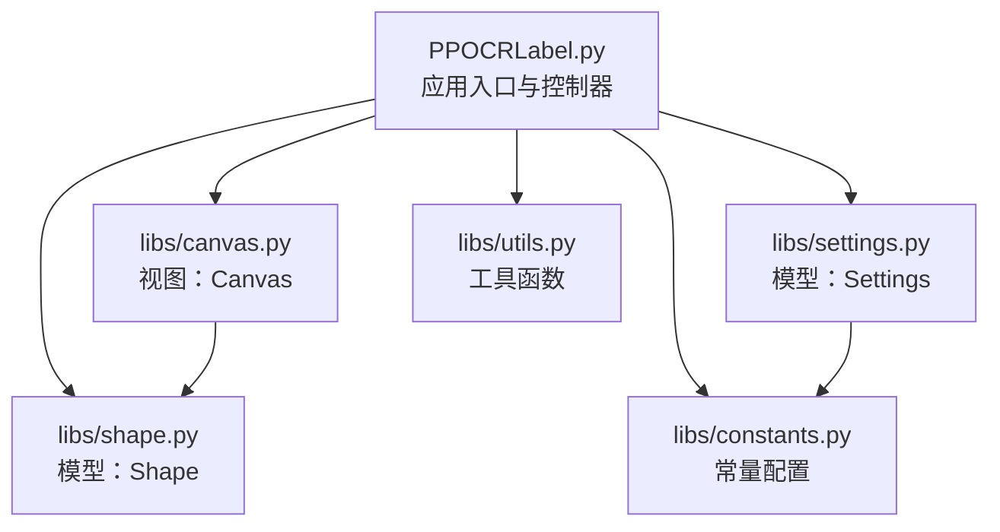
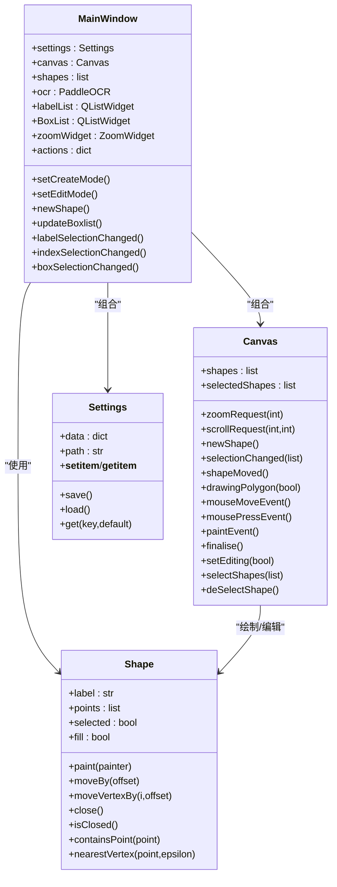
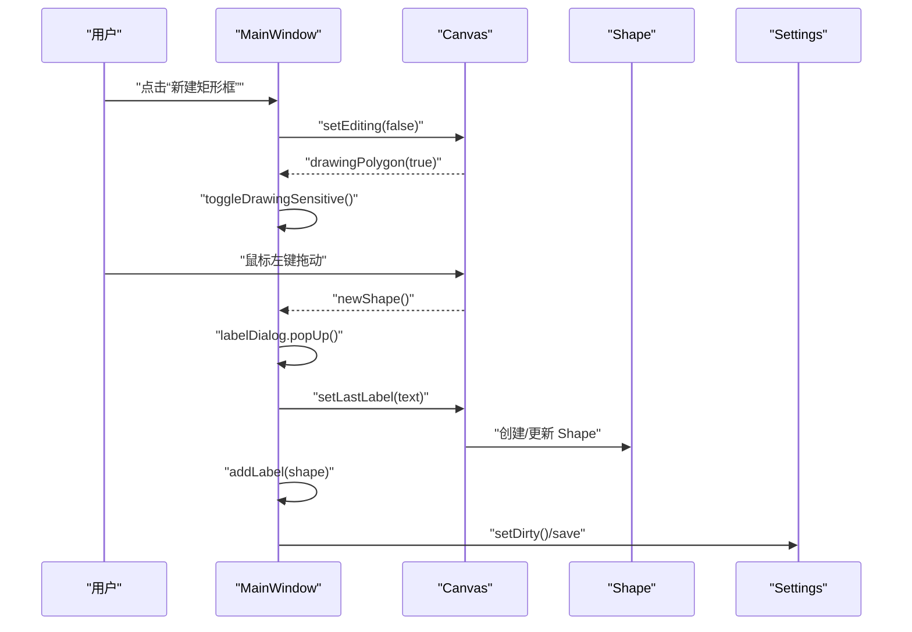
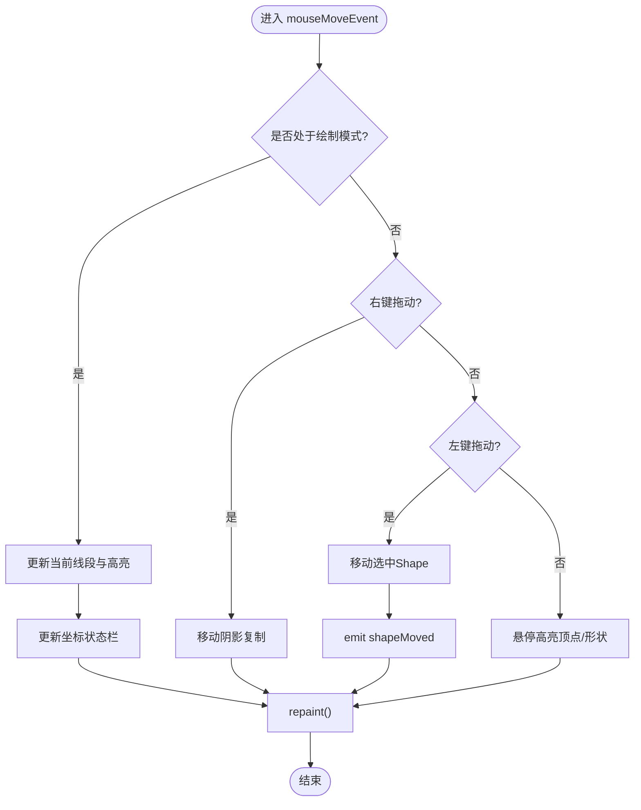
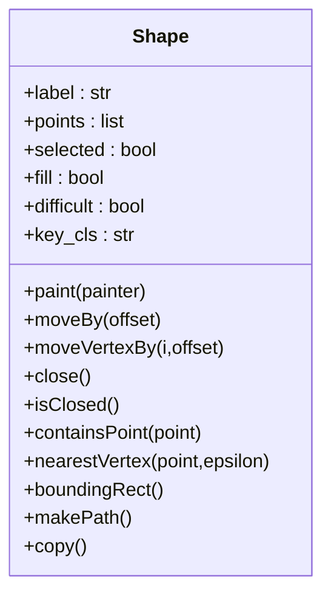
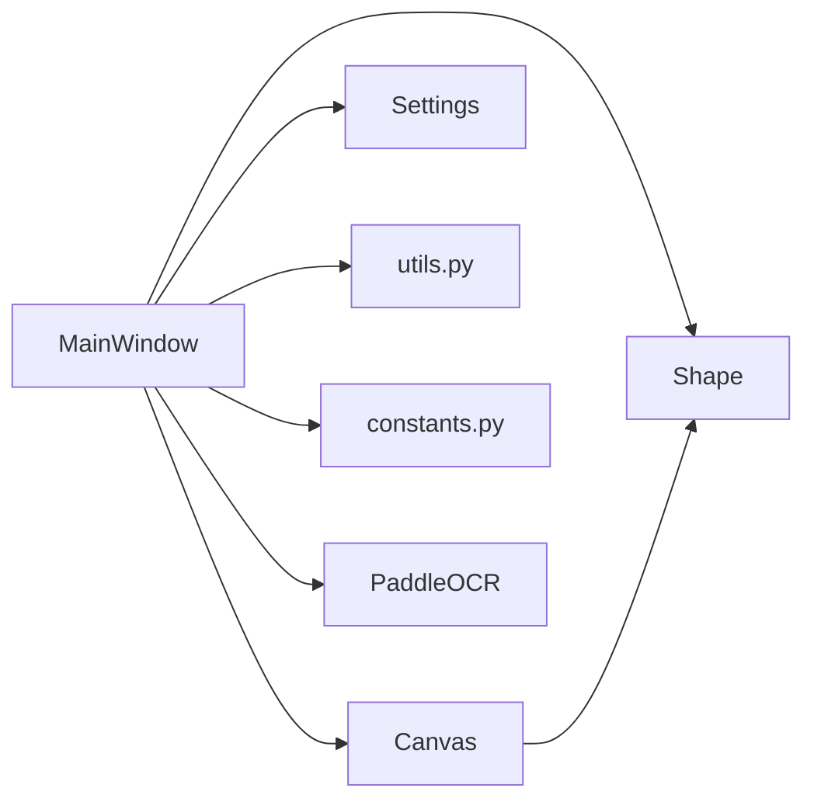

# 核心架构设计

<cite>
**本文引用的文件**
- [PPOCRLabel.py](file://PPOCRLabel.py)
- [libs/canvas.py](file://libs/canvas.py)
- [libs/shape.py](file://libs/shape.py)
- [libs/settings.py](file://libs/settings.py)
- [libs/constants.py](file://libs/constants.py)
- [libs/utils.py](file://libs/utils.py)
- [libs/__init__.py](file://libs/__init__.py)
- [README.md](file://README.md)
</cite>

## 目录
1. [引言](#引言)
2. [项目结构](#项目结构)
3. [核心组件](#核心组件)
4. [架构总览](#架构总览)
5. [详细组件分析](#详细组件分析)
6. [依赖关系分析](#依赖关系分析)
7. [性能考虑](#性能考虑)
8. [故障排查指南](#故障排查指南)
9. [结论](#结论)
10. [附录](#附录)

## 引言
本文件面向 PPOCRLabel 的核心架构设计，系统化阐述其 MVC（模型-视图-控制器）架构模式与信号槽机制在 PyQt5 环境中的实现方式。重点说明 MainWindow 作为控制器、Canvas 作为视图、Shape 与 Settings 作为模型的设计理念；梳理组件间交互关系与数据流；总结扩展点与插件机制；并给出架构一致性维护策略与技术权衡。

## 项目结构
PPOCRLabel 采用模块化组织，入口脚本负责应用生命周期与界面布局，核心逻辑分布在 libs 子包中：
- 应用入口与控制器：PPOCRLabel.py
- 视图层：libs/canvas.py
- 模型层：libs/shape.py、libs/settings.py、libs/constants.py
- 工具与资源：libs/utils.py、libs/__init__.py、libs/resources.py（由资源编译生成）
- 文档与国际化：README.md、resources/strings/

**图表来源**
- [PPOCRLabel.py](file://PPOCRLabel.py#L514-L542)
- [libs/canvas.py](file://libs/canvas.py#L32-L90)
- [libs/shape.py](file://libs/shape.py#L35-L90)
- [libs/settings.py](file://libs/settings.py#L21-L62)
- [libs/constants.py](file://libs/constants.py#L13-L33)
- [libs/utils.py](file://libs/utils.py#L33-L82)

**章节来源**
- [PPOCRLabel.py](file://PPOCRLabel.py#L514-L542)
- [libs/canvas.py](file://libs/canvas.py#L32-L90)
- [libs/shape.py](file://libs/shape.py#L35-L90)
- [libs/settings.py](file://libs/settings.py#L21-L62)
- [libs/constants.py](file://libs/constants.py#L13-L33)
- [libs/utils.py](file://libs/utils.py#L33-L82)

## 核心组件
- 控制器（Controller）：MainWindow
  - 职责：窗口管理、菜单与动作、状态切换、事件分发、与模型/视图协调、调用 OCR 模型进行自动识别与重识别。
  - 关键点：通过信号槽与 Canvas 交互；通过 Settings 保存/加载用户偏好；通过 Shape 维护标注几何数据。
- 视图（View）：Canvas
  - 职责：图像绘制、鼠标与键盘事件处理、形状高亮与选择、滚动缩放、绘制临时线与阴影复制。
  - 关键点：定义并发出多种信号（zoomRequest、scrollRequest、newShape、selectionChanged、shapeMoved、drawingPolygon），供控制器响应。
- 模型（Model）：
  - Shape：几何数据结构（顶点、闭合状态、标签、颜色、字体大小等），提供绘制与变换方法。
  - Settings：本地设置持久化（pickle），键值对存储窗口尺寸、颜色、语言等。
  - Constants：全局常量（如设置键名、格式标识）。

**章节来源**
- [PPOCRLabel.py](file://PPOCRLabel.py#L143-L275)
- [libs/canvas.py](file://libs/canvas.py#L32-L90)
- [libs/shape.py](file://libs/shape.py#L35-L90)
- [libs/settings.py](file://libs/settings.py#L21-L62)
- [libs/constants.py](file://libs/constants.py#L13-L33)

## 架构总览
PPOCRLabel 采用经典的 MVC 架构：
- 控制器（MainWindow）持有模型（Settings、Shape 列表）与视图（Canvas），并协调二者。
- 视图（Canvas）仅负责渲染与输入事件，不直接访问模型数据，通过信号向外暴露状态变化。
- 模型（Shape、Settings）封装数据与业务规则，提供查询与更新接口。

**图表来源**
- [PPOCRLabel.py](file://PPOCRLabel.py#L143-L275)
- [libs/canvas.py](file://libs/canvas.py#L32-L90)
- [libs/shape.py](file://libs/shape.py#L35-L90)
- [libs/settings.py](file://libs/settings.py#L21-L62)

## 详细组件分析

### 控制器：MainWindow（应用控制器）
- 窗口与布局管理：创建主窗口、停靠面板、滚动区域、工具栏按钮与菜单项。
- 信号槽绑定：将 Canvas 的 zoomRequest、scrollRequest、newShape、selectionChanged、shapeMoved、drawingPolygon 等信号连接到对应处理函数。
- 状态与行为控制：切换创建/编辑模式、启用禁用动作、同步列表与画布选择、拖拽排序、自动识别与重识别。
- 数据持久化：通过 Settings 读写用户偏好；通过 Shape 列表与导出流程生成标注文件。
- OCR 集成：初始化 PaddleOCR、TextDetection、TextRecognition、PPStructureV3，并在需要时触发自动识别或表格识别。

**图表来源**
- [PPOCRLabel.py](file://PPOCRLabel.py#L514-L542)
- [libs/canvas.py](file://libs/canvas.py#L254-L325)
- [libs/shape.py](file://libs/shape.py#L261-L275)
- [libs/settings.py](file://libs/settings.py#L39-L44)

**章节来源**
- [PPOCRLabel.py](file://PPOCRLabel.py#L514-L542)
- [PPOCRLabel.py](file://PPOCRLabel.py#L1460-L1472)
- [PPOCRLabel.py](file://PPOCRLabel.py#L1946-L1998)
- [PPOCRLabel.py](file://PPOCRLabel.py#L1200-L1256)

### 视图：Canvas（图形绘制与交互）
- 渲染与绘制：根据缩放比例与偏移绘制背景图与 Shape；支持自适应字体大小；绘制临时线与阴影复制。
- 输入事件：鼠标移动、按下、释放、双击、滚轮、键盘事件；根据模式切换绘制/编辑行为。
- 选择与高亮：高亮最近顶点、高亮选中 Shape；支持多选与组操作。
- 信号发射：zoomRequest、scrollRequest、newShape、selectionChanged、shapeMoved、drawingPolygon。

**图表来源**
- [libs/canvas.py](file://libs/canvas.py#L129-L253)
- [libs/canvas.py](file://libs/canvas.py#L293-L341)
- [libs/canvas.py](file://libs/canvas.py#L571-L660)

**章节来源**
- [libs/canvas.py](file://libs/canvas.py#L32-L90)
- [libs/canvas.py](file://libs/canvas.py#L129-L253)
- [libs/canvas.py](file://libs/canvas.py#L293-L341)
- [libs/canvas.py](file://libs/canvas.py#L571-L660)

### 模型：Shape（几何数据与绘制）
- 数据结构：points（顶点序列）、label（标签）、selected/fill（显示状态）、difficult（困难样本标记）、key_cls（KIE 模式下的键类别）。
- 几何操作：close/open、addPoint/popPoint、moveBy/moveVertexBy、containsPoint、nearestVertex、boundingRect、makePath。
- 绘制：根据选中状态与高亮模式绘制路径、顶点、文本标签与索引号；支持自适应字体大小。

**图表来源**
- [libs/shape.py](file://libs/shape.py#L35-L90)
- [libs/shape.py](file://libs/shape.py#L142-L210)
- [libs/shape.py](file://libs/shape.py#L248-L285)

**章节来源**
- [libs/shape.py](file://libs/shape.py#L35-L90)
- [libs/shape.py](file://libs/shape.py#L142-L210)
- [libs/shape.py](file://libs/shape.py#L248-L285)

### 模型：Settings（配置持久化）
- 键值存储：以 pickle 序列化保存用户偏好（窗口尺寸、颜色、语言、最近文件等）。
- 接口：__setitem__/__getitem__/get/save/load/reset。

**章节来源**
- [libs/settings.py](file://libs/settings.py#L21-L62)
- [libs/constants.py](file://libs/constants.py#L13-L33)

### 工具与资源：utils 与 constants
- 工具函数：newAction/newButton、addActions、distance、generateColorByText、natural_sort、get_rotate_crop_image 等。
- 常量：设置键名、默认编码、格式标识等。

**章节来源**
- [libs/utils.py](file://libs/utils.py#L33-L82)
- [libs/utils.py](file://libs/utils.py#L104-L120)
- [libs/constants.py](file://libs/constants.py#L13-L33)

## 依赖关系分析
- 控制器依赖视图与模型：MainWindow 依赖 Canvas 进行绘制与交互，依赖 Settings 与 Shape 进行状态与数据管理。
- 视图依赖模型：Canvas 在 paintEvent 中遍历 Shape 并调用其绘制方法。
- 模块内聚与解耦：libs 下各模块职责清晰，通过明确的接口（信号/槽、方法）交互，避免循环依赖。
- 外部依赖：PyQt5（信号槽、GUI）、PaddleOCR（检测/识别/表格识别）、OpenCV（图像处理）。

**图表来源**
- [PPOCRLabel.py](file://PPOCRLabel.py#L143-L275)
- [libs/canvas.py](file://libs/canvas.py#L32-L90)
- [libs/shape.py](file://libs/shape.py#L35-L90)
- [libs/settings.py](file://libs/settings.py#L21-L62)
- [libs/utils.py](file://libs/utils.py#L33-L82)
- [libs/constants.py](file://libs/constants.py#L13-L33)

**章节来源**
- [PPOCRLabel.py](file://PPOCRLabel.py#L143-L275)
- [libs/canvas.py](file://libs/canvas.py#L32-L90)
- [libs/shape.py](file://libs/shape.py#L35-L90)
- [libs/settings.py](file://libs/settings.py#L21-L62)
- [libs/utils.py](file://libs/utils.py#L33-L82)
- [libs/constants.py](file://libs/constants.py#L13-L33)

## 性能考虑
- 绘制优化：Canvas 使用平滑像素变换与抗锯齿；按需重绘（repaint）减少无效刷新。
- 事件处理：鼠标与键盘事件在 Canvas 内部集中处理，避免重复计算；滚动与缩放通过信号传递，降低耦合。
- 数据结构：Shape 使用列表存储顶点，便于快速插入与移动；批量操作（拖拽排序）通过索引更新，避免频繁重建。
- I/O 与缓存：Settings 使用 pickle 持久化；OCR 结果缓存于内存字典，减少重复推理。

[本节为通用指导，无需特定文件引用]

## 故障排查指南
- 资源编译问题：缺失 icons 资源导致图标异常，需重新编译资源（pyrcc5）。
- OpenCV 版本兼容：Linux 上出现平台插件错误或 INTER_NEAREST 缺失，需调整 OpenCV 版本。
- 设置加载失败：Settings.load 捕获异常并记录警告，可删除损坏的设置文件后重试。
- 图像旋转与标注冲突：旋转前应清空标注框，避免标注错位。

**章节来源**
- [README.md](file://README.md#L322-L350)
- [libs/settings.py](file://libs/settings.py#L46-L54)

## 结论
PPOCRLabel 的 MVC 架构清晰地分离了控制、视图与模型职责，通过 PyQt5 的信号槽机制实现了松耦合的组件交互。MainWindow 作为控制器统一调度，Canvas 专注绘制与交互，Shape 与 Settings 提供稳定的数据模型。该设计便于扩展（新增标注类型、导出格式、OCR 模型）与维护（模块内聚、接口稳定）。

[本节为总结，无需特定文件引用]

## 附录

### 扩展点与插件机制
- 新增标注类型：在 Canvas 中扩展绘制逻辑并在 MainWindow 中添加对应动作与信号处理。
- 导出格式：在导出流程中增加新格式分支，映射 Shape 列表到目标格式。
- OCR 模型替换：通过参数注入或配置文件切换 PaddleOCR 模型，保持接口一致。
- 国际化与主题：通过 StringBundle 与颜色配置扩展多语言与主题定制。

**章节来源**
- [PPOCRLabel.py](file://PPOCRLabel.py#L1800-L1838)
- [libs/utils.py](file://libs/utils.py#L108-L120)
- [libs/constants.py](file://libs/constants.py#L13-L33)

### 设计决策与权衡
- 信号槽优先：通过信号槽解耦事件与处理逻辑，提升可测试性与可维护性。
- 模型独立：Shape 与 Settings 独立于 GUI，便于单元测试与跨平台移植。
- 事件集中：Canvas 负责所有输入事件，避免分散处理带来的状态不一致。
- 可配置性：Settings 与 constants 提供灵活的运行时配置，兼顾易用性与扩展性。

**章节来源**
- [libs/canvas.py](file://libs/canvas.py#L32-L90)
- [libs/shape.py](file://libs/shape.py#L35-L90)
- [libs/settings.py](file://libs/settings.py#L21-L62)
- [libs/constants.py](file://libs/constants.py#L13-L33)