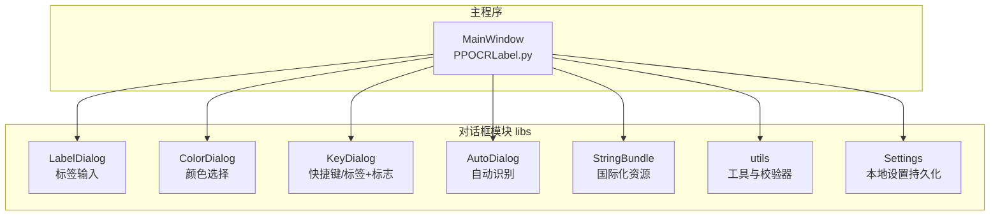
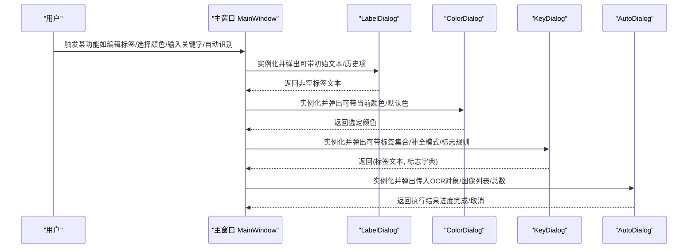
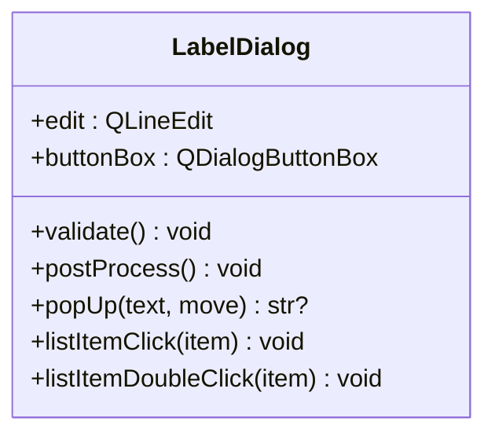
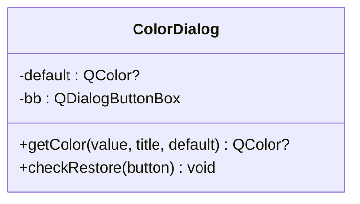
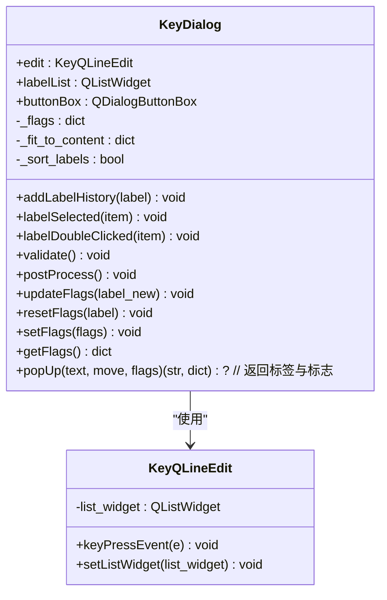
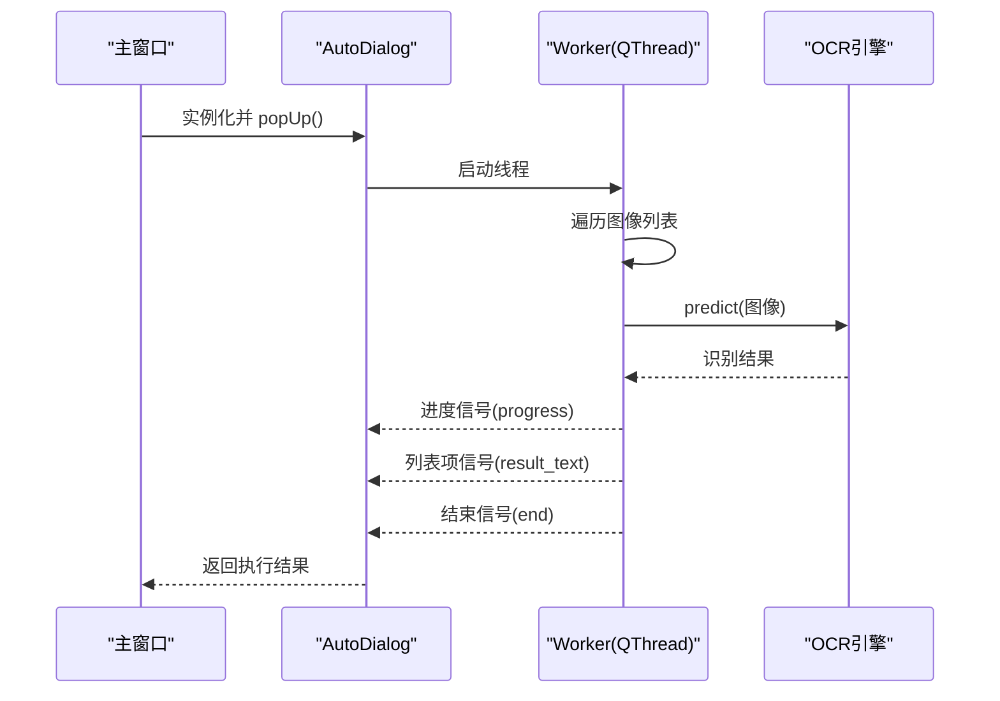
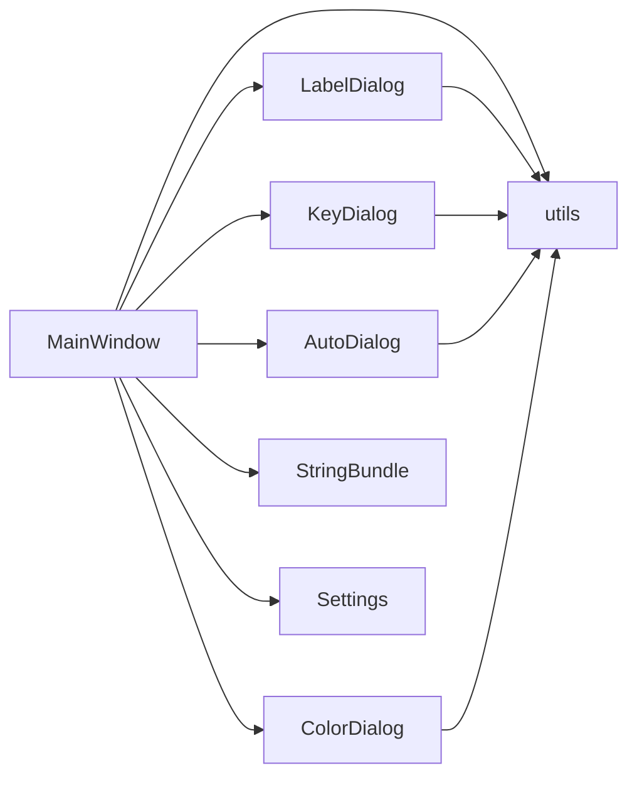

# 对话框组件

<cite>
**本文引用的文件**
- [libs/labelDialog.py](file://libs/labelDialog.py)
- [libs/colorDialog.py](file://libs/colorDialog.py)
- [libs/keyDialog.py](file://libs/keyDialog.py)
- [libs/autoDialog.py](file://libs/autoDialog.py)
- [libs/stringBundle.py](file://libs/stringBundle.py)
- [resources/strings/strings-en.properties](file://resources/strings/strings-en.properties)
- [resources/strings/strings-zh-CN.properties](file://resources/strings/strings-zh-CN.properties)
- [libs/utils.py](file://libs/utils.py)
- [libs/settings.py](file://libs/settings.py)
- [PPOCRLabel.py](file://PPOCRLabel.py)
</cite>

## 目录
1. [简介](#简介)
2. [项目结构](#项目结构)
3. [核心组件](#核心组件)
4. [架构总览](#架构总览)
5. [详细组件分析](#详细组件分析)
6. [依赖关系分析](#依赖关系分析)
7. [性能考量](#性能考量)
8. [故障排查指南](#故障排查指南)
9. [结论](#结论)
10. [附录](#附录)

## 简介
本文件系统性梳理 PPOCRLabel 中的对话框组件，覆盖标签对话框（LabelDialog）、颜色选择对话框（ColorDialog）、快捷键对话框（KeyDialog）与自动识别对话框（AutoDialog）。文档从设计理念、界面布局、用户交互、数据传递、模态控制、输入校验与确认流程、定制选项与国际化支持等维度展开，并提供使用指南与最佳实践，帮助开发者与使用者高效理解与扩展。

## 项目结构
对话框组件位于应用的 libs 子模块中，配合国际化字符串资源与工具函数共同工作；主程序在启动时按需实例化并调用这些对话框。

图表来源
- [PPOCRLabel.py](file://PPOCRLabel.py#L120-L132)
- [libs/labelDialog.py](file://libs/labelDialog.py#L29-L119)
- [libs/colorDialog.py](file://libs/colorDialog.py#L14-L42)
- [libs/keyDialog.py](file://libs/keyDialog.py#L27-L209)
- [libs/autoDialog.py](file://libs/autoDialog.py#L103-L196)
- [libs/stringBundle.py](file://libs/stringBundle.py#L29-L89)
- [libs/utils.py](file://libs/utils.py#L95-L120)
- [libs/settings.py](file://libs/settings.py#L21-L62)

章节来源
- [PPOCRLabel.py](file://PPOCRLabel.py#L120-L132)

## 核心组件
- 标签对话框（LabelDialog）
  - 功能：弹窗输入标签文本，提供补全与校验，返回非空字符串。
  - 关键点：文本编辑、补全器、按钮箱、确认/取消、位置弹出策略。
- 颜色选择对话框（ColorDialog）
  - 功能：基于系统颜色选择器，支持透明通道与默认值恢复。
  - 关键点：禁用原生对话框、添加“恢复默认”按钮、返回当前颜色。
- 快捷键对话框（KeyDialog）
  - 功能：输入标签文本，同时展示标签列表、支持内联/弹出补全、动态标志复选框。
  - 关键点：文本字段、列表、补全器、标志动态更新、确认返回文本与标志字典。
- 自动识别对话框（AutoDialog）
  - 功能：批量自动识别图像，进度条、列表展示中间结果，后台线程处理。
  - 关键点：Worker 线程、信号槽、进度计算、时间剩余提示、取消与结束处理。

章节来源
- [libs/labelDialog.py](file://libs/labelDialog.py#L29-L119)
- [libs/colorDialog.py](file://libs/colorDialog.py#L14-L42)
- [libs/keyDialog.py](file://libs/keyDialog.py#L27-L209)
- [libs/autoDialog.py](file://libs/autoDialog.py#L22-L196)

## 架构总览
对话框在主窗口中被实例化并以模态方式弹出，接收父窗口引用以便统一管理与位置控制。国际化通过 StringBundle 加载属性资源，工具函数提供校验器与图标等通用能力。

图表来源
- [PPOCRLabel.py](file://PPOCRLabel.py#L260-L265)
- [PPOCRLabel.py](file://PPOCRLabel.py#L465-L471)
- [PPOCRLabel.py](file://PPOCRLabel.py#L2450-L2462)
- [PPOCRLabel.py](file://PPOCRLabel.py#L2940-L2949)
- [libs/labelDialog.py](file://libs/labelDialog.py#L65-L107)
- [libs/colorDialog.py](file://libs/colorDialog.py#L31-L37)
- [libs/keyDialog.py](file://libs/keyDialog.py#L179-L209)
- [libs/autoDialog.py](file://libs/autoDialog.py#L190-L196)

## 详细组件分析

### 标签对话框（LabelDialog）
- 设计理念
  - 轻量、专注：仅负责标签文本输入与基础校验，避免复杂交互。
  - 可复用：支持传入历史标签列表，提供补全与选择。
- 界面布局
  - 单行文本输入框 + 按钮箱（确定/取消）。
  - 可选列表（当前代码未启用，保留接口）。
- 用户交互
  - 输入完成后焦点处理与清理空白。
  - 点击列表项可快速填入文本并触发确认。
- 数据传递
  - validate/postProcess 确保非空且去除首尾空白。
  - exec_ 返回后读取 edit.text。
- 模态与位置
  - 使用父窗口几何与光标位置计算弹出位置，避免越界。
- 输入验证
  - 基于工具函数提供的校验器（禁止首字符为空白）。
- 国际化
  - 文本标题与按钮图标由资源与工具函数提供，便于多语言。

图表来源
- [libs/labelDialog.py](file://libs/labelDialog.py#L29-L119)

章节来源
- [libs/labelDialog.py](file://libs/labelDialog.py#L29-L119)
- [libs/utils.py](file://libs/utils.py#L95-L120)

### 颜色选择对话框（ColorDialog）
- 设计理念
  - 在系统原生颜色选择器基础上增强：显式支持透明通道、禁用原生对话框以保证一致性、增加“恢复默认”按钮。
- 界面布局
  - 继承系统颜色对话框，动态注入“恢复默认”按钮。
- 用户交互
  - 设置标题、当前颜色、默认颜色；点击“恢复默认”将颜色恢复为默认值。
- 数据传递
  - getColor 返回当前颜色；若取消则返回 None。
- 模态与定制
  - 支持自定义默认色与标题；通过布局中的按钮盒连接确认事件。

图表来源
- [libs/colorDialog.py](file://libs/colorDialog.py#L14-L42)

章节来源
- [libs/colorDialog.py](file://libs/colorDialog.py#L14-L42)

### 快捷键对话框（KeyDialog）
- 设计理念
  - 将标签输入与标签列表、标志选择结合，支持按标签匹配规则动态生成标志复选框，提升 KIE（关键信息抽取）场景效率。
- 界面布局
  - 文本输入区（可隐藏）、确认/取消按钮、标签列表、标志区域（动态生成）。
  - 支持“按起始匹配/包含匹配”的补全模式。
- 用户交互
  - 键盘上下键在列表中导航；双击列表项确认。
  - 文本变化时根据规则更新标志复选框状态。
- 数据传递
  - popUp 返回 (标签文本, 标志字典)，validate 确保非空。
- 模态与位置
  - 根据光标位置弹出；支持根据内容自适应尺寸。
- 定制选项
  - 是否显示文本字段、是否排序标签、补全模式、是否滚动条、初始标志字典。
- 国际化
  - 提示文本来自 StringBundle，按钮图标来自工具函数。

图表来源
- [libs/keyDialog.py](file://libs/keyDialog.py#L16-L209)

章节来源
- [libs/keyDialog.py](file://libs/keyDialog.py#L27-L209)
- [libs/utils.py](file://libs/utils.py#L95-L120)

### 自动识别对话框（AutoDialog）
- 设计理念
  - 将耗时的 OCR 推至后台线程，避免阻塞主线程；提供进度条、中间结果列表与“剩余时间”估算。
- 界面布局
  - 进度条、结果列表、确认/取消按钮、模态窗口。
- 用户交互
  - 弹出后立即启动 Worker 线程；支持取消（终止线程并释放）。
  - 结束时启用“确定”按钮，禁用“取消”。
- 数据传递
  - Worker 通过信号发送进度、中间文本与结束信号；主线程保存结果并触发保存。
- 模态与性能
  - ApplicationModal，确保用户必须完成操作；平均耗时法估算剩余时间。
- 错误处理
  - 记录异常日志；线程退出循环直至完成。

图表来源
- [libs/autoDialog.py](file://libs/autoDialog.py#L22-L196)
- [PPOCRLabel.py](file://PPOCRLabel.py#L2940-L2949)

章节来源
- [libs/autoDialog.py](file://libs/autoDialog.py#L22-L196)
- [PPOCRLabel.py](file://PPOCRLabel.py#L2940-L2949)

## 依赖关系分析
- 主程序依赖
  - MainWindow 在初始化阶段创建各对话框实例，并在需要时弹出。
- 工具与资源
  - utils 提供图标、动作、校验器与颜色生成等；stringBundle 提供多语言字符串；settings 提供本地持久化。
- 对话框内部依赖
  - LabelDialog/KeyDialog 使用补全器与列表控件；AutoDialog 使用 QThread 与信号槽；ColorDialog 使用系统颜色对话框。

图表来源
- [PPOCRLabel.py](file://PPOCRLabel.py#L120-L132)
- [libs/labelDialog.py](file://libs/labelDialog.py#L29-L119)
- [libs/colorDialog.py](file://libs/colorDialog.py#L14-L42)
- [libs/keyDialog.py](file://libs/keyDialog.py#L27-L209)
- [libs/autoDialog.py](file://libs/autoDialog.py#L103-L196)
- [libs/stringBundle.py](file://libs/stringBundle.py#L29-L89)
- [libs/utils.py](file://libs/utils.py#L95-L120)
- [libs/settings.py](file://libs/settings.py#L21-L62)

章节来源
- [PPOCRLabel.py](file://PPOCRLabel.py#L120-L132)
- [libs/utils.py](file://libs/utils.py#L95-L120)
- [libs/stringBundle.py](file://libs/stringBundle.py#L29-L89)
- [libs/settings.py](file://libs/settings.py#L21-L62)

## 性能考量
- AutoDialog 使用独立线程执行 OCR，避免 UI 卡顿；通过信号槽回传进度与中间结果，减少主线程压力。
- 进度剩余时间采用平均耗时法估算，避免频繁高开销计算。
- LabelDialog/KeyDialog 的补全器在大数据量时建议限制列表规模或优化过滤策略，避免 UI 抖动。
- ColorDialog 禁用原生对话框以统一行为，可能带来额外布局成本，但换来一致体验。

## 故障排查指南
- 标签为空或仅空白
  - 现象：validate 失败导致无法确认。
  - 处理：使用 postProcess 清理首尾空白；确保校验器生效。
- 颜色选择未返回
  - 现象：点击“取消”或关闭对话框返回 None。
  - 处理：检查 getColor 的调用分支；确认 exec_ 是否正确返回。
- 快捷键对话框标志未更新
  - 现象：输入变化后标志未按规则刷新。
  - 处理：确认 updateFlags 的正则匹配与 flags 字典结构；检查文本变化信号连接。
- 自动识别卡住或无响应
  - 现象：点击“取消”后线程未退出。
  - 处理：reject 中设置 handle 标志并等待线程 finished；必要时强制退出。
- 国际化字符串缺失
  - 现象：界面文案未按预期显示。
  - 处理：检查 StringBundle 的 locale 解析与资源路径；确认 properties 文件完整。

章节来源
- [libs/labelDialog.py](file://libs/labelDialog.py#L65-L107)
- [libs/colorDialog.py](file://libs/colorDialog.py#L31-L42)
- [libs/keyDialog.py](file://libs/keyDialog.py#L139-L178)
- [libs/autoDialog.py](file://libs/autoDialog.py#L172-L196)
- [libs/stringBundle.py](file://libs/stringBundle.py#L42-L89)

## 结论
本组对话框围绕“简洁、可靠、可扩展”的目标设计：LabelDialog 专注输入，ColorDialog 增强可控性，KeyDialog 提升 KIE 场景效率，AutoDialog 解决性能瓶颈。它们与主程序、工具与资源模块协同，形成清晰的职责边界与稳定的交互闭环。遵循本文的最佳实践与排错建议，可在多语言与复杂任务中保持一致的用户体验。

## 附录

### 使用指南与最佳实践
- 标签输入
  - 优先使用 LabelDialog 获取非空标签；结合历史列表与补全提升效率。
  - 若需 KIE 关键字与标志联动，使用 KeyDialog 并配置匹配规则。
- 颜色选择
  - 使用 ColorDialog 获取 RGBA 颜色；为不同元素设置默认色并在需要时一键恢复。
- 自动识别
  - 批量识别前预估耗时；在长队列场景下提供进度反馈与取消能力。
  - 识别结束后统一保存，避免频繁 IO。
- 国际化
  - 通过 StringBundle 获取多语言文案；确保 properties 文件齐全。
- 设置持久化
  - 使用 Settings 保存用户偏好；注意加载失败时的降级处理。

章节来源
- [libs/labelDialog.py](file://libs/labelDialog.py#L29-L119)
- [libs/colorDialog.py](file://libs/colorDialog.py#L14-L42)
- [libs/keyDialog.py](file://libs/keyDialog.py#L27-L209)
- [libs/autoDialog.py](file://libs/autoDialog.py#L103-L196)
- [libs/stringBundle.py](file://libs/stringBundle.py#L29-L89)
- [libs/settings.py](file://libs/settings.py#L21-L62)
- [resources/strings/strings-en.properties](file://resources/strings/strings-en.properties#L1-L122)
- [resources/strings/strings-zh-CN.properties](file://resources/strings/strings-zh-CN.properties#L1-L122)