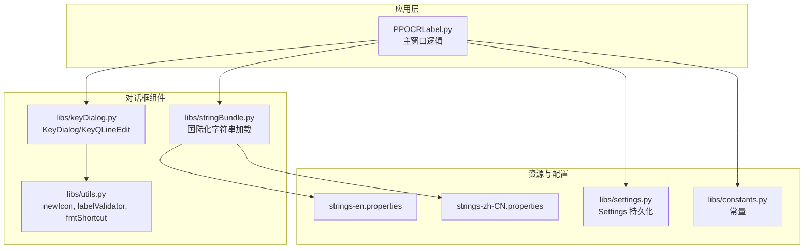
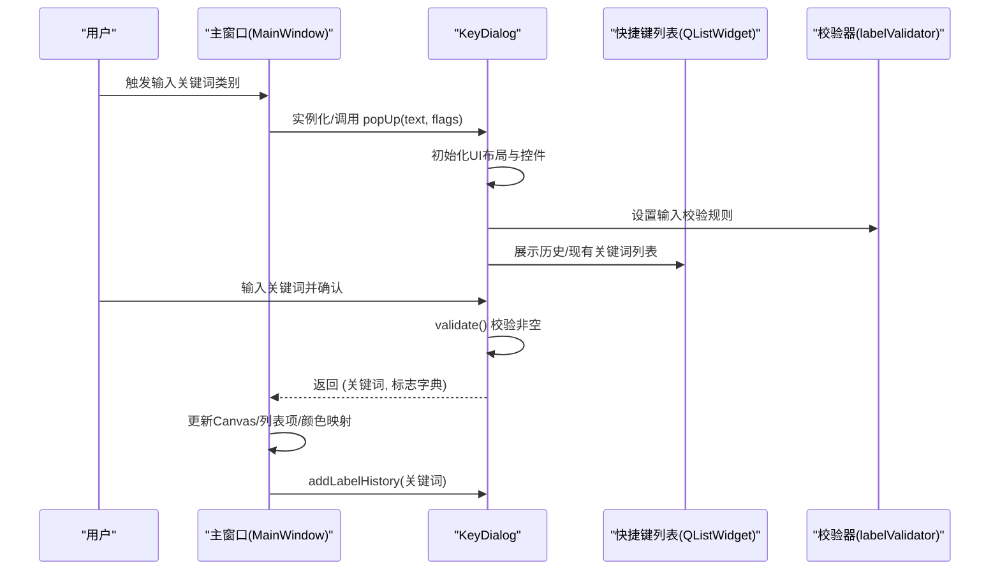
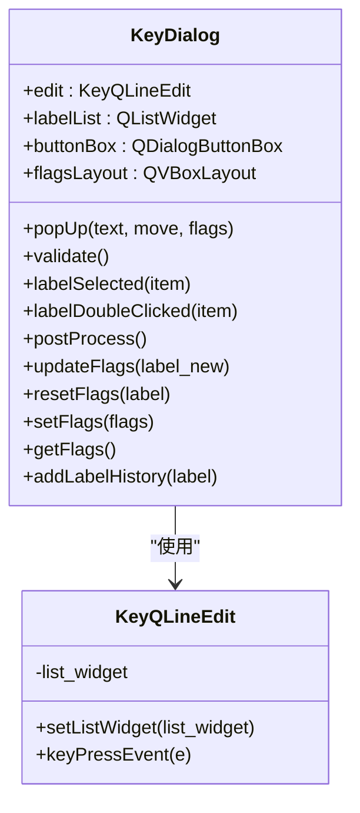
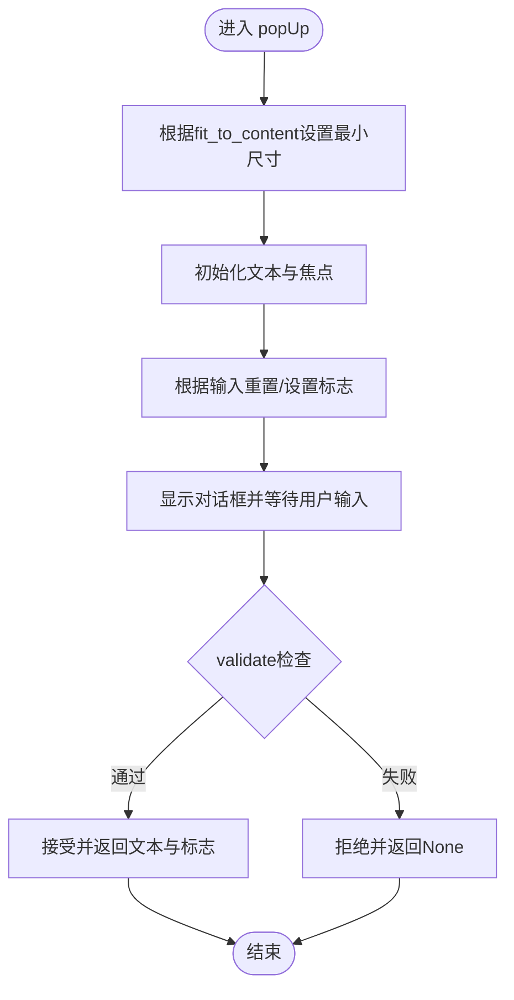
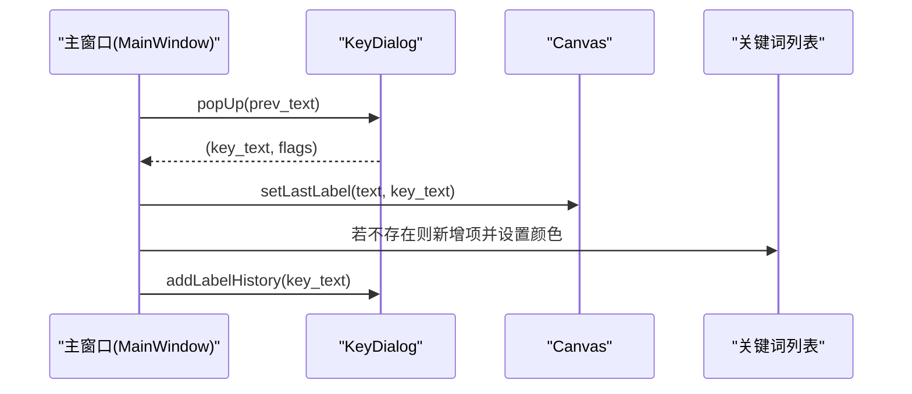
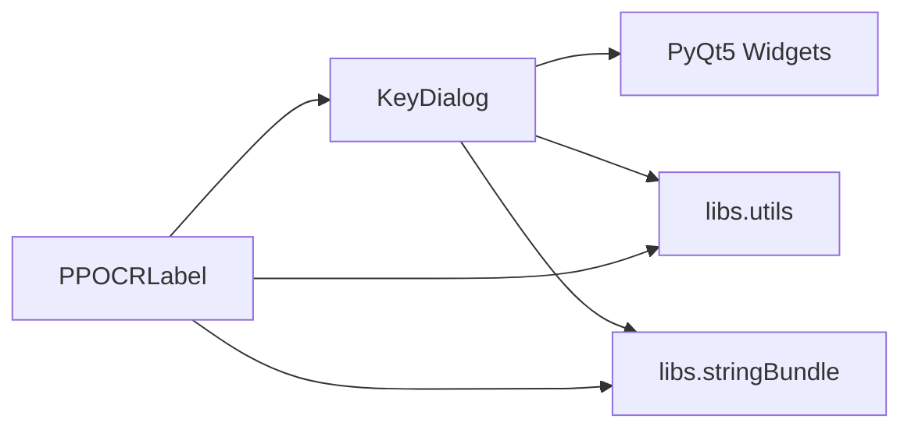

# 快捷键对话框

<cite>
**本文档引用的文件**
- [libs/keyDialog.py](file://libs/keyDialog.py)
- [libs/utils.py](file://libs/utils.py)
- [libs/constants.py](file://libs/constants.py)
- [libs/settings.py](file://libs/settings.py)
- [libs/stringBundle.py](file://libs/stringBundle.py)
- [PPOCRLabel.py](file://PPOCRLabel.py)
- [resources/strings/strings-en.properties](file://resources/strings/strings-en.properties)
- [resources/strings/strings-zh-CN.properties](file://resources/strings/strings-zh-CN.properties)
</cite>

## 目录
1. [简介](#简介)
2. [项目结构](#项目结构)
3. [核心组件](#核心组件)
4. [架构总览](#架构总览)
5. [详细组件分析](#详细组件分析)
6. [依赖关系分析](#依赖关系分析)
7. [性能考虑](#性能考虑)
8. [故障排除指南](#故障排除指南)
9. [结论](#结论)
10. [附录](#附录)

## 简介
本文件系统性地阐述快捷键对话框（KeyDialog）的设计目的、实现方式与使用场景，覆盖快捷键配置界面、按键绑定管理、用户输入处理、初始化流程、快捷键列表展示与编辑、添加/修改/删除操作、按键组合验证与冲突检测、模态对话框行为、确认保存与取消处理，以及最佳实践与使用指南。KeyDialog在应用中用于在关键标注场景（如KIE模式）下为检测框分配“关键词类别”（key_cls），并通过历史记录与自动补全提升交互效率。

## 项目结构
KeyDialog位于libs子模块中，作为通用的模态输入对话框组件，被主程序PPOCRLabel在特定业务场景调用。其依赖于通用工具函数（如图标、校验器）、字符串本地化资源、以及设置持久化模块。

图表来源
- [libs/keyDialog.py](file://libs/keyDialog.py#L1-L209)
- [libs/utils.py](file://libs/utils.py#L33-L97)
- [libs/stringBundle.py](file://libs/stringBundle.py#L29-L89)
- [PPOCRLabel.py](file://PPOCRLabel.py#L120-L131)
- [resources/strings/strings-en.properties](file://resources/strings/strings-en.properties#L98-L114)
- [resources/strings/strings-zh-CN.properties](file://resources/strings/strings-zh-CN.properties#L98-L114)
- [libs/settings.py](file://libs/settings.py#L21-L62)
- [libs/constants.py](file://libs/constants.py#L13-L32)

章节来源
- [libs/keyDialog.py](file://libs/keyDialog.py#L1-L209)
- [libs/utils.py](file://libs/utils.py#L33-L97)
- [libs/stringBundle.py](file://libs/stringBundle.py#L29-L89)
- [PPOCRLabel.py](file://PPOCRLabel.py#L120-L131)

## 核心组件
- KeyQLineEdit：继承自QLineEdit，扩展了键盘事件处理，使上下方向键在文本输入框与列表之间传递，提升键盘导航体验。
- KeyDialog：继承自QDialog，提供模态输入界面，包含文本输入框、快捷键列表、标志复选框区域、确认/取消按钮与自动补全功能；支持历史记录添加、验证与弹窗展示。

章节来源
- [libs/keyDialog.py](file://libs/keyDialog.py#L16-L25)
- [libs/keyDialog.py](file://libs/keyDialog.py#L27-L209)

## 架构总览
KeyDialog在主程序中以模态对话框形式出现，负责收集用户输入的“关键词类别”文本，并可选地根据输入动态更新标志复选项。主程序在需要时实例化KeyDialog并调用其弹窗方法，接收返回值后更新Canvas与列表项。

图表来源
- [libs/keyDialog.py](file://libs/keyDialog.py#L119-L138)
- [libs/keyDialog.py](file://libs/keyDialog.py#L179-L208)
- [PPOCRLabel.py](file://PPOCRLabel.py#L1966-L1980)
- [PPOCRLabel.py](file://PPOCRLabel.py#L3581-L3595)

## 详细组件分析

### KeyQLineEdit 组件
- 设计目的：增强键盘导航体验，使上下方向键在文本输入框与列表之间传递，避免用户必须使用鼠标切换焦点。
- 关键行为：
  - 重写 keyPressEvent：当按下上/下方向键时，将事件转发给关联的列表控件，否则执行默认文本框处理。
  - setListWidget：建立与列表控件的引用，以便事件转发。

图表来源
- [libs/keyDialog.py](file://libs/keyDialog.py#L16-L25)
- [libs/keyDialog.py](file://libs/keyDialog.py#L27-L209)

章节来源
- [libs/keyDialog.py](file://libs/keyDialog.py#L16-L25)

### KeyDialog 组件
- 设计目的：提供统一的模态输入界面，支持关键词输入、历史记录、自动补全、标志复选框动态更新与键盘导航。
- 初始化与布局：
  - 构造参数：文本提示、父窗口、初始关键词列表、是否排序、是否显示文本框、补全策略、自适应尺寸策略、标志映射。
  - UI组成：文本输入框（带占位符与校验器）、确认/取消按钮、关键词列表、标志复选框区域、自动补全。
  - 补全模式：支持“前缀匹配”和“包含匹配”，在非Qt5环境下强制为“前缀匹配”。
- 用户输入处理：
  - 文本框编辑完成触发清理空白字符。
  - 双击列表项等同于确认。
  - validate：仅当文本非空时接受对话框。
- 历史记录与列表：
  - addLabelHistory：去重后添加到列表，按需排序。
  - 列表支持排序或内部拖拽重排（未排序时）。
- 动态标志：
  - updateFlags：基于正则匹配规则动态生成/保留标志状态。
  - resetFlags/setFlags/getFlags：管理标志复选项的创建与读取。
- 弹窗与定位：
  - popUp：根据fit_to_content计算最小尺寸，设置初始文本与焦点，将光标置于末尾，按需移动到鼠标位置，返回用户输入与标志状态。

图表来源
- [libs/keyDialog.py](file://libs/keyDialog.py#L179-L208)
- [libs/keyDialog.py](file://libs/keyDialog.py#L119-L138)

章节来源
- [libs/keyDialog.py](file://libs/keyDialog.py#L27-L209)

### 在主程序中的集成与使用
- 实例化时机：在导入图像目录时，根据已存在的关键词集合初始化KeyDialog，确保后续输入一致。
- 使用场景：
  - 创建新框时，若处于KIE模式，弹出KeyDialog获取关键词类别，更新Canvas与列表项颜色。
  - 修改选中框的关键词类别时，弹出KeyDialog并批量更新。
- 数据流：
  - 主程序从KeyDialog获取关键词与标志，更新Canvas选中框的key_cls属性，必要时向关键词列表追加新项并分配颜色。
  - 将用户输入加入历史记录，便于下次快速选择。

图表来源
- [PPOCRLabel.py](file://PPOCRLabel.py#L1966-L1980)
- [PPOCRLabel.py](file://PPOCRLabel.py#L3581-L3595)

章节来源
- [PPOCRLabel.py](file://PPOCRLabel.py#L1966-L1980)
- [PPOCRLabel.py](file://PPOCRLabel.py#L2450-L2462)
- [PPOCRLabel.py](file://PPOCRLabel.py#L3581-L3595)

### 输入验证与冲突检测
- 输入验证：
  - 文本框使用labelValidator，限制首字符不能是空白，防止无效输入。
  - validate仅在文本非空时允许确认。
- 冲突检测：
  - KeyDialog未内置按键组合冲突检测逻辑；冲突检测通常由上层逻辑（如快捷键绑定管理器）负责。
  - 历史记录去重：addLabelHistory在添加前查找完全匹配项，避免重复条目。

章节来源
- [libs/utils.py](file://libs/utils.py#L95-L97)
- [libs/keyDialog.py](file://libs/keyDialog.py#L119-L138)
- [libs/keyDialog.py](file://libs/keyDialog.py#L109-L114)

### 模态设计与确认/取消处理
- 模态行为：exec_阻塞等待用户选择，返回True表示确认，False表示取消。
- 确认：validate检查非空后accept，返回文本与标志。
- 取消：reject返回None，主程序据此决定是否更新状态。

章节来源
- [libs/keyDialog.py](file://libs/keyDialog.py#L57-L66)
- [libs/keyDialog.py](file://libs/keyDialog.py#L119-L127)
- [libs/keyDialog.py](file://libs/keyDialog.py#L205-L208)

### 快捷键配置界面与编辑功能
- 快捷键配置界面：KeyDialog本身不直接管理快捷键绑定，而是提供输入界面与历史记录。
- 编辑功能：
  - 键盘导航：上下方向键在输入框与列表间切换。
  - 自动补全：基于列表模型的内联/弹出式补全。
  - 列表编辑：排序或内部拖拽重排（取决于排序开关）。

章节来源
- [libs/keyDialog.py](file://libs/keyDialog.py#L68-L83)
- [libs/keyDialog.py](file://libs/keyDialog.py#L94-L107)
- [libs/keyDialog.py](file://libs/keyDialog.py#L76-L79)

## 依赖关系分析
- 对外依赖：
  - PyQt5：UI框架与事件处理。
  - libs.utils：图标资源与输入校验器。
  - libs.stringBundle：国际化字符串加载。
- 内部依赖：
  - KeyDialog依赖KeyQLineEdit与QListWidget/QDialogButtonBox/QVBoxLayout等控件。
  - 主程序PPOCRLabel依赖KeyDialog进行关键词输入，并与Canvas、关键词列表协同工作。

图表来源
- [libs/keyDialog.py](file://libs/keyDialog.py#L3-L7)
- [libs/utils.py](file://libs/utils.py#L33-L97)
- [libs/stringBundle.py](file://libs/stringBundle.py#L29-L89)
- [PPOCRLabel.py](file://PPOCRLabel.py#L120-L131)

章节来源
- [libs/keyDialog.py](file://libs/keyDialog.py#L3-L7)
- [libs/utils.py](file://libs/utils.py#L33-L97)
- [libs/stringBundle.py](file://libs/stringBundle.py#L29-L89)
- [PPOCRLabel.py](file://PPOCRLabel.py#L120-L131)

## 性能考虑
- 列表排序：当启用排序时，每次添加历史记录都会触发排序，建议在大量历史项时谨慎使用排序。
- 自动补全：补全模型基于当前列表模型，列表项较多时可能影响补全性能，可考虑分页或延迟加载策略。
- 事件处理：KeyQLineEdit的事件转发仅在上下方向键时发生，对性能影响极小。

## 故障排除指南
- 输入为空导致无法确认：validate仅在文本非空时接受，确保用户输入有效后再确认。
- 列表无响应：检查KeyQLineEdit与列表的事件转发是否正确连接，确认setListWidget调用。
- 国际化字符串缺失：确认StringBundle加载路径与资源文件存在，避免提示文本显示异常。
- 历史记录重复：addLabelHistory会去重，若仍出现重复，检查匹配逻辑与输入格式。

章节来源
- [libs/keyDialog.py](file://libs/keyDialog.py#L119-L138)
- [libs/keyDialog.py](file://libs/keyDialog.py#L109-L114)
- [libs/stringBundle.py](file://libs/stringBundle.py#L73-L89)

## 结论
KeyDialog为应用提供了简洁高效的关键词类别输入界面，结合历史记录、自动补全与键盘导航，显著提升了KIE模式下的标注效率。尽管其不直接处理快捷键绑定冲突，但通过与主程序的紧密协作，能够稳定地服务于关键词类别的创建、修改与维护。建议在大规模历史数据场景下合理使用排序与补全策略，以获得更佳的用户体验。

## 附录

### 最佳实践与使用指南
- 输入规范
  - 使用labelValidator确保输入合法，避免首字符为空白。
  - 在确认前尽量保持输入简洁明确，减少歧义。
- 历史管理
  - 合理利用addLabelHistory，避免重复项堆积。
  - 如需频繁编辑，建议关闭排序以提升添加速度。
- 交互优化
  - 利用上下方向键在输入框与列表间切换，减少鼠标操作。
  - 使用自动补全快速选择历史项，提高输入效率。
- 国际化
  - 确保字符串资源文件完整，避免提示文本显示异常。
- 与主程序协同
  - 在创建/修改框时及时更新Canvas与关键词列表的颜色映射。
  - 对新增关键词进行颜色分配，保证视觉一致性。

章节来源
- [libs/utils.py](file://libs/utils.py#L95-L97)
- [libs/keyDialog.py](file://libs/keyDialog.py#L109-L114)
- [libs/keyDialog.py](file://libs/keyDialog.py#L68-L83)
- [PPOCRLabel.py](file://PPOCRLabel.py#L1966-L1980)
- [PPOCRLabel.py](file://PPOCRLabel.py#L3581-L3595)