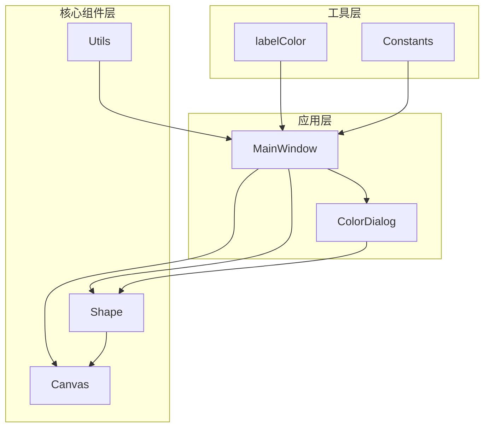
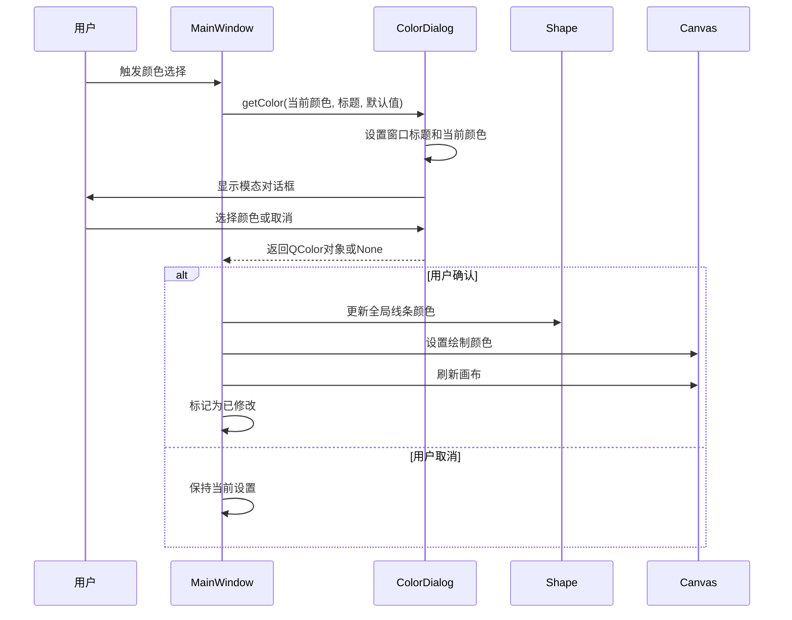
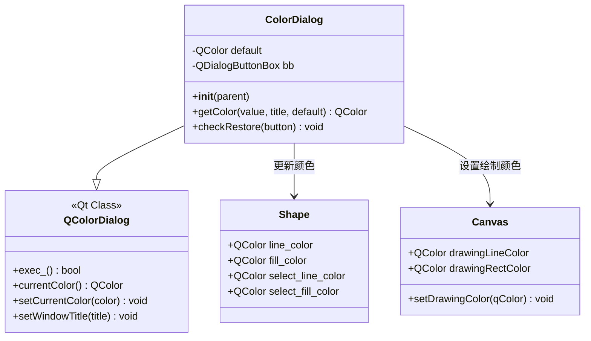
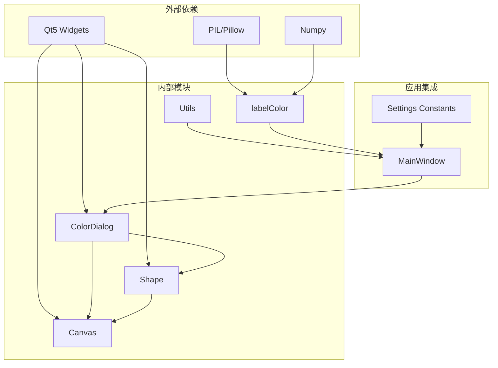

# 颜色选择对话框

<cite>
**本文档引用的文件**
- [libs/colorDialog.py](file://libs/colorDialog.py)
- [libs/shape.py](file://libs/shape.py)
- [libs/canvas.py](file://libs/canvas.py)
- [libs/utils.py](file://libs/utils.py)
- [libs/constants.py](file://libs/constants.py)
- [PPOCRLabel.py](file://PPOCRLabel.py)
</cite>

## 目录
1. [简介](#简介)
2. [项目结构](#项目结构)
3. [核心组件](#核心组件)
4. [架构概览](#架构概览)
5. [详细组件分析](#详细组件分析)
6. [依赖关系分析](#依赖关系分析)
7. [性能考虑](#性能考虑)
8. [故障排除指南](#故障排除指南)
9. [结论](#结论)
10. [附录](#附录)

## 简介

颜色选择对话框（ColorDialog）是PPOCRLabel应用中的关键组件，用于提供直观的颜色选择功能。该对话框基于Qt的QColorDialog构建，扩展了标准对话框的功能，增加了透明度通道支持、自定义默认按钮以及跨平台兼容性优化。

本系统实现了完整的颜色管理机制，包括颜色值的获取、验证、格式转换和持久化存储。用户可以通过多种方式选择颜色，从简单的颜色选择到复杂的颜色配置，满足不同场景下的需求。

## 项目结构

颜色选择功能分布在多个模块中，形成了清晰的分层架构：



**图表来源**
- [PPOCRLabel.py](file://PPOCRLabel.py#L470-L471)
- [libs/colorDialog.py](file://libs/colorDialog.py#L17-L41)
- [libs/shape.py](file://libs/shape.py#L35-L50)

**章节来源**
- [PPOCRLabel.py](file://PPOCRLabel.py#L1-L100)
- [libs/colorDialog.py](file://libs/colorDialog.py#L1-L42)

## 核心组件

### ColorDialog 类

ColorDialog是颜色选择对话框的核心实现，继承自QColorDialog并添加了自定义功能：

- **透明度支持**：启用ShowAlphaChannel选项，允许用户选择颜色的透明度
- **跨平台兼容**：禁用原生对话框，确保在所有平台上的一致行为
- **默认值恢复**：添加RestoreDefaults按钮，支持恢复到初始颜色设置
- **模态交互**：提供阻塞式对话框体验，确保用户必须做出选择

### 默认颜色系统

系统维护了多套默认颜色配置：

- **线条颜色**：半透明绿色 (0, 255, 0, 128)
- **填充颜色**：半透明红色 (255, 0, 0, 128)
- **选中状态颜色**：白色线条配蓝色填充 (255, 255, 255) 和 (0, 128, 255, 155)
- **顶点颜色**：绿色填充 (0, 255, 0, 255)，高亮时变为红色 (255, 0, 0)

**章节来源**
- [libs/colorDialog.py](file://libs/colorDialog.py#L17-L41)
- [libs/shape.py](file://libs/shape.py#L25-L31)

## 架构概览

颜色管理系统采用分层架构设计，确保各组件职责明确且相互解耦：



**图表来源**
- [PPOCRLabel.py](file://PPOCRLabel.py#L2748-L2757)
- [libs/colorDialog.py](file://libs/colorDialog.py#L31-L37)

## 详细组件分析

### ColorDialog 实现分析

ColorDialog类提供了完整的颜色选择功能，其设计遵循以下原则：

#### 初始化流程
1. **基础设置**：调用父类构造函数
2. **透明度配置**：启用ShowAlphaChannel选项
3. **平台兼容**：禁用DontUseNativeDialog以确保一致性
4. **按钮扩展**：添加RestoreDefaults按钮
5. **事件连接**：连接按钮点击事件到检查函数

#### 颜色获取机制
getColor方法实现了灵活的颜色获取流程：
- 支持设置对话框标题
- 可选的当前颜色显示
- 默认值的传递和存储
- 模态对话框的执行和结果处理

#### 验证和恢复机制
checkRestore方法确保了用户可以恢复到初始设置：
- 检查按钮角色是否为ResetRole
- 验证默认值的存在性
- 自动恢复到默认颜色



**图表来源**
- [libs/colorDialog.py](file://libs/colorDialog.py#L17-L41)
- [libs/shape.py](file://libs/shape.py#L42-L47)
- [libs/canvas.py](file://libs/canvas.py#L91-L93)

**章节来源**
- [libs/colorDialog.py](file://libs/colorDialog.py#L17-L41)

### 颜色值格式转换

系统支持多种颜色值格式的转换和处理：

#### RGB到HSV转换
系统提供了完整的RGB到HSV色彩空间转换功能：
- 使用PIL库进行色彩空间转换
- 支持numpy数组的批量处理
- 维护颜色的完整性和平滑过渡

#### 颜色生成算法
generateColorByText函数实现了基于文本内容的颜色生成：
- 使用SHA256哈希算法
- 将哈希值映射到RGB颜色空间
- 提供半透明度支持

#### 颜色验证机制
系统内置了颜色验证逻辑：
- 确保颜色值在有效范围内 (0-255)
- 验证透明度值的有效性
- 处理颜色格式转换错误

**章节来源**
- [libs/labelColor.py](file://libs/labelColor.py#L5-L88)
- [libs/utils.py](file://libs/utils.py#L113-L119)

### 用户交互模式

颜色选择对话框支持多种用户交互模式：

#### 单击交互
- **颜色选择**：用户通过拖拽或点击选择目标颜色
- **实时预览**：当前选择的颜色实时显示在对话框中
- **确认操作**：点击确定按钮接受选择的颜色

#### 快捷键支持
- **ESC键**：取消对话框并返回到之前的设置
- **Enter键**：确认当前选择的颜色
- **方向键**：在颜色选择器中导航

#### 模态行为
- **阻塞式交互**：对话框显示期间阻止其他操作
- **焦点管理**：确保对话框获得和保持焦点
- **上下文感知**：根据当前操作环境提供合适的默认颜色

**章节来源**
- [libs/colorDialog.py](file://libs/colorDialog.py#L31-L37)

## 依赖关系分析

颜色选择系统的依赖关系体现了清晰的分层设计：



**图表来源**
- [libs/colorDialog.py](file://libs/colorDialog.py#L14-L14)
- [libs/labelColor.py](file://libs/labelColor.py#L1-L3)

### 关键依赖关系

1. **Qt5集成**：所有GUI功能都依赖于Qt5框架
2. **PIL支持**：色彩空间转换需要PIL库支持
3. **Numpy处理**：图像和数组操作使用Numpy库
4. **模块间通信**：通过信号槽机制实现松耦合通信

**章节来源**
- [libs/colorDialog.py](file://libs/colorDialog.py#L14-L14)
- [libs/labelColor.py](file://libs/labelColor.py#L1-L3)

## 性能考虑

颜色选择系统的性能优化主要体现在以下几个方面：

### 内存管理
- **延迟加载**：颜色对话框按需创建和销毁
- **资源复用**：避免重复创建相同的颜色对象
- **垃圾回收**：及时释放不再使用的颜色资源

### 渲染优化
- **增量更新**：只更新受影响的画布区域
- **缓存策略**：缓存常用的颜色计算结果
- **批处理操作**：合并多个颜色变更操作

### 响应性保证
- **异步处理**：长时间的颜色计算在后台线程执行
- **进度指示**：复杂颜色操作显示进度反馈
- **超时保护**：防止无限期的阻塞操作

## 故障排除指南

### 常见问题及解决方案

#### 对话框无法显示
**症状**：颜色选择对话框不显示或立即关闭
**可能原因**：
- 父窗口句柄无效
- Qt环境配置问题
- 资源文件缺失

**解决步骤**：
1. 检查MainWindow实例的正确初始化
2. 验证Qt库的完整性和版本兼容性
3. 确认资源文件的正确打包和部署

#### 颜色选择无效
**症状**：用户选择颜色后应用没有响应
**可能原因**：
- 颜色值验证失败
- 事件处理链中断
- 状态同步问题

**解决步骤**：
1. 检查颜色值的有效范围
2. 验证事件连接的正确性
3. 确认状态更新的完整性

#### 性能问题
**症状**：颜色选择操作响应缓慢
**可能原因**：
- 大量颜色对象的频繁创建
- 不必要的重绘操作
- 资源竞争和死锁

**解决步骤**：
1. 实施颜色对象池化
2. 优化重绘区域计算
3. 检查并发访问的同步机制

**章节来源**
- [libs/colorDialog.py](file://libs/colorDialog.py#L31-L37)
- [libs/shape.py](file://libs/shape.py#L142-L167)

## 结论

颜色选择对话框系统展现了优秀的软件工程实践，通过合理的架构设计和实现细节，提供了稳定、高效、用户友好的颜色选择功能。

系统的主要优势包括：
- **模块化设计**：清晰的职责分离和接口定义
- **跨平台兼容**：统一的用户体验和行为
- **扩展性强**：易于添加新的颜色处理功能
- **性能优化**：高效的内存管理和渲染优化

未来可以考虑的改进方向：
- 添加颜色历史记录功能
- 实现颜色主题系统
- 增强颜色对比度检查
- 支持颜色预设模板

## 附录

### 使用示例

#### 基本颜色选择
```python
# 创建颜色对话框实例
color_dialog = ColorDialog(parent=self)

# 获取用户选择的颜色
selected_color = color_dialog.getColor(
    value=current_color,
    title="选择线条颜色",
    default=DEFAULT_LINE_COLOR
)

if selected_color:
    # 应用颜色到系统
    self.lineColor = selected_color
    Shape.line_color = selected_color
    self.canvas.setDrawingColor(selected_color)
```

#### 高级颜色配置
```python
# 配置颜色对话框选项
color_dialog.setOption(QColorDialog.ShowAlphaChannel)
color_dialog.setOption(QColorDialog.DontUseNativeDialog)

# 设置自定义默认值
color_dialog.default = DEFAULT_FILL_COLOR

# 执行对话框
result = color_dialog.exec_()
```

### 配置参数

| 参数名称 | 类型 | 默认值 | 描述 |
|---------|------|--------|------|
| ShowAlphaChannel | bool | True | 启用透明度选择 |
| DontUseNativeDialog | bool | True | 使用自定义对话框 |
| RestoreDefaults | QPushButton | 自动添加 | 恢复默认颜色按钮 |

### 错误码说明

| 错误码 | 描述 | 处理建议 |
|--------|------|----------|
| 0x0001 | 对话框初始化失败 | 检查Qt环境配置 |
| 0x0002 | 颜色值超出范围 | 验证颜色值有效性 |
| 0x0003 | 资源加载失败 | 确认资源文件存在 |
| 0x0004 | 平台兼容性问题 | 检查操作系统支持 |