# 用户界面设计

<cite>
**本文引用的文件**
- [PPOCRLabel.py](file://PPOCRLabel.py)
- [canvas.py](file://libs/canvas.py)
- [toolBar.py](file://libs/toolBar.py)
- [labelDialog.py](file://libs/labelDialog.py)
- [colorDialog.py](file://libs/colorDialog.py)
- [keyDialog.py](file://libs/keyDialog.py)
- [autoDialog.py](file://libs/autoDialog.py)
- [zoomWidget.py](file://libs/zoomWidget.py)
- [editinlist.py](file://libs/editinlist.py)
- [settings.py](file://libs/settings.py)
- [stringBundle.py](file://libs/stringBundle.py)
- [utils.py](file://libs/utils.py)
- [strings-en.properties](file://resources/strings/strings-en.properties)
- [strings-zh-CN.properties](file://resources/strings/strings-zh-CN.properties)
</cite>

## 目录
1. [引言](#引言)
2. [项目结构](#项目结构)
3. [核心组件](#核心组件)
4. [架构总览](#架构总览)
5. [详细组件分析](#详细组件分析)
6. [依赖关系分析](#依赖关系分析)
7. [性能考量](#性能考量)
8. [故障排查指南](#故障排查指南)
9. [结论](#结论)
10. [附录](#附录)

## 引言
本文件面向设计师与开发者，系统化梳理 PPOCRLabel 的用户界面设计。内容涵盖主窗口布局、工具栏设计、对话框组件与交互元素的视觉设计原则；解释各界面元素的功能定位、用户交互模式与响应行为；详述标签对话框、颜色选择器、快捷键对话框等专用界面组件的设计理念；并给出界面定制选项、主题切换与国际化支持的实现方式，以及使用指南与用户体验优化建议。

## 项目结构
PPOCRLabel 采用模块化的界面组织方式，主窗口负责布局与控制流，各功能区域由独立模块实现（如画布、工具栏、对话框、设置与字符串资源）。核心文件包括主窗口入口、画布渲染、工具栏按钮、对话框组件、设置与本地化资源等。

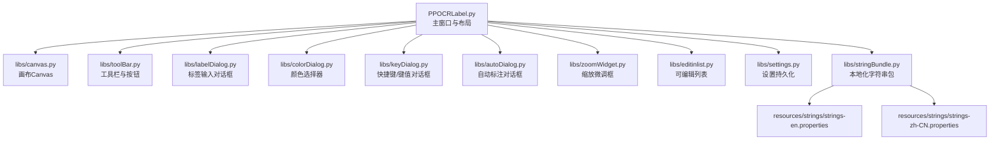

**图表来源**
- [PPOCRLabel.py](file://PPOCRLabel.py#L143-L541)
- [canvas.py](file://libs/canvas.py#L32-L120)
- [toolBar.py](file://libs/toolBar.py#L18-L48)
- [labelDialog.py](file://libs/labelDialog.py#L30-L107)
- [colorDialog.py](file://libs/colorDialog.py#L17-L42)
- [keyDialog.py](file://libs/keyDialog.py#L27-L209)
- [autoDialog.py](file://libs/autoDialog.py#L103-L196)
- [zoomWidget.py](file://libs/zoomWidget.py#L19-L35)
- [editinlist.py](file://libs/editinlist.py#L7-L34)
- [settings.py](file://libs/settings.py#L21-L62)
- [stringBundle.py](file://libs/stringBundle.py#L29-L89)
- [strings-en.properties](file://resources/strings/strings-en.properties#L1-L122)
- [strings-zh-CN.properties](file://resources/strings/strings-zh-CN.properties#L1-L122)

**章节来源**
- [PPOCRLabel.py](file://PPOCRLabel.py#L143-L541)

## 核心组件
- 主窗口 MainWindow：负责整体布局、停靠面板、工具按钮、菜单动作、状态栏与对话框实例化。
- 画布 Canvas：绘制图像与标注框，处理鼠标/键盘事件，维护标注集合与高亮状态。
- 工具栏与按钮：统一尺寸、无边距、无框架的工具栏与工具按钮，保证一致的视觉与交互体验。
- 对话框组件：标签输入、颜色选择、快捷键/键值、自动标注等专用对话框。
- 设置与本地化：设置持久化与字符串资源加载，支持中英文切换。

**章节来源**
- [PPOCRLabel.py](file://PPOCRLabel.py#L143-L541)
- [canvas.py](file://libs/canvas.py#L32-L120)
- [toolBar.py](file://libs/toolBar.py#L18-L48)
- [labelDialog.py](file://libs/labelDialog.py#L30-L107)
- [colorDialog.py](file://libs/colorDialog.py#L17-L42)
- [keyDialog.py](file://libs/keyDialog.py#L27-L209)
- [autoDialog.py](file://libs/autoDialog.py#L103-L196)
- [settings.py](file://libs/settings.py#L21-L62)
- [stringBundle.py](file://libs/stringBundle.py#L29-L89)

## 架构总览
主窗口通过停靠面板与中央区域组织界面，左侧为文件与键列表，右侧为标注列表与缩放滑条，中央为画布与缩略图导航。工具栏与菜单动作驱动功能，Canvas 负责渲染与交互，对话框组件提供专用输入与配置。

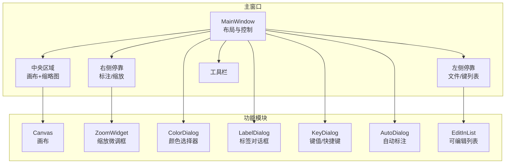

**图表来源**
- [PPOCRLabel.py](file://PPOCRLabel.py#L276-L541)
- [canvas.py](file://libs/canvas.py#L32-L120)
- [zoomWidget.py](file://libs/zoomWidget.py#L19-L35)
- [colorDialog.py](file://libs/colorDialog.py#L17-L42)
- [labelDialog.py](file://libs/labelDialog.py#L30-L107)
- [keyDialog.py](file://libs/keyDialog.py#L27-L209)
- [autoDialog.py](file://libs/autoDialog.py#L103-L196)
- [editinlist.py](file://libs/editinlist.py#L7-L34)

## 详细组件分析

### 主窗口布局与停靠面板
- 左侧停靠面板：文件列表与键列表（KIE 模式启用），支持最大高度与只读特性，便于浏览与选择。
- 右侧停靠面板：标注列表与索引列表并列，同步滚动；底部工具箱包含保存、删除、重排等按钮。
- 中央区域：画布居中，下方为缩略图导航（上一张/下一张）与图标列表。
- 右侧停靠面板：图像缩放滑条，半透明背景与可浮动特性，便于实时调节缩放。
- 工具栏：统一尺寸与风格，无边距与无框架，按钮样式继承自工具栏。

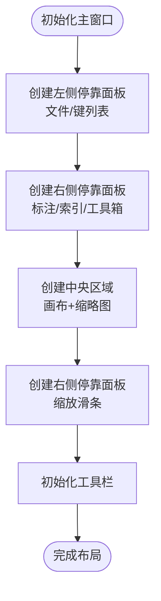

**图表来源**
- [PPOCRLabel.py](file://PPOCRLabel.py#L276-L541)
- [toolBar.py](file://libs/toolBar.py#L18-L48)

**章节来源**
- [PPOCRLabel.py](file://PPOCRLabel.py#L276-L541)
- [toolBar.py](file://libs/toolBar.py#L18-L48)

### 画布 Canvas 的渲染与交互
- 渲染：根据缩放与偏移绘制图像与标注框，支持自适应字体大小、高亮顶点与拖拽阴影。
- 交互：鼠标拖动移动/缩放、右键菜单、键盘方向键微调、Esc 取消绘制、回车闭合多边形。
- 状态：维护选中形状、高亮顶点、绘制模式、锁定形状等状态，支持撤销栈与形状复制。

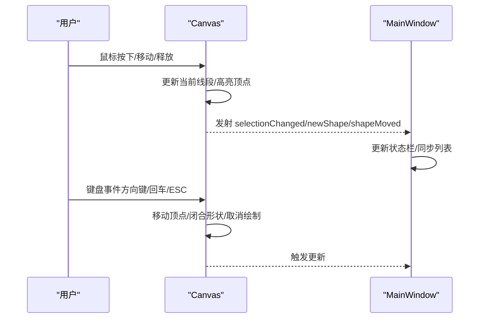

**图表来源**
- [canvas.py](file://libs/canvas.py#L129-L326)
- [canvas.py](file://libs/canvas.py#L571-L661)
- [canvas.py](file://libs/canvas.py#L715-L736)
- [canvas.py](file://libs/canvas.py#L737-L800)

**章节来源**
- [canvas.py](file://libs/canvas.py#L32-L120)
- [canvas.py](file://libs/canvas.py#L129-L326)
- [canvas.py](file://libs/canvas.py#L571-L661)
- [canvas.py](file://libs/canvas.py#L715-L800)

### 工具栏与按钮设计
- 统一尺寸：工具按钮最小尺寸动态取最大值，确保按钮在不同风格下保持一致视觉密度。
- 无边距与无框架：工具栏布局无间距与外边距，窗口标志去除边框，提升沉浸式体验。
- 图标与提示：通过工具方法生成图标与动作，支持快捷键与状态提示。

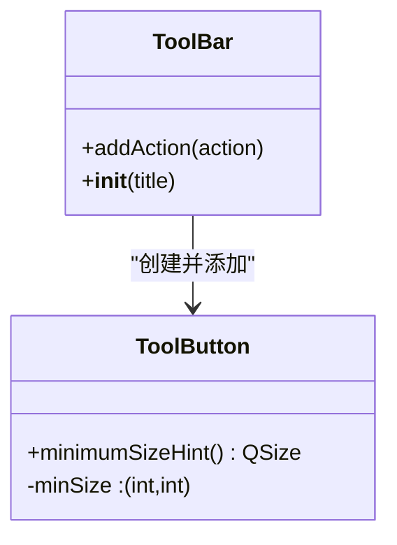

**图表来源**
- [toolBar.py](file://libs/toolBar.py#L18-L48)

**章节来源**
- [toolBar.py](file://libs/toolBar.py#L18-L48)
- [utils.py](file://libs/utils.py#L33-L83)

### 标签对话框 LabelDialog
- 输入与补全：单行文本输入，支持历史标签补全；确认/取消按钮带图标。
- 交互行为：弹出时聚焦并根据光标位置适配显示区域，避免越界。
- 数据校验：去除首尾空白，保证输入合法性。

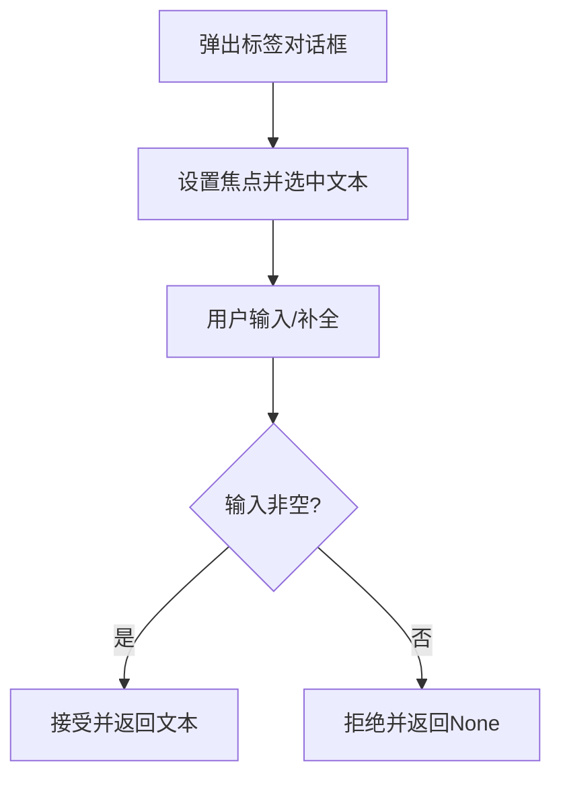

**图表来源**
- [labelDialog.py](file://libs/labelDialog.py#L30-L107)

**章节来源**
- [labelDialog.py](file://libs/labelDialog.py#L30-L107)

### 颜色选择器 ColorDialog
- 功能：支持透明通道与默认恢复按钮；提供当前颜色获取与默认值设置。
- 行为：点击“恢复默认”将当前颜色重置为默认值。

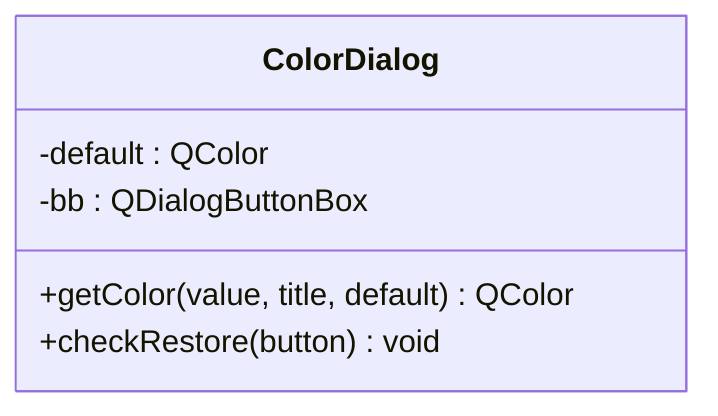

**图表来源**
- [colorDialog.py](file://libs/colorDialog.py#L17-L42)

**章节来源**
- [colorDialog.py](file://libs/colorDialog.py#L17-L42)

### 快捷键/键值对话框 KeyDialog
- 输入与列表：支持文本输入与标签列表，支持升序/拖拽排序或内部移动。
- 补全与旗标：支持前缀/包含两种补全模式；按标签名匹配动态更新旗标复选框。
- 交互：上下键在列表内导航，双击确认；弹出时根据光标位置适配显示。

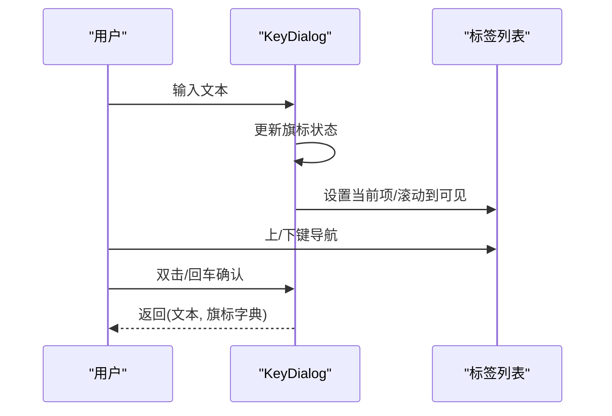

**图表来源**
- [keyDialog.py](file://libs/keyDialog.py#L27-L209)

**章节来源**
- [keyDialog.py](file://libs/keyDialog.py#L27-L209)

### 自动标注对话框 AutoDialog
- 多线程：工作线程逐张识别，进度条与列表实时反馈；支持取消中断。
- 体验：窗口模态，显示剩余时间估算；完成后解锁确认按钮。

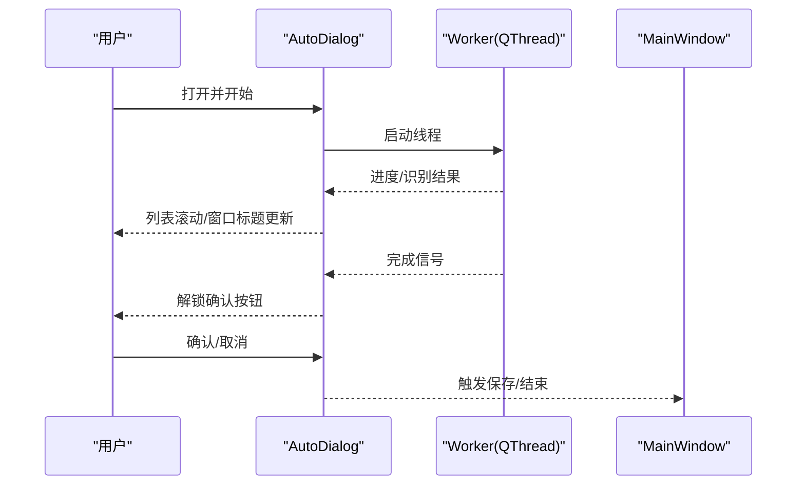

**图表来源**
- [autoDialog.py](file://libs/autoDialog.py#L22-L196)

**章节来源**
- [autoDialog.py](file://libs/autoDialog.py#L22-L196)

### 缩放控件 ZoomWidget
- 微调框：范围 1%-500%，居中对齐，无上下按钮，仅数字输入。
- 提示：工具提示与状态提示一致，便于无障碍使用。

**章节来源**
- [zoomWidget.py](file://libs/zoomWidget.py#L19-L35)

### 可编辑列表 EditInList
- 行内编辑：点击即进入持久编辑模式，回车/焦点离开关闭编辑。
- 交互：禁用双击展开，避免误触；按键事件支持快速关闭编辑。

**章节来源**
- [editinlist.py](file://libs/editinlist.py#L7-L34)

### 设置与本地化
- 设置持久化：使用 pickle 将设置保存至用户主目录下的配置文件，支持加载/保存/重置。
- 字符串资源：通过 StringBundle 加载多语言属性文件，支持回退链与 UTF-8 编码。
- 国际化：主窗口根据语言参数选择中/英字符串包，菜单与对话框文本动态更新。

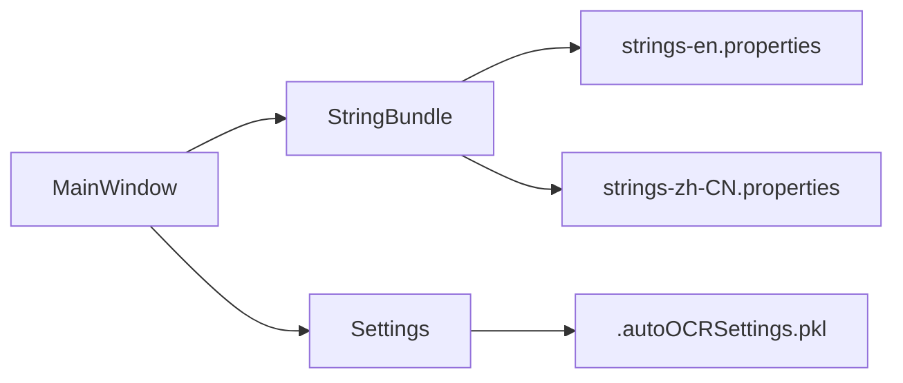

**图表来源**
- [stringBundle.py](file://libs/stringBundle.py#L29-L89)
- [strings-en.properties](file://resources/strings/strings-en.properties#L1-L122)
- [strings-zh-CN.properties](file://resources/strings/strings-zh-CN.properties#L1-L122)
- [settings.py](file://libs/settings.py#L21-L62)
- [PPOCRLabel.py](file://PPOCRLabel.py#L176-L191)

**章节来源**
- [settings.py](file://libs/settings.py#L21-L62)
- [stringBundle.py](file://libs/stringBundle.py#L29-L89)
- [strings-en.properties](file://resources/strings/strings-en.properties#L1-L122)
- [strings-zh-CN.properties](file://resources/strings/strings-zh-CN.properties#L1-L122)
- [PPOCRLabel.py](file://PPOCRLabel.py#L176-L191)

## 依赖关系分析
- 主窗口对各模块的依赖清晰：布局依赖工具栏与停靠面板；交互依赖画布与对话框；国际化依赖字符串包与设置。
- 低耦合高内聚：对话框与工具组件以参数形式注入主窗口，减少直接耦合。
- 外部依赖：Qt5 GUI/Widgets、OpenCV、PaddleOCR，用于图像处理与识别。

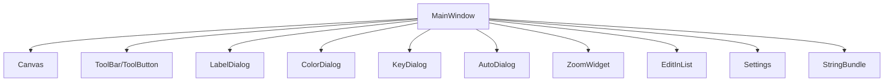

**图表来源**
- [PPOCRLabel.py](file://PPOCRLabel.py#L143-L541)
- [canvas.py](file://libs/canvas.py#L32-L120)
- [toolBar.py](file://libs/toolBar.py#L18-L48)
- [labelDialog.py](file://libs/labelDialog.py#L30-L107)
- [colorDialog.py](file://libs/colorDialog.py#L17-L42)
- [keyDialog.py](file://libs/keyDialog.py#L27-L209)
- [autoDialog.py](file://libs/autoDialog.py#L103-L196)
- [zoomWidget.py](file://libs/zoomWidget.py#L19-L35)
- [editinlist.py](file://libs/editinlist.py#L7-L34)
- [settings.py](file://libs/settings.py#L21-L62)
- [stringBundle.py](file://libs/stringBundle.py#L29-L89)

**章节来源**
- [PPOCRLabel.py](file://PPOCRLabel.py#L143-L541)

## 性能考量
- 画布渲染：抗锯齿与高质量渲染提升视觉效果，但需注意在大图与大量标注场景下的刷新频率。
- 自动标注：多线程异步处理，进度与结果分发避免阻塞 UI；建议限制同时识别任务数量。
- 缩放与滚动：缩放滑条与滚轮事件分离，避免频繁重绘；合理设置最小尺寸与透明背景。
- 字体自适应：根据图像尺寸动态调整标注字体，兼顾可读性与性能。

[本节为通用指导，无需列出具体文件来源]

## 故障排查指南
- 对话框弹出越界：检查父窗口几何与光标位置映射，确保在全局坐标系下进行边界约束。
- 颜色选择器默认值无效：确认默认值已设置且“恢复默认”按钮角色匹配。
- 缩放控件数值异常：核对范围与对齐方式，避免输入非法字符。
- 设置加载失败：查看日志警告与配置文件是否存在，必要时重置设置。
- 画布拖拽卡顿：检查是否频繁触发重绘，适当降低刷新频率或合并绘制批次。

**章节来源**
- [labelDialog.py](file://libs/labelDialog.py#L83-L107)
- [colorDialog.py](file://libs/colorDialog.py#L31-L42)
- [zoomWidget.py](file://libs/zoomWidget.py#L19-L35)
- [settings.py](file://libs/settings.py#L46-L54)
- [canvas.py](file://libs/canvas.py#L571-L661)

## 结论
PPOCRLabel 的界面设计以模块化与高内聚为核心，通过统一的工具栏与对话框风格、清晰的停靠面板布局与强大的画布交互能力，实现了高效、直观的标注体验。国际化与设置持久化保障了跨语言与跨设备的一致性。建议在后续版本中进一步优化大图渲染性能与批量操作的反馈机制，持续提升用户体验。

[本节为总结性内容，无需列出具体文件来源]

## 附录
- 使用指南要点
  - 使用工具栏按钮切换创建/编辑模式，配合键盘快捷键进行微调与闭合。
  - 通过标签对话框与键值对话框快速录入与管理标签，利用补全与旗标提升效率。
  - 使用缩放滑条与缩放微调框精细控制视图，结合画布滚动与平移完成标注。
  - 在 KIE 模式下使用键列表与键值对话框管理关键字类别。
- 主题与定制
  - 当前主题以系统默认控件为主，可通过样式表扩展按钮尺寸与间距一致性。
  - 建议在不破坏现有布局的前提下，增加浅/深色主题切换与字体大小偏好设置。
- 国际化支持
  - 通过字符串包与属性文件实现中英文切换，新增词条需同步更新两份属性文件。

[本节为补充性内容，无需列出具体文件来源]