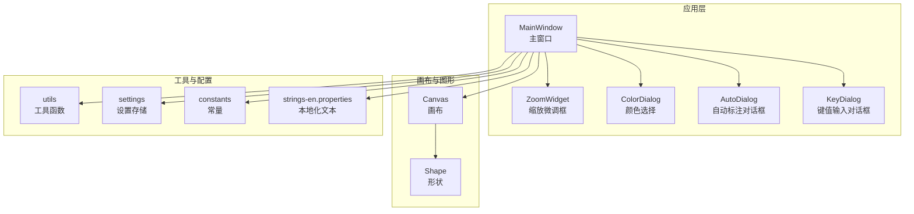
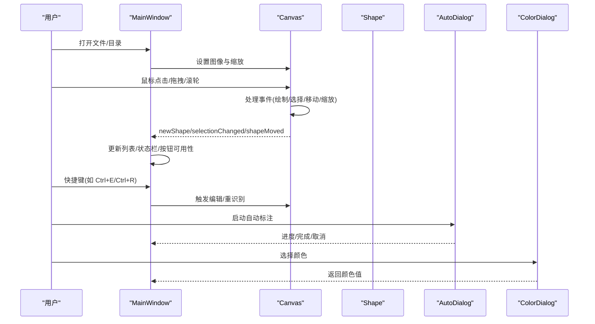
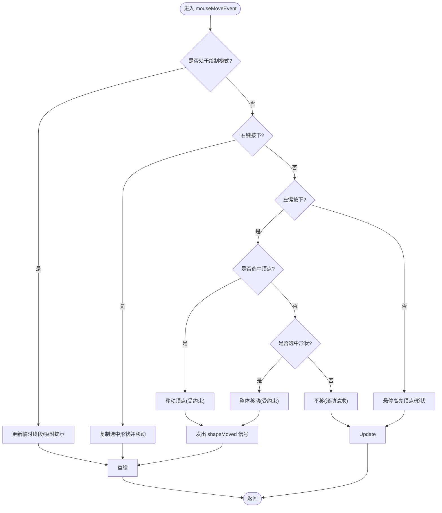
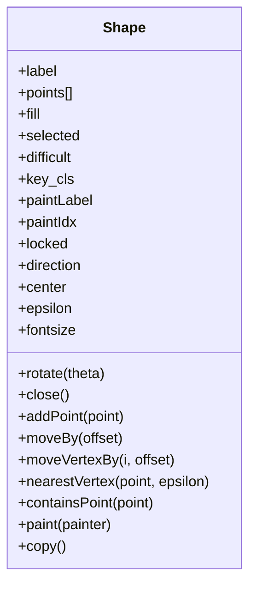
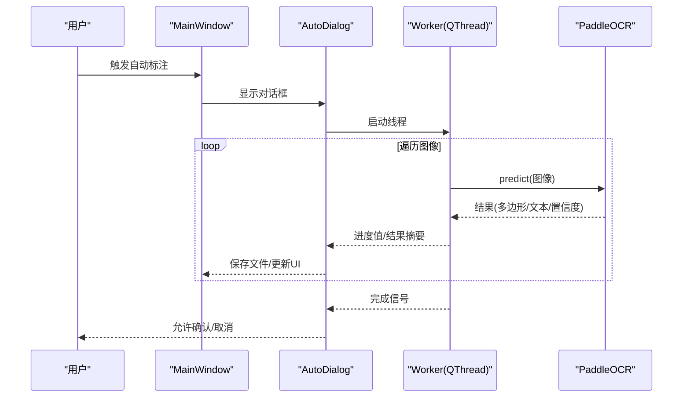
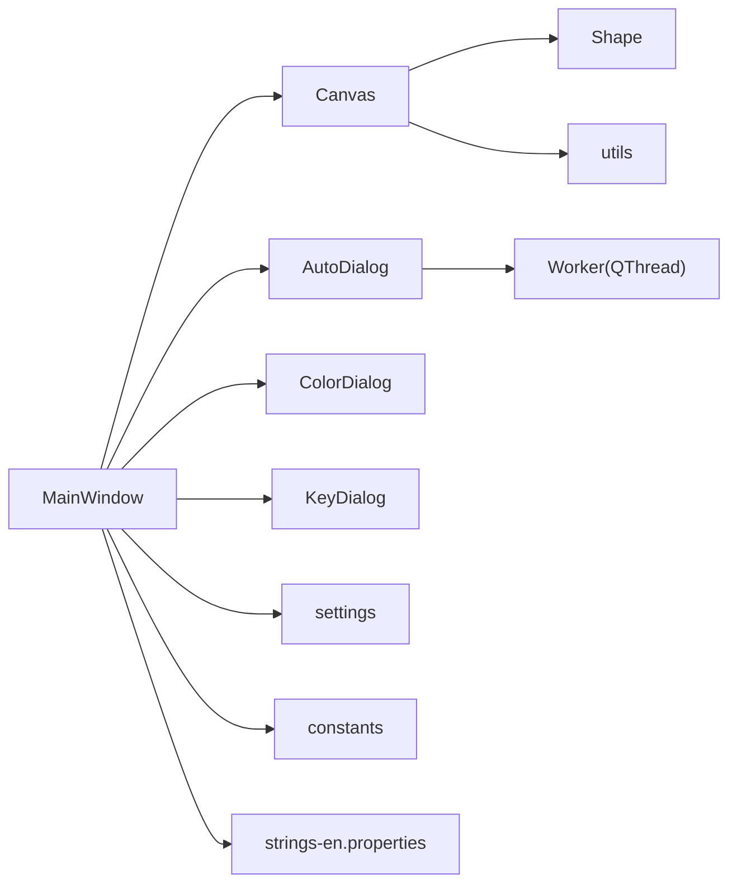

# 界面交互模式

<cite>
**本文引用的文件**
- [PPOCRLabel.py](file://PPOCRLabel.py)
- [canvas.py](file://libs/canvas.py)
- [shape.py](file://libs/shape.py)
- [keyDialog.py](file://libs/keyDialog.py)
- [autoDialog.py](file://libs/autoDialog.py)
- [zoomWidget.py](file://libs/zoomWidget.py)
- [colorDialog.py](file://libs/colorDialog.py)
- [utils.py](file://libs/utils.py)
- [constants.py](file://libs/constants.py)
- [settings.py](file://libs/settings.py)
- [strings-en.properties](file://resources/strings/strings-en.properties)
</cite>

## 目录
1. [简介](#简介)
2. [项目结构](#项目结构)
3. [核心组件](#核心组件)
4. [架构总览](#架构总览)
5. [详细组件分析](#详细组件分析)
6. [依赖关系分析](#依赖关系分析)
7. [性能考量](#性能考量)
8. [故障排查指南](#故障排查指南)
9. [结论](#结论)
10. [附录](#附录)

## 简介
本文件系统化梳理 PPOCRLabel 的界面交互模式，覆盖鼠标操作、键盘快捷键、拖拽与手势控制；详述画布交互（标注框创建、编辑、移动、缩放、旋转）；解释界面状态管理与用户反馈机制（进度指示、错误提示、成功确认）；并给出可访问性与体验优化建议及常见问题解决方案。目标是帮助不同技术背景的用户高效掌握与使用该标注工具。

## 项目结构
- 应用入口为主窗口类，负责菜单、工具栏、画布、列表面板、缩放控件等的组织与事件转发。
- 画布模块承载图形绘制与交互逻辑，形状对象负责几何与渲染。
- 对话框模块提供标签输入、颜色选择、自动标注进度等交互。
- 工具模块提供快捷键格式化、校验器、图像处理等通用能力。
- 资源与国际化提供字符串与图标资源。

图表来源
- [PPOCRLabel.py](file://PPOCRLabel.py#L143-L200)
- [canvas.py](file://libs/canvas.py#L32-L120)
- [shape.py](file://libs/shape.py#L35-L90)
- [zoomWidget.py](file://libs/zoomWidget.py#L19-L35)
- [colorDialog.py](file://libs/colorDialog.py#L17-L42)
- [autoDialog.py](file://libs/autoDialog.py#L103-L146)
- [keyDialog.py](file://libs/keyDialog.py#L27-L92)
- [utils.py](file://libs/utils.py#L51-L120)
- [settings.py](file://libs/settings.py#L21-L62)
- [constants.py](file://libs/constants.py#L13-L33)
- [strings-en.properties](file://resources/strings/strings-en.properties#L1-L122)

章节来源
- [PPOCRLabel.py](file://PPOCRLabel.py#L143-L200)
- [canvas.py](file://libs/canvas.py#L32-L120)
- [shape.py](file://libs/shape.py#L35-L90)
- [zoomWidget.py](file://libs/zoomWidget.py#L19-L35)
- [colorDialog.py](file://libs/colorDialog.py#L17-L42)
- [autoDialog.py](file://libs/autoDialog.py#L103-L146)
- [keyDialog.py](file://libs/keyDialog.py#L27-L92)
- [utils.py](file://libs/utils.py#L51-L120)
- [settings.py](file://libs/settings.py#L21-L62)
- [constants.py](file://libs/constants.py#L13-L33)
- [strings-en.properties](file://resources/strings/strings-en.properties#L1-L122)

## 核心组件
- 主窗口 MainWindow：构建界面、注册动作与快捷键、连接画布信号、管理状态与模型加载。
- Canvas 画布：鼠标/键盘事件处理、绘制与高亮、形状移动/缩放/旋转、滚动与缩放请求。
- Shape 形状：几何表示、顶点高亮、路径绘制、文本与索引绘制、旋转与中心计算。
- ZoomWidget 缩放微调框：百分比缩放输入与显示。
- ColorDialog 颜色选择：支持透明度与默认恢复。
- AutoDialog 自动标注：线程执行 OCR、进度条、时间预估、结果展示。
- KeyDialog 键值输入：标签输入、历史、补全、旗标。
- utils 工具：动作创建、快捷键格式化、距离计算、图像裁剪等。
- settings/settings 常量：设置持久化、配置项键名。

章节来源
- [PPOCRLabel.py](file://PPOCRLabel.py#L662-L891)
- [canvas.py](file://libs/canvas.py#L129-L398)
- [shape.py](file://libs/shape.py#L142-L210)
- [zoomWidget.py](file://libs/zoomWidget.py#L19-L35)
- [colorDialog.py](file://libs/colorDialog.py#L17-L42)
- [autoDialog.py](file://libs/autoDialog.py#L103-L196)
- [keyDialog.py](file://libs/keyDialog.py#L27-L209)
- [utils.py](file://libs/utils.py#L51-L120)
- [settings.py](file://libs/settings.py#L21-L62)
- [constants.py](file://libs/constants.py#L13-L33)

## 架构总览
主窗口作为中枢，将用户交互转化为画布事件与业务逻辑调用，并通过信号与槽实现解耦。画布内部维护形状集合与当前绘制状态，响应鼠标与键盘事件，驱动 UI 列表与状态栏更新。

图表来源
- [PPOCRLabel.py](file://PPOCRLabel.py#L549-L891)
- [canvas.py](file://libs/canvas.py#L129-L398)
- [autoDialog.py](file://libs/autoDialog.py#L103-L196)
- [colorDialog.py](file://libs/colorDialog.py#L31-L42)

## 详细组件分析

### 画布交互模式（Canvas）
- 模式切换
  - 创建模式：启用绘制，允许按点添加或四点闭合。
  - 编辑模式：支持选择、移动、缩放、旋转、删除、复制。
- 鼠标交互
  - 左键：在创建模式下添加点；在编辑模式下选择/移动形状或顶点；无选择时触发平移。
  - 右键：在编辑模式下进行多选；释放时弹出上下文菜单。
  - 双击：在创建模式下尝试闭合形状。
  - 滚轮：配合 Ctrl 进行缩放，否则进行滚动。
- 键盘交互
  - ESC：取消当前绘制。
  - 回车：闭合当前绘制。
  - 方向键：移动选中形状。
  - Z/X/C/V/B：高亮并逐顶点移动。
  - X：旋转选中形状（循环角度）。
- 绘制与高亮
  - 绘制时显示临时线段与吸附到起点的颜色提示。
  - 鼠标悬停高亮顶点或整型，改变光标样式。
- 移动与缩放
  - 支持多选移动与边界约束。
  - 支持正方形约束与四点绘制。
- 存储与撤销
  - 每次移动结束记录备份，支持撤销。

图表来源
- [canvas.py](file://libs/canvas.py#L129-L253)
- [canvas.py](file://libs/canvas.py#L447-L521)
- [canvas.py](file://libs/canvas.py#L682-L697)

章节来源
- [canvas.py](file://libs/canvas.py#L129-L398)
- [canvas.py](file://libs/canvas.py#L447-L521)
- [canvas.py](file://libs/canvas.py#L682-L697)

### 形状对象（Shape）
- 几何与渲染
  - 维护点序列、闭合状态、中心与方向。
  - 绘制路径、顶点、标签与索引文本，字体大小自适应。
- 顶点高亮
  - 支持近邻检测与移动高亮，区分近邻与移动模式。
- 旋转
  - 围绕中心旋转，更新方向角。
- 复制与比较
  - 提供深拷贝与点序列比较，用于撤销/重做。

图表来源
- [shape.py](file://libs/shape.py#L35-L90)
- [shape.py](file://libs/shape.py#L142-L210)
- [shape.py](file://libs/shape.py#L261-L275)

章节来源
- [shape.py](file://libs/shape.py#L91-L140)
- [shape.py](file://libs/shape.py#L142-L210)
- [shape.py](file://libs/shape.py#L261-L275)

### 键盘快捷键与动作
- 快捷键来源
  - 动作创建时绑定快捷键与提示信息，统一由 utils.formatShortcut 格式化显示。
  - 本地化字符串提供英文/中文提示文本。
- 常用快捷键
  - W/Q/Home：创建矩形/四点框
  - Ctrl+E：编辑标签
  - Ctrl+R/Ctrl+Shift+R：单框/整图重识别
  - Ctrl+C：复制选中框
  - Backspace/Delete：删除
  - Ctrl+V/End：确认本张图片
  - 方向键：移动选中框
  - Z/X/C/V/B：逐顶点移动
  - Ctrl++/Ctrl+--：缩放
  - Ctrl+F/Ctrl+Shift+F：适配窗口/宽度
  - Ctrl+Alt+L/R：旋转
- 动作注册
  - MainWindow 在初始化时批量创建动作并绑定槽函数，启用/禁用随状态变化。

章节来源
- [PPOCRLabel.py](file://PPOCRLabel.py#L662-L891)
- [utils.py](file://libs/utils.py#L51-L82)
- [utils.py](file://libs/utils.py#L108-L110)
- [strings-en.properties](file://resources/strings/strings-en.properties#L1-L122)

### 自动标注与进度反馈（AutoDialog）
- 线程与信号
  - Worker 线程遍历图像列表，调用 OCR 获取结果，通过信号更新进度条、列表与窗口标题。
  - 支持取消，终止线程并释放资源。
- 用户反馈
  - 进度条实时更新，窗口标题显示剩余时间估计。
  - 列表展示每张图的识别结果摘要。
- 错误处理
  - 小尺寸图像跳过识别并记录警告。
  - 异常捕获并记录日志。

图表来源
- [autoDialog.py](file://libs/autoDialog.py#L22-L101)
- [autoDialog.py](file://libs/autoDialog.py#L103-L196)

章节来源
- [autoDialog.py](file://libs/autoDialog.py#L22-L101)
- [autoDialog.py](file://libs/autoDialog.py#L103-L196)

### 颜色选择与状态栏
- 颜色选择
  - ColorDialog 支持透明度通道与默认恢复按钮。
- 状态栏
  - Canvas 在鼠标移动时更新坐标显示；在创建模式下同时显示宽高。
  - MainWindow 根据文件打开状态与按钮可用性动态调整 UI。

章节来源
- [colorDialog.py](file://libs/colorDialog.py#L17-L42)
- [canvas.py](file://libs/canvas.py#L133-L150)

### 键值输入（KIE 模式）
- KeyDialog
  - 文本输入与历史列表，支持补全与旗标。
  - 键盘上下键在列表与输入框间传递，提升可访问性。
- KIE 模式联动
  - 主窗口根据选中形状的关键字段同步键列表当前项。

章节来源
- [keyDialog.py](file://libs/keyDialog.py#L27-L209)
- [PPOCRLabel.py](file://PPOCRLabel.py#L1629-L1647)

## 依赖关系分析
- 组件耦合
  - MainWindow 与 Canvas 通过信号/槽松耦合；Canvas 仅依赖 Shape 与 utils。
  - AutoDialog 与 Worker 通过信号/槽通信，避免阻塞主线程。
- 外部依赖
  - 图像处理依赖 OpenCV 与 NumPy。
  - OCR 依赖 PaddleOCR。
- 配置与设置
  - settings 持久化配置项，constants 定义键名，utils 提供通用工具。

图表来源
- [PPOCRLabel.py](file://PPOCRLabel.py#L143-L200)
- [canvas.py](file://libs/canvas.py#L32-L120)
- [shape.py](file://libs/shape.py#L35-L90)
- [autoDialog.py](file://libs/autoDialog.py#L22-L101)
- [settings.py](file://libs/settings.py#L21-L62)
- [constants.py](file://libs/constants.py#L13-L33)
- [strings-en.properties](file://resources/strings/strings-en.properties#L1-L122)

章节来源
- [PPOCRLabel.py](file://PPOCRLabel.py#L143-L200)
- [canvas.py](file://libs/canvas.py#L32-L120)
- [shape.py](file://libs/shape.py#L35-L90)
- [autoDialog.py](file://libs/autoDialog.py#L22-L101)
- [settings.py](file://libs/settings.py#L21-L62)
- [constants.py](file://libs/constants.py#L13-L33)
- [strings-en.properties](file://resources/strings/strings-en.properties#L1-L122)

## 性能考量
- 渲染优化
  - 画布采用抗锯齿与平滑变换，字体大小随图像尺寸自适应，减少过度绘制。
- 事件处理
  - Canvas 在绘制/移动时仅重绘必要区域，避免全量刷新。
- 多线程
  - 自动标注在独立线程执行，避免 UI 卡顿；通过信号/槽安全更新 UI。
- I/O 与缓存
  - 设置持久化于用户主目录，避免重复加载配置。

[本节为通用指导，无需特定文件引用]

## 故障排查指南
- 无法缩放/滚动
  - 确认已打开图像且缩放控件启用；检查 Ctrl+滚轮与方向键组合是否正确。
- 无法创建/编辑框
  - 确认当前处于“创建”或“编辑”模式；检查按钮与快捷键是否可用。
- 删除/复制无效
  - 确保已选中形状；多选需按住 Ctrl 并点击。
- 自动标注卡住
  - 查看进度条与剩余时间；若取消后仍卡住，重启应用或检查日志。
- 颜色选择异常
  - 使用默认恢复按钮；确保未使用原生系统对话框导致功能受限。
- 键盘不可用
  - 确认焦点在画布或输入框；某些对话框可能需要先关闭再操作。

章节来源
- [PPOCRLabel.py](file://PPOCRLabel.py#L662-L891)
- [canvas.py](file://libs/canvas.py#L129-L398)
- [autoDialog.py](file://libs/autoDialog.py#L172-L196)
- [colorDialog.py](file://libs/colorDialog.py#L31-L42)

## 结论
PPOCRLabel 的交互体系以 Canvas 为核心，结合 MainWindow 的状态管理与工具模块，提供了直观高效的标注体验。通过清晰的鼠标/键盘映射、完善的进度与错误反馈、以及良好的可访问性设计，用户可以快速完成从创建到导出的全流程工作。建议在实际使用中优先掌握常用快捷键与模式切换，以提升效率。

[本节为总结，无需特定文件引用]

## 附录

### 交互指南（速查）
- 创建标注框
  - 矩形：W；四点：Q/Home；创建模式下左键点击/拖动，双击闭合。
- 编辑标注框
  - 选中后拖动移动；方向键移动；Z/X/C/V/B 逐顶点移动；右键多选。
- 缩放与视图
  - Ctrl++/Ctrl+--；Ctrl+F/Ctrl+Shift+F；滚轮配合 Ctrl。
- 识别与导出
  - Ctrl+R/Ctrl+Shift+R；Ctrl+V/End；导出 JSON/表格等。
- 颜色与标签
  - Ctrl+L；Ctrl+E；KIE 模式下键值输入与列表联动。

章节来源
- [PPOCRLabel.py](file://PPOCRLabel.py#L662-L891)
- [canvas.py](file://libs/canvas.py#L129-L398)
- [keyDialog.py](file://libs/keyDialog.py#L27-L209)