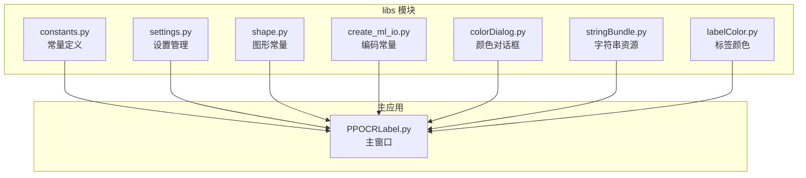
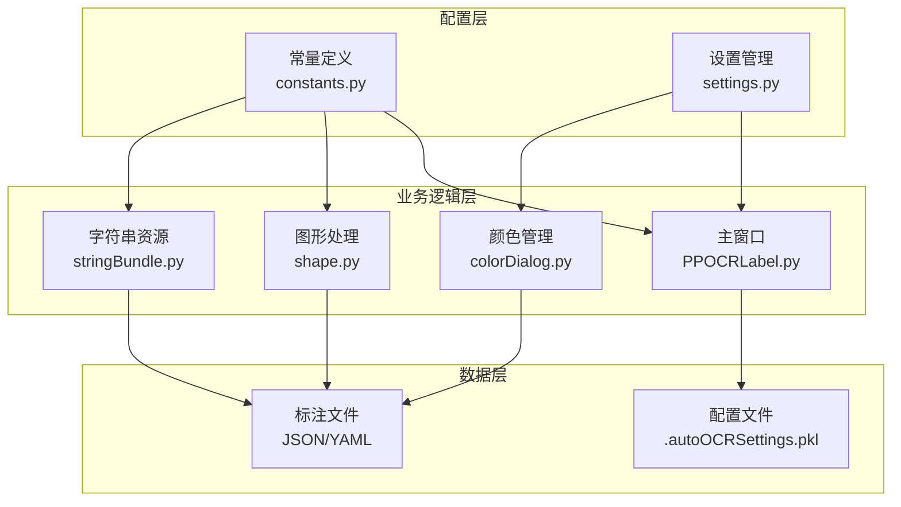
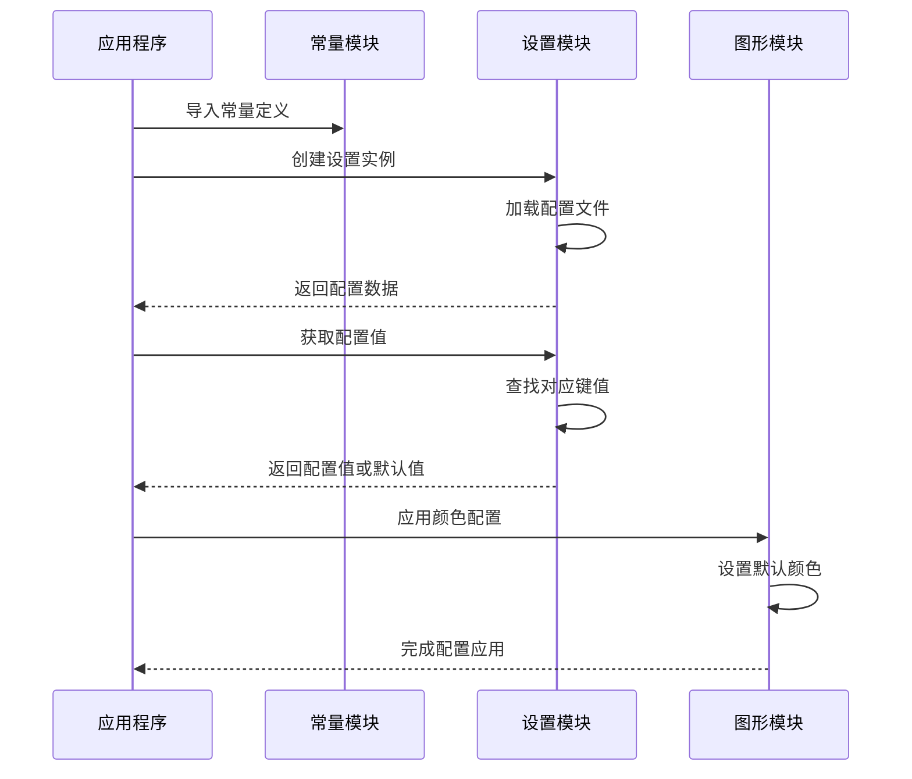
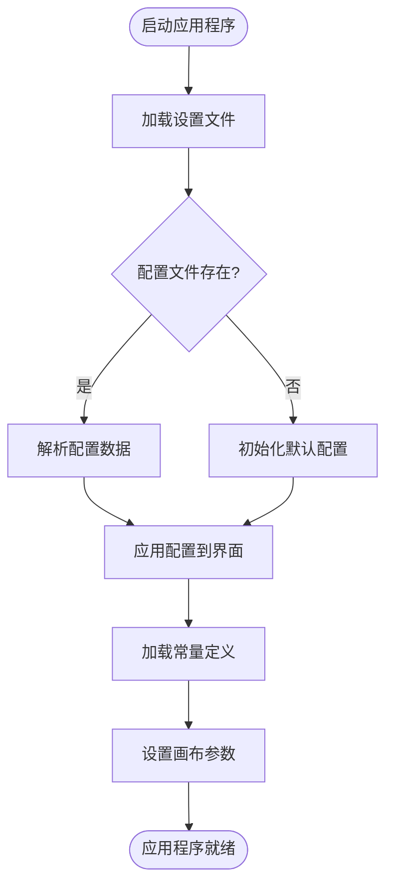
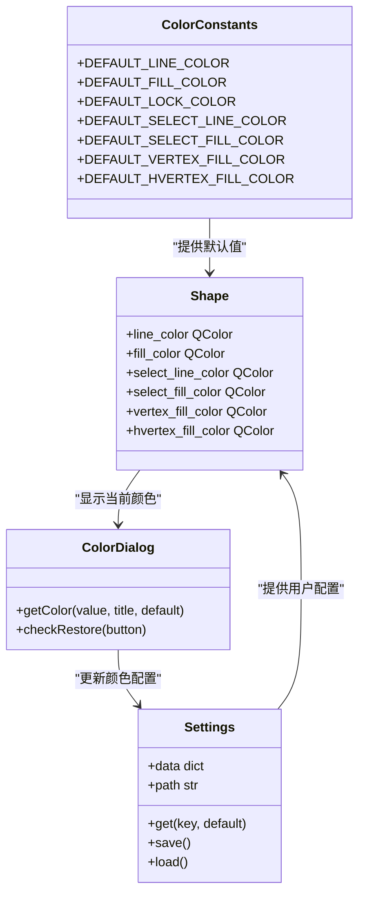
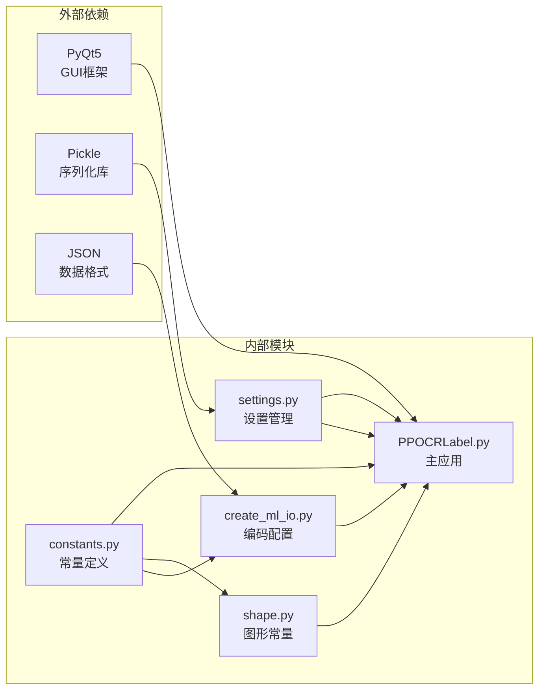

# 常量定义和配置项

<cite>
**本文档引用的文件**
- [libs/constants.py](file://libs/constants.py)
- [libs/settings.py](file://libs/settings.py)
- [PPOCRLabel.py](file://PPOCRLabel.py)
- [libs/shape.py](file://libs/shape.py)
- [libs/create_ml_io.py](file://libs/create_ml_io.py)
- [libs/colorDialog.py](file://libs/colorDialog.py)
- [libs/stringBundle.py](file://libs/stringBundle.py)
- [libs/labelColor.py](file://libs/labelColor.py)
- [libs/__init__.py](file://libs/__init__.py)
</cite>

## 目录
1. [简介](#简介)
2. [项目结构](#项目结构)
3. [核心组件](#核心组件)
4. [架构概览](#架构概览)
5. [详细组件分析](#详细组件分析)
6. [依赖关系分析](#依赖关系分析)
7. [性能考量](#性能考量)
8. [故障排除指南](#故障排除指南)
9. [结论](#结论)

## 简介

本文件详细说明了 PaddleOCR 标签工具项目中的常量定义和配置项管理系统。该系统通过统一的常量定义、设置存储机制和配置管理，为整个应用程序提供了稳定、可维护的配置基础。系统采用模块化设计，将不同类型的配置项按功能进行分类组织，确保代码的可读性和可维护性。

## 项目结构

该项目采用清晰的模块化架构，常量和配置管理主要集中在 `libs` 目录下：

**图表来源**
- [libs/constants.py](file://libs/constants.py#L1-L33)
- [libs/settings.py](file://libs/settings.py#L1-L62)
- [PPOCRLabel.py](file://PPOCRLabel.py#L86-L120)

**章节来源**
- [libs/constants.py](file://libs/constants.py#L1-L33)
- [libs/settings.py](file://libs/settings.py#L1-L62)
- [PPOCRLabel.py](file://PPOCRLabel.py#L86-L120)

## 核心组件

### 常量定义模块 (constants.py)

常量定义模块是整个配置系统的核心，包含了所有全局配置键名的统一定义。该模块采用简洁明了的命名规范，使用全大写字母加下划线的方式表示常量名称。

#### 主要常量分类

**窗口配置常量**
- `SETTING_WIN_SIZE`: 窗口尺寸配置
- `SETTING_WIN_POSE`: 窗口位置配置  
- `SETTING_WIN_GEOMETRY`: 窗口几何信息
- `SETTING_WIN_STATE`: 窗口状态

**颜色配置常量**
- `SETTING_LINE_COLOR`: 线条颜色配置
- `SETTING_FILL_COLOR`: 填充颜色配置
- `SETTING_DRAW_SQUARE`: 方形绘制模式

**文件操作常量**
- `SETTING_SAVE_DIR`: 保存目录配置
- `SETTING_LAST_OPEN_DIR`: 最近打开目录
- `SETTING_FILENAME`: 文件名配置
- `SETTING_RECENT_FILES`: 最近文件列表

**显示配置常量**
- `SETTING_PAINT_LABEL`: 显示标签配置
- `SETTING_PAINT_INDEX`: 显示索引配置
- `SETTING_SINGLE_CLASS`: 单类模式配置

**模式配置常量**
- `SETTING_ADVANCE_MODE`: 高级模式配置
- `SETTING_AUTO_SAVE`: 自动保存配置
- `SETTING_LABEL_FILE_FORMAT`: 标注文件格式

**格式常量**
- `FORMAT_PASCALVOC`: Pascal VOC 格式标识
- `FORMAT_YOLO`: YOLO 格式标识

**系统常量**
- `DEFAULT_ENCODING`: 默认编码格式 (UTF-8)

**章节来源**
- [libs/constants.py](file://libs/constants.py#L13-L32)

### 设置管理模块 (settings.py)

设置管理模块提供了完整的配置持久化解决方案，采用轻量级的二进制序列化方式存储用户偏好设置。

#### 核心功能特性

**数据存储机制**
- 使用 pickle 序列化技术进行配置持久化
- 默认存储在用户主目录下的隐藏文件中
- 支持配置文件的加载、保存和重置

**配置访问接口**
- 提供字典式的配置访问方式
- 支持默认值的优雅降级
- 包含完整的错误处理机制

**配置生命周期管理**
- 初始化时自动定位用户配置目录
- 支持配置文件的动态创建和删除
- 提供配置重置功能

**章节来源**
- [libs/settings.py](file://libs/settings.py#L21-L62)

### 图形常量模块 (shape.py)

图形常量模块定义了标注界面中使用的颜色和视觉属性的默认值，确保用户界面的一致性和可预测性。

#### 默认颜色定义

**基础颜色常量**
- `DEFAULT_LINE_COLOR`: 默认线条颜色 (RGB: 0, 255, 0, Alpha: 128)
- `DEFAULT_FILL_COLOR`: 默认填充颜色 (RGB: 255, 0, 0, Alpha: 128)
- `DEFAULT_LOCK_COLOR`: 锁定状态颜色 (RGB: 255, 0, 255)

**选择状态颜色**
- `DEFAULT_SELECT_LINE_COLOR`: 选中状态线条颜色 (RGB: 255, 255, 255)
- `DEFAULT_SELECT_FILL_COLOR`: 选中状态填充颜色 (RGB: 0, 128, 255, Alpha: 155)

**顶点状态颜色**
- `DEFAULT_VERTEX_FILL_COLOR`: 顶点填充颜色 (RGB: 0, 255, 0, Alpha: 255)
- `DEFAULT_HVERTEX_FILL_COLOR`: 高亮顶点颜色 (RGB: 255, 0, 0)

**视觉属性常量**
- `MIN_Y_LABEL`: 标签文本最小Y坐标偏移量
- `point_size`: 顶点绘制大小
- `epsilon`: 距离计算精度阈值

**章节来源**
- [libs/shape.py](file://libs/shape.py#L25-L31)

## 架构概览

常量系统在整个应用程序架构中扮演着基础设施的角色，为各个功能模块提供统一的配置标准。

**图表来源**
- [libs/constants.py](file://libs/constants.py#L13-L32)
- [libs/settings.py](file://libs/settings.py#L21-L62)
- [PPOCRLabel.py](file://PPOCRLabel.py#L168-L169)

## 详细组件分析

### 常量使用流程

**图表来源**
- [PPOCRLabel.py](file://PPOCRLabel.py#L86-L100)
- [libs/settings.py](file://libs/settings.py#L34-L37)
- [libs/shape.py](file://libs/shape.py#L42-L47)

### 配置加载流程

**图表来源**
- [libs/settings.py](file://libs/settings.py#L46-L54)
- [PPOCRLabel.py](file://PPOCRLabel.py#L168-L169)

### 颜色配置系统

颜色配置系统采用分层设计，从常量定义到实际应用形成了完整的配置链路。

**图表来源**
- [libs/shape.py](file://libs/shape.py#L25-L47)
- [libs/settings.py](file://libs/settings.py#L34-L37)
- [libs/colorDialog.py](file://libs/colorDialog.py#L31-L41)

**章节来源**
- [libs/shape.py](file://libs/shape.py#L25-L47)
- [libs/colorDialog.py](file://libs/colorDialog.py#L31-L41)

### 编码配置管理

编码配置系统确保了不同模块间的数据一致性，特别是在文件读写操作中。

#### 编码配置使用示例

**文件写入配置**
- 统一使用 UTF-8 编码进行文件输出
- 支持 JSON 格式的标准化存储
- 提供编码方法的集中管理

**国际化支持**
- 字符串资源采用 UTF-8 编码
- 支持多语言环境的配置切换
- 提供本地化字符串的统一管理

**章节来源**
- [libs/create_ml_io.py](file://libs/create_ml_io.py#L18-L24)
- [libs/stringBundle.py](file://libs/stringBundle.py#L79-L86)

## 依赖关系分析

常量系统与应用程序其他模块之间存在紧密的依赖关系，形成了稳定的依赖层次结构。

**图表来源**
- [libs/constants.py](file://libs/constants.py#L13-L32)
- [libs/settings.py](file://libs/settings.py#L14-L16)
- [libs/create_ml_io.py](file://libs/create_ml_io.py#L15-L19)

### 关键依赖关系

**常量依赖关系**
- `constants.py` 作为所有配置键名的唯一来源
- `shape.py` 依赖常量定义的颜色值
- `create_ml_io.py` 依赖默认编码常量

**设置依赖关系**
- `settings.py` 独立运行，不依赖其他模块
- 主应用通过导入设置模块获取配置
- 配置文件存储在用户主目录下

**模块耦合度分析**
- 常量模块与业务模块松耦合
- 设置模块提供独立的配置服务
- 各模块间通过明确的接口进行交互

**章节来源**
- [libs/constants.py](file://libs/constants.py#L13-L32)
- [libs/settings.py](file://libs/settings.py#L21-L62)
- [PPOCRLabel.py](file://PPOCRLabel.py#L86-L120)

## 性能考量

常量系统的设计充分考虑了性能优化和内存使用效率。

### 内存使用优化

**常量存储策略**
- 所有常量均为不可变对象，减少内存复制开销
- 使用字符串常量池提高字符串比较效率
- 颜色对象采用预定义实例，避免重复创建

**配置访问优化**
- 设置模块使用字典结构存储配置，提供 O(1) 访问时间
- 支持配置缓存机制，减少磁盘I/O操作
- 默认值处理采用延迟计算，仅在需要时创建

### 性能影响评估

**启动时间优化**
- 常量加载在模块导入时完成，避免运行时重复计算
- 设置文件只在应用启动时加载一次
- 配置变更采用增量更新策略

**运行时性能**
- 配置访问通过简单的方法调用实现
- 颜色计算采用高效的数值运算
- 字符串资源采用懒加载机制

## 故障排除指南

### 常见问题及解决方案

**配置文件损坏**
- 现象：设置加载失败，出现警告信息
- 解决方案：调用设置重置方法删除损坏的配置文件
- 预防措施：定期备份重要配置

**权限问题**
- 现象：无法保存配置到用户目录
- 解决方案：检查用户主目录的写入权限
- 预防措施：确保应用程序具有适当的文件系统权限

**编码问题**
- 现象：中文字符显示异常或乱码
- 解决方案：确认系统支持 UTF-8 编码
- 预防措施：在国际化环境中正确设置区域设置

**章节来源**
- [libs/settings.py](file://libs/settings.py#L52-L54)
- [libs/create_ml_io.py](file://libs/create_ml_io.py#L18-L24)

### 调试技巧

**配置验证**
- 使用日志记录配置加载过程
- 检查配置键值的有效性
- 验证配置数据类型和范围

**性能监控**
- 监控设置文件的读写频率
- 分析常量访问的热点区域
- 评估配置变更对性能的影响

## 结论

PaddleOCR 标签工具项目的常量定义和配置项管理系统展现了优秀的软件工程实践。通过模块化的常量定义、可靠的设置管理和高效的配置访问机制，系统实现了以下目标：

**设计优势**
- 统一的配置标准，避免了配置分散导致的维护困难
- 清晰的模块边界，提高了代码的可读性和可维护性
- 稳健的错误处理机制，确保了系统的可靠性

**扩展性考虑**
- 常量定义采用集中管理，便于添加新的配置项
- 设置模块提供了完整的生命周期管理
- 颜色和图形常量分离，支持灵活的视觉定制

**最佳实践建议**
- 新增配置项时遵循现有的命名规范
- 在修改现有常量时充分考虑向后兼容性
- 定期审查配置使用情况，清理不再使用的配置项
- 为重要的配置项提供合理的默认值和错误处理

该系统为 PaddleOCR 标签工具提供了坚实的基础，确保了应用程序在不同环境和使用场景下的稳定运行。