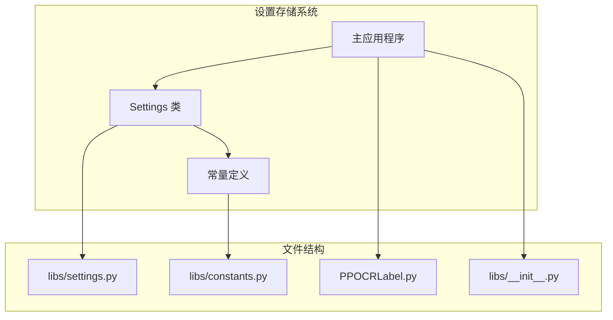
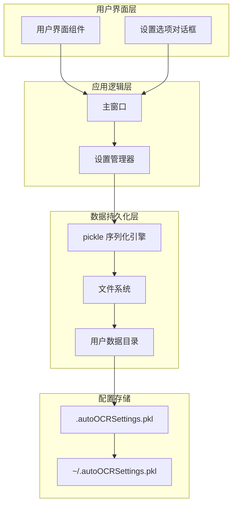
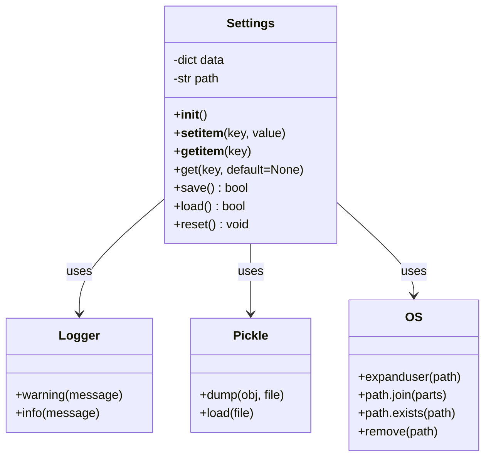
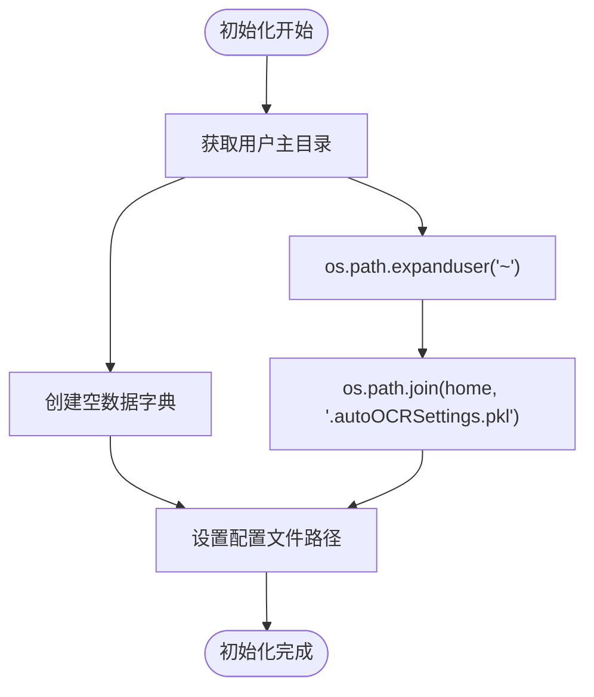
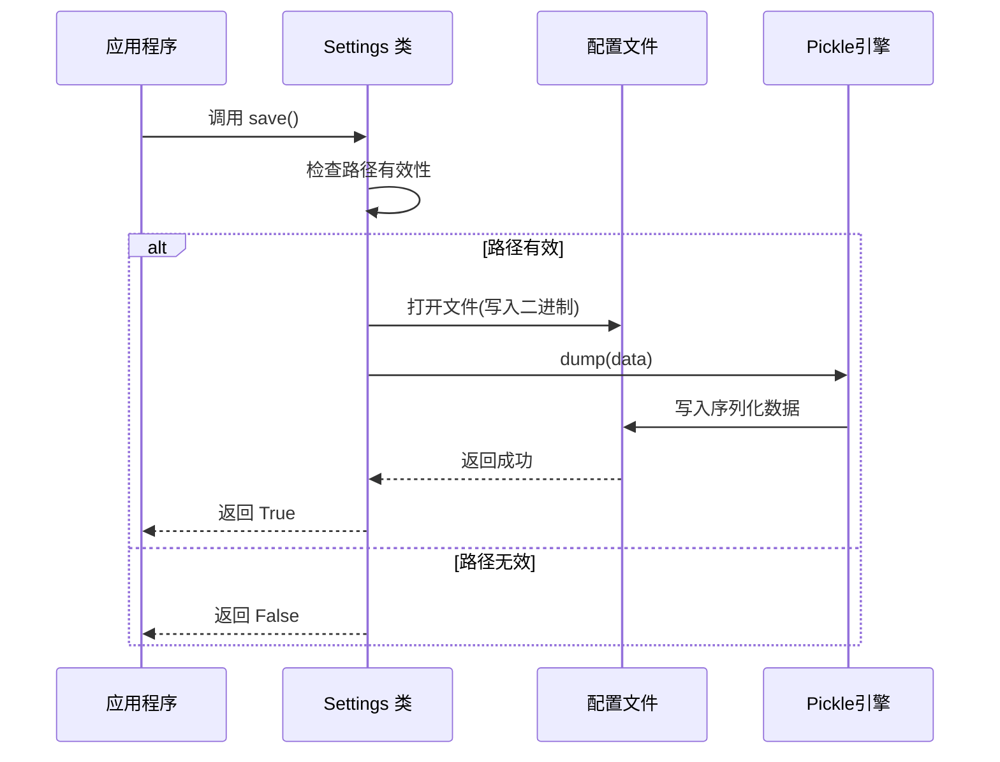
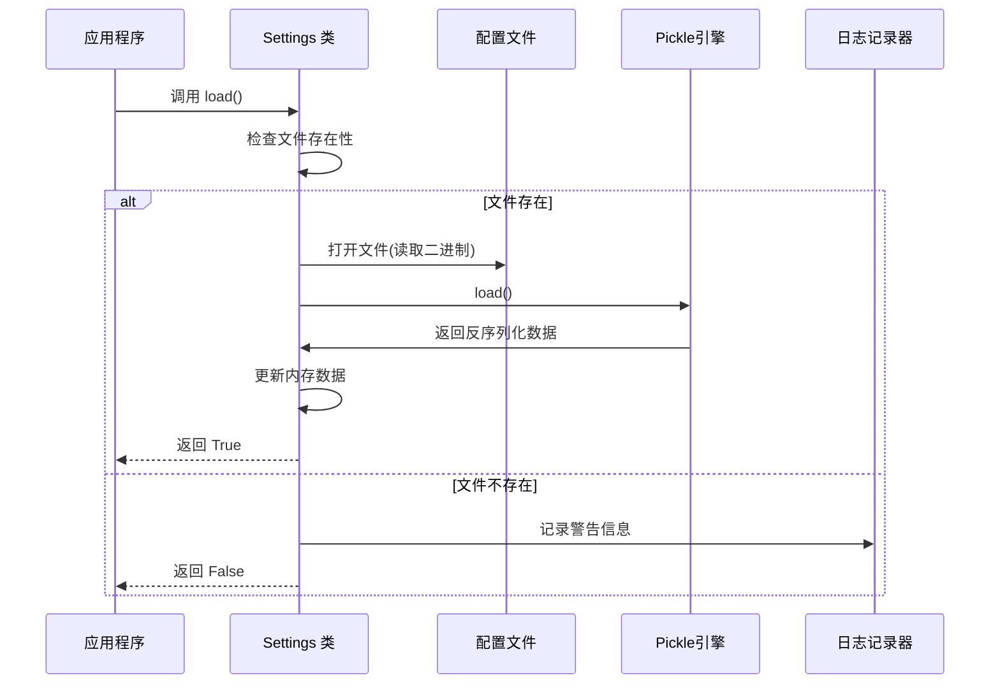
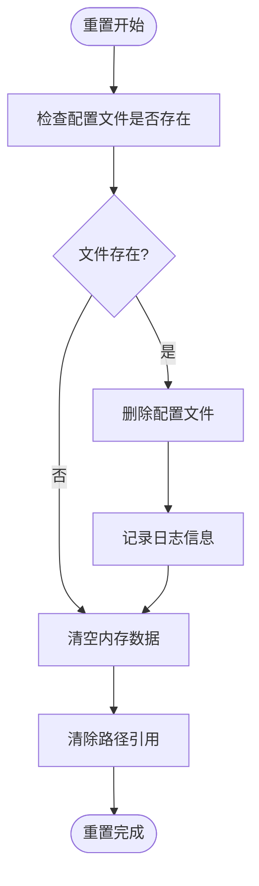
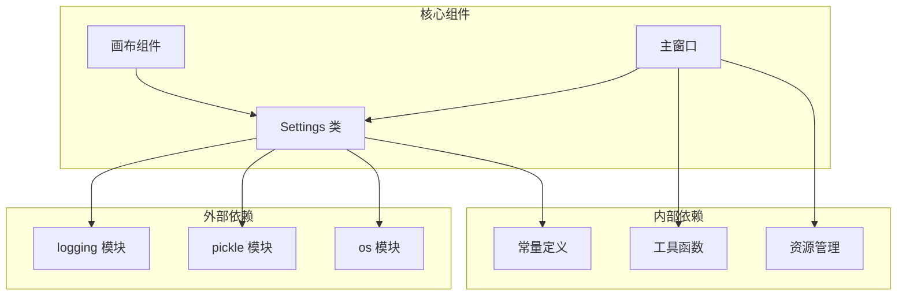

# 设置存储系统

<cite>
**本文档引用的文件**
- [libs/settings.py](file://libs/settings.py)
- [PPOCRLabel.py](file://PPOCRLabel.py)
- [libs/constants.py](file://libs/constants.py)
- [libs/__init__.py](file://libs/__init__.py)
</cite>

## 目录
1. [简介](#简介)
2. [项目结构](#项目结构)
3. [核心组件](#核心组件)
4. [架构概览](#架构概览)
5. [详细组件分析](#详细组件分析)
6. [依赖关系分析](#依赖关系分析)
7. [性能考虑](#性能考虑)
8. [故障排除指南](#故障排除指南)
9. [结论](#结论)
10. [附录](#附录)

## 简介

设置存储系统是 PPOCRLabel 应用程序的核心组件之一，负责管理用户偏好设置、应用程序配置和持久化数据。该系统基于 Python 的 pickle 序列化机制，提供简单而高效的设置存储解决方案。

系统的主要特点包括：
- 基于 pickle 的二进制序列化存储
- 跨平台兼容的用户主目录路径管理
- 灵活的键值对存储机制
- 完整的错误处理和恢复策略
- 支持设置重置和文件清理

## 项目结构

设置存储系统在项目中的组织结构如下：



**图表来源**
- [libs/settings.py](file://libs/settings.py#L1-L62)
- [libs/constants.py](file://libs/constants.py#L1-L33)
- [PPOCRLabel.py](file://PPOCRLabel.py#L120-L170)

**章节来源**
- [libs/settings.py](file://libs/settings.py#L1-L62)
- [libs/constants.py](file://libs/constants.py#L1-L33)
- [PPOCRLabel.py](file://PPOCRLabel.py#L120-L170)

## 核心组件

设置存储系统的核心由以下组件构成：

### Settings 类
Settings 类是整个设置系统的核心，提供了完整的设置管理功能：
- 设置数据的存储和检索
- 持久化机制（pickle 序列化）
- 文件路径管理
- 错误处理和恢复

### 常量定义
系统使用一组预定义的设置键名，确保设置项的一致性和可维护性：
- 窗口相关设置
- 颜色配置
- 用户界面选项
- 文件路径配置

### 主应用程序集成
主应用程序在启动时初始化设置系统，并在适当的时候保存用户配置。

**章节来源**
- [libs/settings.py](file://libs/settings.py#L21-L62)
- [libs/constants.py](file://libs/constants.py#L13-L32)
- [PPOCRLabel.py](file://PPOCRLabel.py#L167-L170)

## 架构概览

设置存储系统的整体架构采用简洁而高效的设计模式：



**图表来源**
- [libs/settings.py](file://libs/settings.py#L22-L26)
- [libs/settings.py](file://libs/settings.py#L39-L54)

## 详细组件分析

### Settings 类设计分析

Settings 类采用了面向对象的设计原则，提供了清晰的接口和健壮的实现：

#### 类结构图



**图表来源**
- [libs/settings.py](file://libs/settings.py#L21-L62)

#### 初始化流程

Settings 类的初始化过程非常简洁而高效：



**图表来源**
- [libs/settings.py](file://libs/settings.py#L22-L26)

#### 存储格式分析

系统采用 pickle 序列化作为存储格式，具有以下特点：

**存储格式特性：**
- **二进制序列化**：提供高效的存储和读取性能
- **类型保持**：完整保持 Python 对象的类型信息
- **跨平台兼容**：pickle 协议版本支持不同平台间的兼容性
- **安全性考虑**：仅适用于可信的数据源

**章节来源**
- [libs/settings.py](file://libs/settings.py#L14-L16)
- [libs/settings.py](file://libs/settings.py#L41-L42)

### 访问方法详解

#### __setitem__ 方法
提供字典式的设置赋值功能：
- 支持任意 Python 对象类型
- 自动更新内存中的数据结构
- 不立即持久化到磁盘

#### __getitem__ 方法  
提供字典式的设置获取功能：
- 直接从内存数据字典中检索
- 抛出 KeyError 异常当键不存在
- 提供快速的读取操作

#### get 方法
提供安全的设置获取功能：
- 支持默认值返回
- 避免 KeyError 异常
- 提供更友好的错误处理

**章节来源**
- [libs/settings.py](file://libs/settings.py#L28-L37)

### 持久化机制分析

#### 保存流程



**图表来源**
- [libs/settings.py](file://libs/settings.py#L39-L44)

#### 加载流程



**图表来源**
- [libs/settings.py](file://libs/settings.py#L46-L54)

#### 重置功能

重置功能提供了完整的设置清理能力：



**图表来源**
- [libs/settings.py](file://libs/settings.py#L56-L62)

**章节来源**
- [libs/settings.py](file://libs/settings.py#L39-L62)

### 生命周期管理

设置系统的生命周期管理包括以下几个阶段：

#### 创建阶段
- 初始化数据结构
- 设置默认文件路径
- 准备内存存储空间

#### 使用阶段
- 动态读取和更新设置
- 实时响应用户配置变化
- 维护数据一致性

#### 持久化阶段
- 定期保存用户配置
- 处理保存异常情况
- 确保数据完整性

#### 清理阶段
- 应用程序退出时的清理
- 文件系统资源释放
- 内存资源回收

**章节来源**
- [libs/settings.py](file://libs/settings.py#L22-L26)
- [libs/settings.py](file://libs/settings.py#L39-L62)

## 依赖关系分析

设置存储系统与其他组件的依赖关系如下：



**图表来源**
- [libs/settings.py](file://libs/settings.py#L14-L18)
- [PPOCRLabel.py](file://PPOCRLabel.py#L120-L121)

### 外部依赖分析

#### logging 模块
- **用途**：提供日志记录功能
- **应用场景**：设置加载失败时的警告信息
- **配置**：使用 PPOCRLabel 日志记录器

#### pickle 模块  
- **用途**：提供 Python 对象的序列化和反序列化
- **协议版本**：使用最高协议版本确保最佳性能
- **安全性**：仅处理可信的本地数据

#### os 模块
- **用途**：提供操作系统相关的功能
- **路径管理**：处理跨平台的文件路径
- **用户目录**：获取用户的主目录

**章节来源**
- [libs/settings.py](file://libs/settings.py#L14-L18)

### 内部依赖分析

#### 常量定义
系统使用预定义的设置键名，确保一致性和可维护性：
- 窗口尺寸和位置配置
- 颜色和样式设置
- 用户界面选项
- 文件路径配置

#### 工具函数
提供辅助功能支持设置系统的运行：
- 图标资源管理
- 快捷键格式化
- 数学计算工具

**章节来源**
- [libs/constants.py](file://libs/constants.py#L13-L32)
- [libs/utils.py](file://libs/utils.py#L1-L200)

## 性能考虑

设置存储系统在设计时充分考虑了性能因素：

### 存储效率
- **pickle 序列化**：提供高效的二进制存储格式
- **内存缓存**：所有设置数据存储在内存中
- **延迟保存**：只在必要时进行磁盘写入

### 访问性能
- **字典查找**：O(1) 时间复杂度的键值查找
- **直接内存访问**：避免不必要的文件 I/O
- **批量操作**：支持一次性设置多个配置项

### 内存管理
- **垃圾回收**：Python 自动管理内存回收
- **数据结构优化**：使用高效的字典数据结构
- **资源清理**：及时释放不再使用的资源

## 故障排除指南

### 常见问题及解决方案

#### 设置文件加载失败
**症状**：应用程序启动时设置未生效
**原因**：pickle 文件损坏或权限问题
**解决方案**：
1. 检查配置文件是否存在
2. 验证文件权限是否正确
3. 删除损坏的配置文件
4. 重启应用程序自动重建

#### 序列化错误
**症状**：保存设置时抛出异常
**原因**：尝试存储不可序列化的对象
**解决方案**：
1. 确保存储的对象都是可序列化的
2. 避免存储文件句柄等特殊对象
3. 使用标准的数据类型

#### 权限问题
**症状**：无法创建或修改设置文件
**原因**：用户目录权限不足
**解决方案**：
1. 检查用户主目录的写入权限
2. 确保应用程序有足够的文件系统权限
3. 在需要时提升应用程序权限

**章节来源**
- [libs/settings.py](file://libs/settings.py#L46-L54)
- [libs/settings.py](file://libs/settings.py#L52-L53)

## 结论

设置存储系统是一个设计精良、实现简洁而功能完备的配置管理解决方案。其主要优势包括：

### 设计优势
- **简洁性**：核心功能集中在单一类中，易于理解和维护
- **效率性**：基于 pickle 的二进制序列化提供高性能
- **可靠性**：完善的错误处理和恢复机制
- **扩展性**：清晰的接口设计支持功能扩展

### 实际应用价值
- **用户友好**：自动化的设置管理减少用户干预
- **数据安全**：本地存储确保用户隐私
- **性能稳定**：高效的内存和磁盘访问机制
- **跨平台兼容**：统一的用户主目录路径管理

该系统为 PPOCRLabel 应用程序提供了坚实的基础，支持用户偏好的持久化存储和应用程序配置的灵活管理。

## 附录

### 使用示例

#### 基本设置操作
```python
# 创建设置实例
settings = Settings()

# 设置配置项
settings['setting_key'] = 'setting_value'

# 获取配置项
value = settings.get('setting_key', 'default_value')

# 保存设置
settings.save()

# 加载设置
settings.load()
```

#### 在应用程序中的集成
```python
# 应用程序启动时加载设置
self.settings = Settings()
self.settings.load()

# 使用设置值初始化界面
self.canvas.setDrawingShapeToSquare(
    settings.get(SETTING_DRAW_SQUARE, False)
)

# 保存用户配置
settings[SETTING_LAST_OPEN_DIR] = last_open_dir
settings.save()
```

### 最佳实践

#### 设置项命名规范
- 使用小写字母和斜杠分隔的层级结构
- 避免使用特殊字符和空格
- 保持语义明确的描述性名称

#### 数据类型选择
- 优先使用基本数据类型（字符串、数字、布尔值）
- 避免存储复杂的对象引用
- 考虑数据的序列化兼容性

#### 错误处理策略
- 始终使用 get() 方法提供默认值
- 在保存前验证数据的有效性
- 实现适当的异常处理机制