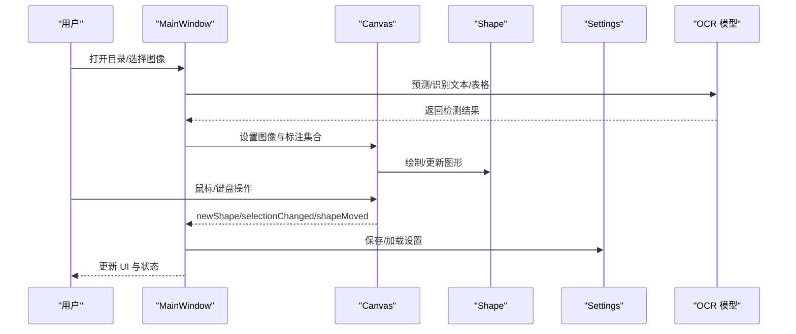
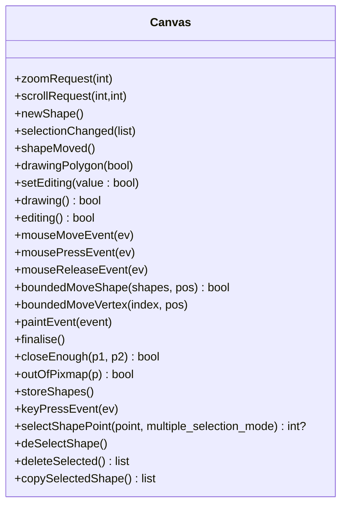
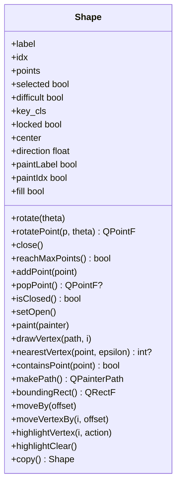
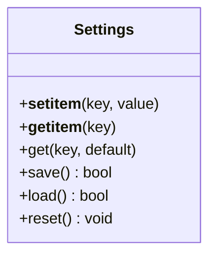
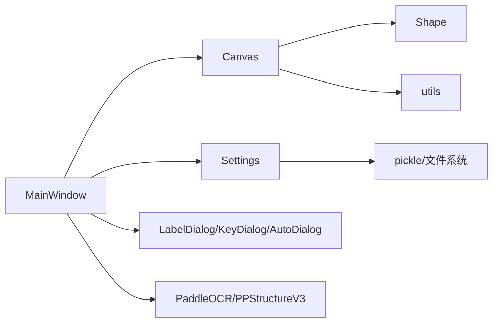

# API 参考

<cite>
**本文引用的文件**
- [PPOCRLabel.py](PPOCRLabel.md)
- [canvas.py](canvas.md)
- [shape.py](shape.md)
- [settings.py](settings.md)
- [utils.py](utils.md)
- [constants.py](constants.md)
- [zoomWidget.py](zoomWidget.md)
- [colorDialog.py](colorDialog.md)
- [labelDialog.py](labelDialog.md)
- [autoDialog.py](autoDialog.md)
- [editinlist.py](editinlist.md)
- [unique_label_qlist_widget.py](unique_label_qlist_widget.md)
- [hashableQListWidgetItem.py](hashableQListWidgetItem.md)
- [keyDialog.py](keyDialog.md)
- [libs/__init__.py](__init__.md)
</cite>

## 目录
1. [简介](#简介)
2. [项目结构](#项目结构)
3. [核心组件](#核心组件)
4. [架构总览](#架构总览)
5. [详细组件分析](#详细组件分析)
6. [依赖关系分析](#依赖关系分析)
7. [性能与可用性考量](#性能与可用性考量)
8. [故障排查指南](#故障排查指南)
9. [结论](#结论)
10. [附录](#附录)

## 简介
本文件为 PPOCRLabel 的完整 API 参考，覆盖 MainWindow、Canvas、Shape、Settings 等核心类及其公共接口、方法签名、参数说明、返回值与异常处理策略。同时提供使用示例与最佳实践，帮助开发者快速集成与扩展。

## 项目结构
- 应用入口与主窗口：PPOCRLabel.py 中的 MainWindow 类负责构建 UI、管理模型、处理交互事件与数据持久化。
- 图形绘制与交互：libs/canvas.py 提供 Canvas 组件，承载多边形绘制、选择、拖拽、缩放等交互逻辑；libs/shape.py 定义 Shape 对象，用于几何图形的渲染与编辑。
- 设置与常量：libs/settings.py 提供设置存储与加载；libs/constants.py 定义配置键名与格式常量。
- 工具与对话框：libs/utils.py 提供通用工具函数；libs/colorDialog.py、libs/labelDialog.py、libs/keyDialog.py、libs/autoDialog.py、libs/zoomWidget.py、libs/editinlist.py、libs/unique_label_qlist_widget.py、libs/hashableQListWidgetItem.py 提供颜色选择、标签输入、自动识别、缩放控件、列表编辑等辅助能力。
- 版本信息：libs/__init__.py 暴露版本号。

```mermaid
graph TB
A["PPOCRLabel.py<br/>MainWindow"] --> B["libs/canvas.py<br/>Canvas"]
A --> C["libs/shape.py<br/>Shape"]
A --> D["libs/settings.py<br/>Settings"]
A --> E["libs/utils.py<br/>工具函数"]
A --> F["libs/colorDialog.py<br/>ColorDialog"]
A --> G["libs/labelDialog.py<br/>LabelDialog"]
A --> H["libs/keyDialog.py<br/>KeyDialog"]
A --> I["libs/autoDialog.py<br/>AutoDialog"]
A --> J["libs/zoomWidget.py<br/>ZoomWidget"]
A --> K["libs/editinlist.py<br/>EditInList"]
A --> L["libs/unique_label_qlist_widget.py<br/>UniqueLabelQListWidget"]
A --> M["libs/hashableQListWidgetItem.py<br/>HashableQListWidgetItem"]
A --> N["libs/constants.py<br/>常量"]
A --> O["libs/__init__.py<br/>版本"]
```

图表来源
- [PPOCRLabel.py](PPOCRLabel.md)
- [canvas.py](canvas.md)
- [shape.py](shape.md)
- [settings.py](settings.md)
- [utils.py](utils.md)
- [colorDialog.py](colorDialog.md)
- [labelDialog.py](labelDialog.md)
- [keyDialog.py](keyDialog.md)
- [autoDialog.py](autoDialog.md)
- [zoomWidget.py](zoomWidget.md)
- [editinlist.py](editinlist.md)
- [unique_label_qlist_widget.py](unique_label_qlist_widget.md)
- [hashableQListWidgetItem.py](hashableQListWidgetItem.md)
- [constants.py](constants.md)
- [libs/__init__.py](__init__.md)

章节来源
- [PPOCRLabel.py](PPOCRLabel.md)
- [libs/canvas.py](canvas.md)
- [libs/shape.py](shape.md)
- [libs/settings.py](settings.md)
- [libs/utils.py](utils.md)
- [libs/colorDialog.py](colorDialog.md)
- [libs/labelDialog.py](labelDialog.md)
- [libs/keyDialog.py](keyDialog.md)
- [libs/autoDialog.py](autoDialog.md)
- [libs/zoomWidget.py](zoomWidget.md)
- [libs/editinlist.py](editinlist.md)
- [libs/unique_label_qlist_widget.py](unique_label_qlist_widget.md)
- [libs/hashableQListWidgetItem.py](hashableQListWidgetItem.md)
- [libs/constants.py](constants.md)
- [libs/__init__.py](__init__.md)

## 核心组件
本节概述 MainWindow、Canvas、Shape、Settings 的职责与公共 API 能力。

- MainWindow（应用主窗口）
  - 职责：初始化界面、加载语言包、构建工具栏与停靠面板、管理图像列表、调用 OCR 模型、处理用户操作与状态同步。
  - 关键属性与方法（节选）：
    - 构造函数：接收语言、GPU 开关、排序策略、KIE 模式、默认路径与模型目录等参数，初始化 OCR 与 UI 控件。
    - 图像导航：打开上一张/下一张、缩略图切换。
    - 标注控制：新建/编辑/复制/删除形状，批量重排，自动识别与表格识别。
    - 缩放与视图：缩放滑条、缩放控件、自适应窗口/宽度。
    - 数据持久化：保存/加载设置、保存标注文件。
    - 国际化：字符串包加载与提示文案。
  - 异常处理：日志记录与错误提示，避免阻断主流程。

- Canvas（绘图画布）
  - 职责：承载图像与标注图形，实现绘制、选择、拖拽、旋转、键盘快捷键、鼠标交互与绘制预览。
  - 关键信号与槽：
    - zoomRequest、scrollRequest：缩放与滚动请求。
    - newShape、selectionChanged、shapeMoved、drawingPolygon：绘制状态与变更通知。
  - 关键方法（节选）：
    - setEditing(value)、drawing()/editing()：模式切换与查询。
    - mouseMoveEvent/mousePressEvent/mouseReleaseEvent：交互事件处理。
    - boundedMoveShape/boundedMoveVertex：移动约束与边界检查。
    - paintEvent：绘制图形、虚影、网格线与标签文本。
    - finalise/closeEnough/outOfPixmap：完成绘制与边界判断。
    - storeShapes/shapesBackups：撤销栈备份。
    - keyPressEvent：Esc 结束绘制、回车闭合、方向键微调、顶点高亮与旋转。

- Shape（标注图形）
  - 职责：表示单个标注对象（四点矩形或任意多边形），支持旋转、高亮、绘制与文本标注。
  - 关键字段与方法（节选）：
    - 属性：points、label、idx、selected、difficult、key_cls、locked、center、direction、paintLabel/paintIdx、fill 等。
    - 方法：addPoint/popPoint/isClosed/setOpen/close/reachMaxPoints、moveBy/moveVertexBy、rotate/rotatePoint、paint/drawVertex、nearestVertex/containsPoint、boundingRect、copy 等。
    - 类变量：默认线宽、颜色、顶点半径与高亮样式。

- Settings（设置）
  - 职责：序列化/反序列化应用设置，提供键值访问与默认值查询。
  - 关键方法（节选）：
    - __setitem__/__getitem__/get：键值存取与默认值。
    - save/load/reset：持久化与清理。

章节来源
- [PPOCRLabel.py](PPOCRLabel.md)
- [libs/canvas.py](canvas.md)
- [libs/shape.py](shape.md)
- [libs/settings.py](settings.md)

## 架构总览
下图展示 MainWindow 与核心子系统之间的交互关系与数据流。

图表来源
- [PPOCRLabel.py](PPOCRLabel.md)
- [libs/canvas.py](canvas.md)
- [libs/shape.py](shape.md)
- [libs/settings.py](settings.md)

## 详细组件分析

### MainWindow API 规范
- 类型：MainWindow（继承自 QMainWindow）
- 主要职责：应用生命周期管理、UI 构建、事件分发、OCR 调用、数据持久化与国际化。
- 关键构造参数（节选）
  - lang：语言（"ch"/"en"）
  - gpu：是否启用 GPU
  - img_list_natural_sort：图像列表自然排序
  - bbox_auto_zoom_center：按包围盒自动居中
  - kie_mode：是否启用关键信息抽取模式
  - default_filename/default_predefined_class_file/default_save_dir：默认文件名/预定义类别/保存目录
  - det_model_dir/rec_model_dir/cls_model_dir：检测/识别/分类模型目录
  - label_font_path：标签字体路径
  - selected_shape_color：选中形状颜色
- 公共方法（节选）
  - openDirDialog()/openDatasetDirDialog()/openPrevImg()/openNextImg()：目录与图像导航
  - saveFile()/resetAll()/deleteImg()：保存、重置、删除当前图像
  - setCreateMode()/setEditMode()：创建/编辑模式切换
  - createShape()/deleteSelectedShape()/copySelectedShape()：图形创建/删除/复制
  - togglePolygons(show: bool)：显示/隐藏多边形
  - autoRecognition()/reRecognition()/singleRerecognition()：自动识别与重识别
  - TableRecognition()：表格识别
  - zoomRequest()/addZoom()/setZoom()/setFitWindow()/setFitWidth()：缩放控制
  - showTutorialDialog()/showInfoDialog()/showStepsDialog()/showKeysDialog()：帮助与信息
  - loadPredefinedClasses(path)：加载预定义类别
  - scanAllImages(path)：扫描图像列表
  - savePPlabel(...)：保存标注文件
  - updateComboBox(...)：更新下拉框
- 参数与返回值
  - 大多数 UI 事件处理方法无显式返回值（void），部分返回布尔或整数以指示状态。
- 异常处理
  - 使用日志记录错误，避免中断主线程；对文件读写与模型预测进行容错处理。

章节来源
- [PPOCRLabel.py](PPOCRLabel.md)
- [PPOCRLabel.py](PPOCRLabel.md)
- [PPOCRLabel.py](PPOCRLabel.md)

### Canvas API 规范
- 类型：Canvas（继承自 QWidget）
- 关键信号
  - zoomRequest(int)：缩放请求
  - scrollRequest(int, int)：滚动请求
  - newShape()：新图形产生
  - selectionChanged(list)：选择变化
  - shapeMoved()：图形移动
  - drawingPolygon(bool)：绘制状态变化
- 关键字段
  - mode：CREATE/EDIT
  - shapes：图形列表
  - selectedShapes：选中图形集合
  - current：当前绘制图形
  - drawSquare/fourpoint：正方形/四点绘制模式
  - scale/offsetToCenter：缩放与偏移
- 关键方法（节选）
  - setEditing(value: bool)：切换编辑/创建模式
  - drawing()/editing()：查询模式
  - mouseMoveEvent()/mousePressEvent()/mouseReleaseEvent()：鼠标交互
  - boundedMoveShape(shapes, pos)/boundedMoveVertex(index, pos)：移动约束
  - paintEvent(event)：绘制
  - finalise()/closeEnough(p1, p2)/outOfPixmap(p)：绘制完成与边界判断
  - storeShapes()/shapesBackups：撤销栈
  - keyPressEvent(ev)：键盘快捷键
  - selectShapePoint(point, multiple_selection_mode)：选择图形
  - deSelectShape()/deleteSelected()：取消选择与删除
  - copySelectedShape()：复制选中图形
- 参数与返回值
  - boundedMoveShape 返回布尔值指示是否移动成功。
  - selectShapePoint 返回被选中的顶点索引或 None。
- 异常处理
  - 边界越界时进行裁剪；绘制过程捕获异常并记录日志。

图表来源
- [libs/canvas.py](canvas.md)
- [libs/canvas.py](canvas.md)
- [libs/canvas.py](canvas.md)

章节来源
- [libs/canvas.py](canvas.md)
- [libs/canvas.py](canvas.md)
- [libs/canvas.py](canvas.md)

### Shape API 规范
- 类型：Shape
- 关键字段
  - label、idx、points、selected、difficult、key_cls、locked、center、direction、paintLabel、paintIdx、fill
  - 类变量：line_color、fill_color、select_line_color、select_fill_color、vertex_fill_color、hvertex_fill_color、point_type、point_size、scale
- 关键方法（节选）
  - rotate(theta)：绕中心旋转
  - rotatePoint(p, theta)：点旋转
  - close()/reachMaxPoints()/addPoint(point)/popPoint()：闭合与点管理
  - isClosed()/setOpen()：状态切换
  - paint(painter)：绘制路径、顶点与文本
  - drawVertex(path, i)：绘制顶点
  - nearestVertex(point, epsilon)：最近顶点
  - containsPoint(point)：点包含判断
  - makePath()/boundingRect()：路径与包围矩形
  - moveBy(offset)/moveVertexBy(i, offset)：平移
  - highlightVertex(i, action)/highlightClear()：高亮
  - copy()：深拷贝
- 参数与返回值
  - nearestVertex 返回顶点索引或 None。
  - paint 返回绘制结果（内部操作）。
- 异常处理
  - 计算中心点时对坐标不可用进行保护并记录告警。

图表来源
- [libs/shape.py](shape.md)
- [libs/shape.py](shape.md)
- [libs/shape.py](shape.md)

章节来源
- [libs/shape.py](shape.md)
- [libs/shape.py](shape.md)
- [libs/shape.py](shape.md)

### Settings API 规范
- 类型：Settings
- 关键方法（节选）
  - __setitem__(key, value)：设置键值
  - __getitem__(key)：获取键值
  - get(key, default=None)：带默认值获取
  - save()：保存到持久化文件
  - load()：从持久化文件加载
  - reset()：删除持久化文件并清空内存
- 参数与返回值
  - save()/load()/reset() 返回布尔值指示操作是否成功。
- 异常处理
  - 加载失败时记录告警并返回 False。

图表来源
- [libs/settings.py](settings.md)

章节来源
- [libs/settings.py](settings.md)

### 辅助组件与对话框 API 规范
- ZoomWidget（缩放控件）
  - 继承自 QSpinBox，范围 1-500%，后缀百分比，居中对齐。
  - 关键方法：minimumSizeHint()。
- ColorDialog（颜色选择）
  - 继承自 QColorDialog，支持透明通道与“恢复默认”按钮。
  - 关键方法：getColor(value=None, title=None, default=None)。
- LabelDialog（标签输入）
  - 继承自 QDialog，带自动补全与确认/取消按钮。
  - 关键方法：popUp(text="", move=True) -> str 或 None。
- KeyDialog（键值输入/KIE 模式）
  - 继承自 QDialog，支持占位符、验证器、补全与旗标复选框。
  - 关键方法：popUp(text=None, move=True, flags=None) -> (label, flags) 或 (None, None)。
- AutoDialog（自动识别进度）
  - 继承自 QDialog，内置进度条与列表，后台线程 Worker 执行 OCR。
  - 关键方法：popUp() -> 启动线程并弹窗；reject() 停止线程。
- EditInList（可编辑列表）
  - 继承自 QListWidget，双击进入编辑，回车关闭编辑。
  - 关键方法：item_clicked(modelindex)，keyPressEvent。
- UniqueLabelQListWidget（唯一标签列表）
  - 继承自 EscapableQListWidget，支持根据标签查找、创建项与设置彩色标签。
  - 关键方法：findItemsByLabel(label, get_row=False) -> list，createItemFromLabel(label)，setItemLabel(item, label, color=None)。
- HashableQListWidgetItem（可哈希列表项）
  - 继承自 QListWidgetItem，重写 __hash__ 以便集合操作。
- utils（工具函数）
  - newIcon/icon/newAction/addActions/labelValidator/struct/distance/formatShortcut/generateColorByText/have_qstring/natural_sort/get_rotate_crop_image/boxPad 等。
- constants（常量）
  - SETTING_*、FORMAT_*、DEFAULT_ENCODING 等键名与格式常量。

章节来源
- [libs/zoomWidget.py](zoomWidget.md)
- [libs/colorDialog.py](colorDialog.md)
- [libs/labelDialog.py](labelDialog.md)
- [libs/keyDialog.py](keyDialog.md)
- [libs/autoDialog.py](autoDialog.md)
- [libs/editinlist.py](editinlist.md)
- [libs/unique_label_qlist_widget.py](unique_label_qlist_widget.md)
- [libs/hashableQListWidgetItem.py](hashableQListWidgetItem.md)
- [libs/utils.py](utils.md)
- [libs/utils.py](utils.md)
- [libs/constants.py](constants.md)

## 依赖关系分析
- 组件耦合
  - MainWindow 依赖 Canvas、Shape、Settings、Utils、对话框与 OCR 模块。
  - Canvas 依赖 Shape 与 Utils 的距离计算。
  - Settings 仅依赖文件系统与 pickle。
- 外部依赖
  - PyQt5、PaddleOCR、OpenCV、numpy、pandas 等。
- 循环依赖
  - 未发现循环导入；模块间通过实例化与信号连接解耦。

图表来源
- [PPOCRLabel.py](PPOCRLabel.md)
- [libs/canvas.py](canvas.md)
- [libs/shape.py](shape.md)
- [libs/settings.py](settings.md)
- [libs/utils.py](utils.md)

章节来源
- [PPOCRLabel.py](PPOCRLabel.md)
- [libs/canvas.py](canvas.md)
- [libs/shape.py](shape.md)
- [libs/settings.py](settings.md)
- [libs/utils.py](utils.md)

## 性能与可用性考量
- 绘制性能
  - Canvas 在 paintEvent 中按需绘制，使用抗锯齿与平滑变换提升视觉质量；建议在大批量图形时减少刷新频率。
- 交互响应
  - Canvas 使用 boundedMove* 限制移动与越界，避免卡顿；键盘微调与顶点高亮增强精度。
- OCR 推理
  - AutoDialog 使用独立线程执行 OCR，避免阻塞 UI；建议合理设置线程栈大小与批处理策略。
- 设置持久化
  - Settings 使用二进制序列化，建议定期清理损坏文件并监控磁盘空间。

[本节为通用指导，不直接分析具体文件]

## 故障排查指南
- 无法加载设置
  - 现象：启动后设置未生效。
  - 排查：检查设置文件是否存在与可读；调用 Settings.load() 并查看日志告警。
- 绘制越界或图形丢失
  - 现象：拖拽或缩放后图形消失。
  - 排查：确认 outOfPixmap 判断与 boundedMove* 是否触发；检查 storeShapes 撤销栈。
- 自动识别中断
  - 现象：点击取消后仍占用资源。
  - 排查：调用 AutoDialog.reject() 停止 Worker；确认线程 finished 状态。
- 颜色选择无效
  - 现象：更改颜色后未生效。
  - 排查：确认 Canvas.setDrawingColor 与 Shape 的颜色字段是否同步更新。

章节来源
- [libs/settings.py](settings.md)
- [libs/canvas.py](canvas.md)
- [libs/autoDialog.py](autoDialog.md)
- [libs/colorDialog.py](colorDialog.md)

## 结论
本文提供了 PPOCRLabel 的核心 API 参考，涵盖 MainWindow、Canvas、Shape、Settings 的公共接口与使用要点。通过合理的参数传递、信号连接与异常处理，可稳定集成与扩展标注功能。建议在生产环境中结合日志与单元测试持续验证行为一致性。

[本节为总结性内容，不直接分析具体文件]

## 附录

### 版本兼容性与弃用说明
- 版本号：参见 libs/__init__.py 的版本元组。
- 兼容性建议：
  - PyQt5 与 Python 3.8+ 兼容性良好；如升级至更高版本，请关注信号与槽语法差异。
  - PaddleOCR 版本升级可能影响模型名称与输出结构，需同步调整 MainWindow 初始化参数与结果解析。
- 弃用与迁移
  - 若未来引入 PyQt6，需替换 QRegExpValidator 与相关 UI 组件；建议通过条件导入与适配层隔离差异。
  - 对于 OCR 输出字段变更，建议在 MainWindow 内部封装统一的数据转换层，降低上游调用方的影响面。

章节来源
- [libs/__init__.py](__init__.md)
- [PPOCRLabel.py](PPOCRLabel.md)

### 使用示例与最佳实践
- 快速启动与基本标注
  - 步骤：实例化 MainWindow，传入语言与模型目录；打开图像目录；在 Canvas 上绘制矩形；保存标注。
  - 参考路径：MainWindow 构造与 openDirDialog/saveFile。
- 批量自动识别
  - 步骤：准备图像列表；调用 AutoDialog.popUp()；在回调中保存结果。
  - 参考路径：AutoDialog 与 Worker 线程。
- 自定义颜色与标签
  - 步骤：使用 ColorDialog.getColor 获取颜色；通过 LabelDialog/KeyDialog 输入标签；更新 Shape 的颜色与文本。
  - 参考路径：ColorDialog.getColor、LabelDialog.popUp、KeyDialog.popUp。

章节来源
- [PPOCRLabel.py](PPOCRLabel.md)
- [libs/autoDialog.py](autoDialog.md)
- [libs/colorDialog.py](colorDialog.md)
- [libs/labelDialog.py](labelDialog.md)
- [libs/keyDialog.py](keyDialog.md)