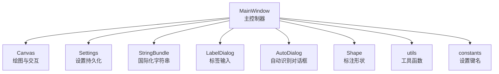
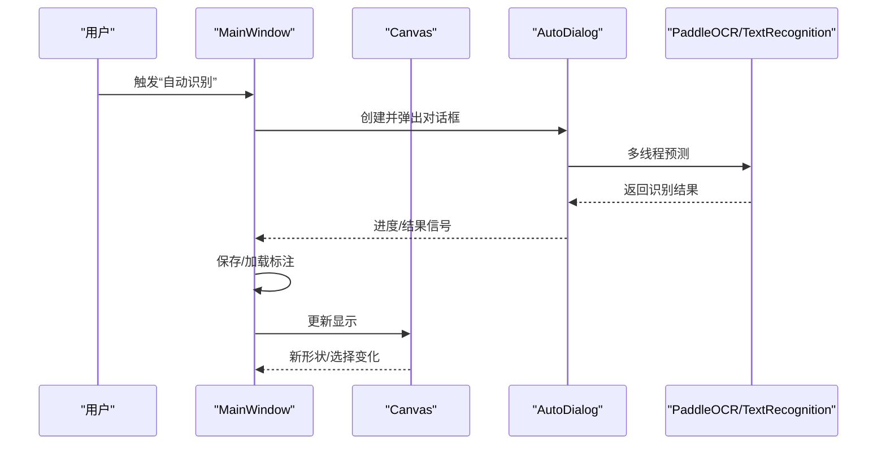
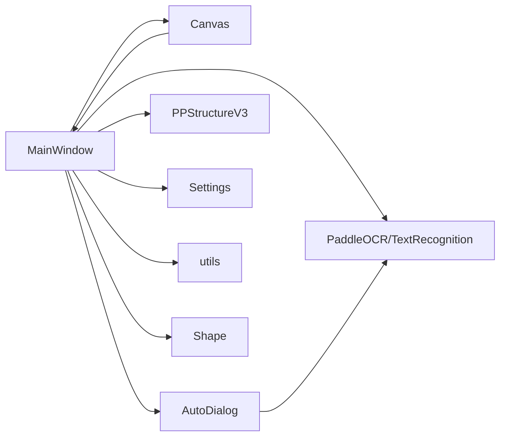
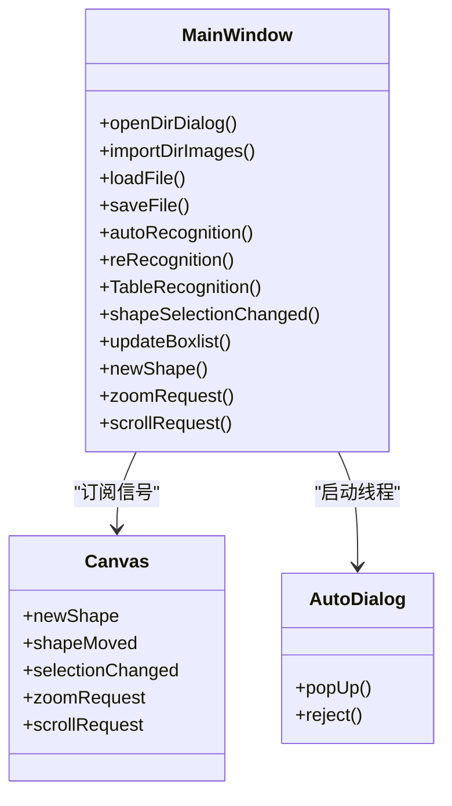

# MainWindow 类 API

<cite>
**本文引用的文件**
- [PPOCRLabel.py](PPOCRLabel.md)
- [canvas.py](canvas.md)
- [settings.py](settings.md)
- [shape.py](shape.md)
- [utils.py](utils.md)
- [constants.py](constants.md)
- [stringBundle.py](stringBundle.md)
- [labelDialog.py](labelDialog.md)
- [autoDialog.py](autoDialog.md)
</cite>

## 目录
1. [简介](#简介)
2. [项目结构](#项目结构)
3. [核心组件](#核心组件)
4. [架构总览](#架构总览)
5. [详细组件分析](#详细组件分析)
6. [依赖关系分析](#依赖关系分析)
7. [性能考虑](#性能考虑)
8. [故障排查指南](#故障排查指南)
9. [结论](#结论)
10. [附录](#附录)

## 简介
本文件为 MainWindow 类的完整 API 参考文档，覆盖其作为主控制器的所有公共方法、属性与信号，包括构造函数参数、初始化流程、窗口与文件操作、图像处理、标注管理、OCR 相关方法（如自动识别、重识别、表格识别）以及事件与信号连接机制。文档同时提供使用示例与最佳实践，帮助开发者快速理解与正确使用 MainWindow。

## 项目结构
MainWindow 位于应用入口文件中，负责组织界面控件、加载资源、管理文件与图像、调用 OCR 模型、维护标注数据与状态，并通过信号槽与 Canvas、对话框等组件交互。

图表来源
- [PPOCRLabel.py](PPOCRLabel.md)
- [canvas.py](canvas.md)
- [settings.py](settings.md)
- [stringBundle.py](stringBundle.md)
- [labelDialog.py](labelDialog.md)
- [autoDialog.py](autoDialog.md)
- [shape.py](shape.md)
- [utils.py](utils.md)
- [constants.py](constants.md)

章节来源
- [PPOCRLabel.py](PPOCRLabel.md)

## 核心组件
- 主窗口类：MainWindow（继承自 QMainWindow）
- 画布类：Canvas（绘图与交互，定义多个 PyQt5 信号）
- 设置类：Settings（应用设置持久化）
- 形状类：Shape（标注矩形/多边形）
- 工具模块：utils（图标、动作、排序、图像处理等）
- 国际化：StringBundle
- 对话框：LabelDialog、AutoDialog
- 常量：constants（设置键名）

章节来源
- [PPOCRLabel.py](PPOCRLabel.md)
- [canvas.py](canvas.md)
- [settings.py](settings.md)
- [shape.py](shape.md)
- [utils.py](utils.md)
- [stringBundle.py](stringBundle.md)
- [labelDialog.py](labelDialog.md)
- [autoDialog.py](autoDialog.md)
- [constants.py](constants.md)

## 架构总览
MainWindow 通过动作（actions）、菜单与工具栏组织 UI；Canvas 提供鼠标与键盘事件、形状绘制与选择；AutoDialog 在后台线程执行 OCR 并通过信号更新进度与结果；Settings 与 constants 协助持久化窗口状态与设置项；utils 提供图像裁剪、排序等辅助能力。

图表来源
- [PPOCRLabel.py](PPOCRLabel.md)
- [autoDialog.py](autoDialog.md)
- [canvas.py](canvas.md)

章节来源
- [PPOCRLabel.py](PPOCRLabel.md)
- [autoDialog.py](autoDialog.md)
- [canvas.py](canvas.md)

## 详细组件分析

### MainWindow 构造函数与初始化
- 构造函数参数
  - lang: 语言（默认“ch”，支持“ch/en”）
  - gpu: 是否启用 GPU（根据设备能力自动判定）
  - img_list_natural_sort: 图片列表是否自然排序
  - bbox_auto_zoom_center: 是否基于检测框面积自动居中缩放
  - kie_mode: 是否开启关键信息抽取模式
  - default_filename: 默认打开文件路径
  - default_predefined_class_file: 预定义类别文件
  - default_save_dir: 默认保存目录
  - det_model_dir/rec_model_dir/cls_model_dir: 检测/识别/方向分类模型目录
  - label_font_path: 标签字体路径
  - selected_shape_color: 选中形状颜色（RGB 元组）
- 初始化要点
  - 加载设置、语言包、模型（PaddleOCR、TextRecognition、PPStructureV3）
  - 构建 UI：文件列表、标签列表、检测框列表、缩略图、画布、工具栏、菜单
  - 绑定信号与槽（Canvas、滚动条、缩放滑块、动作等）
  - 加载预定义类别、字体、颜色、窗口状态

章节来源
- [PPOCRLabel.py](PPOCRLabel.md)
- [PPOCRLabel.py](PPOCRLabel.md)
- [stringBundle.py](stringBundle.md)
- [settings.py](settings.md)
- [constants.py](constants.md)

### 窗口管理与事件
- 关键方法
  - openDirDialog：打开目录并导入图片列表
  - openNextImg/openPrevImg：切换到下一张/上一张图片
  - loadFile：加载指定图片，更新画布与标注
  - closeEvent/resizeEvent：窗口关闭/调整大小时保存状态与缩放
  - toggleActions/toggleDrawMode：启用/禁用相关控件
- 事件与信号
  - Canvas.zoomRequest/scrollRequest/newShape/selectionChanged/shapeMoved
  - ZoomWidget.valueChanged/imageSlider.valueChanged
  - 文件列表、标签列表、索引列表、检测框列表的 itemChanged/itemSelectionChanged

章节来源
- [PPOCRLabel.py](PPOCRLabel.md)
- [PPOCRLabel.py](PPOCRLabel.md)
- [PPOCRLabel.py](PPOCRLabel.md)
- [PPOCRLabel.py](PPOCRLabel.md)
- [canvas.py](canvas.md)
- [PPOCRLabel.py](PPOCRLabel.md)

### 文件操作与标注管理
- 导入/导出
  - importDirImages：扫描目录、加载文件状态、合并缓存标签、构建文件列表与缩略图
  - saveFile/_saveFile：保存标注（手动/自动模式），更新文件状态图标
  - saveLabelFile/savePPlabel/saveCacheLabel：保存标签文件与缓存
  - exportJSON：导出 PubTabNet JSON
- 标注增删改
  - addLabel/remLabels/loadLabels/singleLabel/updateComboBox/updateIndexList
  - deleteSelectedShape/copySelectedShape/moveShape/copyShape
  - lockSelectedShape：锁定/解锁形状（以图像比例存储）
  - expandSelectedShape：按像素扩展检测框
  - resortBoxPosition：按行列顺序重排检测框
- 状态与脏标记
  - setDirty/setClean：标记未保存状态
  - mayContinue/discardChangesDialog：离开前确认

章节来源
- [PPOCRLabel.py](PPOCRLabel.md)
- [PPOCRLabel.py](PPOCRLabel.md)
- [PPOCRLabel.py](PPOCRLabel.md)
- [PPOCRLabel.py](PPOCRLabel.md)
- [PPOCRLabel.py](PPOCRLabel.md)
- [PPOCRLabel.py](PPOCRLabel.md)
- [PPOCRLabel.py](PPOCRLabel.md)
- [PPOCRLabel.py](PPOCRLabel.md)
- [PPOCRLabel.py](PPOCRLabel.md)

### 图像处理与标注交互
- Canvas 信号与交互
  - 绘制/移动/选择/拖拽：Canvas.newShape/shapeMoved/selectionChanged
  - 缩放/滚动：Canvas.zoomRequest/scrollRequest
  - 键盘事件：撤销、回车闭合、方向键移动顶点、旋转等
- MainWindow 与 Canvas 的绑定
  - Canvas.newShape -> newShape
  - Canvas.shapeMoved -> updateBoxlist
  - Canvas.selectionChanged -> shapeSelectionChanged
  - Canvas.scrollRequest/zoomRequest -> 滚动与缩放逻辑
- 辅助工具
  - get_rotate_crop_image：按四点框裁剪并旋转矫正
  - boxPad：对检测框进行像素级扩展
  - polygon_bounding_box_center_and_area：计算多边形包围盒中心与面积

章节来源
- [canvas.py](canvas.md)
- [PPOCRLabel.py](PPOCRLabel.md)
- [PPOCRLabel.py](PPOCRLabel.md)
- [utils.py](utils.md)
- [utils.py](utils.md)
- [utils.py](utils.md)

### OCR 相关方法
- 自动识别（批量）
  - autoRecognition：从当前索引开始，按数量限制识别未确认图片，弹出 AutoDialog，完成后合并缓存并刷新界面
  - autoRecognitionNum：设置本次自动识别数量（0 表示剩余全部）
- 重识别（整图/单框）
  - reRecognition：对当前图片所有检测框进行文本识别，更新结果并自动保存/加载
  - singleRerecognition：对选中框进行单框重识别
  - cellreRecognition：对单元格内细粒度文本进行重识别（先做文本检测再识别）
- 表格识别
  - TableRecognition：调用 PPStructureV3 识别表格，生成 Excel 输出并在界面绘制识别框
- 语言模型切换
  - autolcm/modelChoose：弹出语言选择对话框，动态重建 OCR 模型实例

章节来源
- [PPOCRLabel.py](PPOCRLabel.md)
- [PPOCRLabel.py](PPOCRLabel.md)
- [PPOCRLabel.py](PPOCRLabel.md)
- [PPOCRLabel.py](PPOCRLabel.md)
- [PPOCRLabel.py](PPOCRLabel.md)
- [PPOCRLabel.py](PPOCRLabel.md)
- [PPOCRLabel.py](PPOCRLabel.md)
- [PPOCRLabel.py](PPOCRLabel.md)

### 信号与槽绑定
- Canvas 与 MainWindow
  - Canvas.newShape -> newShape（弹出标签输入，创建 Shape 并加入列表）
  - Canvas.shapeMoved -> updateBoxlist（同步检测框列表）
  - Canvas.selectionChanged -> shapeSelectionChanged（联动标签/索引列表）
  - Canvas.zoomRequest -> zoomRequest（鼠标滚轮缩放）
  - Canvas.scrollRequest -> scrollRequest（平移）
- 控件与 MainWindow
  - ZoomWidget.valueChanged -> paintCanvas（重绘）
  - imageSlider.valueChanged -> zoomWidget.setValue（同步缩放条）
  - LabelDialog/KeyDialog 弹窗回调 -> 更新标签/键类别
- 自动识别线程
  - AutoDialog.Worker.progressBarValue/listValue/end_signal -> 更新进度/结果/结束状态

章节来源
- [PPOCRLabel.py](PPOCRLabel.md)
- [PPOCRLabel.py](PPOCRLabel.md)
- [PPOCRLabel.py](PPOCRLabel.md)
- [PPOCRLabel.py](PPOCRLabel.md)
- [PPOCRLabel.py](PPOCRLabel.md)
- [autoDialog.py](autoDialog.md)

### 属性与状态
- 常用属性
  - lang/gpu/kie_mode/defaultSaveDir/bbox_auto_zoom_center
  - mImgList/mImgList5/dirname/labelHist/lastOpenDir/result_dic/result_dic_locked
  - dirty/currIndex/itemsToShapes/shapesToItems/labelFile
  - ocr/text_recognizer/text_detector/table_ocr
  - label_font_family/selected_shape_color
- 状态管理
  - Settings 中保存窗口尺寸、位置、最近文件、颜色、显示选项、绘图模式等
  - fileStatedict 记录已确认图片状态

章节来源
- [PPOCRLabel.py](PPOCRLabel.md)
- [PPOCRLabel.py](PPOCRLabel.md)
- [settings.py](settings.md)
- [constants.py](constants.md)

## 依赖关系分析
- 组件耦合
  - MainWindow 与 Canvas 高内聚：Canvas 的信号直接驱动 MainWindow 的标注与显示更新
  - MainWindow 与 AutoDialog：通过线程与信号解耦，避免阻塞 UI
  - MainWindow 与 OCR：延迟初始化，按需加载模型，支持语言切换
- 外部依赖
  - PaddleOCR、PP-Structure、OpenCV、PyQt5
  - tablepyxl（表格导出）、openpyxl（备用）

图表来源
- [PPOCRLabel.py](PPOCRLabel.md)
- [autoDialog.py](autoDialog.md)
- [canvas.py](canvas.md)

章节来源
- [PPOCRLabel.py](PPOCRLabel.md)
- [autoDialog.py](autoDialog.md)
- [canvas.py](canvas.md)

## 性能考虑
- 后台线程：AutoDialog 使用 QThread 执行 OCR，避免阻塞 UI
- 按需缩放：根据检测框面积自动缩放，提升小目标可视性
- 图像处理：使用 get_rotate_crop_image 与 boxPad 减少误识别
- 自动保存：达到阈值自动保存，减少丢失风险
- 最佳实践
  - 大批量自动识别时，合理设置 auto_recognition_num
  - 重识别前确保检测框有效且为四点
  - 表格识别仅支持单表场景，避免重复识别

[本节为通用指导，无需源码引用]

## 故障排查指南
- 无法打开图片
  - 检查文件路径是否存在，loadFile 中有错误提示逻辑
- 重识别失败
  - 确认检测框为四点且未越界；查看 get_rotate_crop_image 返回值
- 表格识别无输出
  - 确认 PPStructureV3 返回结果非空；必要时生成空 Excel
- 自动识别中断
  - AutoDialog 支持取消，线程会退出并释放资源
- 语言切换无效
  - modelChoose 会重建 OCR 实例，确保语言键映射正确

章节来源
- [PPOCRLabel.py](PPOCRLabel.md)
- [PPOCRLabel.py](PPOCRLabel.md)
- [PPOCRLabel.py](PPOCRLabel.md)
- [autoDialog.py](autoDialog.md)
- [PPOCRLabel.py](PPOCRLabel.md)

## 结论
MainWindow 作为应用主控制器，整合了 UI、标注、图像处理与 OCR 能力，通过清晰的信号槽与模块化设计实现了良好的可维护性与扩展性。遵循本文档的参数说明、方法签名与使用示例，可高效完成图像标注、文本识别与表格结构化输出等任务。

[本节为总结，无需源码引用]

## 附录

### MainWindow 方法速查（按功能分组）
- 窗口与文件
  - openDirDialog/dirname/lastOpenDir/scanAllImages/importDirImages/loadFilestate/saveFilestate
  - openNextImg/openPrevImg/closeEvent/resizeEvent
- 标注管理
  - addLabel/remLabels/loadLabels/singleLabel/updateComboBox/updateIndexList
  - deleteSelectedShape/copySelectedShape/moveShape/copyShape
  - lockSelectedShape/expandSelectedShape/resortBoxPosition
- OCR 与识别
  - autoRecognition/autoRecognitionNum/reRecognition/singleRerecognition
  - cellreRecognition/TableRecognition/autolcm/modelChoose
- 事件与交互
  - shapeSelectionChanged/updateBoxlist/newShape/keyPressEvent/keyReleaseEvent
  - scrollRequest/zoomRequest/setZoom/addZoom/setFitWindow/setFitWidth
- 保存与导出
  - saveFile/_saveFile/saveLabelFile/savePPlabel/saveCacheLabel/saveRecResult/exportJSON

章节来源
- [PPOCRLabel.py](PPOCRLabel.md)
- [PPOCRLabel.py](PPOCRLabel.md)
- [PPOCRLabel.py](PPOCRLabel.md)
- [PPOCRLabel.py](PPOCRLabel.md)
- [PPOCRLabel.py](PPOCRLabel.md)
- [PPOCRLabel.py](PPOCRLabel.md)
- [PPOCRLabel.py](PPOCRLabel.md)
- [PPOCRLabel.py](PPOCRLabel.md)

### 信号与槽关系图

图表来源
- [PPOCRLabel.py](PPOCRLabel.md)
- [PPOCRLabel.py](PPOCRLabel.md)
- [canvas.py](canvas.md)
- [autoDialog.py](autoDialog.md)