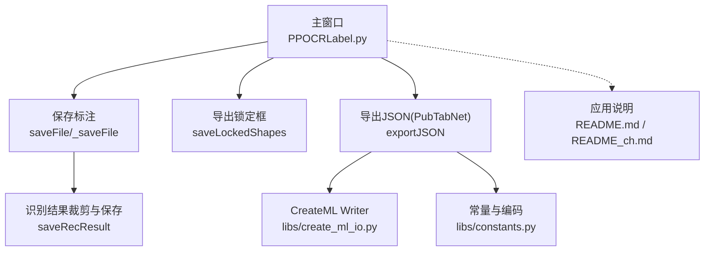
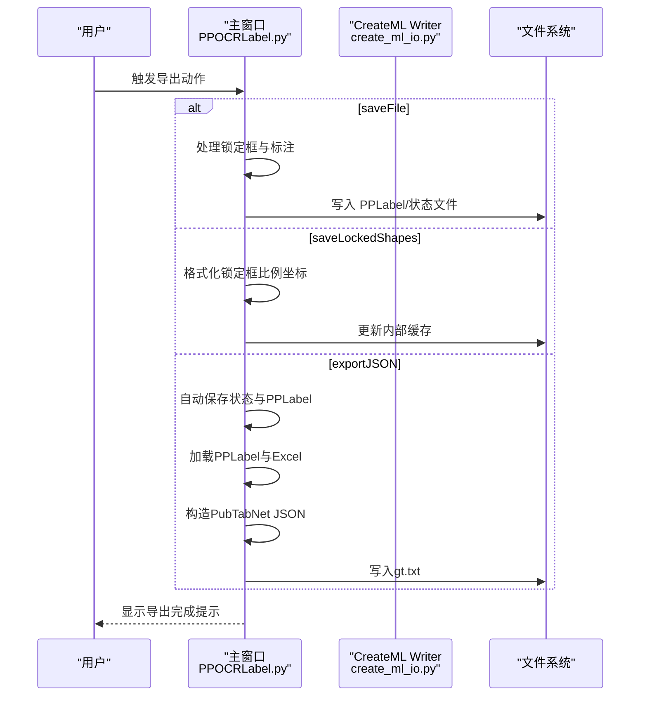
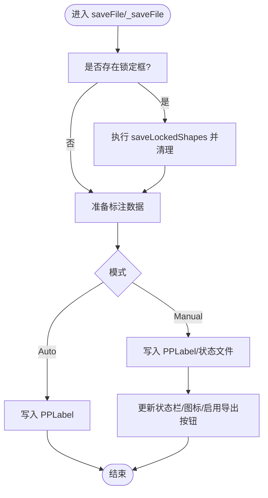
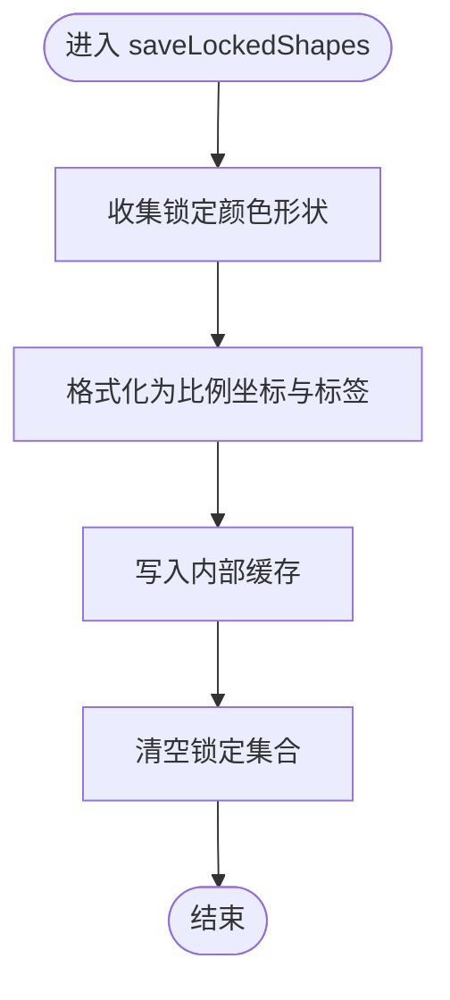
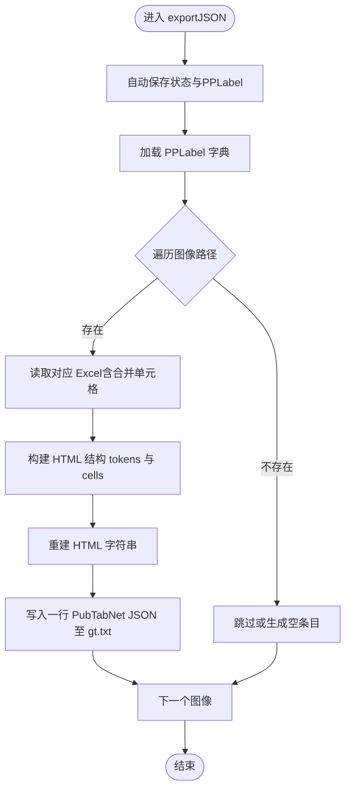
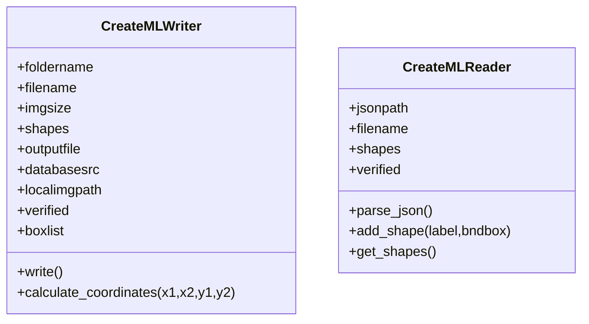
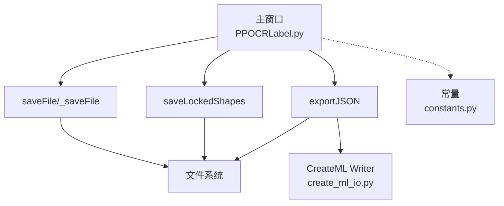

# 数据导出 API

<cite>
**本文引用的文件**
- [PPOCRLabel.py](PPOCRLabel.md)
- [create_ml_io.py](create_ml_io.md)
- [constants.py](constants.md)
- [README.md](README.md)
- [README_ch.md](README_ch.md)
</cite>

## 目录
1. [简介](#简介)
2. [项目结构](#项目结构)
3. [核心组件](#核心组件)
4. [架构总览](#架构总览)
5. [详细组件分析](#详细组件分析)
6. [依赖关系分析](#依赖关系分析)
7. [性能考量](#性能考量)
8. [故障排查指南](#故障排查指南)
9. [结论](#结论)
10. [附录](#附录)

## 简介
本文件聚焦于应用中的数据导出能力，围绕以下三个导出方法进行系统化说明：
- saveFile：保存标注与识别结果，支持锁定框导出与自动保存策略
- saveLockedShapes：导出锁定框标注为识别训练数据
- exportJSON：将表格结构化标注与文本识别结果整合为 PubTabNet JSON 格式

文档涵盖：
- 支持的导出格式与数据结构转换
- 文件生成流程与元数据处理
- 导出配置选项、批量导出策略与错误处理
- 数据格式规范与兼容性说明

## 项目结构
与导出相关的关键模块与职责：
- 主窗口导出入口与流程控制：PPOCRLabel.py 中的导出动作绑定与调用链
- CreateML 格式读写：libs/create_ml_io.py 提供 CreateML Writer/Reader
- 常量与编码设置：libs/constants.py 提供默认编码等常量
- 应用说明与使用指引：README.md、README_ch.md

图表来源
- [PPOCRLabel.py](PPOCRLabel.md)
- [create_ml_io.py](create_ml_io.md)
- [constants.py](constants.md)

章节来源
- [PPOCRLabel.py](PPOCRLabel.md)
- [create_ml_io.py](create_ml_io.md)
- [constants.py](constants.md)

## 核心组件
本节概述三个导出方法的功能定位、输入输出与关键行为。

- saveFile(mode="Manual"/"Auto")
  - 功能：保存当前图像的标注与识别结果；在手动模式下更新文件状态、图标与自动保存计数；在自动模式下仅保存标注
  - 关键点：处理锁定框，将锁定框按图像尺寸比例转换为像素坐标，写入 PPLabel 缓存；随后调用保存函数
  - 输出：更新文件状态文件、触发识别结果保存按钮可用

- saveLockedShapes
  - 功能：将当前画布中被锁定的形状导出为识别训练数据，并清理锁定集合
  - 关键点：遍历画布形状，筛选锁定颜色的形状，格式化为比例坐标与文本，写入内部缓存

- exportJSON
  - 功能：将 PPLabel 标注与表格 Excel 结果合并，生成 PubTabNet 格式的 JSON 文本文件
  - 关键点：自动保存状态与 PPLabel；加载 PPLabel；读取表格 Excel；构造 HTML 结构与单元格；写入 gt.txt

章节来源
- [PPOCRLabel.py](PPOCRLabel.md)

## 架构总览
导出流程从主窗口动作触发，经过参数准备、数据转换与文件写入，最终生成目标格式文件。

图表来源
- [PPOCRLabel.py](PPOCRLabel.md)
- [create_ml_io.py](create_ml_io.md)

## 详细组件分析

### saveFile 与 _saveFile
- 触发时机与模式
  - 手动模式：用户点击“保存”时调用，更新文件状态、图标与自动保存计数
  - 自动模式：由内部流程触发，仅保存标注，不更新界面状态
- 锁定框处理
  - 若存在锁定框，先执行导出锁定框逻辑，再进行标注保存
  - 将锁定框的比例坐标转换为像素坐标，写入识别结果缓存
- 文件写入
  - 调用保存函数写入 PPLabel 文件与状态文件
  - 成功后更新状态栏消息与文件列表图标

图表来源
- [PPOCRLabel.py](PPOCRLabel.md)

章节来源
- [PPOCRLabel.py](PPOCRLabel.md)

### saveLockedShapes
- 行为说明
  - 从画布收集锁定颜色的形状，格式化为包含标签、比例坐标与困难标记的字典
  - 将格式化后的锁定框写入内部缓存，随后清空锁定集合
- 数据结构要点
  - 比例坐标：每个点除以图像宽高得到相对值
  - 字段：标签、比例坐标、困难标记、可选键类别

图表来源
- [PPOCRLabel.py](PPOCRLabel.md)

章节来源
- [PPOCRLabel.py](PPOCRLabel.md)

### exportJSON（PubTabNet）
- 功能概述
  - 自动保存状态与 PPLabel
  - 读取 PPLabel 标注字典
  - 读取表格 Excel，提取合并单元格与单元格文本，构建 HTML 结构
  - 将标注与 HTML 结构组合为 PubTabNet JSON 条目，写入 gt.txt
- 数据结构与字段
  - 图像文件名：基于 PPLabel 中的键
  - HTML 结构：包含结构 tokens 与 cells 列表
  - 单元格：包含 tokens（字符序列）与 bbox（标注框）
  - 重建 HTML：根据结构与单元格信息还原 HTML
- 输出文件
  - 目录：与 PPLabel 同级
  - 文件：gt.txt（每行一条 JSON）

图表来源
- [PPOCRLabel.py](PPOCRLabel.md)

章节来源
- [PPOCRLabel.py](PPOCRLabel.md)

### CreateMLWriter（CreateML 导出辅助）
- 用途
  - 将标注形状转换为 CreateML JSON 格式，写入单文件
  - 支持增量追加同一图像的标注，避免重复覆盖
- 坐标转换
  - 将矩形框的两个角点转换为中心点与宽高
- 文件格式
  - 每次写入为数组，元素为对象，包含 image 与 annotations 列表

图表来源
- [create_ml_io.py](create_ml_io.md)

章节来源
- [create_ml_io.py](create_ml_io.md)

## 依赖关系分析
- 主窗口到导出方法
  - 导出动作绑定到主窗口菜单项，调用 saveFile、saveLockedShapes、exportJSON
- 导出方法到文件系统
  - 写入 PPLabel、状态文件、识别裁剪图与标签、PubTabNet JSON
- 导出方法到工具函数
  - 使用图像裁剪、旋转等工具函数进行识别数据准备
- 导出方法到常量
  - 默认编码等常量用于文件写入

图表来源
- [PPOCRLabel.py](PPOCRLabel.md)
- [create_ml_io.py](create_ml_io.md)
- [constants.py](constants.md)

章节来源
- [PPOCRLabel.py](PPOCRLabel.md)
- [create_ml_io.py](create_ml_io.md)
- [constants.py](constants.md)

## 性能考量
- 导出规模
  - exportJSON 需要遍历 PPLabel 中的图像并逐个读取 Excel，建议在批量导出时控制并发与进度提示
- I/O 开销
  - 识别裁剪图保存涉及多次图像解码与编码，建议在大图场景下限制导出范围或分批处理
- 锁定框导出
  - saveLockedShapes 仅进行内存格式化与缓存写入，性能开销较低

## 故障排查指南
- 导出前未勾选图像
  - 现象：导出提示需要先勾选图像
  - 处理：确保至少有一张图像被标记并保存
- 无法找到 PPLabel 文件
  - 现象：导出 JSON 时报错找不到 Label.txt
  - 处理：先执行保存标注动作，确保 PPLabel 文件存在
- Excel 读取异常
  - 现象：表格 Excel 不存在或解析失败
  - 处理：确认表格识别已生成 Excel；检查合并单元格范围；必要时重做表格识别
- 图像裁剪失败
  - 现象：识别裁剪图保存报错
  - 处理：检查图像路径是否正确、标注框是否越界；修正后重试

章节来源
- [PPOCRLabel.py](PPOCRLabel.md)
- [PPOCRLabel.py](PPOCRLabel.md)

## 结论
本文件梳理了应用中的三项导出能力：saveFile、saveLockedShapes、exportJSON。它们分别面向标注保存、锁定框识别训练数据导出以及 PubTabNet JSON 格式的数据集生成。通过明确的数据结构转换、文件生成逻辑与错误处理策略，用户可以稳定地完成从标注到训练数据的全流程导出。

## 附录

### API 定义与参数说明
- saveFile(mode="Manual"/"Auto")
  - 参数
    - mode：导出模式，Manual 用于手动保存并更新界面状态；Auto 仅保存标注
  - 行为
    - 处理锁定框；将标注写入 PPLabel；更新状态栏与文件列表图标
  - 返回
    - 成功时显示保存成功消息；失败时弹窗提示

- saveLockedShapes
  - 行为
    - 格式化锁定框为比例坐标与标签；写入内部缓存；清空锁定集合
  - 返回
    - 无显式返回值；影响后续保存流程

- exportJSON
  - 行为
    - 自动保存状态与 PPLabel；读取 PPLabel 与 Excel；构造 PubTabNet JSON；写入 gt.txt
  - 返回
    - 成功时弹窗提示保存路径；失败时弹窗提示问题

章节来源
- [PPOCRLabel.py](PPOCRLabel.md)

### 数据格式规范与兼容性
- PubTabNet JSON
  - 字段
    - filename：图像文件名
    - html：包含 structure.tokens 与 cells 列表
    - gt：重建后的 HTML 字符串
  - 兼容性
    - 与 PubTabNet 标准兼容，便于导入下游 OCR/表格识别训练流程

- CreateML JSON
  - 字段
    - 数组元素：包含 image 与 annotations
    - annotations：每项包含 label 与 coordinates（x, y, width, height）
  - 兼容性
    - 与 CreateML 生态兼容，适合通用目标检测/实例分割标注平台

章节来源
- [PPOCRLabel.py](PPOCRLabel.md)
- [create_ml_io.py](create_ml_io.md)

### 导出配置与批量策略
- 自动保存
  - 当确认一定数量的图像后自动保存标注；可通过设置调整自动保存阈值
- 批量导出
  - exportJSON 会遍历 PPLabel 中的图像并逐一处理；建议在大量图像场景下分批执行
- 锁定框优先
  - 在手动保存前，若存在锁定框，将优先导出锁定框识别数据

章节来源
- [PPOCRLabel.py](PPOCRLabel.md)
- [PPOCRLabel.py](PPOCRLabel.md)