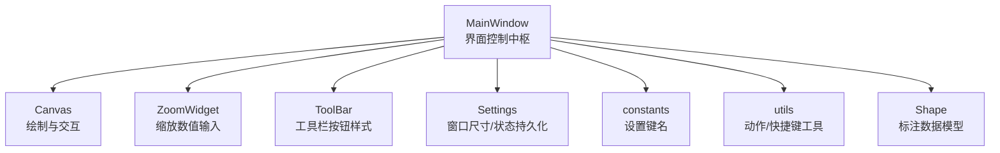
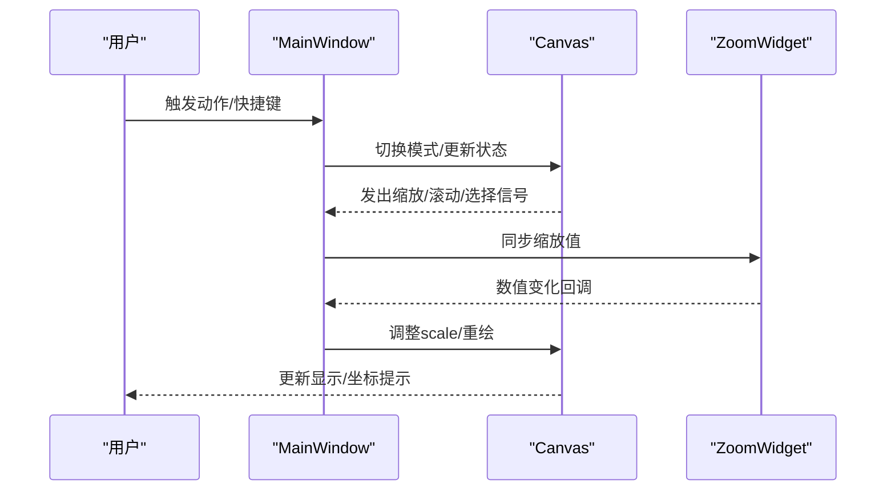
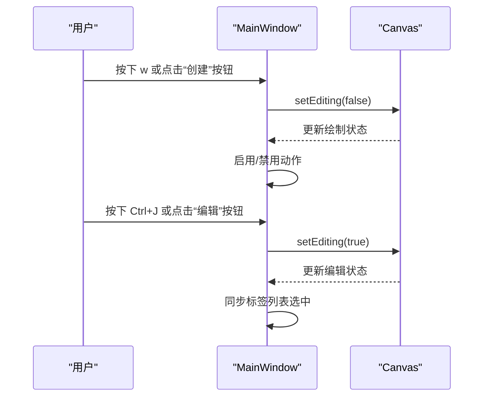
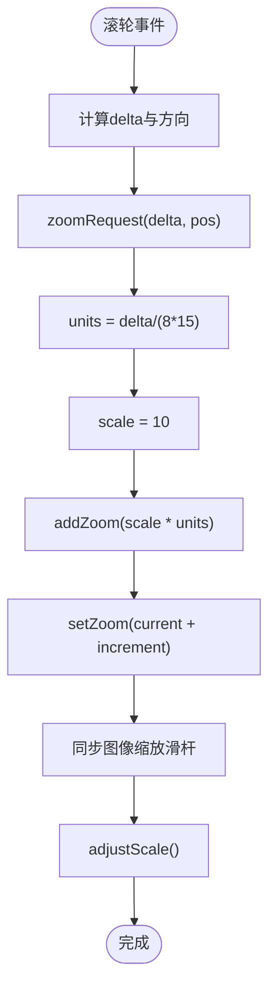
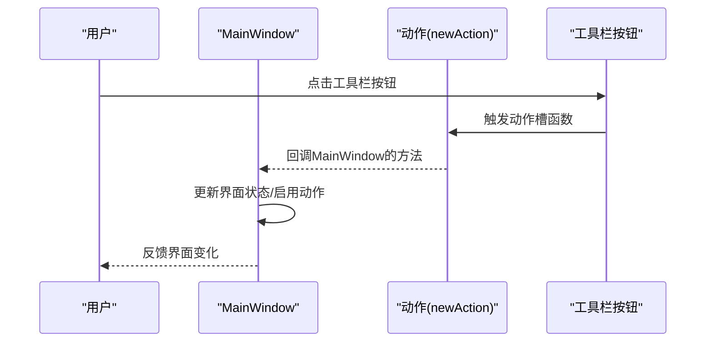
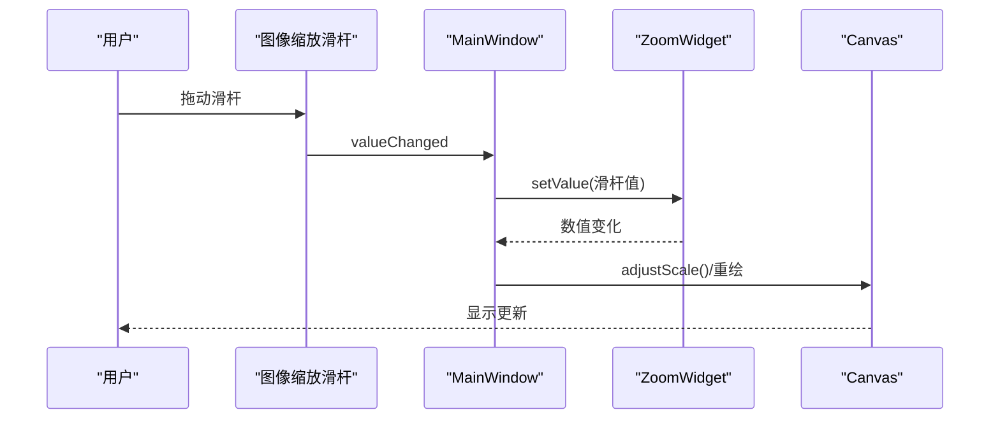
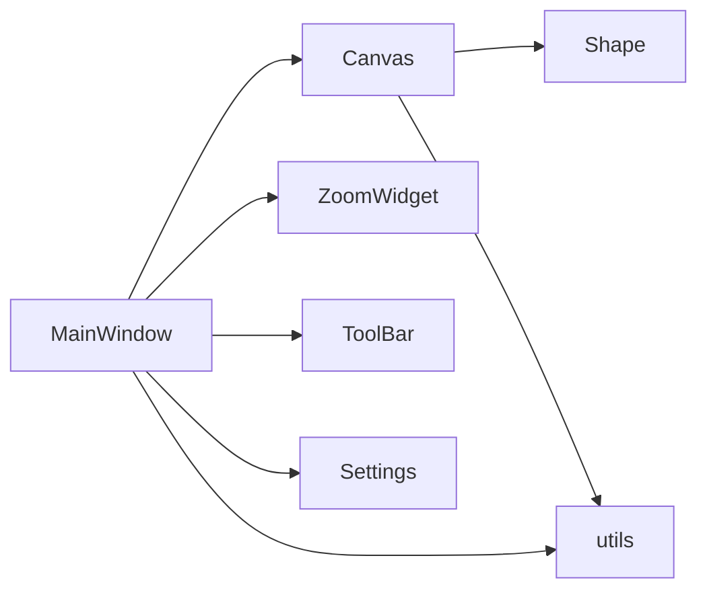

# 界面控制 API

<cite>
**本文引用的文件**
- [PPOCRLabel.py](PPOCRLabel.md)
- [canvas.py](canvas.md)
- [zoomWidget.py](zoomWidget.md)
- [toolBar.py](toolBar.md)
- [settings.py](settings.md)
- [constants.py](constants.md)
- [utils.py](utils.md)
- [shape.py](shape.md)
</cite>

## 目录
1. [简介](#简介)
2. [项目结构](#项目结构)
3. [核心组件](#核心组件)
4. [架构总览](#架构总览)
5. [详细组件分析](#详细组件分析)
6. [依赖关系分析](#依赖关系分析)
7. [性能考量](#性能考量)
8. [故障排查指南](#故障排查指南)
9. [结论](#结论)
10. [附录](#附录)

## 简介
本文件聚焦于界面控制相关 API 的系统化说明，覆盖以下能力：
- 绘图与编辑模式切换：setCreateMode、setEditMode
- 缩放控制：setZoom、addZoom、zoomRequest（滚轮/中键）、setFitWindow、setFitWidth
- 布局与窗口状态：图像缩放滑杆联动、工具栏按钮样式、窗口尺寸/状态持久化
- 用户交互反馈：坐标提示、选择高亮、滚动联动、动作启用/禁用
- 显示选项与适配模式：FIT_WINDOW、FIT_WIDTH、MANUAL_ZOOM 模式切换
- 工具栏按钮、菜单项、快捷键的响应机制

目标是帮助开发者快速理解并扩展界面控制逻辑，同时为用户提供一致、直观的交互体验。

## 项目结构
界面控制主要由主窗口类负责，配合画布、缩放控件、工具栏、设置常量与工具函数协同工作。

图表来源
- [PPOCRLabel.py](PPOCRLabel.md)
- [canvas.py](canvas.md)
- [zoomWidget.py](zoomWidget.md)
- [toolBar.py](toolBar.md)
- [settings.py](settings.md)
- [constants.py](constants.md)
- [utils.py](utils.md)
- [shape.py](shape.md)

章节来源
- [PPOCRLabel.py](PPOCRLabel.md)
- [canvas.py](canvas.md)
- [zoomWidget.py](zoomWidget.md)
- [toolBar.py](toolBar.md)
- [settings.py](settings.md)
- [constants.py](constants.md)
- [utils.py](utils.md)
- [shape.py](shape.md)

## 核心组件
- MainWindow：负责界面状态、动作启用/禁用、缩放模式与适配、滚动联动、工具栏/菜单/快捷键绑定、窗口状态持久化。
- Canvas：负责鼠标/键盘事件、绘制、选择高亮、拖拽平移、滚动请求信号。
- ZoomWidget：提供 1%-500% 的缩放输入框，支持对齐与提示。
- ToolBar/ToolButton：统一工具栏按钮尺寸与风格。
- Settings/constants：窗口尺寸、位置、状态、绘图方形模式等配置键。
- utils：newAction/newButton、addActions、fmtShortcut 等工具。
- Shape：标注几何对象的数据模型与绘制。

章节来源
- [PPOCRLabel.py](PPOCRLabel.md)
- [canvas.py](canvas.md)
- [zoomWidget.py](zoomWidget.md)
- [toolBar.py](toolBar.md)
- [settings.py](settings.md)
- [constants.py](constants.md)
- [utils.py](utils.md)
- [shape.py](shape.md)

## 架构总览
界面控制采用“主窗口协调 + 画布渲染”的分层设计。主窗口集中处理动作、缩放模式、窗口状态；画布专注绘制与交互事件；ZoomWidget 提供数值化缩放入口；工具栏统一按钮风格；设置模块持久化窗口状态。

图表来源
- [PPOCRLabel.py](PPOCRLabel.md)
- [canvas.py](canvas.md)
- [zoomWidget.py](zoomWidget.md)

章节来源
- [PPOCRLabel.py](PPOCRLabel.md)
- [canvas.py](canvas.md)
- [zoomWidget.py](zoomWidget.md)

## 详细组件分析

### 绘图与编辑模式 API
- setCreateMode
  - 功能：进入创建模式（绘制矩形/四点框）。
  - 行为：切换 Canvas 模式为编辑=False；启用/禁用对应动作。
  - 快捷键：w
  - 章节来源
    - [PPOCRLabel.py](PPOCRLabel.md)
    - [canvas.py](canvas.md)

- setEditMode
  - 功能：进入编辑模式（移动/调整顶点/删除）。
  - 行为：切换 Canvas 模式为编辑=True；同步标签列表选中状态。
  - 快捷键：Ctrl+J
  - 章节来源
    - [PPOCRLabel.py](PPOCRLabel.md)
    - [canvas.py](canvas.md)

- toggleDrawMode(edit=True)
  - 功能：内部切换 Canvas 编辑/创建模式，并更新动作可用性。
  - 章节来源
    - [PPOCRLabel.py](PPOCRLabel.md)
    - [canvas.py](canvas.md)

图表来源
- [PPOCRLabel.py](PPOCRLabel.md)
- [canvas.py](canvas.md)

章节来源
- [PPOCRLabel.py](PPOCRLabel.md)
- [canvas.py](canvas.md)

### 缩放控制 API
- setZoom(value)
  - 功能：设置缩放到指定百分比（如 100），退出适配模式。
  - 行为：清除“适应窗口/宽度”勾选；设置 zoomMode 为 MANUAL_ZOOM；同步 ZoomWidget 数值。
  - 章节来源
    - [PPOCRLabel.py](PPOCRLabel.md)

- addZoom(increment)
  - 功能：在当前基础上增量缩放（+10/-10）。
  - 行为：调用 setZoom(current+increment)，并同步图像缩放滑杆。
  - 章节来源
    - [PPOCRLabel.py](PPOCRLabel.md)

- zoomRequest(delta, pos=None)
  - 功能：根据鼠标滚轮增量进行缩放，并保持视觉焦点（以滚轮为中心）。
  - 行为：计算滚轮单位、按比例缩放；根据光标相对位置计算滚动条偏移，使缩放后焦点不变。
  - 章节来源
    - [PPOCRLabel.py](PPOCRLabel.md)

- setFitWindow(value=True)
  - 功能：开启“适应窗口”模式，使图像完整显示在窗口内。
  - 行为：互斥关闭另一适配模式；设置 zoomMode 为 FIT_WINDOW；调用 adjustScale。
  - 章节来源
    - [PPOCRLabel.py](PPOCRLabel.md)

- setFitWidth(value=True)
  - 功能：开启“适应宽度”模式，使图像宽度与窗口宽度匹配。
  - 行为：互斥关闭另一适配模式；设置 zoomMode 为 FIT_WIDTH；调用 adjustScale。
  - 章节来源
    - [PPOCRLabel.py](PPOCRLabel.md)

- scrollRequest(delta, orientation)
  - 功能：根据滚轮增量滚动视图。
  - 行为：计算步进单位并更新水平/垂直滚动条。
  - 章节来源
    - [PPOCRLabel.py](PPOCRLabel.md)

- ZoomWidget（数值缩放输入）
  - 功能：提供 1%-500% 的缩放输入框，居中对齐与提示文本。
  - 章节来源
    - [zoomWidget.py](zoomWidget.md)

图表来源
- [PPOCRLabel.py](PPOCRLabel.md)
- [PPOCRLabel.py](PPOCRLabel.md)
- [PPOCRLabel.py](PPOCRLabel.md)

章节来源
- [PPOCRLabel.py](PPOCRLabel.md)
- [zoomWidget.py](zoomWidget.md)

### 工具栏按钮、菜单项、快捷键响应机制
- 工具栏按钮
  - ToolBar/ToolButton：统一按钮最小尺寸与样式，确保工具栏美观一致。
  - 章节来源
    - [toolBar.py](toolBar.md)

- 菜单项与动作
  - newAction：创建带图标、快捷键、提示的动作；支持 checkable 与多快捷键。
  - addActions：批量添加动作或分隔符到菜单/工具栏。
  - fmtShortcut：格式化快捷键显示。
  - 章节来源
    - [utils.py](utils.md)
    - [utils.py](utils.md)

- 快捷键示例（节选）
  - 创建/编辑：w、Ctrl+J
  - 缩放：Ctrl++、Ctrl+-、Ctrl+=、Ctrl+F、Ctrl+Shift+F
  - 其他：Ctrl+E、Ctrl+R、Ctrl+Shift+R、Ctrl+C、Backspace/Delete、A/D 等
  - 章节来源
    - [PPOCRLabel.py](PPOCRLabel.md)
    - [utils.py](utils.md)

图表来源
- [utils.py](utils.md)
- [PPOCRLabel.py](PPOCRLabel.md)
- [toolBar.py](toolBar.md)

章节来源
- [utils.py](utils.md)
- [PPOCRLabel.py](PPOCRLabel.md)
- [toolBar.py](toolBar.md)

### 界面布局调整与窗口状态管理
- 图像缩放滑杆联动
  - CanvasSizeChange：当滑杆获得焦点时，同步 ZoomWidget 数值。
  - 章节来源
    - [PPOCRLabel.py](PPOCRLabel.md)

- 窗口尺寸/状态持久化
  - Settings：保存/加载窗口尺寸、位置、状态、绘图方形模式等键值。
  - constants：定义键名（如 window/size、window/position、window/state、draw/square 等）。
  - 章节来源
    - [settings.py](settings.md)
    - [constants.py](constants.md)

- 画布与滚动区域
  - Canvas：接收滚动请求并更新偏移；paintEvent 中应用 scale 与偏移。
  - 章节来源
    - [canvas.py](canvas.md)
    - [canvas.py](canvas.md)

图表来源
- [PPOCRLabel.py](PPOCRLabel.md)
- [PPOCRLabel.py](PPOCRLabel.md)
- [canvas.py](canvas.md)

章节来源
- [PPOCRLabel.py](PPOCRLabel.md)
- [PPOCRLabel.py](PPOCRLabel.md)
- [canvas.py](canvas.md)

### 用户交互反馈
- 坐标提示与尺寸提示
  - Canvas 鼠标移动时更新状态栏坐标；绘制过程中显示宽高。
  - 章节来源
    - [canvas.py](canvas.md)

- 选择高亮与顶点高亮
  - Canvas 在悬停/选择时高亮形状与顶点，改变光标样式。
  - 章节来源
    - [canvas.py](canvas.md)

- 滚动联动与平移
  - Canvas 鼠标拖拽触发滚动请求；MainWindow 根据 delta 更新滚动条。
  - 章节来源
    - [canvas.py](canvas.md)
    - [PPOCRLabel.py](PPOCRLabel.md)

- 动作启用/禁用
  - 根据当前状态（有无选择、是否编辑模式、是否有文件）动态启用/禁用动作。
  - 章节来源
    - [PPOCRLabel.py](PPOCRLabel.md)

### 显示选项与适配模式
- 适配模式
  - FIT_WINDOW：完整显示图像于窗口内。
  - FIT_WIDTH：以图像宽度适配窗口宽度。
  - MANUAL_ZOOM：手动缩放。
  - 章节来源
    - [PPOCRLabel.py](PPOCRLabel.md)
    - [PPOCRLabel.py](PPOCRLabel.md)

- 缩放模式切换
  - setFitWindow/setFitWidth 会互斥关闭另一个模式，并调用 adjustScale。
  - 章节来源
    - [PPOCRLabel.py](PPOCRLabel.md)

### 界面定制与用户体验优化建议
- 统一工具栏按钮尺寸与风格，避免按钮大小不一致导致的视觉割裂。
- 为常用操作提供双通道（工具栏按钮+快捷键），提升效率。
- 缩放时保持视觉焦点稳定（zoomRequest 已实现），减少用户重新定位成本。
- 对关键动作提供状态栏提示与坐标提示，增强可感知性。
- 将窗口尺寸/状态持久化至 Settings，提升用户会话连续性。

章节来源
- [toolBar.py](toolBar.md)
- [utils.py](utils.md)
- [PPOCRLabel.py](PPOCRLabel.md)
- [settings.py](settings.md)

## 依赖关系分析
- 主窗口依赖画布进行绘制与交互，依赖 ZoomWidget 进行数值化缩放，依赖工具栏统一按钮风格，依赖设置模块持久化窗口状态。
- 画布依赖 Shape 数据模型进行绘制与高亮，依赖 utils 的距离计算与工具函数。
- 工具函数为动作创建与快捷键格式化提供支撑。

图表来源
- [PPOCRLabel.py](PPOCRLabel.md)
- [canvas.py](canvas.md)
- [zoomWidget.py](zoomWidget.md)
- [toolBar.py](toolBar.md)
- [settings.py](settings.md)
- [utils.py](utils.md)
- [shape.py](shape.md)

章节来源
- [PPOCRLabel.py](PPOCRLabel.md)
- [canvas.py](canvas.md)
- [zoomWidget.py](zoomWidget.md)
- [toolBar.py](toolBar.md)
- [settings.py](settings.md)
- [utils.py](utils.md)
- [shape.py](shape.md)

## 性能考量
- 缩放与重绘：Canvas 在 paintEvent 中应用 scale 与偏移，建议避免频繁大范围重绘；缩放通过数值化输入与信号驱动，减少不必要的刷新。
- 滚动联动：scrollRequest 使用步进单位计算，避免过大的滚动增量导致卡顿。
- 顶点高亮与绘制：Shape 的绘制路径与顶点绘制在 paintEvent 中执行，注意在高分辨率图像下的绘制开销。

## 故障排查指南
- 缩放无效
  - 检查 ZoomWidget 是否被启用；确认 setZoom/addZoom 被正确调用。
  - 章节来源
    - [PPOCRLabel.py](PPOCRLabel.md)

- 适配模式冲突
  - setFitWindow 与 setFitWidth 互斥，确保同一时间仅有一个处于选中状态。
  - 章节来源
    - [PPOCRLabel.py](PPOCRLabel.md)

- 滚轮缩放焦点漂移
  - zoomRequest 已根据光标相对位置计算滚动条偏移，若仍出现异常，检查鼠标全局坐标映射与窗口尺寸。
  - 章节来源
    - [PPOCRLabel.py](PPOCRLabel.md)

- 工具栏按钮尺寸不一致
  - 确认使用 ToolBar/ToolButton 组件，且 ToolButton 的最小尺寸已生效。
  - 章节来源
    - [toolBar.py](toolBar.md)

- 窗口状态未恢复
  - 检查 Settings 的 load/save 流程与键名（constants）是否匹配。
  - 章节来源
    - [settings.py](settings.md)
    - [constants.py](constants.md)

## 结论
本文梳理了界面控制相关的核心 API：绘图/编辑模式切换、缩放控制、适配模式、工具栏/菜单/快捷键响应、布局联动与窗口状态持久化。通过清晰的职责划分与信号驱动，系统实现了稳定、直观的用户交互体验。建议在扩展新功能时遵循现有模式，统一动作创建、快捷键与状态反馈，以维持一致的用户体验。

## 附录
- 关键 API 路径索引
  - setCreateMode：[PPOCRLabel.py](PPOCRLabel.md)
  - setEditMode：[PPOCRLabel.py](PPOCRLabel.md)
  - setZoom：[PPOCRLabel.py](PPOCRLabel.md)
  - addZoom：[PPOCRLabel.py](PPOCRLabel.md)
  - zoomRequest：[PPOCRLabel.py](PPOCRLabel.md)
  - setFitWindow：[PPOCRLabel.py](PPOCRLabel.md)
  - setFitWidth：[PPOCRLabel.py](PPOCRLabel.md)
  - scrollRequest：[PPOCRLabel.py](PPOCRLabel.md)
  - Canvas 缩放与绘制：[canvas.py](canvas.md)
  - ZoomWidget：[zoomWidget.py](zoomWidget.md)
  - 工具栏按钮样式：[toolBar.py](toolBar.md)
  - 动作与快捷键工具：[utils.py](utils.md)
  - 设置键名：[constants.py](constants.md)
  - 设置持久化：[settings.py](settings.md)
  - Shape 数据模型：[shape.py](shape.md)