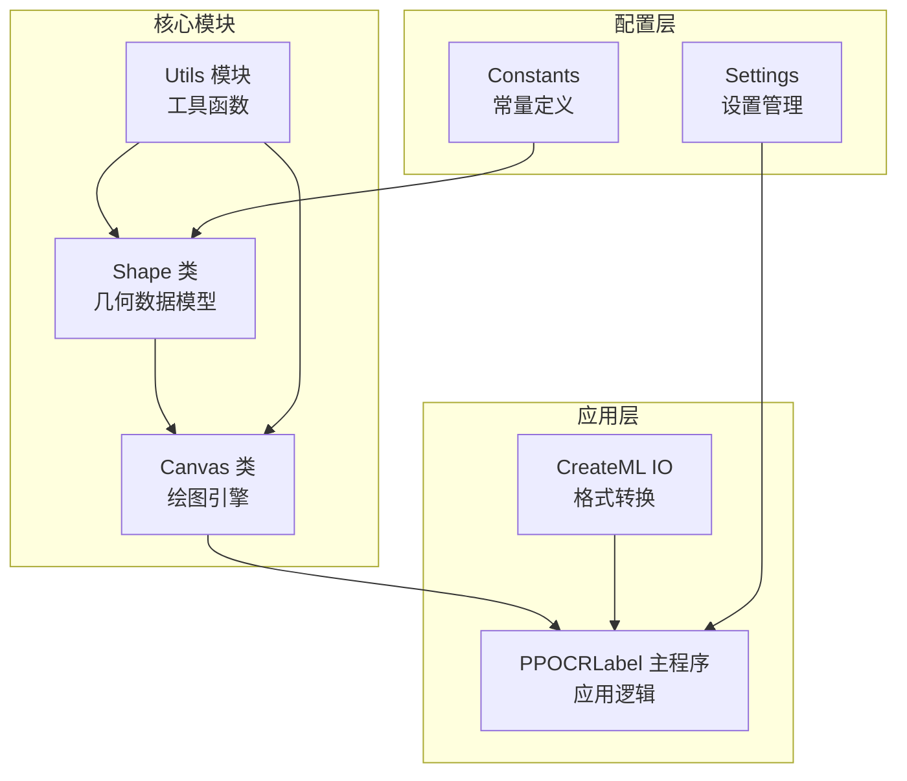
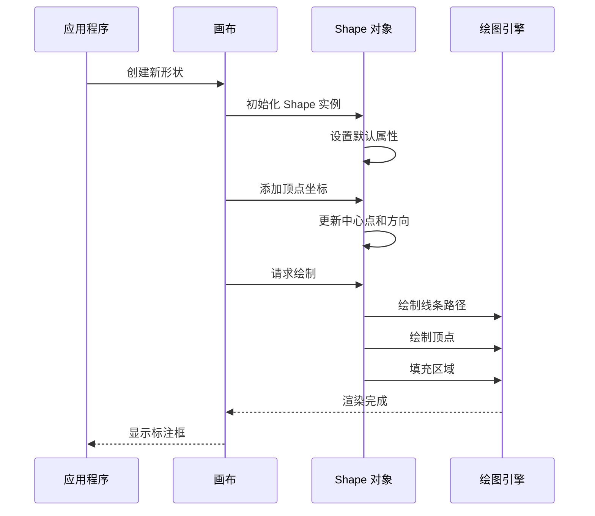
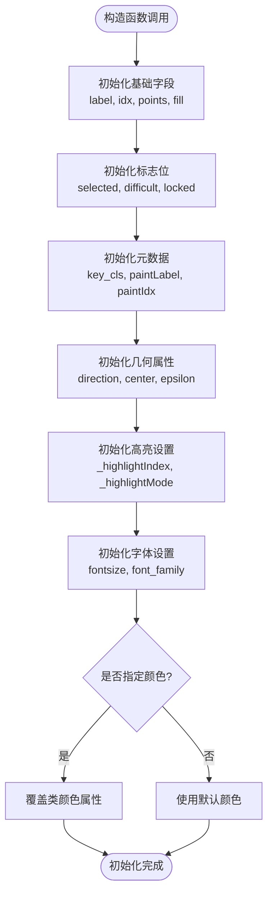
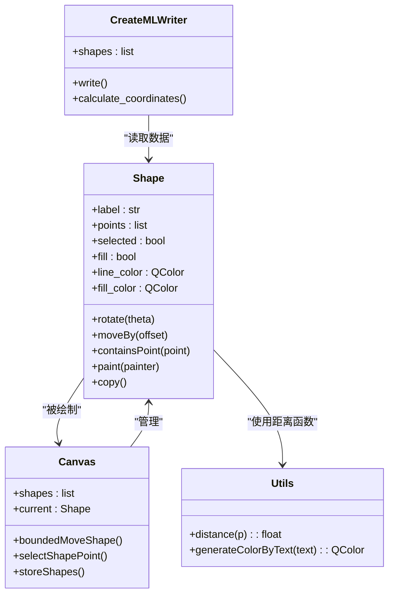

# Shape 类 API

<cite>
**本文档引用的文件**
- [libs/shape.py](shape.md)
- [libs/canvas.py](canvas.md)
- [libs/utils.py](utils.md)
- [libs/constants.py](constants.md)
- [libs/create_ml_io.py](create_ml_io.md)
- [PPOCRLabel.py](PPOCRLabel.md)
</cite>

## 目录
1. [简介](#简介)
2. [项目结构](#项目结构)
3. [核心组件](#核心组件)
4. [架构概览](#架构概览)
5. [详细组件分析](#详细组件分析)
6. [依赖关系分析](#依赖关系分析)
7. [性能考虑](#性能考虑)
8. [故障排除指南](#故障排除指南)
9. [结论](#结论)

## 简介

Shape 类是 PPOCRLabel 应用程序中标注框几何数据模型的核心组件。它负责管理多边形标注框的几何数据、渲染样式和交互操作。该类支持任意多边形形状，特别针对表格标注场景优化，能够处理四点标注模式。

## 项目结构

PPOCRLabel 是一个基于 PyQt5 的 OCR 文本标注工具，主要包含以下关键模块：

**图表来源**
- [libs/shape.py](shape.md)
- [libs/canvas.py](canvas.md)
- [libs/utils.py](utils.md)

**章节来源**
- [libs/shape.py](shape.md)
- [libs/canvas.py](canvas.md)

## 核心组件

### Shape 类概述

Shape 类是一个专门设计用于处理标注框几何数据的类，支持以下核心功能：

- **几何数据管理**：存储和操作多边形顶点坐标
- **渲染控制**：管理线条颜色、填充颜色和高亮显示
- **几何变换**：支持平移、旋转、缩放等变换操作
- **交互支持**：提供顶点选择、拖拽和边界检测功能
- **序列化支持**：支持对象状态的保存和恢复

### 主要属性

| 属性名 | 类型 | 默认值 | 描述 |
|--------|------|--------|------|
| `label` | 字符串 | None | 标注框标签文本 |
| `points` | 列表 | [] | 顶点坐标列表（QPointF） |
| `selected` | 布尔值 | False | 是否被选中状态 |
| `fill` | 布尔值 | False | 是否填充内部区域 |
| `difficult` | 布尔值 | False | 是否为困难样本 |
| `key_cls` | 字符串 | "None" | 关键类别标识 |
| `paintLabel` | 布尔值 | False | 是否绘制标签文本 |
| `paintIdx` | 布尔值 | False | 是否绘制索引编号 |
| `locked` | 布尔值 | False | 是否锁定状态 |
| `direction` | 浮点数 | 0 | 形状方向角度 |
| `center` | QPointF | None | 形状中心点坐标 |
| `epsilon` | 整数 | 5 | 距离计算精度 |

### 类变量（全局样式）

| 变量名 | 类型 | 默认值 | 描述 |
|--------|------|--------|------|
| `line_color` | QColor | 绿色半透明 | 默认线条颜色 |
| `fill_color` | QColor | 红色半透明 | 默认填充颜色 |
| `select_line_color` | QColor | 白色 | 选中时线条颜色 |
| `select_fill_color` | QColor | 蓝色半透明 | 选中时填充颜色 |
| `vertex_fill_color` | QColor | 绿色 | 顶点填充颜色 |
| `hvertex_fill_color` | QColor | 红色 | 高亮顶点颜色 |
| `point_type` | 整数 | P_ROUND | 顶点形状类型 |
| `point_size` | 整数 | 8 | 顶点大小 |
| `scale` | 浮点数 | 1.0 | 缩放比例 |

**章节来源**
- [libs/shape.py](shape.md)

## 架构概览

Shape 类在整个系统架构中扮演着核心数据模型的角色：

**图表来源**
- [libs/shape.py](shape.md)
- [libs/canvas.py](canvas.md)

**章节来源**
- [libs/shape.py](shape.md)
- [libs/canvas.py](canvas.md)

## 详细组件分析

### 构造函数和初始化

Shape 类的构造函数提供了灵活的初始化选项：

**图表来源**
- [libs/shape.py](shape.md)

**构造函数参数说明**

| 参数名 | 类型 | 默认值 | 必需 | 描述 |
|--------|------|--------|------|------|
| `label` | 字符串 | None | 否 | 标注框标签文本 |
| `line_color` | QColor | None | 否 | 自定义线条颜色 |
| `difficult` | 布尔值 | False | 否 | 困难样本标记 |
| `key_cls` | 字符串 | "None" | 否 | 关键类别标识 |
| `paintLabel` | 布尔值 | False | 否 | 是否绘制标签文本 |
| `paintIdx` | 布尔值 | False | 否 | 是否绘制索引编号 |
| `font_family` | 字体族 | None | 否 | 字体家族名称 |

**章节来源**
- [libs/shape.py](shape.md)

### 几何变换方法

Shape 类提供了多种几何变换能力：

#### 平移变换（moveBy）
支持整体平移整个形状：
- 接受偏移向量参数
- 更新所有顶点坐标
- 保持相对位置不变

#### 顶点移动（moveVertexBy）
支持单个顶点的精确移动：
- 接受顶点索引和偏移量
- 仅更新指定顶点坐标
- 维护形状拓扑结构

#### 旋转变换（rotate）
支持围绕中心点的旋转：
- 接受旋转角度（弧度）
- 计算每个顶点相对于中心点的旋转
- 更新方向属性

#### 顶点旋转（rotatePoint）
单个顶点的旋转计算：
- 使用旋转矩阵公式
- 保持极坐标半径不变
- 更新笛卡尔坐标

**章节来源**
- [libs/shape.py](shape.md)
- [libs/shape.py](shape.md)

### 几何判断方法

#### 包含点检测（containsPoint）
使用 QPainterPath 的 contains 方法进行精确检测：
- 将顶点序列转换为路径
- 检查目标点是否位于路径内部
- 支持复杂多边形的包含关系

#### 最近顶点查找（nearestVertex）
顶点选择的辅助方法：
- 计算点到每个顶点的距离
- 使用 epsilon 阈值进行近似匹配
- 返回最近顶点的索引

#### 边界矩形（boundingRect）
快速边界检测：
- 基于路径的最小包围矩形
- 用于碰撞检测和性能优化
- 支持快速筛选候选形状

**章节来源**
- [libs/shape.py](shape.md)
- [libs/shape.py](shape.md)

### 数据转换方法

#### 多边形转换（toPolygon）
将形状转换为标准多边形格式：
- 输出格式：[(x1, y1), (x2, y2), ...]
- 用于外部系统集成
- 支持不同坐标系转换

#### 折线转换（toPolyline）
转换为折线格式：
- 输出连续的线段序列
- 便于路径绘制和分析
- 支持开集和闭集两种模式

#### 点集合访问（points）
直接访问顶点集合：
- 支持列表操作语法
- 提供索引访问和切片操作
- 允许动态修改顶点数量

**章节来源**
- [libs/shape.py](shape.md)
- [libs/shape.py](shape.md)

### 渲染和可视化

#### 绘制方法（paint）
完整的绘制流程：
- 根据选中状态选择颜色
- 创建线条路径和顶点路径
- 绘制主轮廓和顶点
- 可选的标签和索引文本

#### 顶点绘制（drawVertex）
顶点样式的自定义：
- 支持方形和圆形顶点
- 动态高亮效果
- 缩放适应屏幕分辨率

#### 高亮管理（highlightVertex）
交互式高亮：
- 管理高亮索引和模式
- 动态调整顶点大小
- 支持移动和选择两种模式

**章节来源**
- [libs/shape.py](shape.md)

### 状态管理和生命周期

#### 形状闭合（close）
自动闭合机制：
- 计算中心点坐标
- 标记为闭合状态
- 触发相关事件

#### 最大点数检查（reachMaxPoints）
限制和验证：
- 默认最大4个顶点
- 支持自定义限制
- 防止过度顶点

#### 点添加和移除（addPoint, popPoint）
动态顶点管理：
- 智能闭合检测
- 边界距离计算
- 安全的顶点操作

**章节来源**
- [libs/shape.py](shape.md)
- [libs/shape.py](shape.md)

## 依赖关系分析

Shape 类与其他组件的依赖关系：

**图表来源**
- [libs/shape.py](shape.md)
- [libs/canvas.py](canvas.md)
- [libs/utils.py](utils.md)
- [libs/create_ml_io.py](create_ml_io.md)

**章节来源**
- [libs/shape.py](shape.md)
- [libs/canvas.py](canvas.md)

## 性能考虑

### 几何计算优化

1. **距离计算缓存**
   - 使用 utils.distance 函数避免重复计算
   - epsilon 阈值减少不必要的精确计算

2. **路径缓存策略**
   - makePath 方法创建的 QPainterPath 可以复用
   - boundingRect 用于快速边界检测

3. **内存管理**
   - copy 方法创建浅拷贝避免深度复制
   - points 列表的动态增长优化

### 渲染性能

1. **批量绘制**
   - QPainterPath 支持一次性绘制多个线段
   - 减少绘制调用次数

2. **条件渲染**
   - 只在需要时计算包围盒
   - 避免不必要的文本绘制

## 故障排除指南

### 常见问题和解决方案

#### 形状无法正确闭合
**症状**：四点标注完成后形状不闭合
**原因**：顶点数量不足或距离检测失败
**解决**：检查 epsilon 值和顶点坐标精度

#### 旋转中心计算错误
**症状**：旋转时形状偏离预期中心
**原因**：center 属性未正确设置
**解决**：确保在添加第一个点后调用 close()

#### 颜色显示异常
**症状**：选中状态颜色不正确
**原因**：全局颜色变量未正确设置
**解决**：通过 Canvas 类设置 Shape 类的颜色属性

#### 性能问题
**症状**：大量形状时渲染缓慢
**解决**：使用 boundingRect 进行快速筛选，避免逐个 containsPoint 检测

**章节来源**
- [libs/shape.py](shape.md)
- [libs/canvas.py](canvas.md)

## 结论

Shape 类作为 PPOCRLabel 的核心几何数据模型，提供了完整而灵活的标注框管理能力。其设计充分考虑了 OCR 应用的特殊需求，特别是表格标注场景的四点标注支持。

### 主要优势

1. **模块化设计**：清晰的职责分离，易于维护和扩展
2. **性能优化**：合理的算法选择和缓存策略
3. **用户友好**：直观的 API 设计和丰富的交互功能
4. **可扩展性**：支持自定义颜色、字体和行为

### 应用建议

1. **数据一致性**：始终通过 Canvas 类管理 Shape 对象的生命周期
2. **性能监控**：在大量数据场景下使用 boundingRect 进行快速筛选
3. **错误处理**：合理设置 epsilon 和边界条件，避免数值精度问题
4. **内存管理**：及时清理不需要的 Shape 对象，避免内存泄漏

该类为 OCR 文本标注提供了坚实的基础，支持从简单矩形框到复杂多边形的完整标注需求。