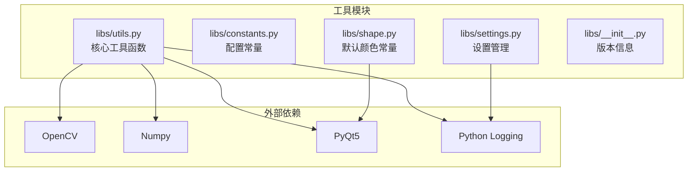
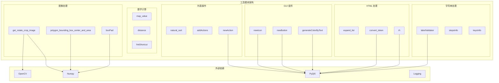
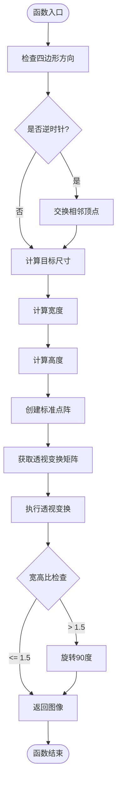
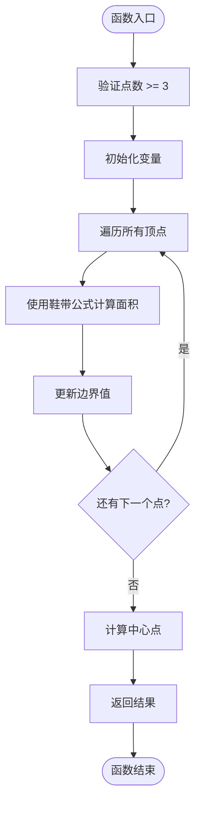
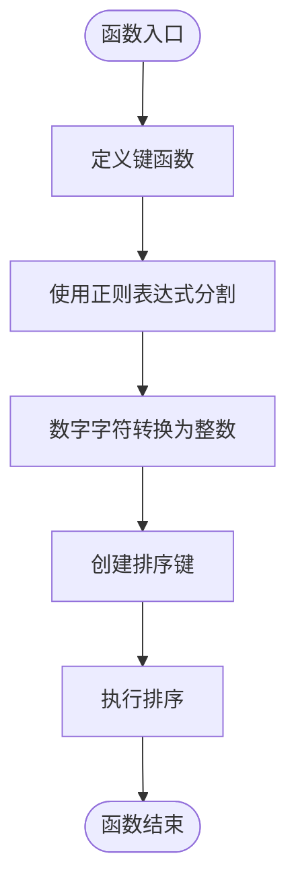
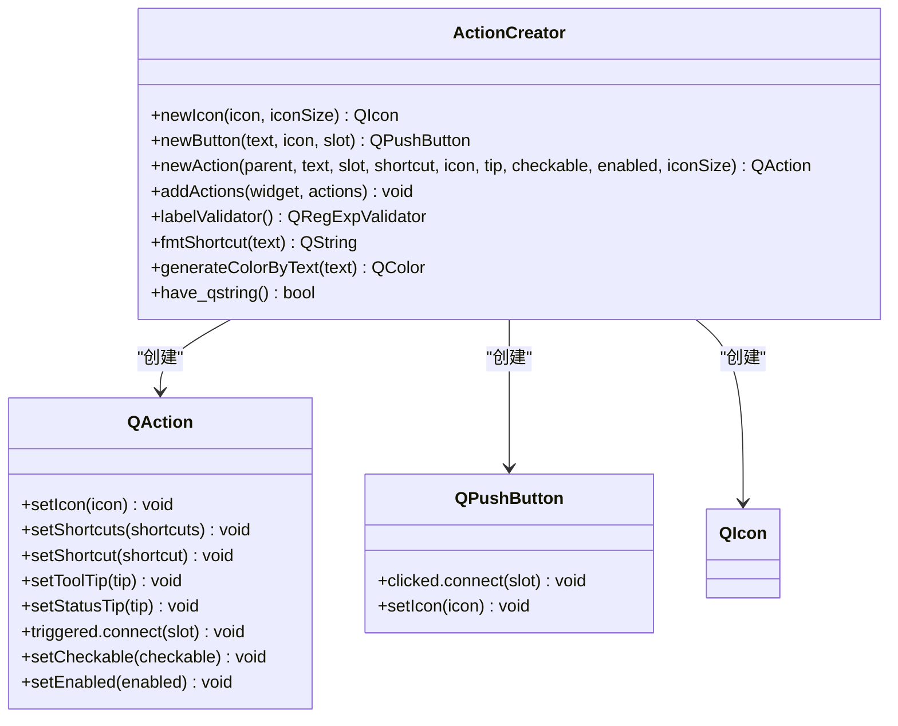
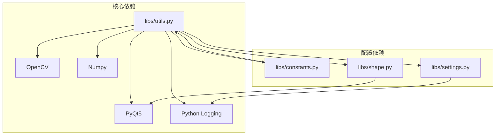
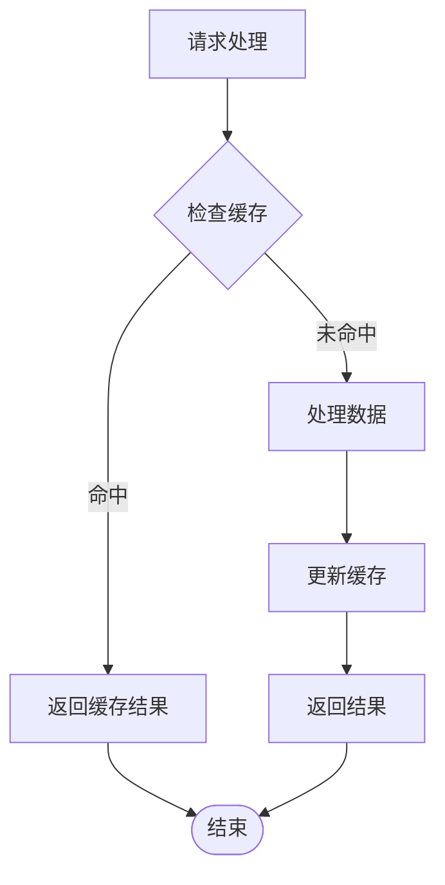

# 工具函数 API

<cite>
**本文档引用的文件**
- [libs/utils.py](utils.md)
- [libs/constants.py](constants.md)
- [libs/settings.py](settings.md)
- [libs/shape.py](shape.md)
- [libs/__init__.py](__init__.md)
</cite>

## 目录
1. [简介](#简介)
2. [项目结构](#项目结构)
3. [核心组件](#核心组件)
4. [架构概览](#架构概览)
5. [详细组件分析](#详细组件分析)
6. [依赖关系分析](#依赖关系分析)
7. [性能考虑](#性能考虑)
8. [故障排除指南](#故障排除指南)
9. [结论](#结论)

## 简介
本文档提供了 PaddleOCR 应用程序中工具函数和常量的完整 API 参考文档。该工具模块包含了图像处理、列表操作、数学计算、字符串处理和文件操作等实用函数，以及各种配置常量。文档详细记录了每个函数的签名、参数、返回值和使用示例，并提供了算法说明和性能考虑。

## 项目结构
工具函数主要位于 `libs/utils.py` 文件中，同时涉及以下相关文件：
- `libs/constants.py`: 定义设置和格式相关的常量
- `libs/settings.py`: 提供设置管理功能
- `libs/shape.py`: 定义默认颜色常量
- `libs/__init__.py`: 包含版本信息



**图表来源**
- [libs/utils.py](utils.md)
- [libs/settings.py](settings.md)
- [libs/shape.py](shape.md)

**章节来源**
- [libs/utils.py](utils.md)
- [libs/constants.py](constants.md)
- [libs/settings.py](settings.md)
- [libs/shape.py](shape.md)
- [libs/__init__.py](__init__.md)

## 核心组件

### 图像处理函数

#### get_rotate_crop_image
用于对图像进行旋转和裁剪处理的函数，支持任意四边形的透视变换。

**函数签名**: `get_rotate_crop_image(img, points)`

**参数**:
- `img`: 输入图像数组 (numpy.ndarray)
- `points`: 四边形顶点坐标列表，格式为 [[x1, y1], [x2, y2], [x3, y3], [x4, y4]]

**返回值**: 处理后的图像数组，如果处理失败则返回 None

**算法说明**:
1. 使用 Green 公式判断四边形方向（顺时针/逆时针）
2. 调整顶点顺序确保正确的透视变换
3. 计算目标图像的宽度和高度
4. 通过透视变换矩阵进行几何变换
5. 根据宽高比决定是否需要旋转 90 度

**使用示例**: 
```python
# 对检测到的文本区域进行矫正
cropped_img = get_rotate_crop_image(image, [[x1,y1],[x2,y2],[x3,y3],[x4,y4]])
```

#### polygon_bounding_box_center_and_area
计算多边形的边界框中心点和面积。

**函数签名**: `polygon_bounding_box_center_and_area(points)`

**参数**:
- `points`: 多边形顶点列表，每个元素为具有 x() 和 y() 方法的对象

**返回值**: 元组 (center_x, center_y, area)

**算法说明**:
1. 使用鞋带公式计算多边形面积
2. 同时计算最小包围矩形的边界
3. 返回中心点坐标和面积

**使用示例**:
```python
# 获取文本框的几何信息
center_x, center_y, area = polygon_bounding_box_center_and_area(points)
```

### 列表操作函数

#### natural_sort
实现自然排序算法，正确处理数字和字母混合的字符串。

**函数签名**: `natural_sort(list, key=lambda s: s)`

**参数**:
- `list`: 待排序的列表
- `key`: 键函数，默认为身份函数

**返回值**: None（原地排序）

**算法说明**:
1. 将字符串分割为字母和数字片段
2. 数字片段转换为整数进行比较
3. 实现真正的自然排序效果

**使用示例**:
```python
# 正确排序包含数字的文件名
files.sort(key=natural_sort)
```

#### addActions
批量添加动作到菜单或工具栏。

**函数签名**: `addActions(widget, actions)`

**参数**:
- `widget`: 目标控件（QMenu/QToolBar）
- `actions`: 动作列表，None 表示分隔符

**返回值**: None

**使用示例**:
```python
# 添加多个动作到工具栏
addActions(toolbar, [action1, None, action2, menu])
```

#### newAction
创建新的 QAction 并设置各种属性。

**函数签名**: `newAction(parent, text, slot=None, shortcut=None, icon=None, tip=None, checkable=False, enabled=True, iconSize=None)`

**参数**:
- `parent`: 父对象
- `text`: 动作文本
- `slot`: 触发回调函数
- `shortcut`: 快捷键
- `icon`: 图标名称
- `tip`: 提示信息
- `checkable`: 是否可选中
- `enabled`: 是否启用
- `iconSize`: 图标尺寸

**返回值**: 新创建的 QAction 对象

**使用示例**:
```python
# 创建带图标的动作
action = newAction(self, "保存", slot=self.save, icon="save", shortcut="Ctrl+S")
```

### 数学计算函数

#### map_value
数值映射函数，将值从一个范围映射到另一个范围。

**函数签名**: `map_value(x, in_min, in_max, out_min, out_max)`

**参数**:
- `x`: 输入值
- `in_min`: 输入范围最小值
- `in_max`: 输入范围最大值
- `out_min`: 输出范围最小值
- `out_max`: 输出范围最大值

**返回值**: 映射后的值

**异常**: 当输入范围无效时抛出 ValueError

**使用示例**:
```python
# 将像素值映射到 0-1 范围
normalized_value = map_value(pixel_value, 0, 255, 0, 1)
```

### 字符串处理函数

#### labelValidator
创建标签验证器，限制标签格式。

**函数签名**: `labelValidator()`

**返回值**: QRegExpValidator 对象

**使用示例**:
```python
# 创建标签输入验证器
validator = labelValidator()
lineEdit.setValidator(validator)
```

#### fmtShortcut
格式化快捷键显示。

**函数签名**: `fmtShortcut(text)`

**参数**:
- `text`: 快捷键文本

**返回值**: 格式化后的 HTML 文本

**使用示例**:
```python
# 格式化快捷键显示
formatted_shortcut = fmtShortcut("Ctrl+O")
```

### 文件操作函数

#### boxPad
为边界框添加内边距。

**函数签名**: `boxPad(box, imgShape, pad: int) -> np.array`

**参数**:
- `box`: 边界框坐标
- `imgShape`: 图像形状 (h, w, channels)
- `pad`: 边距大小

**返回值**: 处理后的边界框坐标数组

**使用示例**:
```python
# 为检测框添加边距
padded_box = boxPad(box, image.shape, 10)
```

### GUI 组件函数

#### newIcon
加载图标资源。

**函数签名**: `newIcon(icon, iconSize=None)`

**参数**:
- `icon`: 图标文件名
- `iconSize`: 图标尺寸

**返回值**: QIcon 对象

**使用示例**:
```python
# 加载应用图标
icon = newIcon("app_icon")
```

#### newButton
创建按钮。

**函数签名**: `newButton(text, icon=None, slot=None)`

**参数**:
- `text`: 按钮文本
- `icon`: 图标
- `slot`: 点击回调

**返回值**: QPushButton 对象

**使用示例**:
```python
# 创建带图标的按钮
button = newButton("确定", icon="ok", slot=self.ok_clicked)
```

### HTML 处理函数

#### expand_list
根据合并单元格信息填充空白。

**函数签名**: `expand_list(merged, html_list)`

**参数**:
- `merged`: 合并范围 (sr, er, sc, ec)
- `html_list`: HTML 表格列表

**返回值**: 更新后的 HTML 列表

**使用示例**:
```python
# 处理表格合并单元格
expand_list((0,1,0,2), html_table)
```

#### convert_token
将原始 HTML 转换为标签格式。

**函数签名**: `convert_token(html_list)`

**参数**:
- `html_list`: HTML 列表

**返回值**: 标签格式的 token 列表

**使用示例**:
```python
# 转换 HTML 结构为标签格式
tokens = convert_token(html_list)
```

#### rebuild_html_from_ppstructure_label
从 PaddleOCR 结构化标签重建 HTML。

**函数签名**: `rebuild_html_from_ppstructure_label(label_info)`

**参数**:
- `label_info`: 标签信息字典

**返回值**: HTML 字符串

**使用示例**:
```python
# 重建表格 HTML
html_string = rebuild_html_from_ppstructure_label(label_info)
```

### 文档信息函数

#### stepsInfo
获取操作步骤信息。

**函数签名**: `stepsInfo(lang="en")`

**参数**:
- `lang`: 语言 ("en" 或 "ch")

**返回值**: 步骤说明字符串

**使用示例**:
```python
# 获取英文操作步骤
steps = stepsInfo("en")
```

#### keysInfo
获取快捷键信息。

**函数签名**: `keysInfo(lang="en")`

**参数**:
- `lang`: 语言 ("en" 或 "ch")

**返回值**: 快捷键说明字符串

**使用示例**:
```python
# 获取快捷键帮助
keys = keysInfo("ch")
```

**章节来源**
- [libs/utils.py](utils.md)

## 架构概览

工具模块采用模块化设计，将不同类型的函数按功能分类组织：



**图表来源**
- [libs/utils.py](utils.md)

## 详细组件分析

### 图像处理组件

#### get_rotate_crop_image 详细分析



**图表来源**
- [libs/utils.py](utils.md)

**算法复杂度**: 时间复杂度 O(n)，空间复杂度 O(1)

**性能考虑**:
- 透视变换使用 cv2.INTER_CUBIC 插值，保证质量但影响性能
- 对于大图像建议先缩放再处理
- 可以考虑使用 GPU 加速

#### polygon_bounding_box_center_and_area 详细分析



**图表来源**
- [libs/utils.py](utils.md)

**算法复杂度**: 时间复杂度 O(n)，空间复杂度 O(1)

### 列表操作组件

#### natural_sort 算法分析



**图表来源**
- [libs/utils.py](utils.md)

**算法复杂度**: 时间复杂度 O(n log n)，空间复杂度 O(n)

**性能考虑**:
- 正则表达式分割可能成为性能瓶颈
- 对于大量数据建议使用更高效的排序算法

### GUI 组件组件

#### newAction 组件类图



**图表来源**
- [libs/utils.py](utils.md)

**章节来源**
- [libs/utils.py](utils.md)

## 依赖关系分析

工具模块的依赖关系如下：



**图表来源**
- [libs/utils.py](utils.md)
- [libs/settings.py](settings.md)
- [libs/shape.py](shape.md)

**依赖特点**:
- 松耦合设计，各模块职责明确
- 外部依赖集中在顶部导入区
- 配置常量独立管理

**章节来源**
- [libs/utils.py](utils.md)
- [libs/settings.py](settings.md)
- [libs/shape.py](shape.md)

## 性能考虑

### 图像处理性能优化

1. **透视变换优化**:
   - 使用 cv2.INTER_CUBIC 插值保证质量，但会影响性能
   - 对于大批量处理，考虑使用多线程或 GPU 加速

2. **内存管理**:
   - 大图像处理时注意内存使用
   - 及时释放不需要的中间变量

3. **算法复杂度**:
   - 图像处理函数通常为 O(n) 复杂度
   - 注意避免重复计算相同的数据

### 数据结构优化

1. **列表排序**:
   - natural_sort 使用正则表达式，对于大量数据可能成为瓶颈
   - 可以考虑预编译正则表达式或使用其他排序策略

2. **颜色生成**:
   - generateColorByText 使用哈希算法，时间复杂度 O(1)
   - 对于大量颜色需求，可以考虑缓存机制

### 缓存策略



## 故障排除指南

### 常见错误类型

1. **图像处理错误**:
   - 透视变换失败：检查输入坐标的有效性
   - 空白图像：验证图像数据完整性

2. **排序错误**:
   - natural_sort 处理特殊字符：确保输入数据格式正确

3. **GUI 组件错误**:
   - 图标加载失败：检查图标文件路径
   - 动作连接失败：验证回调函数存在

### 调试技巧

1. **日志记录**:
   - 使用 logger 对关键操作进行记录
   - 在异常情况下提供详细的错误信息

2. **参数验证**:
   - 在函数入口处验证参数有效性
   - 提供清晰的错误消息

3. **单元测试**:
   - 为关键函数编写测试用例
   - 测试边界条件和异常情况

**章节来源**
- [libs/utils.py](utils.md)
- [libs/settings.py](settings.md)

## 结论

工具模块提供了完整的辅助函数集合，涵盖了图像处理、列表操作、数学计算、字符串处理和 GUI 组件创建等多个方面。模块设计遵循单一职责原则，具有良好的可维护性和扩展性。

主要优势：
- 函数接口清晰，参数和返回值明确
- 包含详细的错误处理和日志记录
- 支持多种数据格式和编码方式
- 提供完整的配置常量和默认值

改进建议：
- 可以考虑添加更多的性能监控和缓存机制
- 对于大规模数据处理，建议提供异步处理选项
- 可以增加更多的单元测试覆盖