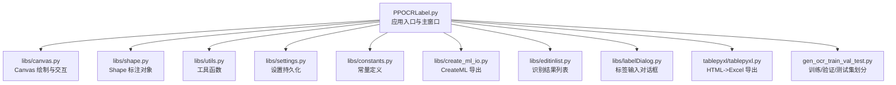
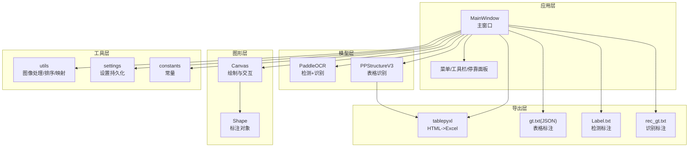
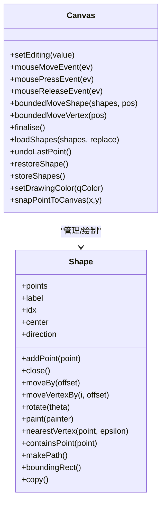
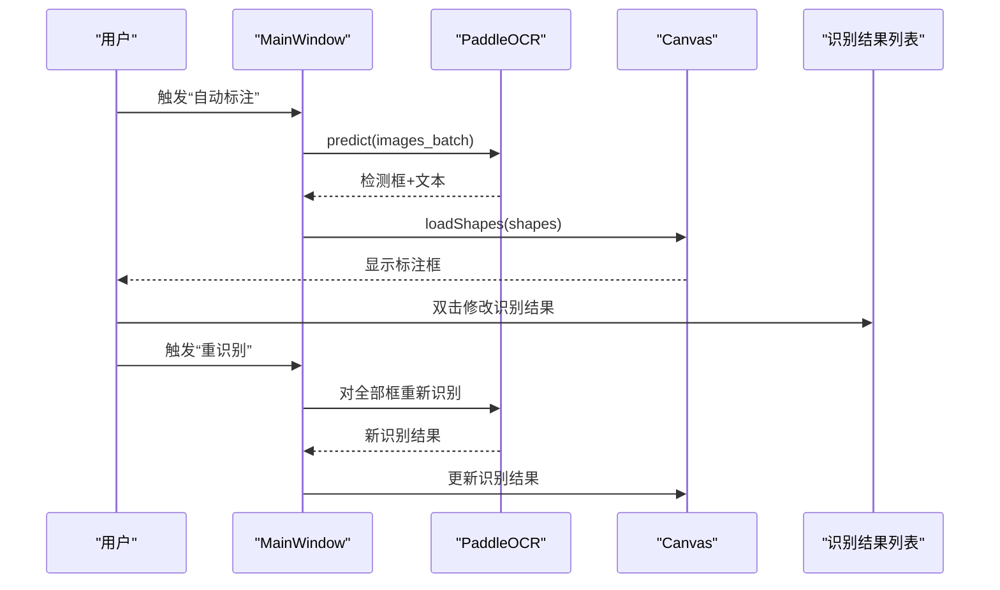
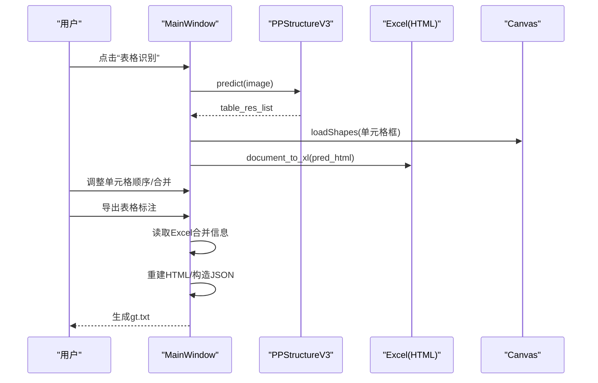
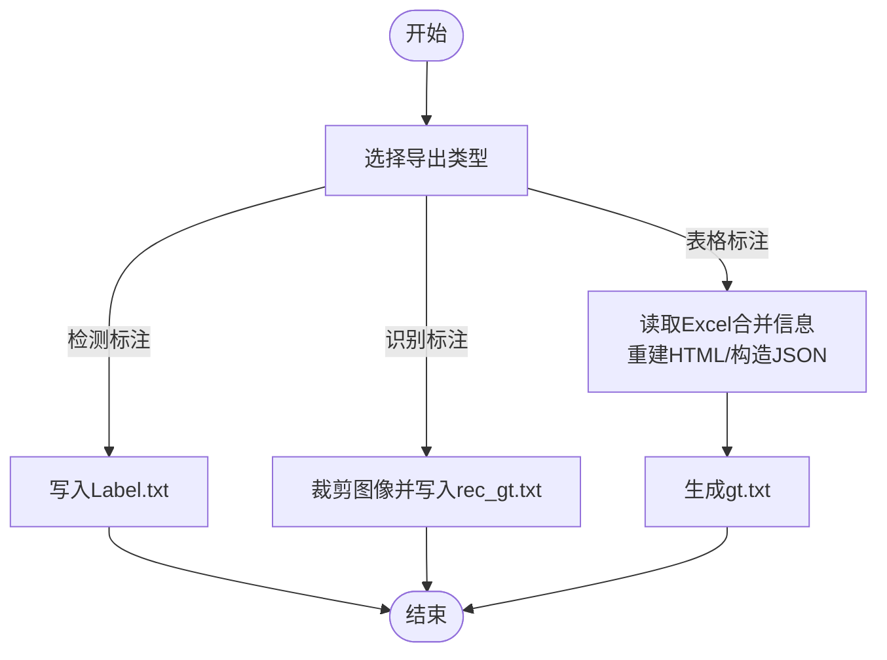
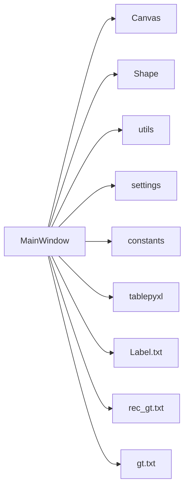

# 主要功能模块

<cite>
**本文引用的文件**
- [PPOCRLabel.py](PPOCRLabel.md)
- [README.md](README.md)
- [README_ch.md](README_ch.md)
- [libs/canvas.py](canvas.md)
- [libs/shape.py](shape.md)
- [libs/settings.py](settings.md)
- [libs/utils.py](utils.md)
- [libs/constants.py](constants.md)
- [libs/create_ml_io.py](create_ml_io.md)
- [libs/editinlist.py](editinlist.md)
- [libs/labelDialog.py](labelDialog.md)
- [tablepyxl/tablepyxl.py](tablepyxl.md)
- [gen_ocr_train_val_test.py](gen_ocr_train_val_test.md)
</cite>

## 目录
1. [简介](#简介)
2. [项目结构](#项目结构)
3. [核心组件](#核心组件)
4. [架构总览](#架构总览)
5. [详细组件分析](#详细组件分析)
6. [依赖分析](#依赖分析)
7. [性能考虑](#性能考虑)
8. [故障排查指南](#故障排查指南)
9. [结论](#结论)
10. [附录](#附录)

## 简介
本文件面向 PPOCRLabel 的使用者与二次开发者，系统梳理其核心功能模块：图像标注系统、智能标注（自动/半自动）、表格结构标注、数据导出与管理。文档从架构、组件、数据流、处理逻辑、集成点、错误处理与性能优化等方面进行深入解析，并提供使用示例与最佳实践，帮助快速上手并高效使用。

## 项目结构
PPOCRLabel 基于 PyQt5 构建图形界面，结合 PaddleOCR 与 PP-Structure 实现 OCR 检测与识别、表格结构识别与导出。核心模块分布如下：
- 应用入口与主窗口：负责初始化、菜单/工具栏、事件分发、模型加载与调用
- 图形绘制与交互：Canvas/Shape 提供标注框绘制、编辑、缩放、拖拽、顶点控制等
- 工具与配置：settings、constants、utils 提供设置持久化、常量定义、通用工具函数
- 表格识别与导出：tablepyxl 将 HTML 结构写入 Excel；主窗口负责调用识别与生成 gt.txt
- 数据导出：支持 Label.txt、rec_gt.txt、gt.txt（表格 JSON）等

图表来源
- [PPOCRLabel.py](PPOCRLabel.md)
- [libs/canvas.py](canvas.md)
- [libs/shape.py](shape.md)
- [libs/utils.py](utils.md)
- [libs/settings.py](settings.md)
- [libs/constants.py](constants.md)
- [libs/create_ml_io.py](create_ml_io.md)
- [libs/editinlist.py](editinlist.md)
- [libs/labelDialog.py](labelDialog.md)
- [tablepyxl/tablepyxl.py](tablepyxl.md)
- [gen_ocr_train_val_test.py](gen_ocr_train_val_test.md)

章节来源
- [PPOCRLabel.py](PPOCRLabel.md)
- [README.md](README.md)

## 核心组件
- 主窗口 MainWindow：负责模型初始化、UI 控件装配、事件绑定、自动/重识别、表格识别与导出、数据保存与导出、撤销/恢复等
- Canvas：图形绘制与交互，支持矩形/四点标注、拖拽、缩放、顶点编辑、多选、撤销点等
- Shape：标注对象，包含点序列、标签、索引、旋转、高亮、绘制与文本/编号绘制
- 工具与配置：settings 持久化、constants 常量、utils 通用工具（旋转裁剪、自然排序、坐标映射等）
- 表格导出：tablepyxl 将 HTML 表格结构写入 Excel；主窗口负责生成 gt.txt（PP-Structure JSON）

章节来源
- [PPOCRLabel.py](PPOCRLabel.md)
- [libs/canvas.py](canvas.md)
- [libs/shape.py](shape.md)
- [libs/utils.py](utils.md)
- [libs/settings.py](settings.md)
- [libs/constants.py](constants.md)
- [libs/create_ml_io.py](create_ml_io.md)
- [tablepyxl/tablepyxl.py](tablepyxl.md)

## 架构总览
PPOCRLabel 采用“主窗口协调 + 子模块解耦”的架构：
- 主窗口集中管理模型实例（OCR、表格识别）、UI 状态、文件与缓存、导出流程
- Canvas/Shape 负责底层绘制与几何操作
- 工具模块提供跨模块复用能力
- 表格识别通过 PP-Structure 输出 HTML，再由 tablepyxl 写入 Excel，最终由主窗口汇总为 JSON

图表来源
- [PPOCRLabel.py](PPOCRLabel.md)
- [libs/canvas.py](canvas.md)
- [libs/shape.py](shape.md)
- [tablepyxl/tablepyxl.py](tablepyxl.md)
- [libs/utils.py](utils.md)
- [libs/settings.py](settings.md)
- [libs/constants.py](constants.md)

## 详细组件分析

### 图像标注系统（Canvas 与 Shape）
- Canvas 负责：
  - 绘制/编辑标注框、多选、拖拽、顶点编辑、平移缩放、撤销点
  - 与 MainWindow 的事件联动（新增/移动/选择变化）
  - 四点模式与矩形模式切换、填充绘制、网格线提示
- Shape 负责：
  - 点序列管理、闭合判断、包围盒计算、旋转与中心点更新
  - 文本标签与编号绘制、顶点高亮、绘制样式与字体大小自适应

图表来源
- [libs/canvas.py](canvas.md)
- [libs/shape.py](shape.md)

章节来源
- [libs/canvas.py](canvas.md)
- [libs/shape.py](shape.md)

### 智能标注（自动/半自动）
- 自动标注流程：
  - 选择起始/结束范围，批量调用 OCR 模型预测，生成候选框与文本
  - 清空旧标注，加载新标注到 Canvas
  - 支持自动保存开关与批量数量控制
- 重识别：
  - 对当前图像全部标注框执行识别，覆盖识别结果
  - 单个标注框重识别，支持快捷键触发
- 识别结果编辑：
  - 双击识别结果列表项进入内联编辑，回车保存
  - 支持标签历史补全与自动弹窗标签输入

图表来源
- [PPOCRLabel.py](PPOCRLabel.md)
- [libs/canvas.py](canvas.md)
- [libs/editinlist.py](editinlist.md)
- [libs/labelDialog.py](labelDialog.md)

章节来源
- [PPOCRLabel.py](PPOCRLabel.md)
- [libs/editinlist.py](editinlist.md)
- [libs/labelDialog.py](labelDialog.md)

### 表格结构标注
- 表格识别：
  - 调用 PP-StructureV3 进行表格区域与单元格识别，返回检测框、识别文本与 HTML 结构
  - 在 Canvas 上加载单元格框，清空旧标注
  - 同步生成 Excel，包含表格 HTML 结构
- 单元格重识别：
  - 右键单元格框，触发单元格内部文本识别，提升局部准确性
- 导出 JSON：
  - 读取 Excel 合并单元格信息，重建 HTML 结构
  - 读取标注框信息，构造 PP-Structure JSON，输出为 gt.txt

图表来源
- [PPOCRLabel.py](PPOCRLabel.md)
- [PPOCRLabel.py](PPOCRLabel.md)
- [tablepyxl/tablepyxl.py](tablepyxl.md)
- [libs/utils.py](utils.md)

章节来源
- [PPOCRLabel.py](PPOCRLabel.md)
- [PPOCRLabel.py](PPOCRLabel.md)
- [tablepyxl/tablepyxl.py](tablepyxl.md)
- [libs/utils.py](utils.md)

### 数据导出与管理
- Label.txt（检测标注）：
  - 记录每张图的标注框、标签、是否困难样本等
  - 支持手动导出、自动导出（达到阈值或切换图像时）
- rec_gt.txt（识别标注）：
  - 裁剪每个标注框对应图像，保存为 crop_img/*，并生成识别标签文件
- gt.txt（表格 JSON）：
  - 依据 Excel 合并信息与标注框，生成 PP-Structure 格式 JSON
- 训练/验证/测试集划分：
  - 提供脚本按比例拆分检测/识别数据集，生成 train/val/test

图表来源
- [PPOCRLabel.py](PPOCRLabel.md)
- [PPOCRLabel.py](PPOCRLabel.md)
- [gen_ocr_train_val_test.py](gen_ocr_train_val_test.md)

章节来源
- [PPOCRLabel.py](PPOCRLabel.md)
- [PPOCRLabel.py](PPOCRLabel.md)
- [gen_ocr_train_val_test.py](gen_ocr_train_val_test.md)

## 依赖分析
- 组件耦合与内聚：
  - MainWindow 与 Canvas/Shape 高内聚，负责标注生命周期与状态同步
  - 表格导出链路：PP-Structure -> tablepyxl -> Excel -> MainWindow 聚合
  - 工具模块被广泛复用（图像旋转裁剪、自然排序、映射）
- 外部依赖：
  - PaddleOCR、PP-Structure、OpenPyXL、lxml、premailer 等
- 潜在循环依赖：
  - 当前模块间为单向依赖（主窗口 -> 绘制/工具 -> 导出），无明显循环

图表来源
- [PPOCRLabel.py](PPOCRLabel.md)
- [libs/canvas.py](canvas.md)
- [libs/shape.py](shape.md)
- [libs/utils.py](utils.md)
- [libs/settings.py](settings.md)
- [libs/constants.py](constants.md)
- [tablepyxl/tablepyxl.py](tablepyxl.md)

章节来源
- [PPOCRLabel.py](PPOCRLabel.md)
- [libs/canvas.py](canvas.md)
- [libs/shape.py](shape.md)
- [libs/utils.py](utils.md)
- [libs/settings.py](settings.md)
- [libs/constants.py](constants.md)
- [tablepyxl/tablepyxl.py](tablepyxl.md)

## 性能考虑
- 模型推理：
  - GPU 加速优先，若启用 GPU 则使用 CUDA 设备；CPU 模式下推理较慢
  - 自动标注支持批量处理，合理设置批量大小以平衡速度与内存占用
- 图像处理：
  - 旋转裁剪与透视变换可能带来额外开销，尽量减少不必要的重复处理
  - 自适应字体大小与绘制优化已在 Canvas 中实现
- 导出与 IO：
  - 大量图像导出时建议分批进行，避免一次性写入造成阻塞
  - rec_gt.txt 导出涉及图像编码与磁盘 IO，建议使用 SSD 并合理安排存储路径

## 故障排查指南
- 常见问题与定位：
  - 模型加载失败：确认模型路径参数正确，语言切换时需重建模型实例
  - 表格识别为空：当表格区域或单元格检测失败时，会生成空 Excel，需人工修正
  - Excel 写入异常：检查 lxml、openpyxl、premailer 是否安装，版本兼容性问题可能导致写入失败
  - 图像旋转/尺寸异常：确保在旋转前删除标注框，避免坐标越界
- 日志与调试：
  - 使用日志记录关键流程（如模型预测、导出、错误处理），便于定位问题
  - 设置持久化失败时会给出警告，可检查 ~/.autoOCRSettings.pkl 权限与路径

章节来源
- [PPOCRLabel.py](PPOCRLabel.md)
- [PPOCRLabel.py](PPOCRLabel.md)
- [libs/settings.py](settings.md)
- [README.md](README.md)

## 结论
PPOCRLabel 将图形标注、智能识别与表格结构导出有机结合，形成完整的 OCR 数据准备流水线。通过清晰的模块划分与稳定的接口设计，既满足初学者快速上手，也为高级用户提供灵活扩展空间。建议在团队协作场景中统一标注规范、导出格式与数据划分策略，以最大化标注效率与模型训练质量。

## 附录

### 使用示例与最佳实践
- 快速开始：
  - 选择语言与设备，打开图像目录，点击“自动标注”生成初始框
  - 使用“重识别”统一修正识别结果，必要时手动微调标注框
- 表格标注：
  - 先“表格识别”，再在 Excel 中标注合并单元格，最后导出 gt.txt
  - 若单元格为空，仍需添加空框以保持单元格数量一致
- 数据导出：
  - 推荐开启自动导出，或在完成一组图像后手动导出
  - 使用训练/验证/测试集划分脚本，按比例拆分数据集

章节来源
- [README.md](README.md)
- [README_ch.md](README_ch.md)