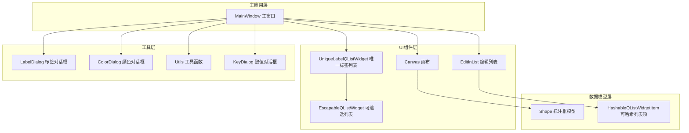
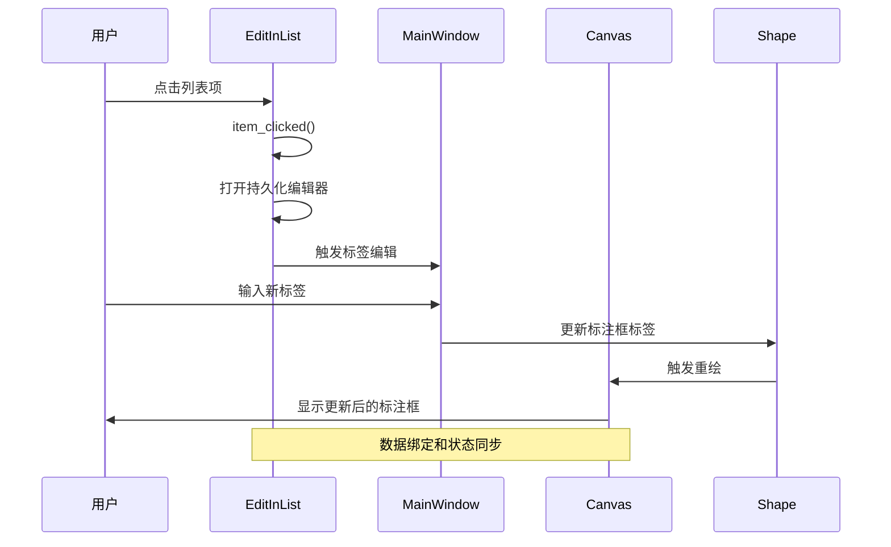
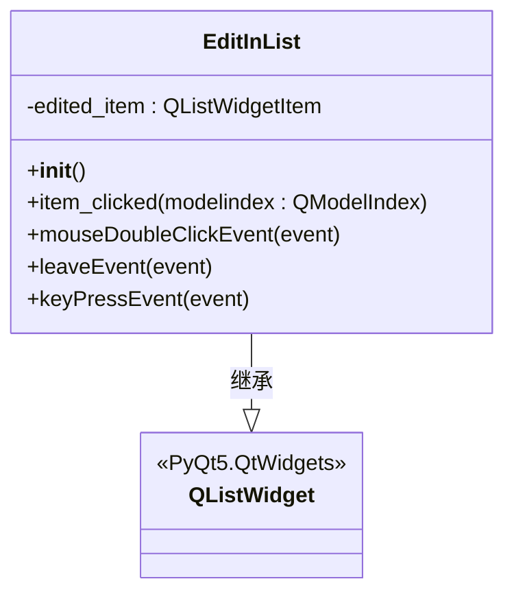
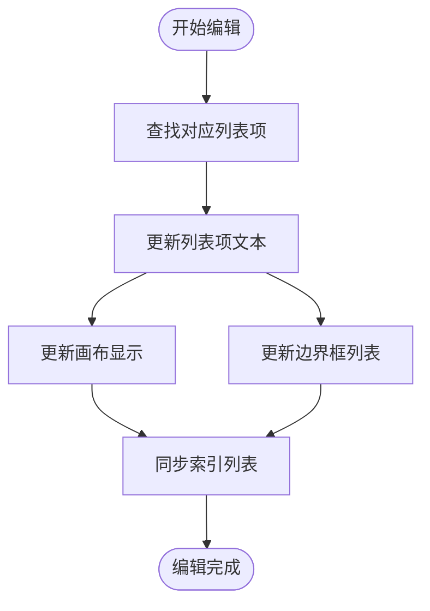
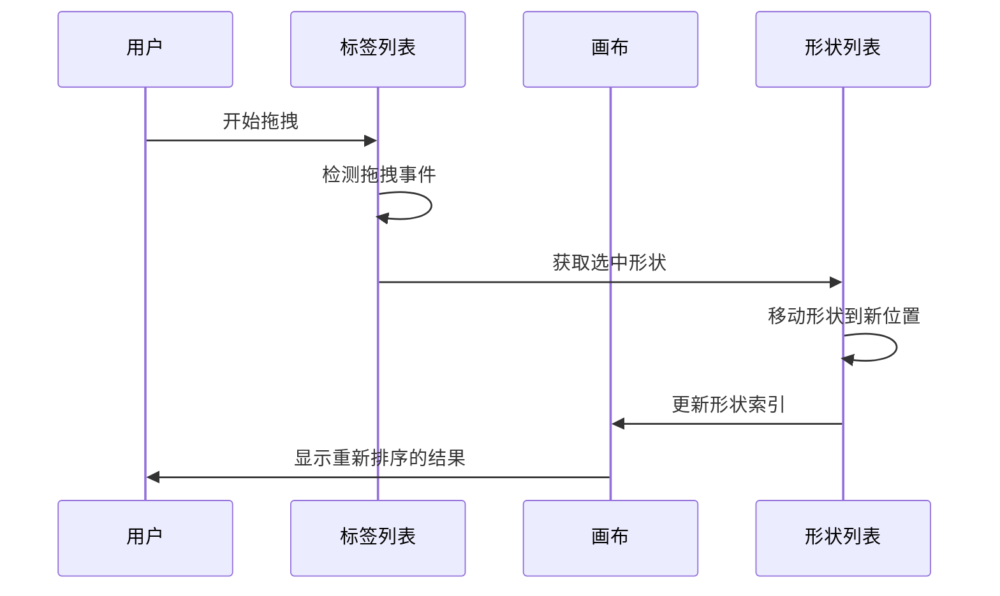
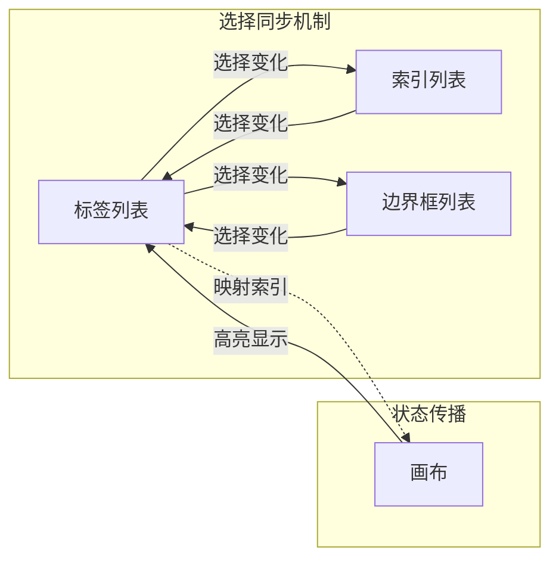
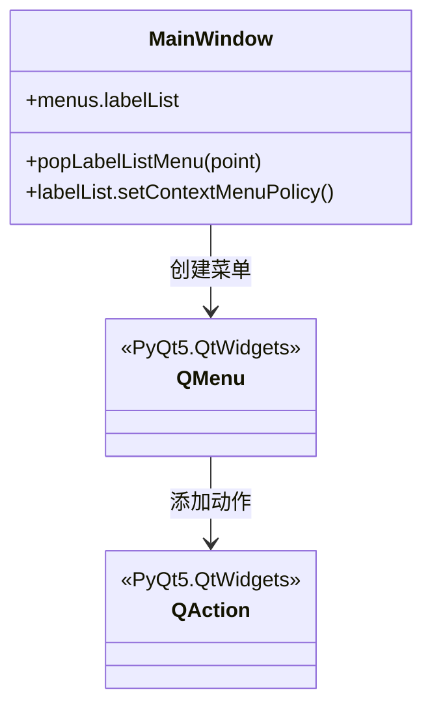
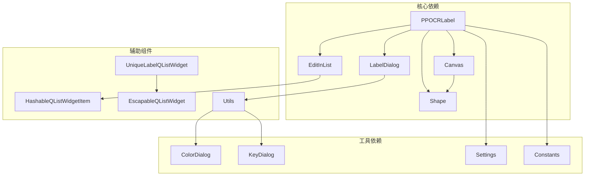

# 列表交互控件

<cite>
**本文档引用的文件**
- [editinlist.py](editinlist.md)
- [hashableQListWidgetItem.py](hashableQListWidgetItem.md)
- [unique_label_qlist_widget.py](unique_label_qlist_widget.md)
- [shape.py](shape.md)
- [canvas.py](canvas.md)
- [PPOCRLabel.py](PPOCRLabel.md)
- [labelDialog.py](labelDialog.md)
- [colorDialog.py](colorDialog.md)
- [utils.py](utils.md)
- [keyDialog.py](keyDialog.md)
- [settings.py](settings.md)
- [constants.py](constants.md)
</cite>

## 目录
1. [简介](#简介)
2. [项目结构](#项目结构)
3. [核心组件](#核心组件)
4. [架构概览](#架构概览)
5. [详细组件分析](#详细组件分析)
6. [依赖关系分析](#依赖关系分析)
7. [性能考虑](#性能考虑)
8. [故障排除指南](#故障排除指南)
9. [结论](#结论)

## 简介

本文档深入分析了PaddleOCR标签应用中的列表交互控件系统，重点介绍了EditInList类的实现原理。该系统提供了完整的OCR标注工作流，包括列表项的创建、编辑、删除、拖拽排序等功能，以及与标注框的紧密关联机制。

系统采用PyQt5框架构建，实现了现代化的图形界面交互，支持实时标注框同步、选择状态管理、右键菜单等用户体验优化功能。通过精心设计的数据绑定和状态同步机制，确保了标注数据的一致性和完整性。

## 项目结构

该项目采用模块化架构设计，主要分为以下几个核心模块：



**图表来源**
- [PPOCRLabel.py](PPOCRLabel.md)
- [editinlist.py](editinlist.md)
- [unique_label_qlist_widget.py](unique_label_qlist_widget.md)

**章节来源**
- [PPOCRLabel.py](PPOCRLabel.md)
- [editinlist.py](editinlist.md)

## 核心组件

### EditInList 类

EditInList是系统的核心交互组件，继承自QListWidget，专门用于处理标注框标签的编辑操作。

#### 主要特性
- **即时编辑支持**：通过持久化编辑器实现实时标签编辑
- **智能焦点管理**：自动处理编辑状态切换和焦点控制
- **键盘快捷键支持**：支持Enter键确认编辑，Escape键取消编辑
- **事件处理优化**：重写关键事件处理方法以提升用户体验

#### 关键实现细节
- 使用`edited_item`属性跟踪当前编辑的列表项
- 通过`item_clicked`方法处理列表项点击事件
- 实现了`keyPressEvent`方法来处理键盘输入
- 提供了`mouseDoubleClickEvent`和`leaveEvent`的空实现以满足基类要求

**章节来源**
- [editinlist.py](editinlist.md)

### HashableQListWidgetItem 类

为了支持列表项的哈希操作和唯一性检查，系统实现了自定义的QListWidgetItem子类。

#### 设计目的
- 解决标准QListWidgetItem不可哈希的问题
- 支持列表项在集合中的存储和比较
- 提供稳定的对象标识符

**章节来源**
- [hashableQListWidgetItem.py](hashableQListWidgetItem.md)

### UniqueLabelQListWidget 类

这是一个增强的列表组件，专门为标签管理而设计。

#### 核心功能
- **标签颜色管理**：根据标签文本生成对应的显示颜色
- **标签验证**：提供标签格式验证功能
- **键盘事件处理**：支持Esc键清空选择
- **鼠标事件处理**：支持空白区域点击清空选择

**章节来源**
- [unique_label_qlist_widget.py](unique_label_qlist_widget.md)

## 架构概览

系统采用分层架构设计，各组件之间通过清晰的接口进行通信：



**图表来源**
- [PPOCRLabel.py](PPOCRLabel.md)
- [editinlist.py](editinlist.md)

## 详细组件分析

### EditInList 类深度分析

#### 类结构图



**图表来源**
- [editinlist.py](editinlist.md)

#### 核心方法实现

##### item_clicked 方法
这是EditInList的核心方法，负责处理列表项点击事件：

1. **编辑状态清理**：检查是否存在正在编辑的项目，如果存在则关闭编辑器
2. **新项目定位**：根据点击位置找到对应的列表项
3. **编辑器激活**：打开持久化编辑器并开始编辑

##### keyPressEvent 方法
处理键盘输入事件，特别是Enter键的确认操作：

- 监听特定的键盘按键（Enter键）
- 遍历所有列表项，关闭持久化编辑器
- 实现优雅的编辑结束机制

**章节来源**
- [editinlist.py](editinlist.md)

### 数据绑定和状态同步机制

#### 标注框与列表项的关联

系统通过双向数据绑定确保标注框和列表项之间的同步：



**图表来源**
- [PPOCRLabel.py](PPOCRLabel.md)
- [PPOCRLabel.py](PPOCRLabel.md)

#### 状态同步流程

1. **标签列表同步**：当标注框标签改变时，同步更新标签列表项
2. **边界框列表同步**：更新对应的边界框列表项显示
3. **索引列表同步**：维护数字索引与实际位置的对应关系
4. **画布重绘触发**：状态变化自动触发画布重绘

**章节来源**
- [PPOCRLabel.py](PPOCRLabel.md)

### 拖拽排序功能

系统实现了完整的拖拽排序功能，允许用户通过拖拽重新排列标注框顺序：

#### 拖拽功能实现



**图表来源**
- [PPOCRLabel.py](PPOCRLabel.md)
- [PPOCRLabel.py](PPOCRLabel.md)

#### 拖拽事件处理

1. **事件监听**：通过`rowsMoved`信号监听拖拽完成事件
2. **形状重新排列**：更新Canvas中shapes列表的顺序
3. **索引同步更新**：重新计算每个形状的idx属性
4. **界面同步**：同时更新边界框列表的显示顺序

**章节来源**
- [PPOCRLabel.py](PPOCRLabel.md)
- [PPOCRLabel.py](PPOCRLabel.md)

### 选择状态管理

#### 多列表选择同步

系统实现了三个列表之间的选择状态同步：



**图表来源**
- [PPOCRLabel.py](PPOCRLabel.md)

#### 选择状态同步实现

1. **标签列表选择**：当标签列表项被选中时，同步选中对应的索引项和边界框项
2. **索引列表选择**：通过索引映射回标签列表，实现双向选择
3. **边界框列表选择**：与标签列表保持完全同步的选择状态
4. **画布高亮**：根据选择状态在画布上高亮显示对应的标注框

**章节来源**
- [PPOCRLabel.py](PPOCRLabel.md)

### 右键菜单和上下文操作

#### 菜单系统架构



**图表来源**
- [PPOCRLabel.py](PPOCRLabel.md)

#### 右键菜单功能

1. **自定义菜单策略**：设置`CustomContextMenu`策略启用右键菜单
2. **动态菜单生成**：根据当前上下文动态生成菜单项
3. **编辑操作支持**：提供标签编辑、删除等常用操作
4. **事件处理**：通过`customContextMenuRequested`信号处理右键菜单请求

**章节来源**
- [PPOCRLabel.py](PPOCRLabel.md)

## 依赖关系分析

### 组件间依赖关系



**图表来源**
- [PPOCRLabel.py](PPOCRLabel.md)
- [editinlist.py](editinlist.md)

### 数据流依赖

系统中的数据流遵循严格的单向依赖原则：

1. **Canvas → Shape**：画布管理形状对象
2. **Shape → EditInList**：形状数据驱动列表显示
3. **LabelDialog → Shape**：用户输入更新形状属性
4. **MainWindow → Canvas**：主窗口控制画布行为

**章节来源**
- [PPOCRLabel.py](PPOCRLabel.md)
- [shape.py](shape.md)

## 性能考虑

### 内存管理最佳实践

#### 对象生命周期管理

1. **及时释放资源**：在不需要时及时删除形状对象
2. **避免循环引用**：确保列表项和形状对象之间没有循环引用
3. **批量操作优化**：对于大量数据操作，使用批量处理减少界面刷新次数

#### 图形渲染优化

1. **延迟重绘**：通过`setHiding`方法控制重绘频率
2. **增量更新**：只更新发生变化的部分而不是整个界面
3. **缓存机制**：利用`shapesBackups`实现撤销/重做功能

### 性能优化建议

#### 列表操作优化

1. **批量添加**：使用`addLabel`方法批量添加多个形状
2. **索引访问优化**：通过`shapesToItems`字典实现O(1)的查找
3. **滚动同步**：使用`move_scrollbar`方法同步多个列表的滚动位置

#### 事件处理优化

1. **事件过滤**：合理使用事件过滤器减少不必要的事件处理
2. **异步操作**：对于耗时操作使用异步处理避免界面冻结
3. **节流机制**：对频繁触发的事件使用节流机制

## 故障排除指南

### 常见问题及解决方案

#### 编辑器无法正常关闭

**问题描述**：点击其他地方时编辑器仍然保持开启状态

**解决方案**：
1. 检查`leaveEvent`方法是否被正确重写
2. 确保`edited_item`属性正确跟踪当前编辑项
3. 验证持久化编辑器的生命周期管理

#### 列表项选择不同步

**问题描述**：选择标签列表项时，索引列表和边界框列表不响应

**解决方案**：
1. 检查`shapeSelectionChanged`方法的实现
2. 确认`_noSelectionSlot`标志位的正确使用
3. 验证索引映射关系的准确性

#### 拖拽排序异常

**问题描述**：拖拽排序后形状位置错误或列表显示异常

**解决方案**：
1. 检查`drag_drop_happened`方法的实现逻辑
2. 确保`updateShapeIndex`方法正确更新形状索引
3. 验证列表项的重新插入顺序

### 调试技巧

#### 日志记录

系统广泛使用日志记录来帮助调试：

```python
logger.debug("Debug information")
logger.warning("Warning message")
logger.error("Error occurred")
```

#### 断点调试

1. 在关键方法入口处设置断点
2. 监视变量状态变化
3. 检查方法调用链路

**章节来源**
- [PPOCRLabel.py](PPOCRLabel.md)

## 结论

PaddleOCR标签应用的列表交互控件系统展现了现代GUI应用的设计理念和技术实现。通过精心设计的架构和完善的组件体系，系统实现了以下关键目标：

### 技术成就

1. **模块化设计**：清晰的组件分离和职责划分
2. **数据一致性**：通过双向数据绑定确保各组件状态同步
3. **用户体验优化**：丰富的交互功能和直观的操作方式
4. **性能优化**：合理的内存管理和渲染优化策略

### 架构优势

- **可扩展性**：模块化设计便于功能扩展和维护
- **可维护性**：清晰的代码结构和完善的文档
- **稳定性**：健壮的错误处理和异常恢复机制
- **兼容性**：跨平台支持和版本兼容性考虑

### 应用价值

该系统不仅为OCR标注任务提供了高效的工具，更重要的是展示了如何在实际项目中应用现代软件工程的最佳实践。其设计理念和实现方案可以作为其他类似应用开发的参考模板。

通过深入理解和掌握这些技术要点，开发者可以更好地利用和扩展这个强大的标注工具，为OCR和计算机视觉应用的开发提供强有力的支持。