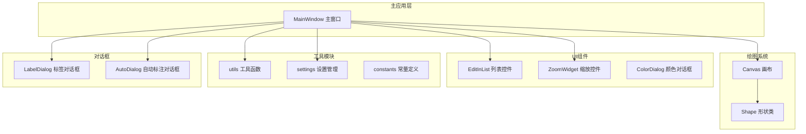
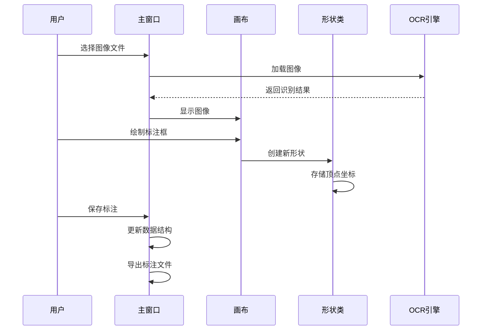
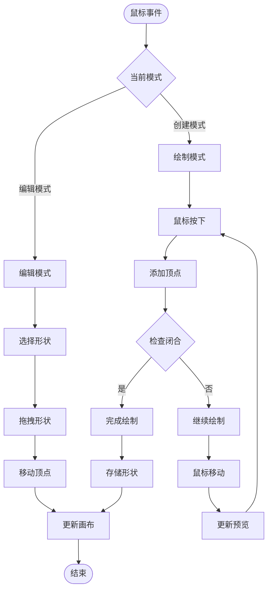
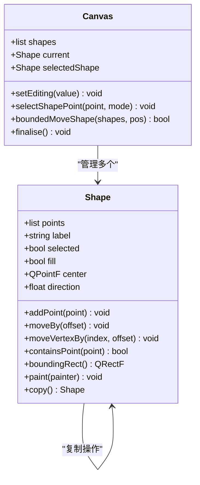
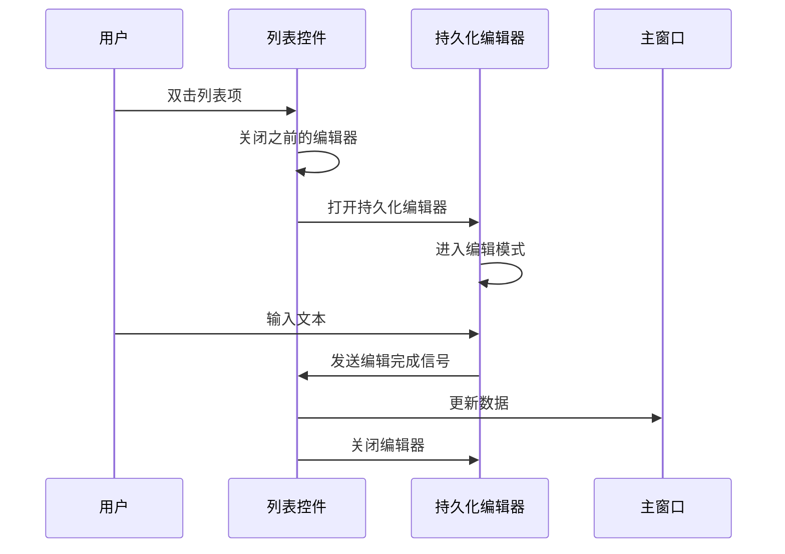
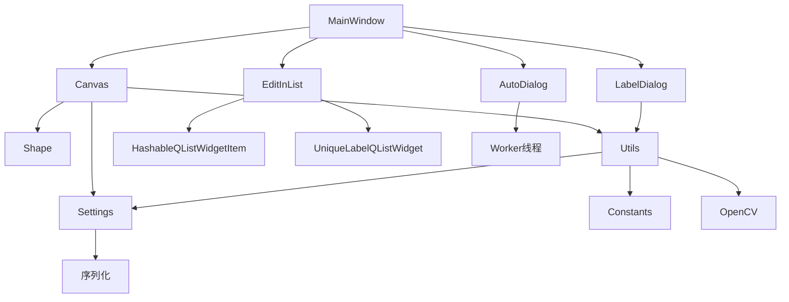

# 图像标注系统

<cite>
**本文档引用的文件**
- [PPOCRLabel.py](PPOCRLabel.md)
- [canvas.py](canvas.md)
- [shape.py](shape.md)
- [editinlist.py](editinlist.md)
- [utils.py](utils.md)
- [constants.py](constants.md)
- [settings.py](settings.md)
- [unique_label_qlist_widget.py](unique_label_qlist_widget.md)
- [hashableQListWidgetItem.py](hashableQListWidgetItem.md)
- [labelDialog.py](labelDialog.md)
- [colorDialog.py](colorDialog.md)
- [zoomWidget.py](zoomWidget.md)
- [autoDialog.py](autoDialog.md)
- [README.md](README.md)
</cite>

## 目录
1. [简介](#简介)
2. [项目结构](#项目结构)
3. [核心组件](#核心组件)
4. [架构概览](#架构概览)
5. [详细组件分析](#详细组件分析)
6. [依赖关系分析](#依赖关系分析)
7. [性能考虑](#性能考虑)
8. [故障排除指南](#故障排除指南)
9. [结论](#结论)

## 简介

PPOCRLabel是一个基于PyQt5的半自动化图形标注工具，专门用于OCR（光学字符识别）领域。该系统集成了PaddleOCR内置模型，支持矩形框、表格、不规则文本和关键信息标注模式。标注结果可直接用于PP-OCR检测和识别模型的训练。

该系统提供了完整的图像标注工作流程，包括自动识别、手动标注、结果验证等功能，特别适用于文档图像的文本区域检测和识别任务。

## 项目结构

项目采用模块化设计，主要分为以下几个部分：



**图表来源**
- [PPOCRLabel.py](PPOCRLabel.md)
- [canvas.py](canvas.md)
- [shape.py](shape.md)

**章节来源**
- [PPOCRLabel.py](PPOCRLabel.md)
- [README.md](README.md)

## 核心组件

### 主窗口管理器 (MainWindow)

MainWindow是整个系统的中央控制器，负责协调各个子系统的工作。它继承自QMainWindow，提供了完整的用户界面和业务逻辑处理。

**主要职责：**
- 管理图像文件列表和导航
- 协调标注工具的启用和禁用状态
- 处理用户交互事件
- 维护标注数据结构
- 管理自动识别功能

**关键属性：**
- `itemsToShapes` 和 `shapesToItems`：双向映射标注项和形状对象
- `labelList` 和 `BoxList`：识别结果和检测框列表
- `canvas`：核心画布组件
- `ocr`：PaddleOCR集成实例

**章节来源**
- [PPOCRLabel.py](PPOCRLabel.md)

### Canvas画布系统

Canvas是基于QWidget的自定义绘图组件，实现了完整的图形绘制和交互功能。

**核心特性：**
- 支持矩形和多边形标注
- 实时顶点高亮和拖拽
- 平移和缩放功能
- 撤销/重做机制
- 自适应字体大小

**绘制模式：**
- `CREATE`：创建模式，用于绘制新的标注框
- `EDIT`：编辑模式，用于修改现有标注框

**章节来源**
- [canvas.py](canvas.md)

### Shape形状类

Shape类是标注框的核心数据结构，封装了所有几何操作和渲染逻辑。

**数据结构：**
- `points`：顶点坐标列表
- `label`：标注标签
- `selected`：是否选中状态
- `fill`：是否填充
- `center`：中心点坐标

**几何操作：**
- 顶点添加和删除
- 形状移动和旋转
- 包围盒计算
- 碰撞检测

**章节来源**
- [shape.py](shape.md)

### EditInList列表控件

EditInList是QListWidget的扩展，支持就地编辑功能。

**功能特性：**
- 双击进入编辑模式
- 持久化编辑器
- 键盘快捷键支持
- 自动保存编辑内容

**章节来源**
- [editinlist.py](editinlist.md)

## 架构概览

系统采用分层架构设计，各层职责明确，耦合度低：



**图表来源**
- [PPOCRLabel.py](PPOCRLabel.md)
- [canvas.py](canvas.md)
- [shape.py](shape.md)

## 详细组件分析

### Canvas画布系统实现原理

Canvas系统通过事件驱动的方式处理用户交互：



**图表来源**
- [canvas.py](canvas.md)
- [canvas.py](canvas.md)

**章节来源**
- [canvas.py](canvas.md)

### Shape形状类的数据结构和几何操作

Shape类实现了完整的几何计算功能：



**图表来源**
- [shape.py](shape.md)
- [canvas.py](canvas.md)

**章节来源**
- [shape.py](shape.md)
- [shape.py](shape.md)

### EditInList列表控件的交互机制

EditInList提供了高效的就地编辑体验：



**图表来源**
- [editinlist.py](editinlist.md)

**章节来源**
- [editinlist.py](editinlist.md)

### 标注框创建、编辑、删除、复制操作

系统支持完整的标注生命周期管理：

**创建操作：**
1. 用户触发创建模式
2. Canvas接收鼠标事件
3. Shape对象存储顶点坐标
4. 完成闭合后添加到Canvas列表

**编辑操作：**
1. 选择目标形状
2. 拖拽顶点或整体移动
3. 实时更新显示
4. 存储修改历史

**删除操作：**
1. 选择要删除的形状
2. 从列表中移除
3. 更新索引
4. 清理内存

**复制操作：**
1. 选择现有形状
2. 创建副本
3. 稍微偏移位置
4. 添加到列表

**章节来源**
- [canvas.py](canvas.md)
- [canvas.py](canvas.md)

### 多边形标注和矩形标注的区别

系统支持两种标注模式：

| 特性 | 矩形标注 | 多边形标注 |
|------|----------|------------|
| 顶点数量 | 固定4个 | 可变数量 |
| 创建方式 | 拖拽矩形框 | 点击添加顶点 |
| 几何约束 | 自动保持矩形 | 自由形状 |
| 适用场景 | 文本区域检测 | 不规则形状 |
| 计算复杂度 | 低 | 中等 |

**章节来源**
- [canvas.py](canvas.md)
- [canvas.py](canvas.md)

### 几何计算和碰撞检测

系统实现了精确的几何计算：

**距离计算：**
```python
def distance(p):
    return sqrt(p.x() * p.x() + p.y() * p.y())
```

**包围盒计算：**
- 使用QPainterPath计算边界
- 支持任意多边形
- 动态更新中心点

**碰撞检测：**
- 点击检测：`containsPoint(point)`
- 顶点吸附：`nearestVertex(point, epsilon)`
- 边界检查：`outOfPixmap(point)`

**章节来源**
- [utils.py](utils.md)
- [shape.py](shape.md)
- [canvas.py](canvas.md)

## 依赖关系分析

系统采用松耦合的设计模式：



**图表来源**
- [PPOCRLabel.py](PPOCRLabel.md)
- [canvas.py](canvas.md)

**章节来源**
- [PPOCRLabel.py](PPOCRLabel.md)
- [canvas.py](canvas.md)

## 性能考虑

### 优化策略

1. **内存管理**
   - 使用弱引用避免循环引用
   - 及时清理不需要的对象
   - 限制撤销历史数量

2. **渲染优化**
   - 只重绘变化区域
   - 使用双缓冲技术
   - 智能字体大小调整

3. **计算优化**
   - 距离计算使用平方根优化
   - 几何运算缓存中间结果
   - 批量操作减少重复计算

### 最佳实践

1. **大图像处理**
   - 使用缩放功能减少内存占用
   - 分块加载避免内存溢出
   - 合理设置最大缩放比例

2. **批量操作**
   - 使用Ctrl+点击进行多选
   - 批量复制和移动提高效率
   - 避免频繁的重绘操作

3. **数据持久化**
   - 定期保存标注进度
   - 使用增量更新减少I/O
   - 备份重要数据防止丢失

## 故障排除指南

### 常见问题及解决方案

**问题1：图像无法显示**
- 检查文件格式支持
- 确认文件路径正确
- 验证内存充足

**问题2：标注框无法移动**
- 确认处于编辑模式
- 检查形状是否被锁定
- 验证鼠标位置在形状内部

**问题3：自动识别失败**
- 检查PaddleOCR模型完整性
- 确认GPU/CPU兼容性
- 验证输入图像质量

**问题4：内存泄漏**
- 定期重启应用
- 检查对象引用链
- 使用垃圾回收机制

**章节来源**
- [README.md](README.md)

### 调试技巧

1. **日志记录**
   - 启用详细日志级别
   - 监控内存使用情况
   - 记录关键操作时间

2. **性能分析**
   - 使用Qt Profiler
   - 监控CPU使用率
   - 分析渲染耗时

3. **错误处理**
   - 实现异常捕获
   - 提供用户友好的错误信息
   - 支持自动恢复机制

## 结论

PPOCRLabel图像标注系统是一个功能完整、架构清晰的OCR标注工具。其核心优势包括：

1. **模块化设计**：各组件职责明确，易于维护和扩展
2. **用户体验**：直观的界面和丰富的交互功能
3. **性能优化**：针对大图像和批量操作进行了专门优化
4. **扩展性强**：支持自定义模型和数据格式

该系统特别适合文档图像的文本区域标注任务，为OCR模型训练提供了高质量的数据基础。通过合理的架构设计和优化策略，系统能够在保证性能的同时提供优秀的用户体验。

未来可以考虑的功能增强包括：
- 更多标注模式的支持
- 云端协作功能
- 更智能的自动标注算法
- 移动端适配