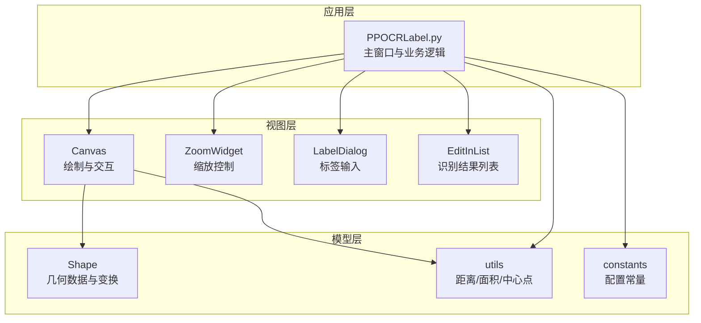
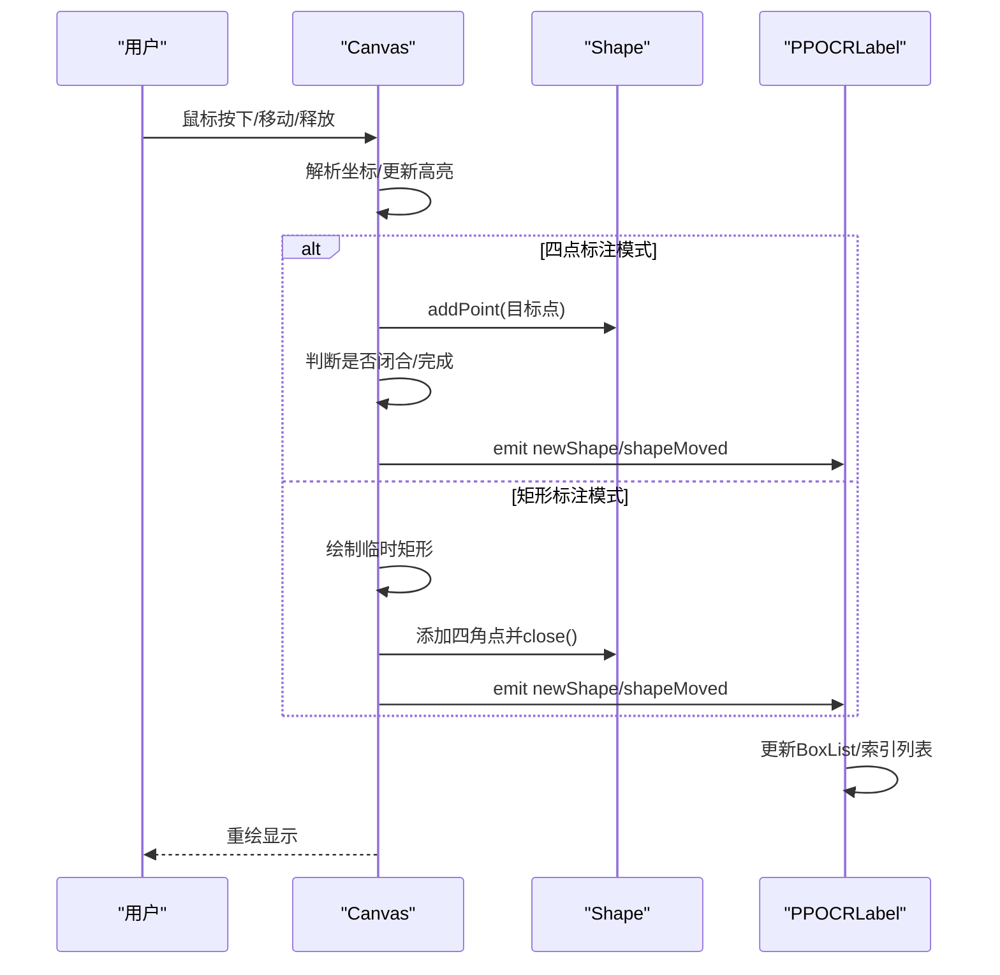
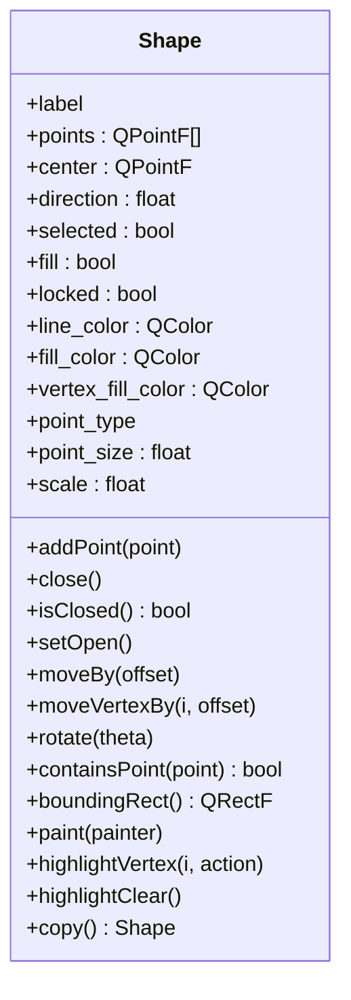
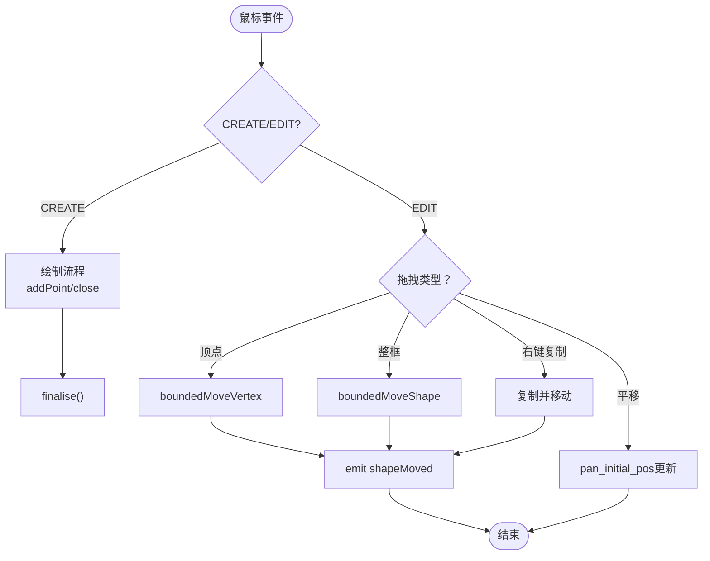
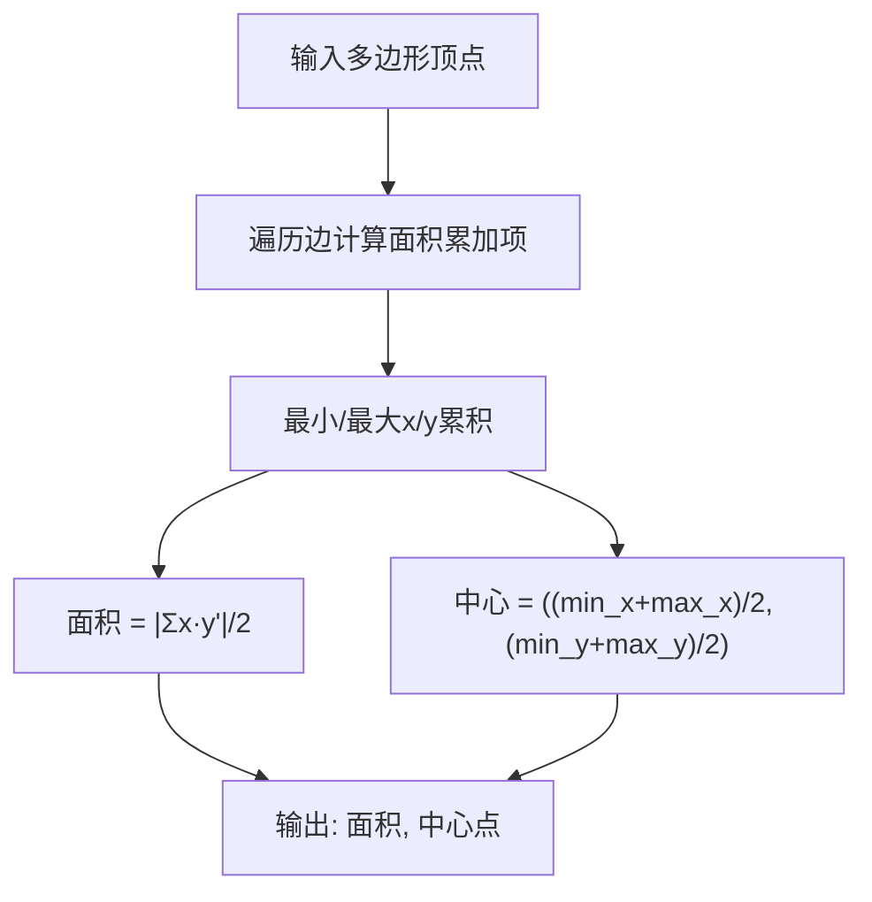
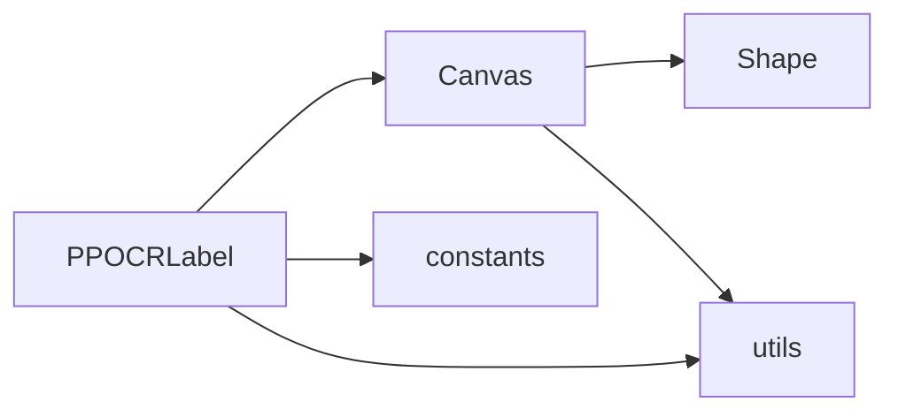

# 形状几何管理

<cite>
**本文档引用的文件**
- [libs/shape.py](shape.md)
- [libs/canvas.py](canvas.md)
- [libs/utils.py](utils.md)
- [libs/constants.py](constants.md)
- [PPOCRLabel.py](PPOCRLabel.md)
- [libs/labelDialog.py](labelDialog.md)
- [libs/zoomWidget.py](zoomWidget.md)
- [libs/editinlist.py](editinlist.md)
- [README.md](README.md)
</cite>

## 目录
1. [简介](#简介)
2. [项目结构](#项目结构)
3. [核心组件](#核心组件)
4. [架构总览](#架构总览)
5. [详细组件分析](#详细组件分析)
6. [依赖关系分析](#依赖关系分析)
7. [性能考量](#性能考量)
8. [故障排查指南](#故障排查指南)
9. [结论](#结论)
10. [附录](#附录)

## 简介
本文件聚焦于PaddleOCR标签工具中的形状几何管理模块，系统性阐述Shape类的数据结构设计、几何表示与变换、碰撞检测、面积与中心点计算、以及在标注流程中的具体应用。文档同时提供可视化架构图与流程图，帮助读者快速理解从鼠标交互到几何渲染再到数据导出的完整链路。

## 项目结构
该工具采用分层架构：
- 视图层：Canvas负责绘制与交互，接收鼠标事件并驱动Shape对象更新
- 模型层：Shape封装几何数据与变换逻辑
- 工具层：utils提供距离、多边形面积与中心点计算等通用方法
- 应用层：PPOCRLabel.py整合UI、模型推理与标注状态管理

图表来源
- [PPOCRLabel.py](PPOCRLabel.md)
- [libs/canvas.py](canvas.md)
- [libs/shape.py](shape.md)
- [libs/utils.py](utils.md)
- [libs/constants.py](constants.md)

章节来源
- [PPOCRLabel.py](PPOCRLabel.md)
- [libs/canvas.py](canvas.md)
- [libs/shape.py](shape.md)
- [libs/utils.py](utils.md)
- [libs/constants.py](constants.md)

## 核心组件
- Shape类：封装顶点集合、边界框、填充与高亮、旋转、平移、顶点编辑、绘制与文本标注等能力
- Canvas类：处理鼠标事件、键盘事件、拖拽与复制、边界约束、缩放与平移、状态同步
- utils模块：提供距离计算、多边形面积与中心点计算、图像裁剪等辅助函数
- PPOCRLabel主窗口：连接Canvas与各UI组件，维护标注状态与导出逻辑

章节来源
- [libs/shape.py](shape.md)
- [libs/canvas.py](canvas.md)
- [libs/utils.py](utils.md)
- [PPOCRLabel.py](PPOCRLabel.md)

## 架构总览
以下序列图展示了从鼠标点击到最终生成标注框的端到端流程，涵盖四点标注模式与矩形标注模式的关键分支。

图表来源
- [libs/canvas.py](canvas.md)
- [libs/canvas.py](canvas.md)
- [libs/shape.py](shape.md)
- [PPOCRLabel.py](PPOCRLabel.md)

章节来源
- [libs/canvas.py](canvas.md)
- [libs/canvas.py](canvas.md)
- [libs/shape.py](shape.md)
- [PPOCRLabel.py](PPOCRLabel.md)

## 详细组件分析

### Shape类：几何数据结构与变换
- 数据结构
  - 顶点集合：points存储QPointF序列，支持索引访问与长度查询
  - 状态字段：selected、fill、difficult、locked、direction、center、idx等
  - 可视化参数：line_color、fill_color、vertex_fill_color、hvertex_fill_color、point_type、point_size、scale
- 几何计算
  - 边界框：boundingRect基于QPainterPath包围盒
  - 包围矩形面积与中心点：通过utils.polygon_bounding_box_center_and_area计算
  - 旋转：以center为旋转中心，按方向角theta旋转所有顶点
  - 平移：moveBy整体平移；moveVertexBy单点平移
  - 顶点高亮：highlightVertex/highlightClear控制顶点半径与形状
- 绘制与文本
  - paint方法使用QPainterPath绘制线段与顶点，支持填充与标签/序号绘制
  - 文本字体大小随缩放自适应

图表来源
- [libs/shape.py](shape.md)

章节来源
- [libs/shape.py](shape.md)
- [libs/utils.py](utils.md)

### Canvas类：交互与状态管理
- 交互模式
  - CREATE/EDIT模式切换，四点/矩形两种绘制模式
  - 鼠标拖拽：移动整框、移动顶点、右键复制移动、平移画布
  - 键盘快捷键：方向键微调、顶点独立移动、旋转、撤销等
- 边界约束
  - boundedMoveShape/boundedMoveVertex确保顶点不越界
  - outOfPixmap检查与snapPointToCanvas修正
- 状态同步
  - selectionChanged/newShape/shapeMoved信号驱动UI更新
  - storeShapes记录历史快照用于撤销

图表来源
- [libs/canvas.py](canvas.md)
- [libs/canvas.py](canvas.md)
- [libs/canvas.py](canvas.md)

章节来源
- [libs/canvas.py](canvas.md)
- [libs/canvas.py](canvas.md)
- [libs/canvas.py](canvas.md)

### 几何计算与碰撞检测
- 碰撞检测
  - Shape.containsPoint委托QPainterPath.contains实现多边形包含判断
  - Canvas.mouseMoveEvent通过nearestVertex与containsPoint实现高亮与抓取
- 面积与中心点
  - utils.polygon_bounding_box_center_and_area计算多边形包围矩形面积与中心点
  - 主窗口在特定场景下根据面积映射缩放值，实现自动居中缩放
- 距离度量
  - utils.distance计算两点间欧氏距离，用于吸附与近邻判断

图表来源
- [libs/utils.py](utils.md)

章节来源
- [libs/shape.py](shape.md)
- [libs/canvas.py](canvas.md)
- [libs/utils.py](utils.md)
- [libs/utils.py](utils.md)
- [PPOCRLabel.py](PPOCRLabel.md)

### 创建、编辑、移动、缩放、旋转的实现要点
- 创建
  - 四点模式：逐点添加，双击完成；矩形模式：临时矩形绘制后转为四点闭合
- 编辑
  - 顶点高亮与吸附：nearestVertex与epsilon阈值
  - 多选：Ctrl+左键，批量移动/复制/删除
- 移动
  - 整体移动：moveBy；顶点移动：moveVertexBy
  - 边界约束：boundedMoveShape/boundedMoveVertex限制越界
- 缩放
  - Canvas.scale传递给Shape，影响顶点绘制尺寸与文本字号
  - 自动缩放：根据面积映射缩放值，实现居中显示
- 旋转
  - rotate以center为中心旋转，更新direction角度

章节来源
- [libs/canvas.py](canvas.md)
- [libs/canvas.py](canvas.md)
- [libs/canvas.py](canvas.md)
- [libs/shape.py](shape.md)
- [libs/shape.py](shape.md)
- [libs/shape.py](shape.md)
- [libs/utils.py](utils.md)
- [PPOCRLabel.py](PPOCRLabel.md)

### 具体使用示例（代码路径）
- 创建矩形标注框
  - 触发：点击“创建矩形框”或按键W
  - 实现路径：[libs/canvas.py](canvas.md)，[libs/canvas.py](canvas.md)
- 创建四点标注框
  - 触发：点击“创建多点框”或按键Q/Home
  - 实现路径：[libs/canvas.py](canvas.md)，[libs/canvas.py](canvas.md)
- 移动与复制
  - 实现路径：[libs/canvas.py](canvas.md)，[libs/canvas.py](canvas.md)
- 旋转
  - 实现路径：[libs/canvas.py](canvas.md)，[libs/shape.py](shape.md)
- 自动缩放与居中
  - 实现路径：[PPOCRLabel.py](PPOCRLabel.md)，[libs/utils.py](utils.md)

章节来源
- [libs/canvas.py](canvas.md)
- [libs/canvas.py](canvas.md)
- [libs/canvas.py](canvas.md)
- [libs/canvas.py](canvas.md)
- [libs/canvas.py](canvas.md)
- [libs/shape.py](shape.md)
- [libs/utils.py](utils.md)
- [PPOCRLabel.py](PPOCRLabel.md)

## 依赖关系分析
- Canvas依赖Shape进行几何绘制与状态管理
- Canvas与utils协作进行距离与边界判断
- PPOCRLabel主窗口连接Canvas信号，驱动UI与导出
- 常量定义集中于constants，供全局配置使用

图表来源
- [libs/canvas.py](canvas.md)
- [libs/shape.py](shape.md)
- [libs/utils.py](utils.md)
- [libs/constants.py](constants.md)
- [PPOCRLabel.py](PPOCRLabel.md)

章节来源
- [libs/canvas.py](canvas.md)
- [libs/shape.py](shape.md)
- [libs/utils.py](utils.md)
- [libs/constants.py](constants.md)
- [PPOCRLabel.py](PPOCRLabel.md)

## 性能考量
- 绘制优化
  - 使用QPainterPath一次性构建路径，减少多次绘制调用
  - 顶点绘制尺寸受scale影响，避免过度抗锯齿导致的性能损耗
- 事件处理
  - 高亮与包含判断仅在可见形状上进行，减少不必要的计算
  - boundedMove系列函数在越界时提前返回，降低无效操作
- 计算复杂度
  - 顶点添加与闭合：O(1)均摊
  - 包围盒与路径：O(n)
  - 碰撞检测：O(n)（QPainterPath.contains）

章节来源
- [libs/shape.py](shape.md)
- [libs/canvas.py](canvas.md)
- [libs/canvas.py](canvas.md)

## 故障排查指南
- 无法绘制或越界
  - 检查outOfPixmap与snapPointToCanvas逻辑
  - 参考路径：[libs/canvas.py](canvas.md)，[libs/canvas.py](canvas.md)
- 顶点吸附不灵敏
  - 调整epsilon阈值与nearestVertex逻辑
  - 参考路径：[libs/canvas.py](canvas.md)，[libs/shape.py](shape.md)
- 文本显示异常
  - 检查字体大小与MIN_Y_LABEL设置
  - 参考路径：[libs/shape.py](shape.md)，[libs/shape.py](shape.md)
- 自动缩放不符合预期
  - 检查面积映射与zoomRequest触发条件
  - 参考路径：[libs/utils.py](utils.md)，[PPOCRLabel.py](PPOCRLabel.md)

章节来源
- [libs/canvas.py](canvas.md)
- [libs/canvas.py](canvas.md)
- [libs/canvas.py](canvas.md)
- [libs/shape.py](shape.md)
- [libs/shape.py](shape.md)
- [libs/utils.py](utils.md)
- [PPOCRLabel.py](PPOCRLabel.md)

## 结论
本模块通过Shape与Canvas的清晰职责划分，实现了高效、直观的几何标注体验。Shape专注于几何数据与变换，Canvas负责交互与状态管理，utils提供必要的数学支撑。整体架构便于扩展（如新增标注模式）与维护（低耦合、高内聚）。

## 附录
- 快捷键与功能概览可参考README中的“2.1 步骤”与“3.1 快捷键”
- UI组件包括LabelDialog、ZoomWidget、EditInList等，分别负责标签输入、缩放控制与识别结果列表编辑

章节来源
- [README.md](README.md)
- [libs/labelDialog.py](labelDialog.md)
- [libs/zoomWidget.py](zoomWidget.md)
- [libs/editinlist.py](editinlist.md)