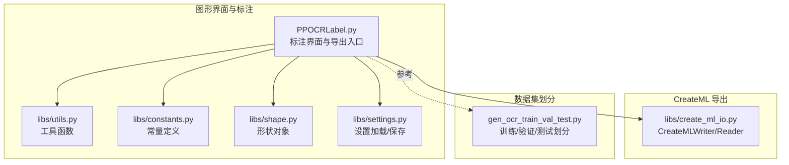
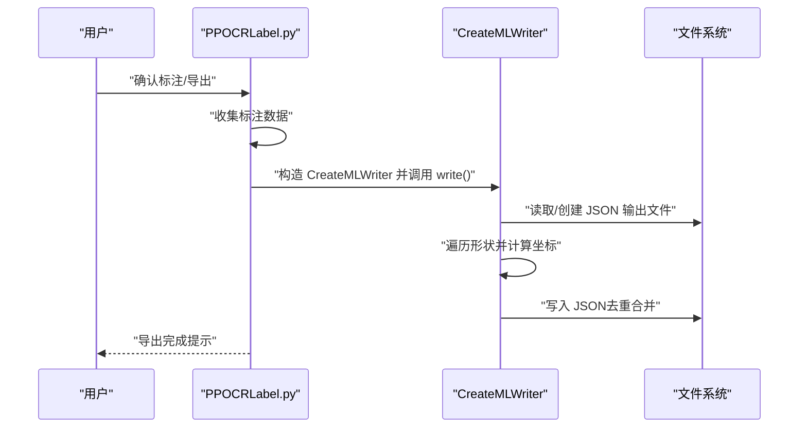
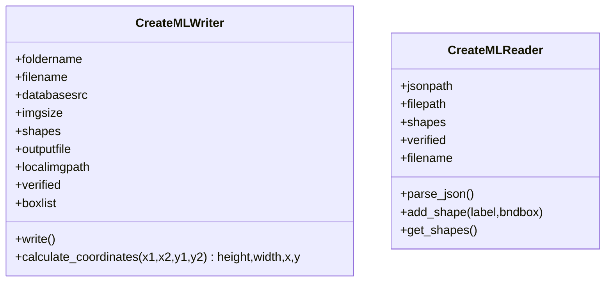
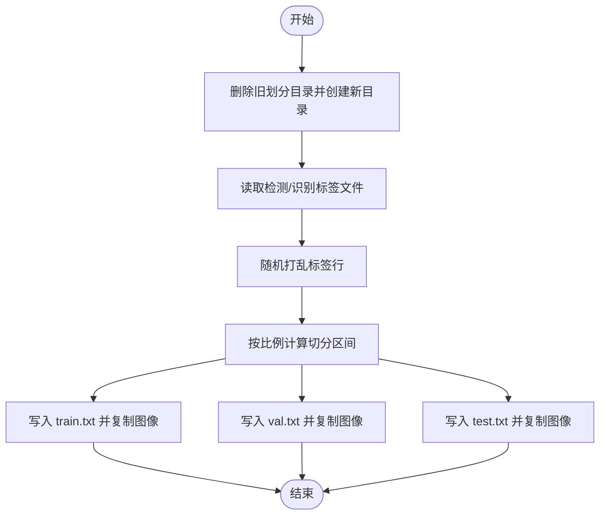
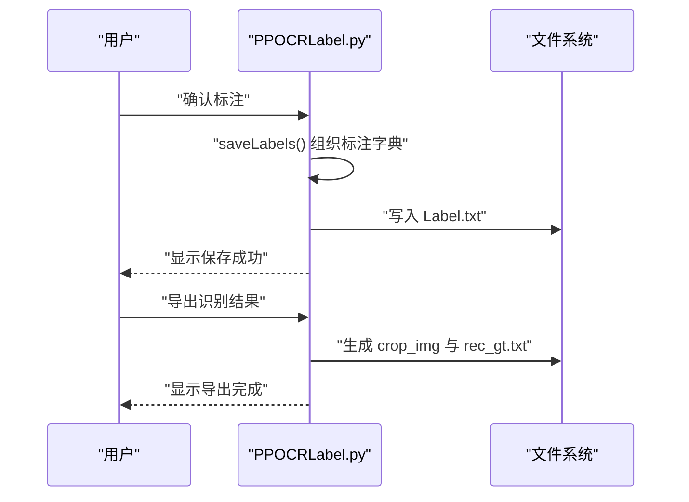
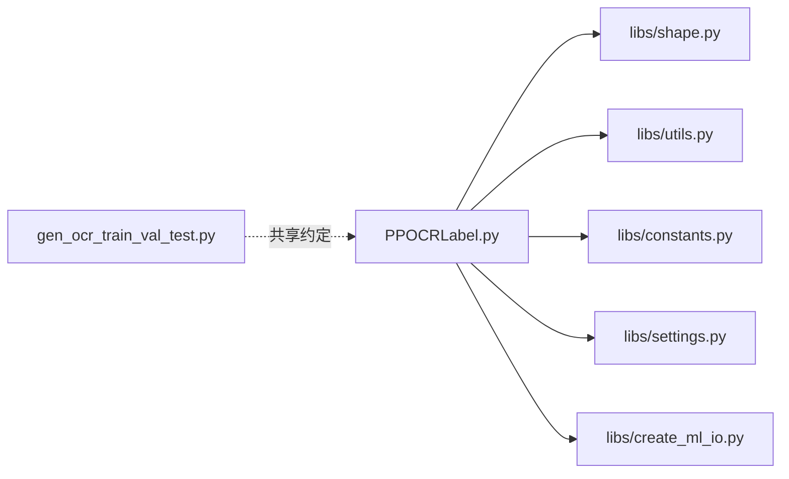

# 数据导出管理

<cite>
**本文引用的文件**
- [libs/create_ml_io.py](create_ml_io.md)
- [gen_ocr_train_val_test.py](gen_ocr_train_val_test.md)
- [PPOCRLabel.py](PPOCRLabel.md)
- [libs/utils.py](utils.md)
- [libs/settings.py](settings.md)
- [libs/constants.py](constants.md)
- [libs/shape.py](shape.md)
- [README.md](README.md)
</cite>

## 目录
1. [简介](#简介)
2. [项目结构](#项目结构)
3. [核心组件](#核心组件)
4. [架构总览](#架构总览)
5. [详细组件分析](#详细组件分析)
6. [依赖关系分析](#依赖关系分析)
7. [性能考虑](#性能考虑)
8. [故障排查指南](#故障排查指南)
9. [结论](#结论)
10. [附录](#附录)

## 简介
本文件围绕 PPOCRLabel 应用中的“数据导出管理”能力，系统性梳理训练数据集的生成与管理流程，涵盖检测与识别两类数据的导出、标注文件的格式化、训练/验证/测试集划分策略与实现机制，并对 create_ml_io 模块的设计与实现进行深入解析。文档还总结了配置选项、输出格式、文件命名规则、数据质量检查、重复数据处理与边界情况处理等技术细节，并提供使用示例与最佳实践建议。

## 项目结构
该应用采用 PyQt5 图形界面与 PaddleOCR 推理引擎结合的方式，形成“标注-导出-训练”的闭环。与数据导出管理直接相关的模块与脚本如下：
- 标注与导出主逻辑：PPOCRLabel.py
- CreateML 格式读写：libs/create_ml_io.py
- 训练/验证/测试集划分脚本：gen_ocr_train_val_test.py
- 工具函数与常量：libs/utils.py、libs/constants.py、libs/shape.py、libs/settings.py
- 使用说明与导出行为参考：README.md

图表来源
- [PPOCRLabel.py](PPOCRLabel.md)
- [libs/create_ml_io.py](create_ml_io.md)
- [gen_ocr_train_val_test.py](gen_ocr_train_val_test.md)
- [libs/utils.py](utils.md)
- [libs/constants.py](constants.md)
- [libs/shape.py](shape.md)
- [libs/settings.py](settings.md)

章节来源
- [PPOCRLabel.py](PPOCRLabel.md)
- [libs/create_ml_io.py](create_ml_io.md)
- [gen_ocr_train_val_test.py](gen_ocr_train_val_test.md)
- [libs/utils.py](utils.md)
- [libs/constants.py](constants.md)
- [libs/shape.py](shape.md)
- [libs/settings.py](settings.md)
- [README.md](README.md)

## 核心组件
- CreateMLWriter/Reader：负责将标注结果以 CreateML JSON 格式写入/读取，支持矩形框标注的坐标转换与去重合并。
- 训练/验证/测试集划分器：根据比例随机切分检测与识别两类数据集，并生成对应的 train/val/test 文件列表。
- 标注主流程：在用户确认标注后，将标注结果写入 Label.txt；识别导出则生成 crop_img 与 rec_gt.txt。
- 工具与常量：提供图像旋转裁剪、自然排序、颜色映射、编码常量等支撑能力。

章节来源
- [libs/create_ml_io.py](create_ml_io.md)
- [gen_ocr_train_val_test.py](gen_ocr_train_val_test.md)
- [PPOCRLabel.py](PPOCRLabel.md)
- [libs/utils.py](utils.md)
- [libs/constants.py](constants.md)

## 架构总览
下图展示了从标注到导出的关键交互路径，以及 CreateML 格式在导出过程中的作用。

图表来源
- [PPOCRLabel.py](PPOCRLabel.md)
- [libs/create_ml_io.py](create_ml_io.md)

## 详细组件分析

### CreateMLWriter/Reader 设计与实现
- 职责
  - CreateMLWriter：将标注形状转换为 CreateML JSON 结构，写入指定输出文件；若同名图像已存在则更新，否则追加。
  - CreateMLReader：从 CreateML JSON 中解析指定图像的标注，还原为内部形状结构。
- 关键算法
  - 坐标转换：将矩形框两点坐标转换为中心点与宽高，确保输出格式一致。
  - 去重合并：若目标图像已在输出列表中，直接替换对应条目，避免重复。
- 错误处理
  - JSON 解码失败时记录错误日志。
- 复杂度
  - 单次写入对每个图像扫描一次输出列表，时间复杂度 O(n)，n 为已有图像数量；坐标转换为 O(1)。

图表来源
- [libs/create_ml_io.py](create_ml_io.md)

章节来源
- [libs/create_ml_io.py](create_ml_io.md)

### 训练/验证/测试集划分策略与实现
- 划分目标
  - 将检测与识别两类数据分别划分为 train/val/test 三部分，保持标签与图像一一对应。
- 实现要点
  - 随机打乱标签文件行，按比例切分索引区间，分别写入 train/val/test 对应的文本文件。
  - 支持检测与识别两类标签文件名自定义，识别数据通常位于 crop_img 子目录。
  - 自动创建 train/val/test 目录并复制图像文件。
- 参数
  - trainValTestRatio：训练/验证/测试比例字符串，如“6:2:2”。
  - datasetRootPath：完整数据集根目录。
  - detRootPath/recRootPath：检测/识别数据划分输出根目录。
  - detLabelFileName/recLabelFileName/recImageDirName：标签文件名与识别图像目录名。

图表来源
- [gen_ocr_train_val_test.py](gen_ocr_train_val_test.md)

章节来源
- [gen_ocr_train_val_test.py](gen_ocr_train_val_test.md)

### 标注结果导出与文件组织
- Label.txt（检测）
  - 用户确认标注后，标注结果写入当前图片所在文件夹的 Label.txt，供检测模型训练使用。
  - 自动导出模式可在每次确认后写入，或达到一定数量后批量导出。
- 识别导出（recognition）
  - 导出识别训练数据时，生成 crop_img 目录与 rec_gt.txt，分别存放裁剪图像与识别标签。
  - 识别标签文件由识别模型推理结果与标注框组合生成。
- CreateML 导出
  - 可将标注结果以 CreateML JSON 格式导出，便于跨平台/跨工具使用。
- 文件命名与组织
  - 检测：Label.txt
  - 识别：crop_img/* 与 rec_gt.txt
  - CreateML：统一 JSON 文件（CreateMLWriter 输出）

图表来源
- [PPOCRLabel.py](PPOCRLabel.md)
- [PPOCRLabel.py](PPOCRLabel.md)
- [README.md](README.md)

章节来源
- [PPOCRLabel.py](PPOCRLabel.md)
- [PPOCRLabel.py](PPOCRLabel.md)
- [README.md](README.md)

### 数据质量检查与边界情况处理
- 坐标有效性
  - 坐标转换时对 x/y 边界进行归一化与中心点计算，避免负宽高与异常中心值。
- 重复数据处理
  - CreateMLWriter 在输出中查找同名图像，存在则覆盖，不存在则追加，避免重复项。
- 文件完整性
  - Reader 在 JSON 解码失败时记录错误日志，避免崩溃。
- 图像旋转与裁剪
  - 提供透视变换与旋转裁剪工具，保证识别数据的几何一致性。
- 编码与路径
  - 统一使用 UTF-8 编码，避免跨平台路径差异导致的读写问题。

章节来源
- [libs/create_ml_io.py](create_ml_io.md)
- [libs/create_ml_io.py](create_ml_io.md)
- [libs/utils.py](utils.md)
- [libs/constants.py](constants.md)

## 依赖关系分析
- 模块耦合
  - PPOCRLabel.py 作为主控制器，依赖 shape、utils、constants、settings 等模块；CreateMLWriter 依赖 constants 进行编码设置。
  - gen_ocr_train_val_test.py 与 PPOCRLabel.py 无直接代码耦合，但共享“Label.txt 与 rec_gt.txt”的约定。
- 外部依赖
  - OpenCV、Pillow、PyQt5、PaddleOCR、openpyxl 等库用于图像处理、界面与推理。
- 循环依赖
  - 当前模块间无明显循环导入；CreateMLWriter/Reader 仅依赖常量与标准库。

图表来源
- [PPOCRLabel.py](PPOCRLabel.md)
- [libs/shape.py](shape.md)
- [libs/utils.py](utils.md)
- [libs/constants.py](constants.md)
- [libs/settings.py](settings.md)
- [libs/create_ml_io.py](create_ml_io.md)
- [gen_ocr_train_val_test.py](gen_ocr_train_val_test.md)

章节来源
- [PPOCRLabel.py](PPOCRLabel.md)
- [libs/shape.py](shape.md)
- [libs/utils.py](utils.md)
- [libs/constants.py](constants.md)
- [libs/settings.py](settings.md)
- [libs/create_ml_io.py](create_ml_io.md)
- [gen_ocr_train_val_test.py](gen_ocr_train_val_test.md)

## 性能考虑
- 写入效率
  - CreateMLWriter 对输出列表的查找为线性扫描，建议在大批量导出时控制单次写入规模或分批处理。
- 图像处理
  - 透视变换与旋转裁剪涉及矩阵运算，建议在批量处理时复用中间变量，减少重复计算。
- 文件 I/O
  - 划分脚本在复制图像时可能成为瓶颈，建议使用硬链接或并行复制策略（需自行扩展）。

## 故障排查指南
- JSON 解码失败
  - 现象：CreateMLReader 报错。
  - 处理：检查 JSON 文件完整性与编码，必要时重建输出文件。
- 导出路径或文件名异常
  - 现象：导出后找不到文件或路径错误。
  - 处理：确认输出目录存在且具有写权限；核对文件名与编码设置。
- 划分比例不生效
  - 现象：训练/验证/测试比例不符合预期。
  - 处理：检查 trainValTestRatio 字符串格式；确认标签文件行数与随机打乱逻辑。
- 识别导出缺失
  - 现象：crop_img 与 rec_gt.txt 未生成。
  - 处理：确认已执行识别导出操作；检查图像与标注是否匹配。

章节来源
- [libs/create_ml_io.py](create_ml_io.md)
- [gen_ocr_train_val_test.py](gen_ocr_train_val_test.md)
- [PPOCRLabel.py](PPOCRLabel.md)

## 结论
本项目通过 CreateMLWriter/Reader 与训练/验证/测试集划分脚本，构建了从标注到导出再到训练的数据管线。标注主流程负责将标注结果落盘为 Label.txt，并支持识别导出生成 rec_gt.txt 与 crop_img。CreateML 格式导出提供了跨平台兼容性。配合合理的数据质量检查与边界处理，能够稳定支撑 OCR 检测与识别模型的训练。

## 附录

### 使用示例与最佳实践
- 导出检测标注
  - 步骤：打开图片目录 → 标注 → 确认 → 触发自动导出或手动导出 → 查看当前目录下的 Label.txt。
  - 最佳实践：启用自动导出模式，减少遗漏；定期备份 Label.txt。
- 导出识别数据
  - 步骤：标注完成后，执行识别导出 → 检查 crop_img 与 rec_gt.txt 是否生成。
  - 最佳实践：确保每张图均完成标注后再导出；导出后进行样本抽样核查。
- 划分训练/验证/测试集
  - 步骤：准备完整数据集 → 运行划分脚本 → 检查 det 与 rec 目录结构与 txt 文件。
  - 最佳实践：统一标签文件命名；划分前备份原始数据；核对比例参数。
- CreateML 导出
  - 步骤：在标注界面导出 CreateML JSON → 校验输出文件结构。
  - 最佳实践：导出前清理历史重复项；导出后进行抽样比对。

章节来源
- [README.md](README.md)
- [gen_ocr_train_val_test.py](gen_ocr_train_val_test.md)
- [libs/create_ml_io.py](create_ml_io.md)