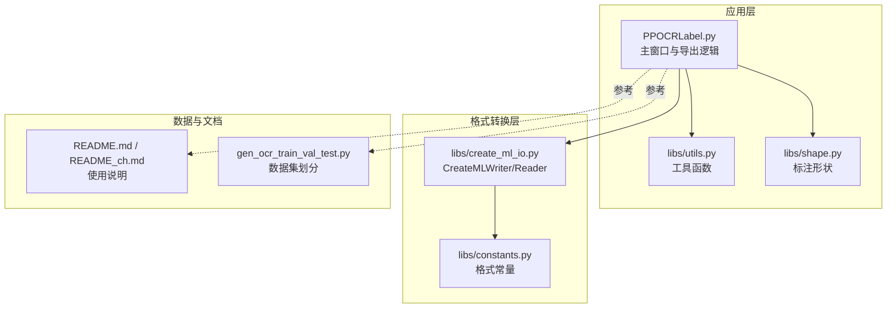
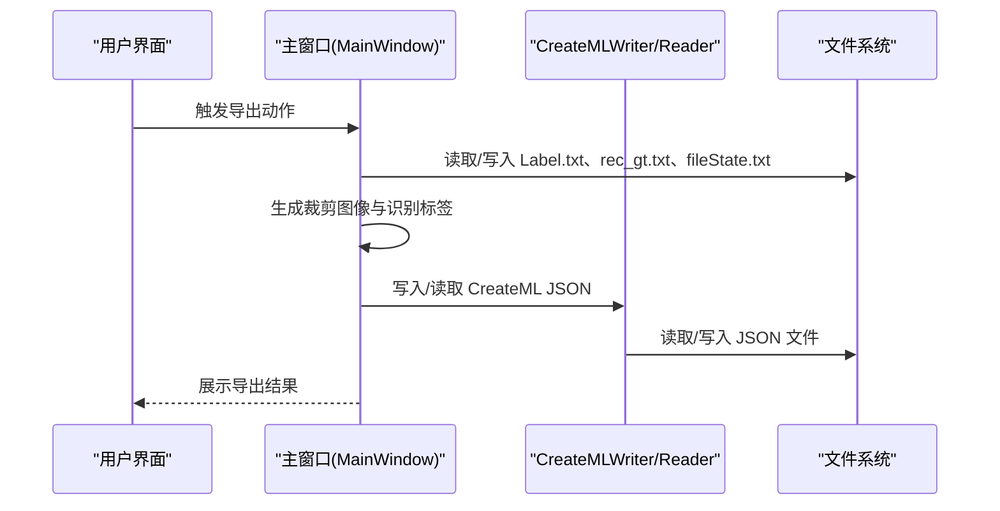
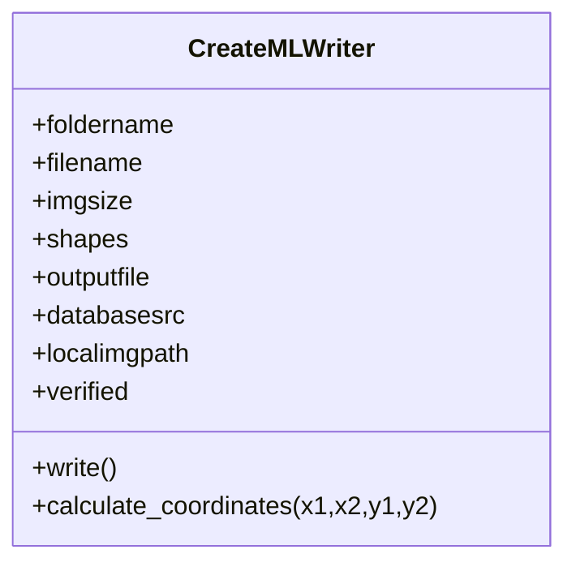
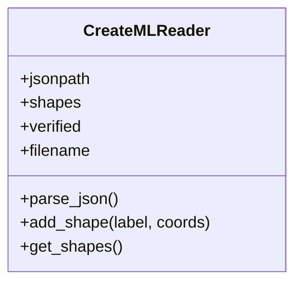
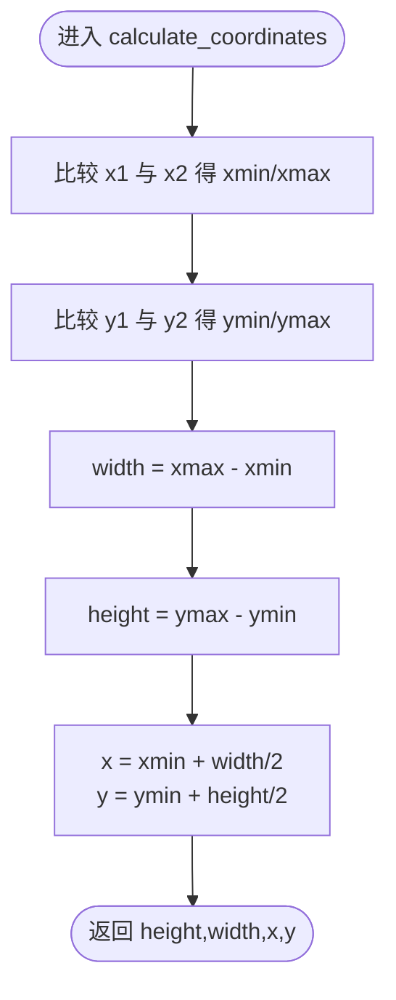
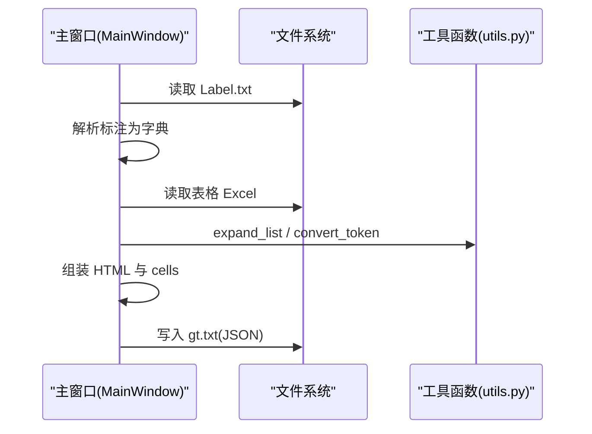
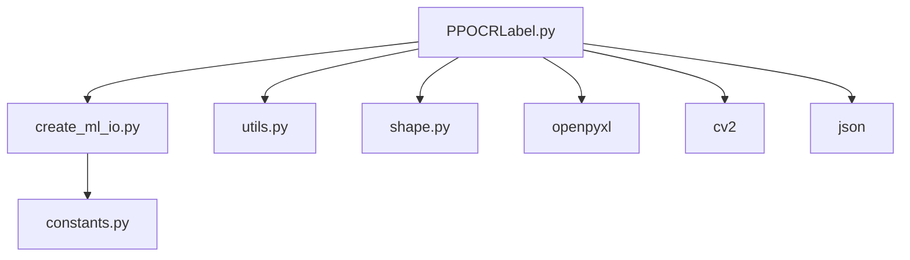

# 格式转换

<cite>
**本文引用的文件**
- [PPOCRLabel.py](PPOCRLabel.md)
- [create_ml_io.py](create_ml_io.md)
- [constants.py](constants.md)
- [README.md](README.md)
- [README_ch.md](README_ch.md)
- [gen_ocr_train_val_test.py](gen_ocr_train_val_test.md)
- [utils.py](utils.md)
- [shape.py](shape.md)
</cite>

## 目录
1. [简介](#简介)
2. [项目结构](#项目结构)
3. [核心组件](#核心组件)
4. [架构总览](#架构总览)
5. [详细组件分析](#详细组件分析)
6. [依赖关系分析](#依赖关系分析)
7. [性能考虑](#性能考虑)
8. [故障排查指南](#故障排查指南)
9. [结论](#结论)
10. [附录](#附录)

## 简介
本文件聚焦于 PPOCRLabel 应用中的“格式转换”能力，系统梳理 create_ml_io 模块的设计与实现，解释其与主程序的集成方式，并给出 YOLO、Pascal VOC、LabelMe 等常见标注格式的结构特点与转换规则。文档还涵盖配置项、输出控制、错误处理、格式验证与兼容性策略、性能优化建议及使用示例与最佳实践。

## 项目结构
围绕格式转换的关键文件与职责如下：
- libs/create_ml_io.py：提供 CreateMLWriter/Reader 类，负责 CreateML 格式的读写与坐标转换。
- libs/constants.py：定义常量，包括 PascalVOC、YOLO 等格式标识，以及默认编码等。
- PPOCRLabel.py：主程序入口，负责加载标注、导出识别结果、生成裁剪图像与标签文本，以及触发导出 JSON（PubTabNet）等。
- libs/utils.py：提供图像裁剪、HTML 转换等工具函数，用于导出流程中的数据准备。
- libs/shape.py：定义标注形状对象，承载点位、标签等信息，供导出流程使用。
- README.md / README_ch.md：提供使用说明与导出流程背景。
- gen_ocr_train_val_test.py：数据集划分脚本，展示 Label.txt 与 rec_gt.txt 的组织方式。

图表来源
- [PPOCRLabel.py](PPOCRLabel.md)
- [create_ml_io.py](create_ml_io.md)
- [constants.py](constants.md)
- [README.md](README.md)
- [README_ch.md](README_ch.md)
- [gen_ocr_train_val_test.py](gen_ocr_train_val_test.md)

章节来源
- [PPOCRLabel.py](PPOCRLabel.md)
- [create_ml_io.py](create_ml_io.md)
- [constants.py](constants.md)
- [README.md](README.md)
- [README_ch.md](README_ch.md)
- [gen_ocr_train_val_test.py](gen_ocr_train_val_test.md)

## 核心组件
- CreateMLWriter：将内部标注形状转换为 CreateML JSON 结构，支持追加更新同一图像的标注列表，确保去重与覆盖。
- CreateMLReader：从 CreateML JSON 中解析指定图像的标注，还原为内部形状结构，便于后续处理。
- 坐标转换：将矩形框的两点坐标转换为中心点坐标与宽高，统一输出格式。
- 常量与格式标识：提供 PascalVOC、YOLO 等格式常量，便于扩展其他格式支持。

章节来源
- [create_ml_io.py](create_ml_io.md)
- [constants.py](constants.md)

## 架构总览
格式转换在主程序中的集成路径如下：
- 主程序负责加载标注、维护状态文件、生成裁剪图像与识别标签文本。
- 导出 JSON（PubTabNet）流程依赖 Label.txt 与表格识别输出的 Excel，结合工具函数生成结构化 JSON。
- CreateMLWriter/Reader 作为独立模块，可直接用于 CreateML 格式的数据生成与读取。

图表来源
- [PPOCRLabel.py](PPOCRLabel.md)
- [create_ml_io.py](create_ml_io.md)

章节来源
- [PPOCRLabel.py](PPOCRLabel.md)
- [create_ml_io.py](create_ml_io.md)

## 详细组件分析

### CreateMLWriter 组件
- 输入参数：文件夹名、文件名、图像尺寸、形状集合、输出文件路径等。
- 写入流程：
  - 若输出文件存在则先读取已有 JSON 列表；否则初始化为空列表。
  - 为当前图像构建字典，包含图像名与空标注列表。
  - 遍历每个形状，计算中心点坐标与宽高，构造标注条目并加入该图像的标注列表。
  - 若该图像已在输出列表中，进行覆盖；否则追加。
  - 最终将完整列表写回文件，采用默认编码。

图表来源
- [create_ml_io.py](create_ml_io.md)

章节来源
- [create_ml_io.py](create_ml_io.md)

### CreateMLReader 组件
- 输入参数：JSON 路径、目标图像路径。
- 解析流程：
  - 读取 JSON 文件内容并解析为字典。
  - 遍历字典中与目标图像同名的条目，逐条读取标注。
  - 将标注的中心坐标与宽高还原为矩形四点坐标，构建形状元组并加入内部列表。
  - 提供获取形状的方法返回解析结果。

图表来源
- [create_ml_io.py](create_ml_io.md)

章节来源
- [create_ml_io.py](create_ml_io.md)

### 坐标转换算法
- 输入：矩形框的两个对角点坐标。
- 输出：中心点坐标与宽高。
- 算法要点：
  - 通过比较横纵坐标确定最小/最大值，从而得到宽高。
  - 中心点坐标为中心值，避免负宽高的出现。
  - 该转换确保输出格式统一，便于下游模型或工具消费。

图表来源
- [create_ml_io.py](create_ml_io.md)

章节来源
- [create_ml_io.py](create_ml_io.md)

### 导出 JSON（PubTabNet）流程
- 步骤概览：
  - 自动保存文件状态与标注，确保 Label.txt 最新。
  - 读取 Label.txt，解析为图像到标注列表的映射。
  - 加载表格识别输出的 Excel，提取合并单元格范围并转换为 HTML token 列表。
  - 将标注中的文本与边界框组合为结构化 HTML 与单元格列表。
  - 生成最终 JSON 并写入 gt.txt。

图表来源
- [PPOCRLabel.py](PPOCRLabel.md)
- [utils.py](utils.md)

章节来源
- [PPOCRLabel.py](PPOCRLabel.md)
- [utils.py](utils.md)

## 依赖关系分析
- 主程序依赖：
  - create_ml_io：用于 CreateML 格式读写。
  - utils：用于 HTML token 构造与表格结构重建。
  - shape：用于标注形状的内部表示与操作。
  - constants：用于格式标识与默认编码等常量。
- 外部依赖：
  - openpyxl：读取 Excel 表格识别输出。
  - cv2：图像裁剪与编码。
  - json：序列化/反序列化标注数据。

图表来源
- [PPOCRLabel.py](PPOCRLabel.md)
- [create_ml_io.py](create_ml_io.md)
- [utils.py](utils.md)
- [constants.py](constants.md)

章节来源
- [PPOCRLabel.py](PPOCRLabel.md)
- [create_ml_io.py](create_ml_io.md)
- [utils.py](utils.md)
- [constants.py](constants.md)

## 性能考虑
- I/O 合并：CreateMLWriter 在写入前一次性读取/解析现有 JSON，避免多次磁盘访问。
- 增量更新：通过图像名匹配进行覆盖而非全量重写，减少不必要的写入。
- 图像裁剪：使用向量化与高效编码接口，降低 CPU 与内存压力。
- 导出流程：仅在必要时读取 Excel 与 Label.txt，避免重复解析。

[本节为通用指导，无需列出具体文件来源]

## 故障排查指南
- JSON 解码失败：Reader 在解析 JSON 时捕获异常并记录日志，检查 JSON 文件是否损坏或格式不正确。
- 缺少 Label.txt：导出 JSON 流程会提示找不到标注文件，请先完成标注并保存。
- 图像路径或标签异常：导出识别结果时若遇到异常，程序会收集问题图像并在消息框中提示，需检查图像路径与标注框有效性。
- 编码问题：默认采用 UTF-8 编码，确保文件系统与编辑器一致，避免乱码。

章节来源
- [create_ml_io.py](create_ml_io.md)
- [PPOCRLabel.py](PPOCRLabel.md)
- [PPOCRLabel.py](PPOCRLabel.md)

## 结论
create_ml_io 模块提供了简洁可靠的 CreateML 格式读写能力，配合主程序的导出与数据准备流程，能够高效地生成多种下游可用的标注格式。通过对坐标转换、文件读写与错误处理的精心设计，系统在易用性与稳定性之间取得良好平衡。未来可在此基础上扩展更多格式支持（如 Pascal VOC、YOLO），并引入更严格的格式校验与批处理优化。

[本节为总结性内容，无需列出具体文件来源]

## 附录

### 支持的标注格式与转换规则
- CreateML（本模块实现）：以图像名为键，值为包含标注列表的字典；标注项包含标签与坐标（中心点与宽高）。
- Pascal VOC（常量定义）：通过 FORMAT_PASCALVOC 常量标识，可在主程序中扩展相应转换逻辑。
- YOLO（常量定义）：通过 FORMAT_YOLO 常量标识，可在主程序中扩展相应转换逻辑。
- LabelMe：未在仓库中发现直接实现，但可基于 CreateMLWriter 的思路扩展为 JSON 结构。

章节来源
- [constants.py](constants.md)

### 使用示例与最佳实践
- CreateML 导出：
  - 在主程序中调用 CreateMLWriter，传入形状集合与输出路径，即可生成/更新 JSON 文件。
  - 若需增量更新，确保同一图像名不变，Writer 会自动覆盖旧记录。
- 导出 JSON（PubTabNet）：
  - 先保存标注与状态，再读取 Label.txt 与表格 Excel，最后生成 gt.txt。
  - 建议在导出前清理无效标注，确保标注框与表格结构一致。
- 数据集划分：
  - 使用 gen_ocr_train_val_test.py 对检测与识别数据集进行划分，遵循脚本参数约定。

章节来源
- [PPOCRLabel.py](PPOCRLabel.md)
- [README.md](README.md)
- [README_ch.md](README_ch.md)
- [gen_ocr_train_val_test.py](gen_ocr_train_val_test.md)