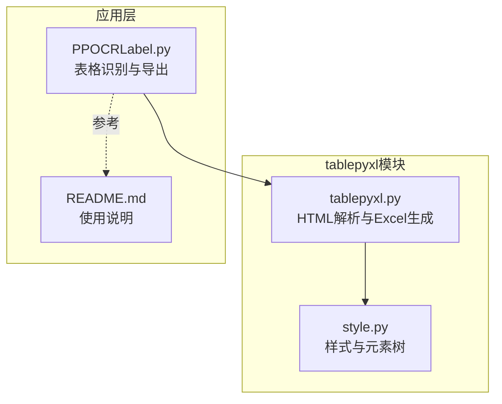
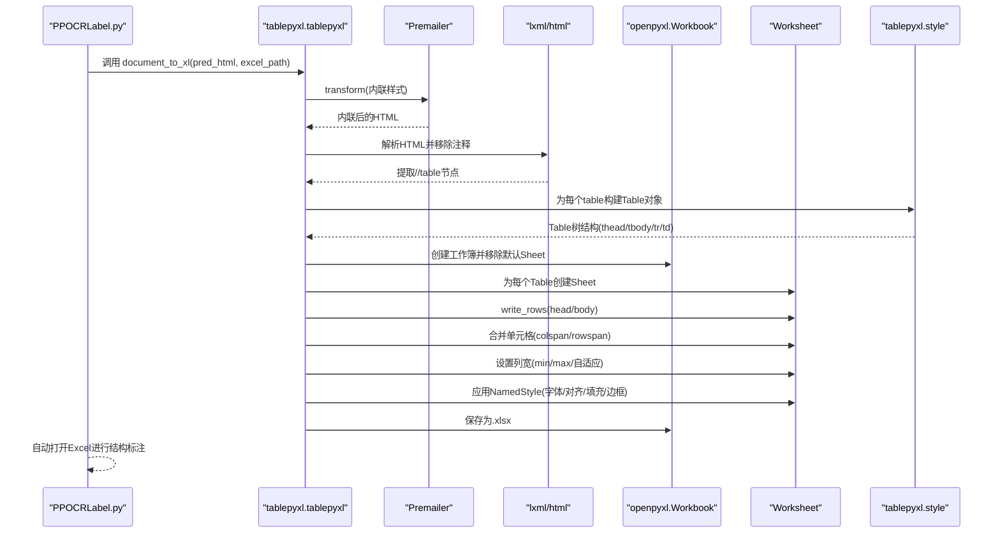
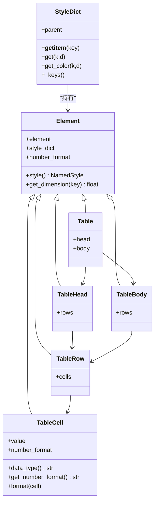
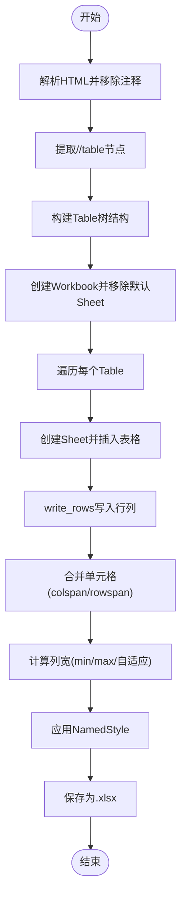
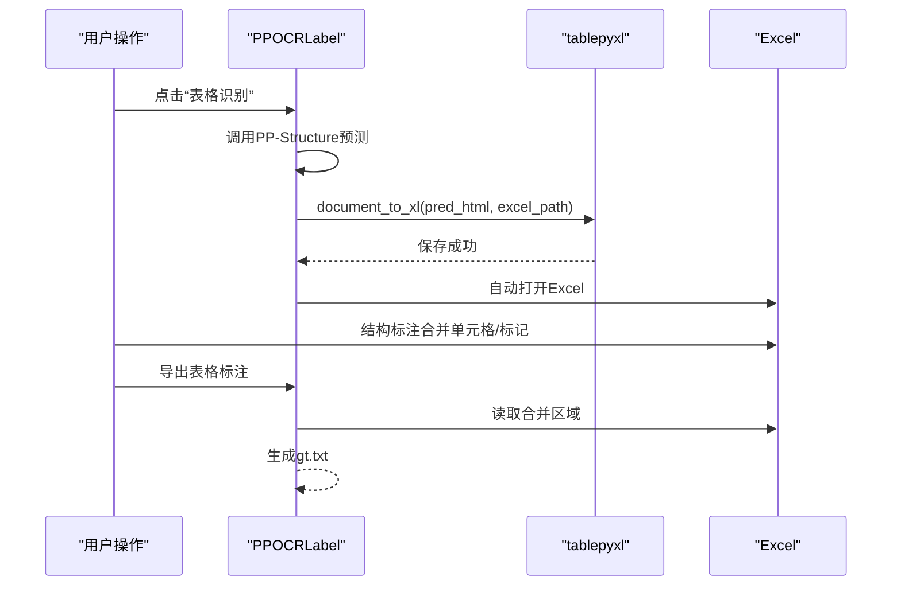
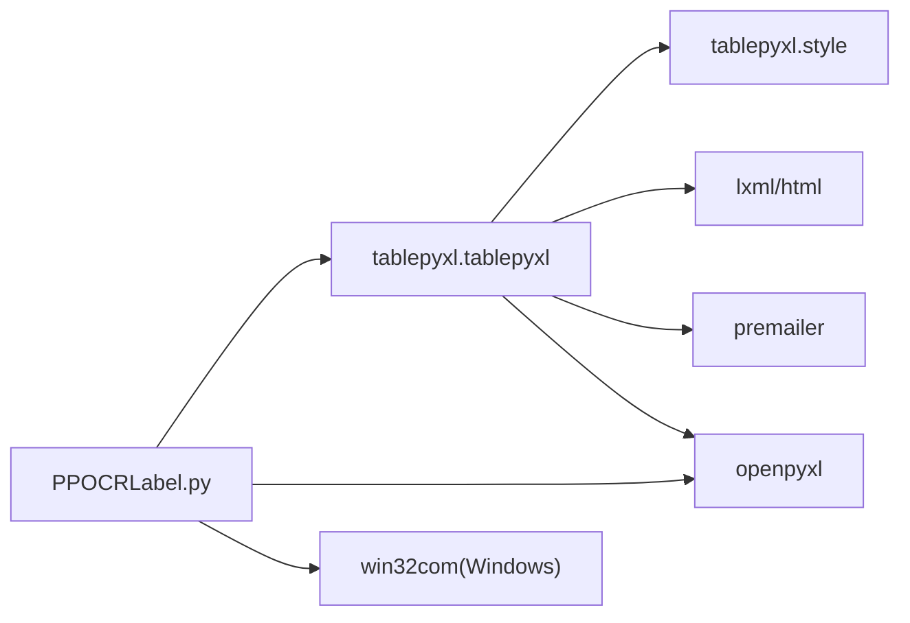

# Excel数据处理

<cite>
**本文引用的文件列表**
- [tablepyxl/__init__.py](__init__.md)
- [tablepyxl/style.py](style.md)
- [tablepyxl/tablepyxl.py](tablepyxl.md)
- [PPOCRLabel.py](PPOCRLabel.md)
- [README.md](README.md)
</cite>

## 目录
1. [简介](#简介)
2. [项目结构](#项目结构)
3. [核心组件](#核心组件)
4. [架构总览](#架构总览)
5. [详细组件分析](#详细组件分析)
6. [依赖关系分析](#依赖关系分析)
7. [性能考量](#性能考量)
8. [故障排查指南](#故障排查指南)
9. [结论](#结论)
10. [附录](#附录)

## 简介
本文件面向“表格标注数据到Excel格式”的转换流程，系统性阐述tablepyxl模块的设计架构与实现细节，覆盖以下主题：
- 表格数据结构定义与DOM树映射
- 样式处理机制（CSS到openpyxl样式的映射）
- Excel文件生成算法（HTML表格到工作表）
- 单元格定位、合并单元格处理、列宽计算
- 数据类型推断、格式转换、错误处理
- 使用示例与最佳实践
- HTML到Excel转换流程、样式继承、列宽计算等核心功能

该能力在PPOCRLabel中用于“表格识别”阶段，将PP-Structure输出的HTML表格结构写入Excel，并支持自动打开Excel进行结构标注；同时在“导出表格标注”阶段，从Excel读取合并区域并重建HTML表格结构，最终生成训练所需的gt.txt标注文件。

## 项目结构
围绕Excel数据处理的关键文件与职责如下：
- tablepyxl/style.py：定义样式字典、元素树结构、CSS到openpyxl样式的映射、单元格数据类型推断与格式设置
- tablepyxl/tablepyxl.py：负责HTML解析、表格抽取、工作簿生成、单元格写入与合并、列宽计算
- PPOCRLabel.py：集成PP-Structure表格识别，调用tablepyxl将HTML写入Excel，并在导出阶段从Excel读取合并区域重建HTML
- README.md：提供表格标注流程说明与使用指导

图表来源
- [tablepyxl/style.py](style.md)
- [tablepyxl/tablepyxl.py](tablepyxl.md)
- [PPOCRLabel.py](PPOCRLabel.md)
- [README.md](README.md)

章节来源
- [tablepyxl/style.py](style.md)
- [tablepyxl/tablepyxl.py](tablepyxl.md)
- [PPOCRLabel.py](PPOCRLabel.md)
- [README.md](README.md)

## 核心组件
- 元素与样式体系
  - Element：基础元素类，封装HTML元素及其级联样式字典，支持缓存与维度查询
  - StyleDict：带父级继承的样式字典，支持颜色规范化与键查找
  - style_dict_to_named_style：将CSS样式字典转换为openpyxl NamedStyle
- 表格结构映射
  - Table/TableHead/TableBody/TableRow/TableCell：将HTML table DOM映射为树形结构，支持thead/tbody/tr/td/th
  - TableCell：支持数据类型推断（字符串、数值、货币、百分比、日期、公式等）与number_format设置
- Excel生成流水线
  - document_to_workbook/document_to_xl：HTML文档转工作簿/保存为.xlsx
  - write_rows：逐行写入单元格、处理colspan/rowspan合并、列宽自适应
  - insert_table/insert_table_at_cell：插入表格至指定工作表或单元格

章节来源
- [tablepyxl/style.py](style.md)
- [tablepyxl/tablepyxl.py](tablepyxl.md)

## 架构总览
下图展示从HTML表格到Excel工作表的端到端流程，以及样式与数据类型的转换路径。

图表来源
- [tablepyxl/tablepyxl.py](tablepyxl.md)
- [tablepyxl/style.py](style.md)
- [PPOCRLabel.py](PPOCRLabel.md)

## 详细组件分析

### 组件A：样式与元素树（style.py）
- 设计要点
  - Element：持有element与style_dict，提供style()缓存NamedStyle，get_dimension解析px/em/pt/in/cm等单位
  - StyleDict：支持父子级联查找、颜色规范化（去除#、兼容3位色）、哈希缓存
  - style_dict_to_named_style：将CSS属性映射为Font/Alignment/Fill/Border/NamedStyle
  - TableCell：根据class集合推断数据类型，设置number_format；format方法应用样式与数据类型
- 复杂度与性能
  - 样式字典查找为O(1)，父级查找为O(h)（h为继承层级）
  - NamedStyle缓存避免重复创建，提升写入性能
- 错误处理
  - 颜色值预处理防止openpyxl不识别的短色值
  - 缺失键通过StyleDict抛出KeyError，便于定位问题

图表来源
- [tablepyxl/style.py](style.md)

章节来源
- [tablepyxl/style.py](style.md)

### 组件B：HTML到Excel生成（tablepyxl.py）
- 设计要点
  - get_Tables：使用lxml解析HTML，移除注释，提取//table节点并构建Table对象
  - write_rows：逐行遍历tr/td，处理MergedCell跳过、colspan/rowspan合并、值写入、样式应用、列宽自适应
  - document_to_workbook/document_to_xl：内联CSS、构建工作簿、逐表写入、保存文件
  - insert_table/insert_table_at_cell：支持从指定单元格开始插入表格
- 数据流与控制流
  - 输入HTML（含内联样式）→ 解析DOM → 提取表格 → 写入工作表 → 合并单元格 → 设置列宽 → 保存
- 性能与优化
  - 列宽计算仅在colspan==1时生效，避免重复计算
  - NamedStyle缓存减少openpyxl样式对象创建次数
- 错误处理
  - try_import动态导入依赖，避免缺失库时报错
  - 异常捕获并记录日志，确保主流程可继续

图表来源
- [tablepyxl/tablepyxl.py](tablepyxl.md)

章节来源
- [tablepyxl/tablepyxl.py](tablepyxl.md)

### 组件C：应用集成（PPOCRLabel.py）
- 表格识别阶段
  - 调用PP-Structure预测，得到pred_html与识别框
  - 清空旧标注，绘制识别框
  - 调用tablepyxl.document_to_xl将pred_html写入Excel
  - Windows平台通过win32com自动打开Excel
- 导出阶段
  - 读取Excel合并区域，重建HTML表格结构
  - 生成gt.txt供训练使用

图表来源
- [PPOCRLabel.py](PPOCRLabel.md)
- [README.md](README.md)

章节来源
- [PPOCRLabel.py](PPOCRLabel.md)
- [README.md](README.md)

## 依赖关系分析
- 内部依赖
  - tablepyxl.tablepyxl依赖tablepyxl.style（Table/Element/StyleDict/NamedStyle）
  - PPOCRLabel.py依赖tablepyxl（document_to_xl）与openpyxl（读取Excel合并区域）
- 外部依赖
  - lxml：HTML解析与XPath提取
  - premailer：CSS内联
  - openpyxl：工作簿、工作表、单元格、样式、合并单元格、列宽设置
  - win32com（Windows）：自动打开Excel

图表来源
- [tablepyxl/tablepyxl.py](tablepyxl.md)
- [PPOCRLabel.py](PPOCRLabel.md)

章节来源
- [tablepyxl/tablepyxl.py](tablepyxl.md)
- [PPOCRLabel.py](PPOCRLabel.md)

## 性能考量
- 样式缓存
  - style_dict_to_named_style对样式字典与number_format组合进行缓存，避免重复创建NamedStyle
- 列宽计算
  - 仅在colspan==1时更新列宽，避免对合并列重复计算
  - 基于单元格内容长度与min/max宽度约束，兼顾可读性与性能
- 合并单元格
  - 在写入前统一处理colspan/rowspan，减少后续单元格覆盖与跳过逻辑复杂度
- 动态导入
  - try_import在运行时检查依赖，避免不必要的导入开销

[本节为通用性能建议，无需特定文件引用]

## 故障排查指南
- 无法打开Excel（Windows）
  - 现象：提示无法打开.xlsx
  - 原因：仅Windows支持；缺少win32com
  - 处理：安装pywin32；确认Excel已安装且可用
- 无表格识别结果
  - 现象：提示无法识别表格，生成空Excel
  - 处理：手动标注或检查输入图像质量；确保PP-Structure模型可用
- 样式未生效
  - 现象：字体、对齐、边框未按预期显示
  - 原因：CSS未内联或颜色值格式异常
  - 处理：确认premailer内联；颜色值去除#或扩展为6位
- 列宽异常
  - 现象：列宽过窄或过宽
  - 原因：min-width/max-width与内容长度冲突
  - 处理：调整min/max宽度；确保内容长度计算正确

章节来源
- [PPOCRLabel.py](PPOCRLabel.md)
- [tablepyxl/tablepyxl.py](tablepyxl.md)

## 结论
tablepyxl模块通过清晰的元素树与样式映射，实现了从HTML表格到Excel工作表的高保真转换。其设计在样式继承、数据类型推断、合并单元格与列宽计算方面具备良好工程实践，能够满足表格标注场景下的结构化导出需求。结合PPOCRLabel的表格识别与导出流程，用户可在外部Excel中完成结构标注，并回写为训练数据。

[本节为总结性内容，无需特定文件引用]

## 附录

### 使用示例与最佳实践
- 表格识别与导出
  - 步骤：打开图像 → 点击“表格识别” → 在Excel中完成结构标注 → 导出表格标注 → 生成gt.txt
  - 注意：若无表格识别结果，将生成空Excel；确保win32com可用以便自动打开Excel
- HTML到Excel转换
  - 输入：包含内联样式的HTML字符串
  - 输出：多工作表的.xlsx文件，每张表对应一个HTML table
  - 最佳实践：提前使用premailer内联CSS；为td/th添加必要的class以启用数据类型推断
- 列宽与样式
  - 列宽：基于内容长度与min/max约束；合并列不参与列宽计算
  - 样式：优先使用内联样式；颜色值需规范为6位HEX或已知颜色名
- 错误处理
  - 依赖缺失：通过try_import降级处理；记录日志并继续执行
  - 合并区域读取：使用openpyxl的merged_cells.ranges获取合并范围，重建HTML表格结构

章节来源
- [README.md](README.md)
- [PPOCRLabel.py](PPOCRLabel.md)
- [tablepyxl/tablepyxl.py](tablepyxl.md)