# PPStructureV3模型集成

<cite>
**本文档引用的文件**
- [PPOCRLabel.py](PPOCRLabel.md)
- [README.md](README.md)
- [README_ch.md](README_ch.md)
- [libs/utils.py](utils.md)
- [tablepyxl/tablepyxl.py](tablepyxl.md)
- [libs/constants.py](constants.md)
- [libs/settings.py](settings.md)
- [gen_ocr_train_val_test.py](gen_ocr_train_val_test.md)
</cite>

## 目录
1. [简介](#简介)
2. [项目结构](#项目结构)
3. [核心组件](#核心组件)
4. [架构概览](#架构概览)
5. [详细组件分析](#详细组件分析)
6. [依赖关系分析](#依赖关系分析)
7. [性能考虑](#性能考虑)
8. [故障排除指南](#故障排除指南)
9. [结论](#结论)
10. [附录](#附录)

## 简介

PPStructureV3模型集成是PPOCRLabel工具中表格识别功能的核心组成部分。该集成实现了基于PaddleOCR的PP-Structure表格识别模型，能够自动检测和识别表格结构，并将结果转换为Excel格式。本文档详细解释了PPStructureV3模型的初始化、配置和调用机制，包括表格识别参数设置、模型路径配置、设备选择等关键环节。

## 项目结构

PPOCRLabel项目采用模块化设计，主要包含以下关键目录和文件：

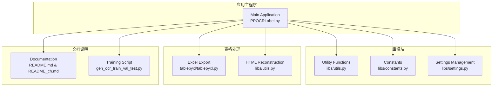

**图表来源**
- [PPOCRLabel.py](PPOCRLabel.md)
- [libs/utils.py](utils.md)
- [tablepyxl/tablepyxl.py](tablepyxl.md)

**章节来源**
- [PPOCRLabel.py](PPOCRLabel.md)
- [README.md](README.md)

## 核心组件

### PPStructureV3模型初始化

PPStructureV3模型在MainWindow类中进行初始化，配置了完整的表格识别功能：

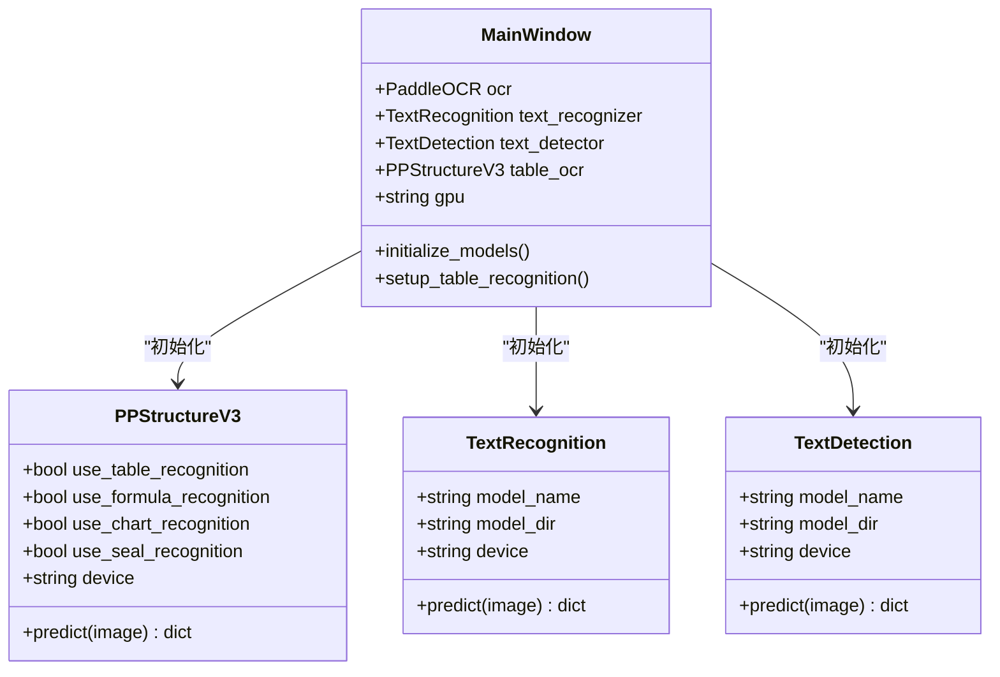

**图表来源**
- [PPOCRLabel.py](PPOCRLabel.md)

### 设备选择和配置

系统根据PaddlePaddle的编译状态自动选择GPU或CPU设备：

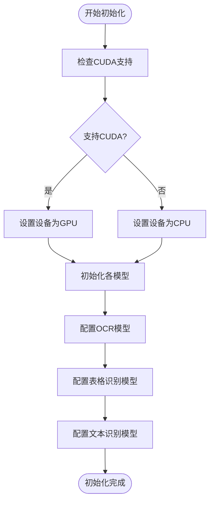

**图表来源**
- [PPOCRLabel.py](PPOCRLabel.md)

**章节来源**
- [PPOCRLabel.py](PPOCRLabel.md)

## 架构概览

PPStructureV3模型集成采用了分层架构设计，确保了模块间的松耦合和高内聚：

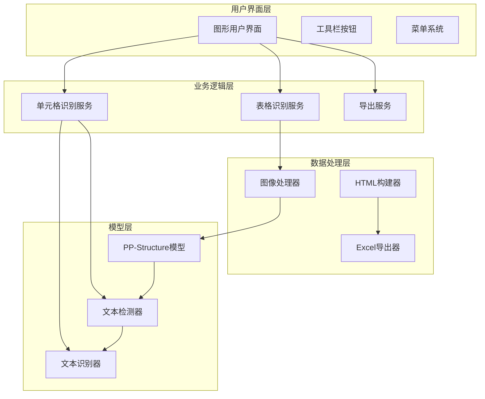

**图表来源**
- [PPOCRLabel.py](PPOCRLabel.md)
- [libs/utils.py](utils.md)

## 详细组件分析

### 表格识别核心流程

表格识别功能通过TableRecognition方法实现，该方法负责完整的表格识别流程：

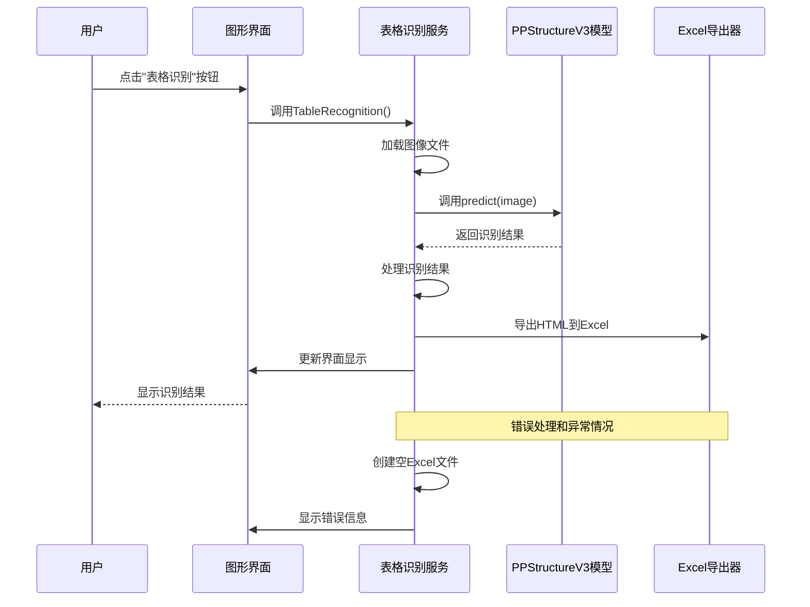

**图表来源**
- [PPOCRLabel.py](PPOCRLabel.md)

### 输出格式和数据结构

PPStructureV3模型返回的表格识别结果具有特定的数据结构：

| 字段名称 | 类型 | 描述 | 示例值 |
|---------|------|------|--------|
| `table_res_list` | list | 表格识别结果列表 | `[{"table_ocr_pred": {...}}]` |
| `table_ocr_pred` | dict | 单个表格的预测结果 | `{}` |
| `rec_boxes` | list | 检测到的文本框坐标 | `[[x1,y1,x2,y2], ...]` |
| `rec_texts` | list | 对应的识别文本 | `["文本1", "文本2", ...]` |
| `pred_html` | str | HTML格式的表格结构 | `"<!DOCTYPE html>..."` |

### 结果解析和后处理

系统提供了完整的HTML重建功能，将PPStructureV3的输出转换为标准HTML格式：

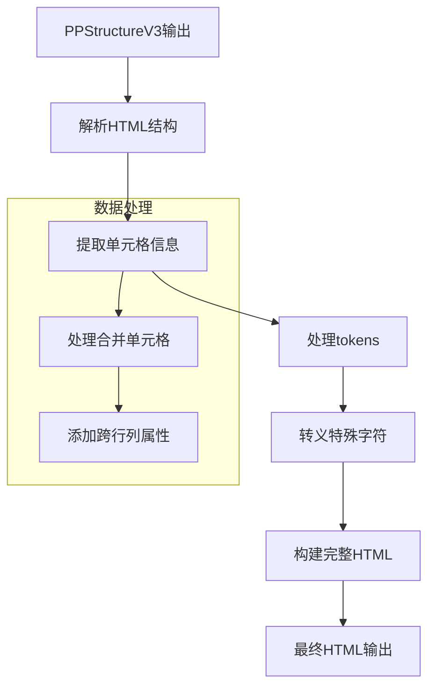

**图表来源**
- [libs/utils.py](utils.md)

**章节来源**
- [PPOCRLabel.py](PPOCRLabel.md)
- [libs/utils.py](utils.md)

### 单元格识别功能

单元格识别功能允许用户对表格中的单个单元格进行重新识别：

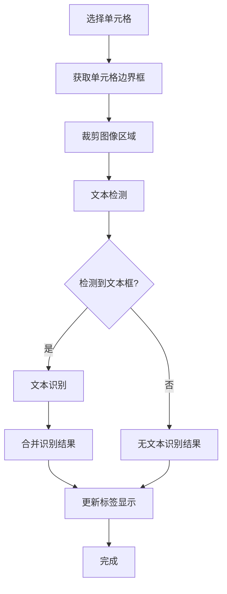

**图表来源**
- [PPOCRLabel.py](PPOCRLabel.md)

**章节来源**
- [PPOCRLabel.py](PPOCRLabel.md)

## 依赖关系分析

### 外部依赖

PPStructureV3模型集成依赖于多个外部库和模块：

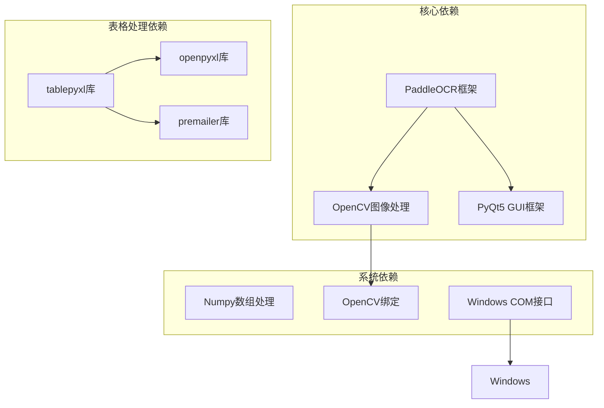

**图表来源**
- [PPOCRLabel.py](PPOCRLabel.md)
- [tablepyxl/tablepyxl.py](tablepyxl.md)

### 内部模块依赖

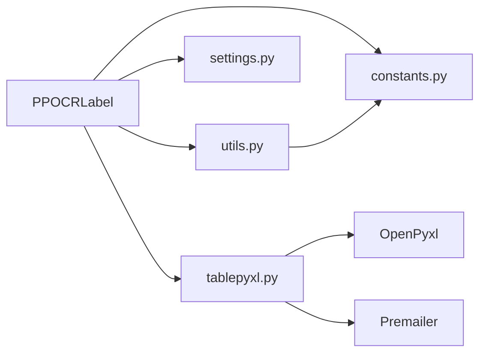

**图表来源**
- [PPOCRLabel.py](PPOCRLabel.md)

**章节来源**
- [PPOCRLabel.py](PPOCRLabel.md)

## 性能考虑

### 内存管理策略

系统采用了多项内存管理策略来优化PPStructureV3模型的性能：

1. **延迟初始化**: 模型仅在首次使用时加载，避免不必要的内存占用
2. **资源清理**: 在切换语言或重新配置模型时及时释放旧模型资源
3. **批量处理**: 支持批量图像处理，减少重复初始化开销

### 设备选择优化

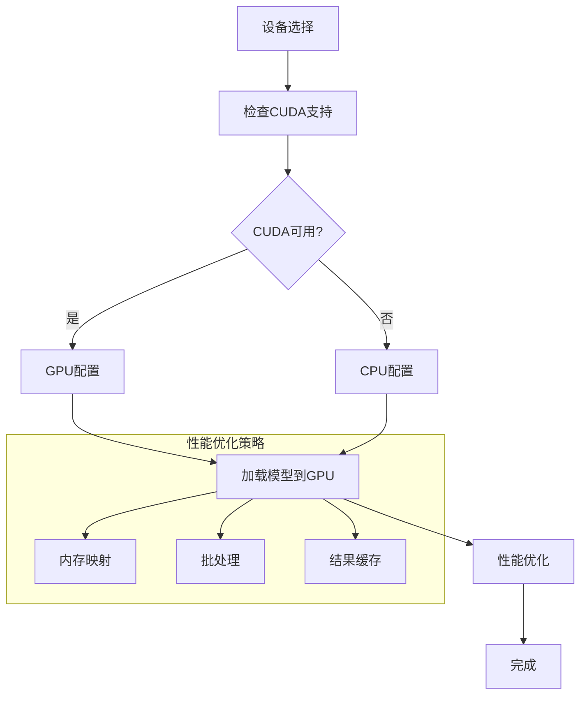

**图表来源**
- [PPOCRLabel.py](PPOCRLabel.md)

### 错误处理和恢复

系统实现了多层次的错误处理机制：

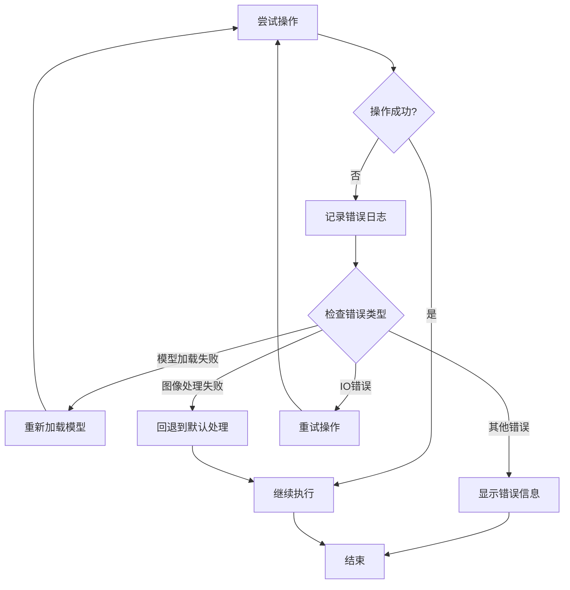

**图表来源**
- [PPOCRLabel.py](PPOCRLabel.md)

**章节来源**
- [PPOCRLabel.py](PPOCRLabel.md)

## 故障排除指南

### 常见问题及解决方案

| 问题类型 | 错误信息 | 解决方案 |
|---------|----------|----------|
| 模型加载失败 | `OSError: [WinError 126]` | 下载兼容的Shapely版本 |
| Excel打开失败 | `No python win32com` | 安装pywin32和premailer包 |
| 图像处理异常 | `module 'cv2' has no attribute 'INTER_NEAREST'` | 重新安装OpenCV 4.2.0.32版本 |
| CUDA设备不可用 | `CUDA out of memory` | 切换到CPU模式或减少批处理大小 |

### 日志记录和调试

系统提供了详细的日志记录机制，便于问题诊断：

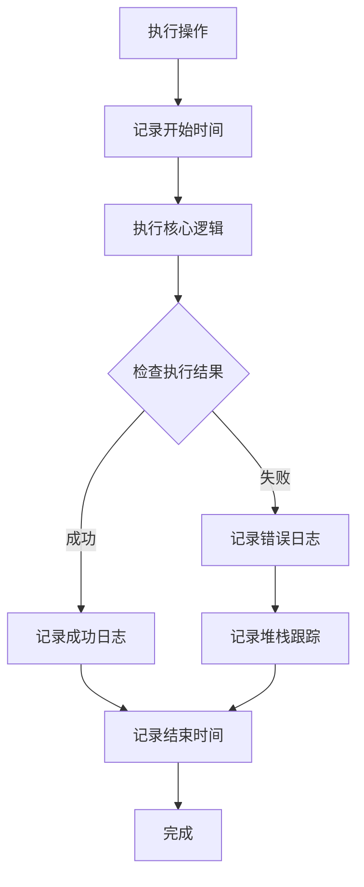

**图表来源**
- [PPOCRLabel.py](PPOCRLabel.md)

**章节来源**
- [PPOCRLabel.py](PPOCRLabel.md)

## 结论

PPStructureV3模型集成在PPOCRLabel中实现了完整的表格识别功能，具有以下特点：

1. **模块化设计**: 清晰的分层架构，便于维护和扩展
2. **性能优化**: 合理的内存管理和设备选择策略
3. **错误处理**: 完善的异常处理和恢复机制
4. **用户友好**: 直观的界面和丰富的功能选项

该集成为表格结构化提取提供了强大的技术支持，能够满足不同场景下的表格识别需求。

## 附录

### 配置参数说明

| 参数名称 | 类型 | 默认值 | 描述 |
|---------|------|--------|------|
| `use_table_recognition` | bool | True | 启用表格识别功能 |
| `use_formula_recognition` | bool | False | 启用公式识别功能 |
| `use_chart_recognition` | bool | False | 启用图表识别功能 |
| `use_seal_recognition` | bool | False | 启用印章识别功能 |
| `use_region_detection` | bool | False | 启用区域检测功能 |
| `device` | string | "cpu" | 设备选择（"cpu"或"gpu"） |

### 使用示例

```python
# 基本使用
table_ocr = PPStructureV3(device="gpu")
result = table_ocr.predict(image)

# 自定义配置
table_ocr = PPStructureV3(
    use_table_recognition=True,
    use_formula_recognition=False,
    device="gpu",
    lang="ch"
)
```

**章节来源**
- [PPOCRLabel.py](PPOCRLabel.md)
- [README.md](README.md)