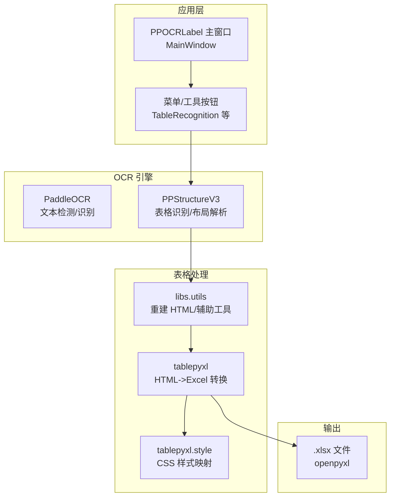
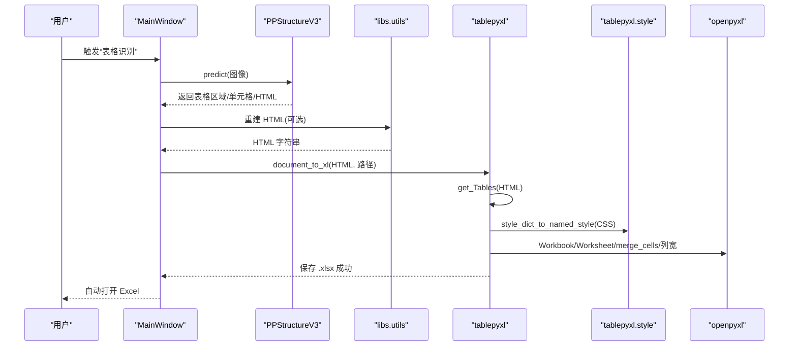
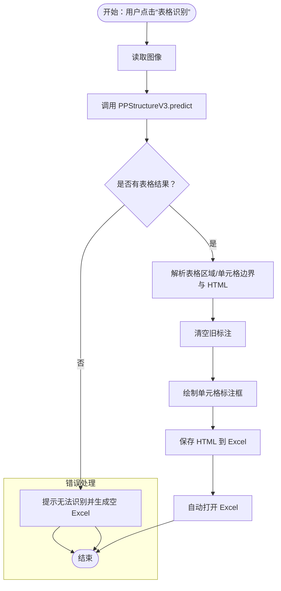
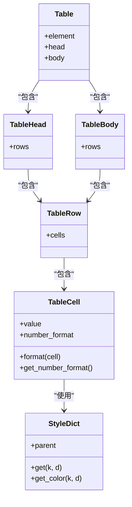
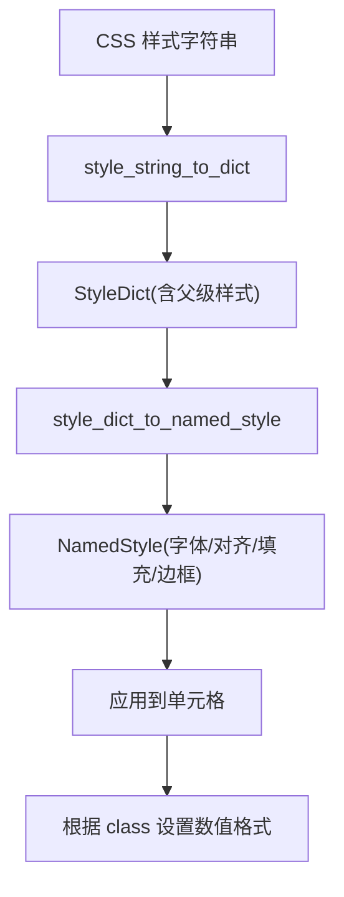
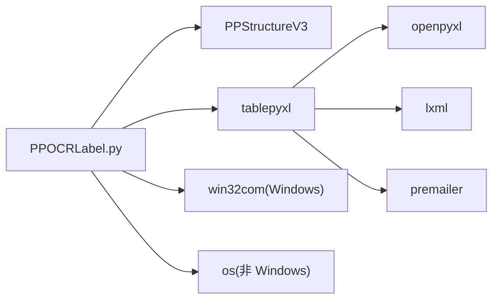

# 表格结构识别

<cite>
**本文引用的文件**
- [PPOCRLabel.py](PPOCRLabel.md)
- [tablepyxl/__init__.py](__init__.md)
- [tablepyxl/tablepyxl.py](tablepyxl.md)
- [tablepyxl/style.py](style.md)
- [libs/utils.py](utils.md)
- [README.md](README.md)
</cite>

## 目录
1. [简介](#简介)
2. [项目结构](#项目结构)
3. [核心组件](#核心组件)
4. [架构总览](#架构总览)
5. [详细组件分析](#详细组件分析)
6. [依赖关系分析](#依赖关系分析)
7. [性能考虑](#性能考虑)
8. [故障排查指南](#故障排查指南)
9. [结论](#结论)
10. [附录](#附录)

## 简介
本文件面向“表格结构识别”功能，系统性阐述 PPOCRLabel 中基于 PPStructureV3 的表格识别与 Excel 结构生成能力。内容涵盖：
- PPStructureV3 模型的集成与使用（表格检测、单元格识别、HTML 布局解析）
- tablepyxl 模块的设计架构（HTML 表格解析、样式处理、Excel 文件生成）
- 表格标注工作流（从表格识别到单元格标注再到 Excel 结构生成）
- 精度优化、错误处理与结果验证机制
- 实际使用示例与最佳实践

## 项目结构
该应用采用 PyQt5 图形界面与 PaddleOCR 生态结合，表格识别与 Excel 输出由独立的 tablepyxl 模块负责，二者通过主程序入口协同工作。

图表来源
- [PPOCRLabel.py](PPOCRLabel.md)
- [libs/utils.py](utils.md)
- [tablepyxl/tablepyxl.py](tablepyxl.md)
- [tablepyxl/style.py](style.md)

章节来源
- [PPOCRLabel.py](PPOCRLabel.md)
- [README.md](README.md)

## 核心组件
- PPStructureV3 集成
  - 在主窗口初始化中创建 PPStructureV3 实例，启用表格识别、禁用公式/图表/区域检测等选项，设备自动选择 GPU/CPU。
  - 提供 TableRecognition 方法，调用预测接口，解析返回的表格区域、单元格边界与 HTML 结构，回写标注框与 Excel 文件。
- tablepyxl 模块
  - 将 HTML 表格结构转换为 openpyxl 工作簿，支持内联样式、合并单元格、列宽计算与样式映射。
  - 提供 get_Tables、document_to_workbook、document_to_xl 等核心函数。
- 样式处理
  - 将 CSS 样式字符串解析为 openpyxl NamedStyle，支持字体、对齐、填充、边框与数值格式。
- 辅助工具
  - rebuild_html_from_ppstructure_label：根据 PPStructure 的 cells 与结构 tokens 重建 HTML 字符串，用于后续 Excel 导出。

章节来源
- [PPOCRLabel.py](PPOCRLabel.md)
- [PPOCRLabel.py](PPOCRLabel.md)
- [tablepyxl/tablepyxl.py](tablepyxl.md)
- [tablepyxl/tablepyxl.py](tablepyxl.md)
- [tablepyxl/style.py](style.md)
- [libs/utils.py](utils.md)

## 架构总览
下图展示从表格识别到 Excel 生成的关键调用链路与数据流。

图表来源
- [PPOCRLabel.py](PPOCRLabel.md)
- [libs/utils.py](utils.md)
- [tablepyxl/tablepyxl.py](tablepyxl.md)
- [tablepyxl/style.py](style.md)

## 详细组件分析

### 组件 A：PPStructureV3 集成与表格识别
- 初始化配置
  - 启用 use_table_recognition，禁用 use_formula_recognition/use_chart_recognition/use_region_detection，设备选择 GPU/CPU。
  - 预热：若本地存在测试图片则执行一次预测以确保模型加载。
- 表格识别流程
  - 读取当前图像，调用 predict 获取表格区域列表。
  - 仅支持单表场景：遍历 table_res_list，提取 rec_boxes/rec_texts 并构建 Shape 标注框。
  - 将 pred_html 传递给 tablepyxl.document_to_xl，生成 Excel。
  - 若识别失败，弹窗提示并生成空 Excel。
  - 平台差异：Windows 使用 win32com 自动打开 Excel；其他平台使用系统 open 命令。
- 单元格重识别
  - 对选中标注框进行旋转矫正裁剪，使用 TextDetection/TextRecognition 进行子区域文本检测与识别，拼接概率，更新标注框文本。

图表来源
- [PPOCRLabel.py](PPOCRLabel.md)

章节来源
- [PPOCRLabel.py](PPOCRLabel.md)
- [PPOCRLabel.py](PPOCRLabel.md)
- [PPOCRLabel.py](PPOCRLabel.md)

### 组件 B：tablepyxl 模块设计与实现
- HTML 表格解析
  - get_Tables：移除注释节点，提取所有 table 标签并封装为 Table 对象。
- 表格到工作簿
  - document_to_workbook：将 HTML 文档内联样式转换为 openpyxl 支持的样式，逐表生成工作表。
  - document_to_xl：直接保存为 .xlsx 文件。
- 行/列写入与合并单元格
  - write_rows：遍历 tr/td，处理 colspan/rowspan 合并，设置单元格值与样式，动态调整列宽。
  - insert_table/insert_table_at_cell：将 Table 结构插入到指定工作表或单元格位置。
- 样式映射
  - style_dict_to_named_style：将 CSS 属性映射为 openpyxl Font/Alignment/Fill/Border/NamedStyle。
  - StyleDict：支持父子级样式继承与颜色规范化。

图表来源
- [tablepyxl/style.py](style.md)

章节来源
- [tablepyxl/tablepyxl.py](tablepyxl.md)
- [tablepyxl/tablepyxl.py](tablepyxl.md)
- [tablepyxl/style.py](style.md)
- [tablepyxl/style.py](style.md)

### 组件 C：样式处理与 Excel 生成
- CSS 解析与命名样式
  - style_string_to_dict：将 style="..." 字符串解析为字典。
  - style_dict_to_named_style：构建 openpyxl.NamedStyle，缓存已知样式避免重复创建。
- 数值格式与单元格类型
  - 根据 class 标识（如 TYPE_CURRENCY、TYPE_INTEGER、TYPE_PERCENTAGE、TYPE_DATE）设置 openpyxl 数值格式。
- 列宽与合并单元格
  - write_rows：根据内容长度与最小/最大宽度设置列宽；处理合并单元格并跳过被合并占用的单元格。

图表来源
- [tablepyxl/style.py](style.md)
- [tablepyxl/style.py](style.md)
- [tablepyxl/tablepyxl.py](tablepyxl.md)

章节来源
- [tablepyxl/style.py](style.md)
- [tablepyxl/style.py](style.md)
- [tablepyxl/tablepyxl.py](tablepyxl.md)

### 组件 D：标注工作流与最佳实践
- 推荐流程
  - 表格识别：点击“表格识别”，自动标注单元格并生成 Excel。
  - 单元格重识别：对每个单元格标注框右键选择“单元格重识别”，模型自动识别单元格内文本。
  - 调整顺序：开启“显示框编号”，拖拽识别结果按从左到右、从上到下的顺序排列。
  - 标注结构：在 Excel 中对包含文字的单元格标记标识（如“1”），确保合并结构与原图一致。
  - 导出：关闭对应 Excel 文件后，点击“导出表格标注”生成 gt.txt。
- 最佳实践
  - 空白单元格必须标注框，保证单元格总数与图像一致。
  - 多行文本单元格建议按从上到下的顺序标注，便于后续重识别。
  - 导出前确保 Excel 已关闭，避免文件占用导致保存失败。

章节来源
- [README.md](README.md)

## 依赖关系分析
- 组件耦合
  - MainWindow 与 PPStructureV3：强耦合（预测与标注写入）。
  - MainWindow 与 tablepyxl：弱耦合（仅在导出阶段调用）。
  - tablepyxl 与 openpyxl：强耦合（Workbook/Worksheet/NamedStyle/merge_cells）。
  - tablepyxl 与 lxml/premailer：条件导入，用于 HTML 解析与内联样式转换。
- 外部依赖
  - Windows 平台：win32com 用于自动打开 Excel。
  - Linux/macOS：使用系统 open 命令打开 Excel。
- 潜在循环依赖
  - 无直接循环依赖，模块职责清晰：主程序负责交互与调用，tablepyxl 负责 HTML->Excel。

图表来源
- [PPOCRLabel.py](PPOCRLabel.md)
- [tablepyxl/tablepyxl.py](tablepyxl.md)
- [tablepyxl/tablepyxl.py](tablepyxl.md)

章节来源
- [PPOCRLabel.py](PPOCRLabel.md)
- [tablepyxl/tablepyxl.py](tablepyxl.md)
- [tablepyxl/tablepyxl.py](tablepyxl.md)

## 性能考虑
- 预热与缓存
  - 初始化时对测试图片执行一次预测，减少首次调用延迟。
  - tablepyxl 缓存已生成的 NamedStyle，避免重复创建样式对象。
- 图像处理
  - 单元格重识别前进行旋转矫正裁剪，提升识别准确率。
  - 对多行文本按从上到下顺序识别，提高整体连贯性。
- I/O 与并发
  - Excel 生成为单线程写入，建议批量导出时合并多次操作。
  - Windows 平台自动打开 Excel 为阻塞操作，建议在后台任务中执行。

## 故障排查指南
- 无法打开 Excel
  - Windows：检查是否安装 pywin32 与 win32com；确认 Excel 已安装且可启动。
  - 非 Windows：确认系统 open 命令可用，或手动打开生成的 .xlsx 文件。
- 无法保存 Excel
  - 检查路径权限与磁盘空间；若 tablepyxl 报错，回退到 openpyxl 创建空工作簿。
- 表格识别失败
  - 确认图像质量与分辨率；尝试手动标注单元格并导出。
  - 检查 PPStructureV3 模型是否正确加载与初始化。
- 样式丢失或列宽异常
  - 确保 HTML 内联样式完整；检查 CSS 属性是否被 premailer 正确转换。
  - 合并单元格时注意跳过被占用的单元格，避免覆盖。

章节来源
- [PPOCRLabel.py](PPOCRLabel.md)
- [PPOCRLabel.py](PPOCRLabel.md)
- [PPOCRLabel.py](PPOCRLabel.md)
- [tablepyxl/tablepyxl.py](tablepyxl.md)

## 结论
本功能通过 PPStructureV3 的表格识别能力与 tablepyxl 的 HTML->Excel 转换机制，实现了从图像表格到结构化 Excel 的自动化流程。主程序负责交互与调用，tablepyxl 负责样式与结构映射，二者配合形成稳定、可扩展的表格标注与导出体系。实践中应重视单元格顺序、空白单元格标注与样式兼容性，以获得更高的标注精度与导出质量。

## 附录
- 使用示例
  - 启动应用后打开图片目录，点击“表格识别”，等待自动标注与 Excel 打开。
  - 对每个单元格右键选择“单元格重识别”，调整顺序后在 Excel 中标注合并结构。
  - 关闭 Excel 后导出表格标注，生成 gt.txt。
- 相关文件
  - [PPOCRLabel.py](PPOCRLabel.md)
  - [tablepyxl/tablepyxl.py](tablepyxl.md)
  - [tablepyxl/style.py](style.md)
  - [libs/utils.py](utils.md)