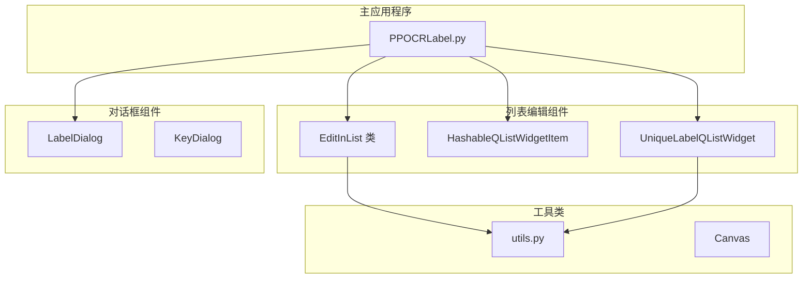
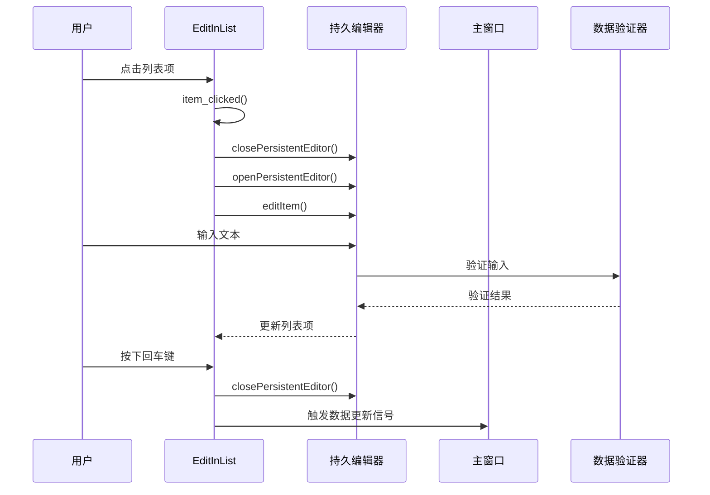
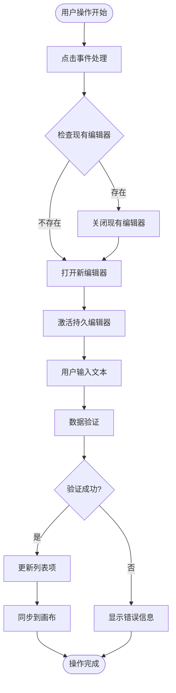
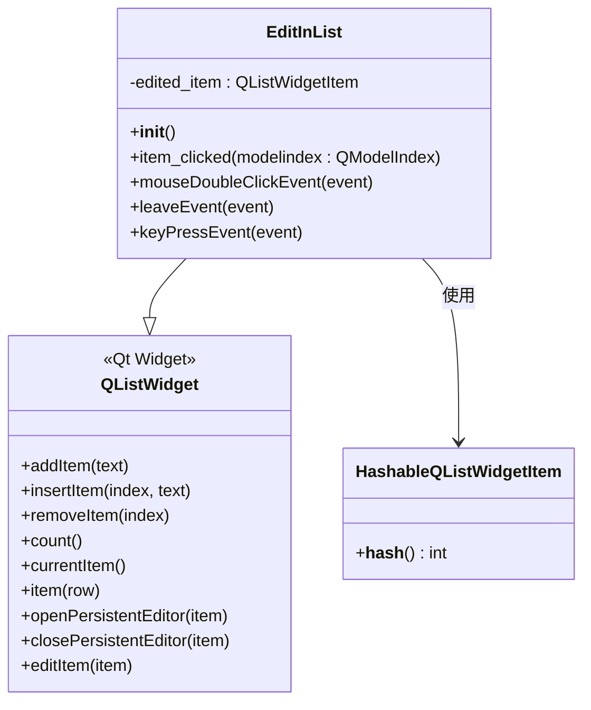
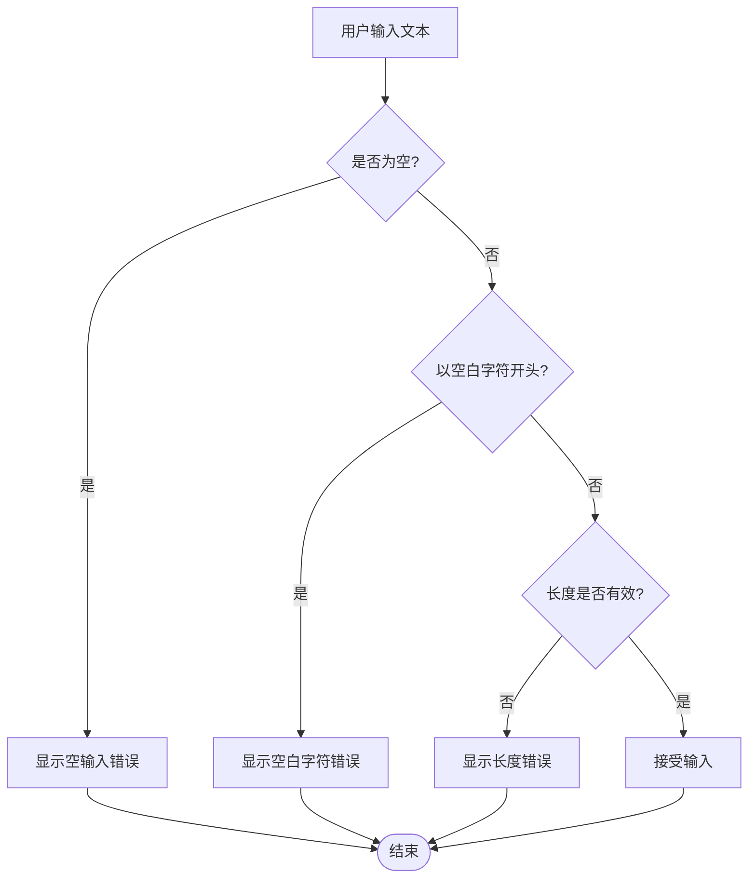
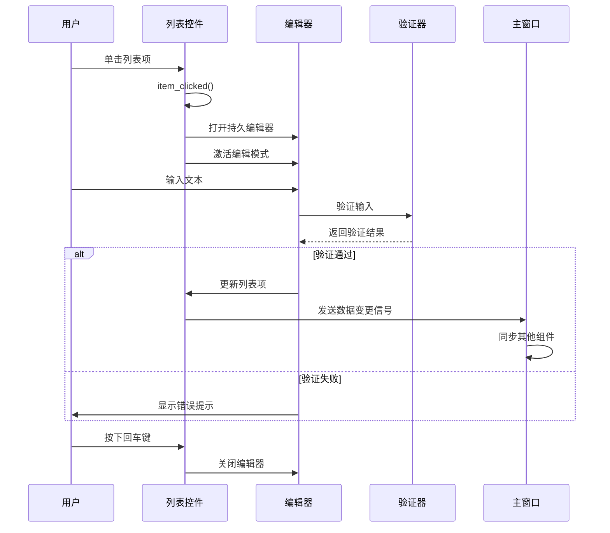
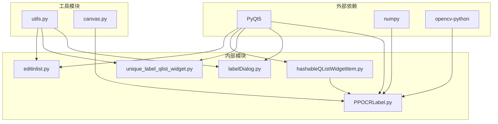

# 列表编辑组件

<cite>
**本文档引用的文件**
- [editinlist.py](editinlist.md)
- [hashableQListWidgetItem.py](hashableQListWidgetItem.md)
- [unique_label_qlist_widget.py](unique_label_qlist_widget.md)
- [labelDialog.py](labelDialog.md)
- [PPOCRLabel.py](PPOCRLabel.md)
- [README.md](README.md)
</cite>

## 目录
1. [简介](#简介)
2. [项目结构](#项目结构)
3. [核心组件](#核心组件)
4. [架构概览](#架构概览)
5. [详细组件分析](#详细组件分析)
6. [依赖关系分析](#依赖关系分析)
7. [性能考虑](#性能考虑)
8. [故障排除指南](#故障排除指南)
9. [结论](#结论)

## 简介

PPOCRLabel 是一个基于 PyQt5 的半自动图形标注工具，专门用于 OCR（光学字符识别）领域的标注工作。该项目提供了强大的列表编辑功能，允许用户直接在列表中编辑文本内容，支持批量标签编辑、列表项管理和数据验证等高级功能。

本文档专注于 `libs/editinlist.py` 模块中的列表编辑组件，深入分析其架构设计、实现原理和使用方法，为开发者提供完整的功能说明和技术指导。

## 项目结构

该项目采用模块化设计，主要组件分布如下：

**图表来源**
- [PPOCRLabel.py](PPOCRLabel.md)
- [editinlist.py](editinlist.md)
- [hashableQListWidgetItem.py](hashableQListWidgetItem.md)

**章节来源**
- [PPOCRLabel.py](PPOCRLabel.md)

## 核心组件

### EditInList 类

`EditInList` 是项目中最核心的列表编辑组件，继承自 `QListWidget`，提供了直接在列表中编辑文本的功能。

#### 主要特性
- **持久编辑器支持**：允许用户直接在列表项上进行编辑
- **键盘快捷键**：支持特定键值关闭编辑状态
- **鼠标事件处理**：提供自定义的鼠标事件响应
- **单击激活编辑**：点击列表项时自动激活编辑模式

#### 关键方法
- `item_clicked()`: 处理列表项点击事件，激活持久编辑器
- `keyPressEvent()`: 处理键盘事件，支持编辑状态切换
- `mouseDoubleClickEvent()`: 处理双击事件（当前为空实现）
- `leaveEvent()`: 处理鼠标离开事件（当前为空实现）

**章节来源**
- [editinlist.py](editinlist.md)

### HashableQListWidgetItem 类

为了支持列表项的哈希操作，项目提供了可哈希的列表项包装类。

#### 设计目的
- 解决 PyQt5 中 `QListWidgetItem` 不可哈希的问题
- 支持将列表项作为字典键或集合元素使用
- 提供稳定的对象标识符

**章节来源**
- [hashableQListWidgetItem.py](hashableQListWidgetItem.md)

### UniqueLabelQListWidget 类

这是一个增强的列表控件，专门为标签管理而设计。

#### 核心功能
- **唯一性保证**：确保相同标签不会重复添加
- **颜色支持**：支持彩色标签显示
- **用户角色数据**：通过 `Qt.UserRole` 存储标签数据
- **键盘事件处理**：支持 ESC 键清除选择

**章节来源**
- [unique_label_qlist_widget.py](unique_label_qlist_widget.md)

## 架构概览

### 组件交互流程

**图表来源**
- [editinlist.py](editinlist.md)
- [PPOCRLabel.py](PPOCRLabel.md)

### 数据流架构

**图表来源**
- [editinlist.py](editinlist.md)
- [PPOCRLabel.py](PPOCRLabel.md)

## 详细组件分析

### EditInList 类深度分析

#### 类结构图

**图表来源**
- [editinlist.py](editinlist.md)
- [hashableQListWidgetItem.py](hashableQListWidgetItem.md)

#### 编辑流程详解

1. **初始化阶段**
   - 创建 `EditInList` 实例
   - 设置 `edited_item` 为 `None`
   - 继承 `QListWidget` 的所有功能

2. **点击事件处理**
   - 检查是否存在正在编辑的项目
   - 如果存在，先关闭之前的编辑器
   - 获取目标项目并激活编辑模式
   - 打开持久编辑器并开始编辑

3. **键盘事件处理**
   - 监听特定键值（16777220, 16777221）
   - 这些键值对应回车键
   - 关闭所有列表项的编辑器

#### 性能优化特性

- **延迟初始化**：只在需要时创建编辑器实例
- **异常安全**：使用 try-except 处理可能的异常情况
- **内存管理**：及时清理不再使用的编辑器资源

**章节来源**
- [editinlist.py](editinlist.md)

### 数据验证机制

#### 验证策略

虽然 `EditInList` 类本身不包含复杂的验证逻辑，但项目提供了多种验证机制：

1. **标签验证器**：通过 `libs/utils.py` 中的 `labelValidator()` 函数
2. **输入格式验证**：确保标签文本不以空白字符开头
3. **完整性检查**：验证用户输入的有效性

#### 验证流程

**图表来源**
- [labelDialog.py](labelDialog.md)

**章节来源**
- [labelDialog.py](labelDialog.md)

### 用户交互模式

#### 交互序列图

**图表来源**
- [PPOCRLabel.py](PPOCRLabel.md)
- [editinlist.py](editinlist.md)

## 依赖关系分析

### 组件依赖图

**图表来源**
- [PPOCRLabel.py](PPOCRLabel.md)
- [editinlist.py](editinlist.md)

### 关键依赖关系

1. **PyQt5 依赖**：所有 GUI 组件的基础框架
2. **数据绑定依赖**：通过 `QListWidget` 的内置机制实现
3. **事件处理依赖**：基于 Qt 的信号槽机制
4. **验证依赖**：通过 `libs/utils.py` 提供的验证函数

**章节来源**
- [PPOCRLabel.py](PPOCRLabel.md)

## 性能考虑

### 内存管理

- **编辑器生命周期**：仅在用户交互时创建和销毁
- **异常处理**：使用 try-except 确保资源正确释放
- **对象复用**：避免不必要的对象创建和销毁

### 响应性优化

- **异步处理**：编辑操作不会阻塞主线程
- **事件过滤**：只处理必要的用户交互事件
- **批量更新**：支持批量标签编辑操作

### 可扩展性设计

- **插件架构**：易于添加新的编辑模式
- **配置支持**：支持运行时配置调整
- **接口抽象**：提供清晰的扩展点

## 故障排除指南

### 常见问题及解决方案

#### 编辑器无法关闭
**症状**：按下回车键后编辑器仍然保持开启状态
**原因**：键盘事件处理异常
**解决方法**：
1. 检查键盘事件键值映射
2. 确认 `keyPressEvent` 方法正确实现
3. 验证 Qt 事件传递机制

#### 列表项重复编辑
**症状**：多个列表项同时处于编辑状态
**原因**：编辑器状态管理问题
**解决方法**：
1. 检查 `edited_item` 属性的设置逻辑
2. 确认 `closePersistentEditor` 调用时机
3. 验证异常处理分支的正确性

#### 数据验证失败
**症状**：用户输入被拒绝但无明确错误提示
**原因**：验证器配置问题
**解决方法**：
1. 检查 `labelValidator()` 函数的实现
2. 确认输入格式要求
3. 添加适当的错误反馈机制

**章节来源**
- [editinlist.py](editinlist.md)
- [labelDialog.py](labelDialog.md)

## 结论

PPOCRLabel 的列表编辑组件展现了优秀的软件工程实践，通过以下关键设计实现了高效、可靠的列表编辑功能：

### 设计优势

1. **简洁性**：核心功能集中在 `EditInList` 类中，代码结构清晰
2. **可扩展性**：基于 Qt 的架构设计支持灵活的功能扩展
3. **用户体验**：直观的交互模式和即时反馈机制
4. **性能优化**：合理的资源管理和事件处理机制

### 技术亮点

- **持久编辑器模式**：提供无缝的编辑体验
- **事件驱动架构**：基于 Qt 信号槽机制的响应式设计
- **数据验证集成**：与项目整体验证体系的无缝集成
- **错误处理机制**：健壮的异常处理和恢复能力

### 应用场景

该组件特别适用于以下应用场景：
- OCR 文本标注和编辑
- 批量标签管理
- 数据验证和质量控制
- 用户界面交互优化

通过深入理解这些组件的设计原理和实现细节，开发者可以更好地利用和扩展 PPOCRLabel 的列表编辑功能，满足各种 OCR 标注和数据处理需求。